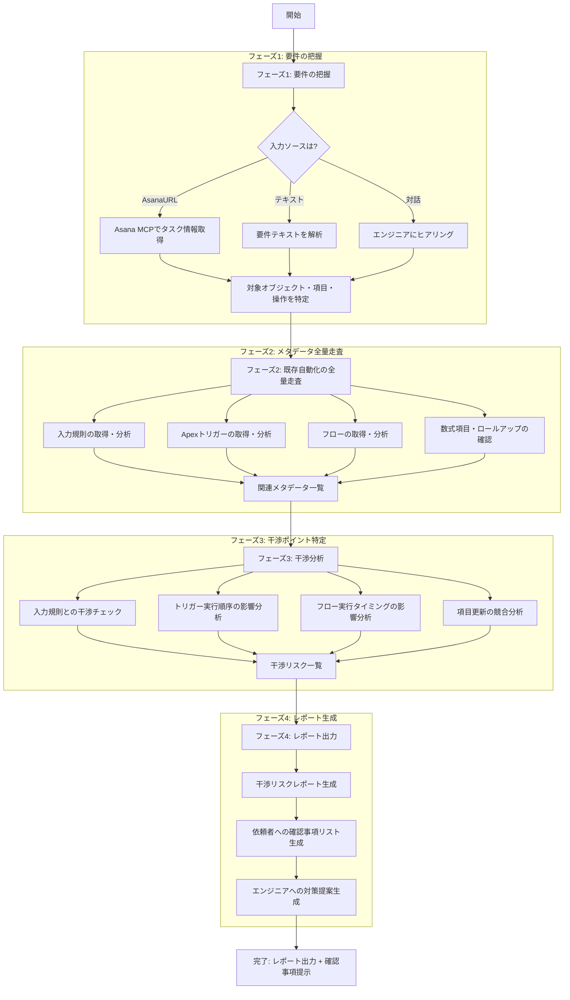

# /impact-check - 既存自動化処理 干渉チェック

## 概要

新しい要件（機能追加・変更）を実装する**前に**、対象オブジェクトの既存自動化処理との干渉リスクを自動検知するコマンド。

**背景:** 既存の入力規則（RecallCheck2等）と新規実装が干渉し、テスト段階で初めて問題が発覚してスプリント遅延が発生するケースがあった。このコマンドは要件受領時点でリスクを検知し、依頼者への確認事項を明確化する。

## トリガー

- 新規要件・機能追加の受領時
- `/requirement` コマンドのサブフェーズとして自動実行
- 設計前の事前チェックとして単独実行

## 使用方法

```
# Asanaタスクから要件を取得して干渉チェック
/impact-check [AsanaタスクURL]

# 対話形式で要件を入力して干渉チェック
/impact-check

# オブジェクト名を直接指定
/impact-check --object MoveIn__c --fields Status__c,ReasonForReCall__c --operation update

# 要件テキストを直接指定
/impact-check "MoveIn__cのStatus__c変更時に備考を自動転記したい"
```

## アーキテクチャ: 2段階チェック

本コマンドは**Pythonスクリプト（機械的走査）+ AIによる判定**の2段階で動作する。

### 第1段階: Pythonスクリプトによる機械的走査

```bash
python3 scripts/tools/impact-check.py \
  --object [オブジェクト名] \
  --fields [項目1,項目2,...] \
  --operation [insert|update|delete|upsert] \
  --output json
```

**スクリプトが行うこと（機械的・確定的）:**
- 対象オブジェクトの入力規則XMLを全件パース
- 条件式（ErrorConditionFormula）を構文解析し、ISCHANGED/ISNEW/ISBLANK等の関数と参照項目を抽出
- 対象オブジェクトのApexトリガーを全件パースし、イベント・参照項目を抽出
- 対象オブジェクトのフローXMLを全件パースし、トリガータイプ・更新項目を抽出
- 対象項目との干渉ポイントを機械的に判定（HIGH/MEDIUM/LOW/INFO）
- JSON形式で構造化された干渉レポートを出力

### 第2段階: AIによる分析・レポート生成

スクリプトの出力JSONをもとに、AIが以下を実施:
- 干渉リスクの業務的な影響度を評価
- 依頼者への確認事項を生成
- エンジニア向けの具体的な対策案を提示
- 最終レポート（Markdown）を生成・保存

### 重要: 第1段階は必ず実行する

AIの推論だけに頼らず、**必ずPythonスクリプトを実行**して機械的な走査結果を得ること。
スクリプトの出力をスキップして直接AIで分析することは禁止。

## 実行フロー



## フェーズ詳細

### フェーズ1: 要件の把握

要件から以下の情報を抽出する:

| 抽出項目 | 説明 | 例 |
|---------|------|-----|
| 対象オブジェクト | 操作対象のSalesforceオブジェクト | `MoveIn__c` |
| 対象項目 | 参照・更新される項目 | `Status__c`, `ReasonForReCall__c` |
| 操作種別 | insert / update / delete / upsert | `update` |
| 処理タイミング | Before / After / 非同期 | `Before Update` |
| 処理内容 | 何を行うか | 「Status__c変更時に備考を自動転記」 |

**ヒアリング項目（対話形式の場合）:**

```
以下の情報を教えてください:

1. 対象オブジェクト（API名）:
2. 関連する項目（API名）:
3. どのタイミングで処理が動くか（レコード作成時/更新時/削除時）:
4. 処理の概要:
5. AsanaタスクURL（あれば）:
```

### フェーズ2: 既存自動化の全量走査

対象オブジェクトに関連する**すべての自動化処理**を走査する。

#### 2-1: 入力規則（Validation Rules）

**走査対象:**
- `force-app/main/default/objects/[オブジェクト名]/validationRules/` 配下の全XMLファイル
- 設計書 `doc/detailed-design/objects/[オブジェクト名].md`

**分析ポイント:**
- 各入力規則の条件式（ErrorConditionFormula）
- 条件式で使用されている項目（ISCHANGED, ISNEW, ISBLANK等）
- Active/Inactive状態
- エラー発生条件（どの操作でブロックされるか）

```
例: RecallCheck2 の分析
- 条件: ISNEW() OR ISCHANGED(Status__c) OR ISCHANGED(ReasonForReCall__c)
- ブロック条件: Field143__c = false AND ReasonForReCall__c != blank AND CallRequestDivision__c = blank
- → Status__c を更新する処理は、この入力規則の条件に引っかかる可能性あり
```

#### 2-2: Apexトリガー

**走査対象:**
- `force-app/main/default/triggers/` 配下で対象オブジェクトに関連するトリガー
- `force-app/main/default/classes/` 配下のトリガーハンドラ
- 設計書 `doc/detailed-design/trigger/`

**分析ポイント:**
- Before/After の各タイミング
- 対象項目を参照・更新しているか
- DML操作（他オブジェクトへの波及）

#### 2-3: フロー（Flows）

**走査対象:**
- `force-app/main/default/flows/` 配下で対象オブジェクトに関連するフロー
- 設計書 `doc/detailed-design/flow/`

**分析ポイント:**
- Record-Triggered Flow のトリガー条件
- Before Save / After Save の区分
- 項目の参照・更新箇所
- エントリ条件（Entry Conditions）

#### 2-4: 数式項目・ロールアップ・ワークフロー

**走査対象:**
- 対象オブジェクトの数式項目定義
- ロールアップ集計項目
- ワークフロールール（レガシー）
- プロセスビルダー（レガシー）

### フェーズ3: 干渉分析

走査結果を基に、新しい要件との干渉ポイントを特定する。

#### 干渉パターン一覧

| パターン | 説明 | 深刻度 | 例 |
|---------|------|--------|-----|
| **入力規則ブロック** | 新処理のDMLが既存入力規則に引っかかる | 高 | 自動転記が入力規則でブロック |
| **トリガー競合** | 同一項目をBefore Triggerで上書き | 高 | 2つのトリガーが同じ項目を更新 |
| **フロー競合** | Before Save Flowと処理の競合 | 高 | フローが項目を上書き |
| **実行順序依存** | 処理の実行順序で結果が変わる | 中 | After Triggerの順序に依存 |
| **間接影響** | 数式項目・ロールアップ経由の影響 | 中 | 数式項目の再計算で条件変化 |
| **項目ロック** | 入力規則が特定条件で項目更新をブロック | 中 | ステータス遷移が制限される |

#### Salesforce実行順序の参照

```
1. System Validation Rules
2. Before Triggers (Apex)
3. Custom Validation Rules     ← ★ ここで入力規則がブロックする
4. After Triggers (Apex)
5. Assignment Rules
6. Auto-Response Rules
7. Workflow Rules
8. Before Save Flows
9. After Save Flows
10. Escalation Rules
11. Entitlement Rules
```

**重要:** Before Triggerで項目を変更しても、その後の入力規則（Custom Validation Rules）で弾かれるとDML全体がロールバックされる。

### フェーズ4: レポート出力

#### 出力先

```
doc_draft/impact-check/[依頼名 or オブジェクト名]/impact-check-report.md
```

#### レポートテンプレート

```markdown
# 干渉チェックレポート

## 基本情報

| 項目 | 内容 |
|------|------|
| チェック日 | YYYY-MM-DD |
| 対象要件 | [要件の概要] |
| Asanaタスク | [タスク名](URL) |
| 対象オブジェクト | [オブジェクト名] |
| 対象項目 | [項目一覧] |
| 操作種別 | insert / update / delete |

## 走査結果サマリー

| 自動化種別 | 件数 | 干渉リスクあり |
|-----------|------|--------------|
| 入力規則 | X件 | X件 |
| Apexトリガー | X件 | X件 |
| フロー | X件 | X件 |
| 数式項目 | X件 | X件 |
| **合計** | **X件** | **X件** |

## 干渉リスク詳細

### :red_circle: 高リスク

#### [リスク名: 例) RecallCheck2 入力規則との干渉]

| 項目 | 内容 |
|------|------|
| 種別 | 入力規則 |
| API名 | RecallCheck2 |
| 干渉パターン | 入力規則ブロック |
| 影響 | Status__c を自動更新する処理が入力規則に引っかかり、DMLが失敗する |

**条件式:**
（入力規則の条件式を記載）

**干渉の仕組み:**
（なぜ干渉するのかをステップバイステップで説明）

**対策案:**
1. [対策A] - 入力規則を修正して新処理を考慮する条件を追加
2. [対策B] - 入力規則を無効化（要：依頼者確認）
3. [対策C] - 新処理側で入力規則の条件を回避するロジックを追加

### :large_orange_circle: 中リスク

（同様の形式）

### :yellow_circle: 低リスク

（同様の形式）

## 依頼者への確認事項

以下の点について、依頼者に確認が必要です:

- [ ] [確認事項1: 例) RecallCheck2 の入力規則を修正してよいか？]
- [ ] [確認事項2: 例) 手動転記アラートの運用は廃止してよいか？]
- [ ] [確認事項3: 例) ステータス遷移の制約を緩和してよいか？]

## エンジニア向け対策

| 対策 | 内容 | 優先度 |
|------|------|--------|
| [対策1] | [具体的な実装方針] | 高 |
| [対策2] | [具体的な実装方針] | 中 |

## 実行順序図

（Mermaid図で新処理追加後の実行順序を図示）

## 走査した自動化処理の全量リスト

（走査した全メタデータの一覧を付録として記載）
```

## 走査方法の詳細

### ローカルメタデータの走査

```bash
# 入力規則の走査
force-app/main/default/objects/[オブジェクト名]/validationRules/*.validationRule-meta.xml

# トリガーの走査（ファイル名とメタデータから対象オブジェクトを特定）
force-app/main/default/triggers/*.trigger-meta.xml

# フローの走査（XML内のobject要素から対象オブジェクトを特定）
force-app/main/default/flows/*.flow-meta.xml

# Apexクラスの走査（対象オブジェクト名・項目名でgrep）
force-app/main/default/classes/*.cls
```

### Salesforce MCPの活用

```javascript
// オブジェクトのスキーマ取得（全項目・リレーション）
mcp__salesforce__salesforce_describe_object({
  objectName: "[オブジェクト名]"
})

// 入力規則の詳細取得
mcp__salesforce__salesforce_query_records({
  query: "SELECT Id, ValidationName, Active, Description, ErrorConditionFormula, ErrorMessage FROM ValidationRule WHERE EntityDefinition.QualifiedApiName = '[オブジェクト名]'"
})
```

### 設計書の参照

```
# オブジェクト設計書
doc/detailed-design/objects/[オブジェクト名].md

# トリガー設計書
doc/detailed-design/trigger/

# フロー設計書
doc/detailed-design/flow/

# 概要設計書（ドメイン単位）
doc/domains/
```

## 使用例

### 例1: RecallCheck2干渉の事前検知（今回のケース再現）

```
User: /impact-check "MoveIn__cのStatus__c変更時に再架電理由を備考社内へ自動転記したい"

AI: 干渉チェックを開始します。

## フェーズ1: 要件の把握

| 項目 | 内容 |
|------|------|
| 対象オブジェクト | MoveIn__c |
| 対象項目 | Status__c, ReasonForReCall__c, 備考社内(Field143__c) |
| 操作種別 | Update（項目自動転記） |
| 処理タイミング | Status__c 変更時 |

## フェーズ2: 既存自動化の全量走査

MoveIn__c に関連する自動化処理を走査中...

### 入力規則（3件検出）
- RecallCheck (Active)
- RecallCheck2 (Active) ← ⚠️
- RecallCheckVer2 (Active)

### トリガー（5件検出）
- MoveInBeforeTrigger
- MoveInAfterTrigger
- ...

### フロー（8件検出）
- MoveInFlow_BeforeSave
- MoveInFlow_AfterSave
- ...

## フェーズ3: 干渉分析

### 🔴 高リスク: RecallCheck2 との干渉

RecallCheck2 の条件:
  ISNEW() OR ISCHANGED(Status__c) OR ISCHANGED(ReasonForReCall__c)
  → Field143__c = false の場合にエラー

**問題:**
Status__c を変更すると RecallCheck2 が発動し、
Field143__c（備考社内）が false の状態では更新がブロックされる。
→ 自動転記処理が入力規則に引っかかり、DML全体が失敗する。

## 依頼者への確認事項

- [ ] RecallCheck2 の入力規則を修正（または無効化）してよいか？
- [ ] 手動転記アラート運用は廃止してよいか？

レポートを出力しました:
doc_draft/impact-check/再架電理由自動転記/impact-check-report.md
```

## MCP連携

| MCP | 用途 |
|-----|------|
| `salesforce` | オブジェクトスキーマ・入力規則・フロー等のメタデータ取得 |
| `github` | 関連コード・コミット履歴・PR検索 |
| `asana` | タスク情報・要件詳細の取得（AsanaURL指定時） |

## 注意事項

1. **全量走査が必須**: 対象オブジェクトの自動化処理は必ず全件走査する（一部のみの走査は禁止）
2. **ローカル + Salesforce MCP**: ローカルのメタデータファイルとSalesforce MCPの両方を使用し、差異があれば明記する
3. **設計書との照合**: 走査結果は必ずオブジェクト設計書と照合する
4. **確認事項の明確化**: 依頼者への確認事項は具体的かつアクション可能な形で記載する
5. **過剰な安全側倒しを避ける**: リスクが低い項目まで高リスクとして報告しない（ノイズ削減）

## 関連コマンド

- `/requirement` - 要件定義（干渉チェックが自動的に含まれる）
- `/investigate` - 既存仕様の詳細調査
- `/design` - 設計書作成（干渉チェック結果を踏まえて設計）
- `/build` - 実装

## `/design` との連携（メインの実行タイミング）

`/design` コマンド実行時、B-2.5フェーズとして自動的に干渉チェックが実行される。

**フロー:**
```
B-2: 設計書作成
  ↓
B-2.5: 干渉チェック（自動実行）
  1. 設計書から対象オブジェクト・項目・操作を抽出
  2. python3 scripts/tools/impact-check.py を実行
  3. 結果を概要設計書（readme.md）の「干渉チェック結果」セクションに追記
  ↓
B-3: エンジニア確認（干渉チェック結果含む）
```

設計書に対象情報が明記されているため、エンジニアが手動で入力する必要がない。

---

## 更新履歴

| 日付 | 内容 |
|------|------|
| 2026-02-05 | 初版作成 - RecallCheck2干渉問題の再発防止策として |
