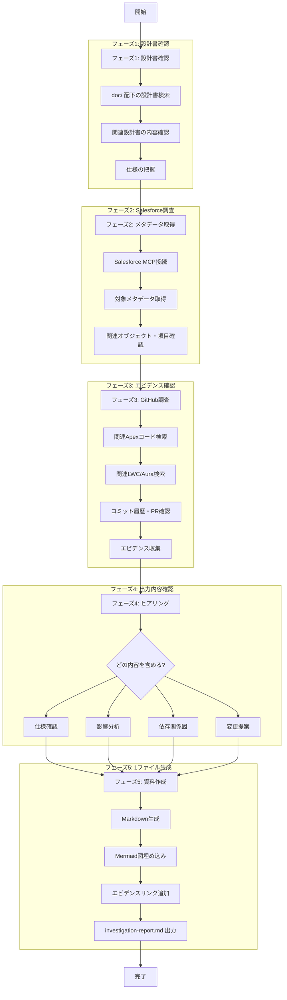

# /investigate - Salesforce 仕様調査コマンド

## 概要

Salesforce の設定・仕様を多角的に調査・精査し、Markdown ドキュメントと Mermaid 図を**1つのファイル**に出力するコマンド。

**調査フロー:**
1. **設計書確認**: `doc/` 配下の既存設計書を確認
2. **メタデータ取得**: Salesforce MCP でメタデータを取得
3. **GitHub調査**: 関連リポジトリのコードをエビデンスとして確認
4. **ヒアリング**: どのような資料を出力するか確認
5. **資料作成**: Markdown + Mermaid で資料を生成（**1ファイル**）

## 使用方法

```bash
# 入力規則の確認
/investigate validation-rule [ルール名]
/investigate validation-rule RecognitionRule

# 複数の入力規則を確認
/investigate validation-rule RecognitionRule,ReasonRecognitionRule

# オブジェクト指定で確認
/investigate validation-rule --object Account

# フローの確認
/investigate flow [フロー名]

# トリガーの確認
/investigate trigger [トリガー名]

# 全般的な仕様確認
/investigate all --object [オブジェクト名]
```

## 対応する調査対象

Salesforce の構築物すべてが調査対象です。

### メタデータ・設定

| タイプ | 説明 | コマンド引数 |
|--------|------|-------------|
| 入力規則 | Validation Rule | `validation-rule` |
| フロー | Flow / Process Builder / Screen Flow | `flow` |
| トリガー | Apex Trigger | `trigger` |
| クラス | Apex Class | `class` |
| ワークフロー | Workflow Rule | `workflow` |
| 承認プロセス | Approval Process | `approval` |
| 数式項目 | Formula Field | `formula` |
| ロールアップ集計 | Rollup Summary Field | `rollup` |
| レコードタイプ | Record Type | `record-type` |
| ページレイアウト | Page Layout | `layout` |
| LWC | Lightning Web Component | `lwc` |
| Aura | Aura Component | `aura` |
| Visualforce | Visualforce Page/Component | `visualforce` |
| レポート | Report | `report` |
| ダッシュボード | Dashboard | `dashboard` |
| カスタムオブジェクト | Custom Object | `object` |
| カスタム項目 | Custom Field | `field` |
| 権限セット | Permission Set | `permission-set` |
| プロファイル | Profile | `profile` |
| 共有ルール | Sharing Rule | `sharing-rule` |
| 全体 | オブジェクト/機能全体の構築物 | `all` |

### 調査対象リポジトリ

GitHub MCP で以下のリポジトリを調査します：

| リポジトリ | 説明 |
|-----------|------|
| `classlab_salesforce` | メインリポジトリ（本リポジトリ） |
| `cl-crm-*` | CRM関連リポジトリ群（関連システム） |

**検索対象:**
- `cl-crm-api` - API連携
- `cl-crm-batch` - バッチ処理
- `cl-crm-integration` - 外部連携
- その他 `cl-crm-` で始まるリポジトリ

## 実行フロー



## フェーズ詳細

### フェーズ1: 設計書確認

既存の設計書から仕様を把握します。

**検索対象:**
```
doc/
├── domains/              # 概要設計書
├── detailed-design/
│   ├── apex/            # Apex設計書
│   ├── trigger/         # トリガー設計書
│   ├── flow/            # フロー設計書
│   └── objects/         # オブジェクト定義書
└── manual/              # マニュアル
```

**検索方法:**
- オブジェクト名でファイル検索
- 対象名（ルール名、フロー名等）で全文検索
- 関連キーワードで検索

### フェーズ2: Salesforce メタデータ取得

Salesforce MCP を使用してメタデータを取得します。

**入力規則の場合:**
```javascript
// オブジェクトスキーマ取得
mcp__salesforce__salesforce_describe_object({
  objectName: "[オブジェクト名]"
})

// 入力規則の詳細をApex経由で取得
mcp__salesforce__salesforce_execute_anonymous({
  apexCode: `
    List<ValidationRule> rules = [
      SELECT Id, ValidationName, Active, ErrorConditionFormula, ErrorMessage
      FROM ValidationRule
      WHERE EntityDefinition.QualifiedApiName = '[オブジェクト名]'
    ];
    System.debug(JSON.serializePretty(rules));
  `
})
```

**フローの場合:**
```javascript
// フロー定義の検索
mcp__salesforce__salesforce_search_for_pattern({
  pattern: "[フロー名]",
  paths_include_glob: "force-app/**/flows/*.flow-meta.xml"
})
```

### フェーズ3: GitHub 調査（エビデンス確認）

GitHub MCP を使用して**複数リポジトリ**から関連コードとエビデンスを収集します。

**調査対象リポジトリ:**
- `classlab_salesforce` - メインリポジトリ
- `cl-crm-*` - CRM関連リポジトリ群

**調査項目:**
1. **関連Apexコード**: トリガー、クラスでの参照
2. **関連LWC/Aura**: フロントエンドでの使用
3. **外部連携コード**: cl-crm-* リポジトリでの参照
4. **コミット履歴**: 変更履歴の確認
5. **PR/Issue**: 関連する議論・決定事項

**検索例:**
```javascript
// メインリポジトリでコード検索
mcp__github__search_code({
  query: "[対象名] repo:owner/classlab_salesforce language:apex"
})

// CRM関連リポジトリ群で検索（org全体）
mcp__github__search_code({
  query: "[対象名] org:owner repo:cl-crm"
})

// 特定のCRM連携リポジトリで検索
mcp__github__search_code({
  query: "[対象名] repo:owner/cl-crm-api"
})
mcp__github__search_code({
  query: "[対象名] repo:owner/cl-crm-batch"
})

// コミット履歴
mcp__github__list_commits({
  owner: "owner",
  repo: "classlab_salesforce",
  path: "force-app/main/default/objects/[オブジェクト名]"
})

// 関連PR検索（複数リポジトリ）
mcp__github__search_pull_requests({
  query: "[対象名] org:owner"
})
```

**外部連携の確認ポイント:**
- API連携での項目/オブジェクト参照
- バッチ処理での依存
- 外部システムとのデータ同期

### フェーズ4: ヒアリング（出力内容確認）

**質問:**
```
調査が完了しました。レポートに含める内容を選択してください：

1. 仕様確認のみ
2. 仕様確認 + 影響分析
3. 仕様確認 + 影響分析 + 変更提案
4. すべて含める（推奨）

どれを選択しますか？ (1-4)
```

### フェーズ5: 資料作成

選択された内容を**1つのファイル**に生成します。

## 出力形式

### 出力先

```
doc_draft/investigate/[対象名]/investigation-report.md
```

### 出力ファイル構成 (investigation-report.md)

```markdown
# [対象名] 調査レポート

## 目次

1. [調査概要](#調査概要)
2. [仕様確認](#仕様確認)
3. [影響分析](#影響分析)
4. [変更提案](#変更提案)
5. [エビデンス](#エビデンス)

---

## 調査概要

| 項目 | 内容 |
|------|------|
| 調査日 | 2026-01-21 |
| 調査者 | AI Agent |
| 対象 | RecognitionRule, ReasonRecognitionRule |
| タイプ | 入力規則 |
| オブジェクト | Account |

---

## 仕様確認

### 設計書からの情報

> **参照元:** doc/detailed-design/objects/Account.md
>
> 認定区分（Recognition__c）は業務用レコードタイプで必須項目として定義されています。

### メタデータ情報

#### RecognitionRule

| 項目 | 値 |
|------|-----|
| API名 | RecognitionRule |
| オブジェクト | Account |
| 有効 | true |
| 作成日 | 2024-01-15 |
| 最終更新 | 2024-06-20 |

**条件式:**
\`\`\`
AND(
  ISBLANK(Recognition__c),
  RecordType.DeveloperName = "Business"
)
\`\`\`

**エラーメッセージ:** 「認定区分を入力してください」

#### ReasonRecognitionRule

| 項目 | 値 |
|------|-----|
| API名 | ReasonRecognitionRule |
| オブジェクト | Account |
| 有効 | true |

**条件式:**
\`\`\`
ISBLANK(RecognitionReason__c)
\`\`\`

**エラーメッセージ:** 「認定理由を入力してください」

---

## 影響分析

### 依存関係図

\`\`\`mermaid
graph LR
    subgraph 入力規則
        VR1[RecognitionRule]
        VR2[ReasonRecognitionRule]
    end

    subgraph 項目
        F1[Recognition__c]
        F2[RecognitionReason__c]
    end

    subgraph 自動化
        FL1[認定通知フロー]
        TR1[AccountTrigger]
    end

    VR1 --> F1
    VR2 --> F2
    F1 -.->|参照なし| FL1
    F1 -.->|参照なし| TR1
\`\`\`

### リスク評価

| 評価項目 | レベル | 説明 | エビデンス |
|----------|--------|------|-----------|
| データ整合性 | 低 | 無効化しても既存データに影響なし | AccountTrigger.cls に参照なし |
| 業務プロセス | 低 | 入力チェックのみ | doc/domains/account.md 参照 |
| 連携システム | なし | 外部連携なし | GitHub検索結果 0件 |
| コンプライアンス | なし | 規制要件なし | - |

### 総合評価

**リスクレベル: 低**

システム的なリスクはありません。False に設定可能です。

---

## 変更提案

### 提案内容

| 項目 | 内容 |
|------|------|
| 対象 | RecognitionRule, ReasonRecognitionRule |
| 変更内容 | Active: true → false |
| 理由 | システム的にリスクなし |
| 提案日 | 2026-01-21 |

### 変更手順

1. Sandbox (staging) で入力規則を無効化
2. 動作確認（レコード作成・更新）
3. 本番環境で入力規則を無効化
4. 設計書を更新

### ロールバック手順

1. 入力規則を再度有効化 (Active: true)
2. 動作確認

### 承認

| 役割 | 名前 | 日付 |
|------|------|------|
| 依頼者 | - | - |
| 承認者 | 平井 / 棟安 | - |

---

## エビデンス

### 関連コード調査結果

| ファイル | 行 | 内容 |
|----------|-----|------|
| AccountTrigger.cls | - | Recognition__c の参照なし |
| AccountService.cls | - | Recognition__c のバリデーションなし |
| LWC | - | 参照なし |

### 変更履歴

| 日付 | コミット | 内容 |
|------|---------|------|
| 2024-06-20 | abc1234 | エラーメッセージ修正 |
| 2024-01-15 | def5678 | 初期作成 |

### 関連PR/Issue

- なし

### 参照設計書

- doc/detailed-design/objects/Account.md

---

## 結論

**両方の入力規則はシステム的にリスクがないため、False に設定可能です。**

変更提案を確認の上、承認者（平井 / 棟安）へ申請してください。
```

## 使用例

### 例1: 入力規則の確認と無効化判断

```
User: /investigate validation-rule RecognitionRule,ReasonRecognitionRule

AI: Salesforce 仕様調査を開始します。

## フェーズ1: 設計書確認

doc/detailed-design/objects/Account.md を確認しています...

> 認定区分（Recognition__c）: ビジネス用レコードタイプで必須
> 認定理由（RecognitionReason__c）: 認定時に入力

関連設計書: 1件

## フェーズ2: Salesforce メタデータ取得

入力規則を取得しています...

| ルール名 | オブジェクト | 有効 | 条件 |
|----------|-------------|------|------|
| RecognitionRule | Account | true | ISBLANK(Recognition__c) |
| ReasonRecognitionRule | Account | true | ISBLANK(RecognitionReason__c) |

## フェーズ3: GitHub 調査

関連コードを検索しています...

- AccountTrigger.cls: Recognition__c の参照なし
- AccountService.cls: 参照なし
- LWC: 参照なし
- 関連PR: なし

## フェーズ4: ヒアリング

調査が完了しました。レポートに含める内容を選択してください：

1. 仕様確認のみ
2. 仕様確認 + 影響分析
3. 仕様確認 + 影響分析 + 変更提案
4. すべて含める（推奨）

User: 4

AI: すべての内容を含むレポートを生成しています...

## フェーズ5: 資料作成

以下のファイルを生成しました:

📄 doc_draft/investigate/RecognitionRule/investigation-report.md

## 結論

**両方の入力規則はシステム的にリスクがないため、False に設定可能です。**

変更提案を確認の上、承認者（平井 / 棟安）へ申請してください。
```

## 注意事項

1. **設計書を最初に確認**: 実装の意図や背景を理解する
2. **エビデンスを残す**: 判断根拠をGitHubリンクで記録
3. **ヒアリングで確認**: 必要な内容を選択
4. **本番変更前に承認**: 必ず承認者の確認を得る

## 関連コマンド

- `/context-fetch` - 関連情報の取得
- `/design` - 設計書作成
- `/build` - 実装・変更の実行

---

## 更新履歴

| 日付 | 内容 |
|------|------|
| 2026-01-21 | 初版作成 - 5フェーズ構成（設計書確認→メタデータ→GitHub調査→ヒアリング→資料作成） |
| 2026-01-21 | コマンド名を /sf-spec-review から /investigate に変更 |
| 2026-01-21 | 出力を1ファイル（investigation-report.md）に統合 |
