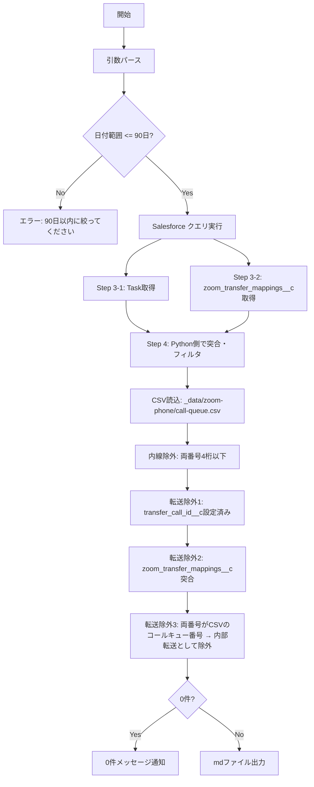

# /transfer-miss-match - 転送ミスマッチ調査コマンド

## ガードレール（厳守事項）

> **このコマンドは読み取り専用（READ ONLY）です。以下を厳守してください。**

1. **SELECT クエリのみ許可** - `salesforce_query_records` / `salesforce_aggregate_query` のみ使用すること
2. **DML 操作の絶対禁止** - `salesforce_dml_records`（INSERT / UPDATE / DELETE / UPSERT）は**いかなる理由があっても実行しない**
3. **Anonymous Apex の実行禁止** - `salesforce_execute_anonymous` は**絶対に使用しない**（DML が含まれる可能性があるため）
4. **メタデータ変更の禁止** - `salesforce_manage_object` / `salesforce_manage_field` / `salesforce_write_apex` / `salesforce_write_apex_trigger` は**使用しない**
5. **ユーザーから更新を依頼された場合** - 「このコマンドは調査専用のため、データの更新・変更は行えません」と回答し、**操作を拒否する**

## 概要

Salesforce本番環境にMCP接続し、WhatId が `001A7000005awXnIAI`（ClassLab Account）に紐づく Task を取得し、**転送以外**の不整合レコードを検出・調査するコマンド。

**背景:**
- ZoomWebHookController は着信/発信の架電履歴を Task として記録する
- 転送処理（warm_transfer）では WhatId が固定で `001A7000005awXnIAI` に設定される（TransferRebindScheduler で後から正しい紐付先に更新される想定）
- 転送 Task は `transfer_call_id__c` が設定済み → これらは正常動作のため**除外**
- `transfer_call_id__c` が NULL なのに WhatId が `001A7000005awXnIAI` のままの Task が「ミスマッチ」の調査対象

## 引数

```
$ARGUMENTS
```

### 引数フォーマット

以下のパラメータを受け付けます（すべて任意、組み合わせ可能）:

| パラメータ | 形式 | 説明 | 例 |
|-----------|------|------|-----|
| 日付範囲 | `YYYY-MM-DD~YYYY-MM-DD` | 調査対象の日付範囲（CreatedDate） | `2026-03-01~2026-03-31` |
| callId | `callId:xxx` | 特定の call_ID__c で絞り込み | `callId:abc123def456` |
| 架電番号 | `number:xxx` | classlab_number__c または destination_number__c に一致 | `number:0312345678` |

### 日付範囲の上限

**最大90日間** まで指定可能。90日を超える場合はエラーメッセージを表示して終了する。

> **理由:** Task は1日あたり約413件（外線）、SOQLクエリ結果上限は50,000件。90日で約37,000件のため安全マージンを確保。

### 使用例

```bash
# 日付範囲で調査
/transfer-miss-match 2026-03-01~2026-03-31

# 特定のcallIdで調査
/transfer-miss-match callId:abc123def456

# 架電番号で調査
/transfer-miss-match number:0312345678

# 組み合わせ
/transfer-miss-match 2026-03-01~2026-03-31 number:0312345678

# 引数なし（本日のデータを調査）
/transfer-miss-match
```

## 実行フロー



## 実行手順

### Step 1: 引数パース

ユーザーの `$ARGUMENTS` から以下を抽出する:

- **日付範囲**: `YYYY-MM-DD~YYYY-MM-DD` 形式を検出 → `startDate`, `endDate` に分割
  - 柔軟な形式も受け付ける（例: `2026/3/1~3/31`、`直近7日分` 等は適宜解釈）
- **callId**: `callId:` プレフィックスの値を抽出
- **架電番号**: `number:` プレフィックスの値を抽出
- **引数なし**: デフォルトで本日（TODAY ~ TODAY）

### Step 2: 日付範囲バリデーション

- `endDate - startDate` が **90日を超える** 場合:
  - 「日付範囲が90日を超えています。SOQLクエリ上限（50,000件）に到達する可能性があるため、90日以内に絞ってください。」と通知して**終了**

### Step 3: Salesforce クエリ実行（2クエリを並列実行）

> **重要:** IN句によるAPI制限回避のため、2つのクエリを**独立して実行**し、Python側で突合する。

#### Step 3-1: Task 取得

```sql
SELECT Id, Subject, call_ID__c, transfer_call_id__c, call_type__c,
       classlab_number__c, destination_number__c, Status,
       WhatId, WhoId, CreatedDate, Callkey__c
FROM Task
WHERE WhatId = '001A7000005awXnIAI'
  AND transfer_call_id__c = null
  AND CreatedDate >= {startDate_UTC}
  AND CreatedDate <= {endDate_UTC}
ORDER BY CreatedDate DESC
```

**callId 指定時は追加条件:**
```sql
  AND call_ID__c = '{callId}'
```

**架電番号指定時は追加条件:**
```sql
  AND (classlab_number__c = '{number}' OR destination_number__c = '{number}')
```

> **注意:** `startDate_UTC` / `endDate_UTC` はJST→UTC変換済み（例: JST 2026-03-31 → UTC 2026-03-30T15:00:00Z ~ 2026-03-31T14:59:59Z）

#### Step 3-2: zoom_transfer_mappings__c 取得（同じ日付範囲）

```sql
SELECT call_id__c, transfer_call_id__c
FROM zoom_transfer_mappings__c
WHERE CreatedDate >= {startDate_UTC}
  AND CreatedDate <= {endDate_UTC}
```

> **ポイント:** IN句を使わず日付範囲のみで取得することで、API制限（URL長・IN句上限）を回避。1日あたり約97件のため90日でも約8,700件で安全。

### Step 4: Python側でフィルタリング・突合

取得した2つのデータセットをPython（またはローカル処理）で突合し、以下の3段階でフィルタする:

#### フィルタ1: 内線通話を除外

`classlab_number__c` と `destination_number__c` の**両方が4桁以下**のTaskを除外する。

#### フィルタ2: transfer_call_id__c 設定済みを除外（SOQLで実施済み）

Step 3-1 の WHERE句で `transfer_call_id__c = null` を指定しているため、既に除外済み。

#### フィルタ3: zoom_transfer_mappings__c との突合で転送紐付け待ちを除外

Step 3-2 で取得した `zoom_transfer_mappings__c` の `transfer_call_id__c` の値セットを作成し、Taskの `call_ID__c` がその中に含まれるものを**転送紐付け待ち**として除外する。

```
transfer_call_ids = {m.transfer_call_id__c for m in mappings}
mismatch_tasks = [t for t in tasks if t.call_ID__c not in transfer_call_ids]
```

> **背景:** `upsertTransferOnly()` のロジックでは、転送開始イベント受信時に `zoom_transfer_mappings__c.call_id__c` = 転送先の通話ID、`zoom_transfer_mappings__c.transfer_call_id__c` = 転送元の通話IDが記録される。TransferRebindScheduler が未処理の場合、Task の `transfer_call_id__c` は NULL のままだが、`zoom_transfer_mappings__c` には記録が存在する。

#### フィルタ4: コールキュー番号同士の通話を除外（内部転送）

`_data/zoom-phone/call-queue.csv` を読み込み、全コールキュー番号（内線番号 + 電話番号）のセットを構築する。
Taskの `classlab_number__c` と `destination_number__c` の**両方**がこのセットに含まれる場合、コールキュー間の内部転送として除外する。

```python
# CSV読み込み
import csv
cq_numbers = set()
with open('_data/zoom-phone/call-queue.csv') as f:
    reader = csv.reader(f)
    next(reader)  # ヘッダースキップ
    for row in reader:
        ext = row[0].strip()
        phones = row[1].strip()
        if ext:
            cq_numbers.add(ext)
        if phones:
            for p in phones.split(','):
                p = p.strip()
                if p:
                    cq_numbers.add(p)

# フィルタ: 両方がコールキュー番号 → 除外
def normalize(num):
    return (num or '').replace('-', '').strip()

mismatch_tasks = [
    t for t in mismatch_tasks
    if not (normalize(t.classlab_number__c) in cq_numbers
            and normalize(t.destination_number__c) in cq_numbers)
]
```

> **CSVファイル:** `_data/zoom-phone/call-queue.csv`（gitignored）
> - ヘッダー: `内線番号,電話番号`
> - Zoom Phone管理画面のコールキュー一覧からエクスポート
> - 電話番号はハイフンなしで格納
> - CSVが存在しない場合はこのフィルタをスキップし、警告メッセージを表示する

### Step 5: 分類

フィルタ後の各Taskを以下に分類する:

| 分類 | 条件 | 意味 |
|------|------|------|
| **マッチング失敗** | `zoom_transfer_mappings__c` の `call_id__c` にも `transfer_call_id__c` にも存在しない | 電話番号から入居/取引先が特定できなかった |
| **転送紐付け漏れ** | `zoom_transfer_mappings__c` の `call_id__c` に存在する | TransferRebindScheduler で紐付けされるべきだが未処理 |

### Step 6: 結果をmdファイルに出力

**0件の場合:** mdファイルは出力せず、「ミスマッチ Task は 0件でした。」とユーザーに通知して終了する。

**1件以上の場合:** 結果を以下のパスにmdファイルとして出力する:

**出力先:** `doc_draft/investigate/transfer-miss-match/transfer-miss-match_{startDate}_{endDate}.md`

**ファイル内容テンプレート:**

```markdown
# 転送ミスマッチ調査結果

## 調査条件

| 項目 | 値 |
|------|-----|
| 調査日 | YYYY-MM-DD |
| 対象期間 | {startDate} ~ {endDate}（JST） |
| WhatId | 001A7000005awXnIAI |
| 追加条件 | {callId / number / なし} |
| 除外条件 | 転送Task（transfer_call_id__c設定済み）、内線同士（両番号4桁以下）、転送紐付け待ち（zoom_transfer_mappings__c該当）、コールキュー間通話（CSV該当） |

## フィルタ経過

| フィルタ段階 | 件数 |
|-------------|------|
| Task取得（transfer_call_id__c=null） | N件 |
| → 内線除外後 | N件 |
| → 転送紐付け待ち除外後 | N件 |
| → コールキュー間通話除外後（最終結果） | N件 |

## 検出件数サマリ

| 分類 | 件数 |
|------|------|
| ミスマッチTask（最終結果） | N件 |
| うちマッチング失敗 | N件 |
| うち転送紐付け漏れ | N件 |
| うち発信 | N件 |
| うち着信 | N件 |

## ミスマッチ一覧

| No | TaskId | CreatedDate(JST) | Subject | call_ID__c | call_type__c | classlab_number__c | destination_number__c | 分類 |
|----|--------|-----------------|---------|------------|-------------|--------------------|-----------------------|------|
| 1 | ... | ... | ... | ... | ... | ... | ... | マッチング失敗 |

## 分析・所見

（ミスマッチの傾向、原因の推測、対応案を記載）
```

**出力後:** ファイルパスをユーザーに通知する

## 除外ロジックまとめ

```
取得: WhatId = '001A7000005awXnIAI' AND transfer_call_id__c = null

除外1（SOQL）: transfer_call_id__c が設定済みのTask
  → 正常に転送処理されたTask

除外2（Python）: classlab_number__c と destination_number__c の両方が4桁以下
  → 内線同士の通話（紐付け対象外のため正常動作）

除外3（Python）: zoom_transfer_mappings__c の transfer_call_id__c に
  Task の call_ID__c が一致するもの
  → 転送紐付け待ち（TransferRebindScheduler 未処理だが転送であることは確実）

除外4（Python）: classlab_number__c と destination_number__c の両方が
  _data/zoom-phone/call-queue.csv のコールキュー番号に一致するもの
  → コールキュー間の内部転送（顧客通話ではない）
```

## 注意事項

1. **本番環境への接続**: 読み取り専用のクエリのみ実行する（DML操作は行わない）
2. **日付範囲上限**: 最大90日間。超過時はエラー終了する
3. **タイムゾーン**: 引数の日付はJSTとして解釈し、SOQL実行時にUTCに変換する（JST 00:00 = UTC前日 15:00）
4. **API呼び出し回数**: 1実行あたり2回（Task + zoom_transfer_mappings__c）。SF CLIのqueryMoreによる自動paginationあり

## 関連コマンド

- `/investigate` - Salesforce 仕様調査
- `/context-fetch` - 関連情報の取得

## 関連ソース

- `force-app/main/default/classes/ZoomWebHookController.cls` - Webhook処理・Task作成
- `force-app/main/default/classes/TransferRebindScheduler.cls` - 転送紐付けバッチ
- `doc/domains/ZoomPhone/機能設計/05_transfer-rebind.md` - 転送紐付け設計書
- `doc/domains/ZoomPhone/機能設計/01_webhook-call-history.md` - Webhook処理設計書
