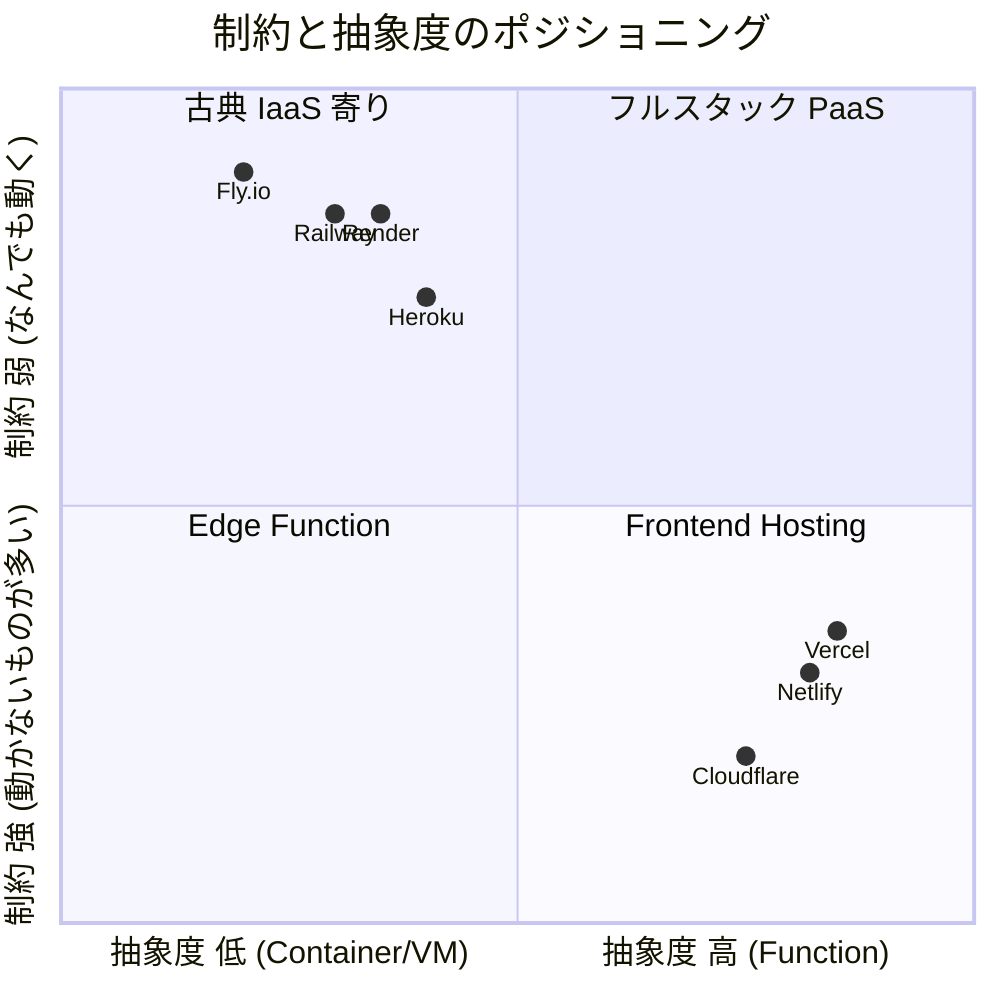
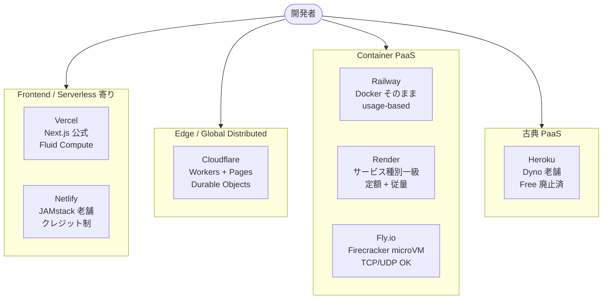
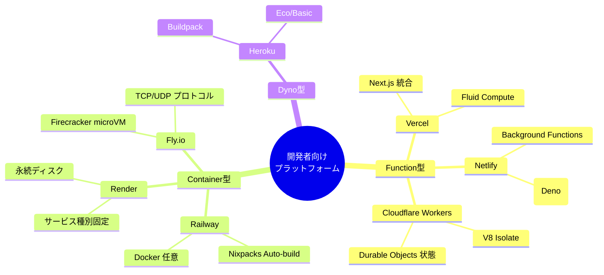
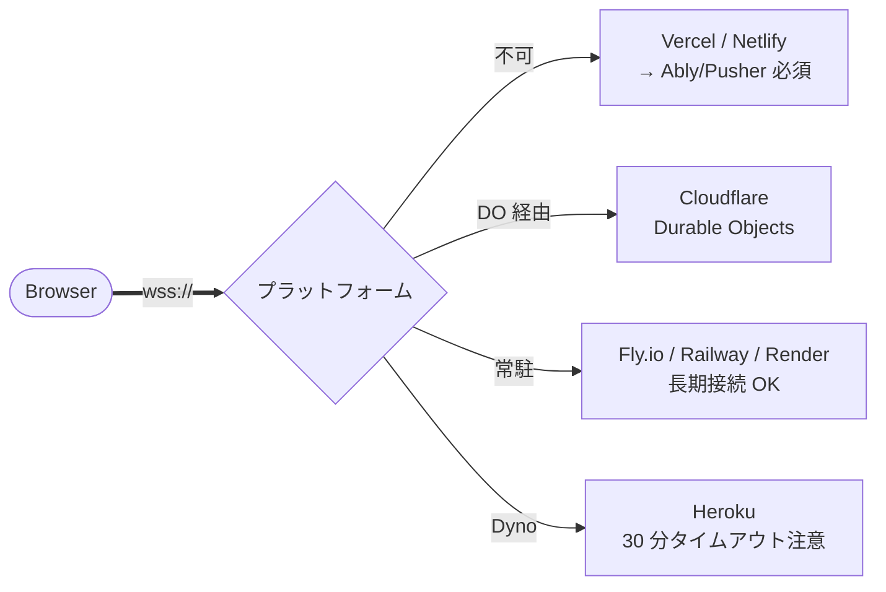
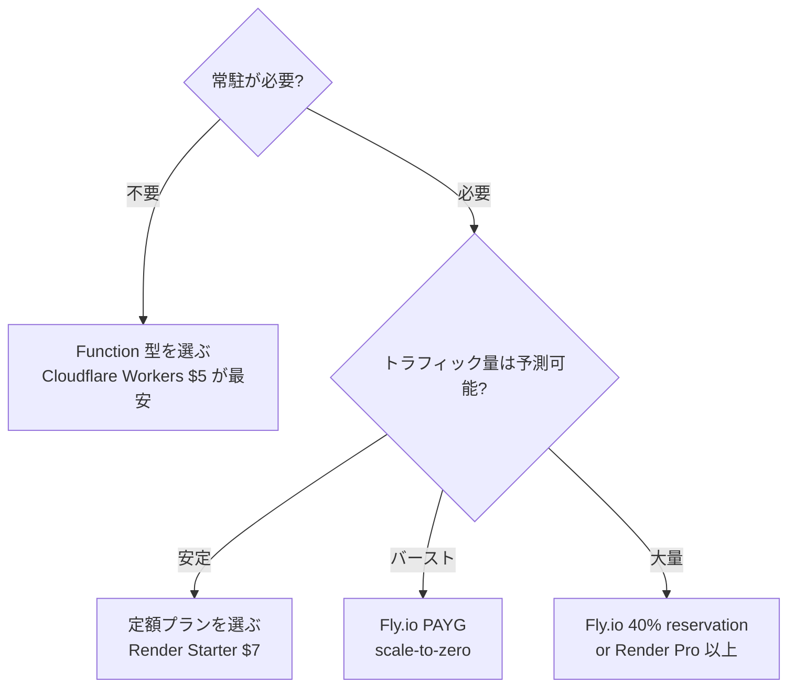
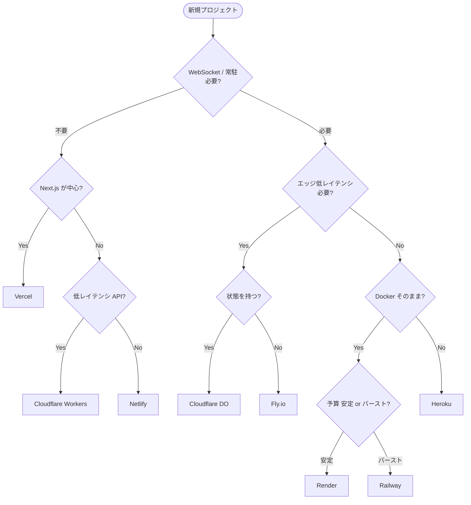

> **対象**: 新規プロジェクトのホスティング先を決めるエンジニア / Heroku Free 廃止後の移管先を探しているチーム / 「WebSocket が動くプラットフォームはどこ？」を 5 分で結論にしたい人。

LLM の訓練データは 2024 年以前に偏っており、「Vercel は Node.js が限定的」「Heroku に Free Tier がある」など現状とズレた情報を返すことがあります。本記事は 2026 年 5 月時点の **公式ドキュメント + 主要比較記事** をクロスチェックし、機能 × プラットフォームのマトリクスで意思決定を支援することを目的としています。


## 目次

- 0. TL;DR と旧知識の上書き
- 1. プラットフォーム全体マップ
- 2. 一発比較表
- 3. 機能 × プラットフォーム制約マトリクス
- 4. 機能別深掘り
- 5. ユースケース別ベストプラクティス
- 6. 料金構造の罠
- 7. 採用判断フロー
- 8. 公式リファレンス

---

## 0. TL;DR

### 7 社の一行ポジショニング

- **Vercel** — Next.js を中心としたフロント／エッジ。`Fluid Compute` で Node.js フル機能化、WebSocket サーバはまだ不可。
- **Netlify** — Vercel の対抗。クレジット制で計算量を一本化。Functions は 10 秒 / Background は 15 分。
- **Cloudflare (Workers + Pages)** — 真のエッジ。WebSocket / TCP / Durable Objects で **状態を持てる** 唯一のエッジ。$5/月固定。
- **Railway** — Heroku 後継筆頭。Docker そのまま動く。usage-based、WebSocket OK、ボリューム 1 枚制約あり。
- **Render** — Railway と双璧。WebSocket / 永続ディスク / Cron / Worker が **全部一級市民**。プラン固定型の安心感。
- **Fly.io** — Firecracker microVM。エッジ Postgres、TCP/UDP、長時間 WebSocket 接続が強い。**GPU は 2026/8 で廃止**。
- **Heroku** — 安定の老舗だが **2022/11 に Free 完全廃止**。Eco $5、Basic $7。学習コストの低さだけが利点。

### 旧知識との差分（LLM 訓練データ上書き宣言）

| 古い認識 | 2026-05 時点の正解 |
|---|---|
| Vercel は Node.js が限定的 | **Fluid Compute** で Node.js フル機能、最大 13 分実行 (Pro)、Active CPU 課金 |
| Vercel Edge Functions が推奨 | Edge Functions は非推奨化、**Fluid Compute** に集約 |
| Vercel で WebSocket サーバが動く | **動かない**。サードパーティ (Ably/Pusher) または Cloudflare DO 推奨 |
| Cloudflare Workers は 30 秒制限 | Workers Paid は最大 **30 分 / DO は最大 5 分 CPU**。`scale-to-zero` 課金で I/O 待ち無課金 |
| Heroku に Free Tier がある | **2022/11/28 完全廃止**。最安は Eco $5 (Sleep あり) |
| Render は per-seat 課金 | 2026 に **per-seat 廃止**、コンプート + プラン定額のみ |
| Netlify Pro は seat 課金 | **2026/4/14 から定額** $20/月で人数無制限 |
| Fly.io は固定プラン (Launch/Scale) | **pay-as-you-go のみ**。固定プラン廃止 |
| Fly.io で GPU が使える | **2026/8/1 で廃止**。GPU 推論は別プラットフォームへ |
| Railway は Free Tier がある | **Trial 30 日 $5 クレジット** のみ。以後 Hobby $5/月 |

### 制約と抽象度のポジショニング



---

## 1. プラットフォーム全体マップ

### 1.1 7 サービスの俯瞰



### 1.2 思想の対比



---

## 2. 一発比較表

| 項目 | Vercel | Netlify | Cloudflare (W+P) | Railway | Render | Fly.io | Heroku |
|---|---|---|---|---|---|---|---|
| **最安有料 / 月** | $20/seat | $9 (Personal) | $5 (アカウント) | $5 (Hobby) | $7 (Starter) | 完全 PAYG | $5 (Eco) |
| **無料枠** | Hobby (個人のみ) | Free 300 cred | 100k req/日 (Free) | $5 trial 30 日 | Free (Sleep) | $0 PAYG (初回 $5) | **無し** |
| **課金モデル** | Active CPU + 帯域 | クレジット制 | リクエスト + CPU 時間 | 秒単位 vCPU/RAM | プラン + 従量 | 秒単位 PAYG | Dyno 時間 |
| **デプロイ単位** | Function | Function | Worker (Isolate) | コンテナ | サービス種別 | Machine (microVM) | Dyno |
| **ビルド方式** | Auto / Custom | Auto / Custom | Wrangler | Nixpacks / Docker | Auto / Docker | Buildpack / Docker | Buildpack / Docker |
| **デフォルトタイムアウト** | 5 分 (Pro) | 10 秒 (sync) | 30 秒 / DO 5 分 | 無制限 | 無制限 | 無制限 | 30 秒 (HTTP) |
| **最大タイムアウト** | 13 分 (Fluid) | 15 分 (Background) | 30 分 (Workers Paid) | 無制限 | 無制限 | 無制限 | 30 秒 (HTTP) |
| **WebSocket サーバ** | 不可 | 不可 | 利用可 (DO) | 利用可 | 利用可 | 利用可 | 利用可 |
| **永続ストレージ** | 不可 | 不可 | R2 / KV / D1 / DO | ボリューム 1 枚 | 永続ディスク | Volumes | Add-ons |
| **DB 同居** | 不可 | 不可 | D1 (SQLite) | PG/MySQL/Mongo/Redis | PG / KV | Postgres / LiteFS | Postgres / Redis |
| **Cron** | Cron Jobs (Pro) | Scheduled Func | Cron Triggers | サービス cron 5 分単位 | Cron Jobs 12h 上限 | Scheduled Machines | Scheduler Add-on |
| **リージョン数** | 18 (Edge) | グローバル CDN | 330+ (PoP) | US / EU / Asia 数拠点 | 5 拠点 | 30+ 拠点 | US / EU |
| **Docker サポート** | 限定的 | 不可 | 不可 (Workers) | フル | フル | フル | フル |

---

## 3. 機能 × プラットフォーム制約マトリクス（最重要）

凡例: **利用可** = ネイティブサポート / **制限あり** = 条件付き or 工夫が要る / **不可** = サポート対象外 / **従量課金** = メータード

### 3.1 ネットワーク / プロトコル

| 機能 | Vercel | Netlify | Cloudflare | Railway | Render | Fly.io | Heroku |
|---|---|---|---|---|---|---|---|
| HTTP/HTTPS | 利用可 | 利用可 | 利用可 | 利用可 | 利用可 | 利用可 | 利用可 |
| WebSocket サーバ | 不可 (3rd party 必須) | 不可 | 利用可 (DO 推奨) | 利用可 | 利用可 (期限なし) | 利用可 (得意領域) | 利用可 |
| WebSocket クライアント | 利用可 | 利用可 | 利用可 | 利用可 | 利用可 | 利用可 | 利用可 |
| SSE (Server-Sent Events) | 利用可 (Fluid) | 制限あり (10s) | 利用可 | 利用可 | 利用可 | 利用可 | 利用可 |
| gRPC サーバ | 不可 | 不可 | 制限あり (Tunnel 経由) | 利用可 | 利用可 | 利用可 | 利用可 |
| Raw TCP リスナ | 不可 | 不可 | 制限あり (開発中) | 利用可 | 利用可 | 利用可 (得意領域) | 不可 |
| Raw UDP | 不可 | 不可 | 制限あり (開発中) | 利用可 | 制限あり | 利用可 | 不可 |
| HTTP/2 | 利用可 | 利用可 | 利用可 | 利用可 | 利用可 | 利用可 | 利用可 |
| HTTP/3 (QUIC) | 利用可 | 利用可 | 利用可 | 制限あり | 制限あり | 制限あり | 不可 |
| 静的 IP / Egress IP | Pro 以上 | Enterprise | 利用可 | 制限あり | Pro 以上 | 利用可 (Anycast) | Add-on |

### 3.2 計算 / ランタイム

| 機能 | Vercel | Netlify | Cloudflare | Railway | Render | Fly.io | Heroku |
|---|---|---|---|---|---|---|---|
| 常駐プロセス (Always-on) | 不可 | 不可 | 不可 (DO で疑似可) | 利用可 | 利用可 | 利用可 | 利用可 |
| 長時間ジョブ (> 15 分) | 不可 (13 分上限) | 不可 (15 分上限) | 利用可 (30 分 + Queues) | 利用可 | 利用可 | 利用可 | 利用可 (Worker Dyno) |
| バックグラウンドワーカー | 制限あり (Queues) | Background Functions | Queues + Workers | 利用可 (専用 service) | 利用可 (専用種別) | 利用可 | 利用可 (Worker Dyno) |
| Cron / 定期実行 | 利用可 | 利用可 (30s 上限) | Cron Triggers | 5 分単位以上 | 12h 上限 | 利用可 | Scheduler Add-on |
| GPU | 不可 | 不可 | 利用可 (Workers AI) | 制限あり | 利用可 | **2026/8 廃止** | 不可 |
| マルチコンテナ同居 | 不可 | 不可 | 不可 | 不可 (別 service) | 不可 (別 service) | 利用可 (Multi-container) | 不可 |
| Bun / Deno ネイティブ | Bun 利用可 | Deno (Edge) | 利用可 | Bun 利用可 | Bun 利用可 | 利用可 | 利用可 |
| WebAssembly | 利用可 | 利用可 | 利用可 (得意領域) | 利用可 | 利用可 | 利用可 | 利用可 |

### 3.3 ストレージ / 状態

| 機能 | Vercel | Netlify | Cloudflare | Railway | Render | Fly.io | Heroku |
|---|---|---|---|---|---|---|---|
| 永続ファイル書き込み | 不可 (Blob のみ) | 不可 (Blobs のみ) | 不可 (R2/KV/DO) | 利用可 (1 枚) | 利用可 | 利用可 (Volumes) | 不可 (Ephemeral) |
| マネージド Postgres 同居 | 利用可 (Marketplace) | 利用可 (Marketplace) | 不可 | 利用可 | 利用可 | 利用可 | 利用可 |
| マネージド Redis / KV | 利用可 (KV) | 利用可 (Blobs) | 利用可 (KV) | 利用可 | 利用可 | 制限あり (Upstash) | 利用可 |
| オブジェクトストレージ | Blob | Blobs | R2 (S3 互換) | Object Storage | 不可 (S3 連携) | Tigris (S3 互換) | 不可 (S3 連携) |
| Sticky Session | 不可 | 不可 | 利用可 (DO) | 制限あり | 不可 | 制限あり | 利用可 (Session Affinity Add-on) |
| DB マイグレーション実行 | 不可 (外部) | 不可 (外部) | 不可 (外部) | 利用可 (Release) | 利用可 (Pre-deploy) | 利用可 (release_command) | 利用可 (Release Phase) |

### 3.4 運用 / DevOps

| 機能 | Vercel | Netlify | Cloudflare | Railway | Render | Fly.io | Heroku |
|---|---|---|---|---|---|---|---|
| Preview 環境 (PR 単位) | 利用可 (強い) | 利用可 (強い) | 利用可 (Pages) | 利用可 | 利用可 | 制限あり | 利用可 (Review Apps) |
| 環境変数管理 | 利用可 | 利用可 | 利用可 | 利用可 (シンプル) | 利用可 | 利用可 | 利用可 |
| シークレット管理 | 利用可 | 利用可 | 利用可 (Secrets Store) | 制限あり (audit 弱) | 利用可 | 利用可 | 利用可 |
| Rolling Release / Canary | 利用可 (Rolling Releases) | 制限あり | 利用可 (Version) | 不可 | 制限あり | 利用可 | 利用可 (Pipeline) |
| ログ保持期間 | 1h / 1d / 3d | 24h / 7d | 1d / 7d | 7d / 30d | 7d / 30d | 30d | 1500 行 (拡張は Add-on) |
| トレーシング / OTel | 利用可 | 制限あり | 利用可 | 制限あり | 制限あり | 利用可 | Add-on |
| VPC / Private Network | Enterprise | Enterprise | 利用可 (WARP) | 利用可 (Private) | 利用可 (Private) | 利用可 (6PN) | Private Spaces |
| ステージング → 本番昇格 | Promote | Promote | Version Upload | Redeploy | 自動 | 手動 | Pipeline |

### 3.5 ランタイム言語サポート

| 言語 | Vercel | Netlify | Cloudflare | Railway | Render | Fly.io | Heroku |
|---|---|---|---|---|---|---|---|
| Node.js | 利用可 | 利用可 | 利用可 (Worker) | 利用可 | 利用可 | 利用可 | 利用可 |
| Python | 利用可 (3.13/3.14) | 利用可 | 利用可 (Workers Python) | 利用可 | 利用可 | 利用可 | 利用可 |
| Go | 制限あり (Functions) | 制限あり | 制限あり (WASM) | 利用可 | 利用可 | 利用可 | 利用可 |
| Rust | 利用可 (Functions) | 制限あり | 利用可 (Workers) | 利用可 | 利用可 | 利用可 | 制限あり |
| PHP / Laravel | 不可 | 不可 | 不可 | 利用可 | 利用可 | 利用可 | 利用可 |
| Ruby / Rails | 不可 | 不可 | 不可 | 利用可 | 利用可 | 利用可 | 利用可 (得意領域) |
| Java / JVM | 不可 | 不可 | 不可 | 利用可 | 利用可 | 利用可 | 利用可 |
| Bun | 利用可 | 制限あり | 不可 | 利用可 | 利用可 | 利用可 | 制限あり |
| Deno | 制限あり | 利用可 (Edge) | 不可 | 利用可 | 利用可 | 利用可 | 制限あり |
| 任意 Docker | 不可 | 不可 | 不可 | 利用可 | 利用可 | 利用可 | 利用可 |

---

## 4. 機能別深掘り

### 4.1 WebSocket / リアルタイム通信




LINE/Slack 風チャット、共同編集、リアルタイムダッシュボード、コラボツールを作るなら **WebSocket サーバが立てられるか** で 9 割の選定が決まります。差別化点は以下のとおりです。

- **Cloudflare Durable Objects** は WebSocket と「同じ Object」のメモリで状態を持てる唯一の Edge ソリューション。受信メッセージは 20:1 で課金 (100 万メッセージ = 5 万リクエスト換算)。
- **Fly.io** は microVM で Anycast。グローバル分散の長期 WebSocket が得意。
- **Vercel / Netlify** は構造的に不可。Pusher / Ably / Soketi を別途立てるか、Cloudflare DO に逃がす設計が必須。

### 4.2 Cron / バックグラウンドジョブ

| プラットフォーム | Cron 機構 | 最短間隔 | 最長実行 | 注意点 |
|---|---|---|---|---|
| Vercel | Cron Jobs | 1 分 | 13 分 (Fluid) | Pro 以上 |
| Netlify | Scheduled Functions | 1 分 | **30 秒** | 30 秒超は Background Functions (15 分) |
| Cloudflare | Cron Triggers | 1 分 | 30 分 | Workers Paid 必須 |
| Railway | Service cron | **5 分** | 無制限 | サービス全体に schedule 付与 |
| Render | Cron Job | 1 分 | **12 時間** | 12h 超は Background Worker |
| Fly.io | Scheduled Machines | 1 分 | 無制限 | Machine を起動/停止 |
| Heroku | Scheduler Add-on | 10 分 | Dyno 上限 | 別途 Add-on |

### 4.3 永続ストレージ / ファイル書き込み

```mermaid
flowchart TD
    Q{ファイル書き込みが要る?}
    Q -->|要る| VOL{永続化が要る?}
    Q -->|不要| FN[Function 型でも OK<br/>Vercel/Netlify/CF]
    VOL -->|要る| PERSIST[Railway/Render/Fly.io<br/>→ Volumes/Disks]
    VOL -->|要らない| TEMP[/tmp で十分<br/>Function 型 OK]
    PERSIST --> WARN["Railway: 1 service 1 volume<br/>Render: 1 service 1 disk<br/>Fly.io: Machine と紐付け"]
```

### 4.4 Edge / レイテンシ最適化

| 観点 | 最強 | 妥当 | 不向き |
|---|---|---|---|
| グローバル分散 PoP 数 | Cloudflare (330+) | Fly.io (30+), Vercel (18) | Heroku (US/EU のみ) |
| Cold Start | Cloudflare (V8 Isolate, ms 単位) | Vercel Fluid (instance reuse) | Fly.io (microVM) |
| エッジ KV | Cloudflare KV | Vercel Edge Config | — |
| エッジで状態保持 | **Cloudflare DO** (唯一) | — | — |

---

## 5. ユースケース別ベストプラクティス

### 5.1 Next.js / SSR フロントエンド

| 推奨度 | プラットフォーム | 理由 |
|---|---|---|
| ★★★ | **Vercel** | Next.js 公式。ISR / PPR / Cache Components 完全対応。Fluid Compute で API Routes も快適 |
| ★★ | Netlify | Next.js Runtime あり。ただし Vercel ほど追従が早くない |
| ★★ | Cloudflare Pages | OpenNext で運用可。エッジ KV と組み合わせると低コスト |
| ★ | Render / Railway | SSR の常駐サーバとして可。ISR は手動実装 |

### 5.2 Rails / Django / Laravel モノリス

| 推奨度 | プラットフォーム | 理由 |
|---|---|---|
| ★★★ | **Render** | サービス種別が固定 (Web + Worker + Cron + DB) で迷わない |
| ★★★ | **Railway** | Dockerfile そのまま動く。Heroku 後継として最有力 |
| ★★ | Fly.io | LiteFS + Postgres でレプリケーション。設計力が要る |
| ★★ | Heroku | 学習コストゼロ。料金は割高 |

### 5.3 リアルタイム WebSocket サーバ

| 推奨度 | プラットフォーム | 理由 |
|---|---|---|
| ★★★ | **Cloudflare DO** | Edge で状態保持。WebSocket Hibernation で接続維持コスト最小化 |
| ★★★ | **Fly.io** | Anycast で地理的に近い拠点へ吸着。長期接続が得意 |
| ★★ | Railway / Render | 普通のサーバとして動く。スケールアウトは自前 |
| 不可 | Vercel / Netlify | 構造的に不可。Pusher/Ably 等を併用 |

### 5.4 Cron / バッチ / ETL

| 推奨度 | プラットフォーム | 理由 |
|---|---|---|
| ★★★ | **Render** | Cron Job が一級市民。12h 超なら Worker に切替 |
| ★★★ | **Railway** | Service に schedule 付与で完結 |
| ★★ | Cloudflare Cron Triggers | 軽量タスク (< 30 分) なら最安 |
| ★ | Vercel Cron Jobs | 13 分超は不可。重い処理は Queue 経由 |

### 5.5 グローバル低レイテンシ API

| 推奨度 | プラットフォーム | 理由 |
|---|---|---|
| ★★★ | **Cloudflare Workers** | 330+ PoP、V8 Isolate で ms cold start |
| ★★ | Vercel Functions | Fluid Compute で Cold Start 改善、18 リージョン |
| ★★ | Fly.io | 30+ 拠点で常駐 |

### 5.6 GPU / AI 推論

| 推奨度 | プラットフォーム | 理由 |
|---|---|---|
| ★★★ | **Cloudflare Workers AI** | エッジ GPU。Llama 系モデルがそのまま叩ける |
| ★★★ | **Render** | NVIDIA L4 / L40S インスタンスあり |
| 不可 | Fly.io | **2026/8 で GPU 廃止**。移行先選定が必要 |
| ★ | Railway / Heroku | 公式 GPU なし |

### 5.7 ステートフル + DB 同居

| 推奨度 | プラットフォーム | 理由 |
|---|---|---|
| ★★★ | **Fly.io** | アプリと Postgres を同一拠点に。LiteFS でレプリ |
| ★★★ | **Railway** | DB を「1-click 同居」、network 経由で完結 |
| ★★★ | **Render** | DB + Web + Worker を 1 プロジェクトで完結 |
| 不可 | Vercel / Netlify | 構造的に DB ホストしない (Marketplace 経由のみ) |

---

## 6. 料金構造の罠

### 6.1 各社の課金軸

```mermaid
gantt
    title 課金される時間軸（リクエスト寿命）
    dateFormat X
    axisFormat %s

    section Vercel Fluid
    待ち時間 (無課金)     :a1, 0, 800
    Active CPU 課金       :a2, after a1, 200

    section Cloudflare
    I/O 待ち (無課金)     :b1, 0, 700
    CPU 時間課金          :b2, after b1, 300

    section Railway / Render
    リクエスト全体 課金 :c1, 0, 1000

    section Fly.io
    Machine 起動中 全部課金 :d1, 0, 1000

    section Heroku
    Dyno 起動中 全部課金 :e1, 0, 1000
```



### 6.2 落とし穴

| プラットフォーム | 罠 |
|---|---|
| **Vercel** | Active CPU は外部 API 待ちが無課金。**ただし帯域 (Fast Data Transfer) が別建てで高い**。 |
| **Netlify** | クレジット制で計算が読みづらい。本番デプロイ毎に 15 credit、Function 1GB-h あたり 5 credit。 |
| **Cloudflare** | $5/月固定 + リクエスト。**Durable Objects の SQLite ストレージは 2026/1 から有償化**。WebSocket は 20:1 で課金。 |
| **Railway** | バーストトラフィックで usage-based 課金が **予測できないほど膨らむ**。Hobby $5 → 簡単に超過。 |
| **Render** | プラン固定で安心、ただし **GPU L4 $0.90/h** など重ワークロードは高額化。Free は Sleep。 |
| **Fly.io** | **Volume は Machine 停止中も課金**。スケール to zero しても Disk 代は残る。 |
| **Heroku** | Eco は 1000h/月の共有プール。**Add-ons (Postgres / Redis / Scheduler)** が積み上がると Total Cost of Ownership が高騰。 |

### 6.3 コスト最適化フロー



---

## 7. 採用判断フロー

### 7.1 新規プロジェクトでの選択フロー




### 7.2 撤退判断のシグナル

| プラットフォーム | 撤退検討シグナル |
|---|---|
| Vercel | 帯域コストが計算リソースを超え始めた / WebSocket が必須化 |
| Netlify | クレジット制が予算オーバー / Vercel への移行が容易な状況 |
| Cloudflare | DO の制限 (10 GB SQLite) に近づいた / 任意 Docker が必要 |
| Railway | 月の超過課金が定額プランより高い / 安定性問題が業務影響 |
| Render | GPU コストが妥当でなくなった / トラフィックが定額プラン枠を超えて急増 |
| Fly.io | GPU 廃止 (2026/8) で別途プラットフォームが必要 / 設計の複雑さが運用コストに |
| Heroku | Add-on の積み上げで TCO が Railway/Render の 2 倍以上 |

---

## 8. まとめ

開発者向けプラットフォームの選定は「最強の一社」ではなく「**自分のワークロードと制約の交点**」で決まります。本記事のマトリクスを判断の起点に使ってください。

迷ったら以下の 3 つを最初に確認します。

1. **WebSocket / 常駐が必要か** — Yes なら Vercel / Netlify は除外
2. **任意 Docker が必要か** — Yes なら Railway / Render / Fly.io / Heroku の 4 択
3. **予算が安定 or バーストか** — 安定なら Render の定額、バーストなら Fly.io PAYG

---

## 9. 公式リファレンス

- [Vercel Pricing](https://vercel.com/pricing) / [Vercel Limits](https://vercel.com/docs/limits) / [Fluid Compute](https://vercel.com/docs/fluid-compute)
- [Netlify Pricing](https://www.netlify.com/pricing/) / [Netlify Functions Overview](https://docs.netlify.com/build/functions/overview/)
- [Cloudflare Workers Pricing](https://developers.cloudflare.com/workers/platform/pricing/) / [Workers Limits](https://developers.cloudflare.com/workers/platform/limits/) / [Durable Objects](https://developers.cloudflare.com/durable-objects/)
- [Railway Pricing](https://railway.com/pricing) / [Railway Cron, Workers, Queues](https://docs.railway.com/guides/cron-workers-queues)
- [Render Pricing](https://render.com/pricing) / [Render WebSockets](https://render.com/docs/websocket) / [Render Persistent Disks](https://render.com/docs/disks)
- [Fly.io Resource Pricing](https://fly.io/docs/about/pricing/) / [Fly.io Cost Management](https://fly.io/docs/about/cost-management/) / [WebSockets and Fly](https://fly.io/blog/websockets-and-fly/)
- [Heroku Free Tier Removal FAQ](https://help.heroku.com/RSBRUH58/removal-of-heroku-free-product-plans-faq) / [Heroku Low-Cost Plans](https://help.heroku.com/KP5RQQVO/low-cost-plans-faq)
