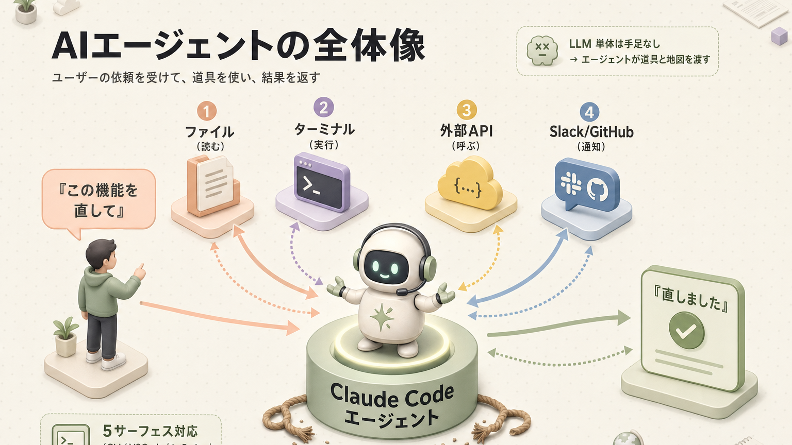
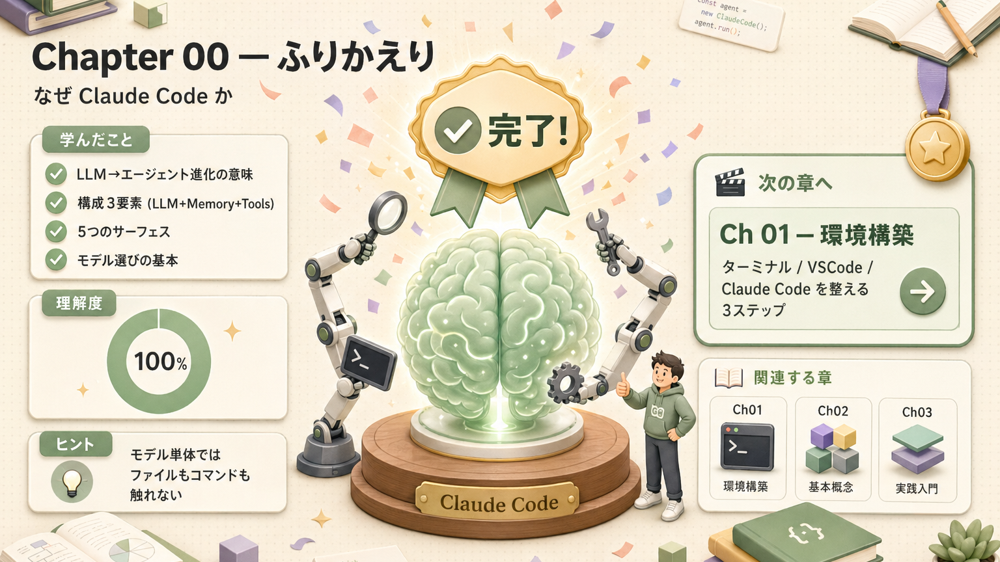

> **この章のゴール**
> - 「LLM（大規模言語モデル）」「AIエージェント」「Claude Code」の関係をひと言で説明できる
> - Claude Code が他のAIツールと何が違うのかを言える
> - これから何を学ぶか、頭の中の地図ができる

**所要時間：約10分**

---

> ##  読み始める前に：必ず一度は目を通してほしい注意事項
>
> Claude Code は強力な道具です。**包丁と同じで、握り方を間違えると指を切ります**。
> 学習を始める前に、**[付録 C. 注意事項](/articles/claude-code-a3-cautions) を一度は通読** してください。
> 全部覚えなくて大丈夫です。**「こういうリスクがあるんだ」と頭の片隅に置いておく** だけで、事故率がぐっと下がります。
>
> 特に押さえてほしいのは:
> - **権限を与えすぎない**（[§1](/articles/claude-code-a3-cautions#1-権限設計の鉄則与えすぎないが正解)）
> - **APIキー・個人情報の扱い**（[§2](/articles/claude-code-a3-cautions#2-機密情報apiキー個人情報piiの扱い)）
> - **⭐ 複合リスクの罠**（[§4](/articles/claude-code-a3-cautions#4--複合リスクの罠単独で安全でも組み合わせると爆弾)） — メール送信×個人情報取得 などの組み合わせ事故
>
> → **[ A3. 注意事項を今すぐ開く](/articles/claude-code-a3-cautions)**

---

## 1. AIに「実行」までやらせられる時代がきた

ChatGPT のようなチャットAI、つまり LLM（Large Language Model = 大規模言語モデル）は、ひとことで言うと **「文章を入れたら文章を返してくれる、めちゃくちゃ賢い自動販売機」** です。質問を放り込むと、答えが文章で返ってくる。それ以上でもそれ以下でもありません。

ところが、この LLM 単体には、**ファイルを読んだり、コマンドを実行したり、外部のサービスを呼んだり、Slack に通知を送ったり** する能力はないんです。たとえるなら、「めちゃくちゃ博識な天才」が部屋の中にいて、口は達者だけど **手足が縛られている状態**。

そこで、この賢い頭脳に **手足と道具と地図を持たせたもの** が AIエージェント（LLM を中心に、自律的に作業できるよう仕立てたシステム）です。

Claude Code は **Anthropic（Claude を作っている会社）公式の AIエージェント** で、ターミナル / VS Code / JetBrains（IntelliJ などの開発ソフト） / デスクトップアプリ / Webブラウザ という **5つの場所** から使えます。要は、**どこからでも呼び出せる賢い助手** だと思ってください。

---

## 2. Claude Code は何が違うのか

世の中には Cursor、Codex、Windsurf、GitHub Copilot、Gemini CLI など、AIコーディングツール（コードを書くのを手伝ってくれるAIサービス）がやたらとあります。「正直どれ使えばいいの？」状態ですよね。わかります。

その中で Claude Code が **2026年4月時点で最有力** と言われる理由は、ざっくり 3つです。

### 理由1：賢いだけじゃなく「ちゃんと言うことを聞く」

Claude Opus 4.7 / Sonnet 4.6 は、**指示追従性（instruction following = 指示にどれだけ忠実かという性能）** がとても高いです。

「こう書いて」「これは使うな」と指示したとき、**ちゃんと守ってくれる率** が他社モデルより高いんです。料理で言うと、**「天才シェフだけど注文と全然違うもの作ってくる人」より、「ちゃんと注文通りに作ってくれる安定派」** のほうが、結局ありがたいですよね。それです。

ハルシネーション（Hallucination = AIが自信満々に嘘をつく現象）も少なく、**コントロールしやすい** のが強みです。

### 理由2：ハーネス（足場）の作り込みが頭ひとつ抜けてる

モデルが賢いだけでは、エージェントとしては動きません。**ファイルをどう渡すか / どんな順番で道具を使うか / 失敗したらどう戻すか**、そういう「足場（ハーネス）」の作り込みが必要なんです。

ハーネスを登山で例えると、**ロープとカラビナと安全装具**。これがないと、いくら本人がアスリートでも登れません。Claude Code はこの足場が他より圧倒的に整っています。詳しくは [第10回](/articles/claude-code-10-harness-design) で扱います。

### 理由3：使い回しやすい仕組みが標準で揃ってる

- **CLAUDE.md** — プロジェクト固有の指示書（毎回自動で読まれるメモ）
- **Skills**（スキル） — オンデマンドで読み込まれる専門知識ファイル
- **Subagents**（サブエージェント） — 専門タスクに分業させる仕組み
- **Hooks**（フック） — 「このタイミングで必ず動かす」を保証する自動処理
- **MCP**（Model Context Protocol） — 外部サービスとつなぐ統一規格

これらが最初から揃っていて、**チームでそのまま共有できる**。新人が入ってきても、設定をコピーすれば即同じ環境で働ける、みたいな感覚です。

---

## 3. コードが書けなくても、Claude Code は使える

Claude Code は「コードを書ける人だけのツール」ではありません。

| やりたいこと | 必要な前提知識 |
|---|---|
| メールの返信文ドラフト | ターミナル（パソコンに文字で命令を出す画面）に `claude` と打てれば OK |
| 議事録の整形 | ファイルを保存して開けるレベル |
| データの集計（CSV → 表） | Claude にお願いするだけ |
| 競合リサーチ → 比較表 | プロンプト（指示文）を書く力だけ |
| 簡単な業務システム改修 | 軽い読み書き + 質問する力 |

ぶっちゃけ、**「Claude さん、これお願い」って言葉で頼めるなら、もうほぼ使える** ということです。この資料は **「ターミナルって何？」レベルから** 始めて、**「自分の業務を Claude Code で自動化する」** ところまで、地続きで案内します。

---

## 4. この資料の使い方

**読み方のコツ**：
-  がついている箇所は **危険・注意** のサイン（地雷だと思ってください）
-  がついている箇所は **やってみる** ハンズオン（手を動かすターン）
-  がついている箇所は **小ネタ・知っておくと得** （飲み会で語れるやつ）

>  **【必読】[付録 C. 注意事項](/articles/claude-code-a3-cautions)** — 学習を始める前、または 第2回「はじめてのセッション」を試す前に、**必ず一度は目を通してください**。事故事例と予防策がまとまっています。

---

## 5. 用語ミニ辞典

ざっくり押さえておくと、後の章がスッと入ります。

| 用語 | ひと言で |
|---|---|
| **LLM**（Large Language Model） | 大規模言語モデル。文章を入れたら文章を返す賢い自動販売機 |
| **AIエージェント** | LLM に手足（道具）と記憶（メモ）をつけて、自分で動けるようにしたもの |
| **Claude Code** | Anthropic 製の AIエージェント。本資料の主役 |
| **ハーネス**（harness） | エージェントを動かすための足場・枠組み（登山の安全装具イメージ） |
| **コンテキスト**（context） | 1 回の推論でモデルに渡せる入力（トークン列）の上限。LLM 自体は記憶を持たず、毎ターン履歴ごと再投入される（ワーキングメモリの比喩で語られるが、人間の短期記憶とは別物） |
| **トークン**（token） | テキストを小さく刻んだ単位。AIが料金や容量を測るときの単位。日本語1文字 ≒ 1〜2トークン |
| **ターミナル** | パソコンに文字で命令を出す道具。次章で解説 |
| **CLAUDE.md** | プロジェクトに置く指示書。毎セッション自動で読まれる |
| **MCP**（Model Context Protocol） | 外部サービスをエージェントにつなぐための共通規格 |

---

## ふりかえり

ここまでで、**LLM とエージェントの違い、Claude Code が選ばれる理由、これから学ぶ範囲** がふんわり頭に入ったはずです。完璧に覚える必要はありません。**「あ、こういう全体像なのね」** くらいで OK。

次の章で、いよいよ手を動かし始めます。**最大の難関「環境構築」を一緒に越えていきましょう。**

## 関連する章

-  **【必読】事故予防**：[付録 C. 注意事項](/articles/claude-code-a3-cautions) — 学習を始める前に必ず一度は目を通す
-  **すぐ始める**：[第1回 環境構築](/articles/claude-code-01-environment)
-  **概念の続き**：[第3回 Claude Code を理解する](/articles/claude-code-03-understanding) — 5サーフェスと2層モデル
-  **役割で選ぶ**：[第14回 役職別 学習パス](/articles/claude-code-14-role-based-paths) — 自分に最短のルート

## 次へ

→ [第1回 環境構築：ターミナル / VSCode / Claude Code](/articles/claude-code-01-environment)

| | |
|---|---|
| ⬅ 前へ | （ここがスタート） |
|  次へ | [第1回 環境構築](/articles/claude-code-01-environment) |
|  目次 | [README.md](./README.md) |