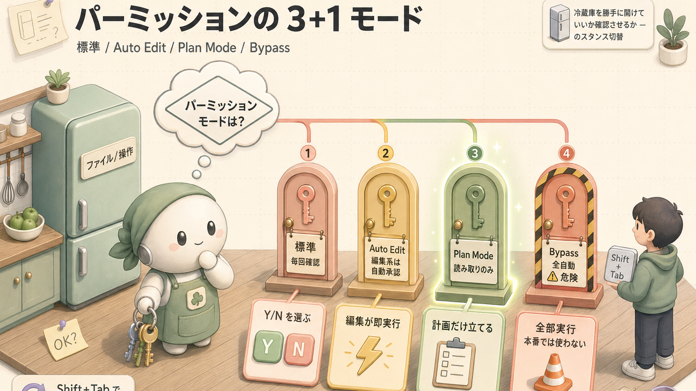

> **この章のゴール**
> - Claude Code の **基本ループ**（起動→依頼→確認→終了）を体験する
> - **手を動かして** 「打った → こう変わった」を積み重ねる
> - パーミッション（権限：何をやっていいかを決めるルール）の仕組みを理解する

**所要時間**：約20分（手を動かしながら）

> **この章の特徴**：座学ではなく **手を動かす章** です。お湯を沸かしながらでもOK、**ターミナルを開いて一緒に進めてください**。「動いた！」を5回くらい体験できる構成にしてあります。

---

## 1. 1分で分かる Claude Code の基本ループ

Claude Code を使う流れは、**レストランで料理を注文するのとほぼ同じ** です。注文する → 出てくる → 食べてみる → OK なら次のオーダー、違ったら作り直してもらう。それだけ。


これが Claude Code を使う **すべての基本** です。あとは「どんな依頼を、どれくらいのサイズでするか」「途中で何をどう設定するか」のバリエーションでしかありません。**この絵をぼんやり覚えておけば、もう半分マスターしたようなもの** です。

---

## 2. 準備：練習用フォルダを作る（2分）

### 打つコマンド

ターミナル（Mac の Terminal、Windows の WindowsTerminal など）を開いて、これを順に打ってください。

```bash
mkdir ~/work/first-claude
cd ~/work/first-claude
```

これで **ホーム配下に練習用フォルダ** ができ、その中に移動した状態になります。

### 練習用データを置く

ダミーの名簿 CSV を作ります。コピペで OK。

```bash
cat > people.csv <<EOF
name,age,city
Alice,30,Tokyo
Bob,25,Osaka
Charlie,40,Kyoto
EOF
```

### 成果物（できたものを確認）

ファイルが出来たかチェック。

```bash
ls -la
cat people.csv
```

#### 期待される結果

```text
total 8
drwxr-xr-x  3 you  staff   96 Apr 30 16:00 .
drwxr-xr-x  4 you  staff  128 Apr 30 16:00 ..
-rw-r--r--  1 you  staff   58 Apr 30 16:00 people.csv

name,age,city
Alice,30,Tokyo
Bob,25,Osaka
Charlie,40,Kyoto
```

> **ここで成功体験 ①**：**3行のコマンドで、練習用の世界がひとつ立ち上がりました**。これが Claude Code に渡す「素材」になります。

---

## 3. Claude Code を起動する（1分）

同じターミナルで:

```bash
claude
```

### 期待される画面

```claude-code
<output> ╭──────────────────────────────────────────╮
 │  Welcome to Claude Code (v2.1.x)         │
 │  Working directory: ~/work/first-claude  │
 │  Model: claude-sonnet-4-6                │
 │                                          │
 │  Type your request, or /help for help.   │
 ╰──────────────────────────────────────────╯
❯ |</output>
```

> **ここで成功体験 ②**：**カーソル `|` が点滅している状態 = Claude が話を聞く準備完了**。レストランで店員さんが「ご注文どうぞ」と立ってる状態です。

`Working directory:` が `~/work/first-claude` になっていることだけ確認してください。違う場合は `Ctrl+D` で抜けて `cd` し直してから `claude` を打ち直し。

---

## 4. 依頼1：ファイルを読んでもらう（30秒で「動いた！」）

### Claude Code に打つ

```claude-code
<prompt>people.csv の中身を要約してください</prompt>
```

### こう動く

Claude が **`Read` ツール**（ファイルを読む道具）を呼び出して、結果を返します。実画面はこんな感じ：

```claude-code
<prompt>people.csv の中身を要約してください</prompt>
<output>● Read(people.csv)
  ⎿  Read 4 lines

 people.csv は 3 人分のシンプルな名簿で、以下の構成です：

 - 列：name（名前）/ age（年齢）/ city（都市）
 - データ：
   - Alice (30歳, Tokyo)
   - Bob (25歳, Osaka)
   - Charlie (40歳, Kyoto)

 全員別の都市に住んでいて、年齢は 25〜40 歳の範囲です。</output>
```

> **ここで成功体験 ③**：**ファイルパスをコピペすらせず、ファイル名だけ言えば読んでくれた**。これが Claude Code が「ターミナルから来た普通の AI」と違うところ。**手元のファイルを直接読める** から、コピペ作業がほぼゼロになります。

---

## 5. 依頼2：計算してもらう（10秒）

### Claude Code に打つ

```claude-code
<prompt>平均年齢を計算して、最も若い人と最も年長の人を教えてください</prompt>
```

### こう返ってくる

```claude-code
<output> 平均年齢: (30 + 25 + 40) / 3 = 31.67 歳

 - 最も若い: Bob (25歳)
 - 最も年長: Charlie (40歳)</output>
```

> **ここで成功体験 ④**：**ファイルを再度読み直さなくても、さっき読んだ内容を覚えている**。これが「セッション内のコンテキスト保持」です。**会話の流れが続いている** ので、毎回ゼロから渡す必要がありません。

簡単な計算は頭の中で、複雑なら `Bash` ツールで `awk` を呼ぶこともあります。**Claude が勝手に判断します**。

---

## 6. 依頼3：新しいファイルを作ってもらう（30秒・成果物が出る）

ここからが **本番**。ファイルを実際に作らせます。

### Claude Code に打つ

```claude-code
<prompt>people.csv を読んで、年齢の若い順に並び替えた sorted.csv を作ってください</prompt>
```

### 権限確認ダイアログが出る

初めての書き込みなので、Claude が「これやっていい？」と聞いてきます:

```claude-code
<output>● Write(sorted.csv)
  ⎿  Do you want to create sorted.csv?

  ❯ 1. Yes
    2. Yes, and don't ask again for Write in this session
    3. No, and tell Claude what to do differently</output>
```

`1` を選んで Enter（または `y` でも可）。

### 成果物：実際にファイルが出来ている

別のターミナル、または `Ctrl+D` で一度抜けて確認:

```bash
ls -la
```

```text
total 16
-rw-r--r--  1 you  staff   58 Apr 30 16:00 people.csv
-rw-r--r--  1 you  staff   58 Apr 30 16:05 sorted.csv   ← New!
```

```bash
cat sorted.csv
```

```text
name,age,city
Bob,25,Osaka
Alice,30,Tokyo
Charlie,40,Kyoto
```

> **ここで成功体験 ⑤**：**自分の手元のフォルダに、Claude が書いた本物のファイルが現れた**。これが Claude Code 体験の核です。**ブラウザの AI チャットでは絶対にできない**こと。Word に貼り付け直す必要も、コピペし直す必要もない、**ファイルを「直接置く」AI** です。

---

## 7. 依頼4：差分を確認しながら直してもらう

「あ、都市名は **アルファベット順** にしたかった」と思いつきます。**やり直してもらう** ターン。

### Claude Code に打つ

```claude-code
<prompt>sorted.csv を都市名（city）のアルファベット順に並び替え直してください</prompt>
```

### 差分が出る

```claude-code
<output>● Edit(sorted.csv)
  ⎿  3 changes

  Updated sorted.csv with 3 changes:

   1   name,age,city
  -2   Bob,25,Osaka
  -3   Alice,30,Tokyo
  -4   Charlie,40,Kyoto
  +2   Alice,30,Tokyo
  +3   Charlie,40,Kyoto
  +4   Bob,25,Osaka</output>
```

赤＝消える行、緑＝追加される行。Git の diff と同じ見方です。`y` で承認。

### 成果物（再確認）

```bash
cat sorted.csv
```

```text
name,age,city
Alice,30,Tokyo
Charlie,40,Kyoto
Bob,25,Osaka
```

Kyoto は K で始まるはずなのに 2 番目になっているのは、`city` の昇順並び替えで `Kyoto` < `Osaka` だから（K < O）。**並び替えが期待通りに変わった** ことが目視で確認できます。

> **ここで成功体験 ⑥**：**diff（差分）を見せてくれてから書き換える**。「やっぱダメ」だったら `Esc × 2` で巻き戻し、別の方向で頼み直せばOK。**ChatGPT で一度ファイル全文をコピペして、貼り戻して…** の手間が消えました。

---

## 8. セッションを終了する

```claude-code
<prompt>/exit</prompt>
```

または `Ctrl+D` でも同じ。**画面が普通のターミナルに戻ります**。

```bash
ls
```

```text
people.csv  sorted.csv
```

> **ここで成功体験 ⑦**：**会話は終わっても、成果物は残る**。Claude Code は「**実物を置いて去る** AI」です。あとはそのファイルを Git にコミットするなり、メールに添付するなり、自由にどうぞ。

---

## 9. 必須コマンド10選（Claude Code 起動中に打つ）

ここまでの体験で `/exit` を1つ覚えました。残り9個も同じ感覚で使えます。**全部 Claude Code の入力欄に `/` で始めて打つ**だけ。

| コマンド | やること | いつ使う |
|---|---|---|
| `/help` | ヘルプ表示 | わからなくなったら（命綱） |
| `/clear` | 会話をリセット | 別の話題に切り替えるとき |
| `/compact` | 履歴を圧縮（要点だけ残す） | コンテキストが満杯になりかけ |
| `/context` | コンテキスト構成を可視化 | 何が読み込まれているか確認 |
| `/model` | モデル切り替え | Sonnet ↔ Opus／Haiku |
| `/plan` | プランモード（実際は変更しない） | 複雑な作業の前に計画だけ作る |
| `/status` | 使用状況・残量 | レート制限が気になるとき |
| `/cost` | 課金状況 | 使いすぎていないか |
| `/init` | `CLAUDE.md`（プロジェクト指示書）を初期化 | 新規プロジェクトで最初に |
| `/exit` | 終了 | セッション終わり |

### やってみよう：`/help` を打つだけ

```claude-code
<prompt>/help</prompt>
```

→ ずらっとコマンド一覧が出ます。**何を打っていいか分からなくなったら、これ一発**。

> **小ネタ**：`/` だけ入力すれば、利用可能なコマンドのメニュー表がオートコンプリートで出てきます。

---

## 10. キーボードショートカット（覚えるのは3つだけ）

| ショートカット | 動作 | 優先度 |
|---|---|---|
| **`Shift+Tab`** | パーミッションモード切替（標準／Auto Edit／Plan） | ★★★ |
| **`Esc × 2`** | 巻き戻し（直前の操作を取り消す） | ★★★ |
| **`Ctrl+C`** | 実行中の処理を中断 | ★★★ |
| `Ctrl+L` | 画面クリア（履歴は保持） | ★ |
| `Tab` | 自動補完 | ★ |
| `Shift+Enter` | 改行（Enter は送信） | ★ |
| `Ctrl+B` | バックグラウンドタスク | ★ |
| `Alt+T` | 思考モード切替 | ★ |
| `Ctrl+D` | 終了 | ★★ |

入力ボックス内の編集ショートカット（慣れてきたら）：

| ショートカット | 動作 |
|---|---|
| `Ctrl+A` | 行頭へ移動（A = ahead） |
| `Ctrl+E` | 行末へ移動（E = end） |
| `Option+←/→` | 単語単位で移動 |
| `Ctrl+W` | 直前の単語を削除（W = word） |
| `Ctrl+U` | カーソルから行頭まで削除 |
| `Ctrl+G` | 外部エディタ（VSCode など）で編集 |

**最初に覚えるのは ★★★ の3つだけ**で十分。あとは慣れてきてから。

### やってみよう：`Esc × 2` で巻き戻す

もう一度 Claude Code を起動して、適当な依頼を出してから `Esc` を素早く2回押してください。

```bash
claude
```

```claude-code
<prompt>hello.txt に「Hello!」と書いてください</prompt>
```

承認すると `hello.txt` が出来ます。すぐに **`Esc` を2回** 押してください。

```claude-code
<output>↩ Reverted: Write(hello.txt)
  ⎿  hello.txt was deleted (was just created)</output>
```

```bash
ls hello.txt
```

```text
ls: hello.txt: No such file or directory
```

> **ここで成功体験 ⑧**：**「あっ、やっぱナシ！」が一発で取り消せる**。Claude Code の最強のセーフティネットがこれです。**自信を持って Claude にお願いできる** ようになります。

---

## 11. パーミッション（権限）の3モード

Claude Code は危険な操作の前に **「これやっていい？」と確認ダイアログ** を出します。**「家に来たお手伝いさんに、冷蔵庫を勝手に開けていいか確認させるか」** のスタンスを3段階で切り替えられるイメージです。



### モードの切り替え方

`Shift+Tab` を押すと3モードを循環します。画面下部に現在のモードが表示されます。

### モード一覧と推奨シーン

| モード | 動作 | おすすめシーン |
|---|---|---|
| **Standard**（標準） | 危険そうな操作の都度確認 | 普段使い・初心者・本番リポ |
| **Auto Edit**（自動編集） | ファイル編集は自動承認 | リファクタを連発するとき |
| **Plan**（読み取り専用） | 一切の書き込み・実行禁止 | 設計検討・変更内容のレビューだけしたいとき |

### やってみよう：Plan モードに入る

`Shift+Tab` を1回または2回押すと、画面下部の表示が変わります:

```claude-code
<output>[Plan mode] press Shift+Tab to cycle: Plan → Auto-edit → Standard</output>
```

この状態で書き込み依頼をすると:

```claude-code
<prompt>test.txt にこんにちはと書いてください</prompt>
```

```claude-code
<output> ⚠️ Plan mode is active. I can plan, but cannot write files.
   Plan: I would create test.txt with content "こんにちは".
   To execute, switch out of Plan mode (Shift+Tab).</output>
```

> **ここで成功体験 ⑨**：**書き込みが「文字通りブロックされる」のが見える**。設計の壁打ちで、誤って実装させる事故を完全に防げます。

`Shift+Tab` をもう一度押して Standard に戻し、終了:

```claude-code
<prompt>/exit</prompt>
```

---

## 12. 4ステップの基本ループ — 復習

ここまでで、**Claude Code の基本ループ4ステップ** をすべて体験しました。

| ステップ | 何をやったか | 成果物 |
|---|---|---|
| ① 起動 | `claude` を打って入力欄が出た | 入力待ち画面 |
| ② 依頼 | ファイル要約・計算・新規作成・修正 | `sorted.csv` |
| ③ 確認 | 差分を見て承認／巻き戻し | レビュー済みのファイル |
| ④ 終了 | `/exit` で抜けた | 残った成果物 |

**ここからは 9割このループの組み合わせ** です。第3回以降の内容は、すべて **このループの上に乗っかる小道具** にすぎません。

---

## 13. 詰まったときの避難経路

| 状況 | 対処 |
|---|---|
| 「ヤバ、待って！今のなしで！」 | `Esc × 2`（巻き戻し） |
| 実行中のコマンドが止まらない | `Ctrl+C` 1〜2回 |
| 画面が文字でグチャグチャ | `Ctrl+L`（履歴は保持） |
| Claude が暴走しそうで怖い | `Ctrl+D` で抜けて `claude --plan` で再起動 |
| 何打っていいか分からない | `/help` |

詳しくは [付録 B. トラブルシューティング](/articles/claude-code-a2-troubleshooting) と [付録 C. 注意事項](/articles/claude-code-a3-cautions)。

---

## 14. ふりかえり：今日できるようになったこと


ここまでで身についたこと：

- [x] **`claude` 起動** ができる
- [x] **ファイルを読ませて要約させる** ことができる
- [x] **計算をさせる** ことができる
- [x] **新しいファイルを作らせて成果物を確認** できる
- [x] **diff を見て承認／巻き戻し** ができる
- [x] **`Shift+Tab` でモード切替** できる
- [x] **`/exit` でセッションを終了** できる

「一回の動作」が9つも増えました。**もう「使ったことない」とは言わせない** レベルです。

---

## 関連する章

- **次にやるべきこと**：[第3回 Claude Code を理解する](/articles/claude-code-03-understanding) で「いま動いていたものは何だったのか」を腹落ちさせる
- **CLAUDE.md を書きたくなったら**：[第4回 コンテキスト管理](/articles/claude-code-04-context)
- **コマンド一覧で困ったら**：[付録 A. 完全チートシート](/articles/claude-code-a1-cheatsheet)
- **エラーで詰まったら**：[付録 B. トラブルシューティング](/articles/claude-code-a2-troubleshooting)
- **危ないことしないか不安**：[付録 C. 注意事項](/articles/claude-code-a3-cautions)

## 次へ

→ [第3回 Claude Code を理解する](/articles/claude-code-03-understanding)

| | |
|---|---|
| ⬅ 前へ | [第1回 環境構築](/articles/claude-code-01-environment) |
|  次へ | [第3回 Claude Code を理解する](/articles/claude-code-03-understanding) |
|  目次 | [全17記事インデックス](/articles/claude-code-complete-guide) |
