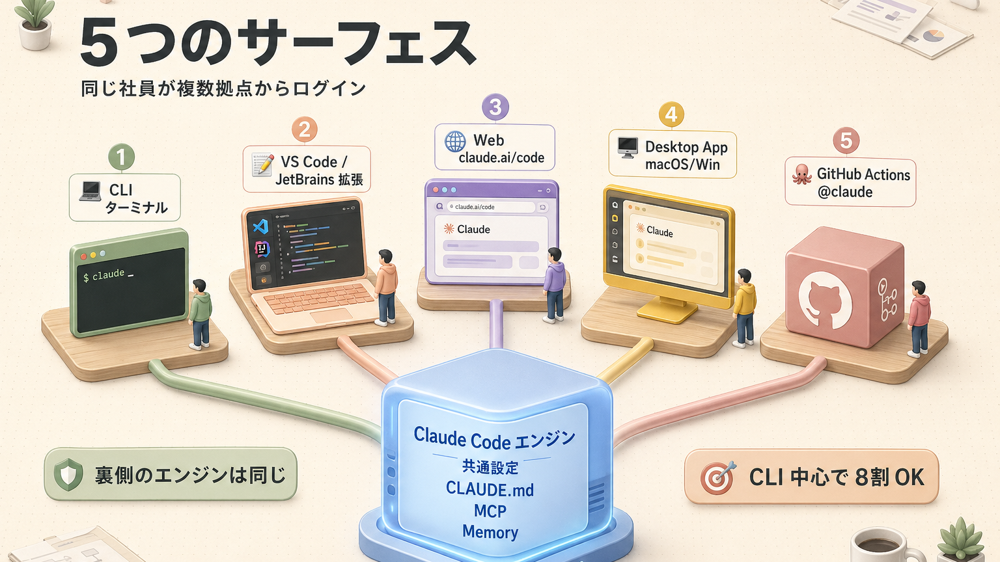
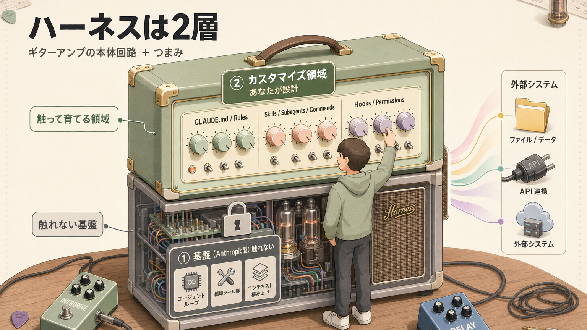

> **この章のゴール**
> - AIエージェントの正体（LLM + Memory + Tools）を理解する
> - Claude Code の **5つのサーフェス**（CLI / IDE / GitHub / Web / Desktop）を使い分けできる
> - Opus / Sonnet / Haiku のモデル選びができる

**所要時間：約45分**

---

## 1. AIエージェントの正体

> AIエージェント = **LLM** + **Memory** + **Tools**

これは Anthropic 公式・コミュニティで広く合意されている定義です。**3つのパーツが揃って初めて「自分で動ける助手」になる** という話。


### 3要素の役割

人間にたとえると、こういう構造です。

| 要素 | 役割（人間で言うと） | Claude Code での実装 |
|---|---|---|
| **LLM** | 考える脳みそ | Claude Opus 4.7 / Sonnet 4.6 / Haiku 4.5 |
| **Memory** | 記憶・メモ帳 | `CLAUDE.md` / 会話履歴 / 自動メモリ |
| **Tools** | 手足・道具箱 | `Read` `Write` `Edit` `Bash` `Grep` `Glob` `Task` `WebFetch` `WebSearch` `TodoWrite` |

**脳みそだけあっても、メモも道具もなければ何もできない。** この 3 点セットで初めて「自律的に動くアシスタント」が成立します。

### コンテキストウィンドウという「体力ゲージ」

LLM が一度に処理できる情報量には上限があります。これが **コンテキストウィンドウ**（一度に取り込める文字数の枠）。**RPG の HP（体力ゲージ）と同じイメージ** です。

| モデル | コンテキスト長 |
|---|---|
| Claude Opus 4.7 | 200K トークン（≒15万文字相当の日本語） |
| Claude Sonnet 4.6 | 200K（一部 1M） |
| Claude Haiku 4.5 | 200K |

>  **トークン**（token）= AIが文字を数える単位。日本語1文字でだいたい1〜2トークン消費します。

エージェントが長く動くと、**この体力ゲージがじわじわ減って** いきます。減ると注意力が落ちて、精度も下がる。だから「いかにコンテキストを節約するか」が腕の見せ所なんです（→ [第4回](/articles/claude-code-04-context)）。

---

## 2. Claude Code の 5つのサーフェス

Claude Code は **5つの場所** から使えます。**裏側のエンジン（Claude Code 本体）は同じ** で、CLAUDE.md・設定・MCP は全サーフェスで共有されます。**「同じ社員が、本社・支店・出張先・スマホからログインしてる」イメージ** です。



### 各サーフェスの使いどころ

| サーフェス | 強み | おすすめ用途 |
|---|---|---|
| **CLI**（ターミナル） | 全機能フル / 速い / 自動化向き | **メイン**。日常開発・スクリプト連携 |
| **VS Code / JetBrains** | 差分（変更前後の比較）が見やすい / @メンション便利 | コードの視覚的レビュー / 大規模変更の確認 |
| **Web**（claude.ai/code） | どこからでもアクセス / セッション持ち運び | 出先・スマホ / 長時間タスク |
| **Desktop App** | 視覚的に複数セッション並行 / Routines（定期実行） | 並行作業 / スケジュール実行 |
| **GitHub Actions**（GitHub上の自動実行機能） | PRレビュー自動化 / Issue起票から実装まで | CI/CD（自動ビルド・テスト・デプロイ） / チーム運用 |

>  **動画でのおすすめ**：「CLI（ターミナル版）を中心に、必要に応じて VS Code 拡張を併用、外出先は GitHub アプリ版」が王道。**全部使う必要はなくて、CLI だけで 8 割は事足ります。**

### サーフェス間の橋渡し

「Webで始めた作業を手元のCLIに持ってきたい」みたいなときの引っ越し用コマンドです。

- `claude --teleport` — Webで始めたタスクをローカルCLIに持ち込む
- `/desktop` — CLIセッションをデスクトップアプリに引き継ぐ
- `/remote-control` — スマホからローカルセッションを操作（Pro/Max限定）
- `/dispatch` — Slackやメッセンジャーから依頼を投げる

---

## 3. モデル選び：Opus / Sonnet / Haiku

3つのモデルは、**シェフのランクみたいな関係** です。

- **Opus** = 三ツ星シェフ。深く考える、すごい料理を作る、ただし時間とお金がかかる
- **Sonnet** = ベテラン料理人。万能、日常使いの相棒
- **Haiku** = 早出しの料理人。回転寿司の握り手、速くて安い


### 一覧表

| モデル | 知能 | 速度 | コスト | 主な用途 |
|---|---|---|---|---|
| **Opus 4.7** |  |  | 高い | 設計 / 複雑なリファクタリング（書き直し） / 難バグ |
| **Sonnet 4.6** |  |  | 中 | 日常開発のメイン |
| **Haiku 4.5** |  |  | 安い | サブエージェントのワーカー（裏方担当） / 並列処理 |

>  **ありがちな勘違い**：「全部 Opus でやればいいじゃん」と思いがちなんですが、**お財布が悲鳴をあげます**。日常作業は Sonnet、難所だけ Opus、雑用は Haiku、というのが定石。

### 切り替え方

```claude-code
<prompt>/model</prompt>
```

→ 対話で切り替えメニューが出ます。または起動時に `claude --model opus` のように指定。

### Opus が「言うことを聞きやすい」理由

動画 [hxCEABf0Nfc](https://www.youtube.com/watch?v=hxCEABf0Nfc) でも触れられている通り、Claude モデルは **指示追従性（指示通りに動く度合い）とハルシネーション（自信満々で嘘をつく現象）の少なさ** で評価が高いんです。

- 「やめて」と言ったらやめる
- 「このライブラリを使え」と言ったら使う
- 知らないことを **知ったかぶりしない**

これがコード生成では決定的に効きます。**「優秀だけど勝手に仕様変えてくる新人」と「言われた通りに作ってくれる安定派」、後者のほうが現場で生き残る**、あの感覚です。

---

## 4. 思考モードと深さ調整

LLM はトークンを **追加で消費** することで、より深く考えられます。**「ちょっと長考してから喋ってもらう」** ようなイメージです。これを Claude Code で制御するのが「思考モード」。

| モード | コマンド | 思考量 |
|---|---|---|
| 通常 | （何もしない） | 標準 |
| Think | `think` を含める | 中 |
| Hard | `think hard` を含める | 多 |
| Harder | `think harder` | より多 |
| **UltraThink** | `ultrathink` | 最大（じっくりモード） |
| `/effort low/mid/high/xhigh/max` | コマンド | 数値で制御 |

### Plan Mode（計画だけ立てるモード）

```text
Shift+Tab を 2回押す
# または
/plan
```

→ **コード変更を一切せず** に計画を立てるモード。**「設計図だけ先に見せて」と頼む** イメージです。設計・段取りが大事なときに使います。

### UltraPlan（クラウドプラン）

```claude-code
<prompt>/ultraplan</prompt>
```

→ クラウド側で計画を立てて、ブラウザで確認できる新機能（v2.1.91+）。**長時間の検討を別枠で投げておく** ような使い方に向きます。

---

## 5. Claude Code が **長く動ける** 仕組み

エージェントを長く動かすには、**コンテキスト（体力ゲージ）を節約しながら、必要な情報だけ取り込む** 工夫が必要です。Claude Code は次の3つでこれを実現しています。


それぞれ：

- **Skills**（スキル：必要なときだけ読む専門知識ファイル）：[第5回](/articles/claude-code-05-skills-and-commands)
- **Subagents**（サブエージェント：別働隊として動く専門部隊）：[第6回](/articles/claude-code-06-subagents)
- **Hooks**（フック：特定タイミングで必ず動く自動処理）：[第7回](/articles/claude-code-07-hooks)

詳しくは各章で。**この3つが「長く戦える秘訣」** です。

---

## 6. ハーネスは「2層」で考える

これが本資料の **キーコンセプト** です。**ここを押さえるか押さえないかで、Claude Code の使いこなしレベルが大きく変わります**。



「**ハーネスエンジニアリング**」（Claude Code 用の足場を組む技術）と呼ばれているものの実体は、ほとんどがこの **②カスタマイズ領域の設計** です。基盤を理解した上で、自分のプロジェクトに合うようにカスタマイズしていく、というだけ。

詳細は [第10回](/articles/claude-code-10-harness-design)。

---

## 7. ギターアンプのアナロジー

ハーネスの2層モデルは **ギターアンプ** に似ています。これすごくしっくり来る例えなので、紹介しておきます。

| ギターアンプ | Claude Code |
|---|---|
| アンプ本体（音を出す回路） | ① 基盤（Anthropicが作った部分） |
| イコライザー / ゲイン / リバーブのつまみ | ② カスタマイズ領域（自分が触る部分） |
| 良い音が出るかは **使い手の腕次第** | 良い結果が出るかは **設計次第** |
| ベストな設定はジャンルや曲で変わる | ベストな設定はプロジェクト・チームで変わる |

つまり Claude Code には **「これが正解」というベストプラクティスはない** んです。あるのは **手段（=構成要素）と、それを自分の課題に当てはめる判断** だけ。**だから面白い**、とも言えます。

---

## 8. ふりかえり

| | チェック項目 |
|---|---|
|  | AIエージェント = LLM + Memory + Tools と説明できる |
|  | コンテキストウィンドウが「体力ゲージ」だと理解した |
|  | 5サーフェス（CLI/IDE/Web/Desktop/GitHub）の使い分けが分かる |
|  | Opus/Sonnet/Haiku のどれを使うか自分なりに決めた |
|  | `/plan` `/effort` `ultrathink` の使い分けが分かる |
|  | ハーネスの2層モデルを説明できる |

---

## ふりかえり


## 関連する章

-  **次の段階**：[第4回 コンテキスト管理](/articles/claude-code-04-context) — メモリの仕組みを深掘り
-  **2層モデルの実装詳細**：[第10回 ハーネス設計](/articles/claude-code-10-harness-design)
-  **モデル切替コマンド**：[付録 A. チートシート §モデル](/articles/claude-code-a1-cheatsheet)
-  **役職に合わせた進路**：[第14回 役職別 学習パス](/articles/claude-code-14-role-based-paths)

## 次へ

→ [第4回 コンテキスト管理](/articles/claude-code-04-context)

| | |
|---|---|
| ⬅ 前へ | [第2回 はじめてのセッション](/articles/claude-code-02-first-session) |
|  次へ | [第4回 コンテキスト管理](/articles/claude-code-04-context) |
|  目次 | [README.md](./README.md) |