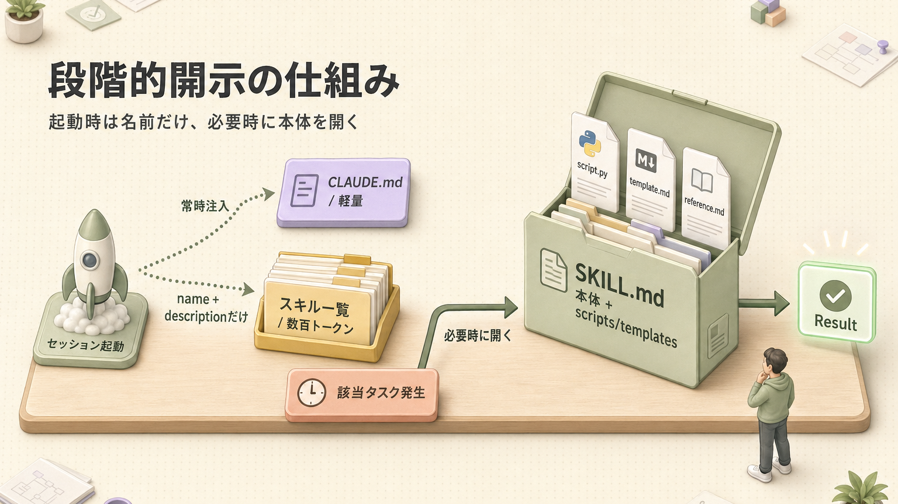
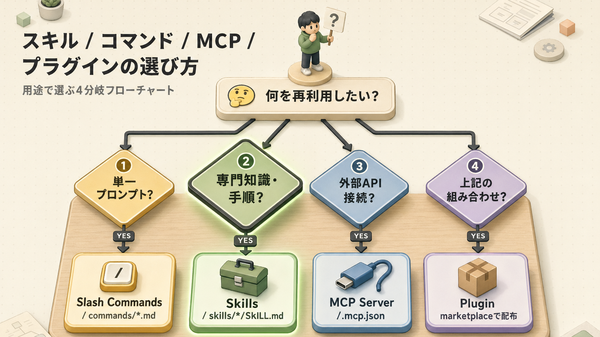

> **この章のゴール**
> - **スキル**(Claudeが必要に応じて自動で読み込む専門知識セット)と **スラッシュコマンド**(あなたが手動で呼ぶ定型プロンプト)の違い・使い分けが分かる
> - `SKILL.md`(スキルの説明書)と `commands/*.md`(コマンドの定義ファイル)の書き方を覚える
> - **skills.sh**(スキル配布マーケットプレイス、いわば「スキルのアプリストア」)から既存スキルを探せる
> - 自作してチームに展開できる

**所要時間：約60分**

---

## 1. ふたつの「ショートカット」がある

Claude Code には、繰り返し使う処理を **再利用しやすくする仕組み** が大きく2つあります。ぶっちゃけ、最初は「どっちを使えばいいの?」と混乱するんですが、**呼び方の違い** を押さえれば一気にスッキリしますよ。


| 観点 | スキル(Skills) | スラッシュコマンド |
|---|---|---|
| **起動者** | Claude が判断 | **ユーザーが手動** |
| **ロード** | 必要時のみ展開(段階的開示 = 必要なときだけ取り出す方式) | 都度入力時 |
| **目的** | 専門知識・手順の保管庫 | 定型プロンプト |
| **複雑さ** | 多段階・スクリプト含む | 1プロンプトで完結 |
| **例** | 議事録整形 / 請求書生成 | `/daily-report` `/translate-ja` |

> **覚え方**:
> - **スキルは「辞書」** — 必要なときにめくるもの
> - **コマンドは「ボタン」** — 押すと決まった動作
>
> もうちょっとくだけて言うと、**スキル = 必要なときだけ取り出す道具箱**、**コマンド = レジに置いてある「いつもの注文」ボタン**、みたいなノリです。

---

## 2. スラッシュコマンド(先に簡単な方から)

### 2-1. 仕組み

`.claude/commands/<name>.md` というファイルに書くだけ。スラッシュ `/` から始めて呼び出します。**正直、めちゃくちゃ簡単** なんですよ。

### 2-2. 最小例

`.claude/commands/daily-report.md`:

```markdown
---
description: 日報の下書きを生成する
argument-hint: <date>
allowed-tools: Read, Bash
---

直近の `git log --since="$1"` と編集ファイルから日報を作成してください。

フォーマット:
# 日報 — $1

## やったこと
- ...

## 学び
- ...

## 明日やること
- ...

## ブロッカー
- なし / あり
```

呼び出し：
```claude-code
<prompt>/daily-report 2026-04-26</prompt>
```

これだけで、毎日「日報書くの面倒くさい…」が「**ボタン一発で下書き完成**」に変わります。

### 2-3. フロントマター(先頭のメタ情報)のフィールド

ファイル先頭の `---` で挟まれた部分を **フロントマター** と呼びます。**コマンドの設定欄** だと思ってください。

| フィールド | 必須 | 説明 |
|---|---|---|
| `description` | 推奨 | 一覧表示で使われる説明 |
| `argument-hint` | 任意 | 引数(コマンドに渡すパラメータ)のヒント |
| `allowed-tools` | 任意 | このコマンドで使える Tools(道具)を絞る |
| `model` | 任意 | このコマンド用に切り替えるモデル |

### 2-4. 引数の渡し方

| 記法 | 意味 |
|---|---|
| `$1` `$2` `$3` | 位置引数(1番目の引数、2番目の引数…) |
| `$ARGUMENTS` | 全引数 |
| `$$` | リテラルの $(普通の $ 記号として使いたいとき) |

### 2-5. 配置場所

| 場所 | スコープ(適用範囲) |
|---|---|
| `~/.claude/commands/` | 全プロジェクト共通 |
| `.claude/commands/` | プロジェクト固有 |
| `<plugin>/commands/` | プラグイン(追加機能パッケージ)経由(後述) |

### 2-6. よく使う組み込みコマンド一覧

主要なものだけ抜粋(完全版は [付録 A. チートシート](/articles/claude-code-a1-cheatsheet)):

| コマンド | 動作 |
|---|---|
| `/help` | ヘルプ |
| `/clear` | 履歴リセット |
| `/compact` | 履歴圧縮 |
| `/context` | コンテキスト構成可視化 |
| `/model` | モデル切替 |
| `/plan` | プランモード |
| `/init` | CLAUDE.md 初期化 |
| `/exit` | 終了 |

---

## 3. スキル：オンデマンドの専門知識

### 3-1. スキルとは

> 特定のタスクを **高い再現性** で実行するために、AI に **手順・知識・ルール** をまとめて教える拡張可能な指示セット
> — Anthropic 公式ブログ

…と、公式の説明はちょっとお堅いんですが、要は **「必要なときだけ取り出す道具箱」** だと思ってください。



**段階的開示**(Progressive Disclosure = 必要になってから少しずつ開ける方式) が本質です：
- **起動時** = `name`(名前) と `description`(説明) だけ(数百トークン)
- **必要時** = 本体・補助ファイル展開(数千トークン)

ここがめちゃくちゃ賢くて、**「とりあえず全部の道具を机に並べておく」** じゃなくて **「使うときだけ引き出しから取り出す」** から、コンテキスト(Claudeの作業机のスペース)を圧迫しないんですよ。

### 3-2. ディレクトリ構成

```text
~/.claude/skills/
└── meeting-notes/
    ├── SKILL.md                ← メインの指示書
    ├── reference/
    │   └── format-rules.md     ← 詳細仕様(必要時のみ)
    ├── scripts/
    │   ├── extract.py          ← 補助スクリプト
    │   └── format.sh
    └── templates/
        └── output.md           ← 出力テンプレ
```

### 3-3. SKILL.md の書き方

```markdown
---
name: meeting-notes
description: 議事録テキストを「決定事項/TODO/論点」の3セクションに整形する。雑談・脱線を含む生テキストから読み返しやすい構造化メモを作る
version: 1.0.0
---

# Meeting Notes Formatter

会議の生テキスト(雑談・脱線含む)を、構造化メモに整形するスキル。

## 入力
- 議事録テキスト(タイムスタンプの有無は問わない)

## 出力フォーマット

```markdown
# <ミーティング名> — <YYYY-MM-DD>

## 決定事項
- <誰が何をいつまでに>

## TODO
- [ ] @<担当> — <内容> — 期日： <YYYY-MM-DD>

## 論点 / 持ち越し
- <未決事項>
```

## 整形ルール
- **決定事項** = 「〜することにした」「〜で行く」と明示
- **TODO** = 担当者と期日(推定でも)が紐づく
- 担当者不明 → `@?`、期日不明 → `期日: 未定`

## 詳細仕様
詳細な分類ルールは [reference/format-rules.md](./reference/format-rules.md) を参照。
```text

### 3-4. フロントマターの重要フィールド

| フィールド | 必須 | 説明 |
|---|---|---|
| `name` |  | 一意な識別名(kebab-case = ハイフン区切り) |
| `description` |  | **いつ使うか** を1〜2文で。これがロード判定に使われる |
| `version` | 推奨 | セマンティックバージョン(1.2.3 みたいな数字3つの版数) |
| `metadata.requires.anyBins` | 任意 | 必要なバイナリ(実行ファイル。bun, npx 等) |
| `metadata.homepage` | 任意 | スキルのホームページ |

>  `description` の質が **スキルが正しく呼ばれるかを決める**。ここ、本当に大事なんですよ。曖昧な説明は機能しません。**「どんなときに使うか」が一目で分かる文** を書いてください。

### 3-5. 段階的開示テクニック

SKILL.md 本体は概要だけ、詳細は分割。**「メニュー表には料理名だけ、レシピは厨房に保管」** 的なやつです。


---

## 4. ⭐ skills.sh — スキルマーケットプレイス

> [skills.sh](https://skills.sh/) は **オープン エージェント スキル エコシステム** のパッケージマネージャ。要するに **npm のスキル版**(npm = JavaScript のライブラリ配布所、と思ってください)、もっとくだけて言うと **「スキルのアプリストア」** です。

### 4-1. なぜ skills.sh を使うのか

| メリット | 内容 |
|---|---|
| **車輪の再発明を避ける** | 議事録整形・YouTube文字起こしなど、すでに誰かが作ってくれてる |
| **インストール数で品質が見える** | 1K+(1000以上)ある人気スキルは安全度が高い |
| **継続更新** | 著者がメンテナンス(更新)してくれる |
| **発見性** | カテゴリ別ブラウズ可 |

正直、**自分で全部作ろうとしなくていい時代** になりました。先人の知恵をありがたく頂戴しましょう。

### 4-2. CLI(コマンドラインツール)でのインストール

```bash
# 1. キーワード検索
npx skills find youtube

# 2. インストール(グローバル + 確認なし)
npx skills add jimliu/baoyu-skills@baoyu-youtube-transcript -g -y

# 3. 一覧
npx skills list

# 4. アップデート確認
npx skills check

# 5. 全部更新
npx skills update
```

### 4-3. インストールの命名規則

```text
<owner>/<repo>@<skill-name>
```

例：`vercel-labs/agent-skills@react` → vercel-labs の agent-skills リポジトリ内の `react` スキル

### 4-4. 人気スキル トップ10(2026年4月時点・抜粋)

| ランク | スキル | 用途 | インストール数 |
|---|---|---|---|
| 1 | `vercel-labs/agent-skills@react` | React/Next.js最適化 | 100K+ |
| 2 | `anthropics/skills@frontend-design` | フロントエンド設計 | 100K+ |
| 3 | `vercel-labs/agent-skills@nextjs` | Next.js特化 | 100K+ |
| 4 | `jimliu/baoyu-skills@baoyu-youtube-transcript` | YouTube文字起こし | 6.4K |
| 5 | `op7418/youtube-clipper-skill@youtube-clipper` | 動画クリップ抽出 | 2.6K |
| 6 | `composiohq/awesome-claude-skills@youtube-downloader` | YT動画DL | 2.5K |
| 7 | `intellectronica/agent-skills@youtube-transcript` | YT文字起こし別実装 | 2.4K |
| 8 | `infsh-skills/skills@youtube-thumbnail-design` | サムネ生成 | 2.2K |
| 9 | `sickn33/antigravity-awesome-skills@youtube-summarizer` | 要約 | 1.1K |
| 10 | (その他カテゴリで多数) | テスト/レビュー/デプロイ | — |

### 4-5. 安全性チェック

入れる前にチェック。**スマホアプリと同じで、レビュー数が多くて公式っぽいやつから入れるのが鉄則** です。

-  Anthropic / Vercel Labs / 大手企業の公式リポ
-  1K+ インストール
-  100未満は **コードを読んでから**
-  中身が分からないバイナリ(実行ファイル)は入れない

### 4-6. 自作スキルを世界に公開

GitHub に置けば skills.sh で配布可能。**自分の知見を世界にお裾分け** できます。

```bash
# 1. リポジトリを作る
mkdir my-claude-skills && cd my-claude-skills
git init

# 2. スキルを置く
mkdir my-cool-skill
cat > my-cool-skill/SKILL.md <<'EOF'
---
name: my-cool-skill
description: ...
---
# My Cool Skill
...
EOF

# 3. GitHub に push
gh repo create my-claude-skills --public --source . --push

# 4. 他人がインストール可能になる
# → npx skills add <yourname>/my-claude-skills@my-cool-skill
```

---

## 5. スキル / コマンド / MCP / プラグインの関係

ここまで色々出てきたので、**「で、結局どれを使えばいいの?」** をフローチャートで整理しておきます。



### プラグイン(参考)

複数のスキル・コマンド・サブエージェント(専門担当の AI)をまとめて配布する仕組み。**「アプリパッケージ」** だと思ってください：

```bash
# マーケットプレイス追加
claude plugin marketplace add ykdojo/claude-code-tips

# プラグインインストール
claude plugin install dx@ykdojo

# 利用可能になったコマンド
/dx:gha <url>          # GitHub Actions分析
/dx:handoff            # ハンドオフ文書
/dx:clone              # 会話クローン
/dx:review-claudemd    # CLAUDE.md改善提案
```

---

## 6. ハンズオン：5分で自作

理屈ばっかりだと頭に入らないので、**手を動かして体で覚えましょう**。

### Step 1:何を作るか決める

例：「英文ビジネスメールを丁寧度3段階で生成」

### Step 2:スラッシュコマンド版(簡単)

`.claude/commands/biz-mail-en.md`:
```markdown
---
description: 英文ビジネスメールを丁寧度別に3案出す
argument-hint: <要件の日本語>
---

次の依頼内容を英文ビジネスメールにしてください。
要件: $ARGUMENTS

3案を提示してください:
1. **Casual**(同僚向け)
2. **Standard**(顧客向け、デフォルト)
3. **Formal**(上司・役員向け)

各案に件名(Subject)も付けてください。
```

呼び出し：
```claude-code
<prompt>/biz-mail-en 来週の打ち合わせをリスケしたい</prompt>
```

### Step 3:スキル版(より高機能)

`~/.claude/skills/biz-mail-en/SKILL.md`:
```markdown
---
name: biz-mail-en
description: 英文ビジネスメールを生成する。丁寧度3段階、件名つき、適切な敬称・締めの言葉を含める
---

# Business Email (English)

## 入力
- 依頼内容(日本語OK)
- 任意:宛先(顧客/上司/同僚)

## 出力フォーマット
3案:Casual / Standard / Formal

各案:
- Subject:
- Greeting:
- Body:
- Closing:

## ルール
- 主語は能動態が基本
- 過剰な please は避ける
- "I hope this email finds you well" は使わない(陳腐)
- Formal では Mr./Ms. + 姓
- 文末は Best regards (Standard) / Sincerely (Formal) / Cheers (Casual)
```

### Step 4:動作確認

```text
英文ビジネスメールで、明日の会議を1時間遅らせたいことを伝えて
```

→ `biz-mail-en` スキルがロードされる。

「あれ、`/biz-mail-en` って打ってないのに反応した!」となるはず。**これがスキルの真骨頂** で、Claude が `description` を見て「お、このタスクならこのスキル使うとよさそう」と自動判断してくれるんですよ。

---

## 7. 運用ベストプラクティス

| 項目 | おすすめ |
|---|---|
| 1スキル1責任 | 「議事録 + メール返信」は分ける |
| description は具体的に | 「いつ使う」が明確に |
| バージョン管理 | Git(履歴管理ツール) で管理してチーム共有 |
| テスト | サンプル入出力をスキル内に置く |
| 段階的開示 | 詳細は `reference/` に分離 |
| スクリプト活用 | 決定論的処理(必ず同じ結果が出る処理) は Python/Bash で |
| 定期レビュー | 3ヶ月に1回、未使用スキルを削除 |

ちなみに最後の「定期レビュー」、**地味だけどめちゃくちゃ大事** です。スキルは増えがちなので、たまに棚卸ししないと **「使ってないスキルが机を圧迫してる」** 状態になります。

---

## 8. 評価機能(v2026.03〜)

最新の Claude Code は **スキル評価**(スキルがちゃんと効いてるかを測る仕組み) 機能を持ちます：

| 機能 | 説明 |
|---|---|
| **Capability Uplift** | モデル能力のギャップを埋める(モデル進化で消える) |
| **Encoded Preference** | チーム独自のワークフローを符号化(残り続ける) |
| **Benchmark Mode** | スキルの効果を計測 |
| **A/B Testing** | 複数バージョンの比較 |
| **Trigger Tuning** | description の精度をチューニング(微調整) |

「このスキル、本当に効いてる?」を **数値で確認** できる時代になりました。**気合と勘から脱却** ですね。

---

## 9. ふりかえり

| | チェック項目 |
|---|---|
|  | スキルとスラッシュコマンドの違いを説明できる |
|  | `commands/*.md` の最小例を書ける |
|  | `SKILL.md` のフロントマター必須項目を覚えた |
|  | description の重要性を理解した |
|  | `npx skills find / add` でマーケットプレイスを使える |
|  | 自作スキルを1つ書けるようになった |

---

## ふりかえり


## 関連する章

-  **コマンドの土台**:[第4回 コンテキスト管理](/articles/claude-code-04-context) — CLAUDE.md と組み合わせると効果倍増
-  **専門担当への発展**:[第6回 サブエージェント](/articles/claude-code-06-subagents) — 大きすぎるスキルはエージェント化を検討
-  **強制実行に変える**:[第7回 フック](/articles/claude-code-07-hooks) — 確実に呼びたい処理はフックで
-  **手早く参照**:[付録 A. チートシート](/articles/claude-code-a1-cheatsheet) — スラッシュコマンド一覧
-  **業務シナリオ**:[第11回 設計パターン](/articles/claude-code-11-harness-patterns) — どのパターンで使うか

## 次へ

→ [第6回 サブエージェント](/articles/claude-code-06-subagents)

| | |
|---|---|
| ⬅ 前へ | [第4回 コンテキスト管理](/articles/claude-code-04-context) |
|  次へ | [第6回 サブエージェント](/articles/claude-code-06-subagents) |
|  目次 | [README.md](./README.md) |