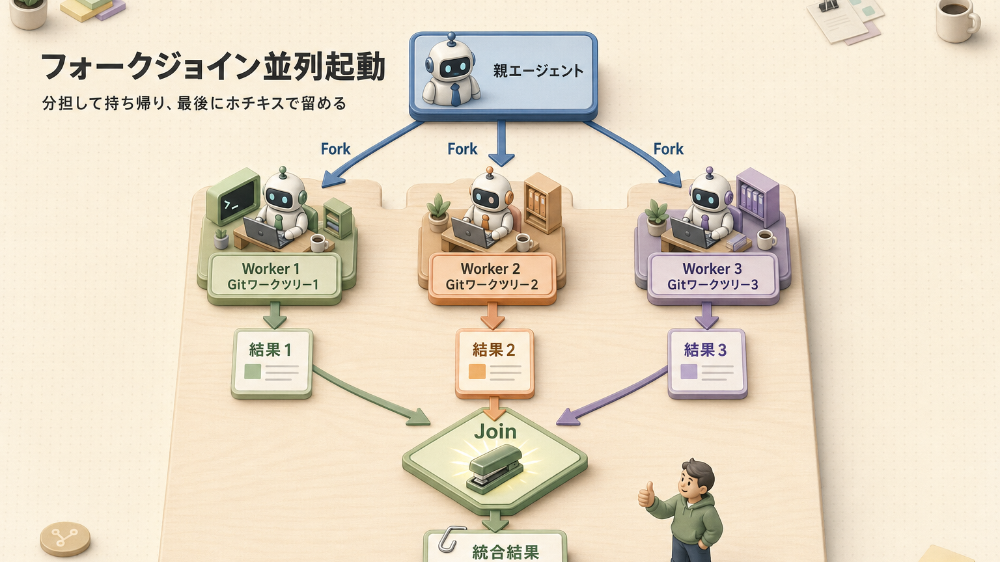

> **この章のゴール**
> - サブエージェント（専門担当の別働隊として動くAI）が **何のために** 存在するかを言える
> - **関心ごとの分離**（役割を分ける）が精度に効く理由を理解する
> - 自作サブエージェントを `.claude/agents/` に書ける
> - 並列実行で速度を稼げる場面が分かる

**所要時間：約60分**

---

## 1. なぜサブエージェントが必要か：3つの動機

サブエージェントは、ひとことで言うと **「専門の外注スタッフ」** です。本人（親エージェント）が全部やる代わりに、得意分野ごとに別働隊に頼んで、結果だけ受け取る、という分業スタイル。


### 動機1：コンテキスト分離

**「会議に呼ばずに、別室で資料調査だけ頼む」** ような感覚です。会議室の机の上を散らかさずに済む。


→ 親の体力（コンテキスト残量）を守れます。

### 動機2：関心ごとの分離

「あれもこれも」を1人にやらせると注意が散ります。**専門担当に切り出して** 役割を絞ることで、精度が上がる。**「総合医より専門医の方が、その分野は鋭い」** あれです。

| 専門サブエージェント例 | 役割 |
|---|---|
| `code-reviewer` | 品質レビューだけ |
| `tdd-guide` | テストファースト開発の伴走 |
| `security-reviewer` | 脆弱性（セキュリティ上の弱点）チェックだけ |
| `release-notes-writer` | コミット履歴からリリースノート（バージョン更新の説明文）生成 |
| `feedback-distiller` | セッション振り返りで教訓抽出 |

### 動機3：並列処理（フォークジョイン）

20ファイルの一括翻訳のような **独立した作業** は、**Gitワークツリー**（同じリポジトリの複数バージョンを並行で開ける機能）で隔離して同時実行すると速いです。**「分担して持ち帰り、最後に集約する」** やつ。

---

## 2. サブエージェントの正体

`.claude/agents/<name>.md` というファイルに、フロントマター（先頭のメタ情報）+ 本文で書きます。

```markdown
---
name: reviewer
description: コードの可読性・規約遵守・脆弱性をチェックするレビュアー。コード変更後に呼び出す
tools: Read, Grep, Glob
---

# Reviewer

あなたは厳格だが建設的なコードレビュアーです。
（プロンプト本文）
```

| フィールド | 説明 |
|---|---|
| `name` | 呼び出し名（`@reviewer` で呼ぶ） |
| `description` | **いつ使うか**（自動でロード判定するときの目印）。重要フィールド |
| `tools` | 使用可能ツール（絞ると安定。**全権渡しは事故の元**） |
| 本文 | システムプロンプト相当（その担当の人格・指示） |

### 配置場所

| 場所 | スコープ |
|---|---|
| `~/.claude/agents/` | 全プロジェクト共通（ユーザー） |
| `.claude/agents/` | プロジェクト固有 |

---

## 3. 親 → サブの呼び出し

### パターンA：明示呼び出し

```text
@reviewer このディレクトリ全体をレビューして
```

### パターンB：自動呼び出し

description（説明）に「コード編集後に必ず呼ぶ」と書いておけば、Claude が判断して呼びます。

### パターンC：Task ツール

内部的には `Task` ツール（委譲機能）が起動します。並列起動するならこれ：

```text
このリポジトリの src/, tests/, docs/ を3つのサブエージェントで並列レビューして
```

---

## 4. 実装例：5つの典型サブエージェント

「どんなのを作ればいいの？」のヒントとして、5パターン置いておきます。

### 4-1. `code-reviewer.md`

````markdown
---
name: code-reviewer
description: コード変更後に呼び出すレビュアー。可読性・規約・セキュリティを確認
tools: Read, Grep, Glob
---

# Code Reviewer

## 役割
変更されたコードを読み、以下の観点で問題を指摘する:
- 命名の一貫性
- 関数の長さ（50行超は警告）
- ファイル長（400行超は警告）
- エラーハンドリングの抜け
- セキュリティリスク（XSS / SQLi / 機密情報漏洩）

## 出力形式
```
## レビュー結果

### CRITICAL
- ファイル:行 — 問題

### HIGH
- ...

### 総評
（1-2行）
```

## 制約
- 推測ではなく読んだ事実だけで指摘
- 改修コードは書かない
````

### 4-2. `tdd-guide.md`

```markdown
---
name: tdd-guide
description: 新機能/バグ修正でテストファーストを徹底させる
tools: Read, Write, Edit, Bash
---

# TDD Guide

## 役割
ユーザーの依頼に対して、必ず以下の順で進める:
1. 失敗するテストを書く（Red）
2. テストを実行して赤を確認
3. 通す最小コードを書く（Green）
4. テストを実行して緑を確認
5. リファクタリング（コードの整理・書き直し）（Refactor）
6. 80%以上のカバレッジ（テストでチェックされている割合）を確認

テストなしの実装は行わない。
```

### 4-3. `security-reviewer.md`

```markdown
---
name: security-reviewer
description: 認証/認可/入力処理/外部API呼び出しを変更したら必ず呼ぶ
tools: Read, Grep, Glob
---

# Security Reviewer

OWASP Top 10（Webセキュリティの代表的な脆弱性10選）の観点で精査:
- A01 Broken Access Control（権限制御の不備）
- A02 Cryptographic Failures（暗号化の失敗）
- A03 Injection（注入攻撃）
- A07 Authentication Failures（認証の失敗）
...

各指摘に CVSS（脆弱性深刻度の標準スコア）ベーススコアを添える。
```

### 4-4. `feedback-distiller.md`（自己改善用）

サンプルハーネス（[第12回](/articles/claude-code-12-sample-harness)）で利用。

```markdown
---
name: feedback-distiller
description: 直近のセッションから教訓を抽出してルール化候補を提案する
tools: Read, Grep, Glob
---

# Feedback Distiller

セッションから:
- 同じ修正が3回以上発生したパターン
- ユーザーから明示的に否定されたアプローチ
- 既存ルールでは防げなかった失敗

を抽出し、`.claude/rules/<file>.md` への追記案を diff（変更差分）形式で提案。
```

### 4-5. `release-notes-writer.md`

```markdown
---
name: release-notes-writer
description: 直近のコミットからリリースノートを書く
tools: Bash, Read
---

# Release Notes Writer

`git log v1.0..HEAD --oneline`（直近のコミット履歴コマンド）から:
- Feat（新機能） / Fix（バグ修正） / Refactor（書き直し） / Docs（ドキュメント）に分類
- ユーザー視点の影響を1行で
- 破壊的変更（後方互換性が壊れる変更）があれば BREAKING CHANGES セクションへ

形式は Keep a Changelog（変更履歴フォーマットの標準）準拠。
```

---

## 5. 並列起動：フォークジョイン



「**チームで分担して、最後に成果物をホチキスで留める**」のフォークジョイン（Fork = 分岐、Join = 合流）。

### 適している作業

- 独立した複数ファイルの一括翻訳
- 大規模リファクタリング（モジュール単位で並列）
- 競合分析（複数サイトを同時取得）
- レビュー（フロント / バック / DBを別エージェントで）

### 適していない作業

- 順序依存があるタスク（**前の人の結果を待ってから次、みたいな作業**）
- 互いの結果を参照する必要があるタスク
- マージ（合流）が難しい変更

### `/batch` コマンド

最新版では `/batch` で 5〜30 個の並列ワークツリーエージェントを起動可能（v2.x）。**人海戦術モード** ですね。

---

## 6. モデル選択の使い分け

サブエージェントごとに、モデルを変えられます。**「部長（Opus）が指示出して、若手（Haiku）が手を動かす」** イメージ。


サブエージェントごとに `model: haiku` のようにフロントマター（先頭の設定欄）で指定可能。**API課金の節約** と **タスクごとの最適化** を両立できます。

---

## 7. アンチパターン

「これやりがちだけどダメ」をまとめておきます。

| アンチパターン | 何が問題 |
|---|---|
| サブエージェントを過剰に作る | 親が選択で迷う / 説明トークン消費（**家事ごとに専属メイド雇うコスト感**） |
| description が曖昧 | ロード判定（自動読み込みの判断）が機能しない |
| ツールを絞らない | 不適切なツール選択で事故る |
| 親文脈を期待する | サブは独立コンテキスト（記憶を共有してない）。プロンプトに必要情報を全部書く |
| 順序依存タスクを並列に | レース条件（タイミングずれによる不具合） / 結果がぐちゃぐちゃ |

---

## 8. 公開されているサブエージェント集

参考になるリポジトリ：

- [hesreallyhim/awesome-claude-code-subagents](https://github.com/hesreallyhim/awesome-claude-code-subagents)
- [VoltAgent/awesome-claude-code-subagents](https://github.com/VoltAgent/awesome-claude-code-subagents)

「車輪の再発明をしない」精神で、まず良いものを借りてから自分用にカスタマイズしましょう。**コーヒーを毎回豆から育てる必要はないんですよ。**

---

## 9. ふりかえり

| | チェック項目 |
|---|---|
|  | サブエージェントの3つの動機を説明できる |
|  | `.claude/agents/<name>.md` の書き方が分かる |
|  | description の重要性を理解した |
|  | 親の文脈は引き継がれない事を覚えた |
|  | 並列実行が向く / 向かないタスクを見分けられる |
|  | モデル使い分け（Haiku でワーカー）を意識できる |

---

## ふりかえり


## 関連する章

-  **同じ抽象階層**：[第5回 スキル & スラッシュコマンド](/articles/claude-code-05-skills-and-commands) — 軽量化の手段としてスキル併用
-  **強制実行**：[第7回 フック](/articles/claude-code-07-hooks) — エージェント呼び出しを Stop フックで自動化
-  **品質が効く**：[第9回 精度の高いアウトプット](/articles/claude-code-09-prompt-quality) — エージェントへの指示も具体化が肝
-  **設計パターン**：[第11回 設計パターン](/articles/claude-code-11-harness-patterns) — #5 探索計画実行 / #6 コンテキスト分離 / #7 フォークジョイン

## 次へ

→ [第7回 フック（Hooks）](/articles/claude-code-07-hooks)

| | |
|---|---|
| ⬅ 前へ | [第5回 スキル & スラッシュコマンド](/articles/claude-code-05-skills-and-commands) |
|  次へ | [第7回 フック](/articles/claude-code-07-hooks) |
|  目次 | [README.md](./README.md) |