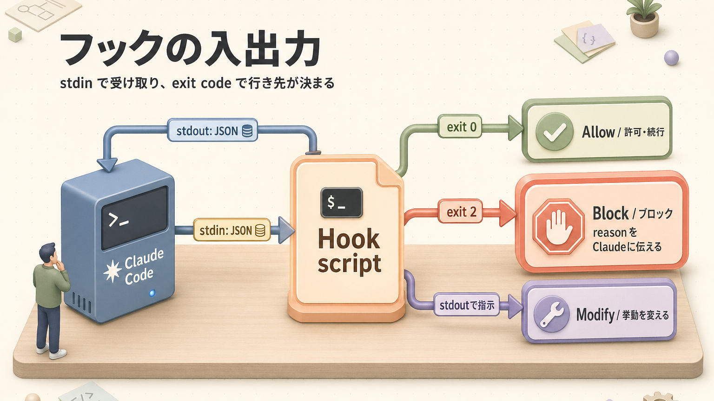
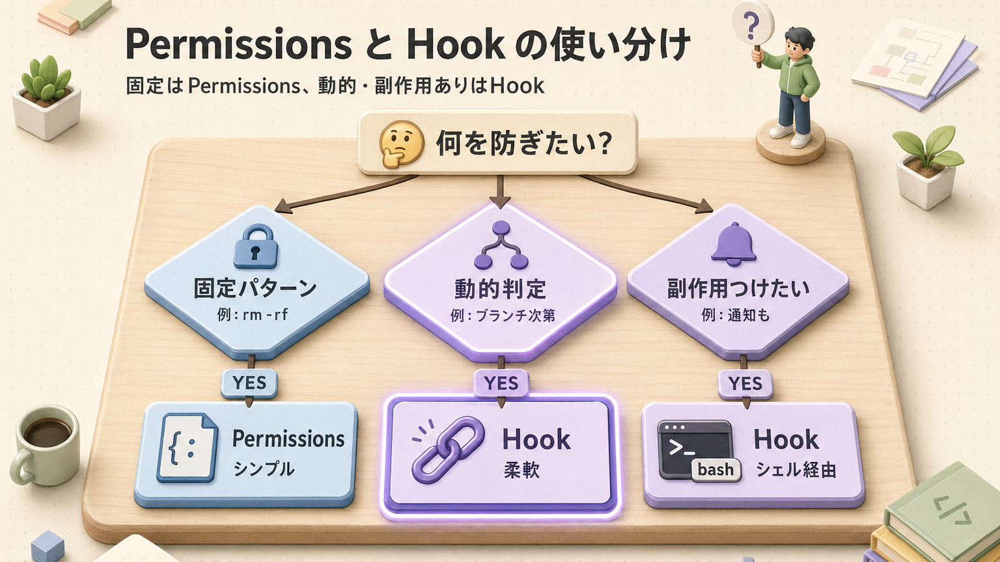

> **この章のゴール**
> - フック（特定タイミングで必ず動く自動処理）が **「お願い」と何が違う** かを理解する
> - 6つのフックイベントの使い分けが分かる
> - 危険コマンド阻止 / 自動フォーマット / 通知などを実装できる
> - フックを **使いすぎない** 線引きができる

**所要時間：約60分**

---

## 1. なぜフックが必要なのか

### CLAUDE.md でお願い vs フックで強制


LLM（Claude のような生成AIの中身）は確率的なので、**「やめて」と書いても確率で破る** ことがあるんですよ。正直、これは「指示が悪い」とかじゃなくて、AIの性質の話です。一方フックは **シェルスクリプト**(コマンドを並べた小さなプログラム)として動くので、**100%** 実行されます。決定論的(必ず同じ動作をする、ランダムじゃない)な世界、つまりタイマーや信号機と同じノリですね。

> **覚え方**：
> - **CLAUDE.md** は「マナー」 — だいたい守る
> - **フック** は「法律」 — 必ず守る

例えるなら、**「先生が口頭で『廊下を走るな』と言うのが CLAUDE.md、校門に警備員が立ってて止めるのがフック」** です。絶対守らせたいルールは、口頭注意よりガチロックの方が安心ですよね。

---

## 2. フックの 6つのイベント


| イベント | 発火タイミング | 主な用途 |
|---|---|---|
| `SessionStart` | セッション起動時 | git status / ブランチ情報を注入 |
| `UserPromptSubmit` | ユーザーがプロンプト送信時 | 動的にコンテキスト追加 |
| `PreToolUse` | ツール実行**前** | 危険コマンドの阻止・引数検証 |
| `PostToolUse` | ツール実行**後** | フォーマッタ / Lint / 型チェック |
| `Stop` | 1ターン終了時 | テスト実行 / 通知 |
| `PostCompact` | 自動圧縮後 | 重要情報の再注入 |

例えで言うと、**PreToolUse(ツール実行前のフック)は「入店前のセキュリティチェック」、PostToolUse(ツール実行後のフック)は「退店時のレシート発行」** みたいな感じです。前後でやることが違うんですよね。

---

## 3. 設定の場所

`~/.claude/settings.json` または `<project>/.claude/settings.json` の `hooks` セクション(JSONの「フック」欄)に書きます。

```json
{
  "hooks": {
    "PreToolUse": [
      {
        "matcher": "Bash",
        "hooks": [
          {
            "type": "command",
            "command": "bash ~/.claude/scripts/protect-main.sh",
            "timeout": 5,
            "statusMessage": "main保護チェック中..."
          }
        ]
      }
    ]
  }
}
```

### マッチャー（matcher）

ツール名を正規表現(文字列パターンを表現する書き方)で指定します。「どのツールを引っかけたいか」のフィルターですね。

| matcher例 | 対象 |
|---|---|
| `"Bash"` | Bash ツールのみ |
| `"Edit\|Write"` | Edit と Write |
| `"*"` | すべてのツール |

---

## 4. フックの入出力



ざっくり言うと、Claude Code がフックに「これからこのツールを動かすよ」とJSONで知らせて、フックが「OKだよ」「ダメだよ」「こう変えて」と返事する仕組みです。**自動ドアセンサーが「人が来たら開く」と判断するのに似てます。**

### 入力（stdin、フックに渡される情報）
```json
{
  "tool_name": "Bash",
  "tool_input": {
    "command": "git push origin main"
  },
  "session_id": "...",
  "transcript_path": "..."
}
```

### 出力（stdout、フックが返す指示）

```json
// 何もしない（許可）
{}

// ブロックする
{ "decision": "block", "reason": "main への直接 push は禁止" }

// 追加コンテキストを注入
{ "hookSpecificOutput": {
    "hookEventName": "PreToolUse",
    "additionalContext": "現在のブランチは main です。注意してください。"
  } }
```

`decision` には `block`（止める）、`ask`（確認を取る）、`allow`（明示的に許可）といった選択肢があります。状況に応じて使い分けてくださいね。

---

## 5. 実例集（コピペで使える）

ここからは「コピペして動かしてみてほしい」実例を8つ並べます。**全部理解しなくて大丈夫**、まずは気になるやつから試して、徐々に手元に揃えていく感じで。

### 5-1. main への直接 commit/push を禁止

`.claude/scripts/protect-main.sh`：
```bash
#!/usr/bin/env bash
set -euo pipefail

input="$(cat)"
cmd="$(printf '%s' "$input" | jq -r '.tool_input.command // empty')"

if ! git rev-parse --is-inside-work-tree >/dev/null 2>&1; then
  echo "{}"
  exit 0
fi

branch="$(git symbolic-ref --short HEAD 2>/dev/null || echo "")"

case "$cmd" in
  *"git commit"*|*"git push"*)
    if [ "$branch" = "main" ] || [ "$branch" = "master" ]; then
      cat <<'JSON'
{"decision":"block","reason":"main/master への直接 commit/push は禁止です。feature ブランチを切ってください。"}
JSON
      exit 0
    fi
    ;;
esac

echo "{}"
```

`settings.json`：
```json
{
  "hooks": {
    "PreToolUse": [
      {
        "matcher": "Bash",
        "hooks": [
          { "type": "command", "command": "bash .claude/scripts/protect-main.sh", "timeout": 5 }
        ]
      }
    ]
  }
}
```

これで main ブランチ上でうっかり commit/push しようとすると、警備員が「ストップ」してくれます。

### 5-2. ファイル編集後に自動フォーマット

```json
{
  "hooks": {
    "PostToolUse": [
      {
        "matcher": "Edit|Write",
        "hooks": [
          { "type": "command", "command": "npx prettier --write \"$CLAUDE_FILE_PATH\"", "timeout": 30 }
        ]
      }
    ]
  }
}
```

書いたそばからフォーマッタ(コードの見た目を整えるツール)が走るので、コードのインデントずれで悩むこともなくなります。地味ですけど効きます。

### 5-3. SessionStart で git 情報を注入

`.claude/scripts/inject-git-info.sh`：
```bash
#!/usr/bin/env bash
status="$(git status --short 2>/dev/null | head -10)"
branch="$(git symbolic-ref --short HEAD 2>/dev/null || echo "no-git")"
recent="$(git log --oneline -5 2>/dev/null)"

jq -n --arg s "$status" --arg b "$branch" --arg r "$recent" '{
  hookSpecificOutput: {
    hookEventName: "SessionStart",
    additionalContext: "## Git情報\n- ブランチ: \($b)\n\n### 変更中\n\($s)\n\n### 直近のコミット\n\($r)"
  }
}'
```

セッションが立ち上がった瞬間に「いまどのブランチで何が変わってるか」を Claude に教えてあげる仕組みです。**朝の朝礼で状況共有するノリ**ですね。

### 5-4. Stop で macOS 通知

```json
{
  "hooks": {
    "Stop": [
      {
        "hooks": [
          { "type": "command", "command": "osascript -e 'display notification \"ターン終了\" with title \"Claude Code\"'" }
        ]
      }
    ]
  }
}
```

長めの作業を Claude に頼んで、ぶっちゃけ別の画面でぼーっとしてる人(私です)向け。終わったら通知が飛ぶので、目を離せます。

### 5-5. Slack 通知

```json
{
  "hooks": {
    "Stop": [
      {
        "hooks": [
          {
            "type": "command",
            "command": "curl -X POST -H 'Content-type: application/json' --data '{\"text\":\"Claude のターンが終了しました\"}' $SLACK_WEBHOOK_URL"
          }
        ]
      }
    ]
  }
}
```

チームで使うなら Slack 通知。「Claude が休憩入りました」が共有されるので、レビュー待ちのタイミングが分かりやすくなります。

### 5-6. 危険コマンドのブロック（強化版）

```bash
#!/usr/bin/env bash
set -euo pipefail

input="$(cat)"
cmd="$(printf '%s' "$input" | jq -r '.tool_input.command // empty')"

# 危険パターン
patterns=(
  "rm -rf /"
  "rm -rf ~"
  "sudo rm"
  ":(){ :|:& };:"            # フォーク爆弾
  "dd if=/dev/zero"
  "mkfs"
  "git push --force"
)

for p in "${patterns[@]}"; do
  if [[ "$cmd" == *"$p"* ]]; then
    cat <<JSON
{"decision":"block","reason":"危険コマンドが検出されました: $p"}
JSON
    exit 0
  fi
done

echo "{}"
```

これは正直に言うと、人間が手で打っても怖い系のコマンドリストです。AIが万が一暴走してもここで止まる、という保険ですね。**シートベルトみたいなもの**だと思ってください。

### 5-7. PostCompact で CLAUDE.md を再注入

圧縮(セッションが長くなったときに会話を要約する処理)で重要情報が落ちることを防ぎます：

```json
{
  "hooks": {
    "PostCompact": [
      {
        "hooks": [
          {
            "type": "command",
            "command": "echo '{\"hookSpecificOutput\":{\"hookEventName\":\"PostCompact\",\"additionalContext\":\"圧縮されました。docs/architecture.md と CLAUDE.md を改めて参照してください。\"}}'"
          }
        ]
      }
    ]
  }
}
```

長い会話で記憶が圧縮されたあと、「大事な書類はもう一回読み返してね」と念押しする役目です。

### 5-8. 編集ログを記録（自己改善ループの材料）

`.claude/scripts/log-edit.sh`：
```bash
#!/usr/bin/env bash
input="$(cat)"
file="$(printf '%s' "$input" | jq -r '.tool_input.file_path // empty')"
[ -z "$file" ] && exit 0

mkdir -p .claude/sessions
ts="$(date +%FT%T%z)"
echo "$ts	edit	$file" >> ".claude/sessions/$(date +%F).log"

echo "{}"
```

→ サンプルハーネス（[第12回](/articles/claude-code-12-sample-harness)）の自己改善ループの基盤になります。地味ですが、あとで「何を編集したか」を見返せると、改善のヒントが山ほど出てきますよ。

---

## 6. フックの組み合わせパターン


「防御」「品質」「認識」の3層で組み合わせると、**家のセキュリティシステムみたいに多層防御**ができます。1個1個は地味でも、重なるとかなり強力です。

---

## 7. 落とし穴とアンチパターン

ここは「みんな同じところで詰まる」あるあるコーナーです。

### 7-1. タイムアウトに注意

```json
{ "timeout": 5 }
```

5秒以内に完了しないとフックがエラーになります。長い処理は避けてください(重いビルドは Stop ではなく非同期で別プロセスに逃がすのがコツ)。

### 7-2. フックが多すぎると遅い

PostToolUse に5個も6個もフックを入れると、毎編集で数秒のラグが積み重なります。**本当に必要なものだけ**にしましょう。盛りすぎると、自分の作業も遅くなりますよ。

### 7-3. デバッグ難しい

フック内で `echo`(画面に文字を出すコマンド)してもユーザーには見えないんですよ、これがまた厄介で。**ログファイルに出力** してデバッグするのが定番です：

```bash
echo "[hook] cmd=$cmd" >> /tmp/claude-hook.log
```

「あれ、フック動いてる？」と不安になったら、まずログを見る癖をつけてください。

### 7-4. exit code を間違える

| exit code | 意味 |
|---|---|
| 0 | 成功（stdoutで指示） |
| 2 | ブロック（stderr の内容を Claude に伝える） |
| その他 | エラー（フックが失敗） |

`exit 1`(プログラムが「失敗で終わる」を意味する終了コード)とかで返すと「フックがコケた」扱いになって、思った挙動になりません。意図的にブロックしたいときは `exit 2` を使ってくださいね。

### 7-5. JSONパースエラー

stdout が無効な JSON だと挙動不定になります。常に `echo "{}"` をデフォルトに置いておくと安全です。「とりあえず空のJSON返しとけば事故らない」という保険。

---

## 8. パーミッション と フックの使い分け



| 観点 | Permissions | Hooks |
|---|---|---|
| 設定の手軽さ | ◎ JSONだけ | △ シェル必要 |
| 柔軟性 | △ 単純マッチ | ◎ なんでもできる |
| パフォーマンス | ◎ ほぼゼロ | △ シェル起動コスト |
| 副作用（通知等） |  | ◎ |

**結論**：
- 単純な禁止 = Permissions
- 動的判断 / 副作用 = Hooks

ぶっちゃけ、最初は Permissions でできることは Permissions に寄せた方が楽です。フックはシェル書く分だけ手間が増えるので、「ここは絶対フックじゃないと無理」という場面で投入するのがちょうどいいバランスですね。

---

## 9. ふりかえり

| | チェック項目 |
|---|---|
|  | フックは「お願い」ではなく「強制」と分かった |
|  | 6つのフックイベントの使い分けができる |
|  | settings.json の hooks セクションを書ける |
|  | 入出力 JSON の仕様を理解した |
|  | 5つ以上の実例パターンを覚えた |
|  | Permissions と Hooks の使い分けが分かる |

---

## ふりかえり


## 関連する章

-  **トリガーするコマンド**：[第5回 スキル & スラッシュコマンド](/articles/claude-code-05-skills-and-commands) — フックから自作コマンドを呼ぶことも
-  **エージェント自動起動**：[第6回 サブエージェント](/articles/claude-code-06-subagents) — Stopフックでレビューエージェントを呼ぶ
-  **設計パターン**：[第11回 設計パターン](/articles/claude-code-11-harness-patterns) — #11 決定論的ライフサイクル
-  **実装の見本**：[第12回 サンプルハーネス](/articles/claude-code-12-sample-harness) — 自己改善ループのフック構成
-  **困ったとき**：[付録 B. トラブルシューティング](/articles/claude-code-a2-troubleshooting#7-フック関連) — フックが動かないとき

## 次へ

→ [第8回 外部ツール連携：MCP](/articles/claude-code-08-mcp-tools)

| | |
|---|---|
| ⬅ 前へ | [第6回 サブエージェント](/articles/claude-code-06-subagents) |
|  次へ | [第8回 MCP](/articles/claude-code-08-mcp-tools) |
|  目次 | [README.md](./README.md) |