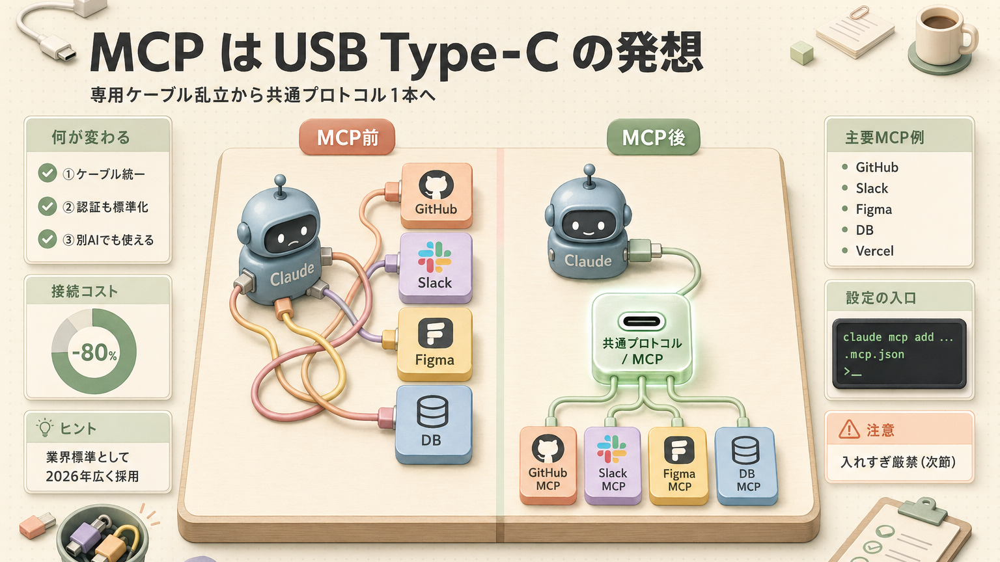
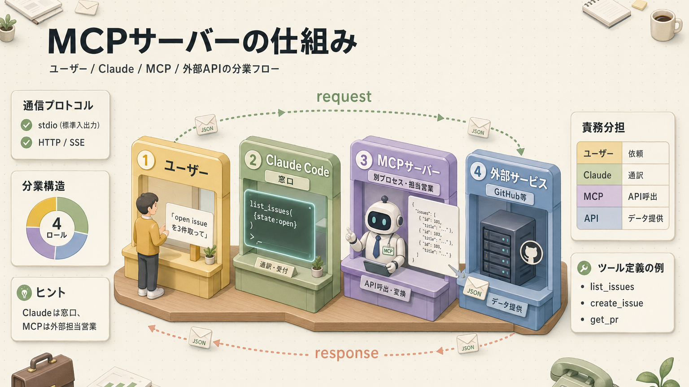
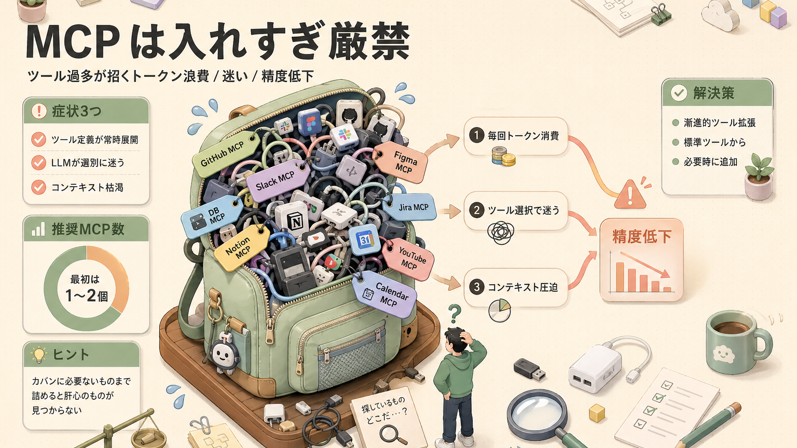
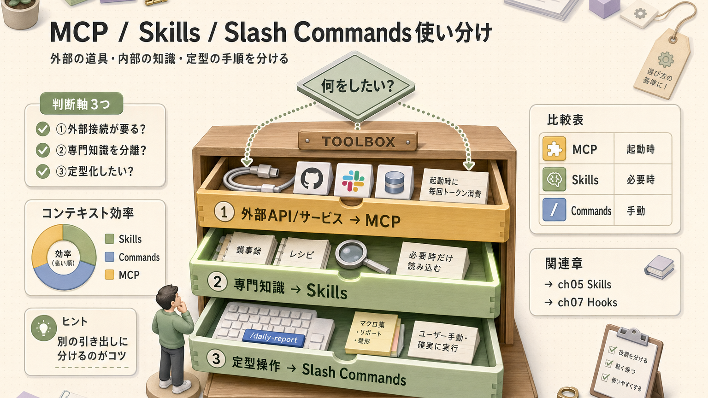

> **この章のゴール**
> - MCP（Model Context Protocol = AIと外部サービスをつなぐ共通規格）が **何のための仕組み** かを理解する
> - `.mcp.json`（設定ファイル）を書いて MCPサーバーを追加できる
> - 入れすぎると遅くなる理由が分かる
> - 厳選した推奨MCPサーバーを知る

**所要時間：約60分**

---

## 1. MCP は「USB Type-C」の発想



MCP（Model Context Protocol）は **AIエージェントと外部ツールを繋ぐ共通規格**。例えるなら **USB Type-C** です。昔はサービスごとに「専用ケーブル」が必要だったのが、Type-C 1本で何でも繋がる、あの便利さ。

Anthropic が2024年に提唱し、2026年現在は OpenAI / Google など他社AIツールも対応する **業界標準** になりつつあります。

---

## 2. MCP がない時代と、ある時代

| | MCP がない時代 | MCP のある時代 |
|---|---|---|
| ツール追加 | 各ツール用のクライアント（接続プログラム）を自作 | `.mcp.json` に1行追加 |
| 認証 | 個別実装 | 標準化された OAuth（許可式ログインの仕組み） / トークン |
| エラー処理 | バラバラ | プロトコル定義済み |
| 移植性 | ツールごとに作り直し | 別のAIエージェントでも使える |

つまり MCP は **「車輪の再発明（同じものを何度も作る無駄）をやめよう」** という標準化の動き。**みんなで同じケーブル使えば、メーカーごとに変換アダプタ買わなくて済むよね**、というやつです。

---

## 3. MCP サーバーの仕組み



- MCPサーバーは **別プロセス**（独立して動くプログラム）で動く
- Claude Code はサーバーが提供する **ツール定義** を読み込んで使う
- 標準入出力（stdio = プログラム同士の対話用パイプ）か HTTP/SSE で通信

**「Claude Code 本体は窓口、MCPサーバーは外部サービスの担当営業」** みたいな分業です。

---

## 4. 設定ファイル：`.mcp.json`

プロジェクトルート（一番上の階層）に `.mcp.json` を置きます（チーム共有用）。個人用は `~/.claude.json` で設定。

### 4-1. 例：GitHub と Context7 を繋ぐ

```json
{
  "mcpServers": {
    "github": {
      "command": "npx",
      "args": ["-y", "@modelcontextprotocol/server-github"],
      "env": {
        "GITHUB_PERSONAL_ACCESS_TOKEN": "${GITHUB_TOKEN}"
      }
    },
    "context7": {
      "command": "npx",
      "args": ["-y", "@upstash/context7-mcp"]
    }
  }
}
```

### 4-2. CLI で追加する

```bash
# サーバー追加（環境変数も同時に）
claude mcp add github npx -- -y @modelcontextprotocol/server-github

# 環境変数を指定
claude mcp add github -e GITHUB_TOKEN=ghp_xxx -- npx -y @modelcontextprotocol/server-github

# 一覧
claude mcp list

# 削除
claude mcp remove github
```

### 4-3. 接続の確認

セッション内で：

```claude-code
<prompt>/mcp</prompt>
```

→ 接続中のサーバー、利用可能なツール一覧、接続状態（ Connected /  Failed）が表示されます。**「ちゃんと刺さってる？」のチェックボタン** ですね。

---

## 5.  MCP は「入れすぎ厳禁」

これは初心者が一番ハマるポイント。**カバンに必要ないものまで詰めると、肝心のものが見つからなくなる** あの状態です。



### なぜ？

- MCPサーバーの **ツール定義（名前・説明・パラメータ）** が起動時にコンテキストへ全部展開される
- たくさんツールがあると LLM が **どれを使うか迷い**、誤選択（違う道具を選んでしまう）が増える
- コンテキスト消費 → 注意力低下 → 精度低下

### 動画より：

> ほとんどのタスクでは少数のツールしか必要としないのに、いろんなツールがあると選別に無駄な労力を使ってしまって精度が落ちる。
> （まさやん, FfABuQiDw8Q）

### 解決策：漸進的ツール拡張パターン

詳しくは [第11回 - パターン#8](/articles/claude-code-11-harness-patterns)。**最初は標準ツールだけ → 必要になったら追加** が鉄則。**「料理する分だけ食材を買う」** スタイルでいきましょう。

---

## 6. 厳選おすすめMCPサーバー（2026年4月時点）

「これだけは入れる価値ある」というラインアップ。**全部入れる必要はないですよ。気になったやつから 1〜2 個試すぐらいで十分** です。

### 6-1. Chrome DevTools MCP（最優先）

```bash
claude mcp add chrome-devtools npx -- -y chrome-devtools-mcp
```

- ブラウザ操作 / Web解析 / フロントエンドデバッグ
- 動画でも「**絶対おすすめ**」と推奨

### 6-2. Context7（ライブラリドキュメント）

```bash
claude mcp add context7 npx -- -y @upstash/context7-mcp
```

- ライブラリの **最新ドキュメント** をリアルタイム取得
- 「React の useEffect の使い方」のような質問で training cutoff（学習データの締切日。古い情報しか持っていない問題）を超えられる

### 6-3. GitHub

```bash
claude mcp add github npx -- -y @modelcontextprotocol/server-github
```

- Issue（課題チケット） / PR（プルリクエスト = コードの変更提案）の取得・作成・コメント
- リポジトリ検索・ファイル取得

### 6-4. Vercel MCP

```bash
claude mcp add vercel npx -- -y @vercel/mcp
```

- デプロイ管理・ログ確認・環境変数操作

### 6-5. Supabase / PostgreSQL

```bash
claude mcp add postgres npx -- -y @modelcontextprotocol/server-postgres -- "postgresql://..."
```

- DBスキーマ（データベースの構造）の読み取り・クエリ実行（**読み取り専用にすべき。書き込み権限は事故の元**）

### 6-6. Slack

```bash
claude mcp add slack npx -- -y @modelcontextprotocol/server-slack
```

- メッセージ送信・スレッド要約

---

## 7. MCP vs Skills vs Slash Commands：使い分け

混同しやすいので整理。**「外部の道具」「内部の知識」「定型の手順」をそれぞれ別の引き出しに入れる感覚** です。

| 機能 | 何のための仕組み | 起動 | 例 |
|---|---|---|---|
| **MCP** | 外部サービスへの接続 | Claudeが必要時に呼ぶ | GitHub Issue取得 |
| **Skills** | 専門知識の段階的開示 | Claudeが必要時に読む | 議事録フォーマット |
| **Slash Commands**（スラッシュコマンド） | 定型プロンプト | ユーザーが手動で呼ぶ | `/daily-report` |
| **Plugins**（プラグイン） | 上記をパッケージ化 | インストール | dx@ykdojo |



---

## 8. 実践：3分で MCP を追加してみる

 **ハンズオン**：Context7 を追加して動作確認

```bash
# 追加
claude mcp add context7 npx -- -y @upstash/context7-mcp

# 起動
claude

# 接続確認
/mcp
# context7: ✅ Connected と表示されればOK

# 試す
React 19 の Server Actions の使い方を context7 で調べて
```

→ 最新の React ドキュメントから情報を取得して回答してくれます。**最新情報が手元のAIから出てくるの、地味に感動します**。

---

## 9. セキュリティの注意

MCPサーバーは **任意のコードを実行できる** ので、信頼できないものは入れない。**家の合鍵を渡す相手は選ぶ** あれと同じです。

-  Anthropic 公式 / Vercel公式 / GitHub公式 / Upstash 公式
-  大手企業のオフィシャル
-  個人開発のものは **コードを読んでから**
-  中身が分からないバイナリ（実行ファイル）は入れない

また、`.mcp.json` に **APIキーを直書きしない**：

```json
{
  "env": {
    "API_KEY": "${MY_API_KEY}"
  }
}
```

→ 環境変数（OS側に保存される設定値）経由で。`.env`（環境変数ファイル）は `.gitignore`（Gitで無視するファイルリスト）済み前提。**APIキーを直書きしてGitHubに上げるのは、家の鍵をTシャツにプリントして街を歩くようなもの** なので、絶対やめましょう。

---

## 10. ふりかえり

| | チェック項目 |
|---|---|
|  | MCP の概念（共通プロトコル）を説明できる |
|  | `.mcp.json` の書き方が分かる |
|  | `claude mcp add/list/remove` を使える |
|  | 入れすぎると精度が落ちる理由を理解した |
|  | MCP / Skills / Slash Commands の違いが分かる |
|  | おすすめの最低限セット（Chrome DevTools / Context7）を試した |

---

## ふりかえり


## 関連する章

-  **本章の対比**：[第5回 スキル & スラッシュコマンド](/articles/claude-code-05-skills-and-commands) — MCP / Skills / Commands の使い分け
-  **コンテキスト圧迫対策**：[第4回 コンテキスト管理](/articles/claude-code-04-context) — `/context` で消費を確認
-  **権限制御**：[第7回 フック](/articles/claude-code-07-hooks) — MCP経由の危険操作をブロック
-  **設計パターン**：[第11回 設計パターン](/articles/claude-code-11-harness-patterns) — #8 漸進的ツール拡張
-  **接続失敗時**：[付録 B. トラブルシューティング](/articles/claude-code-a2-troubleshooting#8-mcp-関連) — `/mcp`で接続確認

## 次へ

→ [第9回 精度の高いアウトプットを引き出す](/articles/claude-code-09-prompt-quality)

| | |
|---|---|
| ⬅ 前へ | [第7回 フック](/articles/claude-code-07-hooks) |
|  次へ | [第9回 精度の高いアウトプット](/articles/claude-code-09-prompt-quality) |
|  目次 | [README.md](./README.md) |