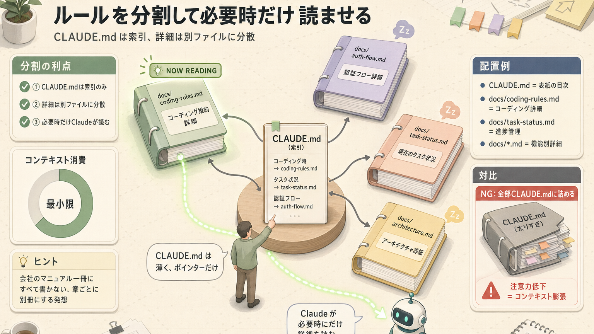

> **この章のゴール**
> - **抽象 vs 具体** のコントロールができる
> - 段階的開示・思考モードを使い分けられる
> - 「指示が悪い」を「指示を直す」にできる
> - 局所最適（部分的にだけ正解な状態）を避けるプロンプトを書ける

**所要時間：約45分**

---

## 1. 大原則：「具体」が精度を上げる

LLM は **抽象的に書けば書くほどランダム性が上がり**、**具体的に書けば書くほどそれに近づく** 性質があります。

ぶっちゃけて言うと、**料理の注文と同じ** です。「美味しいやつ作って」と頼むと、出てくるものは賭け。「豚バラとキャベツの味噌炒め、ご飯多めで」と頼めば、ほぼ思い通りのものが出てきます。


### 抽象 → 具体 への変換例

| 抽象  | 具体  |
|---|---|
| いい感じのフォームを作って | shadcn/ui の Form を使って、フィールドは name/email/message、validation（入力チェック）は Zod、submit時に `/api/contact` にPOST |
| エラー処理を入れて | `try/catch`（エラー捕捉構文）で catch し、`Sentry.captureException()` でログ送信、ユーザーにはトースト通知（react-hot-toast使用） |
| もっと早くして | 不要な再レンダリングを `React.memo` で防ぎ、heavy な計算は `useMemo`、API 呼び出しに `SWR`（データ取得ライブラリ）を使ってキャッシュ |

> 動画より：「**固有名詞** をたくさん使うと一気に精度が上がる」
> （まさおAI, WRbG_22RfeI）

**「いい感じに」「うまいことやって」は、頼む側の責任放棄** とも言えます。それで仕上がりが微妙だと「Claude 全然ダメじゃん」となりがちですが、原因は指示側にあったり。

---

## 2. 局所最適を避ける

LLM は学習データに偏った「クセ」を持っています。**何も言わないと自動で出てしまうデフォルトの好み** があるんです。

| LLMのクセ | 出てくる典型 |
|---|---|
| デフォルトで派手 | レインボーグラデーション・絵文字乱用 |
| ベストプラクティス信仰（過剰に「教科書通り」を好む） | 過剰なエラーハンドリング・YAGNI（必要になるまで作るな）違反 |
| Bash 1行スタイル | パイプ（`\|` 記号）を過剰に繋げる |
| 過剰な抽象化 | 必要のないインターフェイス（型定義）・ファクトリ（生成パターン） |

### 対策：クセを名指しで禁止する

CLAUDE.md（プロジェクト指示書）や プロンプト（指示文）に：

```text
- 絵文字は使わない（タイトル含む）
- グラデーション背景は禁止
- TypeScript の interface は1ファイル1個まで
- ファイルは400行を超えたら分割
```

→ Claude は **言われたことを忠実に守る** ので、これだけで挙動が変わります。**「やめて」と一言書くだけで、何時間ぶんもの修正が消える** ことがあります。

---

## 3. 段階的開示の3層構造

情報の渡し方は、3層に分けると無駄が出ません。

### 3-1. CLAUDE.md（Always = 常時）

- すべてのセッションで読まれる
- ここは **小さく**：プロジェクト概要・ポインター（参照先案内）のみ

### 3-2. Skills / docs/ （Lazy = 必要時）

- タスクに該当する時だけ読まれる
- 詳細仕様・手順書・テンプレートをここに

### 3-3. インラインプロンプト（Just-in-Time = その場で）

- そのセッションだけの追加情報
- `@` でファイルをその場で取り込む



**「最初に渡す資料」「必要になったら見る資料」「会議中に渡す資料」を分ける感じ** です。

---

## 4. プロンプトの基本フォーマット

実用的なテンプレ。**最初はこれをコピペで埋めるだけで十分** です。

```text
# ゴール
（一文で、何を達成したいか）

# 文脈・前提
- 関連ファイル: @src/auth.ts, @docs/auth-flow.md
- 制約: TypeScript strict, Node 22, テストはVitest
- 既知の問題: 〇〇

# やってほしいこと（具体的に）
1. ...
2. ...
3. ...

# やってほしくないこと
- ...
- ...

# 完了条件
- [ ] テストが通る
- [ ] lint がクリーン
- [ ] 既存の挙動が壊れていない
```

**「やってほしくないこと」を書く** のがポイント。書かないと、Claude が暴走気味に作り込みすぎるケースがあります。

---

## 5. 思考モードを使い分ける

タスクの難易度に応じて「考える時間」を変えてあげると、精度が変わります。**「即答 / 一拍考える / じっくり考える / 哲学者モード」** のレベル感です。


### 使い方

```text
このシステムのレース条件（同時アクセスで起きる不具合）を ultrathink で分析して
```

または：

```claude-code
<prompt>/effort max</prompt>
```

### 注意

- 思考量を増やすと **時間とトークン消費が増える**
- 簡単なタスクで `ultrathink` を使うと無駄（**typo修正で哲学者モードはやりすぎ**）
- **「迷ったら think harder、行き詰まったら ultrathink」** が経験則

---

## 6. Plan Mode を使った設計駆動

Plan Mode（計画だけ立てるモード）を挟むと、**「作り始めてから方向性が違うことに気づく」** という最悪パターンを防げます。


複雑なタスクほど Plan Mode から始めると **手戻りが激減** します。**家を建てるとき、いきなり柱を立てるのではなく、まず設計図を見る** あれです。

### Plan Mode のメリット

- 思い違いを早期に発見
- ファイル単位の影響範囲が見える
- レビュアー（コードを確認する人）が議論しやすい

---

## 7. 自己レビューさせるテクニック

書き終わったあとに **自分でチェックさせる** と、精度が一段上がります。

```text
このコードを書き終わったら、自分で次の観点でセルフレビューしてください:
1. テストが書かれているか
2. エラーハンドリング（エラー処理）は網羅されているか
3. 既存の規約に沿っているか
4. 不要な複雑さがないか

問題があれば、すべての主張を検証して、表形式で報告してください。
```

→ Claude は内部で別ターン（追加の思考ターン）を回してレビューしてくれます。動画 [ykdojo/Tip 28](https://github.com/ykdojo/claude-code-tips) でも推奨されているテクニック。**「人間が書いた文章を声に出して読み返すと誤字に気づく」** のと同じ効果があります。

---

## 8. 出力スタイル（Output Styles）

`/config`（設定メニュー） → "Preferred output style" で切り替え可能（v2025.08〜）。

| スタイル | 特徴 | おすすめシーン |
|---|---|---|
| **Default** | 簡潔 | 慣れた開発者 |
| **Explanatory** | 設計理由を添える | レビュー / ペアプロ（隣で一緒に書く作業） |
| **Learning** | `TODO(human)` マーカー（人間が手を入れる場所の印）で学習促進 | チュートリアル / 教育 |
| **Custom** | `.claude/styles/*.md` で自作 | チーム独自スタイル |

---

## 9. プロンプト品質チェックリスト

書く前にセルフチェック：

| | チェック項目 |
|---|---|
|  | 1文目に「ゴール」がある |
|  | 関係ファイルを `@` で示している |
|  | 固有名詞（ライブラリ名・関数名）を使っている |
|  | 「やらないこと」も明示している |
|  | 完了条件がチェックリストで書ける |
|  | 必要なら Plan Mode から始める |
|  | 思考モードを難易度に合わせている |

---

## 10. アンチパターン集

「これやりがち、でもダメ」をまとめておきます。

| アンチパターン | なぜダメ | 直し方 |
|---|---|---|
| **「いい感じに」** | 抽象すぎ | 具体的な要件・例示 |
| **「全部チェックして」** | 範囲が無限 | 対象ファイルを絞る |
| **「もっと頑張って」** | 何を改善したいか不明 | 改善観点を1〜3個指定 |
| **「過去のコード参考に」** | どれかわからない | `@path/to/file.ts` で示す |
| **コンテキスト満杯のまま** | 注意力枯渇 | `/compact` か `/clear` |
| **本番DB（実際にサービスで動いているデータベース）へ直接** | 取り返しがつかない | 読み取り専用 / ステージング（本番そっくりのテスト環境）で |

---

## 参考動画：固有名詞で精度を上げる（まさおAI）

固有名詞・具体性が精度を上げる、という本章のテーマがそのまま実演されている動画です。「いい感じに」をどう「具体」に翻訳するかの感覚を掴みたい方はぜひ。

 [【超有料級】ClaudeCodeを本気の徹底解説（まさおAI）](https://www.youtube.com/watch?v=WRbG_22RfeI)

<iframe width="560" height="315" src="https://www.youtube.com/embed/WRbG_22RfeI" title="ClaudeCodeを本気の徹底解説" frameborder="0" allow="accelerometer; autoplay; clipboard-write; encrypted-media; gyroscope; picture-in-picture; web-share" allowfullscreen></iframe>

---

## 11. ふりかえり

| | チェック項目 |
|---|---|
|  | 抽象 → 具体 の変換ができる |
|  | LLM のクセを名指しで禁止する書き方が分かる |
|  | 3層の段階的開示の概念を理解した |
|  | プロンプトの基本フォーマットを覚えた |
|  | 思考モードを難易度で使い分けられる |
|  | Plan Mode → 実行 の流れが分かる |
|  | 自己レビューさせるテクを知った |

---

## ふりかえり


## 関連する章

-  **下地となる文脈**：[第4回 コンテキスト管理](/articles/claude-code-04-context) — CLAUDE.md の質がプロンプト精度を底上げ
-  **専門委譲で精度UP**：[第6回 サブエージェント](/articles/claude-code-06-subagents) — 注意散漫を防ぐ
-  **段階的開示の実装**：[第5回 スキル & スラッシュコマンド](/articles/claude-code-05-skills-and-commands)
-  **設計パターン**：[第11回 設計パターン](/articles/claude-code-11-harness-patterns) — #5 探索計画実行
-  **応用Tips**：[第13回 実践Tips集](/articles/claude-code-13-tips-techniques) — 出力検証 / 自己レビューテク

## 次へ

→ [第10回 ハーネス設計：構成要素](/articles/claude-code-10-harness-design)

| | |
|---|---|
| ⬅ 前へ | [第8回 MCP](/articles/claude-code-08-mcp-tools) |
|  次へ | [第10回 ハーネス設計](/articles/claude-code-10-harness-design) |
|  目次 | [README.md](./README.md) |