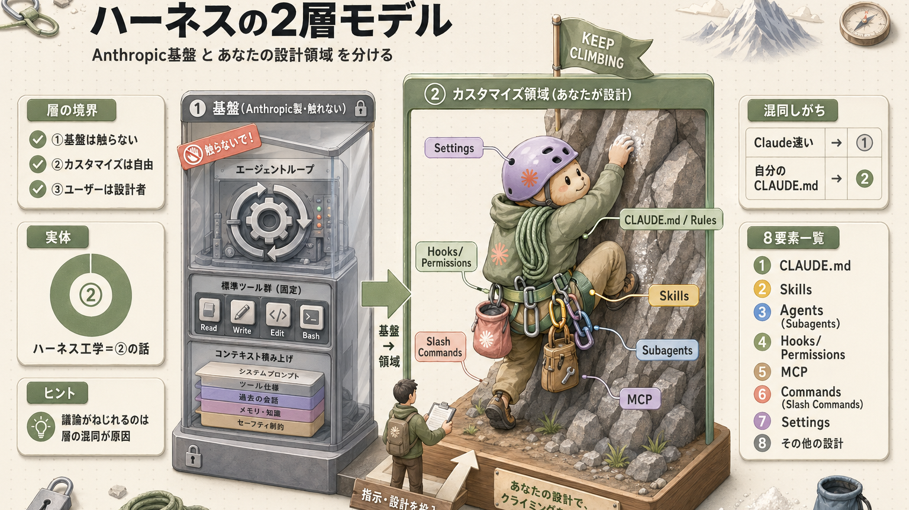
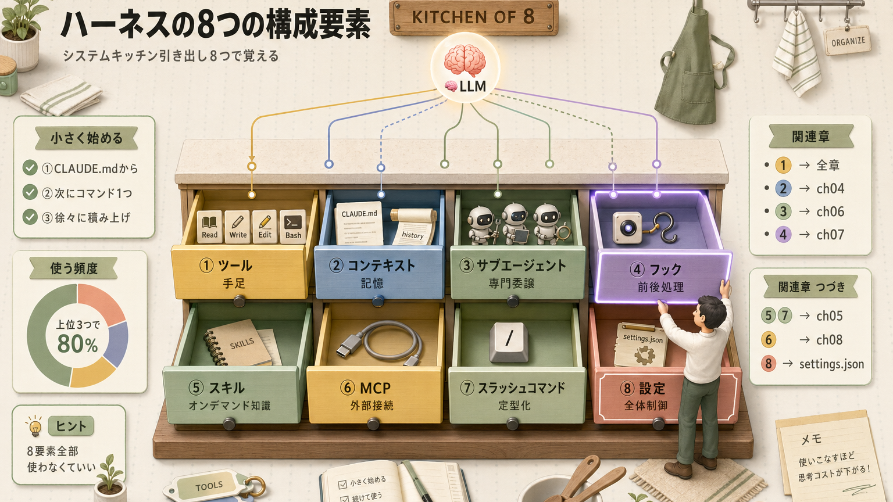
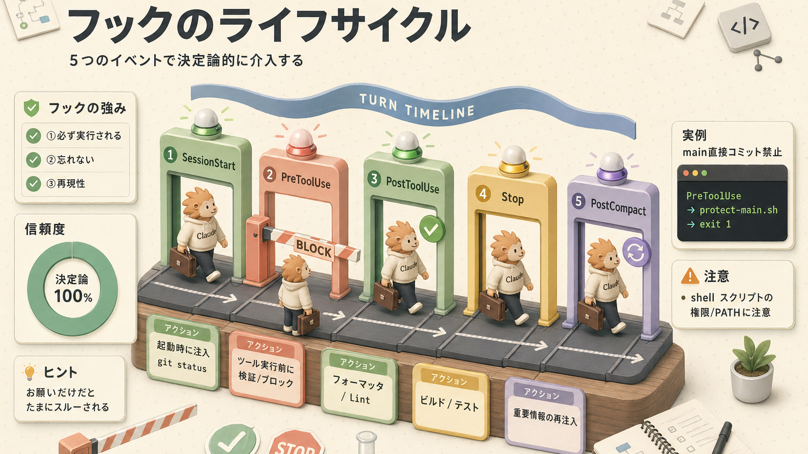
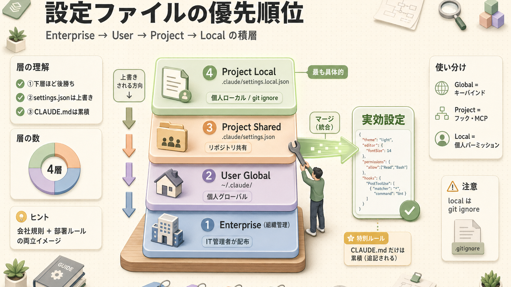
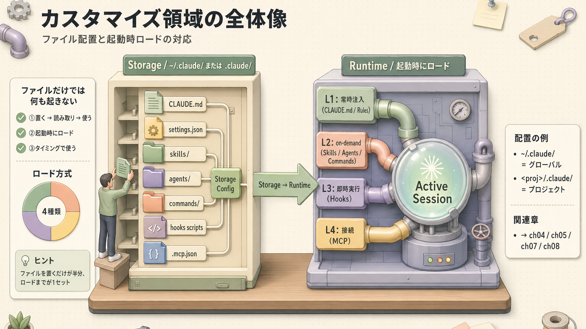
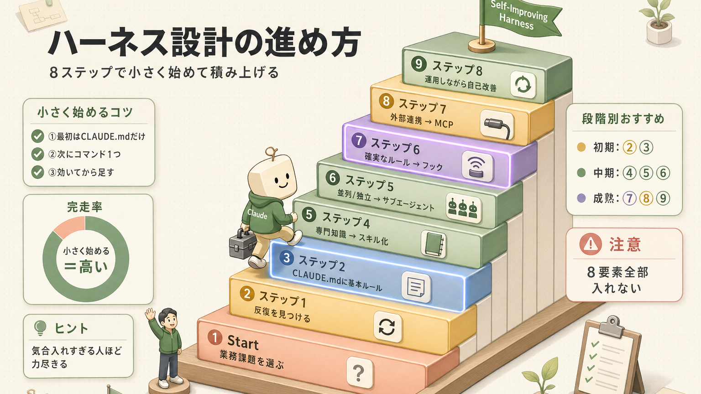

> **この章のゴール**
> - ハーネス(LLMを動かすための足場・枠組み)を **2層モデル** で説明できる
> - **8つの構成要素** の役割と置き場所を理解する
> - `~/.claude/` の中身を把握する
> - 自分の業務でどこをカスタマイズするか考えられる

**所要時間：約90分**

---

## 1. ハーネスとは何か(再確認)

> **ハーネス(Harness)= LLM を「自律的に動くエージェント」に変えるための仕組みの総体**

LLM(大規模言語モデル)単体は、ぶっちゃけ「テキストを入れたらテキストを返す関数」でしかないんですよ。これに **手足(ツール)・記憶(メモリ)・段取り(ループ)** をまとわりつかせて、全体としてエージェントとして見えるようにしたもの、それがハーネスです。Claude Opus が LLM、それを **Claude Code というハーネス** が包むことでエージェントとして振る舞ってくれるんですね。

イメージとしては、**登山に行くときの安全装具一式** に近いです。ザイル(ロープ)・カラビナ(金具)・ハーネス(腰に巻く帯)・ヘルメット…これらが揃って初めて、岩壁を登れるようになる。LLM 単体は「すごい体力を持った登山者」ですが、装具がないと怖くて崖に近づけないんですよ。

---

## 2. ハーネスの2層モデル(最重要)



### なぜこの分離が大事か

「ハーネスエンジニアリング」と語られるとき、**実体は②カスタマイズ領域の話** なんですよ。①基盤は Anthropic の責任で、ユーザーは触れない。これを混同すると会話がねじれます。実はね、現場で議論が噛み合わない原因のかなりの部分が、この層を取り違えていることだったりします。

| 文脈 | 議論しているレイヤー |
|---|---|
| 「Claude Code は速い」 | ①基盤の話 |
| 「自分のCLAUDE.mdの書き方」 | ②カスタマイズ領域 |
| 「サブエージェント設計」 | ②カスタマイズ領域 |
| 「Anthropicの新機能」 | ①基盤の話 |

---

## 3. ギターアンプのアナロジー

第3回でも触れた通り、ハーネスの2層モデルは **ギターアンプ** にそっくりなんですよ。改めて並べておきますね。

| ギターアンプ | Claude Code |
|---|---|
| アンプ本体(音を出す回路) | ① 基盤 |
| イコライザー / ゲイン / リバーブ | ② カスタマイズ領域 |
| 良い音は使い手の腕次第 | 良い結果は設計次第 |
| ベスト設定は曲・ジャンルで変わる | ベスト設定はプロジェクトで変わる |

> 「これが正解」というベストプラクティス(業界の定石)は存在しません。あるのは **手段** と、それを **自分の課題に当てはめる判断** だけ。**「ベストプラクティスはない、というのが正解」** と腹落ちしておくと、迷いがだいぶ減ります。

---

## 4. `~/.claude/` の中身

ユーザーが触る場所は基本ここ。**システムキッチンの引き出し** をイメージしてください。引き出しごとに役割が決まっていて、必要なものをそこに置いていく感じです。

```text
~/.claude/
├── settings.json              ← ハーネス全体の設定（最重要）
├── keybindings.json           ← キーバインド
├── CLAUDE.md                  ← 全プロジェクト共通の指示書
├── skills/                    ← グローバルスキル
│   └── <skill-name>/
│       └── SKILL.md
├── plugins/                   ← プラグイン（パッケージ済み機能群）
├── commands/                  ← スラッシュコマンド定義
│   └── <command-name>.md
├── agents/                    ← サブエージェント定義
│   └── <agent-name>.md
└── projects/                  ← セッション履歴(JSONL)
    └── <path-as-hyphen>/
        ├── *.jsonl            ← 過去会話
        └── memory.md          ← 自動メモリ
```

プロジェクト固有の設定にしたければ、作業ディレクトリ(いま作業しているフォルダ)の直下に `.claude/` を作って同じ構造を置いてください。**家全体のルール(`~/.claude/`)と、各部屋のローカルルール(`<プロジェクト>/.claude/`)** みたいな住み分けです。

---

## 5. 8つの構成要素



8つも並ぶとちょっとひるみますよね。でも大丈夫、**システムキッチンの引き出し** を順番に開けていく感覚で見ていきましょう。

### ① ツール(Tools)— 手足

| ツール | 役割 |
|---|---|
| `Read` / `Write` / `Edit` | ファイル読み書き |
| `Grep` / `Glob` | 検索 |
| `Bash` | シェル実行 |
| `Task` | サブエージェント起動 |
| `WebFetch` / `WebSearch` | Web取得 |
| `TodoWrite` | タスクリスト |
| `LSP` | コード理解(v2.0.74+) |

### ② コンテキスト — 記憶

| 種類 | 内容 |
|---|---|
| システムプロンプト | 基盤、固定 |
| プロジェクト文脈 | `CLAUDE.md` |
| 会話履歴 | 過去のやり取り |
| 自動メモリ | `memory.md`(自動蓄積) |

→ 詳しくは [第4回](/articles/claude-code-04-context)

### ③ サブエージェント

専門特化したエージェントへの委譲。`.claude/agents/` で定義します。**「専門のチームを別働隊として送り込む」** イメージですね。

→ 詳しくは [第6回](/articles/claude-code-06-subagents)

### ④ フック(Hooks)— 決定論的処理

`settings.json` の `hooks` セクションで定義。**確実に実行される** のが本質です。例えるなら **自動ドアセンサー** で、人(Claude)が忘れていても、センサー(フック)が反応して必ず動いてくれるんですよ。



| イベント | タイミング | 用途例 |
|---|---|---|
| `SessionStart` | 起動時 | git status, ブランチ情報を注入 |
| `UserPromptSubmit` | プロンプト送信時 | 動的にコンテキスト追加 |
| `PreToolUse` | ツール実行前 | 危険コマンド阻止 |
| `PostToolUse` | ツール実行後 | フォーマッタ・Lint |
| `Stop` | 1ターン終了時 | テスト・通知 |
| `PostCompact` | 圧縮後 | 重要情報の再注入 |

#### 実例：main 直接コミット禁止

```json
{
  "hooks": {
    "PreToolUse": [
      {
        "matcher": "Bash",
        "command": "~/.claude/scripts/protect-main.sh"
      }
    ]
  }
}
```

`protect-main.sh` の中で「`git commit` かつ現在ブランチが main なら exit 1(エラー終了)」と書いておけば、Claude が守ろうが守るまいが **強制的にブロック** されます。

>  **ポイント**：プロンプトでお願いするのは「お願いベース」、フックは「決定論的(必ずそうなる)」。**絶対守りたいルールはフックで** 守りましょう。お願いだけだと、たまにスルーされるんですよね…ご経験ある方も多いはず。

### ⑤ スキル(Skills)

タスクに該当するときだけ読み込まれる **オンデマンド知識(必要なときだけ取り出す参考書)**。**工具箱から必要な道具だけ取り出す** ようなイメージで、最初から全部抱えると重いので、必要時だけ呼び出す仕組みです。

→ 詳しくは [第5回](/articles/claude-code-05-skills-and-commands)

### ⑥ MCP — 外部世界との橋

第8回で出てきた、**USB Type-C みたいな共通規格** ですね。これでいろんな外部サービス(Slack、GitHub、データベースなど)とつながれるようになります。

→ 詳しくは [第8回](/articles/claude-code-08-mcp-tools)

### ⑦ スラッシュコマンド

`/init` `/clear` などの組み込みに加え、`~/.claude/commands/<name>.md` で自作できます。**よく使う段取りをショートカット化する** ようなものですね。

```markdown
---
description: 日報を生成
argument-hint: <date>
allowed-tools: Read, Bash
---

直近の git log とファイル変更から日報を作成してください。日付: $1
```

呼び出しはこんな感じ：`/daily-report 2026-04-26`

### ⑧ 設定(Settings)— 全体制御

3階層に分かれています。これがちょっとややこしいので、表で整理しておきますね。

| ファイル | スコープ | 主な内容 |
|---|---|---|
| `~/.claude/settings.json` | グローバル | キーバインド・テーマ |
| `<project>/.claude/settings.json` | プロジェクト共有 | フック・MCPサーバー |
| `<project>/.claude/settings.local.json` | 個人(git ignore) | 個人パーミッション |

#### 主要セクション

```json
{
  "permissions": {
    "allow": ["Bash(npm test)", "Bash(git status)"],
    "ask": ["Bash(git push:*)"],
    "deny": ["Read(./.env)", "Bash(rm -rf:*)"]
  },
  "hooks": { ... },
  "env": {
    "DISABLE_TELEMETRY": "1"
  },
  "cleanupPeriodDays": 365
}
```

`permissions` の `allow`/`ask`/`deny`(許可/確認/拒否)は、**家のセキュリティロック** を思い浮かべてください。「玄関は開けっぱなし(allow)」「裏口はチャイム鳴らしてから開ける(ask)」「金庫は触らせない(deny)」みたいな感じです。

---

## 6. 設定ファイルの優先順位



下の階層ほど **後から上書き** される仕組みです(settings.json は project-local が優先)。

ただし **`CLAUDE.md`** だけは累積(user → project の順に追記される)で、上書きされません。**会社の就業規則(全社) + 各部署のルール(部門) の両方が効く** イメージですね。両方読まれます。

---

## 7. ハーネスエンジニアリングの2大トピック

### A. 良質安全な入出力を作る(コンテキスト系)

| 手段 | 役割 |
|---|---|
| フック | 確実な前後処理 |
| コンパクション(履歴を要約して圧縮する処理) | 履歴圧縮 |
| ブランチ | セッション複製 |

### B. 安全な環境を作る(実行環境系)

| 手段 | 役割 |
|---|---|
| 標準サンドボックス(隔離された実験環境) | Anthropic製のサンドボックス機能 |
| Docker サンドボックス | Devcontainer(開発用コンテナ。隔離された開発環境)での隔離(実用的) |
| パーミッション(権限制御) | ツール×引数の許可制御 |

#### パーミッションの評価順
```text
Deny → Ask → Allow
```

→ Deny(拒否)が最強です。**やってほしくないことは Deny に書く**。これが鉄則。

#### `.env` ファイルの誤解
>  よくある誤解：「`.env` は危険な情報置き場だから読ませない」
>
>  正しい理解：「`.env` は **環境固有の値の置き場**(設定値を1か所にまとめたファイル)。プログラムが読み込んで変数として使う。**プログラム側はOK、Claudeは読まない** という権限設計が定石」

---

## 8. 「ユーザーカスタマイズ領域」の全体像



ファイルが置いてあるだけでは何も起きないんですよね。**起動時に Claude Code が中身を読み取り、適切なタイミングで使う** というところまで含めて1セットなんです。

---

## 9. ハーネス設計の進め方(実践フロー)



> **小さく始めて、必要に応じて足す**。最初から全部入りで作ると、複雑さに溺れます。実はね、「8要素全部使わなきゃ」と思って気合入れすぎる人ほど、途中で力尽きるんですよ。**まず CLAUDE.md だけ、次にコマンド1つ** くらいから始めて、効いてる手応えを感じながら積み上げていくのが正解です。

---

## 参考動画：ハーネスエンジニアリング基礎（数理の弾丸）

本章で扱った「ハーネス」「2層モデル」「8つの構成要素」の理解を深めるなら、この動画が決定版。**「コンテキスト80%超えで精度急落」「コンパクションは65〜70%が理想」** といった本章の数値もここから引用しています。

 [Claude Codeハーネスエンジニアリング まず抑えるべき基礎知識（数理の弾丸）](https://www.youtube.com/watch?v=hxCEABf0Nfc)

<iframe width="560" height="315" src="https://www.youtube.com/embed/hxCEABf0Nfc" title="Claude Codeハーネスエンジニアリング まず抑えるべき基礎知識" frameborder="0" allow="accelerometer; autoplay; clipboard-write; encrypted-media; gyroscope; picture-in-picture; web-share" allowfullscreen></iframe>

---

## 10. ふりかえり

| | チェック項目 |
|---|---|
|  | ハーネスの2層モデルを説明できる |
|  | `~/.claude/` の中身が分かる |
|  | 8つの構成要素を列挙できる |
|  | フックの種類と用途を理解した |
|  | `settings.json` の3階層を理解した |
|  | パーミッションの Deny → Ask → Allow を理解した |
|  | ハーネス設計の段階的アプローチを把握した |

---

## ふりかえり


## 関連する章(構成要素の詳細)

ハーネスの8要素を、それぞれ深掘りした章にジャンプできます：

-  **② コンテキスト**：[第4回 コンテキスト管理](/articles/claude-code-04-context)
-  **⑤ スキル / ⑦ スラッシュコマンド**：[第5回 スキル & コマンド](/articles/claude-code-05-skills-and-commands)
-  **③ サブエージェント**：[第6回 サブエージェント](/articles/claude-code-06-subagents)
-  **④ フック**：[第7回 フック](/articles/claude-code-07-hooks)
-  **⑥ MCP**：[第8回 MCP](/articles/claude-code-08-mcp-tools)
-  **設計時の判断軸**：[第9回 精度の高いアウトプット](/articles/claude-code-09-prompt-quality)
-  **どう組むか**：[第11回 設計パターン12選](/articles/claude-code-11-harness-patterns)
-  **実装の見本**：[第12回 サンプルハーネス](/articles/claude-code-12-sample-harness)
-  **コマンド・設定の参照**：[付録 A. チートシート](/articles/claude-code-a1-cheatsheet)

## 次へ

→ [第11回 設計パターン：12パターン](/articles/claude-code-11-harness-patterns)

| | |
|---|---|
| ⬅ 前へ | [第9回 精度の高いアウトプット](/articles/claude-code-09-prompt-quality) |
|  次へ | [第11回 設計パターン](/articles/claude-code-11-harness-patterns) |
|  目次 | [README.md](./README.md) |