> **この章のゴール**
> - **構成要素 vs 設計パターン** の違いを理解する
> - 12パターンを覚えて、設計時にチェックリストとして使える
> - 業務シナリオに対応するパターンを選べる

**所要時間：約60分**

---

## 1. 「中身」と「組み立て方」の違い

| 観点 | 例 |
|---|---|
| **構成要素**(中身) | ツール、コンテキスト、スキル、フック…([第10回](/articles/claude-code-10-harness-design)) |
| **設計パターン**(組み立て方) | 連続命令ファイル、フォークジョイン並列、漸進的ツール拡張…(本章) |

レゴで言うとですね：
- **構成要素** = どんなブロックがあるか(パーツのカタログ)
- **設計パターン** = どう組み立てるか(説明書)

ぶっちゃけ、ブロックだけ眺めてても何も建ちません。説明書(レシピ集)があってはじめて、お城になったり宇宙船になったりするんですよ。この章はそのレシピ集です。

これらは Claude Code のソースコード解析から抽出された **設計思想**(エージェントハーネスを組み立てるときの考え方)です。Anthropic の哲学であり、ChatGPT などの他のエージェントツールにも応用可能な汎用パターンになっています。

---

## 2. 12パターンの全体マップ

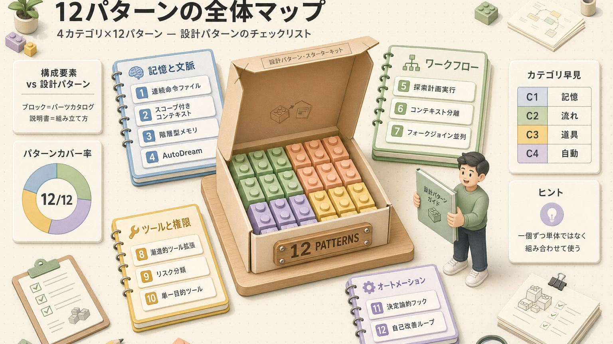

---

## 3. カテゴリ1:記憶と文脈

### #1 連続命令ファイルパターン

**何を解決するか**:プロジェクト固有のルールを毎回指示しなくて済むようにする

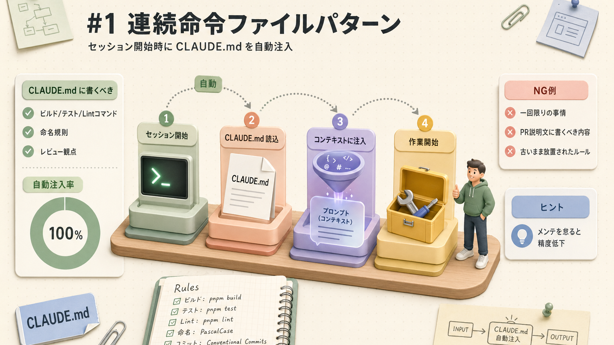

**実装**:プロジェクトルートに `CLAUDE.md` を置くだけ。これだけです。

**ベストプラクティス**:
-  ビルド/テスト/Lint(コード品質チェック)コマンド
-  命名規則・アーキテクチャ判断
-  レビューチェックリスト
-  一回限りの事情(PR説明文へ)

**注意点**:
- 必ず守ってくれるわけではない(プロンプトベースのお願いなので)
- メンテナンスを怠ると **古いルールが残る** → 精度低下。実はね、これが一番ありがちな落とし穴なんですよ

---

### #2 スコープ付きコンテキストアセンブリ

**何を解決するか**:組織共通ルールと個人カスタマイズの両立

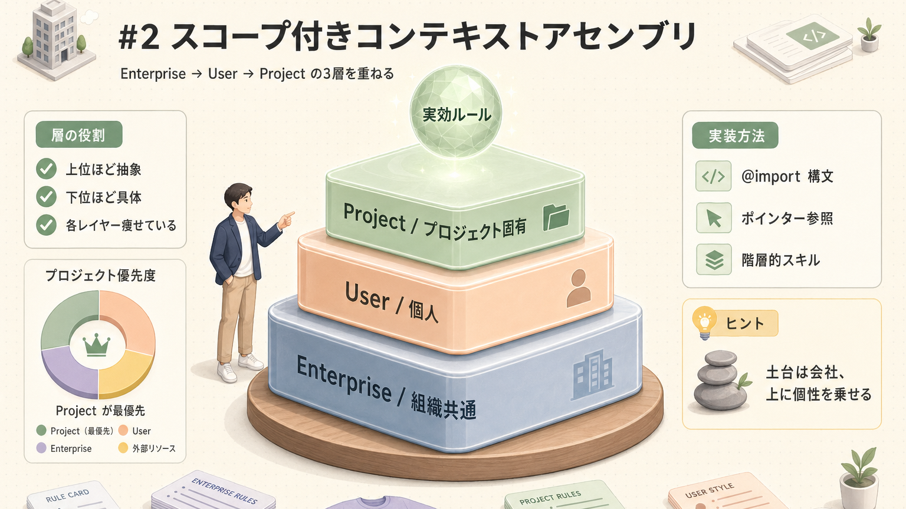

**実装**:
- インポート構文(別ファイル取り込み) `@import other.md`
- ポインター(「詳細は docs/auth.md」)
- 階層的スキル

**ベストプラクティス**:
- 各レイヤー(層)は **痩せている** こと
- 上位ほど抽象度が高く、下位ほど具体に

会社共通のドレスコードと、自分の私服をどう混ぜるか、みたいな話ですね。土台は会社、上に個性を乗せていくイメージです。

---

### #3 階層型メモリパターン

**何を解決するか**:セッションを跨いで学習を引き継ぐ

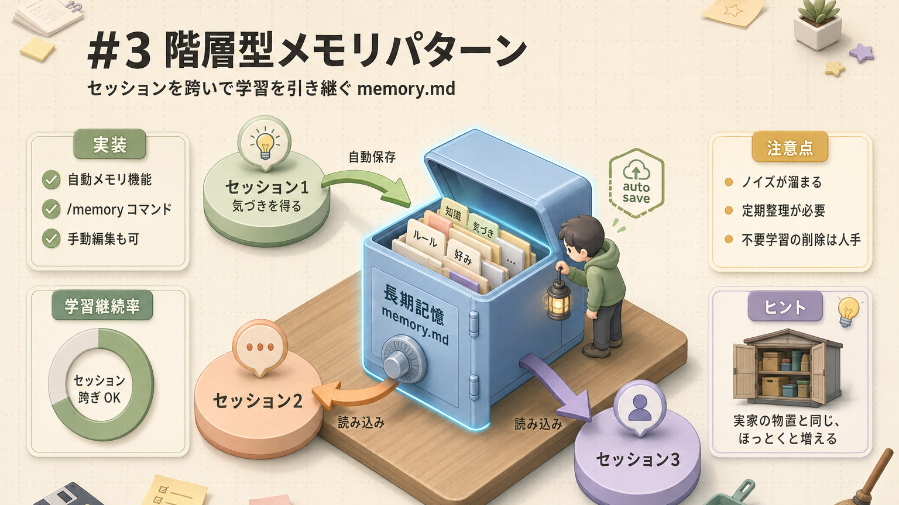

**実装**:自動メモリ機能 + `/memory` コマンド

**注意点**:
- **ノイズが溜まりやすい** ので定期的に整理してください
- 不要な学習を消すのは現状人手。実家の物置と同じで、ほっとくと勝手に増えるんですよね

---

### #4 AutoDream(夢の統合)パターン ※将来機能

**何を解決するか**:メモリの整理・重複排除を自動化

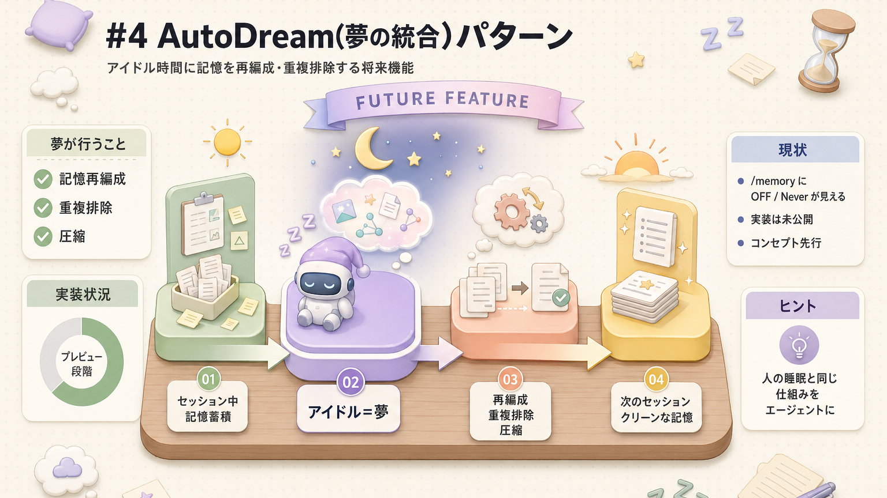

**現状**:`/memory` で `OFF / Never` として機能の存在のみ確認可能。実装は未公開です。

人間が睡眠中に記憶を整理するメカニズムをエージェントにも持たせよう、というアイデアなんですよ。エージェントも夜中に夢を見て頭の中を片付ける、ロマンがありますよね。

---

## 4. カテゴリ2:ワークフローとオーケストレーション(全体の段取り)

### #5 探索計画実行のループパターン

**何を解決するか**:複雑タスクを **計画→生成→評価** に分けて精度UP

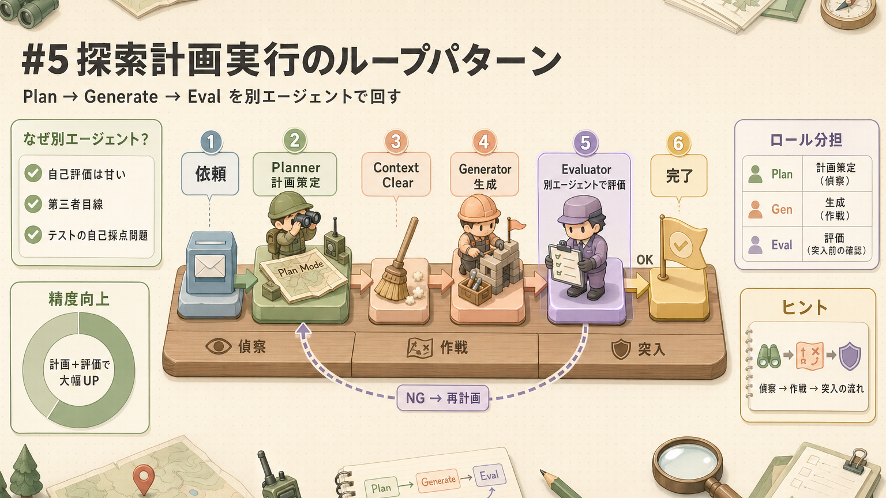

これ、軍事で言う「**偵察→作戦→突入**」みたいな流れですね。いきなり突っ込まずに、まず下調べして、計画立てて、それから動く。そして第三者がチェックする。

**ポイント**:
- **生成と評価は別エージェント**(自己評価は甘くなる。テストの自己採点が高めになるアレと一緒です)
- Plan Mode → 実装 → レビュー専用エージェントが理想

---

### #6 コンテキスト分離型サブエージェントパターン

**何を解決するか**:直列実行(順番に処理)で責務分離

各サブエージェントが **独立したコンテキスト** で作業し、親はオーケストレーション(全体の段取り)だけに集中。**「会議に呼ばずに別室で資料調査だけ頼む」** スタイルですね。

→ [第6回](/articles/claude-code-06-subagents)で詳述

---

### #7 フォークジョイン並列処理パターン

**何を解決するか**:独立タスクを並列実行で高速化

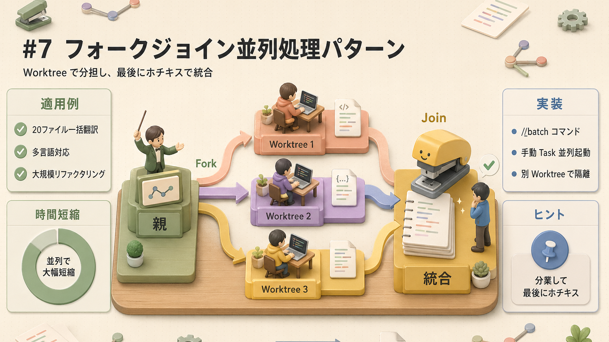

**フォークジョイン**(分担して作業し、最後に集約するパターン)は、**チームで分業して、最後にホチキスで留める** イメージなんですよ。

**実装**:`/batch` コマンド or 手動で `Task` を複数並列起動

**適用例**:
- 20ファイルの一括翻訳
- 多言語対応
- 大規模リファクタリング(コードの整理・書き直し)

---

## 5. カテゴリ3:ツールと権限

### #8 漸進的ツール拡張パターン

**何を解決するか**:ツール過多による精度低下を防ぐ

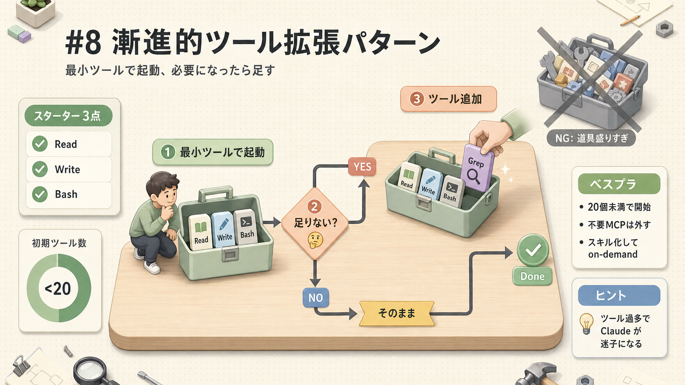

最初から道具箱パンパンにせず、**必要になったら道具を足す**、というスタイル。みんな同じ罠にハマるんですが、ツール盛りすぎると逆に Claude が迷子になるんですよ。

**ベストプラクティス**:
- 最初は **20個未満** のツールで始める
- 増えてきたら **不要なMCP(外部ツール接続規格)を外す**
- スキル化して on-demand(必要なときだけ呼び出し)に

---

### #9 リスク分類モード(オートモード)パターン

**何を解決するか**:安全な操作は自動・危険なものは確認

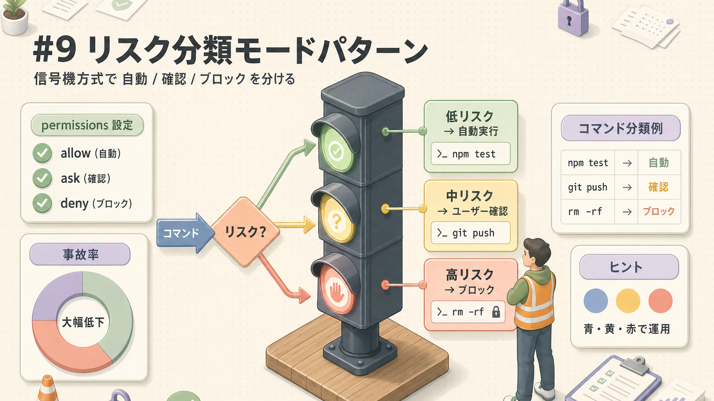

**実装**:`settings.json` の `permissions.allow / ask / deny`

信号機みたいなもので、青(自動)・黄(確認)・赤(ブロック)に分けて運用する感じですね。

---

### #10 単一目的ツール設計パターン

**何を解決するか**:1つのツールに複数機能を持たせると誤用が増える

| アンチ(よくない例) | ベター(より良い例) |
|---|---|
| `Bash` で全部やる | `Read` / `Write` / `Edit` / `Grep` / `Glob` を分離 |
| 大きな汎用ツール | 1責任 = 1ツール |

**メリット**:
- LLM(大規模言語モデル)がツール選択しやすい
- 権限制御を細かく
- 監査(あとから何をやったか追跡)が容易

包丁・まな板・フライパンを別々に持つのと同じ。ぶっちゃけ「何でも切れる万能ツール」って、結局どれにも中途半端なんですよ。

---

## 6. カテゴリ4:オートメーション

### #11 決定論的ライフサイクル(フック)パターン

**何を解決するか**:絶対実行したい処理を保証する

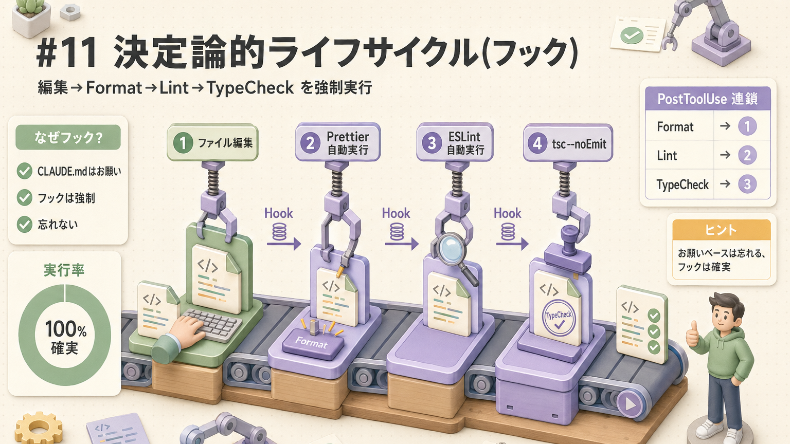

CLAUDE.md でお願いするのではなく、フック(イベント発火時の自動実行)で **強制** するパターンです。「お願いベース」だと忘れることもあるけど、フックなら確実に動くので、ご安心を。

→ [第10回](/articles/claude-code-10-harness-design) で詳述

---

### #12 自己改善ループパターン(拡張)

**何を解決するか**:使うほど賢くなるハーネス

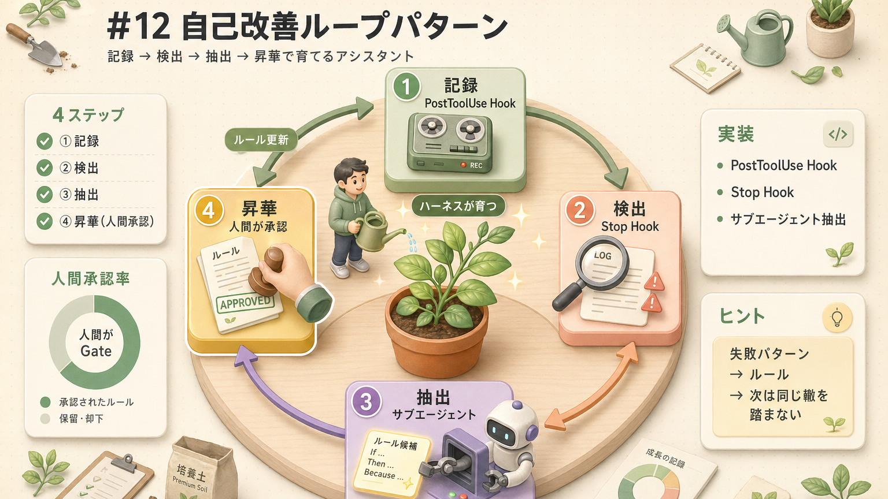

**育てるアシスタント** という発想ですね。失敗パターンを記録して、ルールに昇格させて、次は同じ轍を踏まない。観葉植物みたいに、手入れすればするほど育ちます。

→ サンプルハーネス([第13回](./13-sample-harness.md))で実装例を提供

---

## 7. ユースケース対応表

業務シナリオごとに「どのパターンを使うか」の早見表です：

| 業務シナリオ | 使うパターン | ねらい |
|---|---|---|
| 問い合わせメール返信ドラフト | #1 連続命令ファイル #10 単一目的ツール | 口調・テンプレを CLAUDE.md で固定 |
| 議事録の要約・整形 | #1 + Skill | フォーマット指定をスキルに切り出し |
| 大量ファイルの一括処理 | #7 フォークジョイン | Worktree(同一リポジトリの並行作業ディレクトリ)並列で時間短縮 |
| 新機能の設計→実装 | #5 探索計画実行 #6 コンテキスト分離 | Plan/Gen/Evalで責務分離 |
| 毎朝の競合ニュース調査 | #1 + #5 + MCP | CLAUDE.mdに観点固定 + Plan→Search→Sum |
| 本番DBへのSQL投入 | #9 リスク分類 #11 フック | DROP/TRUNCATE(削除系コマンド)はブロック |
| 営業のSFAレコード更新 | #10 + MCP | 更新系/参照系を別ツール化 |
| 長時間セッションでコンテキスト破綻防止 | #3 階層型メモリ #5 探索計画実行 | 長期記憶に逃がし、定期 /clear |
| コードレビュー自動化 | #6 + #11 | 専用エージェント+Stopフック |
| 運用しながら賢くする | #12 自己改善 | 失敗→ルール化候補 |

---

## 8. パターン選択フロー

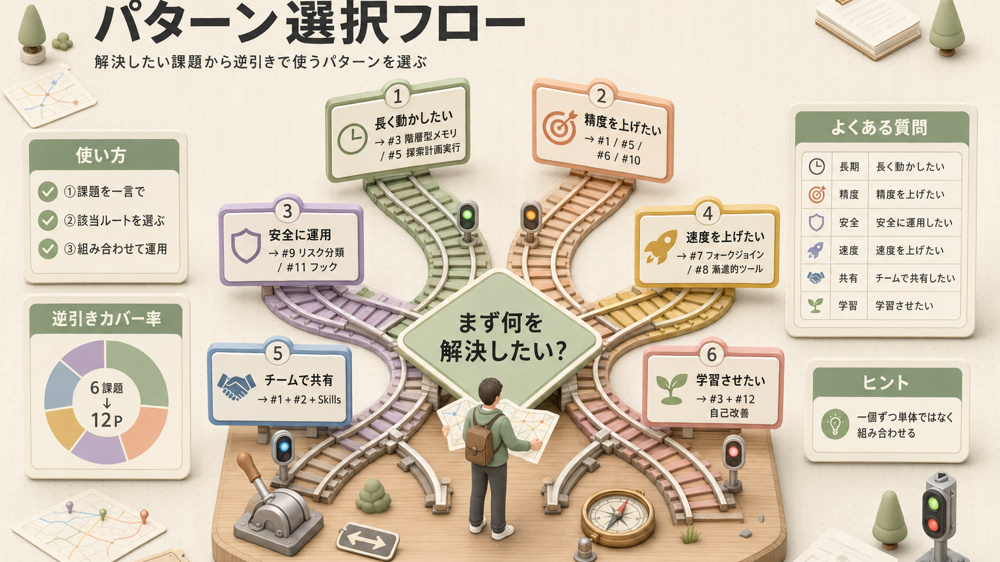

---

## 9. パターンの組み合わせ例

実際の業務ハーネスは **複数パターンの組み合わせ** で構築します。一個ずつ単体で使うことは、正直あんまりないんですよ。

### 例：問い合わせ自動応答ハーネス
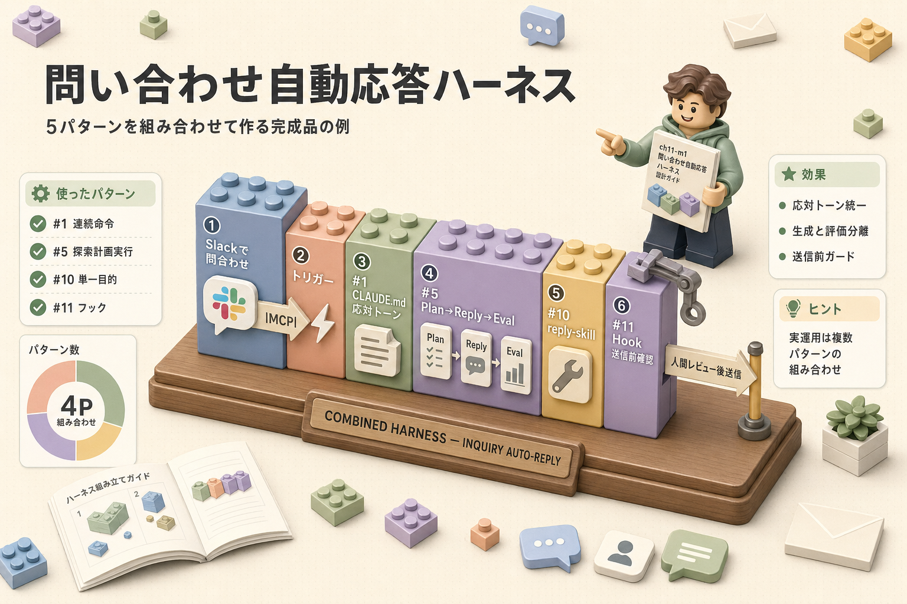

---

## 参考動画：12のエージェントハーネスパターン（まさやん）

本章の **12パターン** はこの動画から派生・整理したものです。各パターンの背景・実例を口頭で聞きたい方はこちら。「ツール入れすぎ厳禁」など本章の引用元でもあります。

 [Claude Codeによる12のエージェントハーネスパターン（まさやん）](https://www.youtube.com/watch?v=FfABuQiDw8Q)

<iframe width="560" height="315" src="https://www.youtube.com/embed/FfABuQiDw8Q" title="Claude Codeによる12のエージェントハーネスパターン" frameborder="0" allow="accelerometer; autoplay; clipboard-write; encrypted-media; gyroscope; picture-in-picture; web-share" allowfullscreen></iframe>

---

## 10. ふりかえり

| | チェック項目 |
|---|---|
|  | 構成要素と設計パターンの違いが分かる |
|  | 12パターンを4カテゴリで分類できる |
|  | 自分の業務に該当するパターンを選べる |
|  | パターンを組み合わせる発想が持てる |

---

## ふりかえり

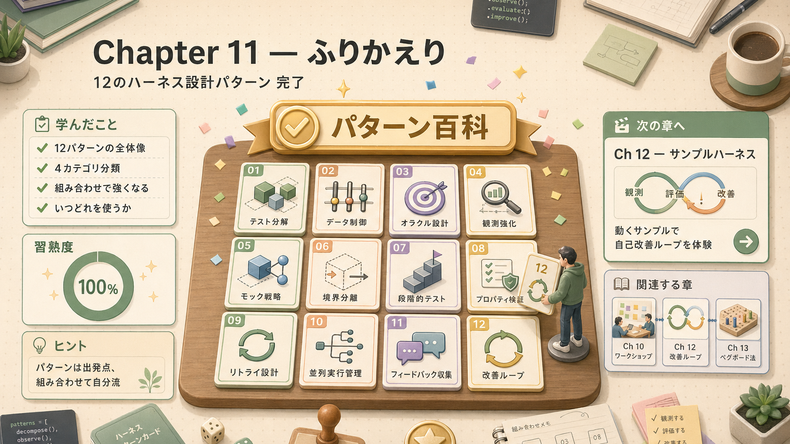

## 関連する章(パターンの構成要素)

各パターンを実装するためのリソース：

-  **#1〜#3 の土台**:[第4回 コンテキスト管理](/articles/claude-code-04-context) — CLAUDE.md / メモリ
-  **#5〜#7 の実装**:[第6回 サブエージェント](/articles/claude-code-06-subagents)
-  **#11 の実装**:[第7回 フック](/articles/claude-code-07-hooks)
-  **#8 の根拠**:[第8回 MCP](/articles/claude-code-08-mcp-tools) — 入れすぎ注意
-  **段階的開示パターン**:[第5回 スキル & コマンド](/articles/claude-code-05-skills-and-commands)
-  **#12 自己改善の実装**:[第12回 サンプルハーネス](/articles/claude-code-12-sample-harness)
-  **複数パターンを組み合わせた事例**:[第14回 役職別パス](/articles/claude-code-14-role-based-paths)

## 次へ

→ [第12回 サンプルハーネス](/articles/claude-code-12-sample-harness)

| | |
|---|---|
| ⬅ 前へ | [第10回 ハーネス設計](/articles/claude-code-10-harness-design) |
|  次へ | [第12回 サンプルハーネス](/articles/claude-code-12-sample-harness) |
|  目次 | [README.md](./README.md) |