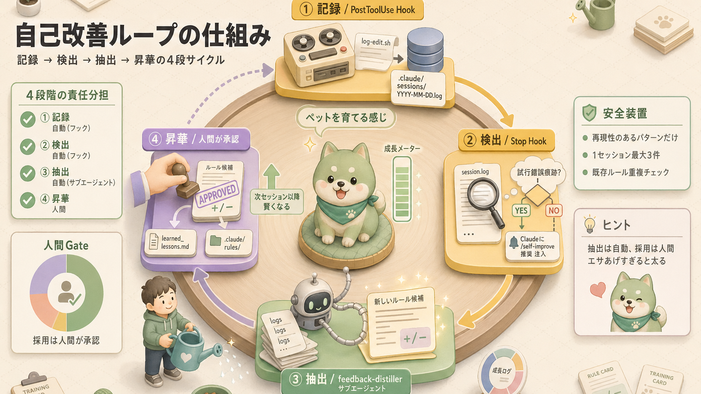
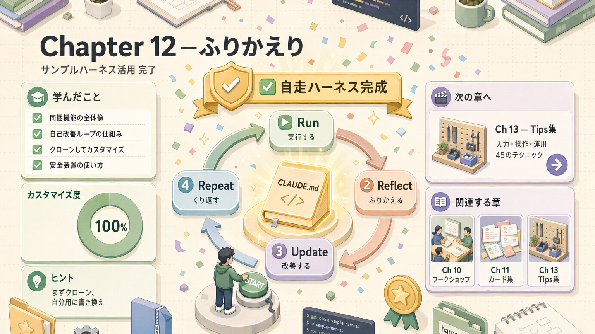

> **このページの位置づけ**
> 配布する `sample-harness.zip` の **詳細解説 + 使い方** ガイド。
> ここを読めば、自分用ハーネスのテンプレート（雛形）として即使えます。

---

## 1. このサンプルでできること

`sample-harness/` は、ハーネス（Claude Code 用の足場）の **8つの構成要素** を最小構成で実装し、さらに **自己改善ループ**（使うほど賢くなる仕組み）を組み込んだリファレンス実装（お手本）です。

**「IKEA のショールーム」みたいなもの** です。完成品が並んでて、「あ、こうやって組み合わせるのね」とイメージが湧く。


### 設計コンセプト

- **最小構成で全部入り**：ツール / コンテキスト / サブエージェント / フック / スキル / スラッシュコマンド / 設定をひとつずつ
- **安全装置あり**：`.env`（機密情報ファイル）読み取り禁止 / `rm -rf`（強制削除コマンド）禁止 / main（本番ブランチ）への直接コミット保護
- **設計→承認→タスク化フロー**：`docs/draft/`（設計案置き場）にドラフトがないと `docs/tasks/`（タスク一覧）に書けない
- **自己改善ループ**：失敗・指摘から教訓を抽出してルールに昇華する仕組み

---

## 2.  ダウンロード

サイトから直接：

- **[sample-harness.zip をダウンロード](https://claude-code-training-khaki.vercel.app/sample-harness.zip)** （約22KB）

または研修配布用：

```bash
# 配布先からコピー
cp -r <配布パス>/sample-harness ~/work/my-harness
cd ~/work/my-harness
claude
```

---

## 3. ディレクトリ構成（どこに何が・なぜ）

「整理整頓されたツールボックス」です。**フタを開けたらすべての道具がきれいに並んでる**、そんな見た目を目指しました。

```text
sample-harness/
├── CLAUDE.md                      ← プロジェクト文脈（最重要）
├── README.md                      ← クイックスタート手順
├── .claude/
│   ├── settings.json              ← 権限・フック設定
│   ├── rules/                     ← パス別ルール（autoload = 自動で読む）
│   │   ├── development.md         ← src/, tests/ 配下で自動ロード
│   │   ├── communication.md       ← 常時ロード
│   │   └── task-flow.md           ← docs/tasks/, docs/draft/ で自動ロード
│   ├── memory/                    ← 長期記憶
│   │   ├── MEMORY.md              ← 索引
│   │   ├── project_context.md
│   │   └── learned_lessons.md     ★ 自己改善ループの蓄積先
│   ├── skills/                    ← オンデマンド（必要時のみ）専門知識
│   │   └── meeting-notes/SKILL.md
│   ├── commands/                  ← スラッシュコマンド
│   │   ├── self-improve.md        ★ 自己改善コマンド
│   │   └── daily-report.md
│   ├── agents/                    ← サブエージェント
│   │   ├── feedback-distiller.md  ★ 学習担当
│   │   └── reviewer.md
│   ├── scripts/                   ← フック実装（bash = シェルスクリプト）
│   │   ├── protect-main.sh        ← main保護
│   │   ├── require-design.sh      ← 設計→承認フロー強制
│   │   ├── log-edit.sh            ★ 編集ログ記録
│   │   └── session-summary.sh     ★ 試行錯誤検出
│   └── sessions/                  ← セッション記録（自動生成）
├── docs/
│   ├── draft/                     ← 設計案（未承認）
│   └── tasks/list.md              ← 承認済みタスク
└── data/                          ← サンプルデータ
    ├── customers.csv
    └── meeting-2026-04.txt
```

### 各ファイルの役割と参照タイミング

| ファイル / フォルダ | 役割 | いつ読まれるか |
|---|---|---|
| `CLAUDE.md` | プロジェクト前提・運用方針・自己改善仕様 | セッション開始時に常時注入 |
| `.claude/rules/development.md` | TDD（テスト駆動開発）・コード規約・サブエージェント委譲 | `src/**` `tests/**` を読んだ時に自動ロード |
| `.claude/rules/communication.md` | 報告・質問の作法 | セッション開始時に常時ロード |
| `.claude/rules/task-flow.md` | 設計→承認→タスク化フロー | `docs/tasks/**` `docs/draft/**` を読んだ時 |
| `.claude/memory/project_context.md` | プロジェクトの前提情報 | 必要に応じて参照 |
| `.claude/memory/learned_lessons.md` |  過去セッションから抽出された教訓ログ | `/self-improve` 実行時に追記 |
| `.claude/skills/meeting-notes/SKILL.md` | 議事録整形フォーマット | 議事録系のタスクで自動ロード |
| `.claude/commands/self-improve.md` |  自己改善起動コマンド | `/self-improve` 入力時に発火 |
| `.claude/commands/daily-report.md` | 日報下書きテンプレート | `/daily-report` 入力時に発火 |
| `.claude/agents/feedback-distiller.md` |  教訓抽出担当 | Task ツール（委譲機能）から呼ばれた時 |
| `.claude/agents/reviewer.md` | 汎用コードレビュアー | Task ツールから委譲時 |
| `.claude/scripts/protect-main.sh` | main保護 | `PreToolUse(Bash)` で発火 |
| `.claude/scripts/require-design.sh` | 設計→承認フロー強制 | `PreToolUse(Edit\|Write)` で発火 |
| `.claude/scripts/log-edit.sh` |  編集ログ記録 | `PostToolUse(Edit\|Write)` で発火 |
| `.claude/scripts/session-summary.sh` |  試行錯誤検出+ヒント注入 | `Stop` フックで発火 |
| `.claude/sessions/` | セッション記録（自動生成） | 編集の都度追記 |
| `docs/draft/` | 未承認の設計案 | タスク化前のレビュー対象 |
| `docs/tasks/list.md` | 承認済みタスク一覧 | 進捗確認・更新時 |
| `data/` | ハンズオン用サンプルデータ | 各課題の入力 |

---

## 4. ⭐ 自己改善ループの仕組み

このサンプルの目玉。**「使うほど賢くなる」** ハーネスを実現する4段サイクル。**ペットを飼って一緒に育てる感じ** に近いです。



### 各段階の責任分担

| 段階 | 担当 | やること |
|---|---|---|
| ① 記録 | 自動（フック） | `PostToolUse` フック `log-edit.sh` が編集を `.claude/sessions/YYYY-MM-DD.log` に追記 |
| ② 検出 | 自動（フック） | `Stop` フック `session-summary.sh` が試行錯誤痕跡（同じファイルを3回以上編集など）を検出してヒントを注入 |
| ③ 抽出 | 自動（サブエージェント） | `/self-improve` から `feedback-distiller` が起動し、教訓 + ルール化候補を提案 |
| ④ 昇華 | **人間** | 提案を承認したら `learned_lessons.md` と `.claude/rules/` に反映 |

### 自己改善の原則（重要）

> **抽出は自動、採用は人間**
>
> 完全自動化はルール膨張・暴走の温床（**ペットに無制限にエサあげると太る**、あれです）。必ず「提案 → 承認」の二段階を維持してください。

組み込まれている安全装置：

-  再現性のあるパターンだけ拾う
-  1セッション最大3件のルール提案
-  既存ルールとの重複チェック

---

## 5. 使い方（5分クイックスタート）

 **ハンズオン**：実際に手を動かしてください。**読むだけだとなかなか定着しません**。

### Step 1：ダウンロード & 起動

```bash
cd ~/work
unzip /path/to/sample-harness.zip
cd sample-harness
claude
```

### Step 2：ハーネスの中身を確認

```claude-code
<prompt>/context</prompt>
```

→ CLAUDE.md と `communication.md`（常時ロード）が入っているはず。**「いま机の上に何が乗ってる？」を確認** している感覚です。

### Step 3：ツール / スキル / コマンドを試す

```claude-code
<prompt>data/customers.csv の中身を要約してください</prompt>
```

```claude-code
<prompt>/daily-report</prompt>
```

```claude-code
<output>data/meeting-2026-04.txt を meeting-notes スキルで整形して</output>
```

### Step 4：サブエージェントに委譲

```claude-code
<prompt>このプロジェクトを reviewer エージェントでレビューしてください</prompt>
```

### Step 5：⭐ 自己改善ループを回す

わざと修正・指摘されてから、セッション終了直前に：

```claude-code
<prompt>/self-improve</prompt>
```

→ `feedback-distiller` が教訓 + ルール化候補（diff形式 = 変更前後の差分形式）を提案します。納得したら採用してファイルに反映。**「今日のふりかえり」をAIにやってもらう感じ** です。

---

## 6.  安全装置一覧

「事故防止のガードレール」一式。

| 対策 | 実装場所 | 挙動 |
|---|---|---|
| `.env` 読み取り禁止 | `settings.json` permissions.deny | 機密情報の意図しない読み出しを防止 |
| `rm -rf` 禁止 | `settings.json` permissions.deny | 破壊的削除をブロック（**核ボタン封印**） |
| `git push --force` 禁止 | `settings.json` permissions.deny | 履歴破壊を防止 |
| `git push` 確認 | `settings.json` permissions.ask | 共有環境への変更前に確認 |
| main 直接コミット禁止 | `protect-main.sh` | `PreToolUse`（実行前フック）でブロック → エラーメッセージで feature ブランチ（作業用ブランチ）を促す |
| 設計→承認フロー強制 | `require-design.sh` | `docs/draft/` に設計がない状態で `docs/tasks/` に書こうとするとブロック |

---

## 7. カスタマイズして自分用に

```bash
# 自分用の作業ディレクトリにコピー
cp -r sample-harness ~/work/my-harness
cd ~/work/my-harness

# 書き換える主なファイル
#   CLAUDE.md                              ← プロジェクト概要・運用方針
#   .claude/memory/project_context.md      ← 業務固有の前提
#   .claude/rules/development.md           ← 自分のコード規約
#   .claude/skills/<your-skill>/SKILL.md   ← 業務固有スキル追加
#   .claude/commands/<your-cmd>.md         ← 業務固有コマンド追加
```

### カスタマイズチェックリスト

| | チェック |
|---|---|
|  | CLAUDE.md をプロジェクトに合わせて書き換え |
|  | `project_context.md` に業務前提を記載 |
|  | `rules/development.md` を自社規約に合わせる |
|  | 不要なスキル/コマンド/エージェントを削除 |
|  | 業務に合うスキルを `skills.sh`（スキル配布サイト）から追加 |
|  | フックの危険コマンドリストを増強 |
|  | `.gitignore`（Gitで無視するファイルリスト）で `settings.local.json` を除外 |
|  | チームで共有する場合は GitHub に push |

---

## 8. 拡張アイデア

### 自己改善ループを強化する

- 編集ログを **週次** で集計して傾向分析
- 同じ修正パターンが3回以上 → 自動でルール化候補
- ルールの **賞味期限** 管理（古いルールは警告） — **冷蔵庫の中の調味料、と同じ発想**

### 業務系の追加例

- **問い合わせ対応**：Slack MCP + reply スキル + 承認フック
- **競合調査**：WebSearch + summary スキル + 定期実行
- **コードレビュー**：複数 reviewer エージェント並列 + GitHub Actions
- **議事録整形**：meeting-notes スキル + 自動Slack投稿

---

## 9. ふりかえり

| | チェック項目 |
|---|---|
|  | サンプルをダウンロード&起動できた |
|  | `/context` で構成を確認した |
|  | スキル / コマンド / サブエージェントを呼び出した |
|  | `/self-improve` で自己改善ループを回した |
|  | 自分用にコピー&カスタマイズの準備ができた |
|  | 安全装置（permissions / hooks）の中身を理解した |

---

## ふりかえり



## 関連する章（このサンプルが体現するもの）

サンプル内の各ファイルがどの章で扱われたかの対応：

| サンプル要素 | 対応章 |
|---|---|
| `CLAUDE.md` / `.claude/rules/` / `.claude/memory/` | [第4回 コンテキスト管理](/articles/claude-code-04-context) |
| `.claude/skills/` / `.claude/commands/` | [第5回 スキル & スラッシュコマンド](/articles/claude-code-05-skills-and-commands) |
| `.claude/agents/` | [第6回 サブエージェント](/articles/claude-code-06-subagents) |
| `.claude/scripts/` + `settings.json hooks` | [第7回 フック](/articles/claude-code-07-hooks) |
| `permissions` / `settings.json` | [第10回 ハーネス設計](/articles/claude-code-10-harness-design) |
| 自己改善ループ全体 | [第11回 設計パターン #12](/articles/claude-code-11-harness-patterns) |
| 拡張アイデア | [第13回 実践Tips集](/articles/claude-code-13-tips-techniques) |
| チームへの展開 | [第14回 役職別 学習パス](/articles/claude-code-14-role-based-paths) |

## 次へ

→ [第13回 実践Tips集](/articles/claude-code-13-tips-techniques)

| | |
|---|---|
| ⬅ 前へ | [第11回 設計パターン](/articles/claude-code-11-harness-patterns) |
|  次へ | [第13回 実践Tips集](/articles/claude-code-13-tips-techniques) |
|  目次 | [README.md](./README.md) |