> **このページの位置づけ**
> あなたの **役割や目的** に応じた、最短の Claude Code 習熟ルート。
> 出典：[FlorianBruniaux/claude-code-ultimate-guide](https://github.com/FlorianBruniaux/claude-code-ultimate-guide)、[luongnv89/claude-howto](https://github.com/luongnv89/claude-howto) を日本向けに再構成。

---

## はじめに：学習はコース料理、全部食べなくていいんですよ

正直に言うと、ここまで第13回ぶんの内容を見てきて「いやこれ全部読まなきゃダメ?」と思った方、いますよね。わかります。安心してください、**全部食べる必要はないんです**。

この章は、学習ロードマップを **コース料理のメニュー表** として整理したものです。営業の方には営業向けのコース、CTO(Chief Technology Officer = 技術責任者)には CTO 向けのコース、デザイナーには UI/UX 直結のコースを用意してあります。**自分にあったメニューだけ頼めば、お腹いっぱいになります**。

さらに言うと、学習は **ゲームのレベル設計** に近いんですよ。いきなりラスボス(Agent SDK でカスタムエージェント自作)に挑むんじゃなくて、まずチュートリアル(00-02)を終わらせて、サイドクエスト(スキル/コマンド)を取って、レベルが上がってから次のダンジョンへ。**段階的に習熟していけば、どこかで詰むことはほぼないです。**

---

## 1. 自分のレベルとゴールを決める

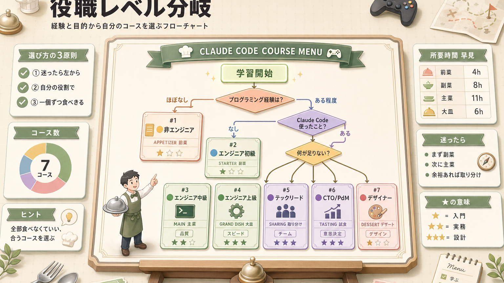

上の図で「自分はどこ?」が分かれば、もう半分ゴールしたようなものです。**迷ったら一番上の「経験ほぼなし」から始めて全然 OK**。むしろそっちの方が、変な癖がつかなくて後から伸びやすかったりします。

---

## 2. 役職別パス一覧

メニュー表を全部並べるとこんな感じです。**所要時間はあくまで目安** なので、合間にコーヒー休憩を挟みつつ気楽にどうぞ。

| パス | 対象 | 所要 | 重点章 |
|---|---|---|---|
|  [非エンジニア](#非エンジニア) | 営業/CS/マーケ/PM | 4時間 | 00-04 / 13 / 15 |
|  [エンジニア初級](#エンジニア初級) | 1〜3年目 | 8時間 | 00-08 / 12 |
|  [エンジニア中級](#エンジニア中級) | 4〜10年目 | 11時間 | 全章 + 自分用ハーネス |
|  [エンジニア上級](#エンジニア上級) | 10年+ | 6時間 | 09-13 / 自動化深掘り |
|  [テックリード](#テックリード) | チームリーダー | 7時間 | 04 + 08 + 14 / チーム導入 |
|  [CTO / VPoE](#cto-vpoe) | 経営層 | 4時間 | 00 / 14 / 投資判断 |
|  [PdM](#pdm) | プロダクトマネージャー | 5時間 | 00 / 03 / 06 / 12 |
|  [デザイナー](#デザイナー) | UI/UX | 4時間 | 06 / 08 / Figma連携 |

---

## 非エンジニア

### あなたの状況
- 営業 / カスタマーサクセス / マーケティング / プロジェクトマネージャー
- ターミナル(パソコンに文字で命令を出す画面)は初めて or 苦手意識あり
- 業務効率化に Claude Code を使いたい

「いや自分コード書かないし…」と思ってるそこのあなた。**むしろこのコースは、コード書かない人のためにあるんですよ**。メール返信、議事録整形、競合調査。今までブラウザで Claude さんに頼んでた作業を、ターミナルから一発で終わらせる、それだけの話です。

### 学習パス(4時間)

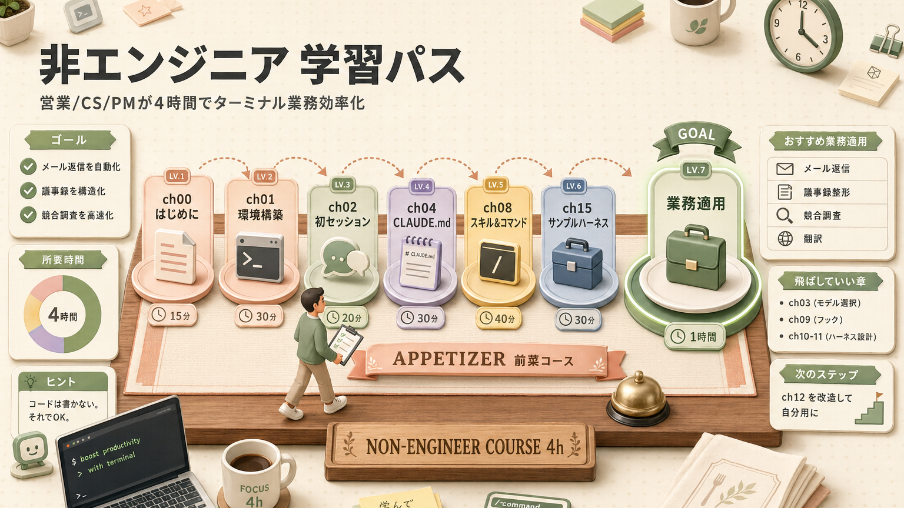

### おすすめ業務適用例

| 業務 | 使い方 |
|---|---|
| メール返信 | スラッシュコマンド `/reply-jp` `/reply-en` を作る |
| 議事録整形 | スキル `meeting-notes` で構造化 |
| 競合調査 | MCP(Model Context Protocol = 外部サービス接続規格)経由で Context7 / WebSearch で最新情報取得 |
| 資料下書き | Markdown + `/copy` で Notion へ |
| 翻訳 | スキル + 用語集を CLAUDE.md に |

### 飛ばしていい章
- 03(モデルとサーフェス)→ Sonnet で十分なのでスキップで OK
- 09(フック)→ 実装タスクが少ないなら不要
- 10-11(ハーネス設計)→ 必要になってから戻ってくれば OK

**ぶっちゃけ、いま全部理解しなくていいです**。「あ、これあのとき出てきたな」くらいの記憶でも、必要になったときに戻ってくれば思い出します。

### 終わったら
→ [第12回 サンプルハーネス](/articles/claude-code-12-sample-harness) を改造して自分用にしてみてください。**「自分仕様の道具になった瞬間」から、本当の意味で使い始めます**。

---

## エンジニア初級

### あなたの状況
- プログラミング経験 1〜3年
- Claude Code は使ったことがない or 簡単に触っただけ
- 自分の業務開発で本格的に活用したい

「先輩が Claude Code 使いまくってて、置いていかれそう…」という気持ち、よくわかります。**実は今がチャンスなんですよ**。Claude Code は習熟スピードが早い人ほど後で差をつけられるツールなので、ここで腰を据えて触っておくと、半年後の景色が結構変わります。

### 学習パス(8時間)

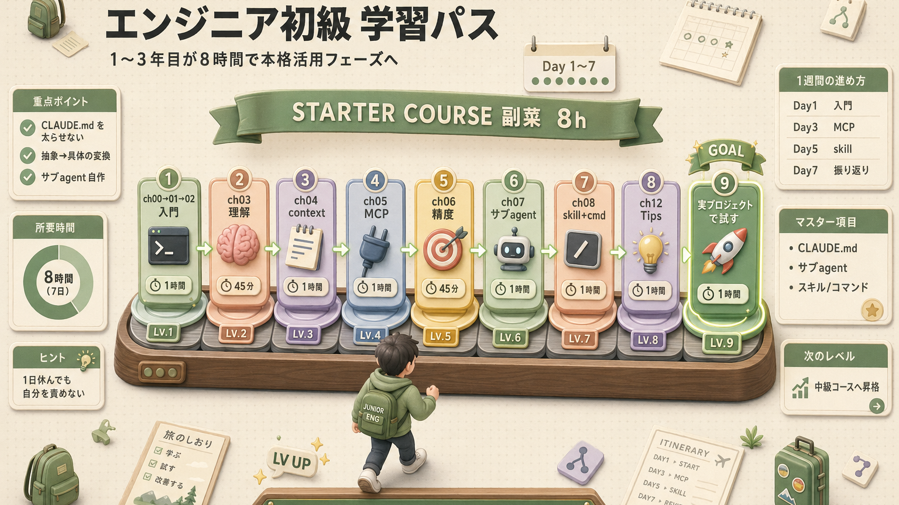

### 重点ポイント

- **第4回**:CLAUDE.md を太らせない感覚を掴む
- **第6回**:抽象 → 具体 の変換練習
- **第7回**:サブエージェント(専門タスクに分業させる小さな分身)を1つ自作

### 1週間のおすすめ進め方

学習ロードマップを「旅行のしおり」風に並べるとこうなります。

| 日 | やること |
|---|---|
| Day 1 | 00-02 学習 + 環境構築 |
| Day 2 | 03-04 学習 + CLAUDE.md 書く |
| Day 3 | 05 学習 + Context7/Chrome DevTools MCP |
| Day 4 | 06-07 学習 + サブエージェント1個 |
| Day 5 | 08 学習 + スキル/コマンド1個 |
| Day 6 | 12 Tips から3つ取り入れる |
| Day 7 | 振り返り + 自分用ハーネス改善 |

毎日きっかり1時間、合計1週間で習得できる設計になってます。**1日休んでも自分を責めないでください**、人類みんなそんなもんです。

---

## エンジニア中級

### あなたの状況
- プログラミング経験 4〜10年
- Claude Code を1〜4週間使った
- もっと深く使いこなしたい / チームに教えたい

中級コースは **学習というより、職人としての道具箱を組み上げるフェーズ** です。1ヶ月使うと「こういう小技が欲しい」「ここは毎回同じパターンだな」が見えてくるはず。**それを資産化していく工程** だと思ってください。

### 学習パス(11時間)

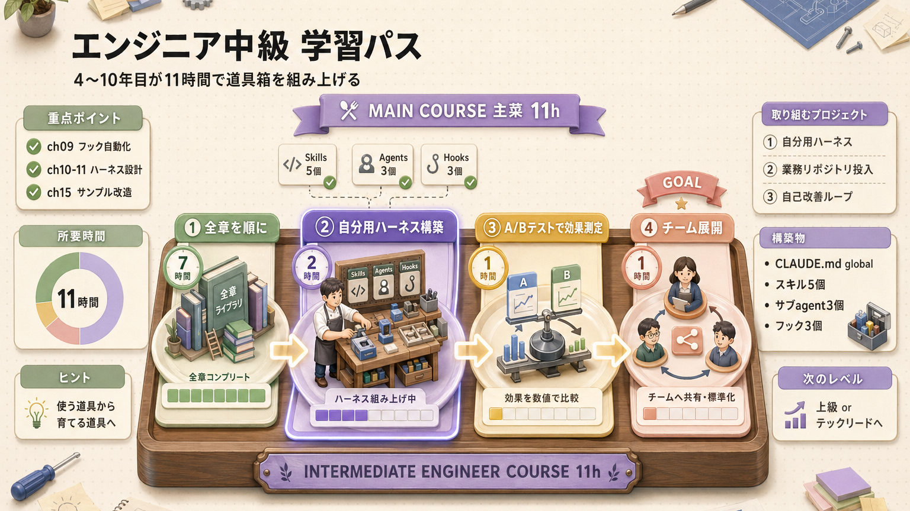

### 重点ポイント

- **第9回フック**:自動化の決定論的処理(必ず同じ結果になる処理)
- **10-第11回**:ハーネス(Claude Code を動かす足場)設計の型を覚える
- **第15回**:サンプルハーネスをベースに自分用を作る

### 取り組むべきプロジェクト

1. **自分用ハーネス**(`~/.claude/`)の構築
   - CLAUDE.md グローバル
   - よく使うスキル 5つ
   - サブエージェント 3つ
   - フック 3つ

2. **業務リポジトリへの投入**
   - プロジェクトの `.claude/` を整備
   - チーム共有用の規約

3. **自己改善ループの実装**
   - 編集ログ収集
   - 振り返りスキル
   - ルール化フロー

ここまでくると、**Claude Code が「使う道具」から「育てる道具」に変わってきます**。育成ゲーム好きな人にはたまらないやつですよ。

---

## エンジニア上級

### あなたの状況
- プログラミング経験 10年以上
- Claude Code を1ヶ月以上使った
- 効率の限界を更に押し上げたい

10年戦士のあなたへ。**正直、基礎章はスキムでいいです**。むしろ自動化の深掘りや、複数エージェントの並列協調みたいな、尖った領域に振り切った方が学びは大きいはず。**ラスボス級ダンジョンへようこそ**。

### 学習パス(6時間)

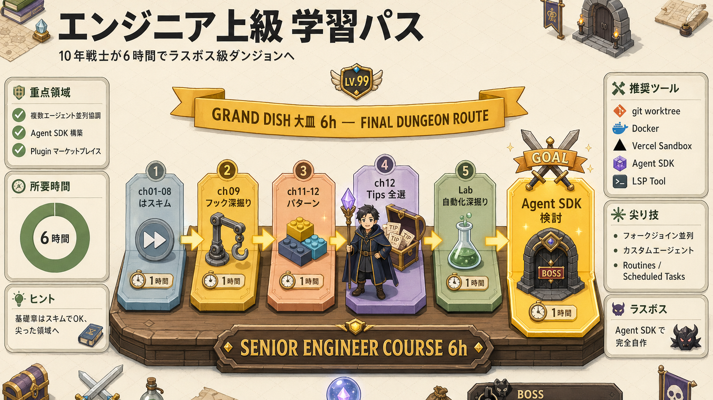

### 重点ポイント

- **複数エージェントの並列協調**(フォークジョイン + ワークツリー)
- **Agent SDK** で完全カスタムエージェント構築
- **Plugin マーケットプレイス** 自社配布
- **Routines / Scheduled Tasks** での恒常運用

### 推奨ツール
- `git worktree` 活用
- Docker サンドボックス(隔離された実行環境)
- Vercel Sandbox(実験用)
- Claude Agent SDK
- LSP Tool 有効化

---

## テックリード

### あなたの状況
- 5〜15人のチームを率いている
- メンバーへの Claude Code 普及を任されている
- 統制と生産性のバランスを取りたい

テックリードのあなたが直面するのは、**「個人で速く使う」じゃなくて「チームでハズレなく使う」** という別ゲーです。**ガードレールを敷きつつ、自由度も残す**。このさじ加減、実はけっこう難しいんですよ。

### 学習パス(7時間)

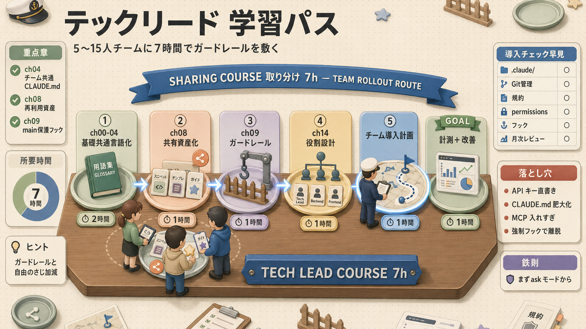

### 重点ポイント

- **第4回 CLAUDE.md**:チーム共通の指示書を整備
- **第8回スキル**:チーム再利用資産化
- **第9回フック**:main ブランチ保護・自動 Lint(コードの体裁チェック)
- **第15回**:サンプルハーネスをチーム標準に

### チーム導入チェックリスト

| | チェック |
|---|---|
|  | プロジェクト共有 `.claude/` を Git 管理 |
|  | `CLAUDE.md` にチーム規約を反映 |
|  | `permissions` で危険コマンド禁止 |
|  | フックで品質チェック自動化 |
|  | 議事録/PR/レビュー用スキルを共通化 |
|  | 個人設定(settings.local.json)の git-ignore |
|  | レビュー用サブエージェントの定義 |
|  | オンボーディング資料を用意 |
|  | 月次で利用状況レビュー(`/insights`) |

### よくある落とし穴

-  個人の API キーを `.mcp.json` に直書き → 必ず環境変数で
-  CLAUDE.md が肥大化 → docs/ への分離を徹底
-  MCP 入れすぎでチーム全員のコンテキストが圧迫
-  強制的なフックで生産性低下 → ask モードで段階的に

最後の「強制フックで生産性低下」、**これ本当によくあるやつ**。良かれと思って入れたチェックが、結果的にメンバーを Claude Code 離れさせる、という悲しい結末。**いきなり全部 deny にせず、まず ask(都度確認)から始めるのが鉄則** です。

---

## CTO / VPoE

### あなたの状況
- 投資判断・組織設計が責任範囲
- AI コーディングへの投資 ROI(Return on Investment = 投資対効果)を示したい
- 統治と生産性の両立

CTO(Chief Technology Officer = 技術責任者)/ VPoE(VP of Engineering = エンジニアリング担当役員)のあなたへ。**経営会議で「で、これって元取れるの?」と聞かれた時に答えられる材料**、ここに整理しておきました。

### 学習パス(4時間)

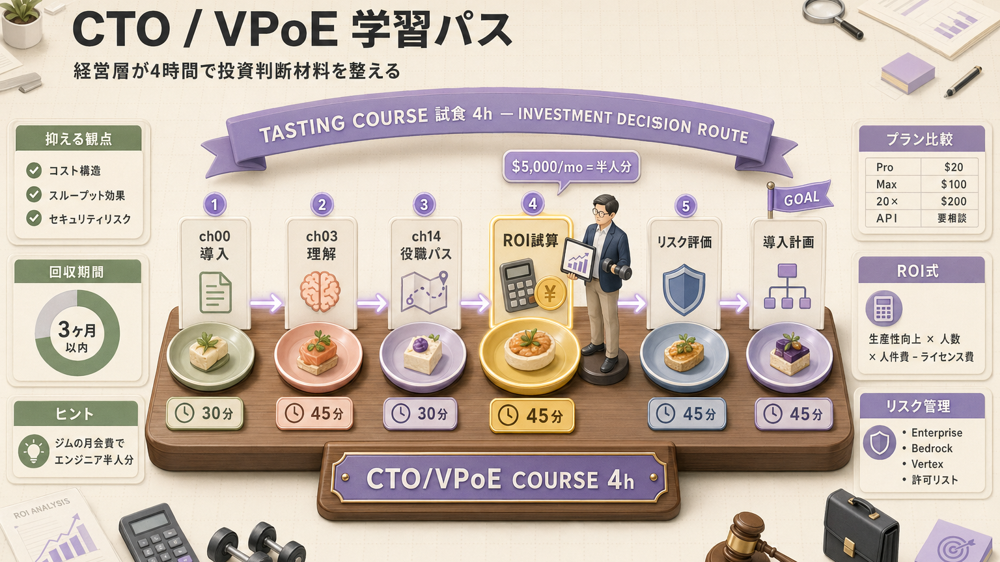

### 抑えるべき情報

| 観点 | 内容 |
|---|---|
| **コスト構造** | Pro $20 / Max $100 / 20× $200 / API 課金 |
| **スループット効果** | 上級者は2-5倍、初心者は1.3-2倍が目安 |
| **品質効果** | レビュー観点増・再現性ある規約適用 |
| **セキュリティリスク** | 機密情報リーク・誤実行 |
| **ガバナンス** | 部門別 / プロジェクト別の権限管理 |

### 投資判断のフレーム

```text
ROI = (生産性向上 × エンジニア人数 × 平均人件費) - (ライセンス費 + 研修費)
```

「Max プラン × 50人 = 月 $5,000」が「30%生産性向上 × $80K 人件費 × 50人」を超えるか?

→ ほとんどのケースで **3ヶ月以内に回収** できちゃいます。**ジムの月会費でエンジニア半人分が手に入るような感覚** とでも言えばいいでしょうか。

### リスク管理

- **企業向けプラン**(Enterprise)でデータ保存ポリシー指定
- **Bedrock / Vertex AI** 経由で自社クラウド内に閉じる
- **MCP の許可リスト** で接続先制限
- **`permissions.deny`** で機密ファイル保護

---

## PdM

### あなたの状況
- PdM(Product Manager = プロダクトマネージャー)
- エンジニアリング深掘りはしないが、AI 駆動開発の流れは押さえたい

PdM のあなたが Claude Code を触る価値、**実はかなり高いんですよ**。「エンジニアと共通の道具で会話できる」という、それだけで日々の仕様すり合わせが滑らかになります。コード書けなくて全然 OK、PRD(Product Requirements Document = プロダクト要件定義書)とインタビュー要約だけでも、十分元が取れます。

### 学習パス(5時間)

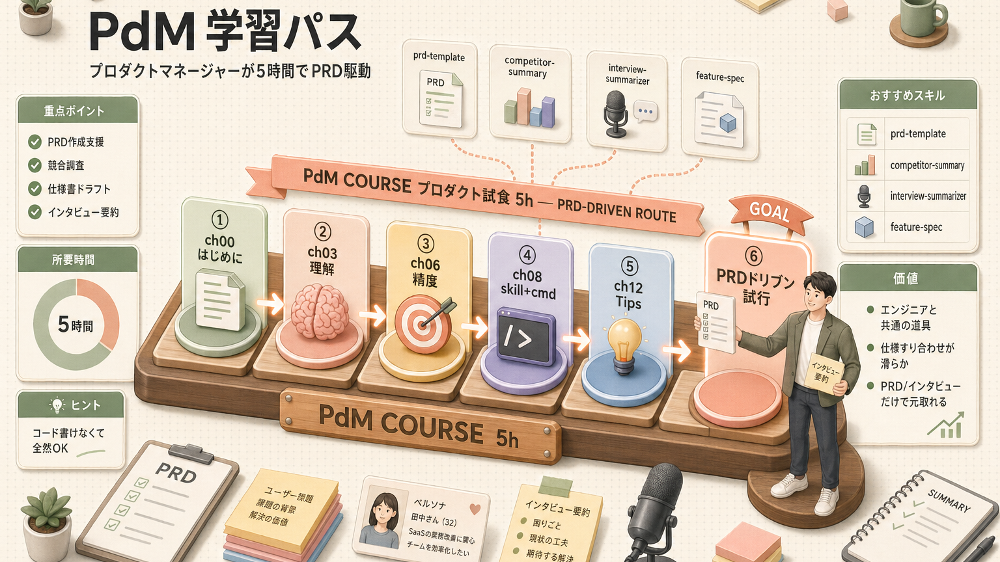

### 重点ポイント

- **PRD 作成支援**:要件定義のテンプレ化
- **競合調査**:MCP 経由でリサーチ自動化
- **仕様書ドラフト**:Claude にベース起こし
- **ユーザーインタビュー要約**:スキル化

### おすすめスキル
- `prd-template` — PRD のテンプレ生成
- `competitor-summary` — 競合まとめ
- `interview-summarizer` — インタビュー要約
- `feature-spec` — 機能仕様書テンプレ

---

## デザイナー

### あなたの状況
- UI/UX デザイナー
- Figma → コード生成の効率化に興味
- ブランドガイド整合の自動化

デザイナーのあなたへ。**「コード書ける気がしない…」って気にしなくて大丈夫です**。Figma MCP で繋げば、デザインを Claude が読んでそのままコードに落としてくれます。あなたのお仕事は **「どう実装するか」じゃなくて「どんなデザインで指示するか」** に集中するだけ。

### 学習パス(4時間)

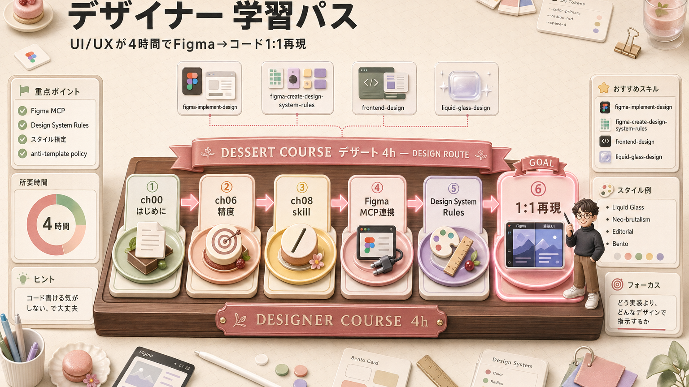

### 重点ポイント

- **Figma MCP** で直接デザインを取り込み
- **Design System Rules** で実装の一貫性
- **Liquid Glass / Neo-brutalism** などスタイル指定
- **anti-template policy**(テンプレ感回避方針)でテンプレ感を回避

### おすすめスキル
- `figma-implement-design` — Figma → コード
- `figma-create-design-system-rules` — DS 規約生成
- `frontend-design` — 高品質 UI 生成
- `liquid-glass-design` — iOS 26 風のデザイン

---

## 全員に共通：継続学習のコツ

ここからは、どの役職でも共通の話です。**Claude Code は進化が早すぎるので、習得してそのまま放置するとあっという間に時代遅れ** になります。とは言え毎日勉強する必要は全然なくて、ゆるい習慣で十分追いつけます。

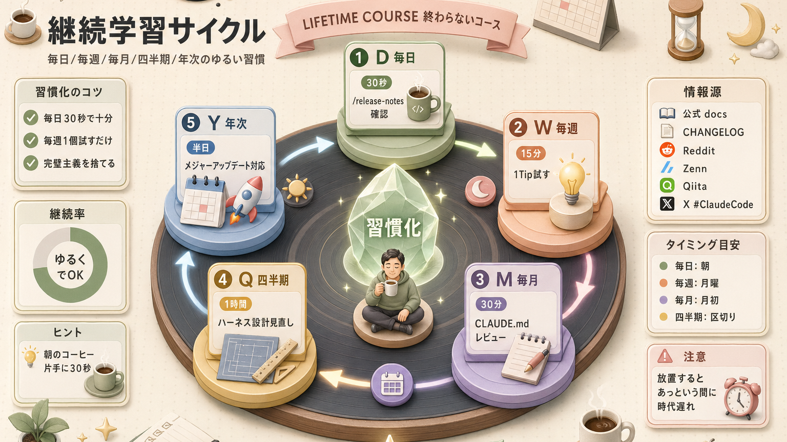

### 情報源
- 公式： <https://code.claude.com/docs>
- CHANGELOG: <https://github.com/anthropics/claude-code/blob/main/CHANGELOG.md>
- Reddit: r/ClaudeAI
- 日本語： Zenn / Qiita / X(旧 Twitter)の #ClaudeCode

「毎日リリースノート確認」って書いてますが、**ぶっちゃけ朝のコーヒー飲みながら30秒眺めるくらいでいい** です。たまにとんでもない神アップデートが混ざってるので、それを取りこぼさない程度で十分。

---

## 次へ

→ [付録 A. チートシート](/articles/claude-code-a1-cheatsheet)(リファレンス) / [付録 B. トラブルシューティング](/articles/claude-code-a2-troubleshooting)

## ふりかえり

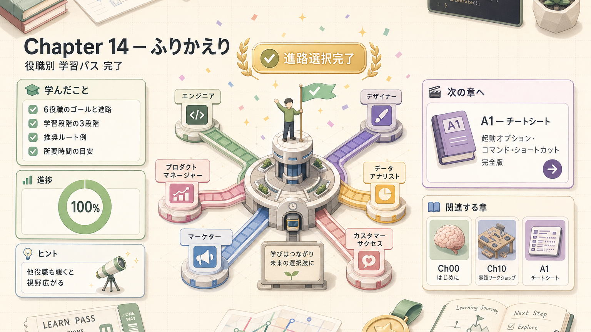

ここまでお疲れさまでした。**自分にあったコースは見つかりましたか?** メニューの全制覇を目指す必要はないので、まずは目の前のコースをひとつ最後まで食べきってみてください。終わる頃には、次に欲しいスキルが自然と見えてきます。**学習も Claude Code も、ゆっくり育てていけば大丈夫です。**

## 関連する章

-  **チームの実装テンプレ**:[第12回 サンプルハーネス](/articles/claude-code-12-sample-harness)
-  **どのパターンを採用するか**:[第11回 設計パターン](/articles/claude-code-11-harness-patterns)
-  **ガードレール**:[第7回 フック](/articles/claude-code-07-hooks) — `permissions.deny` で危険操作を組織的に禁止
-  **共通言語**:[第4回 コンテキスト管理](/articles/claude-code-04-context) — チーム共通 CLAUDE.md
-  **個別技**:[第13回 実践 Tips 集](/articles/claude-code-13-tips-techniques)

| | |
|---|---|
| ⬅ 前へ | [第13回 実践Tips集](/articles/claude-code-13-tips-techniques) |
|  次へ | [付録 A. チートシート](/articles/claude-code-a1-cheatsheet) |
|  目次 | [README.md](./README.md) |