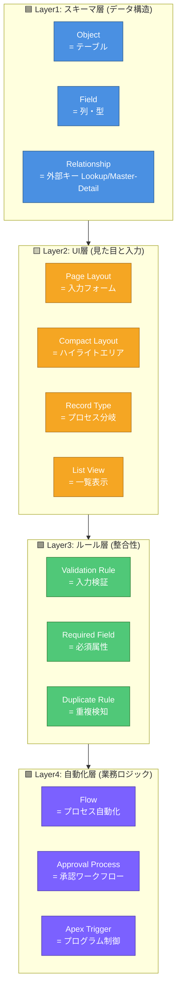
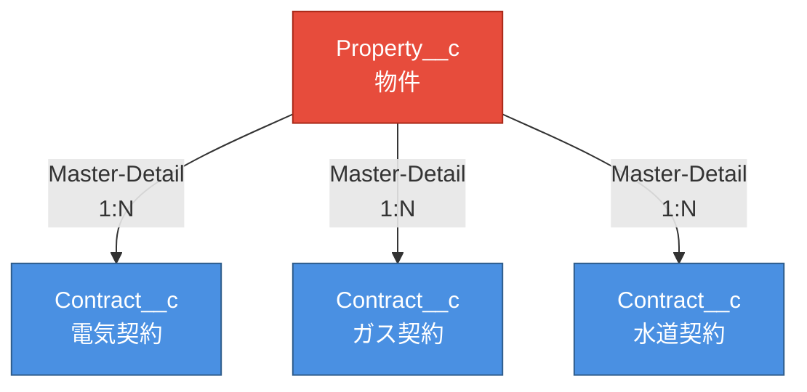
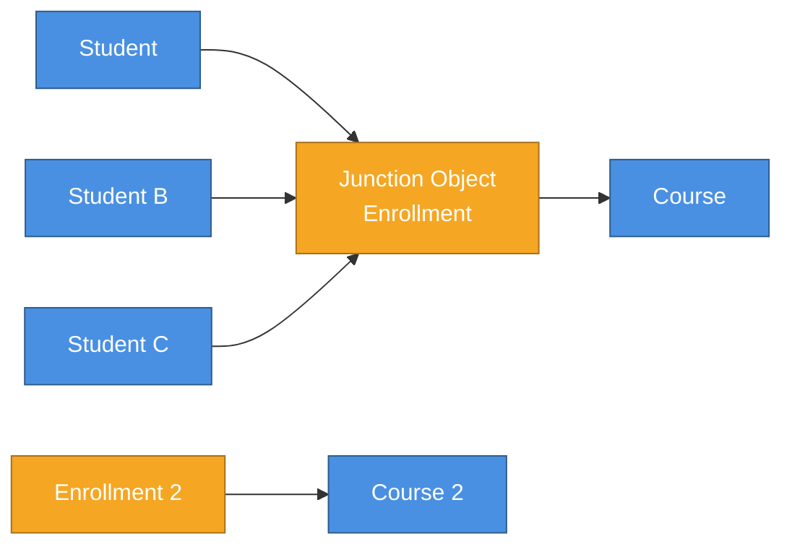
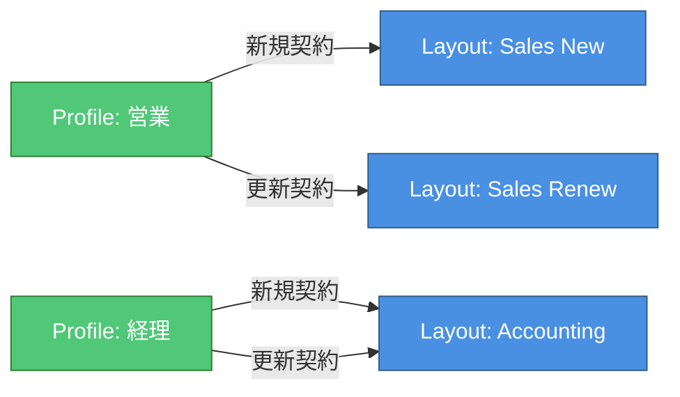
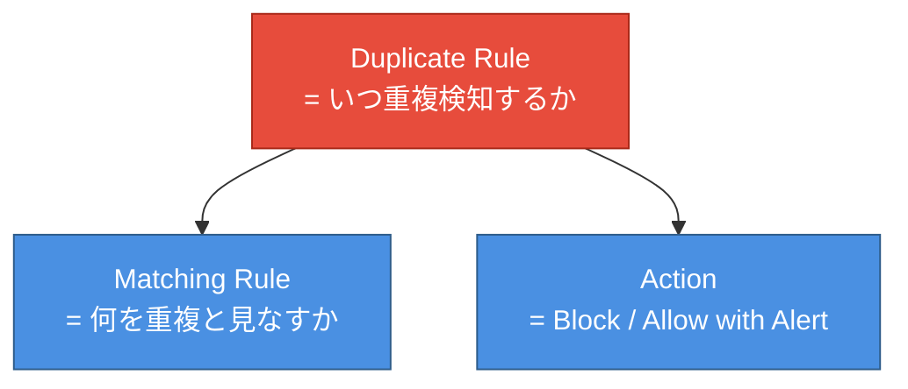
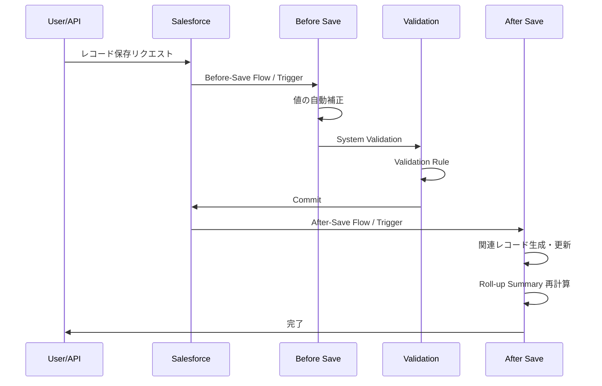

# Salesforce オブジェクト設定入門 — Jr.エンジニア向け

**対象**: Salesforce のオブジェクト・フィールド設定に初めて触れる Jr.エンジニア
**ゴール**: 「標準/カスタムオブジェクト / フィールド型 / リレーション / レイアウト / レコードタイプ / 検証ルール / 数式 / 自動化」を説明でき、要件から正しい設定を選べる状態になる

---

## 0. はじめに — なぜ Salesforce のオブジェクト設定は「層」になっているのか

Salesforce のオブジェクト設定は **「データ構造の定義 → 入力UI → 業務ルール → 自動化」の4段** に分かれています。RDB に例えると、フィールド定義が `CREATE TABLE`、ページレイアウトが入力 Form、検証ルールが `CHECK CONSTRAINT`、Flow が `TRIGGER`/`STORED PROCEDURE` を担当するイメージ。

- 営業は商談入力時に「顧客」「金額」「ステージ」を必須にしたい
- 経理は契約後にしか出ない項目だけ追加で見たい
- マネージャは閉じた案件には編集を禁止したい
- システムは特定条件で自動的にタスクを作成したい

これを破綻なく扱うために **層構造** にしてあり、まずはこの層を掴むのが最短の理解ルートです。

---


## 1. 全体像 — オブジェクト設定の 4 段モデル

Salesforce のオブジェクト設定は **4段** で考えます。



| 層 | 質問 | 主な設定項目 |
|----|------|-------------|
| スキーマ層 | 「**何を**保存するか」 | Object / Field / Relationship |
| UI層 | 「**どう入力・表示**するか」 | Page Layout / Compact Layout / Record Type / List View |
| ルール層 | 「**何を許す/拒む**か」 | Validation Rule / Required / Duplicate Rule |
| 自動化層 | 「**何を自動でやる**か」 | Flow / Approval Process / Apex |

> 💡 **Jr.向けポイント**: 「保存できない」「項目が出ない」時は、まずどの層の問題かを切り分ける癖をつける。**スキーマ → レイアウト → ルール → 自動化** の順で疑う。

---

## 📚 Trailhead 学習プラン (Admin試験対策・約5時間)

以下5モジュール + 動画で「**オブジェクト / フィールド / リレーション / レイアウト / レコードタイプ / 検証 / Flow**」を公式コンテンツで網羅。**Data Modeling → Page Layouts → Formulas/Validation → Flow → 演習** の順を推奨。

| # | モジュール (日本語版あり) | ユニット数 | 目安時間 | Trailhead URL |
|---|-----------|-----|--------|---------------|
| 1 | **Data Modeling** | 5 | 1 hr 25 min | [modules/data_modeling](https://trailhead.salesforce.com/content/learn/modules/data_modeling) |
| 2 | **Customize the User Interface** | 5 | 1 hr | [modules/customize_user_interface](https://trailhead.salesforce.com/content/learn/modules/customize_user_interface) |
| 3 | **Formulas and Validations** | 4 | 1 hr 5 min | [modules/point_click_business_logic](https://trailhead.salesforce.com/content/learn/modules/point_click_business_logic) |
| 4 | **Flow Builder** | 5 | 1 hr 30 min | [modules/flow_builder](https://trailhead.salesforce.com/content/learn/modules/flow_builder) |
| 5 | **Administrator Certification Prep: Setup and Objects** | 3 | 15 min | [modules/administrator-certification-prep-setup-and-objects](https://trailhead.salesforce.com/content/learn/modules/administrator-certification-prep-setup-and-objects) |
| 6 | (補助) **Object Manager 動画シリーズ** | 5 | 30 min | [admin.salesforce.com: Object Manager](https://admin.salesforce.com/blog/object-manager) |
|   | **合計** | **22** | **~5 hr 15 min** | |

### 🔖 各モジュールのユニット内訳 (何が学べるか・日本語解説)

#### 1. Data Modeling (85 min) ← 試験の主戦場

| ユニット | 時間 | 学べる内容 |
|---------|-----|----------|
| Optimize Customer Data with Standard and Custom Objects | 15 min | **標準/カスタムオブジェクトの違い**: 既存ビジネスプロセスへの当てはめ、いつカスタムを作るか、API Name の命名規則。 |
| Create Object Relationships | 25 min | **リレーション**: Lookup / Master-Detail / Many-to-Many / Hierarchical / External Lookup の使い分け、削除カスケード、ロールアップサマリーの可否。**試験頻出**。 |
| Work with Schema Builder | 10 min | **Schema Builder**: ER 図形式でオブジェクト関係を可視化、ドラッグでオブジェクト/フィールド作成。 |
| Create Custom Fields | 25 min | **フィールド型の選び方**: Text / Number / Picklist / Date / Lookup / Formula / Roll-up Summary の特徴、データ型の変更可否、項目の依存関係 (Field Dependency)。 |
| Work with Picklists | 10 min | **選択リストの設計**: グローバル選択リスト、レコードタイプごとの値制御、依存選択リスト (Dependent Picklist)。 |

#### 2. Customize the User Interface (60 min)

| ユニット | 時間 | 学べる内容 |
|---------|-----|----------|
| Customize the Lightning Experience UI | 10 min | **Lightning UI のカスタマイズ**: アプリ、ホームページ、レコードページの構成。 |
| Personalize the Layout of Records | 15 min | **Page Layout 編集**: 項目の並び替え、セクション、必須/読取専用、関連リスト、アクション。 |
| Configure Record Types and Page Layout Assignments | 15 min | **レコードタイプ × ページレイアウト**: プロセス別レイアウト、プロファイル別の割当、Picklist 値制御。 |
| Build Custom Lightning Pages | 10 min | **Lightning App Builder**: Lightning Record Page / App Page / Home Page、コンポーネント配置。 |
| Customize the Highlights Panel | 10 min | **Compact Layout (ハイライトパネル)**: モバイルとデスクトップ両方でレコード上部に出る要約項目。 |

#### 3. Formulas and Validations (65 min)

| ユニット | 時間 | 学べる内容 |
|---------|-----|----------|
| Use Formula Fields | 20 min | **数式項目**: 構文、戻り値の型、よく使う関数 (`IF`/`CASE`/`TEXT`/`ISBLANK`)、クロスオブジェクト数式。 |
| Implement Roll-Up Summary Fields | 15 min | **Roll-up Summary**: Master-Detail 関係でしか作れない、COUNT/SUM/MIN/MAX、フィルタ条件、再計算。 |
| Create Validation Rules | 20 min | **検証ルール**: 構文、エラーメッセージ表示位置、よくあるパターン (必須化、特定値の禁止)、優先順位。 |
| Use Workflow and Process Builder | 10 min | **(廃止予定だが試験範囲) Workflow と Process Builder**: いつ Flow に置き換えるべきか。 |

#### 4. Flow Builder (90 min)

| ユニット | 時間 | 学べる内容 |
|---------|-----|----------|
| Get Started with Flow Builder | 15 min | **Flow の全体像**: Screen Flow / Record-Triggered Flow / Scheduled Flow / Autolaunched Flow の使い分け。 |
| Build a Simple Flow | 20 min | **基本フロー作成**: 要素 (Screen / Get Records / Update / Decision)、変数、データ型、デバッグ。 |
| Customize Your Flow with Conditions | 15 min | **条件分岐**: Decision、Get Records 後の null 判定、Loop での反復処理。 |
| Build a Record-Triggered Flow | 25 min | **Record-Triggered Flow**: Before Save / After Save、Run Asynchronously、Trigger Order、Workflow/PB 置換。 |
| Get Started with Flow Testing | 15 min | **Flow テスト**: Debug 機能、Flow Test Builder、エラーログ確認、本番デプロイ前のテスト。 |

#### 5. Administrator Certification Prep: Setup and Objects (15 min)

| ユニット | 時間 | 学べる内容 |
|---------|-----|----------|
| Get Started with Administrator Certification Prep | 5 min | **試験概要**: 出題範囲・配点・合格ライン (65%)。 |
| Study Up on Configuration and Setup | 5 min | **設定の総復習**: 会社情報、ユーザ、UI、セキュリティのフラッシュカード形式。 |
| Review Object Manager and Lightning App Builder | 5 min | **Object Manager の使い方**: フィールド管理、ページレイアウト、レコードタイプの一括確認。 |

> 💡 **試験対策Tips**: Admin試験のオブジェクト関連設問は **「Lookup vs Master-Detail の使い分け」「Roll-up Summary が作れる条件」「Validation Rule の構文」「Record-Triggered Flow の起動タイミング」** が頻出。実 Org で必ず手を動かす。

### 🗺 本資料 → Trailhead のマッピング

| 本資料のセクション | 対応する Trailhead モジュール |
|------------------|----------------------------|
| §2 標準/カスタムオブジェクト | Data Modeling (Optimize Customer Data) |
| §3 フィールド型 | Data Modeling (Create Custom Fields) |
| §4 リレーション | Data Modeling (Create Object Relationships) |
| §5 ページレイアウト | Customize UI (Personalize the Layout) |
| §6 レコードタイプ | Customize UI (Configure Record Types) |
| §7 リストビュー | Customize UI (Lightning Experience UI) |
| §8 検証ルール | Formulas and Validations (Create Validation Rules) |
| §9 数式・Roll-up | Formulas and Validations (Use Formula Fields, Roll-Up Summary) |
| §10 重複管理 | Help: Duplicate Management |
| §11 自動化 (Flow) | Flow Builder 全体 |
| §12 データ保存順序 | Help: Triggers and Order of Execution |

### 📅 5日分割スケジュール例

| Day | 学習内容 | 時間 |
|-----|--------|-----|
| Day 1 | ① Data Modeling 全部 | 85 min |
| Day 2 | ② Customize the UI 全部 | 60 min |
| Day 3 | ③ Formulas and Validations | 65 min |
| Day 4 | ④ Flow Builder | 90 min |
| Day 5 | ⑤ Cert Prep + 本資料 §13 ハマりどころ + §15 チェックリスト | 45 min |

> 💡 **試験対策Tips**: Trailhead の **Hands-on Challenge** は実 Org が必須。**Developer Edition (無料)** で手を動かすのが最速。

---

## 🎯 各機能の要点早見表 (Jr.エンジニア向け: 機能 / 役割 / 他との違い / ユースケース)

### A. 9機能を1枚で俯瞰

| 機能 | 機能 (何をするもの) | 役割 (どの層) | 他との違い | 代表ユースケース |
|------|------------------|-----------|----------|---------------|
| **Object** | データを格納する「テーブル」 | スキーマ層 | 標準は既製、カスタムは自由作成 | 「契約案件」「物件情報」をカスタムで作成 |
| **Field** | レコードの「列・型」 | スキーマ層 | 型ごとに動作・表示が違う、後から型変更は制約あり | 金額 (Currency)、ステータス (Picklist) |
| **Relationship** | オブジェクト間の参照 (FK) | スキーマ層 | Lookup vs Master-Detail で削除挙動・共有・Roll-up可否が違う | 商談 → 顧客 (Lookup)、商品明細 → 商談 (M-D) |
| **Page Layout** | レコード詳細画面の入力フォーム | UI層 | プロファイル × レコードタイプで切替可 | 営業用と経理用でレイアウト分岐 |
| **Record Type** | プロセス別の入力経路 | UI層 | レイアウトと Picklist 値を切替える | 「新規契約」「更新契約」で項目を分岐 |
| **List View** | 一覧画面の絞込・並び・列 | UI層 | ユーザ単位の絞込ビュー | 「自分の今月の案件」「未着手のケース」 |
| **Validation Rule** | 入力時のチェック | ルール層 | DB CHECK 制約相当、保存阻止 | 「金額>0」「契約日が未来」必須 |
| **Formula Field** | 計算結果を表示する読取専用列 | スキーマ層 | 保存しない、参照時に計算 | 税込金額、契約期間日数 |
| **Roll-up Summary** | 子レコードの集計値 | スキーマ層 | **Master-Detail 必須**、データとして保存 | 商談明細の SUM が商談ヘッダに |

**💡 1行サマリ**
> 「**何を保存するか**」は **Object + Field + Relationship**
> 「**どう入力・表示するか**」は **Page Layout + Record Type + List View**
> 「**何を許すか**」は **Validation Rule + Required + Duplicate Rule**
> 「**何を自動でやるか**」は **Flow + Approval + Apex**

---


### B. 「Lookup vs Master-Detail」 — 一番混同しやすい関係定義

| 観点 | Lookup | Master-Detail |
|------|------|--------------|
| 親なし | 許容 (orphan OK) | **不可** (必ず親が必要) |
| 親削除時 | 子は残る (またはエラー) | **子も削除** (Cascade) |
| 共有設定 | 子が独自に持つ | **親に従属** (Controlled by Parent) |
| Roll-up Summary | ❌ 作れない | ✅ 作れる |
| 親変更 | 自由 | 設定で許可した時のみ可 |
| 1レコードあたり | 最大25個 | 最大2個まで |
| 代表ユースケース | 商談 → 担当者 (担当者削除しても商談残す) | 商品明細 → 商談 (商談消えたら明細も消す) |

**Jr.の判断基準:**
- **「親が消えたら子も消える」** が業務的に正しいなら Master-Detail
- **「親が消えても子を残したい」** なら Lookup
- **「子を集計したい (合計/件数)」** なら Master-Detail 必須
- 迷ったら **Lookup から始める**。後から Master-Detail に変換可 (条件付き)

---

### C. 「フィールド型 13選」 — 試験に出る型の使い分け

| 型 | 用途 | 注意点 |
|----|-----|-------|
| **Text (Text)** | 短文 (255字まで) | インデックス可、Unique 制約可 |
| **Text Area** | 長文 (32,768字まで) | リッチテキストは別型 |
| **Number** | 整数・小数 | 桁数 (Length) と小数点 (Decimal) を別指定 |
| **Currency** | 金額 | 通貨単位、複数通貨対応 |
| **Percent** | パーセント | 0.5 = 50% ではなく 50 = 50% で保存 |
| **Date** | 日付のみ | タイムゾーン非依存 |
| **Date/Time** | 日付 + 時刻 | タイムゾーン考慮 |
| **Email** | メール | 形式チェック内蔵 |
| **Phone** | 電話番号 | 自動フォーマット (米国形式) |
| **URL** | URL | 形式チェック + リンク化 |
| **Picklist** | 選択リスト | 単一/複数、Record Type 別制御可 |
| **Checkbox** | True/False | デフォルト値設定可 |
| **Lookup / Master-Detail** | 関連 | §B 参照 |
| **Formula** | 計算結果 | 読取専用、保存しない |
| **Roll-up Summary** | 子の集計 | **M-D 必須** |
| **Auto Number** | 自動採番 | 例: `OPP-{0000}` |
| **Geolocation** | 緯度経度 | DISTANCE 関数で距離計算 |

> ⚠️ **型変換の落とし穴**: Text → Picklist は OK、Picklist → Text は OK、しかし **Number → Text は不可逆**。型変更前に必ずバックアップ。

---

### D. 「Page Layout vs Record Type vs Lightning Record Page」 — UI 3層

| 観点 | Page Layout | Record Type | Lightning Record Page |
|------|-----------|-----------|---------------------|
| 役割 | 項目の配置 + 関連リスト | プロセス分岐 (Picklist 値 + Layout) | コンポーネント配置 (Tabs / Path / Sidebar) |
| 必須 | 1つは必要 | 任意 (使わなくても可) | 任意 (Lightning 環境のみ) |
| 切替軸 | プロファイル × Record Type | プロファイルごとに割当 | App / Record Type / Profile |
| 編集 | Layout Editor (古UI) | Setup > Object > Record Types | Lightning App Builder |
| 代表ユースケース | 「経理用に金額セクションを上に」 | 「新規契約」と「更新契約」で項目分岐 | 「営業用にPath表示」「マネージャ用に集計タブ」 |

**Jr.の判断基準:**
- 1つのプロセスで項目並びだけ変えたい → Page Layout のみ
- プロセスごとに Picklist 値を変えたい → Record Type を作る (Page Layout も別途必要)
- Lightning 画面でコンポーネント差し替えたい → Lightning Record Page

---

### E. 「Validation Rule vs Required Field vs Flow」 — 入力制御の3手段

| 観点 | Validation Rule | Required (Layout) | Flow (Before Save) |
|------|---------------|-----------------|------------------|
| 効くタイミング | 保存時 | 画面入力時 | 保存直前 (Layout 経由しない API も適用) |
| 経路 | UI / API 両方 | UI のみ | UI / API 両方 |
| 複雑な条件 | 可 (数式) | 不可 (固定) | 可 (Decision) |
| エラー表示位置 | 指定可 | フィールド横に固定 | カスタム可 |
| 自動補正 | 不可 (拒否のみ) | 不可 | 可 (値を書き換え可能) |
| 代表ユースケース | 「金額>0」「日付未来」 | 「商談名」「ステージ」必須 | 「ステージが Won なら確度を100に強制」 |

**Jr.の鉄則:**
- **静的な必須化** → Required (Layout)
- **条件付き必須・複雑チェック** → Validation Rule
- **値の自動補正・派生計算** → Before-Save Flow
- API インポート時もチェックしたい → Validation Rule か Flow

---

### F. 「Formula Field vs Roll-up Summary vs Flow Update」 — 派生値の3手段

| 観点 | Formula Field | Roll-up Summary | Flow (After Save) で更新 |
|------|-------------|---------------|----------------------|
| データ保存 | しない (参照時計算) | する (再計算は SF が管理) | する |
| 集計対象 | 自レコード or 親参照 | **子レコード集計** | 任意 |
| 必要な関係 | なし or Lookup | **Master-Detail 必須** | なし |
| パフォーマンス | 高 (計算は表示時のみ) | 中 (再計算負荷あり) | 低 (DML 実行) |
| レポート使用 | 可 | 可 | 可 |
| 代表ユースケース | 税込金額、契約期間日数 | 商談明細の合計、ケース件数 | 親の最新ステータス、複雑な集計 |

**Jr.の鉄則:**
- **計算するだけで保存不要** → Formula
- **子の合計/件数を持ちたい (M-D あり)** → Roll-up Summary
- **Lookup 関係で集計したい / 複雑な集計** → Flow + Get Records

---

### G. 「Flow の4種類」 — 自動化の使い分け

| 種類 | 起動契機 | 代表ユースケース |
|------|--------|---------------|
| **Screen Flow** | ユーザがボタン押下 | ガイド付き入力ウィザード、複数オブジェクト一括登録 |
| **Record-Triggered Flow** | レコード CRUD | 保存時に値補正、関連レコード生成、メール送信 |
| **Scheduled Flow** | 時刻起動 (cron的) | 毎朝の停滞案件抽出、月次バッチ |
| **Autolaunched Flow** | 他 Flow / Apex / Process から呼出 | 共通サブルーチン、再利用可能ロジック |

**Record-Triggered Flow の起動タイミング:**

```mermaid
flowchart LR
    Save([レコード保存]) --> BS{Before-Save Flow}
    BS --> ValRule[Validation Rule]
    ValRule --> DB[(DB Commit)]
    DB --> AS{After-Save Flow}
    AS --> Trigger[Apex Trigger After]
    Trigger --> WF[Workflow Rule<br/>(廃止予定)]
    WF --> RollUp[Roll-up Summary]
    RollUp --> Done([完了])

    classDef step fill:#4A90E2,stroke:#2E5C8A,color:#fff
    classDef db fill:#E74C3C,stroke:#A82818,color:#fff
    class BS,AS,ValRule,Trigger,WF,RollUp step
    class DB,Save,Done db
```

> 💡 **Before-Save Flow vs After-Save Flow**: Before は同レコードの値を書換え、DML が走らないので高速。After は他オブジェクト操作・メール送信に使う。

---

### H. 「列の追加 vs 行の検証 vs リレーションの確立」 — サンプルレコードで可視化

Jr.エンジニアが一番腹落ちしにくいのが **「フィールド・検証ルール・リレーションはそれぞれ何を実現するのか」** です。
答えは **「効く対象が違う」** から。テーブルで見ると明快になります。

#### 📋 サンプル: 物件契約管理オブジェクトの設計 — 生データ要件

「ライフライン契約案件 (Contract__c)」を管理したい。要件:
1. 契約には必ず物件 (Property__c) が紐づく
2. 物件には複数の契約が紐づく (1物件に電気・ガス・水道で別契約)
3. 金額は0より大きく、契約日は未来日付
4. 契約ステータスが Closed Won のとき確度は100%固定
5. 物件ごとの契約合計金額を物件側で集計表示

#### 🟦 ステップ1 — オブジェクト + フィールド (列を作る)

| Object | Field 名 | 型 | 必須 | 説明 |
|--------|---------|----|----|------|
| Property__c | Name | Text | ✅ | 物件名 |
| Property__c | Address__c | Text Area | ✅ | 住所 |
| Property__c | Total_Amount__c | Roll-up Summary | - | 契約合計 |
| Contract__c | Name | Auto Number | - | `CON-{0000}` |
| Contract__c | Property__c | Master-Detail (Property__c) | ✅ | 親物件 |
| Contract__c | Amount__c | Currency | ✅ | 契約金額 |
| Contract__c | Contract_Date__c | Date | ✅ | 契約日 |
| Contract__c | Stage__c | Picklist | ✅ | Prospecting / Negotiation / Closed Won / Closed Lost |
| Contract__c | Probability__c | Percent | ✅ | 確度 |
| Contract__c | Tax_Included__c | Formula (Currency) | - | `Amount__c * 1.1` |

→ **列の枠組み**ができた。データはまだ無効入力も入る。

#### 🟨 ステップ2 — リレーション (行同士をつなぐ)



→ **Master-Detail** にしたので:
- 物件削除時に契約も自動削除
- 物件側で `Total_Amount__c = SUM(Contract__c.Amount__c)` の Roll-up Summary が作れる
- 契約の共有は物件と同じ (Controlled by Parent)

#### 🟩 ステップ3 — 検証ルール (行の正しさを担保)

```
Validation Rule 1: 金額は0より大きい
  Rule Name: Amount_Must_Be_Positive
  Formula: Amount__c <= 0
  Error Message: "契約金額は0より大きい値を入力してください"
  Error Location: Field (Amount__c)

Validation Rule 2: 契約日は未来
  Rule Name: Contract_Date_Future
  Formula: Contract_Date__c < TODAY()
  Error Message: "契約日は今日以降を指定してください"
  Error Location: Field (Contract_Date__c)
```

→ **不正な行**が DB に入らなくなる。

#### 🟪 ステップ4 — Flow (条件付き自動補正)

```
Record-Triggered Flow (Before Save):
  Object: Contract__c
  Trigger: Create or Update
  Condition: ISCHANGED(Stage__c) AND Stage__c = "Closed Won"
  Action: Probability__c = 100
```

→ Closed Won に変えた瞬間、確度は100に**自動補正**。Validation Rule では「拒否」しかできないが、Flow では「書き換え」ができる。

#### 🎯 まとめ: 制御軸 × 効くタイミング

```
                データ保存リクエスト
                      │
                      ▼ (1) 必須チェック
                ┌─────────────────┐
                │ Required (Layout)│ ← UI 入力時
                └─────────────────┘
                      │
                      ▼ (2) 値補正
                ┌─────────────────┐
                │ Before-Save Flow │ ← 値書換可
                └─────────────────┘
                      │
                      ▼ (3) 検証
                ┌─────────────────┐
                │ Validation Rule  │ ← 拒否可
                └─────────────────┘
                      │
                      ▼ (4) DB Commit
                ┌─────────────────┐
                │  Master-Detail   │ ← 親なしは拒否
                │  (FK 制約)       │
                └─────────────────┘
                      │
                      ▼ (5) 後処理
                ┌─────────────────┐
                │ After-Save Flow  │ ← 他レコード更新
                │ Roll-up再計算    │
                └─────────────────┘
```

#### 💡 Jr.が覚えるべき1行メッセージ

> **Field = 「列の定義」(構造)**
> **Relationship = 「行同士の関係」(結合)**
> **Validation Rule = 「行の正しさ」(保存可否)**
> **Flow = 「保存前後の自動処理」(派生・連鎖)**
>
> どれか1つが欠けると業務が成立しない。**スキーマ → リレーション → ルール → 自動化** の順で設計する。

---

## 2. Object (オブジェクト) — 「データのテーブル」

### 2.1 標準オブジェクト (Standard Object)

Salesforce が事前定義している既製テーブル。代表例:

| Object | 用途 |
|--------|-----|
| Account | 取引先 (会社) |
| Contact | 取引先責任者 (人) |
| Lead | 見込み客 (商談化前) |
| Opportunity | 商談 (案件) |
| Case | サポートケース |
| Product | 製品マスタ |
| Pricebook | 価格表 |

### 2.2 カスタムオブジェクト (Custom Object)

要件に応じて Admin が作成。API Name は **`__c`** が末尾に自動付与。

```
Object Label: 物件
API Name: Property__c
Plural: 物件
Record Name: Property Name (Text) または Auto Number
Help Text, Description
Allow Reports / Activities / Field History Tracking 等の有効化
```

> ⚠️ **誤解しやすい点**: API Name は **後から変更不可**。命名は慎重に (PascalCase or snake_case)。

### 2.3 External Object (外部オブジェクト)

Salesforce 外部の DB を **Salesforce Connect** 経由でリアルタイム参照。**`__x`** が末尾につく。データは Salesforce 内に保存されない。

---

## 3. Field (フィールド) — 「列の定義」

### 3.1 フィールド型早見表

§ C 早見表参照。

### 3.2 Field Dependency (項目の依存関係)

選択リストの値を **別の選択リストの値で絞り込む**。

```
Country (Controlling)     →    State/Region (Dependent)
─────────────────────────────────────────────────────
Japan                          東京 / 神奈川 / 大阪 / ...
USA                            California / Texas / NY / ...
UK                             England / Scotland / ...
```

設定: Setup > Object > Fields > Field Dependencies > New

### 3.3 Field-Level Security (FLS)

各プロファイル/権限セットで項目の **Read/Edit** を個別制御。**Page Layout と独立**。

> ⚠️ **落とし穴**: Page Layout で項目を必須にしても、FLS で Read Only ならエラーになる。両方の整合が必要。

### 3.4 History Tracking (項目履歴管理)

各オブジェクトで最大 **20項目** まで変更履歴を保持。Field History Related List で表示、レポートも可。

---

## 4. Relationship (リレーション) — 「行同士の関係」

### 4.1 リレーションの種類

| 種類 | 用途 | 削除挙動 | Roll-up |
|------|-----|--------|--------|
| **Lookup** | ゆるい参照 | 子残る (or エラー or null) | ❌ |
| **Master-Detail** | 強い親子 | 子も削除 (Cascade) | ✅ |
| **External Lookup** | External Object 参照 | - | ❌ |
| **Indirect Lookup** | External から Salesforce へ | - | ❌ |
| **Hierarchical** | User → User 専用 (上司階層) | 子残る | ❌ |
| **Many-to-Many** | M:N (Junction Object 経由で M-D 2本) | 中間消える | ✅ (Junction で) |

### 4.2 Many-to-Many リレーション



**実装:**
1. Junction Object (Enrollment) を作成
2. Junction に **Master-Detail を2本** 張る (Student と Course それぞれ)
3. 1本目が Primary (共有・所有を支配)、2本目が Secondary

### 4.3 Lookup の動作オプション

Lookup フィールド作成時に「親が削除された時の挙動」を選択:

| オプション | 動作 |
|---------|------|
| **Clear the value** (推奨) | 子の Lookup 値を null に |
| **Don't allow deletion** | 親削除を**拒否** |
| **Delete this record** | 子も削除 (M-D相当) |

---

## 5. Page Layout (ページレイアウト) — 「入力フォーム」

### 5.1 構成要素

```
[Highlights Panel]   ← Compact Layout
[Path]               ← Stage 進捗 (Lightning)
[Detail Section]
  ├ Section 1: 基本情報
  │  ├ Field: Name
  │  ├ Field: Owner
  │  └ Field: Date
  ├ Section 2: 金額情報
  │  ├ Field: Amount
  │  └ Field: Currency
  └ Section 3: 詳細
     └ Long Text Area: Description
[Related Lists]      ← 子オブジェクト一覧
  ├ Contracts (M-D 子)
  └ Tasks
[Buttons / Actions]  ← New, Edit, Delete, Custom
```

### 5.2 Page Layout × Record Type × Profile の割当



設定: Setup > Object > Record Types > Page Layout Assignment

---

## 6. Record Type (レコードタイプ) — 「プロセス分岐」

### 6.1 何が切替えられるか

| 要素 | Record Type で切替可? |
|------|------------------|
| Page Layout | ✅ |
| Picklist Values | ✅ |
| Business Process (Sales Process / Support Process) | ✅ |
| Field Required | ❌ (Layout で別途) |
| Validation Rule | ❌ (Rule 内で `RecordTypeId` 判定可) |

### 6.2 設計例: 「新規契約」と「更新契約」を分岐

```
Record Type 1: 新規契約 (New)
  ├ Page Layout: Sales New
  ├ Stage: Prospecting / Negotiation / Closed Won / Closed Lost
  └ Required: 顧客紹介経路

Record Type 2: 更新契約 (Renew)
  ├ Page Layout: Sales Renew
  ├ Stage: Pending Review / Closed Won / Closed Lost
  └ Required: 前契約ID
```

> 💡 **実務Tips**: Record Type は**増やしすぎない**。3〜5個が目安。10個以上になると保守困難。

---

## 7. List View (リストビュー) — 「一覧の絞込」

各オブジェクト一覧画面で使える **絞込済みビュー**。

### 7.1 設定項目

```
List Name: My Open Opportunities
Filter:
  - Owner = 自分
  - Stage NOT IN (Closed Won, Closed Lost)
Columns: Name, Account, Amount, Stage, Close Date
Sort: Close Date ASC
Sharing: Only me / All users / Specific users-roles
```

### 7.2 List View の権限

- **Personal List View**: 自分専用 (誰でも作成可)
- **Public List View**: 全員/指定範囲に公開 (権限が必要: Manage Public List Views)

> 💡 **Inline Edit**: List View 上で値を直接編集可。一括編集にも対応 (Mass Inline Edit)。

---

## 8. Validation Rule (検証ルール) — 「保存時の拒否」

### 8.1 構文の基本

**Formula が `TRUE` のときエラーになる** (= エラー条件を書く)。

```
ルール名: Amount_Positive
Formula:
  Amount__c <= 0
Error Message: 金額は0より大きい値を入力してください
Error Location: Field (Amount__c) または Top of Page
```

### 8.2 よく使うパターン

```
1. 必須化 (条件付き):
   AND(ISPICKVAL(Stage__c, "Closed Won"), ISBLANK(Close_Date__c))

2. 過去日禁止:
   Contract_Date__c < TODAY()

3. 特定 Record Type の時だけチェック:
   AND(
     RecordType.DeveloperName = "Renew",
     ISBLANK(Previous_Contract__c)
   )

4. 金額と確度の整合:
   AND(
     ISPICKVAL(Stage__c, "Closed Won"),
     Probability__c <> 100
   )

5. Email形式チェック (内蔵だが業務固有):
   NOT(REGEX(Email, "^[A-Za-z0-9._%+-]+@example\\.co\\.jp$"))
```

### 8.3 評価順序

```
1. System Validation (形式チェック、必須項目)
2. Before-Save Flow / Apex Trigger (Before)
3. Custom Validation Rule
4. Duplicate Rule
5. DB Commit
6. After-Save Flow / Apex Trigger (After)
```

> ⚠️ **Before-Save Flow で値補正したのに Validation Rule で蹴られた**、という事故は頻発。順序を理解する。

---

## 9. Formula Field & Roll-up Summary

### 9.1 Formula Field

```
Field Name: Tax_Included_Amount__c
Return Type: Currency
Formula: Amount__c * 1.1
```

```
Field Name: Days_Until_Close__c
Return Type: Number
Formula: Close_Date__c - TODAY()
```

```
Field Name: Status_Label__c (cross-object)
Return Type: Text
Formula:
  CASE(
    Account.Industry,
    "Real Estate", "不動産",
    "Construction", "建設",
    "その他"
  )
```

> 💡 **Cross-object 数式**: `Account.Field__c` で親の値を参照可。最大 **10階層** まで遡れる。

### 9.2 Roll-up Summary

```
Parent Object: Property__c
Field Name: Total_Contract_Amount__c
Type: Roll-up Summary
Source: Contract__c (Master-Detail child)
Operation: SUM
Field to aggregate: Amount__c
Filter: Stage__c = "Closed Won"
```

→ 親に「Closed Won の契約金額合計」が自動計算される。子レコード追加・削除・編集で**自動再計算**。

| Operation | 説明 |
|----------|------|
| COUNT | 子レコード件数 |
| SUM | 数値項目の合計 |
| MIN / MAX | 最小・最大 |

> ⚠️ **制限**: 1オブジェクトあたり Roll-up Summary は **最大25個**。再計算負荷を考慮。

---

## 10. 重複管理 (Duplicate Management)

### 10.1 構成要素



### 10.2 Matching Rule (照合ルール)

「何をもって重複とするか」を定義:

```
Object: Account
Match Field 1: Name (Exact, ignore whitespace)
Match Field 2: BillingPostalCode (Exact)
Match Logic: 1 AND 2
```

### 10.3 Duplicate Rule (重複ルール)

「いつ・どう動くか」を定義:

```
Object: Account
Conditions:
  - Source: 全ユーザ
  - Action on Create: Block (拒否)
  - Action on Edit: Allow with Alert (警告のみ)
  - Matching Rule: 上で作ったルール
```

> 💡 **デフォルトで標準ルール** (Standard Account Duplicate Rule など) が有効。カスタムで差し替え可。

---

## 11. 自動化 (Flow 中心)

### 11.1 Flow の起動方法と Trigger Order



### 11.2 よくある Flow パターン

#### Pattern 1: 値の自動補正 (Before-Save)

```
Trigger: Contract__c, Create or Update
Condition: ISCHANGED(Stage__c) AND Stage__c = "Closed Won"
Action: Set Probability__c = 100
```

#### Pattern 2: 関連レコード生成 (After-Save)

```
Trigger: Account, Create
Action:
  1. Create Task: 「初回ヒアリング」担当=Owner、期日=今日+3日
  2. Create Contact: 仮Contact「未確認」
```

#### Pattern 3: スケジュール (Scheduled Flow)

```
Schedule: 毎朝 9:00
Action:
  1. Get Records: Contract where Stage = Negotiation AND LastModifiedDate < TODAY-30
  2. Loop: 各レコードに対して
     - メール送信: 担当者に「停滞案件アラート」
```

### 11.3 Approval Process (承認プロセス)

| 用途 | 例 |
|-----|-----|
| 金額閾値超過の承認 | 1000万超の商談は部長承認 |
| ステータス変更承認 | Closed Won に変える前に CFO 承認 |
| 多段承認 | 部長 → 本部長 → CEO |

設定: Setup > Approval Processes > New Approval Process

---

## 12. データ保存順序 (Order of Execution) — 試験頻出

```
1. システムバリデーション (必須項目、データ型、最大長)
2. ★ Before-Save Flow (Record-Triggered)
3. ★ Apex Trigger (before insert / before update)
4. ★ カスタム Validation Rule
5. Duplicate Rule
6. ★ DB Commit
7. ★ Apex Trigger (after insert / after update)
8. ★ After-Save Flow (Record-Triggered)
9. Assignment Rule (Lead/Case)
10. Auto-Response Rule
11. Workflow Rule (廃止予定)
12. Process Builder (廃止予定)
13. Escalation Rule (Case)
14. Roll-up Summary 再計算
15. グリッドビュー / リストビュー反映
16. レコードロック解除
17. Post-Commit Logic (送信メール・Outboundメッセージ)
```

> 💡 **Before-Save Flow が最速**な理由: ステップ2で完結、DML が走らないため。値補正用途で使うべき。

---

## 13. よくあるハマりどころ (Jr.向けチートシート)

### ❌ ハマり1: 「フィールドを作ったのに画面に出ない」

- 原因: **Page Layout に追加していない**
- 対処: Setup > Object > Page Layouts で対象 Layout を編集、フィールドをドラッグ

### ❌ ハマり2: 「Roll-up Summary が作れない」

- 原因: **Lookup 関係しか張ってない (Master-Detail が必要)**
- 対処: Lookup → Master-Detail に変換 (子レコードに親が全件入っている前提)

### ❌ ハマり3: 「Master-Detail に変換できない」

- 原因: 子レコードに **null の Lookup が1件でもある**
- 対処: 全子レコードの Lookup を埋める → 変換実行

### ❌ ハマり4: 「Validation Rule が動かない」

- 原因候補:
  1. **Active チェックが OFF**
  2. Formula が `FALSE` を返す書き方になっている (エラー時に TRUE が正解)
  3. Profile の **System Permissions に "Bypass Validation Rules" が ON**
- 対処: Activate、Formula 反転、権限確認

### ❌ ハマり5: 「Page Layout に必須項目を追加したのに API インポートで弾かれない」

- 原因: **Page Layout の Required は UI のみ。API には効かない**
- 対処: Field 自体を Required にする or Validation Rule で `ISBLANK()` チェック

### ❌ ハマり6: 「Picklist の選択肢を増やしたのに Record Type 別画面で出ない」

- 原因: **Record Type の Picklist Values で割当てていない**
- 対処: Setup > Record Types > Edit > Picklist Values

### ❌ ハマり7: 「Record-Triggered Flow が想定と違うタイミングで動く」

- 原因: **Before-Save / After-Save の選択ミス**
- 対処:
  - 値補正・同レコード書換 → Before-Save
  - 関連レコード操作・メール → After-Save

### ❌ ハマり8: 「Roll-up Summary の値が再計算されない」

- 原因: **手動 Apex 操作 / 大量データ更新の遅延**
- 対処: Setup > Object > field details > "Force a Mass Recalculation"

### ❌ ハマり9: 「カスタムオブジェクトの API Name が長くて怒られる」

- 原因: API Name は **40文字以内** (`__c` 除く)
- 対処: 短く命名 (`Property__c` not `RealEstatePropertyManagement__c`)

### ❌ ハマり10: 「Field Dependency が表示されない」

- 原因: Controlling Field と Dependent Field の Page Layout 配置順 (Controlling が先になければならない)
- 対処: Layout で順序を入れ替え

---

## 14. 設定の確認場所まとめ

| 設定 | 場所 |
|------|------|
| オブジェクト一覧 | 設定 > Object Manager |
| フィールド管理 | Object Manager > 対象 Object > Fields & Relationships |
| ページレイアウト | Object Manager > 対象 Object > Page Layouts |
| Lightning Record Page | Object Manager > 対象 Object > Lightning Record Pages |
| Compact Layout | Object Manager > 対象 Object > Compact Layouts |
| レコードタイプ | Object Manager > 対象 Object > Record Types |
| リストビュー | 各オブジェクト一覧画面 > List View Controls > New |
| 検証ルール | Object Manager > 対象 Object > Validation Rules |
| Field Dependencies | Object Manager > 対象 Object > Fields > Field Dependencies |
| Roll-up Summary | Object Manager > 対象 Object > Fields > New > Roll-Up Summary |
| Schema Builder | 設定 > Schema Builder |
| Flow | 設定 > Process Automation > Flows |
| Approval Process | 設定 > Process Automation > Approval Processes |
| Duplicate Rule | 設定 > Data > Duplicate Rules / Matching Rules |
| Object Limits | Object Manager > 対象 Object > Object Limits |

---

## 15. 学習チェックリスト ✅

以下が答えられれば合格ラインです。

- [ ] Lookup と Master-Detail の決定的な違いを4つ挙げよ
- [ ] Roll-up Summary を作るための前提条件は？
- [ ] Many-to-Many リレーションはどう実装する？
- [ ] Page Layout、Record Type、Lightning Record Page の役割の違いは？
- [ ] Validation Rule で「TRUE になったらエラー」を表現するロジックを書け
- [ ] Required (Layout) と Validation Rule のチェックタイミングの違いは？
- [ ] Before-Save Flow と After-Save Flow の使い分けは？
- [ ] Order of Execution で Validation Rule はどこで動く？
- [ ] Field Dependency と Record Type の Picklist 値制御の違いは？
- [ ] Formula Field、Roll-up Summary、Flow Update を使い分ける基準は？
- [ ] Master-Detail 関係で親を削除すると子はどうなる？
- [ ] Custom Object の API Name の命名ルールと制限は？
- [ ] Record-Triggered Flow の4種類のトリガー条件を挙げよ
- [ ] Duplicate Rule の Action で Block と Allow with Alert の使い分けは？

---

## 付録: 用語集

| 用語 | 意味 |
|------|------|
| Object | データを格納するテーブル相当 |
| Standard Object | Salesforce 標準提供のオブジェクト |
| Custom Object | Admin が作成するオブジェクト (`__c`) |
| External Object | 外部DB参照のオブジェクト (`__x`) |
| Field | オブジェクトの列・型 |
| Lookup | ゆるい参照リレーション |
| Master-Detail | 親子強結合リレーション |
| Junction Object | M:N を実現する中継オブジェクト (M-D 2本) |
| Hierarchical Relationship | User オブジェクト専用の階層 Lookup |
| FLS | Field-Level Security。項目レベルセキュリティ |
| Field Dependency | 選択リスト間の依存制御 |
| Page Layout | レコード詳細画面のレイアウト |
| Compact Layout | ハイライトパネル (上部要約) |
| Record Type | プロセス分岐とレイアウト切替 |
| Lightning Record Page | Lightning App Builder で作る画面 |
| List View | 一覧の絞込ビュー |
| Validation Rule | 入力検証ルール |
| Formula Field | 計算結果を返す読取専用フィールド |
| Roll-up Summary | 子レコードを集計するフィールド (M-D 必須) |
| Auto Number | 自動採番フィールド |
| Duplicate Rule | 重複検知ルール |
| Matching Rule | 重複の照合条件 |
| Flow | 宣言的自動化ツール |
| Record-Triggered Flow | レコード CRUD 時に起動する Flow |
| Screen Flow | UI を伴うガイド付き Flow |
| Scheduled Flow | 時刻起動の Flow |
| Approval Process | 承認ワークフロー |
| Order of Execution | データ保存時の処理順序 |
| Schema Builder | ER 図形式のオブジェクト管理ツール |

---

**参考公式ドキュメント:**
- Trailhead: *Data Modeling* モジュール
- Trailhead: *Flow Builder* モジュール
- Help: *Object Relationships Overview*
- Help: *Triggers and Order of Execution*
- Help: *Validation Rules Considerations*
