# Salesforce 権限管理入門 — Jr.エンジニア向け

**対象**: Salesforce に初めて触れる Jr.エンジニア
**ゴール**: 「ユーザ / ライセンス / プロファイル / 権限セット / 共有設定 / ロール階層」を説明でき、アクセスが決まる順序を追える状態になる

---

## 0. はじめに — なぜ Salesforce の権限は複雑なのか

Salesforce は **「業務システムで、かつ複数部門が同居する」** 前提で作られているため、単純な「Admin / User」の2値では足りません。

- 営業A は自分の商談しか見たくない
- 営業マネージャは配下の商談を全部見たい
- 経理は全商談の金額だけ見たい（担当者名は隠したい）
- 外部パートナーは自社に関連する一部だけ見られる

これを破綻なく扱うために **権限が「層」になっています**。まずはこの層構造を掴むのが最短の理解ルートです。

---


## 1. 全体像 — アクセス制御の 2 軸モデル

Salesforce の権限は大きく **2軸** で考えます。

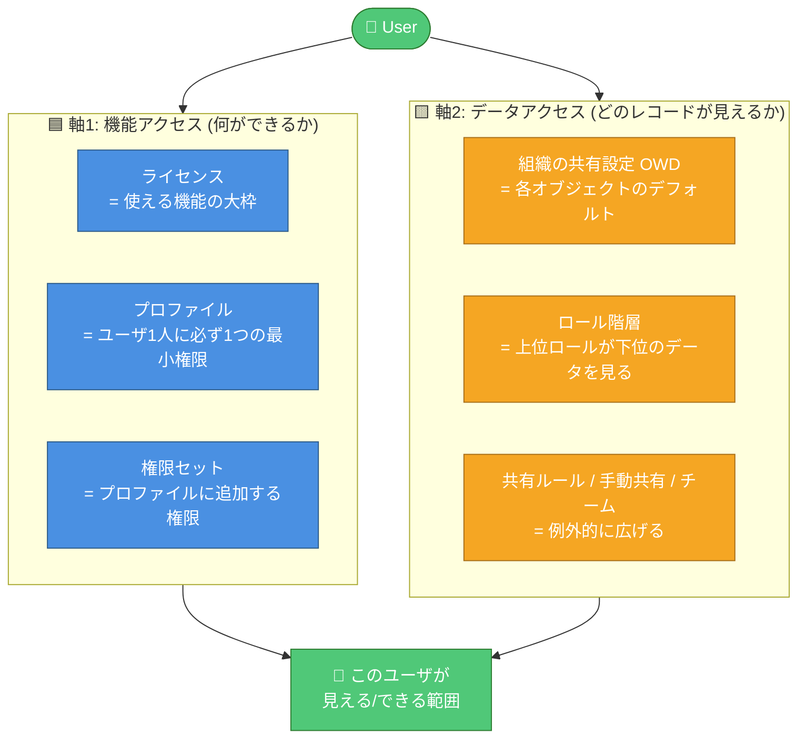

| 軸 | 質問 | 主な設定項目 |
|----|------|-------------|
| 機能アクセス | 「そのユーザは**何ができる**か？」 | ライセンス / プロファイル / 権限セット |
| データアクセス | 「そのユーザは**どのレコードを見られる**か？」 | OWD / ロール階層 / 共有ルール |

> 💡 **Jr.向けポイント**: 「エラーが出た」「レコードが見えない」時、まずどっちの軸の問題かを切り分ける癖をつけよう。

---

## 📚 Trailhead 学習プラン (Admin試験対策・約5時間)

以下6モジュール + 動画シリーズで「**ユーザ / ライセンス / プロファイル / 権限セット / 共有設定 / ロール共有**」を公式コンテンツで網羅。**License → User → Permission Set Group → Data Security → 演習** の順を推奨。

| # | モジュール (日本語版あり) | ユニット数 | 目安時間 | Trailhead URL |
|---|-----------|-----|--------|---------------|
| 1 | **Salesforce Licensing: Understanding Features and Access** | 3 | 20 min | [modules/salesforce-licensing](https://trailhead.salesforce.com/content/learn/modules/salesforce-licensing) |
| 2 | **User Management** | 2 | 45 min | [modules/lex_implementation_user_setup_mgmt](https://trailhead.salesforce.com/content/learn/modules/lex_implementation_user_setup_mgmt) |
| 3 | **Permission Set Groups** | 3 | 40 min | [modules/permission-set-groups](https://trailhead.salesforce.com/content/learn/modules/permission-set-groups) |
| 4 | **Data Security** | 7 | 1 hr 50 min | [modules/data_security](https://trailhead.salesforce.com/content/learn/modules/data_security) |
| 5 | **Administrator Certification Prep: Setup and Objects** | 3 | 15 min | [modules/administrator-certification-prep-setup-and-objects](https://trailhead.salesforce.com/content/learn/modules/administrator-certification-prep-setup-and-objects) |
| 6 | **Administrator Certification Prep: Security and Data Management** | 2 | 30 min | [modules/administrator-certification-prep-security-and-data-management](https://trailhead.salesforce.com/content/learn/modules/administrator-certification-prep-security-and-data-management) |
| 7 | (補助) **Who Sees What 動画シリーズ** — 可視化の全体像を映像で復習 | 6 | 40 min | [admin.salesforce.com: Who Sees What](https://admin.salesforce.com/blog/2023/who-sees-what-data-visibility-and-access) |
|   | **合計** | **26** | **~5 hr** | |

### 🔖 各モジュールのユニット内訳 (何が学べるか・日本語解説)

#### 1. Salesforce Licensing: Understanding Features and Access (20 min)

| ユニット | 時間 | 学べる内容 |
|---------|-----|----------|
| Understand How Licenses Work | 10 min | **ライセンスの基本概念**: ライセンスとは何か、エディション (Essentials / Professional / Enterprise / Unlimited) の違い、契約単位で何が変わるか。「プロファイルより上位の制約」である理由。 |
| Give Users the Functionality They Need | 5 min | **ユーザタイプとライセンスの選び方**: Salesforceライセンス / Platformライセンス / Community ライセンスの使い分け、各ライセンスで使える機能の範囲。 |
| Keep Up with Upgrades and Add-ons | 5 min | **追加ライセンス・アドオン**: Einstein、CPQ、Marketing Cloud等のアドオン、ライセンス残数管理、アップグレード時の考慮点。 |

#### 2. User Management (45 min)

| ユニット | 時間 | 学べる内容 |
|---------|-----|----------|
| Add New Users | 20 min | **ユーザ作成の実務**: ユーザレコードの作成手順、必須項目 (ユーザ名/メール/ライセンス/プロファイル/ロール)、パスワード初期化、ユーザの有効化/無効化/凍結 (Freeze) の違い、一括作成 (Data Loader等)。 |
| Control What Your Users Can Access | 25 min | **アクセス制御の全体像**: プロファイルと権限セットの役割、OWD (組織の共有設定)、ロール階層の基礎、どのレイヤーで何を制御すべきかの判断基準。本資料§2-7の予習に最適。 |

#### 3. Permission Set Groups (40 min)

| ユニット | 時間 | 学べる内容 |
|---------|-----|----------|
| Get Started with Permission Set Groups | 10 min | **なぜ権限セットグループが必要か**: プロファイル爆発問題、権限セットの限界、PSGがもたらす「ロールベース権限管理」の思想。 |
| Create a Permission Set Group | 15 min | **PSGの作成と割当**: PSGの作成手順、複数の権限セットをまとめる方法、ユーザへの割当、更新時の再計算挙動。 |
| Mute Permissions in Permission Set Groups | 15 min | **Muting Permission (抑制権限)**: グループ内で特定権限だけを打ち消す方法、「全部入りから例外的に削る」設計パターン、実務での使いどころ (部署限定の機能制限など)。 |

#### 4. Data Security (110 min) ← 試験の主戦場

| ユニット | 時間 | 学べる内容 |
|---------|-----|----------|
| Overview of Data Security | 10 min | **セキュリティモデルの全体像**: 組織レベル → オブジェクト → 項目 → レコードの4層モデル、各層で何が決まるか。 |
| Control Access to the Org | 15 min | **組織レベルのアクセス制御**: ログイン時間/IP制限、パスワードポリシー、セッション設定、信頼済みIPレンジ。ライセンスとプロファイルの関係。 |
| Control Access to Objects | 25 min | **オブジェクト権限**: プロファイル・権限セットでのCRED (Create/Read/Edit/Delete) + View All / Modify All の違い、タブ表示、アプリケーション割当。**試験頻出**。 |
| Control Access to Fields | 15 min | **フィールドレベルセキュリティ (FLS)**: 項目単位の参照/編集可否、FLSとページレイアウトの違い、センシティブ項目 (給与、SSN等) の隠し方。 |
| Control Access to Records | 15 min | **レコードアクセスの基本**: OWD (Private / Public Read Only / Public Read/Write / Controlled by Parent) の意味、所有権 (Owner) の概念、レコード共有が拡張される仕組み。 |
| Create a Role Hierarchy | 15 min | **ロール階層の構築**: 組織ツリーとしてのロール設計、「ロール階層で付与」オプション、上位ロールへの自動可視化、ロール変更時のデータ再計算。 |
| Define Sharing Rules | 15 min | **共有ルールの設計**: 所有者基準 (Owner-based) と条件基準 (Criteria-based) の2種、公開グループ (Public Groups) の使い方、バックグラウンド再計算、手動共有との使い分け。 |

#### 5. Administrator Certification Prep: Setup and Objects (15 min)

| ユニット | 時間 | 学べる内容 |
|---------|-----|----------|
| Get Started with Administrator Certification Prep | 5 min | **試験の概要**: Salesforce Admin試験の出題範囲・配点・合格ライン (65%)、勉強戦略のセオリー。 |
| Study Up on Configuration and Setup | 5 min | **セットアップ・設定の演習**: 会社情報、ユーザセットアップ、UI設定、セキュリティ設定のフラッシュカード形式での復習。 |
| Review Object Manager and Lightning App Builder | 5 min | **オブジェクト管理とUI**: Object Manager、ページレイアウト、Lightning App Builderの基本操作。 |

#### 6. Administrator Certification Prep: Security and Data Management (~30 min)

| ユニット | 時間 | 学べる内容 |
|---------|-----|----------|
| Practice Security Management | ~15 min | **セキュリティ設定のシナリオ演習**: プロファイル/権限セット/OWD/ロール/共有ルールを組み合わせた実務的ケース問題、誤答パターンの分析。 |
| Practice Data Management | ~15 min | **データ管理の演習**: レコードタイプ、Validation Rule、重複管理、データインポート/エクスポートの出題ポイント。 |

#### 7. Who Sees What 動画シリーズ (40 min・補助教材)

| 動画 | 時間 | 学べる内容 |
|------|-----|----------|
| Overview | 5 min | 可視性モデル全体の鳥瞰図。 |
| Organization-Wide Defaults | 7 min | OWDの4段階を実画面で視覚的に理解。 |
| Role Hierarchy | 7 min | ロール階層がどうレコード可視化を広げるかをアニメーションで説明。 |
| Record Types | 6 min | レコードタイプと可視性の関係。 |
| Teams | 7 min | Account/Opportunity/Case チームの使い方。 |
| Sharing Rules | 8 min | 共有ルールの実設定デモ。 |

> 💡 **動画の強み**: テキストだと追いにくい「可視性の広がり方」が画面遷移で直感的に理解できる。Data Security モジュール学習後の復習に最適。

### 🗺 本資料 → Trailhead のマッピング

| 本資料のセクション | 対応する Trailhead モジュール |
|------------------|----------------------------|
| §2 ユーザ / §3 ライセンス | User Management (Add New Users) + Salesforce Licensing |
| §4 プロファイル / §5 権限セット | User Management (Control Access) + Permission Set Groups |
| §6 共有設定 (OWD) | Data Security (Overview, Control Access to Records) |
| §7 ロール階層 | Data Security (Create a Role Hierarchy) |
| §8 アクセス判定フロー | Data Security 全体 + Who Sees What 動画 |
| §9 設計パターン | Cert Prep: Security and Data Management |

### 📅 5日分割スケジュール例

| Day | 学習内容 | 時間 |
|-----|--------|-----|
| Day 1 | ① Licensing + ② User Management | 65 min |
| Day 2 | ③ Permission Set Groups + ④ Data Security 前半 (Unit 1-3) | 90 min |
| Day 3 | ④ Data Security 後半 (Unit 4-7) | 60 min |
| Day 4 | ⑤⑥ Cert Prep 演習 + ⑦ Who Sees What 動画 | 85 min |
| Day 5 | 本資料 §10 ハマりどころ + §12 チェックリストで総復習 | 30 min |

> 💡 **試験対策Tips**: Trailhead の**Hands-on Challenge** は Admin試験のシナリオ問題に近い形式。必ず実Orgで手を動かす。

---

## 🎯 各機能の要点早見表 (Jr.エンジニア向け: 機能 / 役割 / 他との違い / ユースケース)

### A. 6機能を1枚で俯瞰

| 機能 | 機能 (何をするもの) | 役割 (どの軸) | 他との違い | 代表ユースケース |
|------|------------------|-----------|----------|---------------|
| **ユーザ (User)** | Salesforceにログインする主体。ライセンス/プロファイル/ロール等を束ねる「箱」 | 両軸の起点 | 権限そのものは持たず、紐づく要素から流れ込む | 入社時のアカウント作成、退職時の凍結 (※削除しない) |
| **ライセンス (License)** | 契約で「使える機能の上限」を決める | 機能軸 (最上位) | プロファイル以上の**上位制約**。ライセンスで閉じられた機能はどうやっても使えない | Platformライセンスで標準CRM機能を閉じる / Partner Community契約 |
| **プロファイル (Profile)** | ユーザに必ず1つ割当てる**最小権限のベースライン** | 機能軸 | 必須・1ユーザ1つ。役職で変わる「土台」 | 「営業」「CS」「経理」等、役職別ベース権限 |
| **権限セット (Permission Set / PSG)** | プロファイルに**追加する**権限。複数付与可 | 機能軸 | 任意・複数可。プロファイル爆発を防ぐ「+α」 | 「+レポート作成権限」「+データエクスポート」 |
| **共有設定 (OWD / 共有ルール)** | **レコードの可視性**をデフォルト + 例外で制御 | データ軸 (土台) | プロファイルとは**軸が違う**。機能OKでもOWDで見えない事あり | 商談をPrivateにして担当外に隠す / 部門横断で経理に共有 |
| **ロールでの共有 (Role Hierarchy)** | **上位ロールが下位所有レコードを自動で見る** | データ軸 (自動拡張) | 組織ツリーそのもの。プロファイル・権限セットとは別概念 | マネージャが配下の商談を一覧で確認 |

**💡 1行サマリ**
> 「**何ができるか**」は **プロファイル + 権限セット (ライセンスの枠内)**
> 「**何が見えるか**」は **OWD + ロール階層 + 共有ルール**

---

### B. 「プロファイル vs 権限セット」 — 混同しやすいNo.1

| 観点 | プロファイル | 権限セット |
|------|------------|----------|
| 割当数/ユーザ | **必ず1つ** | 0〜複数 |
| 性質 | ベースライン (土台) | 追加権限 (+α) |
| 変更頻度 | 低い (役職が変わる時) | 高い (機能追加のたびに) |
| 管理粒度 | 粗 (業務ロール単位) | 細 (機能・画面単位) |
| 推奨方針 | 薄く広く | 細かく追加 |
| 組合せ爆発 | しやすい (NG) | 防げる (OK) |
| 代表ユースケース | 「営業プロファイル」で共通権限 | 「+レポート作成」「+Einstein」 |

**Jr.の判断基準:** 「役職で変わるもの」はプロファイル、「機能の有無で変わるもの」は権限セット。迷ったら権限セットで作る。

---

### C. 「機能アクセス軸 vs データアクセス軸」 — 独立した2つの関門

| 観点 | 機能軸 (プロファイル/権限セット) | データ軸 (OWD/ロール/共有ルール) |
|------|--------------------------------|----------------------------|
| 質問 | そのユーザは**何ができる**か | そのユーザは**どのレコードが見える**か |
| 例 | 「商談の編集ボタンが表示される」 | 「その商談レコード自体が一覧に出る」 |
| 失敗例 | プロファイルでRead許可したのに見えない → OWDがPrivateでOwner以外だから | 共有ルールで見えるのに編集できない → プロファイルでEdit権限がないから |
| 組合せ | **両方OKでないと操作できない** (AND条件) | |

**Jr.の切り分け手順:**
1. 「ボタンが出ない」「タブが出ない」→ 機能軸 (プロファイル/権限セット/ライセンスを疑う)
2. 「レコードが一覧に出ない」「検索に出ない」→ データ軸 (OWD/ロール/共有ルール)
3. 「見えるけど編集ボタンがグレーアウト」→ 両方疑う (機能=Edit権限、データ=Public RW/共有レベル)

---

### D. 「OWD vs ロール階層 vs 共有ルール」 — データ軸の三層構造

| 観点 | OWD (共有設定) | ロール階層 | 共有ルール |
|------|---------------|----------|----------|
| 性質 | **デフォルト値** (最狭) | **自動拡張** (上→下) | **条件付き拡張** |
| 単位 | オブジェクト全体 | ユーザ階層 | レコード/ユーザグループ |
| 設定粒度 | Private / Public RO / Public RW | 組織ツリーの1階層 | 所有者基準 or 条件基準 |
| 設計順 | **最初に最狭で決める** | 次に組織構造に合わせる | 最後に例外ケースで足す |
| 代表ユースケース | Opportunity = Private で担当以外に隠す | マネージャが配下を自動で見る | 「関東営業」の案件を「関西CS」にも共有 |

**Jr.の鉄則:**
- **OWDは狭く** (Private) スタート → ロール階層で必要最小限広げる → 足りない例外だけ共有ルールで
- **逆順は危険**: 広く開けてから狭めることは原則できない

---

### E. 「ライセンス vs プロファイル」 — 上位制約の関係

| 観点 | ライセンス | プロファイル |
|------|---------|-----------|
| 決める時期 | **契約時** (会社全体) | 運用中 (Admin) |
| 変更 | 営業経由で契約変更 | Adminがいつでも |
| 単位 | ユーザ種別 | ユーザ個別の役割 |
| 代表例 | Salesforce / Platform / Community | 営業 / CS / 経理 |
| 関係 | プロファイルの選択肢を**絞る** | ライセンスが許可した中で詳細設定 |

**Jr.が引っかかる例:**
- Platformライセンスのユーザに「営業プロファイル」を付けようとしても、**Opportunity等は使えない**。Salesforceライセンスが必要。
- 「ライセンス残数エラー」はAdminでは解決不可。営業/契約マターに上げる。

---

### F. 「ロール vs プロファイル」 — 一番混同しやすい用語

| 観点 | ロール (Role) | プロファイル (Profile) |
|------|------------|-------------------|
| 軸 | データ軸 | 機能軸 |
| 必須 | 任意 (なくてもログインはできる) | **必須** (1つ) |
| 決めるもの | 誰のレコードが見えるか | 何ができるか |
| 構造 | 階層ツリー | フラット |
| 日本語の落とし穴 | 「役割」ではなく「組織ツリーの位置」 | 「役割」そのもの |

**Jr.向け覚え方:** **「プロファイル=職種」「ロール=組織図の位置」**

---


### G. 「列の権限 (プロファイル/権限セット)」 vs 「行の権限 (共有設定/ロール)」 — サンプルレコードで可視化

Jr.エンジニアが一番腹落ちしにくいのが **「プロファイルと共有設定はなぜ別々に存在するのか」** です。
答えは **「削る方向が違う」** から。テーブルで見ると明快になります。

#### 📋 サンプル: Opportunity (商談) テーブル — 生データ

| 商談ID | 商談名 | 担当者 (Owner) | 金額 | 確度 | 契約予定日 | 備考 |
|--------|-------|--------------|------|-----|----------|------|
| OPP-001 | ABC不動産 新築物件 | 営業A (関東) | 500万 | 80% | 2026-05-01 | 重要顧客 |
| OPP-002 | XYZ管理 更新案件 | 営業B (関東) | 300万 | 60% | 2026-06-15 | - |
| OPP-003 | 山田不動産 | 営業C (関西) | 800万 | 90% | 2026-04-30 | 紹介案件 |
| OPP-004 | 田中不動産 | 営業D (関西) | 200万 | 40% | 2026-07-01 | - |
| OPP-005 | 鈴木不動産 | 営業A (関東) | 150万 | 30% | 2026-08-10 | 新規 |

前提: OWD = **Private**、ロール階層 = `関東営業マネージャ → 営業A, 営業B` / `関西営業マネージャ → 営業C, 営業D`

---

#### 🟦 パターン1 — 営業A (関東) が SELECT * FROM Opportunity したら

**効いている制御**:
- プロファイル (営業): Opportunityに CRED 全部、全フィールドRead/Edit → **列は全部見える**
- OWD = Private: 自分がOwnerの行しか見えない → **行が絞られる**

| 商談ID | 商談名 | 担当者 | 金額 | 確度 | 契約予定日 | 備考 |
|--------|-------|------|------|-----|----------|------|
| OPP-001 | ABC不動産 新築物件 | 営業A | 500万 | 80% | 2026-05-01 | 重要顧客 |
| ~~OPP-002~~ | — | — | — | — | — | — |
| ~~OPP-003~~ | — | — | — | — | — | — |
| ~~OPP-004~~ | — | — | — | — | — | — |
| OPP-005 | 鈴木不動産 | 営業A | 150万 | 30% | 2026-08-10 | 新規 |

→ **2件 × 7列すべて見える**。行が削られた。

---

#### 🟨 パターン2 — 営業部長(関東) が見たら (ロール階層の効果)

**効いている制御**:
- プロファイル (営業マネージャ): Opportunity全フィールドRead/Edit → **列は全部見える**
- OWD = Private: 本来は自分所有のみだが…
- **ロール階層**: 配下 (営業A, 営業B) の所有レコードも自動可視 → **行が広がる**

| 商談ID | 商談名 | 担当者 | 金額 | 確度 | 契約予定日 | 備考 |
|--------|-------|------|------|-----|----------|------|
| OPP-001 | ABC不動産 新築物件 | 営業A | 500万 | 80% | 2026-05-01 | 重要顧客 |
| OPP-002 | XYZ管理 更新案件 | 営業B | 300万 | 60% | 2026-06-15 | - |
| ~~OPP-003~~ | — | — | — | — | — | — |
| ~~OPP-004~~ | — | — | — | — | — | — |
| OPP-005 | 鈴木不動産 | 営業A | 150万 | 30% | 2026-08-10 | 新規 |

→ **3件見える**。プロファイルは変わらず、ロール階層だけで行の可視性が拡張された。

---

#### 🟩 パターン3 — 経理 が見たら (プロファイル + FLS の効果)

**効いている制御**:
- プロファイル (経理): Opportunity に **View All (全データの参照)** 付与 → **行は全部見える**
- **FLS (項目レベルセキュリティ)**: 「担当者」「備考」を非表示 → **列が削られる**
- 編集権限なし (Read Only)

| 商談ID | 商談名 | ~~担当者~~ | 金額 | 確度 | 契約予定日 | ~~備考~~ |
|--------|-------|--------|------|-----|----------|------|
| OPP-001 | ABC不動産 新築物件 | 🚫 | 500万 | 80% | 2026-05-01 | 🚫 |
| OPP-002 | XYZ管理 更新案件 | 🚫 | 300万 | 60% | 2026-06-15 | 🚫 |
| OPP-003 | 山田不動産 | 🚫 | 800万 | 90% | 2026-04-30 | 🚫 |
| OPP-004 | 田中不動産 | 🚫 | 200万 | 40% | 2026-07-01 | 🚫 |
| OPP-005 | 鈴木不動産 | 🚫 | 150万 | 30% | 2026-08-10 | 🚫 |

→ **5件すべて見える (=行は全開)**、ただし **2列が消えた (=列が削られた)**。

---

#### 🟪 パターン4 — 営業D (関西) が見たら + 共有ルール適用

**効いている制御**:
- プロファイル (営業): 全列Read/Edit
- OWD = Private: 自分所有のOPP-004のみ
- **共有ルール**: 「金額500万以上の案件は全営業に参照共有」 → OPP-001, OPP-003が追加で見える

| 商談ID | 商談名 | 担当者 | 金額 | 確度 | 契約予定日 | 備考 | アクセス |
|--------|-------|------|------|-----|----------|------|--------|
| OPP-001 | ABC不動産 新築物件 | 営業A | 500万 | 80% | 2026-05-01 | 重要顧客 | 👀 Read (共有ルール) |
| ~~OPP-002~~ | — | — | — | — | — | — | ❌ |
| OPP-003 | 山田不動産 | 営業C | 800万 | 90% | 2026-04-30 | 紹介案件 | 👀 Read (共有ルール) |
| OPP-004 | 田中不動産 | 営業D | 200万 | 40% | 2026-07-01 | - | ✏️ Full (Owner) |
| ~~OPP-005~~ | — | — | — | — | — | — | ❌ |

→ 共有ルールで**行が条件付きで拡張**された。列は変化なし。

---

#### 🎯 まとめ: 制御軸 × 削る方向 の対応表

```
                列 (フィールド方向) ────→
              ┌─────────────────────────┐
        行    │                         │
        (レコ │    データセル            │
        ード  │                         │
        方向) │                         │
          │   └─────────────────────────┘
          ▼
```

| 制御軸 | 削る方向 | 効果 | RDBの類推 |
|------|--------|------|---------|
| **ライセンス** | オブジェクト丸ごと | テーブル自体が消える | `REVOKE USAGE ON SCHEMA` |
| **プロファイル/権限セット (オブジェクト権限)** | オブジェクト丸ごと | テーブル自体が消える | `REVOKE SELECT ON TABLE` |
| **プロファイル/権限セット (FLS)** | **列** ↔️ | 列が空白化・非表示 | `REVOKE SELECT(column) ON TABLE` |
| **OWD (共有設定)** | **行** ↕️ | 行が消える (デフォルト絞込) | `CREATE POLICY ... USING (owner = current_user)` |
| **ロール階層** | **行** ↕️ (拡張) | 上位ロールは行が増える | `GRANT` via role inheritance |
| **共有ルール** | **行** ↕️ (条件付き拡張) | 条件合致の行だけ追加 | `CREATE POLICY ... USING (条件)` |
| **手動共有 / チーム** | **行** ↕️ (個別拡張) | 指定された行だけ追加 | 個別 `GRANT` |

#### 💡 Jr.が覚えるべき1行メッセージ

> **プロファイル/権限セット = 「どの列を見せる・編集させるか」(テーブル構造側の制御)**
> **共有設定/ロール/共有ルール = 「どの行を見せるか」(WHERE句側の制御)**
>
> 両方がAND条件で効くから、どちらか1つでも閉じれば見えない。

---

## 2. ユーザ (User)

Salesforce にログインする主体。**必ず以下が紐づく**:

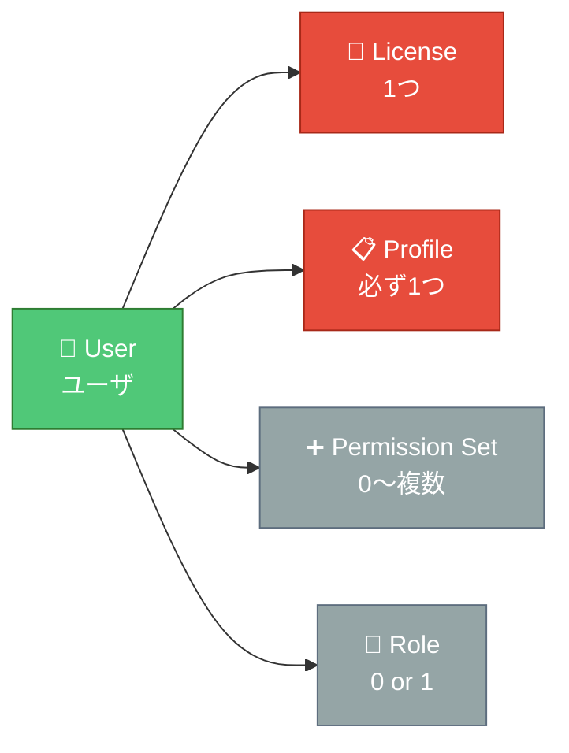

| 属性 | 必須？ | 役割 |
|------|-------|------|
| License | ✅ 必須 | 使える機能の大枠 |
| Profile | ✅ 必須 (必ず1つ) | 最小権限セット |
| Permission Set | 任意 (複数可) | 追加権限 |
| Role | 任意 (あれば1つ) | データ可視範囲の階層 |

> ⚠️ **誤解しやすい点**: Role（ロール）は必須ではありません。ロールがないユーザは「ロール階層による可視拡張」を受けません。

---

## 3. ライセンス (License) — 「使える機能の大枠」

契約形態。**プロファイルより上位の制約**で、どれだけプロファイルで許可しても、ライセンスが対応していない機能は使えません。

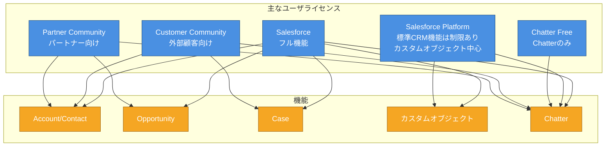

**Jr.向け確認方法:**
- 設定 > 会社の情報 > ユーザライセンス: 契約中の本数と残数が見える
- ユーザ作成時、ライセンスを選ぶとプロファイルの選択肢が絞られる

---

## 4. プロファイル (Profile) — 「そのユーザの最小権限」

**すべてのユーザに1つだけ**割り当てる、権限のベースライン。

### 4.1 プロファイルで制御するもの

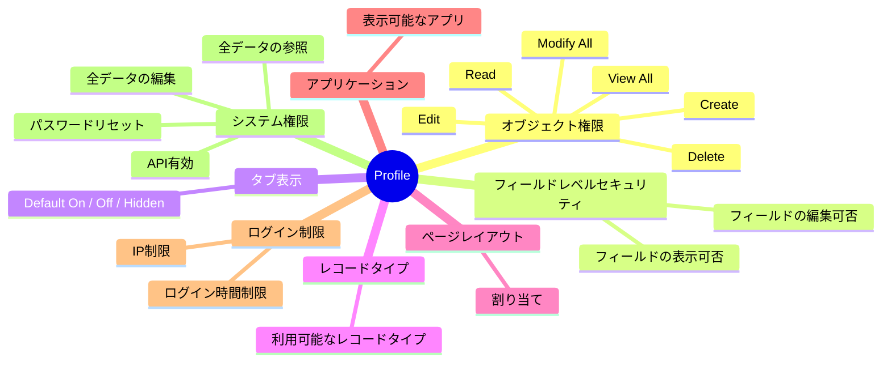

### 4.2 標準プロファイルとカスタムプロファイル

| 種別 | 編集 | 用途 |
|------|------|------|
| 標準プロファイル (System Administrator 等) | ❌ ほぼ編集不可 | テンプレートとして使用 |
| カスタムプロファイル | ✅ 自由に編集 | **実運用では基本こちら** |

> 💡 **設計Tips**: 標準プロファイルを**複製**してカスタムプロファイルを作り、そこを編集する。

### 4.3 プロファイル vs 権限セット — 役割分担

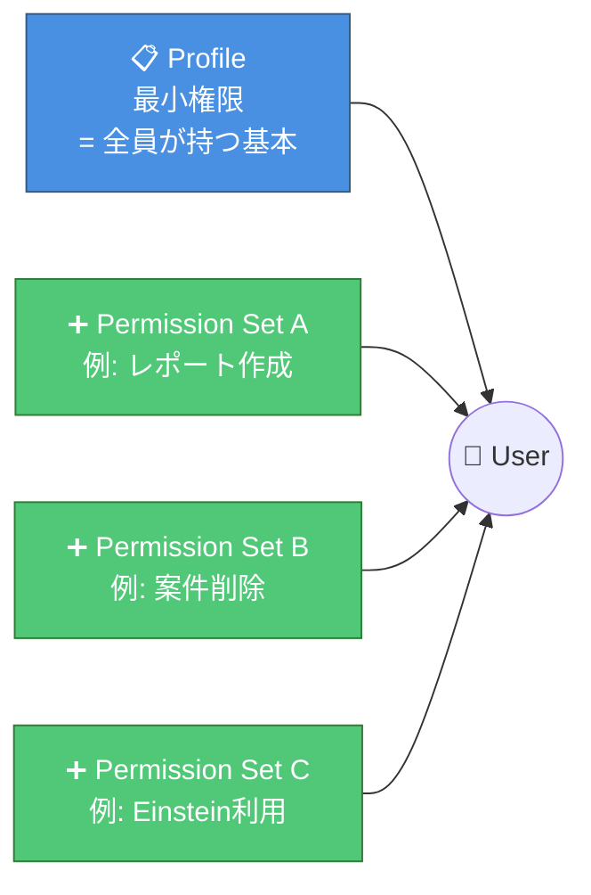

**原則:** 「プロファイルは薄く・広く、権限セットで足す」

---

## 5. 権限セット (Permission Set) — 「プロファイルに足す追加権限」

### 5.1 なぜ権限セットが必要か

「プロファイルだけ」で運用すると:
- 「営業 + レポート権限あり」「営業 + レポート権限なし」のように**権限の組合せごとにプロファイルが爆発**する
- 管理不能に

→ **ベースのプロファイル1つ + 必要な権限セットを後付け** で組み合わせ爆発を防ぐ。

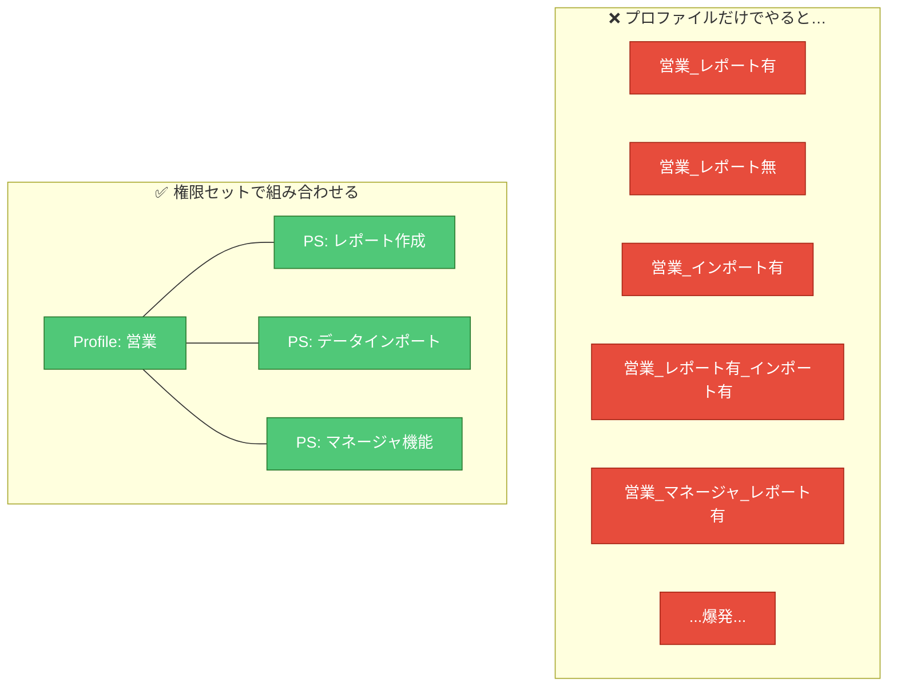

### 5.2 権限セットグループ (Permission Set Group)

Spring '20 から登場。**複数の権限セットを束ねて1つのユニットに**できる。

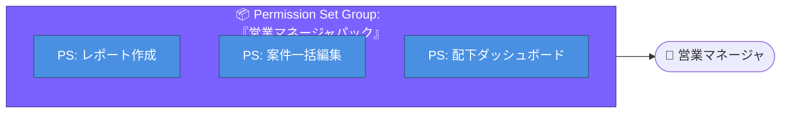

> 💡 **実務Tips**: 役職や業務ロールごとに「パック」を作って付けるのが一般的。Salesforce も権限セットグループ中心の設計を推奨。

### 5.3 Muting Permission Set (抑制)

権限セットグループの中で特定権限を**打ち消す**機能。「基本全部入りのパックだけど、この部署だけ削除だけ無効化」のようなケースで使う。

---

## 6. 共有設定 (Sharing Settings) — 「レコードの土台」

ここから **データアクセス（軸2）** の話。最初に決まるのが **組織の共有設定 (OWD: Organization-Wide Defaults)**。

### 6.1 OWD で設定するアクセスレベル

各オブジェクトに対して **4段階** から選択:

| OWD | 意味 |
|-----|------|
| **Private** 非公開 | 自分が所有 (Owner) するレコードしか見えない |
| **Public Read Only** 公開/参照のみ | 全員が見られるが、編集はオーナーと上位ロールのみ |
| **Public Read/Write** 公開/参照・更新可能 | 全員が見られて編集もできる |
| **Controlled by Parent** 親で制御 (詳細/関連オブジェクト用) | 親レコードの共有設定に従う |

### 6.2 OWD 設計の原則

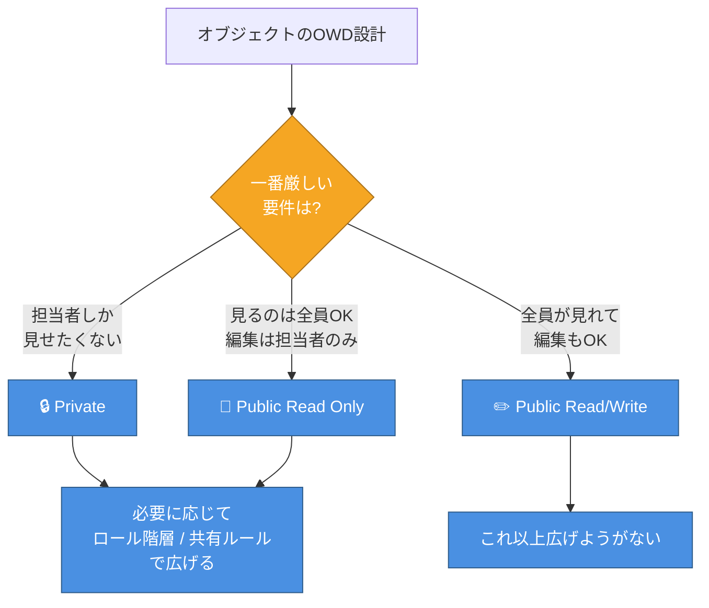

**鉄則: OWD は「一番狭く」設定し、後から広げる**

一度広げると、共有ルールで「狭める」ことはできません。必ず**下から積み上げる**設計に。

### 6.3 広げる4つの方法

| 方法 | 粒度 | 主な用途 |
|------|-----|---------|
| **ロール階層** | 自動 (上位→下位は見えない) | 組織ツリーでの可視化 |
| **共有ルール** | 条件付き (レコードベース / 所有者ベース) | 部門横断共有 |
| **手動共有** | 個別レコード | 例外対応 |
| **チーム** (Account/Opportunity/Case) | メンバー指定 | 案件/顧客/ケースのチーム制 |
| **Apex共有** | プログラム制御 | 複雑な業務ロジック |

---

## 7. ロール階層 (Role Hierarchy) — 「上位ロールは下位のデータを見る」

### 7.1 組織ツリーそのもの

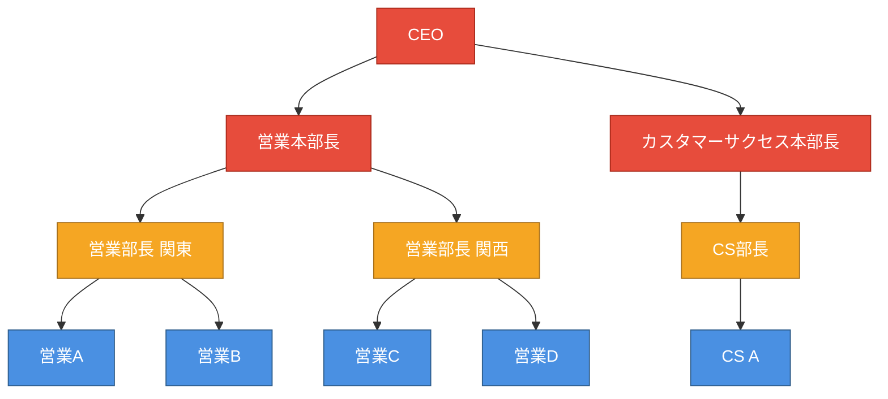

### 7.2 可視性の動き方

- 営業A が作成したレコード → 営業部長関東、営業本部長、CEO に自動的に見える
- 営業A には営業B のレコードは**見えない** (兄弟関係)
- CEO には全員のレコードが見える

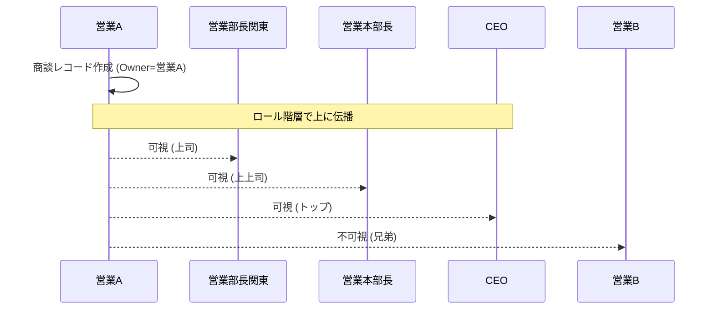

### 7.3 「ロール階層を使用してアクセス権を付与」チェックボックス

カスタムオブジェクトには **「ロール階層を使用してアクセス権を付与」** というオプションがあり、OFF にすると**ロール階層による可視化を止められる**。

- 給与、評価、個人的な1on1メモ等、上司にも見せたくないデータで使う

---

## 8. アクセス判定フロー (最重要)

ユーザがレコード X にアクセスしようとした時、Salesforce は **7つのチェック** を順に行います。

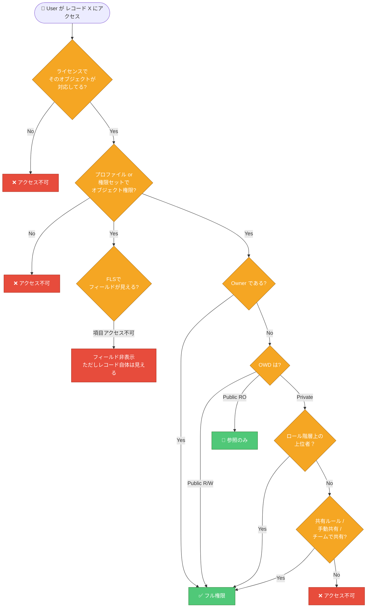

**覚え方:** 「**ライセンス → プロファイル/権限セット → FLS → OWD → ロール → 共有ルール**」の順。

---

## 9. 実務での設計パターン — ClassLab. 風サンプル

**シナリオ**: ライフライン事業（電気・ガス契約代行）の Salesforce 組織を設計。以下の役職が存在する想定。

- コールセンター オペレーター
- コールセンター スーパーバイザー (SV)
- 営業 (不動産会社担当)
- 営業マネージャ
- 経理（金額のみ見る）
- パートナー (外部: 不動産会社)

### 9.1 全体設計

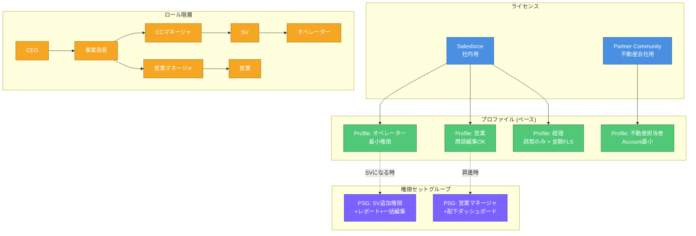

### 9.2 OWD 設計例

| オブジェクト | OWD | 理由 |
|-------------|-----|------|
| Account (不動産会社) | Public Read Only | 営業は全会社情報を参照、編集は担当のみ |
| Opportunity (契約案件) | Private | 担当者以外に見せない |
| Case (問合せ) | Private | 対応中オペレーター以外に見せない |
| 商品マスタ (カスタム) | Public Read Only | 全員参照可、管理者のみ編集 |
| 評価シート (カスタム) | Private + ロール階層OFF | 直属上司と本人しか見せない |

### 9.3 経理にだけ金額フィールドを見せる設計

- Opportunity の OWD は Private
- **経理プロファイル** に Opportunity `Read` (View All) を付与
- **金額以外のフィールドは FLS で非表示**（担当者名、連絡先など）
- 結果: 経理は全商談の**金額サマリだけ**見られる

---

## 10. よくあるハマりどころ (Jr.向けチートシート)

### ❌ ハマり1: 「管理者なのに見えない」

- 原因: カスタムオブジェクトで「全データの参照」が権限セットグループの muting permission で打ち消されている
- 対処: プロファイルの **「全データの参照 (View All Data)」** を確認

### ❌ ハマり2: 「プロファイルで Read 権限あるのに見えない」

- 原因: **OWD が Private でレコードのオーナーじゃない**
- 対処: 共有ルール or ロール階層で広げる

### ❌ ハマり3: 「共有ルールを書いたのに更新されない」

- 原因: 共有ルールは**バックグラウンドで再計算**される (大きな組織だと数分〜)
- 対処: `Setup > Sharing Settings > Recalculate` を手動実行

### ❌ ハマり4: 「ロール変更したらデータが消えた」

- 原因: ロール変更に伴いアクセス権が再計算され、見えなくなったレコードがある
- 対処: 変更前に影響範囲を確認。共有ルールでカバー

### ❌ ハマり5: 「Community/Partner ユーザで Account が見えない」

- 原因: External Sharing Model (外部共有設定) が別途 Private になっている
- 対処: `Setup > Sharing Settings` の **External Access** を確認

---

## 11. 設定の確認場所まとめ

| 設定 | 場所 |
|------|------|
| ライセンス残数 | 設定 > 会社の情報 > ユーザライセンス |
| ユーザ一覧 | 設定 > ユーザ > ユーザ |
| プロファイル | 設定 > ユーザ > プロファイル |
| 権限セット | 設定 > ユーザ > 権限セット |
| 権限セットグループ | 設定 > ユーザ > 権限セットグループ |
| ロール | 設定 > ユーザ > ロール |
| 組織の共有設定 (OWD) | 設定 > セキュリティ > 共有設定 |
| 共有ルール | 設定 > セキュリティ > 共有設定 (同画面下部) |

---

## 12. 学習チェックリスト ✅

以下が答えられれば合格ラインです。

- [ ] ユーザには必ず何と何が紐づく？
- [ ] ライセンスとプロファイルの違いは？
- [ ] プロファイルと権限セットをどう使い分ける？
- [ ] OWD を Private にしたら、そのオブジェクトは誰が見える？
- [ ] ロール階層で上司に見せたくない時どうする？
- [ ] 「Owner じゃない Private レコード」を見せる方法を3つ挙げよ
- [ ] 権限セットグループと権限セットの関係は？
- [ ] FLS とオブジェクト権限の違いは？
- [ ] アクセス判定の順序を説明できるか？
- [ ] Community ユーザに社内向け OWD はどう影響する？

---

## 付録: 用語集

| 用語 | 意味 |
|------|------|
| OWD | Organization-Wide Defaults。組織の共有設定 |
| FLS | Field-Level Security。項目レベルセキュリティ |
| PS | Permission Set。権限セット |
| PSG | Permission Set Group。権限セットグループ |
| Role Hierarchy | ロール階層。組織ツリー |
| Sharing Rule | 共有ルール。所有者基準 / 条件基準の2種 |
| Manual Sharing | 手動共有。個別レコード単位 |
| Team | チーム (Account / Opportunity / Case に対応) |
| View All / Modify All | 全データの参照/編集。OWDを無視する強権限 |
| Muting Permission | 権限セットグループ内で特定権限を打ち消す |

---

**参考公式ドキュメント:**
- Trailhead: *Data Security* モジュール
- Help: *User Permissions and Access*
- Help: *Sharing Settings*
