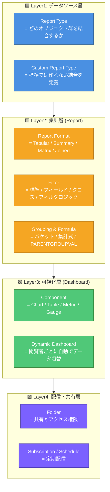
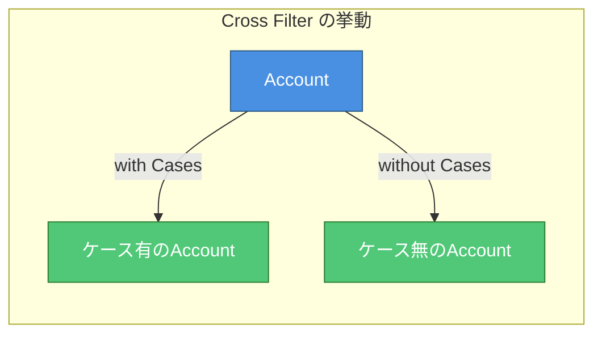
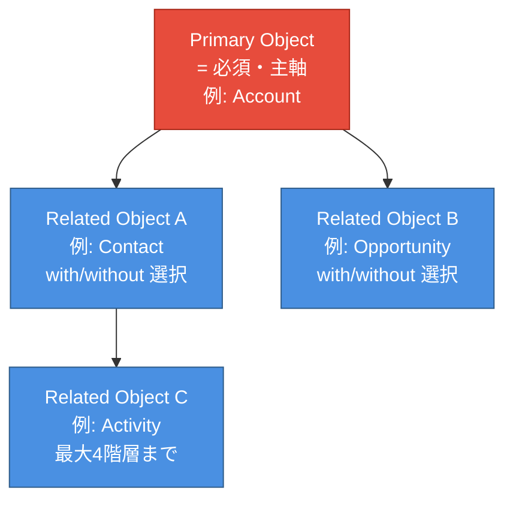
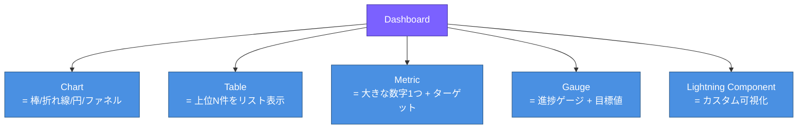
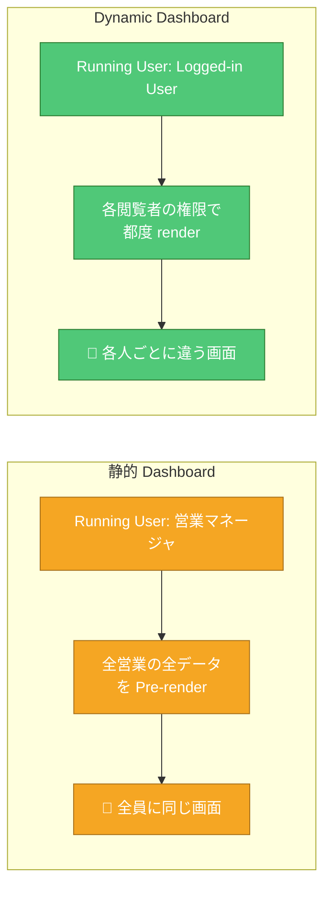
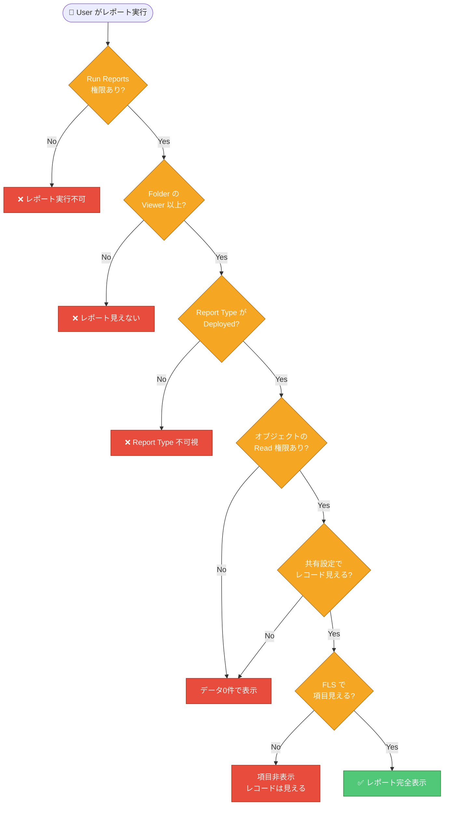

# Salesforce レポート・分析入門 — Jr.エンジニア向け

**対象**: Salesforce のレポート機能に初めて触れる Jr.エンジニア
**ゴール**: 「レポートタイプ / レポート形式 / フィルタ / 数式 / ダッシュボード / フォルダ共有 / アクセス権限」を説明でき、目的の数値を出すまでの設計順を追える状態になる

---

## 0. はじめに — なぜ Salesforce のレポートは「2階建て」なのか

Salesforce のレポート機能は、**「データを取り出す層 (Report Type)」と「見せ方を決める層 (Report Format)」が完全に分離**しています。RDB に例えると、Report Type が `FROM ... JOIN ...` を、Report Format と Filter が `SELECT ... WHERE ... GROUP BY` を担当するイメージ。

- 営業A は自分の商談だけ集計したい
- マネージャは部署横断で確度別の合計を見たい
- 経営層はリアルタイムの KPI ダッシュボードだけ見たい
- 外部パートナーは自社案件のサマリだけ見られる

これを破綻なく扱うために **「データソース定義 → 集計形式 → 可視化 → 配信」の4層** に分かれています。まずはこの層構造を掴むのが最短の理解ルートです。

---

 Aggregate (Format/Filter/Group) -> Visualize (Dashboard) -> Deliver (Folder/Subscribe)" width="1024" height="1024">

## 1. 全体像 — レポート分析の 4 層モデル

Salesforce のレポート機能は **4層** で考えます。



| 層 | 質問 | 主な設定項目 |
|----|------|-------------|
| データソース層 | 「**どのオブジェクトの組合せ**から取るか」 | Standard Report Type / Custom Report Type |
| 集計層 | 「**どう集計して並べる**か」 | Report Format / Filter / Grouping / Formula |
| 可視化層 | 「**どう見せる**か」 | Dashboard Component / Dynamic Dashboard |
| 配信・共有層 | 「**誰に届ける**か」 | Folder / Subscription |

> 💡 **Jr.向けポイント**: 「数値が出てこない」時は、まず Report Type で結合範囲を疑う。「並び順がおかしい」時は Format と Grouping を疑う。層を切り分ける癖をつけよう。

---

## 📚 Trailhead 学習プラン (Admin試験対策・約5時間)

以下5モジュール + 動画で「**レポートタイプ / 形式 / フィルタ / 数式 / ダッシュボード / 配信**」を公式コンテンツで網羅。**Reports & Dashboards Basics → Report Builder → Custom Report Type → Dashboards → 演習** の順を推奨。

| # | モジュール (日本語版あり) | ユニット数 | 目安時間 | Trailhead URL |
|---|-----------|-----|--------|---------------|
| 1 | **Reports & Dashboards for Lightning Experience** | 6 | 1 hr 25 min | [modules/lex_implementation_reports_dashboards](https://trailhead.salesforce.com/content/learn/modules/lex_implementation_reports_dashboards) |
| 2 | **Reports & Dashboards Specialist (Superbadge)** | 1 | 4 hr | [content/learn/superbadges/superbadge_reports_dashboards](https://trailhead.salesforce.com/content/learn/superbadges/superbadge_reports_dashboards) |
| 3 | **Build Custom Reports & Dashboards for Sales** | 4 | 50 min | [modules/build-custom-reports-and-dashboards-for-sales](https://trailhead.salesforce.com/content/learn/modules/build-custom-reports-and-dashboards-for-sales) |
| 4 | **Administrator Certification Prep: Reports, Dashboards, and Productivity** | 2 | 30 min | [modules/administrator-certification-prep-reports-dashboards-and-productivity](https://trailhead.salesforce.com/content/learn/modules/administrator-certification-prep-reports-dashboards-and-productivity) |
| 5 | **CRM Analytics Basics** (Einstein Analytics 後継) | 3 | 30 min | [modules/wave_analytics_basics](https://trailhead.salesforce.com/content/learn/modules/wave_analytics_basics) |
| 6 | (補助) **Lightning Report Builder 動画** | 4 | 30 min | [admin.salesforce.com: Reports & Dashboards](https://admin.salesforce.com/blog/reports-dashboards) |
|   | **合計 (Superbadge除く)** | **19** | **~3 hr 45 min** | |

### 🔖 各モジュールのユニット内訳 (何が学べるか・日本語解説)

#### 1. Reports & Dashboards for Lightning Experience (85 min) ← 試験の主戦場

| ユニット | 時間 | 学べる内容 |
|---------|-----|----------|
| Get to Know Lightning Reports & Dashboards | 10 min | **レポート機能の全体像**: Lightning Experience でのレポート/ダッシュボードの位置づけ、Classic との違い、画面ナビゲーション。 |
| Navigate Reports & Dashboards | 10 min | **一覧画面の操作**: フォルダ階層、お気に入り、最近使った、検索フィルタ、Report Type を絞り込む方法。 |
| Build a Report | 25 min | **Report Builder の基本**: Report Type 選択 → 列追加 → フィルタ → グルーピング → 保存。Tabular/Summary/Matrix の切替方法。**試験頻出**。 |
| Filter Your Report | 15 min | **フィルタの全種類**: 標準フィルタ (日付/オーナー/ステータス)、フィールドフィルタ、クロスフィルタ、フィルタロジック (`1 AND (2 OR 3)`)。 |
| Format Your Report | 10 min | **集計と表示**: Sum/Avg/Min/Max、サブトータル、グラフの埋め込み、条件付き書式 (Conditional Formatting)。 |
| Create a Dashboard | 15 min | **ダッシュボード作成**: コンポーネント追加、レイアウト、フィルタ、Running User、Dynamic Dashboard の概念。 |

#### 2. Reports & Dashboards Specialist Superbadge (4 hr)

実 Org でシナリオ要件を実装するハンズオン。Admin試験のシナリオ問題に最も近い実戦型課題。**Custom Report Type、Joined Report、Bucket、PARENTGROUPVAL** までフルカバー。

#### 3. Build Custom Reports & Dashboards for Sales (50 min)

| ユニット | 時間 | 学べる内容 |
|---------|-----|----------|
| Get Started with Custom Reports & Dashboards | 10 min | **なぜカスタムレポートタイプが必要か**: 標準では結合できないオブジェクト関係、Primary/Related の概念。 |
| Create a Custom Report Type | 15 min | **CRT 作成手順**: Primary Object 選択 → Related Object 追加 (with/without) → Layout、フィールドの追加・除外。 |
| Build a Sales Pipeline Report | 15 min | **ステージ別パイプライン**: Opportunity を Stage でグルーピング、Forecast Category 別の Sum、確度 (Probability) 重み付け集計。 |
| Build a Dashboard | 10 min | **営業ダッシュボード**: KPI コンポーネント、リード分析、進捗ゲージの作り方。 |

#### 4. Administrator Certification Prep: Reports, Dashboards, and Productivity (~30 min)

| ユニット | 時間 | 学べる内容 |
|---------|-----|----------|
| Practice Reports and Dashboards | ~15 min | **シナリオ演習**: フィルタ設計、Joined Report、共有フォルダのシナリオ問題、誤答パターンの分析。 |
| Practice Productivity | ~15 min | **生産性機能**: ホーム画面、Activity Timeline、Tasks、Events の出題ポイント。 |

#### 5. CRM Analytics Basics (30 min)

| ユニット | 時間 | 学べる内容 |
|---------|-----|----------|
| Get Started with CRM Analytics | 10 min | **CRM Analytics (旧 Einstein/Wave) の位置づけ**: 標準レポートとの違い、追加ライセンス必須、いつ採用するか。 |
| Explore Data in CRM Analytics | 10 min | **データセットと Lens**: SAQL の基礎、データ探索ワークフロー。 |
| Build a Dashboard with CRM Analytics | 10 min | **Wave Dashboard 作成**: バインディング、ファセット、ナビゲーション。 |

> 💡 **試験対策Tips**: Admin試験のレポート関連設問は **「フィルタロジックの読解」「Joined Reportの使い時」「Bucket Field の作成」「Dynamic Dashboard と Running User」** が頻出。Superbadge を完走すると合格ラインに乗る。

### 🗺 本資料 → Trailhead のマッピング

| 本資料のセクション | 対応する Trailhead モジュール |
|------------------|----------------------------|
| §2 Report Type | Reports & Dashboards (Build a Report) + Custom Report Type |
| §3 Report Format | Reports & Dashboards (Build a Report, Format Your Report) |
| §4 Filter | Reports & Dashboards (Filter Your Report) |
| §5 Formula / Bucket | Reports & Dashboards (Format Your Report) + Superbadge |
| §6 Dashboard | Reports & Dashboards (Create a Dashboard) |
| §7 Folder & Sharing | Cert Prep: Reports |
| §8 履歴トレンディング | Help: Historical Trending |
| §9 権限と配信 | Cert Prep: Reports |

### 📅 5日分割スケジュール例

| Day | 学習内容 | 時間 |
|-----|--------|-----|
| Day 1 | ① Reports & Dashboards 前半 (Get to Know〜Build) | 45 min |
| Day 2 | ① Reports & Dashboards 後半 (Filter〜Dashboard) | 40 min |
| Day 3 | ③ Build Custom Reports for Sales | 50 min |
| Day 4 | ④ Cert Prep + ⑤ CRM Analytics | 60 min |
| Day 5 | 本資料 §10 ハマりどころ + §12 チェックリストで総復習 | 30 min |

> 💡 **試験対策Tips**: Trailhead の **Hands-on Challenge** は実 Org が必須。**Developer Edition (無料)** を取って手を動かすこと。

---

## 🎯 各機能の要点早見表 (Jr.エンジニア向け: 機能 / 役割 / 他との違い / ユースケース)

### A. 7機能を1枚で俯瞰

| 機能 | 機能 (何をするもの) | 役割 (どの層) | 他との違い | 代表ユースケース |
|------|------------------|-----------|----------|---------------|
| **Report Type** | レポートで使えるオブジェクト・項目の「土台」 | データソース層 | これが無いと項目が選べない。標準で足りなければ **Custom Report Type** を作る | 「商談 + 商品 + 担当者」の3階層結合 |
| **Report Format** | データの並べ方 (Tabular/Summary/Matrix/Joined) | 集計層 | 形式によってグラフ可否やサブトータル可否が変わる | 一覧→Tabular、ステージ別合計→Summary、確度×期間→Matrix |
| **Filter** | 何を出すか・出さないかの絞込 | 集計層 | フィールドフィルタは AND 既定、複雑なら **Filter Logic** で OR/カッコ | 「自分の今期案件のみ」「金額>500万のみ」 |
| **Bucket Field** | レポート内で値を一時的にカテゴリ化 | 集計層 | 元データを変えずに分類できる。スキーマ変更不要 | 金額を「小/中/大」、ステータスを「進行/停止」に分類 |
| **Summary Formula** | レポート内で集計計算する式 | 集計層 | 行レベルではなく**集計レベル**の計算。`PARENTGROUPVAL` で親比較も可 | 達成率 = 実績/目標、前年比、構成比 |
| **Dashboard** | レポートを可視化して並べる画面 | 可視化層 | レポート無しでは作れない (Source Report 必須) | KPI、進捗ゲージ、トレンドグラフ |
| **Folder** | レポート/ダッシュボードの保管 + アクセス権限 | 配信・共有層 | プロファイル/権限セットとは別軸の共有制御 | 「営業向けフォルダ」「経営向けフォルダ」 |

**💡 1行サマリ**
> 「**何のデータを取るか**」は **Report Type**
> 「**どう集計して見せるか**」は **Format + Filter + Grouping + Formula**
> 「**どこに置いて誰に見せるか**」は **Folder + Subscription**

---

### B. 「Report Format 4種」 — 一番混同しやすい

| 形式 | 構造 | グラフ | サブトータル | 代表ユースケース |
|------|-----|-------|-------------|---------------|
| **Tabular** (表形式) | 列だけ・グルーピング無し | ❌ 不可 | ❌ 不可 | 一覧出力、CSV エクスポート、List View 代替 |
| **Summary** (サマリー) | 1〜3階層の行グルーピング | ✅ 可 | ✅ 可 | ステージ別案件合計、月別売上 |
| **Matrix** (マトリックス) | 行 + 列の2軸グルーピング | ✅ 可 (ピボット) | ✅ 可 | 確度 × 期間、製品 × 地域のクロス集計 |
| **Joined** (結合) | 複数レポートブロックを横並び | ✅ 可 (各ブロック) | ✅ 可 | 「同じAccountに対する商談 + ケース + 取引先責任者」を一度に |

**Jr.の判断基準:**
- まず Tabular で書いてみる → グラフ化したいなら Summary に変換
- 2軸でクロス集計したい → Matrix
- 複数オブジェクトを横並びで比較したい → Joined

**⚠️ 落とし穴:**
- **Tabular はダッシュボードに乗せられない** (Row Limit 設定で乗せる裏技あり)
- **Matrix は2軸まで** (3軸以上はできない)
- **Joined は Bucket / Cross Filter / Conditional Formatting が一部使えない**

---

### C. 「Filter 4種類」 — フィルタの全体像

| 種類 | 用途 | 例 |
|------|-----|-----|
| **Standard Filter** (標準) | レポートタイプ既定の必須フィルタ | Date Field、Owner、Status |
| **Field Filter** (フィールド) | 任意の項目で絞込 | `Amount > 500000`、`StageName = 'Closed Won'` |
| **Cross Filter** (クロス) | 関連レコードの有無で絞込 | 「ケースが**ない**Account」「商品が**ある**商談」 |
| **Filter Logic** (フィルタロジック) | AND/OR/カッコで複雑な条件 | `1 AND (2 OR 3)` |

**Jr.の鉄則:**
- フィールドフィルタは**既定で全部 AND**。OR を入れたい時だけ Filter Logic を書く
- Cross Filter は **「JOIN の有無を WHERE 句で表現する」** イメージ



---

### D. 「Bucket Field vs Formula Field vs Summary Formula」 — 数式系3兄弟

| 観点 | Bucket Field | Formula Field (オブジェクト) | Summary Formula (レポート) |
|------|------------|------------------------|---------------------------|
| 定義場所 | レポート内 | オブジェクト定義 | レポート内 |
| 影響範囲 | そのレポートのみ | 全レポート + List View + ページ | そのレポートのみ |
| 計算粒度 | 行レベル (値の分類) | 行レベル | **集計レベル** (グループ合計) |
| 代表例 | 金額を「小/中/大」 | `Amount * 1.1` (税込) | `達成率 = SUM(Amount) / Goal` |
| データ保存 | しない | しない (計算時) | しない |

**Jr.の判断基準:**
- 全レポートで使うなら **Formula Field**、特定レポートだけなら **Bucket** か **Summary Formula**
- 行レベルの値分類なら **Bucket**、集計レベルの計算なら **Summary Formula**

---

### E. 「Dashboard の Running User」 — Dynamic Dashboard が試験頻出

| 観点 | 静的 Dashboard | Dynamic Dashboard |
|------|--------------|------------------|
| Running User | 固定 (作成者 or 指定ユーザ) | **閲覧者本人** (Logged-in User) |
| ライセンス | 標準 | Enterprise 以上で5本まで (Unlimited で10本) |
| データの見え方 | Running User の権限で全員に同じデータ | 各ユーザの権限で**自分の範囲だけ**見える |
| 代表ユースケース | KPI 共通ダッシュボード | 営業マネージャ用「配下の進捗」、各営業の「自分の案件」 |

**Jr.の落とし穴:**
- 静的で「営業マネージャ」を Running User にすると、全員にマネージャの全データが丸見えになる → **個人情報含む場合は要 Dynamic**
- Dynamic Dashboard を作れるのは Admin のみ (権限セットで委任可能)

---

### F. 「Report Type 標準 vs Custom Report Type」 — 結合の自由度

| 観点 | 標準 Report Type | Custom Report Type (CRT) |
|------|----------------|------------------------|
| 作成 | 不要 (Salesforce 既定) | Admin が定義 |
| 結合 | Salesforce が決めた組合せのみ | 任意の Primary + Related (最大4階層) |
| 関連の有無 | 「with 必須」のみ | **with / without 両方** 選べる |
| 項目 | デフォルト全部 | 表示項目を Admin が選別 |
| 代表例 | Accounts and Contacts、Opportunities | 「ケースのない Account」「商品のある商談」 |

**Jr.の鉄則:**
- 「**without (関連なし)** で取りたい」時は CRT 一択
- 標準にあれば標準を使う、無ければ作る (作りすぎると管理不能になるので注意)

---

### G. 「行と列を絞るレポート」 vs 「行を絞る共有設定」 — サンプルレコードで可視化

Jr.エンジニアが一番腹落ちしにくいのが **「レポートのフィルタと OWD/共有設定はどう違うのか」** です。
答えは **「効くタイミングと範囲が違う」** から。テーブルで見ると明快になります。

#### 📋 サンプル: Opportunity (商談) テーブル — 生データ

| 商談ID | 商談名 | 担当者 (Owner) | 金額 | 確度 | ステージ | 期間 |
|--------|-------|--------------|------|-----|--------|-----|
| OPP-001 | ABC不動産 新築 | 営業A (関東) | 500万 | 80% | Negotiation | 2026Q2 |
| OPP-002 | XYZ管理 更新 | 営業B (関東) | 300万 | 60% | Proposal | 2026Q2 |
| OPP-003 | 山田不動産 | 営業C (関西) | 800万 | 90% | Negotiation | 2026Q2 |
| OPP-004 | 田中不動産 | 営業D (関西) | 200万 | 40% | Qualification | 2026Q3 |
| OPP-005 | 鈴木不動産 | 営業A (関東) | 150万 | 30% | Prospecting | 2026Q3 |

前提: OWD = **Private**、ロール階層 = `関東営業マネージャ → 営業A, 営業B`、レポートは「全 Opportunity」を Source。

---

#### 🟦 パターン1 — 営業A が「My Opportunity Pipeline」レポートを実行

**効いている制御**:
- **共有設定 (OWD=Private)**: 営業Aの所有レコードのみ → **行が絞られる (DBクエリ段階)**
- **レポートフィルタ**: 「`Stage != Closed`」 → **行が絞られる (DBクエリ段階)**

| 商談ID | 商談名 | 担当者 | 金額 | 確度 | ステージ |
|--------|-------|------|------|-----|--------|
| OPP-001 | ABC不動産 新築 | 営業A | 500万 | 80% | Negotiation |
| OPP-005 | 鈴木不動産 | 営業A | 150万 | 30% | Prospecting |

→ **2件**。共有設定とフィルタは **AND** で効く (DB クエリレベルで両方適用)。

---

#### 🟨 パターン2 — 関東営業マネージャが「Team Pipeline」レポートを実行

**効いている制御**:
- **OWD + ロール階層**: 配下 (営業A, 営業B) のレコードも自動可視 → **行が広がる**
- **レポートフィルタ**: 「`期間 = 2026Q2`」 → **行が絞られる**

| 商談ID | 商談名 | 担当者 | 金額 | 確度 | ステージ |
|--------|-------|------|------|-----|--------|
| OPP-001 | ABC不動産 新築 | 営業A | 500万 | 80% | Negotiation |
| OPP-002 | XYZ管理 更新 | 営業B | 300万 | 60% | Proposal |

→ **2件**。共有設定で広がった行を、レポートフィルタでさらに絞った。

---

#### 🟩 パターン3 — Summary Format でステージ別合計

**効いている制御**:
- 関東営業マネージャの可視範囲 (3件: OPP-001, OPP-002, OPP-005)
- **Group by Stage** + **Sum(Amount)**

| Stage | 合計金額 | 件数 |
|-------|---------|-----|
| Negotiation | 500万 | 1 |
| Proposal | 300万 | 1 |
| Prospecting | 150万 | 1 |
| **Grand Total** | **950万** | **3** |

→ Summary Format によって**行が集約**された。グラフ化も可能に。

---

#### 🟪 パターン4 — Matrix Format でステージ × 期間

**効いている制御**:
- 同じ3件
- **Row Group: Stage** / **Column Group: 期間** / **Sum(Amount)**

| Stage \ 期間 | 2026Q2 | 2026Q3 | Grand Total |
|------------|--------|--------|-------------|
| Negotiation | 500万 | - | 500万 |
| Proposal | 300万 | - | 300万 |
| Prospecting | - | 150万 | 150万 |
| **Total** | **800万** | **150万** | **950万** |

→ 2軸でクロス集計。**Tabular や Summary では実現できない形**。

---

#### 🎯 まとめ: 制御軸 × 効くタイミング

```
                Salesforce DB
                      │
                      ▼ (1) WHERE句相当
                ┌─────────────────┐
                │ OWD + Role + 共有Rule │ ← 共有設定で行を絞る
                └─────────────────┘
                      │
                      ▼ (2) WHERE句追加
                ┌─────────────────┐
                │  Report Filter   │ ← レポートで更に絞る
                └─────────────────┘
                      │
                      ▼ (3) GROUP BY + 集計
                ┌─────────────────┐
                │  Format/Group/Sum│ ← 集計形式で並び替え
                └─────────────────┘
                      │
                      ▼ (4) 表示
                  📊 Report
```

| 制御軸 | 効くタイミング | 削る方向 | RDBの類推 |
|------|------------|--------|---------|
| **共有設定 (OWD/Role/Rule)** | 一番先 (DB読込時) | 行 (レコード) | `WHERE` 句 (RLS) |
| **Report Filter** | 共有設定後 | 行 (レコード) | 追加の `WHERE` |
| **Cross Filter** | Report Filter 段階 | 行 (関連の有無) | `EXISTS` / `NOT EXISTS` |
| **FLS (項目レベル)** | 表示時 | 列 (フィールド) | `SELECT` 列の制限 |
| **Format/Grouping** | 集計時 | 表示構造 | `GROUP BY` |
| **Bucket / Summary Formula** | 集計時 | 派生列・派生値 | `CASE WHEN` / `HAVING` |

#### 💡 Jr.が覚えるべき1行メッセージ

> **共有設定 = 「DBから取れる行の範囲」(最初に効く・最大可視範囲)**
> **Report Filter = 「取れた行から表示する分を選ぶ」(後から絞る)**
>
> 共有設定で見えないものは、どんなにフィルタを工夫しても**永遠に見えない**。
> 「レポートに出ない」と相談された時、まず疑うのはレポートのフィルタではなく**共有設定**。

---

## 2. Report Type (レポートタイプ) — 「データソースの定義」

レポートで使える **オブジェクトの組合せと項目** を決める土台。

### 2.1 Standard Report Type (標準)

Salesforce が用意している既製の組合せ。例:
- Accounts and Contacts
- Opportunities (with Products)
- Cases with Solutions
- Leads with converted Lead Information

**特徴:** 設定不要で即使えるが、関連オブジェクトの組合せは固定。

### 2.2 Custom Report Type (CRT) — 試験頻出



**作成手順:**
1. Setup > Report Types > New Custom Report Type
2. Primary Object を選択 (必須)
3. Related Object を追加 (任意・最大3つで合計4階層)
4. **with / without** を選択
   - **A with B**: Bを持つAだけ (= INNER JOIN)
   - **A with or without B**: Bの有無問わず全A (= LEFT JOIN)
5. Layout で表示できる項目を選別
6. Deploy (Deployed状態でないとレポート作成画面に出ない)

> ⚠️ **誤解しやすい点**: CRT は **Layout** で項目を絞らないと、関連オブジェクトの**全項目**が候補に出て肥大化する。実務では必要な項目だけ追加する。

### 2.3 Report Type の選び方フロー

```mermaid
flowchart TD
    Start[レポート作成したい] --> Q1{標準で<br/>必要なオブジェクト<br/>組合せがあるか?}
    Q1 -->|Yes| UseStd[標準 Report Type を使う]
    Q1 -->|No| Q2{関連の<br/>「無し」を<br/>取りたいか?}
    Q2 -->|Yes| CRTwithout[CRT (with or without) を作る]
    Q2 -->|No| Q3{結合階層は<br/>4以下?}
    Q3 -->|Yes| CRTwith[CRT (with) を作る]
    Q3 -->|No| Apex[Apex / 中間Object検討]

    classDef step fill:#4A90E2,stroke:#2E5C8A,color:#fff
    classDef decision fill:#F5A623,stroke:#A8701A,color:#fff
    class UseStd,CRTwith,CRTwithout,Apex step
    class Q1,Q2,Q3 decision
```

---


## 3. Report Format (レポート形式) — 「並べ方の決定」

§ B 早見表参照。詳細はそれぞれ:

### 3.1 Tabular (表形式)

```
| 商談名 | 担当者 | 金額 | ステージ |
|-------|------|-----|--------|
| ABC   | 営業A | 500万 | Won |
| XYZ   | 営業B | 300万 | Lost |
| ...   | ...   | ...  | ...   |
```

**用途:** 一覧出力、CSV エクスポート、シンプルなリスト
**ダッシュボードに乗せる裏技:** Row Limit を設定 (例: Top 10) すると Tabular でもダッシュボードに載せられる

### 3.2 Summary (サマリー)

```
▼ Stage: Negotiation (3件)
  | ABC | 営業A | 500万 |
  | DEF | 営業B | 400万 |
  | GHI | 営業C | 600万 |
  Subtotal: 1,500万

▼ Stage: Proposal (2件)
  | JKL | 営業D | 200万 |
  | MNO | 営業A | 300万 |
  Subtotal: 500万

Grand Total: 2,000万
```

**用途:** ステージ別、月別、担当者別の集計
**最大3階層まで**ネストできる (例: 担当者 → 月 → 製品)

### 3.3 Matrix (マトリックス)

```
              | 2026Q1 | 2026Q2 | 2026Q3 | Total
──────────────┼────────┼────────┼────────┼──────
Negotiation   | 500万  | 800万  | 0      | 1,300万
Proposal      | 200万  | 300万  | 100万  | 600万
Closed Won    | 1000万 | 500万  | 0      | 1,500万
──────────────┼────────┼────────┼────────┼──────
Total         | 1,700万| 1,600万| 100万  | 3,400万
```

**用途:** クロス集計 (期間 × ステージ、地域 × 製品)
**制限:** 行・列ともに最大2階層

### 3.4 Joined (結合)

```
[Block 1: Open Opportunities]            [Block 2: Closed Won]
| OPP-001 | 500万 | Negotiation |        | OPP-007 | 800万 | Won |
| OPP-002 | 300万 | Proposal    |        | OPP-008 | 600万 | Won |
                                          
[Block 3: Cases for same Account]
| CASE-001 | High  | Open |
```

**用途:** 同じ Account に紐づく複数オブジェクトを横並び
**制限:** Bucket / Conditional Formatting / Cross Filter の一部が使えない、Block ごとに別 Report Type 設定必須

---

## 4. Filter (フィルタ) — 「絞込みの実装」

### 4.1 Filter Logic (フィルタロジック)

複数フィールドフィルタの結合方法を指定。**標準は AND 結合**。

```
Filter 1: Stage = Negotiation
Filter 2: Amount > 500000
Filter 3: Probability >= 70

Filter Logic: 1 AND (2 OR 3)
```

→ Stage が Negotiation で、(金額500万超 **または** 確度70%以上) のレコードのみ。

**Jr.の落とし穴:** Filter Logic を空欄にすると **全 AND 結合** が暗黙に効く。OR を使いたい時だけ書く。

### 4.2 Cross Filter (クロスフィルタ)

```
Show me Accounts WITH Opportunities    ← 商談を持つ Account のみ
Show me Accounts WITHOUT Cases         ← ケース無しの Account のみ
```

**実装:**
1. Report Type は親オブジェクト基準 (例: Accounts)
2. Filter ペインで「Cross Filter」を追加
3. 関連オブジェクトを選び、`with` / `without` を選択

**用途:**
- 「ケースが無いお客様」を抽出 → CS チームがフォロー
- 「商品を持たない商談」 → 商品紐付け漏れ検知

---

## 5. 数式・Bucket — 「集計力を上げる仕掛け」

### 5.1 Bucket Field (バケット)

```
元データ: Amount
バケット定義:
  - 0 〜 1,000,000 → "小"
  - 1,000,001 〜 5,000,000 → "中"
  - 5,000,001 以上 → "大"
```

→ レポートに「Amount Tier」列が追加され、Group by や Filter に使える。**スキーマ変更不要**。

### 5.2 Summary Formula

集計レベルで計算する数式。

```
Win Rate = WON:SUM / RowCount

Goal Attainment = AMOUNT:SUM / 10000000

PARENTGROUPVAL の例 (構成比):
  AMOUNT:SUM / PARENTGROUPVAL(AMOUNT:SUM, GRAND_SUMMARY)
```

**特殊関数:**
- `PARENTGROUPVAL`: 親グループの値を取得 (構成比、前年同期比)
- `PREVGROUPVAL`: 前のグループの値を取得 (前月比、前期比)

### 5.3 Row-Level Formula (行レベル数式) — Spring '20 から

各行ごとに計算する数式。Bucket より柔軟。

```
売上見込 = Amount * Probability / 100
日数 = TODAY() - CreatedDate
```

**Bucket との違い:** Bucket は値の分類、Row-Level は計算。

---

## 6. Dashboard (ダッシュボード) — 「可視化と KPI」

### 6.1 コンポーネントの種類



### 6.2 Dynamic Dashboard (動的ダッシュボード)



**用途:**
- 営業A は自分の案件だけ見える
- マネージャは配下のチーム集計が見える
- 1つのダッシュボード定義で全員分まかなう

**ライセンス制限:** Enterprise = 5本、Unlimited = 10本まで

### 6.3 Dashboard Filter (ダッシュボードフィルタ)

ダッシュボード全体を一括で絞り込むフィルタ。**最大3つ**設定可。

```
Filter 1: 期間 = [2026Q1 / Q2 / Q3]
Filter 2: 地域 = [関東 / 関西 / 全国]
Filter 3: 製品 = [電気 / ガス / 水道]
```

→ ユーザは画面上部のドロップダウンで切替できる。

---

## 7. Folder (フォルダ) と共有 — 「保管とアクセス権限」

### 7.1 フォルダの3種類

| 種類 | 共有範囲 | 用途 |
|------|--------|------|
| **Private Folder** (My Personal) | 自分のみ | 個人作業用 |
| **Shared Folder** | 指定ユーザ・ロール・公開グループ | チーム共有 |
| **Unfiled Public** | 全員参照可 | 廃止予定・非推奨 |

### 7.2 フォルダのアクセスレベル

| レベル | 権限 |
|------|------|
| **Viewer** | 参照のみ |
| **Editor** | 中身のレポート/ダッシュボードを編集可 |
| **Manager** | フォルダ自体の権限変更も可 |

**Jr.の鉄則:** 「営業向け」「経営向け」「経理向け」のように**閲覧者軸**でフォルダを切る。レポートを置く時は適切なフォルダに。

---

## 8. 履歴トレンディング・Reporting Snapshot — 「過去データの保持」

Salesforce レポートは**現在のデータ**しか集計できない。過去の状態を見たい場合の選択肢:

### 8.1 Historical Trending Report (履歴トレンディング)

- 対象: Opportunity / Forecast / Case / Custom Object (有効化必須)
- 過去 **3ヶ月分** の日次スナップショットを保持
- 「先月この案件はどのステージだった？」が見える

### 8.2 Reporting Snapshot

- 任意のレポート結果をカスタムオブジェクトに**定期保存**
- 例: 毎週月曜にパイプラインレポートを `Pipeline_History__c` に保存
- 何年分でも保持可能 (ストレージ消費に注意)

**Jr.の判断基準:**
- 短期 (3ヶ月以内) の比較 → Historical Trending
- 長期トレンド分析 → Reporting Snapshot

---

## 9. レポートの権限・配信

### 9.1 主要なシステム権限

| 権限 | 効果 |
|------|------|
| **Run Reports** | レポート実行 (基本権限) |
| **Create and Customize Reports** | 新規作成・既存編集 |
| **Report Builder** | Report Builder の使用 |
| **Manage Reports in Public Folders** | 公開フォルダのレポート管理 |
| **Manage Dashboards in Public Folders** | 公開ダッシュボードの管理 |
| **Schedule Reports** | レポートのスケジュール送信 |
| **Subscribe to Reports / Dashboards** | サブスクリプション設定 |
| **View All Data** | 共有設定を無視して全データ参照 (Admin級) |

### 9.2 Subscription (サブスクリプション)

- レポート/ダッシュボードを **メールで定期配信**
- 設定: 頻度 (日次/週次/月次)、時刻、送信先 (自分/他ユーザ/グループ)
- 最大 **5件** までサブスクライブ可 (ユーザ単位)

### 9.3 アクセス判定フロー (レポート版)



**覚え方:** 「**レポート実行権限 → Folder共有 → Report Type → オブジェクト権限 → 共有設定 → FLS**」の順。

---

## 10. よくあるハマりどころ (Jr.向けチートシート)

### ❌ ハマり1: 「レポートが空っぽで何も出ない」

- 原因候補:
  1. 共有設定で見えるレコードが0件 (OWD=Private で自分の所有が無い)
  2. Standard Filter の日付範囲が外れている (例: 「This Month」だが先月のデータしか無い)
  3. Filter Logic で AND/OR を間違えている
- 対処: 全フィルタを一旦外す → 件数が出るか確認 → 1つずつ復元

### ❌ ハマり2: 「合計金額が表示と CSV で違う」

- 原因: **Conditional Formatting や Bucket が Excel エクスポートに反映されない**
- 対処: 集計値は **Summary Formula** で持つ (永続化される)

### ❌ ハマり3: 「Tabular Report をダッシュボードに乗せたい」

- 原因: Tabular はデフォルトでダッシュボード非対応
- 対処: Report Builder で **Row Limit** (Top N) を設定 → ダッシュボードに乗る

### ❌ ハマり4: 「Custom Report Type が一覧に出てこない」

- 原因: **Status が "In Development"**
- 対処: Report Type 詳細画面で **"Deployed"** に変更

### ❌ ハマり5: 「Dynamic Dashboard を作れない」

- 原因: 通常ユーザは作成不可。Admin or **Manage Dynamic Dashboards 権限**が必要
- 対処: 権限セットで委任。ライセンス上限 (EE=5/UE=10) も確認

### ❌ ハマり6: 「マネージャに配下が見えない」

- 原因: ロール階層が正しく設定されていない、もしくは「ロール階層を使用してアクセス権を付与」が OFF
- 対処: Setup > Sharing Settings で確認

### ❌ ハマり7: 「PARENTGROUPVAL が動かない」

- 原因: Tabular Format では使えない (Summary 以上が必要)
- 対処: Report Format を Summary か Matrix に変更

### ❌ ハマり8: 「サブスクリプションメールが届かない」

- 原因候補:
  1. ユーザのメール設定が無効
  2. デリバラビリティ (System Permissions) が "All email" 以外
  3. Email Limit (24h) を超過
- 対処: Setup > Email > Deliverability、ログ確認

---

## 11. 設定の確認場所まとめ

| 設定 | 場所 |
|------|------|
| Report Type | 設定 > Feature Settings > Analytics > Reports & Dashboards > Report Types |
| レポート/ダッシュボード本体 | App Launcher > Reports / Dashboards |
| フォルダ管理 | Reports/Dashboards タブ > All Folders |
| サブスクリプション | レポート画面右上 > Subscribe |
| 履歴トレンディング設定 | 設定 > Feature Settings > Analytics > Reports & Dashboards > Historical Trending |
| Reporting Snapshot | 設定 > Feature Settings > Analytics > Reporting Snapshots |
| Email Deliverability | 設定 > Email > Deliverability |
| Dynamic Dashboard 残数 | 設定 > 会社の情報 (Used Dynamic Dashboards) |
| CRM Analytics (Wave) | App Launcher > Analytics Studio (要追加ライセンス) |

---

## 12. 学習チェックリスト ✅

以下が答えられれば合格ラインです。

- [ ] Report Type と Report Format の違いは？
- [ ] Tabular / Summary / Matrix / Joined のうち、グラフ化できないのは？
- [ ] Custom Report Type で `with or without` を選ぶのはどんな時？
- [ ] Filter Logic で `1 AND (2 OR 3)` はどう解釈される？
- [ ] Bucket Field と Formula Field と Summary Formula の使い分けは？
- [ ] Dynamic Dashboard と静的 Dashboard の違いは？
- [ ] PARENTGROUPVAL を使うとき、Format は何にする必要がある？
- [ ] レポートが空で出る原因を3つ挙げよ
- [ ] Tabular をダッシュボードに乗せる方法は？
- [ ] レポートのアクセス判定は何の順で評価される？
- [ ] Historical Trending と Reporting Snapshot の使い分けは？
- [ ] Cross Filter は SQL でいうとどの構文に相当する？

---

## 付録: 用語集

| 用語 | 意味 |
|------|------|
| Report Type | レポートで使うオブジェクト・項目の組合せ定義 |
| CRT | Custom Report Type。Admin が定義する独自結合 |
| Tabular | 表形式 (グルーピング無し) |
| Summary | サマリー形式 (1〜3階層グルーピング) |
| Matrix | マトリックス形式 (行×列クロス) |
| Joined | 結合形式 (複数ブロック横並び) |
| Bucket | レポート内で値を一時カテゴリ化する仕組み |
| Summary Formula | 集計レベルで計算するレポート内数式 |
| Row-Level Formula | 行レベルで計算するレポート内数式 |
| PARENTGROUPVAL | 親グループの値を返す数式関数 |
| PREVGROUPVAL | 前グループの値を返す数式関数 |
| Cross Filter | 関連オブジェクトの有無で絞込むフィルタ |
| Filter Logic | AND/OR/カッコでフィルタ結合を制御 |
| Dashboard | レポートを可視化するパネル |
| Component | ダッシュボード上のグラフ/メトリック等の部品 |
| Running User | ダッシュボードのデータ計算に使うユーザ |
| Dynamic Dashboard | 閲覧者本人を Running User にするダッシュボード |
| Folder | レポート/ダッシュボードの保管とアクセス制御 |
| Subscription | レポート/ダッシュボードの定期配信 |
| Historical Trending | 直近3ヶ月の日次スナップショット保持機能 |
| Reporting Snapshot | レポート結果をカスタムオブジェクトに定期保存 |

---

**参考公式ドキュメント:**
- Trailhead: *Reports & Dashboards for Lightning Experience* モジュール
- Help: *Build a Report*
- Help: *Custom Report Types*
- Help: *Dynamic Dashboards*
