> 世の中で広く使われているソフトウェアアーキテクチャ／設計パターンを、構造図 (mermaid)・日常のたとえ話・非エンジニア向け解説付きで網羅したリファレンス。

## はじめに — なぜ「設計パターン」が必要か

家を建てるときに「2 階建てか平屋か」「鉄筋か木造か」を決めるように、ソフトウェアも **どう組み立てるか** を最初に決める必要がある。これを「アーキテクチャ（設計パターン）」と呼ぶ。

設計パターンを知らないと、こういう問題が起きる:

- 機能追加のたびに別の場所が壊れる（家のリフォームで配管も壊す感じ）
- 担当者が変わると誰も触れない（増築を繰り返した旅館）
- 一部だけスケールアップしたいのに全体を作り直す必要がある（部屋を増やすのに家全体を建て替え）

逆に **正しいパターンを選ぶと**、長く・安く・大勢で開発できる。本記事は、その「選び方」を非エンジニアにもわかるレベルでまとめた地図である。

---

## 目次

1. [レイヤ系アーキテクチャ](#1-レイヤ系アーキテクチャ)
2. [プレゼンテーション系パターン](#2-プレゼンテーション系パターン)
3. [分散系アーキテクチャ](#3-分散系アーキテクチャ)
4. [データ／DDD 系パターン](#4-データddd-系パターン)
5. [統合・移行パターン](#5-統合移行パターン)
6. [その他構造系パターン](#6-その他構造系パターン)
7. [選定チートシート](#7-選定チートシート)

---

## 1. レイヤ系アーキテクチャ

> 「**会社の組織図**」のイメージ。社長 → 部長 → 課長 → 現場と、役割が縦に重なる構造。


### 1.1 Layered Architecture (N 層)

**ひとことで**: 機能を「見た目」「処理」「データ」の階段状に分ける、最も基本の構造。

#### 日常のたとえ

**社員食堂** を思い浮かべてほしい。

1. **お客さん (Presentation)**: メニューを見て注文する
2. **配膳カウンター (Business Logic)**: 注文を受けて、調理場に伝える
3. **キッチン (Data Access)**: 食材庫から材料を取り出して料理する
4. **食材庫 (Database)**: 全ての食材が保管されている

お客さんが直接食材庫に入ることはない。必ず上から順に通る。これがレイヤ構造。

#### 構造図 (エンジニア向け)

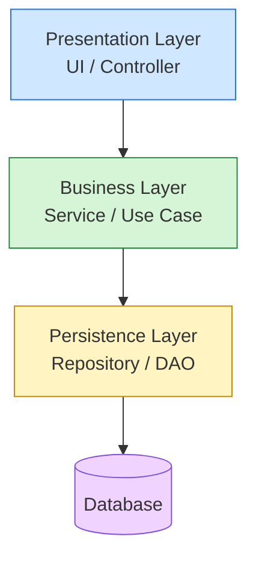


#### メリット
- **学習コストが低い** — 新人に説明しやすい
- **責任が明確** — 「これは UI チームの仕事、これは DB チームの仕事」
- **どんなフレームワークも対応** — Rails、Spring、Laravel、すべてこの形

#### デメリット
- 仕様変更で **全レイヤを貫通する** ことがある（例: 新しい項目を追加するだけで 4 ファイル触る）
- 下位レイヤを変えると上位が壊れやすい

#### 採用判断
中小〜中規模の業務システム、CRUD 中心の Web アプリ。「とりあえずこれで始める」の鉄板。


#### TypeScript コード例

```typescript
// Presentation → Business → Persistence の3層
class UserRepository {
  async findById(id: string): Promise<User | null> {
    return db.users.findUnique({ where: { id } });
  }
}

class UserService {
  constructor(private repo: UserRepository) {}
  async getUser(id: string) {
    return this.repo.findById(id);
  }
}

class UserController {
  constructor(private svc: UserService) {}
  async handleGet(req: Request) {
    return this.svc.getUser(req.params.id);
  }
}
```

---

### 1.2 Clean Architecture

**ひとことで**: 「**ビジネスのルール**」を中心に置き、外側の道具（DB やフレームワーク）はいつでも取り替え可能にする構造。

#### 日常のたとえ

**スマートフォン** がわかりやすい。

- **中心 (Entities)**: 連絡先や予定表のデータ本体
- **その外 (Use Cases)**: 「電話をかける」「予定を追加する」という操作ルール
- **さらに外 (Interface Adapters)**: 画面のボタン、Siri の音声指示、Bluetooth の信号
- **一番外 (Frameworks & Drivers)**: 実際のディスプレイ、スピーカー、5G モデム

スピーカーが壊れても、連絡先データは無事。Bluetooth イヤホンを変えても、電話機能は同じ。**「内側は外側を知らない」** ので、外側を取り替えても中身が動く。

#### 構造図

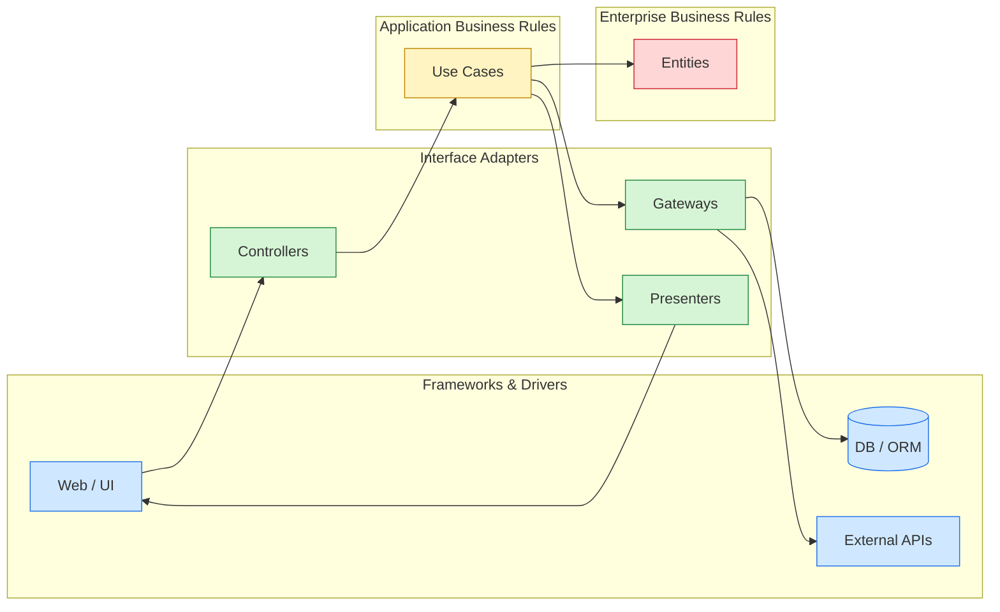


#### メリット
- **テストが書きやすい** — DB を立ち上げなくてもビジネスロジックを検証できる
- **長寿命** — 10 年後にフレームワークが廃れても中身は生き残る
- **複雑なドメインに耐える** — 会計、医療、保険などルールが多い領域に強い

#### デメリット
- 最初に書くファイル数が多くなる（小規模アプリだとオーバーキル）
- 学習コストが高い

#### 採用判断
ドメインが複雑で 5 年以上保守する基幹システム、エンタープライズ向け SaaS。


#### TypeScript コード例

```typescript
// 内側 (Entity) は外側 (DB/Framework) を知らない
interface User { id: string; name: string }              // Entity (中核)

interface UserRepo {                                      // Port
  find(id: string): Promise<User | null>;
}

class GetUserUseCase {                                    // Use Case
  constructor(private repo: UserRepo) {}
  async run(id: string) { return this.repo.find(id); }
}

class SqlUserRepo implements UserRepo {                   // Adapter (外側)
  async find(id: string) { return db.query('SELECT ...'); }
}
```

---

### 1.3 Hexagonal Architecture (Ports & Adapters)

**ひとことで**: アプリの本体に「**コンセントの差込口（ポート）**」を用意し、何を差し込んでも動くようにする構造。

#### 日常のたとえ

**家電の電源プラグ** がそのまま。

- **本体 (Application Core)**: テレビ本体（中身は変わらない）
- **ポート (Port)**: 電源コンセントの穴（規格が決まっている）
- **アダプター (Adapter)**: 海外用変換プラグ、USB 充電器など

海外旅行で日本のテレビをそのまま挿しても、変換プラグ（アダプター）さえあれば動く。**本体は「電源が来る」ことしか知らない**。

#### 構造図

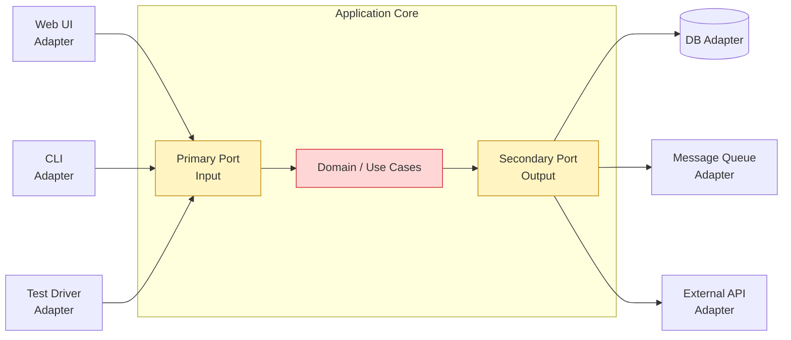


#### メリット
- **テストもアダプターの 1 つ** にできる（本物の DB を使わずに動作確認）
- 外部サービスを **差し替え自由** — MySQL → PostgreSQL、Stripe → 別の決済も簡単

#### デメリット
- 抽象化のためのインターフェース定義が増える

#### 採用判断
外部依存（決済、メール、外部 API）が多く、将来差し替える可能性があるシステム。


#### TypeScript コード例

```typescript
// Port (IF) と Adapter (実装) を完全分離 → 差し替え自由
interface NotificationPort {
  send(msg: string): Promise<void>;
}

class OrderService {
  constructor(private notifier: NotificationPort) {}
  async placeOrder() { await this.notifier.send('注文完了'); }
}

class SlackAdapter implements NotificationPort {
  async send(msg: string) { /* Slack API */ }
}
class EmailAdapter implements NotificationPort {
  async send(msg: string) { /* SMTP */ }
}
```

---

### 1.4 Onion Architecture

**ひとことで**: 玉ねぎのように同心円状にレイヤを並べ、**中心に向かって依存** させる構造。Clean Architecture の親戚。

#### 日常のたとえ

**地球の構造** に似ている。

- **核 (Domain Model)**: 鉄とニッケルの中心核 — 何があっても変わらない地球の核
- **マントル (Domain Services)**: 流動的だが基本性質は変わらない
- **地殻 (Application Services)**: 表面に近づくほど変化が激しい
- **大気圏 (Infrastructure)**: 雲も雨も日々変わる

**外側ほど変わりやすく、内側ほど変わらない**。これが Onion の哲学。

#### 構造図

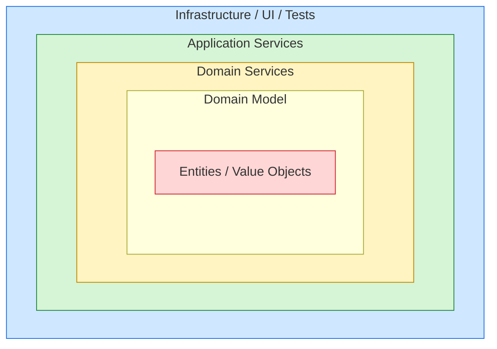


#### Clean Architecture との違い
本質は同じ（依存性逆転）。Clean は「Use Case 層」を明示するが、Onion はその区別を強調しない。


#### TypeScript コード例

```typescript
// Clean Architecture とほぼ同じ書き方。Domain 層が最内側
namespace Domain {
  export class Order { constructor(public id: string, public total: number) {} }
}
namespace Application {
  export class PlaceOrderUseCase {
    constructor(private repo: Domain.OrderRepository) {}
  }
}
namespace Infrastructure {
  export class PostgresOrderRepository { /* 最外殻 */ }
}
```

---

## 2. プレゼンテーション系パターン

> 「**画面の作り方**」のパターン群。ユーザーが触る部分をどう設計するか。


### 2.1 MVC (Model-View-Controller)

**ひとことで**: 「**役者・舞台装置・演出家**」の三役で画面を作る、最も古典的なパターン。

#### 日常のたとえ

**レストラン** で例えると:

- **Model (キッチン)**: 注文を受けて料理を作るところ。在庫やレシピを管理
- **View (ホールスタッフ)**: お客さんに料理を見せる、メニューを提示する
- **Controller (店長)**: 注文をキッチンに伝え、出来上がったらホールに渡す

お客さんはホール（View）しか見ない。キッチン（Model）の様子は知らない。店長（Controller）が間に入って交通整理をする。

#### 構造図

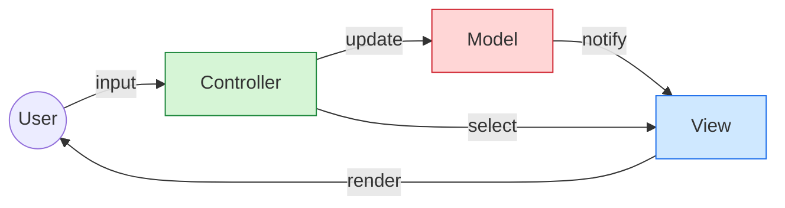


#### 採用例
Rails, Spring MVC, Laravel, ASP.NET MVC など Web フレームワーク全般。


#### TypeScript コード例

```typescript
class TodoModel {
  private items: string[] = [];
  add(s: string) { this.items.push(s); }
  list() { return [...this.items]; }
}

class TodoView {
  render(items: string[]) {
    return items.map((s) => `<li>${s}</li>`).join('');
  }
}

class TodoController {
  constructor(private model: TodoModel, private view: TodoView) {}
  handleAdd(text: string) {
    this.model.add(text);
    return this.view.render(this.model.list());
  }
}
```

---

### 2.2 MVP (Model-View-Presenter)

**ひとことで**: View を「**受け身**」にし、すべての判断は Presenter（司会者）が引き受ける。

#### 日常のたとえ

**漫才の司会者** をイメージしてほしい。

- **Model**: 漫才ネタの台本
- **View**: 舞台に立つ芸人（観客に見える部分。ただし指示を待つ受け身）
- **Presenter**: 司会者（次にどのネタをどの順で出すか全て決める）

芸人（View）は司会の指示通りに動くだけ。「次は○○のネタ」という判断は全て司会者が行う。

#### 構造図

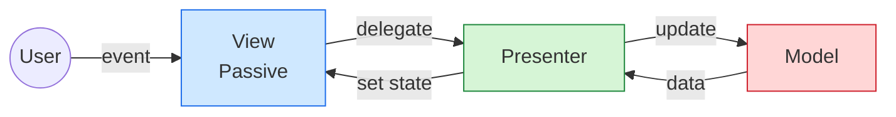


#### 採用例
Android (旧時代), WinForms, GWT。View をテストしやすい。


#### TypeScript コード例

```typescript
// View はパッシブ。Presenter がすべて指示する
interface TodoView {
  showItems(items: string[]): void;
  showError(msg: string): void;
}

class TodoPresenter {
  private items: string[] = [];
  constructor(private view: TodoView) {}
  add(text: string) {
    if (!text) return this.view.showError('空文字は不可');
    this.items.push(text);
    this.view.showItems(this.items);
  }
}
```

---

### 2.3 MVVM (Model-View-ViewModel)

**ひとことで**: 「**双子の鏡**」のように、データと画面が自動で連動する。

#### 日常のたとえ

**鏡** がそのまま例え。

- **Model**: あなた自身
- **View**: 鏡に映る姿
- **ViewModel**: 鏡（あなたの動きを画面に映す装置）

あなた（Model）が手を上げれば、鏡（View）も同じ動きをする。逆もしかり。**「データバインディング」** という仕組みで、片方を変えるともう片方も自動で変わる。

#### 構造図

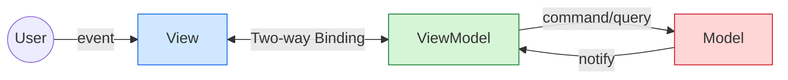


#### 採用例
WPF (Windows), SwiftUI (iOS), Vue.js, Knockout.js。


#### TypeScript コード例

```typescript
// ViewModel が観測可能な State を持ち、View が自動追従する
import { signal } from '@preact/signals-core';

class TodoViewModel {
  items = signal<string[]>([]);
  add = (text: string) => {
    this.items.value = [...this.items.value, text];
  };
}

// View 側 (例: SolidJS / Vue / SwiftUI)
// <For each={vm.items.value}>{(t) => <li>{t}</li>}</For>
```

---

### 2.4 MVI (Model-View-Intent)

**ひとことで**: 「**意図 (Intent) → 状態 → 表示**」の一方通行ループ。バグの少ないモダンな書き方。

#### 日常のたとえ

**自動販売機** で説明する:

1. **Intent**: お客さんが「コーラを買う」と意図する（ボタンを押す）
2. **Model (State)**: 自販機の中の状態が「コーラを 1 本減らし、釣銭を計算」と更新される
3. **View**: ランプ点灯、コーラがガコンと落ちる、釣銭が出る

「ボタンが押されたら必ず同じ反応が返る」 — 状態が予測可能で、バグが追いやすい。

#### 構造図

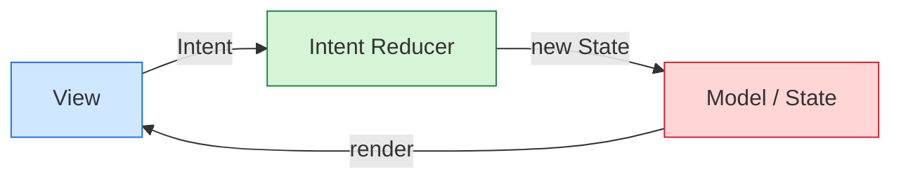


#### 採用例
Android (Jetpack Compose + Flow), Cycle.js。リアクティブプログラミングと相性◎。


#### TypeScript コード例

```typescript
// Intent → Reducer → State → View の一方向ループ
type Intent =
  | { type: 'add'; text: string }
  | { type: 'remove'; index: number };

type State = { items: string[] };

const reducer = (state: State, intent: Intent): State => {
  switch (intent.type) {
    case 'add':    return { items: [...state.items, intent.text] };
    case 'remove': return { items: state.items.filter((_, i) => i !== intent.index) };
  }
};
```

---

### 2.5 Flux / Redux

**ひとことで**: MVI の Web 版。**Action → Reducer → Store → View** の一方通行で状態を管理。

#### 日常のたとえ

**銀行 ATM の入金窓口** がそのもの。

- **Action**: 「1 万円入金したい」という申請書
- **Reducer (窓口担当)**: 申請書を見て、口座残高を更新する手続き
- **Store (通帳)**: 残高記録
- **View (ATM 画面)**: 更新後の残高を表示

申請書を入れる窓口が必ず 1 つしかないので、お金の流れが追える（不正もすぐ発見できる）。

#### 構造図

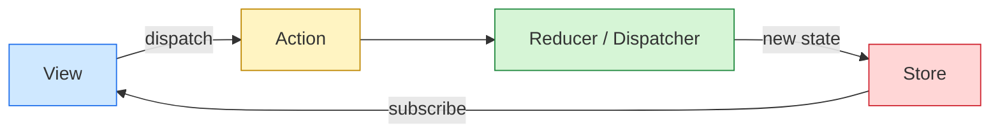


#### 採用例
React + Redux, Vuex, NgRx。


#### TypeScript コード例

```typescript
import { createStore } from 'redux';

type Action = { type: 'INC' } | { type: 'DEC' };
type State = { count: number };

const reducer = (state: State = { count: 0 }, action: Action): State => {
  switch (action.type) {
    case 'INC': return { count: state.count + 1 };
    case 'DEC': return { count: state.count - 1 };
    default:    return state;
  }
};

const store = createStore(reducer);
store.dispatch({ type: 'INC' });
```

---

## 3. 分散系アーキテクチャ

> 「**一棟マンション vs 商店街**」の選択。1 つの建物にまとめるか、独立したお店を連携させるか。


### 3.1 Monolithic Architecture

**ひとことで**: 全部入り **「一棟マンション」**。住居・店舗・駐車場が 1 つの建物に。

#### 日常のたとえ

**タワーマンション**: 住居、コンビニ、ジム、駐車場が 1 つの建物に同居。便利だが、エレベーターが止まると全員困る。

#### 構造図

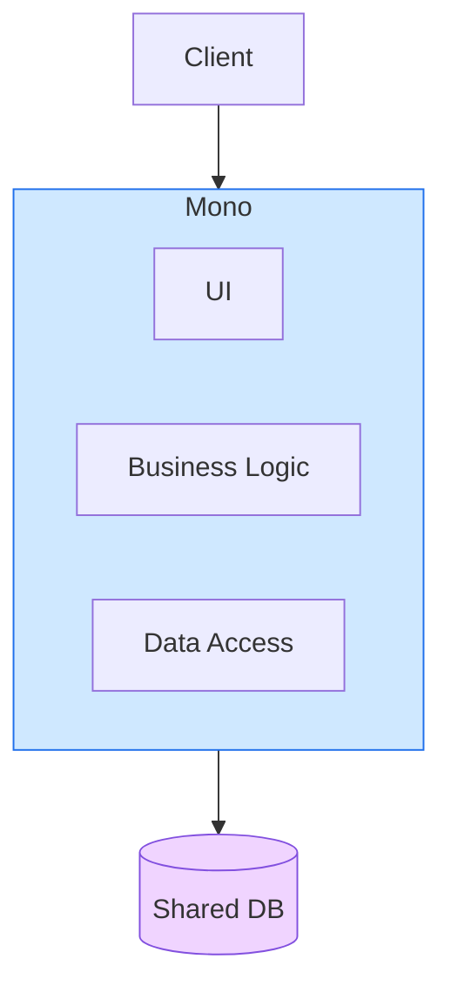


#### メリット
- 開発もデプロイもシンプル（1 箇所更新すれば終わり）
- 内部通信が高速

#### デメリット
- 1 機能の障害が全体停止になる
- 部分的なスケールアップができない

#### 採用判断
立ち上げ初期、PoC、小規模チーム。「とりあえずこれ」で正解の場合が多い。


#### TypeScript コード例

```typescript
// すべての機能を 1 つの Express アプリにまとめる
import express from 'express';

const app = express();

app.get('/users', usersHandler);
app.get('/orders', ordersHandler);
app.get('/billing', billingHandler);
app.post('/notifications', notificationsHandler);

app.listen(3000);
```

---

### 3.2 Modular Monolith

**ひとことで**: 同じマンションでも、**部屋を明確に区切って** 用途別に分ける。マイクロサービス化の前段。

#### 日常のたとえ

**シェアハウス**: 1 棟だが、各個室は鍵付きで独立、共有スペースは台所だけ。プライバシーが守られつつ、家賃を抑えられる。

#### 構造図

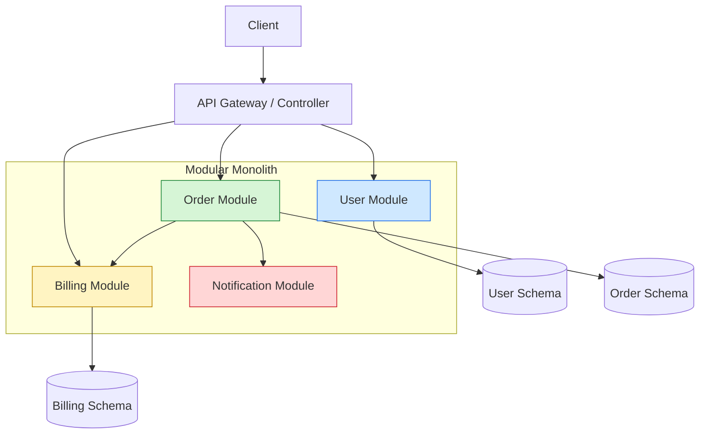


#### 採用判断
マイクロサービスの運用コストは高すぎるが、ドメイン境界を明確にしたい中規模プロダクト。


#### TypeScript コード例

```typescript
// モジュール単位でディレクトリを切り、公開 IF だけを export
// modules/user/index.ts
export const UserModule = {
  findById: (id: string) => userRepo.find(id),
};

// modules/order/index.ts
import { UserModule } from '../user';
export const OrderModule = {
  async placeOrder(userId: string, items: Item[]) {
    const user = await UserModule.findById(userId);
    /* ... */
  },
};
```

---

### 3.3 Microservices

**ひとことで**: **「商店街」**。各お店（サービス）が独立営業し、必要に応じて連携する。

#### 日常のたとえ

**アメ横の商店街**: 八百屋、肉屋、魚屋がそれぞれ独立。八百屋が閉店しても肉屋は営業継続。各店主は得意分野に集中できる。

#### 構造図

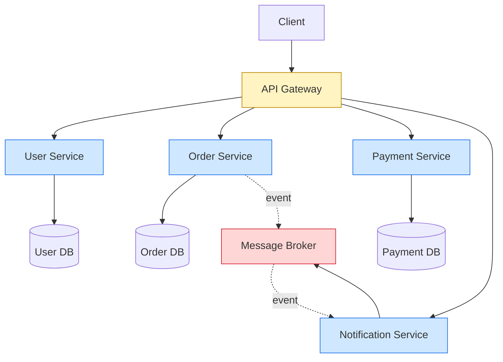


#### メリット
- **独立スケール**: 売れ筋の魚屋だけ大きくできる
- **障害局所化**: 1 店舗の障害は他に波及しない
- **技術選択の自由**: 八百屋は中華風、肉屋は西洋風など、店ごとに技術スタックを変えられる

#### デメリット
- 店どうしの連絡（ネットワーク通信）が複雑
- 全体管理コスト大（保健所・電力・治安など）

#### 採用判断
大規模組織、複数チーム並走、Netflix・Amazon クラスの可用性要件。


#### TypeScript コード例

```typescript
// 各サービスは独立した HTTP API を公開する
// user-service/index.ts
app.get('/users/:id', async (req, res) => {
  res.json(await db.users.find(req.params.id));
});

// order-service/index.ts (別プロセス・別 DB)
const userRes = await fetch(`http://user-service/users/${userId}`);
const user = await userRes.json();
```

---

### 3.4 SOA (Service-Oriented Architecture)

**ひとことで**: マイクロサービスの**ご先祖様**。中央に「ESB（情報の交換所）」を置いて企業全体を統合。

#### 日常のたとえ

**巨大ショッピングモール**: 各テナントは独立だが、共通の館内放送・ポイントカード・警備会社で結ばれている。

#### 構造図

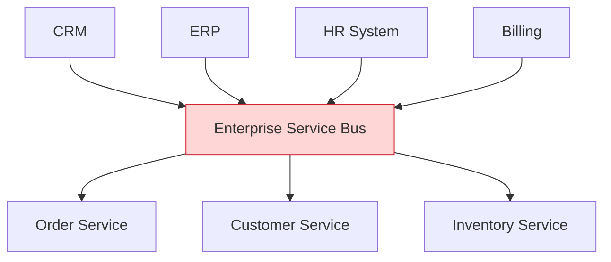


#### Microservices との違い
SOA は重量級 ESB を中心にした統合パターン。Microservices は軽量プロトコル（HTTP/gRPC）でゆるく繋ぐ。


#### TypeScript コード例

```typescript
// ESB / Service Bus に publish & subscribe
import { ServiceBus } from 'enterprise-bus';

const bus = new ServiceBus();

// 発信側
await bus.publish('order.created', { orderId: '123', userId: 'u1' });

// 受信側 (別サービス)
bus.subscribe('order.created', async (event) => {
  await inventoryService.reserve(event.orderId);
});
```

---

### 3.5 Event-Driven Architecture

**ひとことで**: 「**駅構内放送**」型。誰が聞いてもいいし、聞きたい人だけ反応すればいい。

#### 日常のたとえ

**駅のアナウンス**: 「3 番線、まもなく発車します」と放送される。乗りたい人は走り、関係ない人は無視。アナウンスする側（駅員）は誰が反応するか知らなくていい。

注文サービスが「注文完了！」とイベントを発信すると、配送サービス・通知サービス・分析サービスが **それぞれ独立に** 反応する。

#### 構造図

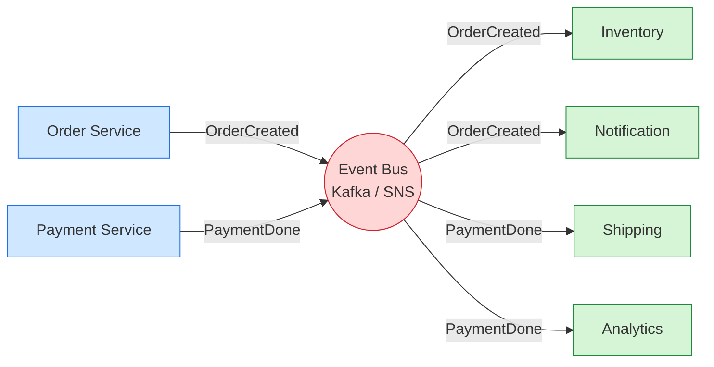


#### メリット
- **疎結合**: 発信側と受信側が互いに知らなくていい
- **非同期スケール**: 受信側を後から追加できる

#### デメリット
- イベントの順序保証や重複処理が難しい
- 全体フローのデバッグが困難（誰がいつ何を受け取ったか追いづらい）

#### 採用判断
IoT、リアルタイム通知、複数システム連携。


#### TypeScript コード例

```typescript
import { Kafka } from 'kafkajs';

const kafka = new Kafka({ brokers: ['localhost:9092'] });

// Producer
const producer = kafka.producer();
await producer.send({
  topic: 'order.created',
  messages: [{ value: JSON.stringify({ orderId: '123' }) }],
});

// Consumer (別プロセス)
const consumer = kafka.consumer({ groupId: 'inventory' });
await consumer.subscribe({ topic: 'order.created' });
await consumer.run({
  eachMessage: async ({ message }) => { /* 在庫処理 */ },
});
```

---

### 3.6 Serverless Architecture

**ひとことで**: 「**必要なときだけ呼ぶコンビニバイト**」。普段はサーバ無し、リクエストが来た瞬間だけ起動。

#### 日常のたとえ

**コンビニのバイト**: 普段はシフト無し（コストゼロ）、お客さんが来た瞬間だけ呼ばれて作業して帰る。雇用側はサーバ運用ゼロ。

#### 構造図

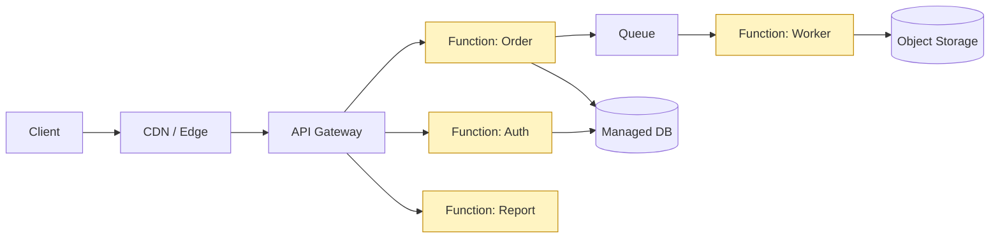


#### メリット
- 運用ゼロ、使った分だけ課金
- 自動スケール

#### デメリット
- 初回起動が遅い（コールドスタート）
- ベンダーロック（AWS Lambda 専用コードになる等）

#### 採用判断
トラフィックが時間帯で大きく変動、イベント駆動の小さなタスク、PoC。


#### TypeScript コード例

```typescript
// Vercel Functions (Next.js App Router)
import type { NextRequest } from 'next/server';

export async function POST(req: NextRequest) {
  const body = await req.json();
  // 必要なときだけ起動、処理して終了
  return Response.json({ ok: true, received: body });
}
```

---

### 3.7 BFF (Backend for Frontend)

**ひとことで**: 「**端末ごとに専用通訳**」を置く構造。

#### 日常のたとえ

**国際会議の同時通訳**: 日本語・英語・フランス語の代表団それぞれに専用通訳が付く。中央の話者は 1 人だが、各言語向けに最適化した説明が届く。

Web 用・iOS 用・Android 用に専用 API を作ることで、それぞれのクライアントが「自分が欲しい形」のデータをもらえる。

#### 構造図

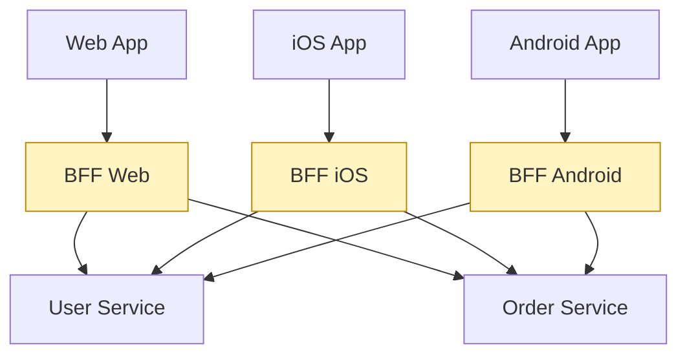


#### 採用判断
マルチプラットフォーム、UI 要件がクライアントごとに大きく異なる場合。


#### TypeScript コード例

```typescript
// Web 専用 BFF: 複数 service を集約して 1 レスポンスに
// bff-web/api/dashboard.ts
export async function GET(req: Request) {
  const uid = getUserId(req);
  const [user, orders, notifs] = await Promise.all([
    userSvc.get(uid),
    orderSvc.listRecent(uid, 5),
    notifSvc.unreadCount(uid),
  ]);
  return Response.json({ user, recentOrders: orders, unread: notifs });
}
```

---

### 3.8 Space-Based Architecture

**ひとことで**: DB のボトルネックを回避するため、**メモリ上で全部やる** 構造。

#### 日常のたとえ

**コンサート会場の入場ゲート**: チケットを毎回データベース照会していたら長蛇の列。**手元のタブレットに今日の参加者リストをまるごと配っておく**。各ゲートが独立で高速処理できる。

#### 構造図

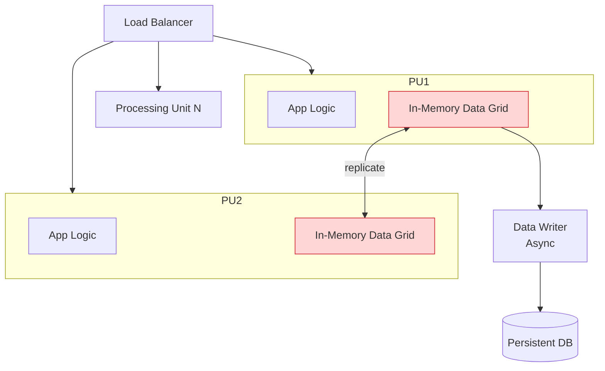


#### 採用判断
チケット販売、オンラインゲーム、株式取引など瞬間的に高 TPS が要求されるシステム。


#### TypeScript コード例

```typescript
// In-Memory Data Grid (例: Redis Cluster / Hazelcast)
import { createCluster } from 'redis';

const cache = createCluster({ rootNodes: [/* ... */] });
await cache.connect();

// Read/Write はすべてメモリへ。永続化は非同期に
await cache.set(`ticket:${id}`, JSON.stringify(ticket));
const ticket = JSON.parse(await cache.get(`ticket:${id}`) ?? '{}');
queueWriteToDb(ticket); // 非同期に DB へ反映
```

---

## 4. データ／DDD 系パターン

> 「**データをどう扱うか**」の設計パターン群。


### 4.1 Repository Pattern

**ひとことで**: 「**図書館の司書**」のように、データ取得の窓口を 1 つにする。

#### 日常のたとえ

**図書館**: 本（データ）の場所は司書（Repository）しか知らない。利用者は「○○の本ありますか」と聞くだけ。本棚（DB）が地下に移動してもサービスは変わらない。

#### 構造図

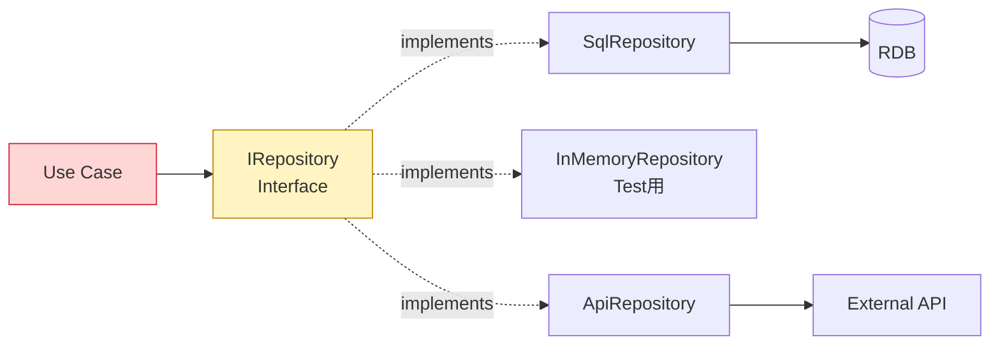


#### TypeScript コード例

```typescript
interface UserRepository {
  findById(id: string): Promise<User | null>;
  save(user: User): Promise<void>;
}

class PrismaUserRepository implements UserRepository {
  async findById(id: string) { return prisma.user.findUnique({ where: { id } }); }
  async save(user: User)     { await prisma.user.upsert({ where: { id: user.id }, update: user, create: user }); }
}

class InMemoryUserRepository implements UserRepository { /* テスト用ダミー */ }
```

---

### 4.2 CQRS (Command Query Responsibility Segregation)

**ひとことで**: 「**書き込み**」と「**読み出し**」の窓口を分ける。

#### 日常のたとえ

**Amazon の倉庫**: **入荷口（書込）** と **発送口（読み出し）** が別。入荷専用ベルトコンベアと発送専用パッキング場で、お互いを邪魔しない。読み出し（注文確認・商品閲覧）を圧倒的に高速化できる。

#### 構造図

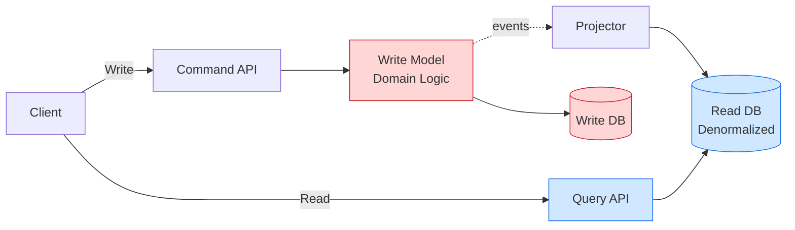


#### 採用判断
読み込みが書き込みの 10 倍以上、複雑な集計レポート。


#### TypeScript コード例

```typescript
// Write 側: ドメインロジック中心
class OrderCommandHandler {
  async placeOrder(cmd: PlaceOrderCommand) {
    const order = Order.create(cmd);
    await writeDb.orders.insert(order);
    await eventBus.publish({ type: 'OrderPlaced', payload: order });
  }
}

// Read 側: クエリ最適化された Read Model を読むだけ
class OrderQueryService {
  async listByUser(userId: string) {
    return readDb.orders_view.find({ userId }); // denormalized
  }
}
```

---

### 4.3 Event Sourcing

**ひとことで**: 「**残高ではなく取引履歴を残す**」。状態の変化をすべてイベントとして記録。

#### 日常のたとえ

**銀行の通帳**: 「現在残高 10 万円」と記録するのではなく、「+5 万円入金、-2 万円出金、+7 万円入金…」と取引履歴を全部記録する。**いつでも過去のどの時点の残高でも復元できる**。

#### 構造図

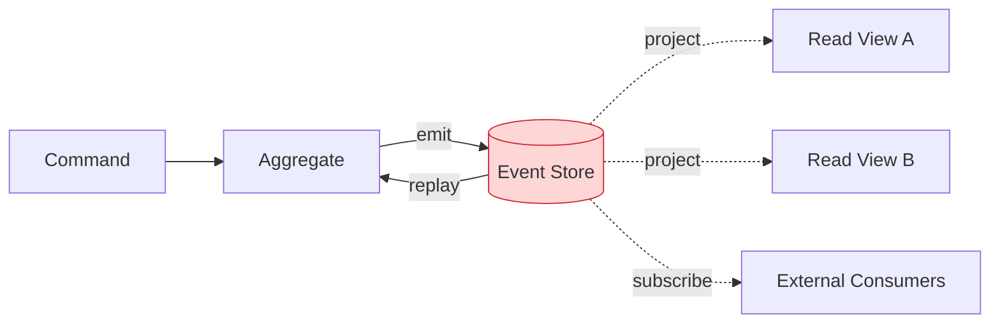


#### メリット
- 完全な監査ログ（誰がいつ何をしたか全部残る）
- タイムトラベル（任意時点の状態に戻せる）

#### デメリット
- スキーマ進化が難しい（過去イベントの形式も維持し続ける必要）
- 実装難度が高い

#### 採用判断
金融、会計、規制対応、強い監査要件。


#### TypeScript コード例

```typescript
type Event =
  | { type: 'AccountOpened'; userId: string }
  | { type: 'Deposited';     amount: number }
  | { type: 'Withdrawn';     amount: number };

// 状態ではなくイベント列を保存
const eventStore: Event[] = [];

// 状態は履歴から再生(replay)して導出
const balance = (events: Event[]): number =>
  events.reduce((b, e) => {
    if (e.type === 'Deposited') return b + e.amount;
    if (e.type === 'Withdrawn') return b - e.amount;
    return b;
  }, 0);
```

---

### 4.4 DDD (Domain-Driven Design)

**ひとことで**: ビジネスの言葉そのままでコードを書き、**会話と実装を一致** させる。

#### 日常のたとえ

**国際会議**: 営業部・経理部・法務部はそれぞれ専門用語が違う。同じ「顧客」でも、営業では「見込み客」、経理では「請求先」、法務では「契約相手」。**各部署の言葉で別々のシステムを作り、間に通訳（ACL）を置く** のが DDD の考え方。

#### 構造図

```mermaid
flowchart TB
    subgraph BC1[Bounded Context: Ordering]
        AGG1[Order Aggregate]
        E1[Entities]
        VO1[Value Objects]
        DS1[Domain Service]
        REPO1[Repository]
    end
    subgraph BC2[Bounded Context: Billing]
        AGG2[Invoice Aggregate]
        E2[Entities]
        DS2[Domain Service]
        REPO2[Repository]
    end
    subgraph BC3[Bounded Context: Shipping]
        AGG3[Shipment Aggregate]
    end
    BC1 <-->|ACL / Event| BC2
    BC1 <-->|ACL / Event| BC3

    style AGG1 fill:#ffd6d6,stroke:#cf222e
    style AGG2 fill:#ffd6d6,stroke:#cf222e
    style AGG3 fill:#ffd6d6,stroke:#cf222e
```


#### 戦術パターン
Entity, Value Object, Aggregate, Repository, Domain Service, Domain Event, Factory。

#### 戦略パターン
Bounded Context, Context Map, Ubiquitous Language, Anti-Corruption Layer。


#### TypeScript コード例

```typescript
// 値オブジェクト: 等値性は内容で決まる
class Money {
  constructor(public readonly amount: number, public readonly currency: 'JPY' | 'USD') {}
  add(other: Money) {
    if (this.currency !== other.currency) throw new Error('通貨不一致');
    return new Money(this.amount + other.amount, this.currency);
  }
}

// Aggregate Root: 整合性の境界
class Order {
  private items: OrderItem[] = [];
  private status: 'draft' | 'confirmed' = 'draft';
  addItem(item: OrderItem) {
    if (this.status !== 'draft') throw new Error('確定後は変更不可');
    this.items.push(item);
  }
  confirm() { this.status = 'confirmed'; }
}
```

---

## 5. 統合・移行パターン

> 「**システム同士をつなぐ／古いものを置き換える**」パターン群。


### 5.1 Saga Pattern

**ひとことで**: 「**リレー走**」のように複数サービスでバトンを渡しながら処理し、失敗したら逆走で巻き戻す。

#### 日常のたとえ

**旅行予約**: 航空券 → ホテル → レンタカー の順で予約。レンタカー予約が失敗したら、ホテルキャンセル → 航空券キャンセルと逆走する。

#### 構造図

```mermaid
flowchart LR
    S[Start] --> T1[Local Tx 1<br/>Order]
    T1 -->|OK| T2[Local Tx 2<br/>Payment]
    T2 -->|OK| T3[Local Tx 3<br/>Shipping]
    T3 -->|OK| E[Complete]

    T3 -.NG.-> C3[Compensate<br/>Shipping]
    C3 --> C2[Compensate<br/>Payment]
    C2 --> C1[Compensate<br/>Order]
    C1 --> F[Failed]

    style T1 fill:#cfe8ff,stroke:#1f6feb
    style T2 fill:#cfe8ff,stroke:#1f6feb
    style T3 fill:#cfe8ff,stroke:#1f6feb
    style C1 fill:#ffd6d6,stroke:#cf222e
    style C2 fill:#ffd6d6,stroke:#cf222e
    style C3 fill:#ffd6d6,stroke:#cf222e
```


#### 採用判断
マイクロサービスで複数サービスにまたがる処理整合性が必要な場合。


#### TypeScript コード例

```typescript
// Choreography 風 Saga: 失敗時は補償処理
async function bookTrip() {
  const flight = await flightSvc.book();
  try {
    const hotel = await hotelSvc.book();
    try {
      await carSvc.book();
    } catch (e) {
      await hotelSvc.cancel(hotel.id);     // 補償
      await flightSvc.cancel(flight.id);   // 補償
      throw e;
    }
  } catch (e) {
    await flightSvc.cancel(flight.id);
    throw e;
  }
}
```

---

### 5.2 Strangler Fig Pattern

**ひとことで**: 古い樹に巻きつく **「絞め殺し植物」** のように、レガシーシステムを少しずつ新しいシステムで置き換える。

#### 日常のたとえ

**駅前再開発**: 古い駅ビルを使いながら、新しい駅ビルを横に建てて、テナントを少しずつ移していく。最終的に古い駅ビルを解体。一気に閉鎖しないので利用者に影響が少ない。

#### 構造図

```mermaid
flowchart LR
    Client --> P[Strangler Proxy / Router]
    P -->|legacy path| Legacy[Legacy System]
    P -->|new path A| New1[New Service A]
    P -->|new path B| New2[New Service B]
    Legacy -.deprecate.-> X((Retire))

    style Legacy fill:#ffd6d6,stroke:#cf222e
    style New1 fill:#d6f5d6,stroke:#1f883d
    style New2 fill:#d6f5d6,stroke:#1f883d
```


#### 採用判断
既存システムが大きすぎてビッグバン移行できない場合。


#### TypeScript コード例

```typescript
// 段階移行: feature flag で旧/新を振り分ける
import { proxyTo } from './proxy';

app.use('/api/v1/users', async (req, res) => {
  if (await featureFlag.isOn('user-service-migrated', req)) {
    return proxyTo(newUserService, req, res); // 新
  }
  return proxyTo(legacyMonolith, req, res);   // 旧
});
```

---

### 5.3 Sidecar Pattern

**ひとことで**: 本体の **「バイクのサイドカー」** のように、横にぴったり寄り添う補助プロセス。

#### 日常のたとえ

**通訳付きの海外出張**: 営業担当者（本体）に通訳（Sidecar）が常に同行。営業は専門業務に集中、通訳は言語・現地サポート専門。

ログ収集、認証、メトリクスといった **横断的機能** をアプリ本体に組み込まずに済む。

#### 構造図

```mermaid
flowchart TB
    subgraph Pod[Pod / Host]
        APP[Main App]
        SC[Sidecar<br/>Envoy / Fluentd]
    end
    APP <--> SC
    SC <--> Net[Service Mesh / Log Backend]

    style APP fill:#cfe8ff,stroke:#1f6feb
    style SC fill:#fff4c2,stroke:#bf8700
```


#### 採用判断
Service Mesh (Istio, Linkerd), 横断的関心の言語非依存実装。


#### TypeScript コード例

```typescript
// アプリ本体はビジネスロジックのみ。横断的関心は Sidecar
// app/index.ts
app.get('/orders', async (_, res) => res.json(await listOrders()));

// 認証/ログ/メトリクスは Sidecar (例: Envoy) が透過的に処理する
// docker-compose.yml で同一 Pod に Envoy コンテナを配置する
```

---

### 5.4 Ambassador Pattern

**ひとことで**: アプリの代わりに外部と話す **「大使」**。

#### 日常のたとえ

**国の大使館**: 自国の市民は直接外国政府と交渉せず、大使館員（Ambassador）が代行する。リトライや交渉ルールは大使館がまとめて担当。

#### 構造図

```mermaid
flowchart LR
    APP[App] --> AMB[Ambassador<br/>Proxy]
    AMB -->|retry/CB| EXT[External Service]

    style AMB fill:#fff4c2,stroke:#bf8700
```


#### TypeScript コード例

```typescript
// 外部 API 呼び出しを Ambassador でラップ (retry/circuit breaker)
class StripeAmbassador {
  async charge(amount: number, currency: string) {
    return retry(3, () =>
      circuitBreaker(() => stripe.charges.create({ amount, currency }))
    );
  }
}

const ambassador = new StripeAmbassador();
await ambassador.charge(1000, 'JPY');
```

---

### 5.5 Anti-Corruption Layer (ACL)

**ひとことで**: 古いシステムや他社システムから **悪い影響を受けない壁**。

#### 日常のたとえ

**海外駐在員と現地のやり取り**: 現地特有のルールや慣習が日本のオフィスに直接持ち込まれないよう、駐在員（ACL）が「日本本社が理解できる言葉」に翻訳する。

#### 構造図

```mermaid
flowchart LR
    subgraph OurDomain[Our Bounded Context]
        OD[Clean Domain Model]
    end
    ACL[Anti-Corruption Layer<br/>Translator]
    subgraph Legacy[Legacy / External]
        LD[Legacy Model]
    end
    OD <--> ACL
    ACL <--> LD

    style ACL fill:#ffd6d6,stroke:#cf222e
    style OD fill:#d6f5d6,stroke:#1f883d
    style LD fill:#cfe8ff,stroke:#1f6feb
```


#### TypeScript コード例

```typescript
// 外部 (レガシー) モデルを自ドメイン語彙に翻訳
type LegacyUser = { user_id: string; user_name: string; flg: '0' | '1' };
type DomainUser = { id: string; name: string; isActive: boolean };

const translateUser = (l: LegacyUser): DomainUser => ({
  id: l.user_id,
  name: l.user_name,
  isActive: l.flg === '1',
});

// 自ドメインからは常に translateUser() を経由してアクセスする
```

---

### 5.6 API Gateway

**ひとことで**: マイクロサービスの **「ビルの受付」**。来客を一括で捌く。

#### 日常のたとえ

**オフィスビル受付**: 来訪者はまず受付（API Gateway）で身分確認 → 行き先の部署へ案内される。各部署が個別に来訪者対応する必要がない。

#### 構造図

```mermaid
flowchart LR
    C1[Web] --> GW[API Gateway]
    C2[Mobile] --> GW
    C3[Partner] --> GW
    GW -->|auth/rate-limit/route| S1[Service A]
    GW --> S2[Service B]
    GW --> S3[Service C]

    style GW fill:#fff4c2,stroke:#bf8700
```


#### TypeScript コード例

```typescript
// 認証 + レート制限 + ルーティング + ログ をまとめて担当
import express from 'express';
import rateLimit from 'express-rate-limit';
import { proxy } from './lib/proxy';
import { authMiddleware } from './lib/auth';

const gateway = express();
gateway.use(rateLimit({ max: 100, windowMs: 60_000 }));
gateway.use(authMiddleware);
gateway.use('/users',  proxy('http://user-service'));
gateway.use('/orders', proxy('http://order-service'));
gateway.listen(8080);
```

---

## 6. その他構造系パターン


### 6.1 Pipe and Filter

**ひとことで**: **「工場のベルトコンベア」**。各工程が前から流れてきたものを加工して次に渡す。

#### 日常のたとえ

**回転寿司の調理工程**: シャリ握り機 → ネタ載せ → わさび付け → レーン送り。各工程は前の工程しか知らない。

#### 構造図

```mermaid
flowchart LR
    IN[(Input)] --> F1[Filter 1<br/>Parse]
    F1 --> F2[Filter 2<br/>Validate]
    F2 --> F3[Filter 3<br/>Transform]
    F3 --> F4[Filter 4<br/>Enrich]
    F4 --> OUT[(Output)]

    style F1 fill:#cfe8ff,stroke:#1f6feb
    style F2 fill:#cfe8ff,stroke:#1f6feb
    style F3 fill:#cfe8ff,stroke:#1f6feb
    style F4 fill:#cfe8ff,stroke:#1f6feb
```


#### 採用例
ETL、コンパイラ、画像処理、ストリーミング処理。


#### TypeScript コード例

```typescript
// 関数合成で段階的に変換
const pipe = <T>(...fns: Array<(x: T) => T>) =>
  (input: T) => fns.reduce((acc, fn) => fn(acc), input);

const pipeline = pipe(
  parseCsv,    // string -> Row[]
  validate,    // Row[]  -> Row[]
  transform,   // Row[]  -> Domain[]
  enrich,      // Domain[] -> EnrichedDomain[]
);

const result = pipeline(rawCsv);
```

---

### 6.2 Vertical Slice Architecture

**ひとことで**: 機能ごとにケーキを **「縦に切り分け」**、各切れ端の中に必要な層を全部入れる。

#### 日常のたとえ

**ケーキの取り分け**: チョコケーキを上から下まで縦に切ると、各人の皿に「スポンジ・クリーム・チョコ」全てが揃う。技術レイヤで横に切るのではなく、機能（味）で縦に切る。

#### 構造図

```mermaid
flowchart TB
    subgraph App
        subgraph F1[Feature: CreateOrder]
            C1[Endpoint]
            L1[Handler]
            D1[Data]
        end
        subgraph F2[Feature: CancelOrder]
            C2[Endpoint]
            L2[Handler]
            D2[Data]
        end
        subgraph F3[Feature: ListOrders]
            C3[Endpoint]
            L3[Handler]
            D3[Data]
        end
    end

    style F1 fill:#cfe8ff,stroke:#1f6feb
    style F2 fill:#d6f5d6,stroke:#1f883d
    style F3 fill:#fff4c2,stroke:#bf8700
```


#### 採用例
.NET の MediatR + CQRS、機能別チーム編成。


#### TypeScript コード例

```typescript
// features/<feature>/ に Controller/Handler/Repo を全部入れる
// features/create-order/handler.ts
import { parseCreateOrder } from './validation';
import { createOrderInDb } from './repository';
import { notifyCustomer } from './notify';

export const createOrderHandler = async (req: Request) => {
  const body  = parseCreateOrder(await req.json());
  const order = await createOrderInDb(body);
  await notifyCustomer(order);
  return Response.json({ id: order.id });
};
```

---

### 6.3 Component-Based Architecture

**ひとことで**: **「レゴブロック」** のように、独立した部品を組み合わせて UI を作る。

#### 日常のたとえ

**レゴで作る家**: 屋根ブロック・窓ブロック・ドアブロックを組み合わせる。1 つの部品は他の家でも再利用できる。

#### 構造図

```mermaid
flowchart TB
    App[App Root]
    App --> H[Header]
    App --> M[Main]
    App --> F[Footer]
    M --> Card1[Card]
    M --> Card2[Card]
    M --> Form[Form]
    Form --> Input[Input]
    Form --> Button[Button]

    style App fill:#fff4c2,stroke:#bf8700
```


#### 採用例
React, Vue, Web Components, Angular。


#### TypeScript コード例

```typescript
// React の関数コンポーネント = 独立したレゴブロック
function Button({ onClick, label }: { onClick: () => void; label: string }) {
  return <button onClick={onClick}>{label}</button>;
}

function Card({ title, children }: { title: string; children: React.ReactNode }) {
  return (
    <section className="card">
      <h3>{title}</h3>
      {children}
    </section>
  );
}

// 組み合わせて画面を作る
function Page() {
  return <Card title="設定"><Button onClick={save} label="保存" /></Card>;
}
```

---

### 6.4 Client-Server

**ひとことで**: 最も基本の **「お客さんと店員」** 構造。

#### 日常のたとえ

**牛丼チェーン**: 客（Client）が「並、つゆだく」と注文、店員（Server）が作って渡す。

#### 構造図

```mermaid
flowchart LR
    C1[Client 1] --> S[Server]
    C2[Client 2] --> S
    C3[Client N] --> S
    S --> DB[(Database)]

    style S fill:#cfe8ff,stroke:#1f6feb
```


#### TypeScript コード例

```typescript
// Server
import express from 'express';
const app = express();
app.get('/api/hello', (_, res) => res.json({ msg: 'hello' }));
app.listen(3000);

// Client
const result = await fetch('/api/hello').then((r) => r.json());
console.log(result.msg); // "hello"
```

---

### 6.5 Peer-to-Peer

**ひとことで**: 全員が **「対等な売り手・買い手」** になる構造。

#### 日常のたとえ

**メルカリ**: 全ユーザーが出品者にも購入者にもなる。中央の店長はいない（運営は仲介のみ）。

#### 構造図

```mermaid
flowchart LR
    P1((Peer 1)) <--> P2((Peer 2))
    P2 <--> P3((Peer 3))
    P3 <--> P4((Peer 4))
    P4 <--> P1
    P1 <--> P3
    P2 <--> P4
```


#### 採用例
BitTorrent, ブロックチェーン, IPFS, WebRTC。


#### TypeScript コード例

```typescript
// WebRTC でブラウザ同士が直接通信
const pc = new RTCPeerConnection();
const dc = pc.createDataChannel('chat');

dc.onopen    = () => console.log('接続');
dc.onmessage = (e) => console.log('相手:', e.data);

dc.send('やあ、ピアくん');
```

---

### 6.6 Broker / Blackboard

**Broker**: 分散コンポーネント間の通信を仲介。
**Blackboard**: みんなが書き込み・読み込みできる **共有黒板**。

#### 日常のたとえ (Blackboard)

**会議室のホワイトボード**: 営業・開発・経理が各自の専門分野で書き込みつつ、他の人の書き込みも見て、協力して企画書を完成させる。

#### 構造図

```mermaid
flowchart TB
    subgraph Blackboard[Blackboard / Shared Memory]
        ST[(State)]
    end
    KS1[Knowledge Source 1] <--> ST
    KS2[Knowledge Source 2] <--> ST
    KS3[Knowledge Source 3] <--> ST
    CTRL[Controller] --> KS1
    CTRL --> KS2
    CTRL --> KS3

    style ST fill:#ffd6d6,stroke:#cf222e
```


#### 採用例
AI システム、音声認識、専門家システム。


#### TypeScript コード例

```typescript
// Blackboard: 共有メモリに各専門モジュールが書き込み・読み込み
const blackboard: Record<string, unknown> = {};

const phonemeKS = (audio: Buffer) => {
  blackboard.phonemes = analyze(audio);
};
const wordKS = () => {
  if (blackboard.phonemes) blackboard.words = group(blackboard.phonemes);
};
const sentenceKS = () => {
  if (blackboard.words) blackboard.sentence = assemble(blackboard.words);
};

// Controller がどの KS を起動するか調停
```

---

### 6.7 JAMstack

**ひとことで**: **「完成品の売り場」+「外注の受発注口」** で作る、超高速 Web 構成。

#### 日常のたとえ

**コンビニ**: 完成品の弁当（静的サイト）が棚に並んでいて取るだけ。注文 (Auth, 決済) はレジ (API) で別途。商品陳列と業務処理が完全分離されている。

#### 構造図

```mermaid
flowchart LR
    Git[Git Repo] -->|build| SSG[Static Site Generator<br/>Next.js / Astro]
    SSG -->|deploy| CDN[CDN / Edge]
    CDN --> Browser[Browser]
    Browser -.JS fetch.-> API1[Auth API]
    Browser -.JS fetch.-> API2[CMS API]
    Browser -.JS fetch.-> API3[Payment API]

    style CDN fill:#fff4c2,stroke:#bf8700
    style SSG fill:#d6f5d6,stroke:#1f883d
```


#### 採用例
ブログ、マーケサイト、ドキュメント、E コマースのフロント。


#### TypeScript コード例

```typescript
// Next.js App Router: ビルド時 SSG + ISR + クライアント fetch
// app/posts/page.tsx
export const revalidate = 3600; // 1h ごとに静的再生成 (ISR)

export default async function PostsPage() {
  const posts = await fetch('https://cms.example.com/posts', {
    next: { revalidate: 3600 },
  }).then((r) => r.json());

  return (
    <ul>
      {posts.map((p: Post) => <li key={p.id}>{p.title}</li>)}
    </ul>
  );
}
```

---

## 7. 選定チートシート

| 状況 | 第一候補 | たとえ |
|---|---|---|
| PoC / 初期スタートアップ | Monolith + MVC | 一棟マンション + 食堂モデル |
| 小規模 SaaS、CRUD 中心 | Layered | 社員食堂 |
| ドメインが複雑、長期保守 | Clean / Hexagonal + DDD | マトリョーシカ + 多国籍会議 |
| 外部 API 依存が多い | Hexagonal (Ports & Adapters) | コンセントとプラグ |
| 複数チーム・組織スケール | Microservices + DDD | 商店街 |
| マイクロサービスはまだ早い | Modular Monolith | シェアハウス |
| 読み込み >>> 書き込み | CQRS | 倉庫の入荷口と発送口 |
| 監査・規制が厳しい (金融等) | Event Sourcing + CQRS | 銀行の通帳 |
| リアルタイム / IoT / 大量イベント | Event-Driven | 駅構内放送 |
| 多端末 (Web/iOS/Android) | BFF | 端末ごとの専用通訳 |
| サーバ運用したくない | Serverless | 必要なときだけ呼ぶバイト |
| 高 TPS で DB がボトルネック | Space-Based | コンサート入場ゲート |
| レガシー段階移行 | Strangler Fig + ACL | 駅前再開発 |
| 静的サイト中心 | JAMstack | コンビニ陳列 |
| データ変換パイプライン | Pipe and Filter | 回転寿司の調理ライン |
| 機能単位の開発・大規模分担 | Vertical Slice | ケーキの縦切り |
| 横断的関心 (認証/ログ/メトリクス) | Sidecar / API Gateway | バイクのサイドカー / ビル受付 |
| 分散トランザクション | Saga | 旅行予約のキャンセル連鎖 |

---

## まとめ

設計パターンに **唯一の正解はない**。プロダクトの規模、チーム人数、ドメインの複雑さ、変更速度の要求によって最適解は変わる。

押さえるべき原則は 3 つ:

1. **「変わらないもの」を中心に置く** — ビジネスのルールは外部の道具より変わりにくい
2. **「責任を分離する」** — 1 つの場所が複数の責任を持つと変更が連鎖する
3. **「早すぎる最適化は害」** — 最初から完璧を狙わず、必要になったら段階的に進化させる

設計は、コードを書く前の **「家の図面」** に相当する。図面が良ければ建築は速い。逆に図面が雑だと、住んでから後悔する。

---

## 参考文献

- Robert C. Martin, *Clean Architecture* (2017)
- Eric Evans, *Domain-Driven Design* (2003)
- Vaughn Vernon, *Implementing Domain-Driven Design* (2013)
- Mark Richards, Neal Ford, *Fundamentals of Software Architecture* (2020)
- Sam Newman, *Building Microservices* (2nd ed., 2021)
- Chris Richardson, *Microservices Patterns* (2018)
- Martin Fowler, *Patterns of Enterprise Application Architecture* (2002)
- Alistair Cockburn, "Hexagonal Architecture" (2005)
- Jeffrey Palermo, "Onion Architecture" (2008)
