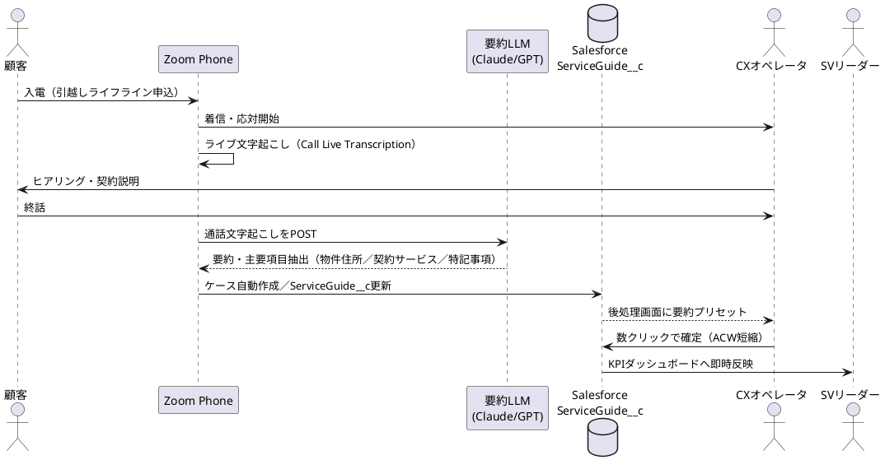
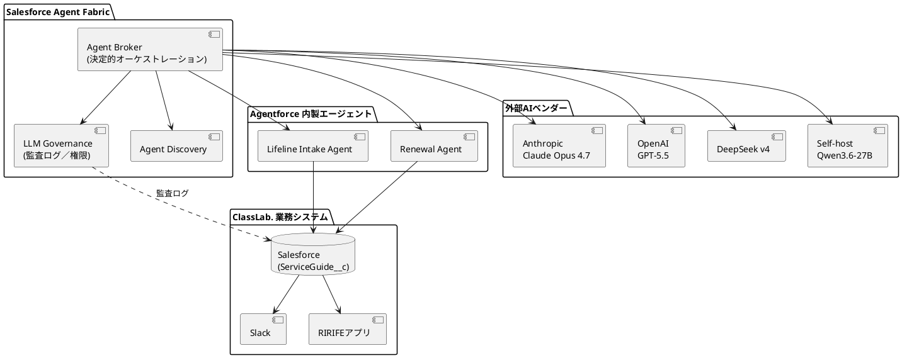
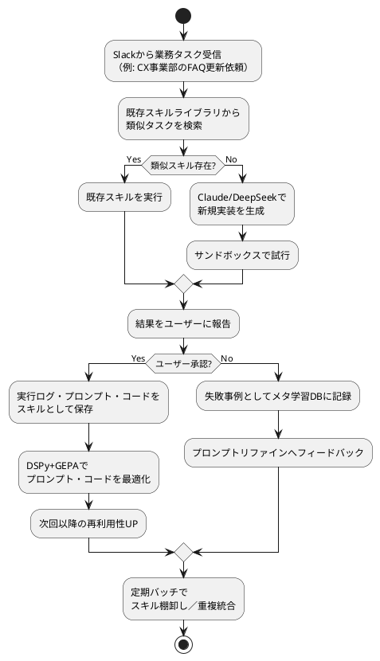

# 週間ニュースまとめ（2026年4月18日〜4月25日）

## 目次

- [Hacker News](#hacker-news)
  - [1. DeepSeek v4 公開](#1-deepseek-v4-公開)
  - [2. OpenAI GPT-5.5 発表](#2-openai-gpt-55-発表)
  - [3. ChatGPT Images 2.0 リリース](#3-chatgpt-images-20-リリース)
  - [4. Qwen3.6-27B：27BでフラッグシップクラスのコーディングAI](#4-qwen36-27b27bでフラッグシップクラスのコーディングai)
  - [5. AnthropicがClaude Code品質問題の詳細ポストモーテムを公開](#5-anthropicがclaude-code品質問題の詳細ポストモーテムを公開)
  - [6. Bitwarden CLIがサプライチェーン攻撃で侵害](#6-bitwarden-cliがサプライチェーン攻撃で侵害)
  - [7. Firefox/Tor Browserにプライベート識別子の脆弱性](#7-firefoxtor-browserにプライベート識別子の脆弱性)
  - [8. Apple、警察が削除済みチャットを抽出できていたバグを修正](#8-apple警察が削除済みチャットを抽出できていたバグを修正)
  - [9. 「過剰編集（Over-editing）」：LLMが必要以上にコードを書き換える問題](#9-過剰編集over-editingllmが必要以上にコードを書き換える問題)
  - [10. Flipbook：モデルから直接ストリームされるウェブサイト](#10-flipbookモデルから直接ストリームされるウェブサイト)
- [Zoom Phone](#zoom-phone)
  - [11. Zoom Phoneに通話ライブ文字起こしが追加](#11-zoom-phoneに通話ライブ文字起こしが追加)
  - [12. Zoom Phone通話の翻訳サービス有効化](#12-zoom-phone通話の翻訳サービス有効化)
  - [13. Zoom Phone：通知転送先にメーリングリスト指定が可能に](#13-zoom-phone通知転送先にメーリングリスト指定が可能に)
- [Salesforce](#salesforce)
  - [14. Summer '26 リリースノート公開、プレビューOrg登録受付開始](#14-summer-26-リリースノート公開プレビューorg登録受付開始)
  - [15. Salesforce Agent Fabric拡張：Agent Broker ベータ提供開始](#15-salesforce-agent-fabric拡張agent-broker-ベータ提供開始)
- [Anthropic](#anthropic)
  - [16. Claude Opus 4.7 一般提供開始](#16-claude-opus-47-一般提供開始)
  - [17. Claude Design 新プロダクト発表](#17-claude-design-新プロダクト発表)
  - [18. Claude Code 料金プラン変更をめぐる混乱（後に撤回）](#18-claude-code-料金プラン変更をめぐる混乱後に撤回)
- [GitHub トレンド](#github-トレンド)
  - [19. ForrestChang/andrej-karpathy-skills：Karpathy式CLAUDE.md](#19-forrestchangandrej-karpathy-skillskarpathy式claudemd)
  - [20. NousResearch/hermes-agent：10万スター突破](#20-nousresearchhermes-agent10万スター突破)
  - [21. Voicebox：オープンソースAI音声スタジオ](#21-voiceboxオープンソースai音声スタジオ)
  - [22. Claude-Code-Game-Studios：Claude Codeで作るゲーム制作環境](#22-claude-code-game-studiosclaude-codeで作るゲーム制作環境)

---

## Hacker News

### 1. DeepSeek v4 公開
- **原題**: DeepSeek v4
- **スコア**: 1581pt / コメント: 1225件
- **URL**: https://api-docs.deepseek.com/
- **要約**: DeepSeekが次世代モデル「v4」を公開。コーディング・推論タスクで大幅な改善を示し、API経由で利用可能。オープンウェイトLLMの競争が新ラウンドに入ったことを象徴するリリースで、コスト/性能比でクローズド大手に迫る水準。

:::classlab-usage
#### Classlabでの活用

- ClassLab.のAI事業（AI-OCR、AIトレーナー）のバックエンドLLMとしてDeepSeek v4を選択肢に追加。OpenAI/Anthropicに依存しないバックアップ経路を確保し、コスト試算PoCを実施（申込書面のOCR後の項目抽出、コールセンター要約など低リスク業務から）。
- システム事業部のClaude Code補助として、レビュー・差分要約など軽い推論を担う「セカンドLLMレイヤー」を整備。複数モデルのルーティングをAI Gatewayで運用化し、メインとセカンダリを自動切替する仕組みを標準化。
- オープンウェイトモデルの自社ファインチューニング基盤を構築し、不動産会社4,000社の業務データや引越し契約書面の構造を学習させた「ClassLab.ドメイン特化LLM」を展開。ライフライン契約の完全自動化（AI-OCR→AIエージェント→Salesforce登録）の中核エンジンへ。
:::

#### ハンズオン（ジュニアエンジニア向け）

DeepSeek v4をcurlで試す（所要時間: 10分）:

```bash
export DEEPSEEK_API_KEY="sk-..."
# → 先にhttps://platform.deepseek.com/でAPIキーを発行しておく

curl https://api.deepseek.com/chat/completions \
  -H "Authorization: Bearer $DEEPSEEK_API_KEY" \
  -H "Content-Type: application/json" \
  -d '{
    "model": "deepseek-chat",
    "messages": [{"role":"user","content":"次のSalesforce SOQLを説明して: SELECT Id, Name FROM Account WHERE CreatedDate = LAST_N_DAYS:7"}]
  }'
# → JSONレスポンスが返る。choices[0].message.contentに日本語での解説が入っている
```

**活用例3選**:
1. ServiceGuide__cレコードの説明文生成（SOQLで取得したレコード内容を自然文に要約）。
2. Slackチャンネルのスレッド要約をDeepSeek経由で作成し、日次サマリーをCX事業部マネージャに送付。
3. AI-OCRで抽出したテキストの「住所正規化」プロンプトをDeepSeek v4で実行し、OpenAIモデルとの精度比較をする。

**エンジニアの業務改善**: Claude Codeのバックアップとして、コードレビュー・コミットメッセージ生成・ドキュメント翻訳などのユースケースに応じたモデル選択を定型化できる。

**オフィスワーカー向け**: CX事業部の通話文字起こし要約、NW事業部の営業メール下書き、EA事業部の議事録整理で「社外非公開LLM」を選びやすくなる。

**システム構築ノウハウ**: 複数LLMを束ねるGateway層（ルーティング・フェイルオーバー・プロンプト共通化）を先に整備しておくと、新モデル登場時の切替コストが最小化できる。

---

### 2. OpenAI GPT-5.5 発表
- **原題**: GPT-5.5
- **スコア**: 1491pt / コメント: 993件
- **URL**: https://openai.com/index/introducing-gpt-5-5/
- **要約**: OpenAIが「GPT-5.5」を発表。GPT-5系の延長としてマルチモーダル理解と推論性能を向上させ、長文・コーディング・エージェントタスクでの安定性が強化されている。ChatGPTおよびAPIで順次展開。

:::classlab-usage
#### Classlabでの活用

- ホリエモンAI学校の教材用LLMをGPT-5.5にアップデートし、「最新モデルで学べる」訴求でコース訴求力を再強化。生徒のChatGPTと同等環境で学習できる一貫性を担保する。
- 社内AIアシスタント（社員向け）をGPT-5.5ベースに標準化し、情シスが管理する単一ゲートウェイから各事業部（CX/NW/EA/コーポレート）に配布する「モデル棚卸し」ポリシーを策定。
- 数年後のGPT-6時代を見据え、プロンプト資産・評価セット・RAG構成をモデル依存にしない抽象化レイヤーで持つ体制を確立。大規模モデル入替えが「設定変更」で済む組織にする。
:::

---

### 3. ChatGPT Images 2.0 リリース
- **原題**: Introducing ChatGPT Images 2.0
- **スコア**: 1039pt / コメント: 967件
- **URL**: https://openai.com/index/introducing-chatgpt-images-2-0/
- **要約**: OpenAIがChatGPTの画像生成を刷新。テキスト描画の精度、レイアウト制御、ブランド一貫性、編集・インペインティングの品質が向上し、マーケティング制作現場で実用水準に。

:::classlab-usage
#### Classlabでの活用

- RIRIFEメディアのアイキャッチ画像をChatGPT Images 2.0で生成し、制作工数を削減。EA事業部のコンテンツ発信サイクルを現在の週次から日次に引き上げる運用PoCを実施。
- 不動産会社4,000社向けの販促ツールに「引越し特典バナー自動生成」機能を組み込み、パートナーが物件広告に合わせたライフライン訴求画像をセルフサービスで作れるSaaS機能へ。
- 生成画像・動画・音声を統合した「新生活コンテンツ自動生成パイプライン」をAI事業部で構築し、30万人の新生活者に対してパーソナライズされたオンボーディング体験を提供する差別化基盤に。
:::

#### ハンズオン（ジュニアエンジニア向け）

ChatGPT Images 2.0のAPI（gpt-image-1系）で画像を1枚生成（所要時間: 15分）:

```bash
export OPENAI_API_KEY="sk-..."

curl https://api.openai.com/v1/images/generations \
  -H "Authorization: Bearer $OPENAI_API_KEY" \
  -H "Content-Type: application/json" \
  -d '{
    "model": "gpt-image-1",
    "prompt": "引越し完了直後の新居リビング、朝の柔らかい光、観葉植物、暮らしメディアRIRIFEのアイキャッチ",
    "size": "1024x1024"
  }' | jq -r '.data[0].b64_json' | base64 -d > rirife_hero.png
# → rirife_hero.pngに1024x1024のPNG画像が保存される
```

**活用例3選**:
1. 週間ニュース記事のアイキャッチを自動生成する（本スキルと連携して記事ごとに1枚生成）。
2. CX事業部の新人研修資料に、シーン別イラスト（電話応対、書類処理など）を一括で生成して埋め込む。
3. Salesforceのアカウントページに「このパートナー様向けのロゴ入り販促テンプレ」を1クリックで生成するApex連携。

**エンジニアの業務改善**: GitHub README・社内Wiki・Slackチャネル紹介などで、「地味な業務資料も見出しに1枚画像」を当たり前にできる。

**オフィスワーカー向け**: PowerPoint資料の挿絵、Slack投稿の添付画像を外注なしでオフィスワーカーが作れる。NW事業部の営業提案書に画像を入れる心理的ハードルが消える。

**システム構築ノウハウ**: 生成物にはウォーターマーク／生成ID（OpenAIのc2paメタデータ）を残し、将来の「AI生成物開示義務化」にも耐えるログ設計をする。

---

### 4. Qwen3.6-27B：27BでフラッグシップクラスのコーディングAI
- **原題**: Qwen3.6-27B: Flagship-Level Coding in a 27B Dense Model
- **スコア**: 970pt / コメント: 440件
- **URL**: https://qwen.ai/blog?id=qwen3.6-27b
- **要約**: AlibabaのQwenチームが27BパラメータのDenseモデルをリリース。27Bながらフラッグシップ級のコーディング性能を示し、ローカル実行可能なサイズでClaude/GPTに匹敵する領域を狙う。Apache 2.0相当のライセンスでオープン公開。

:::classlab-usage
#### Classlabでの活用

- システム事業部の社内GPU（M3 Max/M4 ProのMacBook）でQwen3.6-27Bをローカル実行し、PII/PHI的機微情報を含む引越し契約書面のOCR後整形をクラウド外で完結させるPoC。
- 社内コードレビュー／PR要約／コミットメッセージ生成をローカルLLMで自動化。外部API費用を抑えつつ、ClassLab.コードベースを学習させてドメイン特化レビュアーを育てる。
- 不動産会社向けエッジ型AIアシスタントを構築し、各パートナー拠点に「データを外に出さずに使えるAI」を配布できる差別化戦略。大手SaaSが追随しづらい領域を先行して抑える。
:::

#### ハンズオン（ジュニアエンジニア向け）

Mac上でQwen3.6-27Bをollamaで動かす（所要時間: 20分／要32GB以上のRAM）:

```bash
brew install ollama
# → ollamaがインストールされる。Mac向けの軽量LLMランタイム

ollama serve &
# → ollamaサーバが背景で起動（デフォルト11434番ポート）

ollama pull qwen3.6:27b
# → モデルがダウンロードされる（約16GB）。初回のみ

ollama run qwen3.6:27b "次のJavaScript関数をTypeScriptに書き換えて: function sum(a, b) { return a + b; }"
# → ターミナルにTypeScript化されたコード例が出力される
```

**活用例3選**:
1. システム事業部のエンジニア各自のローカル開発環境で、社内コード片のリファクタ案を機密性を気にせず相談できる。
2. ServiceGuide__cレコードの内容（顧客名を伏せた上で）を貼り付けて、類似申込の予測ロジックを書かせる。
3. Salesforce Apexトリガーのコードレビューを、外部にコードを出さずに実行する定型ワークフローを整備。

**エンジニアの業務改善**: 外部API遅延に影響されない日常的なコード質問先としてローカルLLMを常駐させ、Claude Codeへの依存を下げつつ体感速度を上げる。

**オフィスワーカー向け**: オフライン会議室・電車内など、ネットが不安定な場所でもAIサポートが使える。セキュリティ制約の強い金融系パートナーとの共同案件でも利用可。

**システム構築ノウハウ**: ローカル推論・クラウド推論を透過的に切り替えるプロキシ（LiteLLM/AI Gateway）を前提に置けば、モデルの出自が変わっても呼び出し側コードは不変に保てる。

---

### 5. AnthropicがClaude Code品質問題の詳細ポストモーテムを公開
- **原題**: An update on recent Claude Code quality reports
- **スコア**: 866pt / コメント: 657件
- **URL**: https://www.anthropic.com/engineering/april-23-postmortem
- **要約**: 3〜4月にClaude Code／Agent SDK／Cowork利用者から寄せられた品質低下報告について、Anthropicが調査結果を公開。3つの独立した変更が原因であったこと、全ての問題が4月20日までに解消されたことを認めた。ユーザーコミュニティには謝罪と再発防止策を説明。

:::classlab-usage
#### Classlabでの活用

- ClassLab.社内のClaude Code利用ガイドラインに「ベンダー側の品質劣化を検知する仕組み」を追記。定型プロンプトの出力品質を毎週ベンチマークするシンプルなスクリプトを運用開始。
- AIベンダー（Anthropic/OpenAI/Google）の更新履歴・インシデント情報を集約するSlack連携Bot（RSS→Slack）を全社共有。CX事業部のAI-OCR、AIトレーナー、AI学校でも横断的に影響を把握できる状態に。
- AI品質SLAを前提とした多ベンダー冗長化アーキテクチャを標準化し、「単一ベンダー障害時にクライアント体験が止まらない」事業継続計画（AI-BCP）を確立。不動産会社・金融系パートナーに対する信頼性訴求にもなる。
:::

---

### 6. Bitwarden CLIがサプライチェーン攻撃で侵害
- **原題**: Bitwarden CLI compromised in ongoing Checkmarx supply chain campaign
- **スコア**: 830pt / コメント: 404件
- **URL**: https://socket.dev/blog/bitwarden-cli-compromised
- **要約**: Checkmarxが追跡してきたnpmサプライチェーン攻撃キャンペーンで、Bitwarden公式CLIパッケージの一部バージョンに悪意あるコードが混入していたことが確認された。認証情報・2FAシードの漏洩リスクがあり、影響範囲の確認とローテーションが推奨される。

:::classlab-usage
#### Classlabでの活用

- システム事業部で即座にBitwarden CLIの利用有無・該当バージョン利用者を棚卸し。npm依存を含むプロジェクトのlock fileを差分チェックし、該当していればシークレットをローテート。
- 全社のパスワードマネージャ運用を見直し、「CLIツールのバージョン更新」を人に任せず、Renovate/Dependabotなどの自動化基盤で強制する運用に移行。
- サプライチェーンリスクを前提とした「署名付きビルド＋SBOM管理＋シークレット短寿命化」の三本柱をサービス事業部のセキュリティ戦略に組み込み、不動産会社向けに提供する全サービスでSOC2相当の証跡を整備。
:::

#### ハンズオン（ジュニアエンジニア向け）

自PC内の影響パッケージをすばやく確認する（所要時間: 5分）:

```bash
npm ls -g @bitwarden/cli
# → グローバルインストール済みのBitwarden CLIとバージョンが表示される

npm audit --json | jq '.vulnerabilities | keys[]'
# → 今のプロジェクトで既知の脆弱性を含むパッケージ一覧がJSONで出る

rg -n "bitwarden|bw " .npmrc ~/.zshrc ~/.bashrc 2>/dev/null
# → シェル設定にBitwarden関連エイリアスが残っていないか確認
```

**活用例3選**:
1. システム事業部全員の端末を対象に、月次で「グローバルnpm/pnpmパッケージ棚卸し」を実行するチェックリストを作る。
2. Salesforce DX（sfdx）で使うシークレットをBitwardenから取得している場合、連携箇所を洗い出して短寿命トークンへ差し替える。
3. Slackの`#security`チャンネルに、Socket.devのRSSや`npm audit`結果を日次で流すSlackbotを設置。

**エンジニアの業務改善**: GitHub ActionsでSLSAレベルを意識したCI（pinning、caching分離、secrets最小権限）を基本テンプレに組み込んでおけば、似た事件時に即応可能。

**オフィスワーカー向け**: 「よくわからないCLIツール」「業務効率化系Chrome拡張」を個人で入れる運用を見直し、Mac全社管理ポリシー（MDM）で許可リスト化を進める。

**システム構築ノウハウ**: 生成AIツール／便利系CLIの導入は「便利さ＞リスク評価」になりがち。導入時にSBOM出力・最終更新日・署名の3点を確認する社内基準を持つと事故率が大きく下がる。

---

### 7. Firefox/Tor Browserにプライベート識別子の脆弱性
- **原題**: We found a stable Firefox identifier linking all your private Tor identities
- **スコア**: 915pt / コメント: 288件
- **URL**: https://fingerprint.com/blog/firefox-tor-indexeddb-privacy-vulnerability/
- **要約**: FingerprintがFirefox/Tor BrowserのIndexedDB実装に安定的な識別子が残る問題を発見。新規Tor Browser起動や異なるサーキット越しでも、同じデバイスを紐付けできてしまう。Mozillaに報告済みで修正が進行中。

:::classlab-usage
#### Classlabでの活用

- ClassLab.のウェブサイト／アプリで取得している「ユーザー識別」の仕組みを棚卸しし、IndexedDB／Cookie／LocalStorage／fingerprintの使い分けを明文化。特にRIRIFEアプリの広告SDK連携を監査。
- 不動産会社向けマーケティング自動化基盤で、匿名トラッキング技術の利用を「同意ベース」に統一。個人情報保護法改正の流れに先回りするガバナンス文書を整備。
- プライバシーファースト設計を事業レベルで掲げ、「クラシーな新生活サービス」として差別化。匿名追跡に依存しない1st-party計測（サーバーサイドタグ、ファーストパーティCDP）を3年計画で完成させる。
:::

---

### 8. Apple、警察が削除済みチャットを抽出できていたバグを修正
- **原題**: Apple fixes bug that cops used to extract deleted chat messages from iPhones
- **スコア**: 869pt / コメント: 187件
- **URL**: https://techcrunch.com/2026/04/22/apple-fixes-bug-that-cops-used-to-extract-deleted-chat-messages-from-iphones/
- **要約**: iOSの削除済みメッセージが特定条件下で復元可能だったバグをAppleが修正。Cellebriteなどのフォレンジックツールに活用されていた経路で、公共機関と企業の両方に影響する。最新iOSへの早期アップデートが推奨される。

:::classlab-usage
#### Classlabでの活用

- CX事業部・NW事業部のiPhone業務端末の最新iOSアップデートを強制適用するMDMルールを即時適用。コールセンターで使うShared iPhone端末の点検も併せて実施。
- 「業務端末のメッセージ保持ポリシー」を法務と再確認し、削除＝復元不能を前提とした記録保全／顧客対応の運用にブレがないかを棚卸し。
- モバイルデバイス管理（MDM）・エンドポイント検知（EDR）・DLPの統合基盤を整備し、全社員500名規模を見据えた「セキュリティ運用センター（SOC-lite）」機能をシステム事業部内に構築。
:::

---

### 9. 「過剰編集（Over-editing）」：LLMが必要以上にコードを書き換える問題
- **原題**: Over-editing refers to a model modifying code beyond what is necessary
- **スコア**: 417pt / コメント: 242件
- **URL**: https://nrehiew.github.io/blog/minimal_editing/
- **要約**: LLMコーディングアシスタントが「依頼された範囲を超えて」コードを書き換えてしまう挙動（Over-editing）を分析した記事。リファクタの押し付け・無関係なフォーマット変更・隠れた仕様変更などをもたらし、レビュー負荷とバグ混入率を上げる。最小編集を守らせるためのプロンプト設計・評価軸を提案。

:::classlab-usage
#### Classlabでの活用

- システム事業部のClaude Code運用ガイドに「最小編集の原則（Minimal Editing）」を明文化し、プロンプトテンプレとして`対象行のみを変更。他の行は触らないこと。`を全員の共有ルールに格上げ。
- PRレビュー時に「変更範囲と依頼スコープの一致度」を評価する独自チェックリストを作り、CIで差分行数・触れたファイル数をメトリクス化する。AI起因の品質劣化を数値で可視化。
- 全社的な「AI支援コード品質指標（AI-SQI）」を定義し、経営層向けダッシュボードに統合。生産性指標（速さ）とリスク指標（過剰編集・回帰）の両輪で投資判断できる組織に。
:::

#### ハンズオン（ジュニアエンジニア向け）

Claude Codeの過剰編集を抑えるプロンプトテンプレを1つ追加する（所要時間: 5分）:

```bash
cd /Users/t.hirai/work/雑務
cat >> CLAUDE.md <<'EOF'

## Minimal Editing Rule

- Change only the lines explicitly requested.
- Do not reformat, re-order imports, or rename variables that were not mentioned.
- If you think a wider refactor is needed, stop and ask first.
EOF
# → CLAUDE.mdに最小編集ルールが追記される。次回からのClaude Codeセッションで自動的に読み込まれる
```

**活用例3選**:
1. Salesforce Apex（LWC含む）の細かな修正を依頼するとき、「該当メソッド以外は変更しない」を明示するテンプレをシステム事業部の標準に。
2. RIRIFEのSwift/Kotlinコードを微修正するPRで、Claudeが依頼外のスタイル変更を出してきた場合に差し戻すレビュー観点を整備。
3. 週間ニューススクリプトなど本リポジトリの軽い修正でも「コメントのみ追記、処理は不変」などのスコープ明示を徹底。

**エンジニアの業務改善**: Claude/GPTに投げる修正依頼のデフォルトを「スコープ外禁止」にしておくことで、差分レビュー時間が体感で30〜50%短縮される。

**オフィスワーカー向け**: SFの設定変更依頼やSlackワークフロー改修依頼でも「今回触るのはこの1箇所だけ」と明示する文化ができ、依頼側と実装側の齟齬が減る。

**システム構築ノウハウ**: AIの「親切さ」は時にリスク。評価環境のプロンプトテンプレで「やらないこと」を明示する設計は、長期的に品質を守る上で決定的な差になる。

---

### 10. Flipbook：モデルから直接ストリームされるウェブサイト
- **原題**: Website streamed live directly from a model
- **スコア**: 427pt / コメント: 115件
- **URL**: https://flipbook.page/
- **要約**: LLMからトークン単位で生成されたHTMLをそのままブラウザにストリームしてウェブページにする実験プロジェクト。静的HTMLもCMSも持たず、URLアクセスごとにページが「生成される」という新しい構成を提示。パフォーマンス・SEO・品質担保などの実運用課題は残るが、コンテンツ生成のパラダイムを示唆する一例。

:::classlab-usage
#### Classlabでの活用

- RIRIFEメディアの特定ページ（「引越し直後におすすめの家電ランキング」など）を、ユーザーのプロフィール（世帯人数・地域・契約ライフライン）に応じてLLMで都度生成するパーソナライズ記事の小規模PoCを実施。
- ライフライン申込フォームの「説明文」「FAQ」「同意事項の要約」などを、顧客の契約条件に合わせてLLMで動的生成する。静的テンプレで分岐管理していたサイト群をLLM主導に一本化する布石。
- 「AIで都度生成するメディア」×「CMSで固定コンテンツ」のハイブリッド配信基盤をEA事業部／AI事業部で共同開発し、SEO・キャッシュ・モニタリングを両立する独自配信プラットフォームを整備。
:::

---

## Zoom Phone

### 11. Zoom Phoneに通話ライブ文字起こしが追加
- **スコア**: —
- **URL**: https://itservices.usc.edu/2026/04/18/new-zoom-phone-features-enabled/
- **要約**: Zoom Phoneで通話中にリアルタイムで音声を文字起こしする「Call Live Transcription」機能が有効化された。聴覚的バリアの低減、会話ログの活用、後続の要約AIへの入力としての利用が想定される。

ClassLab.のCX事業部で想定する自動化フローをシーケンス図で示すと以下のとおり:



:::classlab-usage
#### Classlabでの活用

- CX事業部（ライフラインコールセンター）で全通話のライブ文字起こしを有効化し、Salesforceのケースレコード（ServiceGuide__c）に通話要約を自動添付する。オペレータの後処理時間（ACW）削減PoCを最小コストで開始。
- 通話ログをClassLab.のAIトレーナー用データセットに活用し、「模範応対パターン」を抽出してオペレータ研修にフィードバックするループを構築。KPI改善を人の記憶ではなくデータで回す体制に。
- 通話データ×Salesforce×AIを一体化した「次世代コールセンターOS」を自社開発／共同開発し、他業界（引越し業・不動産業・保険業）にSaaSとして外販する事業化シナリオを描く。
:::

---

### 12. Zoom Phone通話の翻訳サービス有効化
- **スコア**: —
- **URL**: https://itservices.usc.edu/2026/04/18/new-zoom-phone-features-enabled/
- **要約**: Zoom Phoneの通話中に、相手言語→自言語への翻訳を提供する「Translation Services」が有効化された。多言語顧客対応のハードルが大幅に下がる。

:::classlab-usage
#### Classlabでの活用

- ライフライン事業の外国人顧客（新生活者に増加傾向）に向けて、CX事業部でZoom Phone翻訳を活用した「英語・中国語・ベトナム語対応チーム」の試行運用を開始。専任通訳オペレータに依存しない体制を作る。
- 不動産会社4,000社との取引拡大で、外国人入居者サポートを標準化。ClassLab.の強みを「日本語でもそれ以外でも同品質」にアップデートし、競合と差別化する。
- 多言語通話を前提に、「翻訳ログ＋申込書面の自動翻訳＋ライフライン契約書面の多言語PDF生成」までを一気通貫で提供する「外国人居住者ワンストップサービス」を新事業として立ち上げる。
:::

---

### 13. Zoom Phone：通知転送先にメーリングリスト指定が可能に
- **スコア**: —
- **URL**: https://itservices.usc.edu/2026/04/18/new-zoom-phone-features-enabled/
- **要約**: 通話・ボイスメール通知をメーリングリストに転送できるようになり、部門共通電話・シフト制のチーム電話の運用が容易になった。

:::classlab-usage
#### Classlabでの活用

- CX事業部の各ライン（新規受付／既存対応／エスカレーション）ごとの共有電話に、チーム別MLへの通知転送を設定。取りこぼし通話の可視化をシフトリーダー単位で即時運用。
- 営業外線／パートナー会社専用ダイヤルなど、NW事業部の「チームで取るべき電話」すべてをメーリングリスト連携に切り替え、担当不在時の対応漏れをゼロ化する運用標準を策定。
- Zoom Phone通知→Slack→Salesforce→BIダッシュボードを直結した「通話パフォーマンス・リアルタイム可視化基盤」を構築し、経営会議で見るKPIを日次ではなく分単位に更新できる体制に。
:::

---

## Salesforce

### 14. Summer '26 リリースノート公開、プレビューOrg登録受付開始
- **スコア**: —
- **URL**: https://www.salesforceben.com/salesforce-summer-26-release-date-preview-information/
- **要約**: Salesforce Summer '26のリリースノートが4月22日に公開、プレビューOrg登録も4月16日から開始。Agent Fabric強化、Data Cloudとのさらなる統合、Flow/LWCの更新などが予告されている。各社は本番リリース（6月）前の影響調査タイミング。

:::classlab-usage
#### Classlabでの活用

- システム事業部でSummer '26 プレビューOrgをすぐに取得し、ClassLab.のカスタムオブジェクト（ServiceGuide__c、TransferRequest__c等）の動作を早期検証。特にFlow・Apex・LWCの非推奨API影響を洗い出す。
- 影響範囲に基づき、SandBox→本番までの適用順序と回帰テスト計画をリリース前4週間の標準プレイブックとして整備。パートナー企業（アクイア、テラスカイ等）に依頼する際の仕様書テンプレも刷新。
- Salesforceメジャーリリースを「プラットフォーム戦略イベント」と位置付け、自社の事業戦略（AI事業／メディア事業／ライフライン事業）にどう接続するかをQBR（四半期ビジネスレビュー）で毎回議論する文化に昇華させる。
:::

---

### 15. Salesforce Agent Fabric拡張：Agent Broker ベータ提供開始
- **スコア**: —
- **URL**: https://www.salesforce.com/news/stories/agent-fabric-control-plane-announcement/
- **要約**: SalesforceがAgent Fabricを拡張し、マルチベンダーAIエージェントの統治を担うコントロールプレーンとしての機能を強化。決定的オーケストレーションを行うAgent Brokerのベータが4月開始、GA（ビジュアルオーサリング含む）は6月予定。Agentforce中心のエージェント設計を社外モデルにも広げる動き。

ClassLab.で想定するAgent Fabric中心のマルチベンダーAI統治構成:



:::classlab-usage
#### Classlabでの活用

- システム事業部でAgent Broker ベータに登録し、社内でAgentforce／Claude／DeepSeek／OpenAIを混在利用している現状を1つの統治面から見るPoCを実施。ベンダー毎の個別実装を標準化する。
- 「Agent Fabric=エージェント活用の全社ガバナンス基盤」と位置付け、AIガバナンスポリシー（利用ログ、プロンプト監査、権限境界）をSalesforce中心に一元化する全社戦略を策定。CIO/CISOレイヤーの意思決定を単純化する。
- Agent Fabricを前提とした「複数AIエージェントが協調する業務オペレーション」を、ライフライン・メディア・AI事業の3領域で設計。人のオペレータとAIエージェントが混在する新しい事業運営モデルへ移行する3年ロードマップを策定。
:::

---

## Anthropic

### 16. Claude Opus 4.7 一般提供開始
- **スコア**: —
- **URL**: https://www.anthropic.com/news/claude-opus-4-7
- **要約**: Claude Opus 4.7がGA。ソフトウェアエンジニアリング、視覚理解、プロフェッショナル文書作成の品質で前世代から大きく進化。Claude製品群、API、AWS Bedrock、Google Cloud Vertex AI、Microsoft Foundryで提供。

:::classlab-usage
#### Classlabでの活用

- システム事業部のClaude Code利用モデルをOpus 4.7にアップデートし、既存プロンプト資産（CLAUDE.md、スキル群）の実効性を週次で再評価。特に画像理解が改善した点を活かし、Figmaスクショ→LWC実装フローのPoCを実施。
- AI事業部のAI-OCR／AIトレーナー／AI学校のバックエンドをOpus 4.7ベースで標準化し、「ClassLab. AI事業＝常に最新Claude」というブランディングを明確にする。営業資料の差別化ポイントを更新する。
- 社内の全業務で「Opus 4.7品質以上」を前提に、既存システムの人手工程を棚卸し→AIで自動化可能な工程を優先順位付けする全社DXロードマップを策定。2027年に向けた人員再配置計画に落とし込む。
:::

---

### 17. Claude Design 新プロダクト発表
- **スコア**: —
- **URL**: https://techcrunch.com/2026/04/17/anthropic-launches-claude-design-a-new-product-for-creating-quick-visuals/
- **要約**: AnthropicがClaudeでプロトタイプ・スライド・ワンページャーなどのビジュアル成果物を作成できる新プロダクト「Claude Design」を発表。Opus 4.7の高まった視覚品質を前面に出した実験的プロダクトで、Anthropic Labsから提供。

:::classlab-usage
#### Classlabでの活用

- EA事業部・システム事業部の提案書／社内稟議資料の初稿をClaude Designで作成し、デザイン外注やPowerPoint手作業の時間を削減。1枚のワンページャーを15分で仕上げる標準ワークフローを作る。
- 不動産会社向けの販促提案書テンプレ（物件別ライフライン特典の訴求資料）をClaude Designで量産する仕組みを構築し、営業担当者が顧客ごとにパーソナライズされた資料を出せる体制に。
- Claude Design×Figma Make×社内ブランドガイドラインを統合した「ClassLab. デザイン自動生成基盤」を構築し、メディア事業（RIRIFE、暮らしのメディア）・広告・投資家向け資料まで一気通貫でブランド整合性を維持できる組織に。
:::

---

### 18. Claude Code 料金プラン変更をめぐる混乱（後に撤回）
- **スコア**: —
- **URL**: https://simonwillison.net/2026/Apr/22/claude-code-confusion/
- **要約**: 4月22日、Anthropicのpricingページが一時的に「Claude Codeは$100/月または$200/月のMaxプラン専用」と表示され、Pro ($20)では使えないかのような記載に。直後に撤回されたが、コミュニティは価格方針の揺れに警戒。

:::classlab-usage
#### Classlabでの活用

- ClassLab.のClaude Code利用プランを棚卸し、利用者ごとのプラン（個人Pro/会社Max/API従量）と期待利用量を表にして可視化。料金変動リスクを経営層に説明できる資料を準備。
- AIツール利用の「契約・課金管理」を人任せにせず、LiteLLM/OpenRouter等のゲートウェイ経由に統合することで、ベンダー料金変更があってもエンジニア体験が維持できる構成へ移行。
- AIモデル調達戦略として「モデル×プロバイダ×課金形態」のポートフォリオ管理を標準化し、Gateway+BYOK+社内予算制御の三層構造で長期コスト予測可能性を高める。経営会議でAI支出を年度予算として計画できる組織体制を作る。
:::

---

## GitHub トレンド

### 19. ForrestChang/andrej-karpathy-skills：Karpathy式CLAUDE.md
- **言語**: Markdown（ドキュメント）
- **Weekly Stars**: +44,394（週間トレンド1位）
- **URL**: https://www.shareuhack.com/en/posts/github-trending-weekly-2026-04-22
- **要約**: Andrej Karpathy氏がX（Twitter）で挙げたLLMコーディングの失敗パターン（過剰設計、既存パターンの無視、不要な依存追加など）を集めた単一のCLAUDE.mdファイル。どのプロジェクトにもコピペで30秒で導入でき、LLMコーディングの質を底上げする効果が大きいとして急速に広まった。

:::classlab-usage
#### Classlabでの活用

- ClassLab.のモノレポ／主要リポジトリすべてのCLAUDE.mdを見直し、Karpathy式の「やってはいけないことリスト」を社内版としてマージ。共通ルールを1ファイルに集約しプロジェクト毎にincludeする運用へ。
- システム事業部でのClaude Code運用標準（依存追加の禁則、既存パターン優先、過剰編集の禁止）を、Karpathy式を下敷きにした社内オリジナル版として正式ドキュメント化。
- 3年かけて「ClassLab. AI Engineering Doctrine」として、AIを前提とした開発ガイドを業界に向けて公開し、エンジニア採用ブランディング・技術広報の軸に据える。classlab.co.jp/engineerサイトのコンテンツとも接続。
:::

#### ハンズオン（ジュニアエンジニア向け）

Karpathy式CLAUDE.mdを自分のプロジェクトに導入する（所要時間: 5分）:

```bash
cd ~/your-project
# → 自分の対象リポジトリのルートへ移動

curl -sL https://raw.githubusercontent.com/ForrestChang/andrej-karpathy-skills/main/CLAUDE.md > CLAUDE.md
# → Karpathy式CLAUDE.mdがダウンロードされ、Claude Codeの次回起動から自動で読み込まれる

grep -c "^##" CLAUDE.md
# → 何個のルールセクションが入っているかを確認できる（導入チェック）
```

**活用例3選**:
1. ClassLab.の雑務リポジトリ（本リポジトリ）のCLAUDE.mdに、Karpathy式の主要原則（過剰編集禁止、依存追加禁止）をマージ。
2. RIRIFEのSwift/Kotlinコードベースに導入し、Claude CodeによるPRでの「不要なリファクタ混入」を明示的に禁止する基準を作る。
3. Salesforce DXプロジェクトで導入し、Apex/LWCのリファクタ時に既存パターンを尊重する原則を組み込む。

**エンジニアの業務改善**: 全プロジェクト共通の「Claude向けマナー集」を1ファイル化して社内Wikiで共有することで、新入社員・業務委託の立ち上がりが早くなる。

**オフィスワーカー向け**: 「AIに指示するときのコツ」の共通認識を全社にも広げるきっかけとして、非エンジニア向けに要約版を共有するのも有効。

**システム構築ノウハウ**: 「AIに守らせるべきルール」は設定ファイルと同じく、バージョン管理され、PRでレビューされ、定期的にアップデートされるべき資産。プロジェクトインフラとして扱う発想が重要。

---

### 20. NousResearch/hermes-agent：10万スター突破
- **言語**: Python（主）
- **Weekly Stars**: +30,630（累計10万スター突破）
- **URL**: https://hermes-agent.nousresearch.com/docs/skills/
- **要約**: Nous Researchの自己改善型自律AIエージェント。Telegram、Slack、Discord、WhatsApp、Signal、CLIなどを単一ゲートウェイから扱え、完了したタスクから「スキル」を学習・蓄積していく。コンパニオンプロジェクトhermes-agent-self-evolutionではDSPy+GEPAフレームワークでスキル・プロンプト・コードを継続最適化する仕組みも公開。

Hermes Agent型の「自己改善スキル学習ループ」をClassLab.社内に適用した場合のアクティビティ図:



:::classlab-usage
#### Classlabでの活用

- システム事業部にhermes-agentの検証環境を構築し、SlackからのタスクをAIエージェントが継続的に引き受ける（「チャンネルに投稿→エージェントが実行→結果報告」）運用の小さな実績を積み上げる。
- ClassLab.オリジナルの「スキル自動学習ループ」を設計し、コールセンターFAQ、営業トークスクリプト、事務処理フロー等を自動でスキル化・最新化する社内エージェント基盤を開発。
- 「AIエージェント×事業プロセス」を前提に、人間中心で設計されてきた業務プロセスを抜本的に再設計する「ClassLab. Agent-First 事業運営モデル」を策定し、事業変革の全社ロードマップに組み込む。
:::

---

### 21. Voicebox：オープンソースAI音声スタジオ
- **言語**: Python / TypeScript（フロントエンド）
- **Weekly Stars**: トレンド上位圏入り
- **URL**: https://www.shareuhack.com/en/posts/github-trending-weekly-2026-04-22
- **要約**: クローン・ディクテーション・クリエイティブ音声生成を1つのUIで扱えるオープンソース「AI voice studio」。音声AIスタック（VoxCPM2等）と組み合わせ、自前の音声インフラを構築できる流れが続く。

:::classlab-usage
#### Classlabでの活用

- CX事業部のコールセンター研修で「模範応対音声」をVoiceboxで生成し、新人オペレータ研修の教材を低コストで量産。現場の発話品質向上を数字で検証する。
- RIRIFEアプリ／メディアの音声コンテンツ（引越しガイド音声、物件紹介ポッドキャストなど）を量産するパイプラインを構築し、Googleポッドキャスト／Spotifyでのリーチを拡大。
- 「音声合成×リアルタイム翻訳×AIエージェント」を統合したライフライン契約の音声UI（スマートスピーカー／車載／IVR）を、電力会社・不動産会社との協業プロジェクトで提供する事業化シナリオを描く。
:::

---

### 22. Claude-Code-Game-Studios：Claude Codeで作るゲーム制作環境
- **言語**: TypeScript / Markdown
- **Weekly Stars**: トレンド上位
- **URL**: https://www.shareuhack.com/en/posts/github-trending-weekly-2026-04-22
- **要約**: Claude Codeを使ったゲーム制作のためのスキル・コマンド・エージェント集。ゲーム開発を題材にしつつ、「AIコーディングエージェントを実務で動かすための構成」の優れた事例となっている。

:::classlab-usage
#### Classlabでの活用

- システム事業部のClaude Code運用をゲーム制作系リポジトリのパターンから学び、スキル／コマンド／エージェントの3層構成を自社に適用。特にドメイン別（Salesforce／Mobile／Media）スキル分割の粒度を参考にする。
- ClassLab.固有の「AIコーディング運用ベストプラクティス」をオープンソース化する価値を検討。採用広報・技術ブランディングに繋げるプラットフォームとして`classlab-claude-skills`リポジトリの公開を段取る。
- Claude Codeを前提としたエンジニア育成カリキュラムを、ホリエモンAI学校／社内勉強会で体系化。ゲーム開発のような「遊びながら学べるドメイン」を実例に使い、非エンジニアにも訴求するコースを設計。
:::

---
