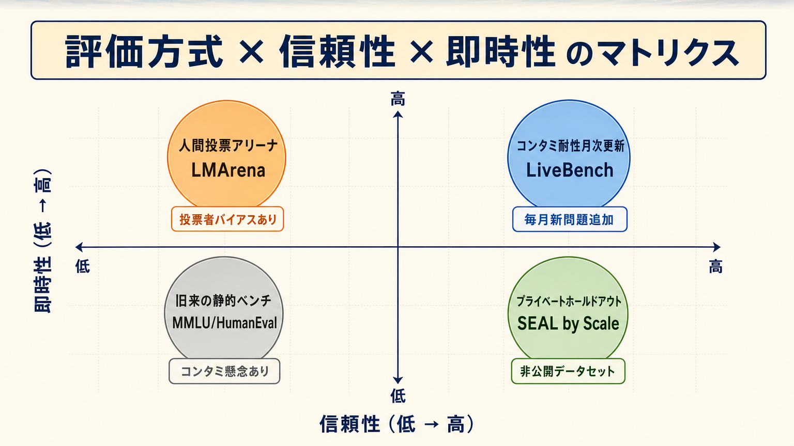

**対象**: 「LMArena と Artificial Analysis ってどう違うの？」「Llama や Qwen の最新スコア、どこで見るのが正しい？」「コーディング評価は SWE-bench でいいの？」が気になっている開発者・PM
**ゴール**: AI モデルの強さを比較するときに、**どのリーダーボードを開けば良いか** を 30 秒で判断できる状態を作る

---

## 0. なぜリーダーボードを「正しく」読む必要があるのか

「LLM のベンチマークなんてどれも似たようなもの」と思って一つだけ見ていると、本番運用で痛い目に遭います。よくある事故:

- **MMLU が高いから採用した → 業務プロンプトでは全然使えない**（汎用知識テストと業務性能はリニアでない）
- **学術ベンチマーク上位の OSS モデルを社内導入 → ハルシネーション地獄**（コンタミネーションでスコアが過大評価されていた）
- **アリーナ投票で 1 位だから安心 → 自社の日本語業務では別モデルの方が良かった**（投票者は英語圏が圧倒的多数）
- **「画像生成は FLUX が最強」と聞いて契約 → 実際は GPT Image の方が日本語テキスト描画が安定**

リーダーボードは「採用判断の出発点」ではあっても「結論」ではありません。**評価軸を理解した上で、複数のサイトを役割分担で使う** ことが本記事のゴールです。

---

## 1. リーダーボードは 3 層で理解する

数十あるサイトを **「横断型」「専門特化」「競技動的」** の 3 層に整理すると一気に見通しが良くなります。

| 層 | 役割 | 代表サイト |
|---|---|---|
| **横断型** | 複数モダリティを一画面で比較。最初の比較に使う | Artificial Analysis / LMArena (Arena.ai) |
| **専門特化** | 1 つの領域を深く掘る。本番採用前の追加検証に使う | LiveBench / HF Open LLM / Aider / SWE-bench / GenAI-Arena / SEAL |
| **競技動的** | 実環境で人間が日常的に使い続けて投票するアリーナ | Copilot Arena / WebDev Arena / Image Arena |

以降、それぞれの代表サイトを深掘りします。

---

## 2. 横断型 — まず開くべき 2 サイト

### 2-1. Artificial Analysis — speed × cost × quality を 1 画面で

https://artificialanalysis.ai/

**テキスト LLM / 画像生成 / 動画生成 / 音声（TTS / Realtime） / GPU ハードウェア** までを統一指標で比較できる稀有なサイト。2026 年時点のカバー範囲:

- **Intelligence Index v4.0** — 10 個の評価（GDPval、Terminal-Bench Hard、SciCode 等）を統合したスコア
- **Coding Agent Index** — ソフトウェアエンジニアリングタスク特化
- **Image & Video Leaderboards** — Text-to-Image / Image Editing / Text-to-Video
- **Speech-to-Speech / Realtime Voice** — 遅延・会話ダイナミクスまで評価
- **AA-Omniscience** — 知識量とハルシネーション率
- **Openness Index** — モデルの透明性とライセンス
- **API Provider Performance** — 同一モデルの 22 プロバイダ間 速度・料金差

特筆点は **「品質 × 速度 × 価格」を 3 軸散布図で表示** すること。「品質はそこそこで安く速い」モデルを探すのに最適です。

### 2-2. LMArena (現 arena.ai) — 人間投票による「使い心地」

https://arena.ai/leaderboard

旧 LMSYS Chatbot Arena が 2026 年に arena.ai に移行したサイト。**ユーザーが盲検でモデルを比較投票** し、Elo レーティング相当のスコアを算出する仕組み。アリーナが領域ごとに分かれており:

| アリーナ | 評価対象 | 2026 年トップ（参考） |
|---|---|---|
| **Text** | 一般的なチャット応答 | Claude Opus 4.6 Thinking |
| **WebDev** | Web アプリ完成度（React/HTML/CSS/JS） | Claude Opus 4.7 Thinking |
| **Vision** | 画像理解・分析 | Claude Opus 4.7 Thinking |
| **Document** | 長文ドキュメント処理 | Claude Opus 4.6 Thinking |
| **Search** | Web 検索連携 | Claude Opus 4.6 Search |
| **Text-to-Image** | プロンプトからの画像生成 | GPT Image 2 |
| **Image Edit** | 画像編集タスク | GPT Image 2 |
| **Text-to-Video** | テキストから動画生成 | Dreamina Seedance 2.0 |
| **Image-to-Video** | 静止画からの動画生成 | Dreamina Seedance 2.0 |
| **Image-to-WebDev** | スクリーンショットから Web 実装 | Claude Opus 4.7 Thinking |

**強みと弱み**:
- ✅ ベンチマークのコンタミ問題と無縁（投票による相対評価）
- ✅ 「実プロンプトに対する人間の好み」が反映される
- ❌ 投票者層に偏り（英語圏・技術者が多い）
- ❌ 「気持ち良い回答」と「正確な回答」が混同される可能性

---

## 3. 専門特化型 — 領域別の信頼できる定点観測

横断型で目星をつけた後、**採用判断前に必ず専門特化型を確認** する。コンタミ耐性とプライベートホールドアウトを持つサイトが信頼できます。

### 3-1. LiveBench — コンタミ耐性の決定版

https://livebench.ai/

Yann LeCun らが関与。**毎月新しい問題を追加** し、6 ヶ月ごとに完全リフレッシュする「コンタミネーションを構造的に潰した」ベンチマーク。

- 21 タスク × 7 カテゴリ: **推論 / コーディング / エージェント型コーディング / 数学 / データ分析 / 言語 / 指示追従**
- 出典: 最新の arXiv 論文 / 数学コンテスト / ニュース / IMDb 映画あらすじ など、モデル学習時には存在しなかった素材
- **客観的な正解** があるため LLM-as-judge 不要

「最新公開時点で本当に未知のタスクが解けるか」を測れる唯一に近いベンチマーク。**学術論文での比較は LiveBench をまず確認** が定番。

### 3-2. Hugging Face Open LLM Leaderboard — ローカル運用候補のスクリーニング

https://huggingface.co/open-llm-leaderboard

> ⚠️ **2024-2025 にアーカイブ済**。Space のランタイムが停止しているため、現在は組織ページから過去のスナップショットを閲覧する形になっています。最新のオープンウェイト評価は Artificial Analysis のオープンウェイト欄や LiveBench へ移行している。

オープンウェイト（ローカル動作可）モデルに特化していたリーダーボード。評価ベンチ:

- **IFEval** — 指示追従
- **BBH** (Big Bench Hard) — 多様な難問
- **MATH** — 数学
- **GPQA** — 専門家レベル QA
- **MUSR** — 多段階推論
- **MMLU-PRO** — 専門知識（強化版）

**Llama / Qwen / DeepSeek / Gemma / Mistral / Phi** などのローカル LLM 候補を比較する第一歩はここ。**ライセンスとパラメータ数フィルタ** が効くので「商用利用可かつ 7B 以下」みたいな実装制約から候補を絞れます。

### 3-3. Aider Polyglot — 実用コーディング能力

https://aider.chat/docs/leaderboards/

**Exercism の 225 問** を C++ / Go / Java / JavaScript / Python / Rust の 6 言語で解かせ、**diff 編集形式で正答率を測る**。

2026 年トップ:
1. GPT-5 (high) — 88.0%
2. GPT-5 (medium) — 86.7%
3. o3-pro (high) — 84.9%
4. Gemini 2.5 Pro Preview (32k thinking) — 83.1%

**ポイントは「コードを書く」ではなく「既存コードを正しく編集する」を測ること**。実務で AI コーディングアシスタントを使うときの体感に最も近い指標です。

### 3-4. SWE-bench / Terminal-Bench / GAIA — エージェント評価

https://www.swebench.com/

**実環境タスクをエージェントが解けるか** を測る系。

| ベンチマーク | 評価内容 | 2026 年首位 (参考) |
|---|---|---|
| **SWE-bench Verified** | 実 GitHub Issue → Patch 生成 | Claude エージェント系が 70%+ |
| **Terminal-Bench Hard** | コンパイル・モデル学習・サーバ構築 etc を CLI で完遂 | Claude Sonnet 4.5 (50%) |
| **GAIA** | 一般的な調査・推論・ツール利用 | 上位は 75% 前後 |
| **HLE** (Humanity's Last Exam) | 専門家でも難解な学術問題 | Claude Mythos Preview 64.7% |

**注意**: GAIA・Terminal-Bench のスコアは **エージェントフレームワーク依存** が大きい（同じモデルでも mini-SWE-agent と full SWE-agent で大差がつく）。**「モデル vs モデル」ではなく「フレームワーク + モデル vs ...」として読む** こと。

### 3-5. Artificial Analysis Image / Video Leaderboard — 画像・動画生成の専門

https://artificialanalysis.ai/text-to-image

画像生成 / 動画生成 / 画像編集を **品質 (Elo) × 速度 × 価格** の 3 軸で比較できる専門リーダーボード。FLUX、Imagen、GPT Image、Stable Diffusion、Seedream、Recraft、Grok Imagine などプロプラ・オープンソース問わず最新モデル 100+ を網羅。

> ℹ️ かつて画像/動画モデル比較の定番だった TIGER-Lab/GenAI-Arena (Hugging Face Space) は 2026 年現在ビルドエラーで停止中。同等の人間投票による Elo を見るなら LMArena の Image Arena / Image Edit / Text-to-Video アリーナへ。

オープンソース勢（FLUX、Stable Diffusion、Playground 等）も含む比較に有用。

### 3-6. SEAL by Scale — プライベートホールドアウトの良心

https://scale.com/leaderboard

Scale AI が **非公開・カンニング不能なデータセット** を使って評価する仕組み。

- **Coding** / **Instruction Following** / **多言語**（中国語・スペイン語・アラビア語・韓国語・**日本語**） など
- **SEAL Showdown** — 100 カ国・70 言語・200 職種のユーザー投票で「実用的な好み」を計測
- **MASK** — モデルの誠実性（嘘をつかないか）

**日本語業務での性能** が気になるなら SEAL の Japanese リーダーボードは必見。

---

## 4. 競技動的型 — 実環境連続評価

### 4-1. Copilot Arena — 実際の IDE 上での投票

https://github.com/lmarena/copilot-arena

VS Code 拡張として動作し、**コーディング中の補完候補を 2 つ並べてユーザーが選ぶ** 仕組み。
- ダウンロード 11,000+ ユーザー、累計補完 100K 件、25,000+ バトル
- 結果は LMArena の Copilot Arena として live leaderboard 化

「ベンチマーク用プロンプト」ではなく **本物の業務コード上で評価される** のが最大の特徴。

### 4-2. WebDev Arena — Web アプリ単位での評価

孤立した関数生成ではなく **HTML/CSS/JS 統合された Web アプリ完成度** を評価。実務に近いコーディング体力テスト。

### 4-3. Image Arena / Video Arena — 創造系の即時投票

LMArena 内に組み込まれた画像・動画生成アリーナ。日々モデルが入れ替わるので **「先月最強だった画像モデル」が今月 3 位** ということが頻繁に起きる領域。常に最新を見る習慣が大事。

---

## 5. リーダーボードの落とし穴

ベンチマークが「現実」を完全に表していると思うと痛い目に遭います。よくある罠:

### 5-1. データコンタミネーション

公開ベンチマークの問題が学習データに混入し、**スコアが過大評価** される。MMLU や HumanEval は 2023 年以降コンタミネーション疑惑が継続中。
→ **対策**: LiveBench、SEAL のようなプライベート保留 / 動的更新ベンチを併用する。

### 5-2. プロンプト工学差

同じモデルでも **プロンプト・温度・ツール定義** で 20 ポイント以上スコアが動く。
→ **対策**: 「Claude Opus 4.7 Thinking」のように **モード明記** で比較すること。サブモードを明記しないリーダーボードは参考程度に。

### 5-3. エージェントフレームワーク依存

GAIA や Terminal-Bench は **エージェント実装次第** で大差。SWE-agent / OpenHands / Devin など、どのフレームワーク経由のスコアかを必ず確認。

### 5-4. 投票者バイアス

LMArena 投票者は **英語圏・男性・技術者** が圧倒的多数。日本語の業務性能、女性視点のコピー生成などは別ソース（SEAL 等）で再評価が必要。

### 5-5. 「速度」と「品質」のトレードオフを忘れる

リーダーボードは品質指標が前面に出がちだが、**本番運用では速度・料金が直接コストになる**。Artificial Analysis の散布図を併読する習慣を。

---

## 6. 用途別 早見表 — どこを開くか

| やりたいこと | 開くサイト |
|---|---|
| **総合的に強いモデルが知りたい** | Artificial Analysis Intelligence Index + LMArena Text |
| **ローカルで動かす OSS モデル選び** | HF Open LLM Leaderboard + GenAI-Arena (画像) |
| **日本語業務での実力** | SEAL Japanese + LMArena Text（日本語プロンプト多い場合） |
| **コーディング採用判断** | Aider Polyglot + SWE-bench Verified + WebDev Arena |
| **エージェント自動化** | Terminal-Bench + GAIA + SWE-bench Verified |
| **画像生成プロダクト選び** | Artificial Analysis Text-to-Image + LMArena Image Arena |
| **動画生成** | LMArena Text-to-Video + Artificial Analysis Video |
| **リアルタイム音声 / 電話 AI** | Artificial Analysis Speech-to-Speech |
| **コンタミ抜きで本当の強さ** | LiveBench |
| **IDE 補完体験** | Copilot Arena (LMArena 上の live) |
| **誠実性・嘘の少なさ** | SEAL MASK |

---

## 7. ローカル LLM 候補を選ぶときの実用フロー

ローカル運用を想定したモデル選びは **3 ステップ** で進めると失敗しません。

1. **HF Open LLM で候補を絞る** — ライセンス・サイズ・MMLU-PRO で 5 つに絞る
2. **LiveBench でコンタミ耐性確認** — 候補のうち LiveBench に乗っているものを優先
3. **Aider Polyglot or SEAL Japanese で業務適合確認** — 実際の用途（コード / 日本語）で再ランク
4. **Artificial Analysis で速度・量子化での実行コストを見積** — 推論サーバ要件を決定

このフローを踏まないと「学術スコアは高いのに業務で使い物にならない OSS モデル」を掴みます。

---

## 8. 結論 — 「1 つのリーダーボード信仰」を捨てる

AI モデルの評価は **多軸の意思決定** です。一つのサイトの順位だけで判断するのは、株式投資で 1 つの指標だけ見るのと同じくらい危険。

**最低限の習慣**:
- 最初は **Artificial Analysis** で速度・コスト・品質の散布図を見る
- 人間体感の裏取りに **LMArena** を見る
- 採用前に **LiveBench** でコンタミ耐性を確認
- 業務用途別の専門特化サイト（Aider / SEAL / GenAI-Arena 等）で深掘り
- 月 1 で順位を見直す（特に動画・画像生成は数週間で逆転する）

評価サイトは **「採用判断の出発点」ではあっても「結論」ではない**。最終判断は必ず **自社の本物のプロンプト** で社内 A/B を回してください。それが一番信頼できるベンチマークです。
