> ソフトウェアアーキテクチャ／設計パターンを **目的 → 構造図 → メリデメ → 日常のたとえ → コード** の統一フォーマットで網羅した完全ガイド。
> たとえ話の物体と実設計の対応表を毎パターンに付けたので、エンジニアでなくても理解できます。

## はじめに

「設計パターン」とは、ソフトウェアの **部品の並べ方の型** のこと。家を建てるときに「2 階建てか平屋か」を最初に決めるように、ソフトウェアも「どう組み立てるか」を先に決める。

正しい型を選ばないと、こんな事故が起きる:

- 機能追加のたびに別の場所が壊れる（増築を繰り返した旅館）
- 担当者が変わると誰も触れない（誰が建てたか分からない古民家）
- 一部だけ速くしたいのに全体を建て直す必要がある（部屋を 1 つ広げるだけで家全体を建て替え）

本記事では **34 種類** のパターンを次の 6 セクションで統一して解説する:

1. **アーキテクチャ名**
2. **目的と使いどころ** — なぜ存在するか／いつ使うか
3. **構造イメージ** — 実設計の図解
4. **メリット / デメリット**
5. **日常のたとえ** — 比喩イラスト + **対応表**（比喩物体と実設計要素の 1:1 対応）
6. **コード例（TypeScript）** — 動かせる最小実装

---

## 目次

1. [レイヤ系アーキテクチャ](#1-レイヤ系アーキテクチャ)
2. [プレゼンテーション系パターン](#2-プレゼンテーション系パターン)
3. [分散系アーキテクチャ](#3-分散系アーキテクチャ)
4. [データ／DDD 系パターン](#4-データddd-系パターン)
5. [統合・移行パターン](#5-統合移行パターン)
6. [その他構造系パターン](#6-その他構造系パターン)
7. [選定チートシート](#7-選定チートシート)

---

## 1. レイヤ系アーキテクチャ

> **章の位置づけ**: アプリを「縦に層分けする」最も基本的な考え方の章。すべての始まりはここから。

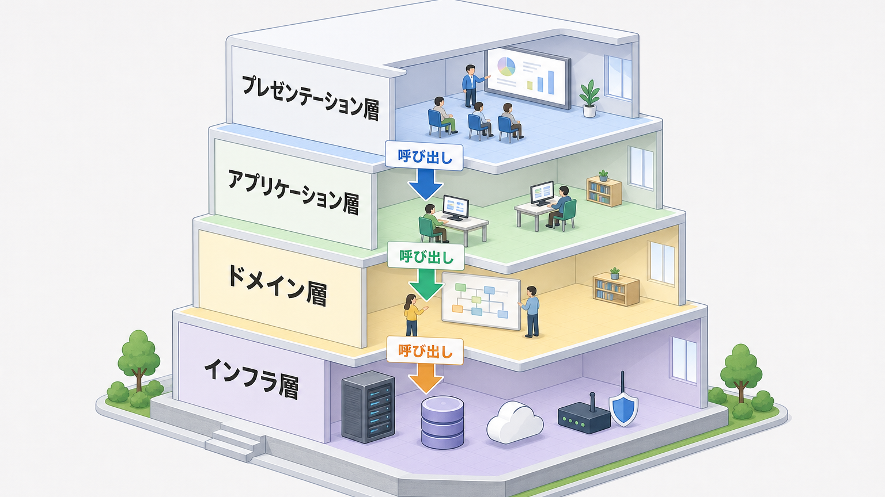

### 1.1 Layered Architecture

#### 目的と使いどころ

アプリを **「役割が違う 4 つの層」** に分け、上位層が下位層だけに依存するように制約する。Eric Evans の DDD（後述 4.4）で広く知られる現代的な構成は次の 4 層:

- **プレゼンテーション層** — 画面・API エンドポイント (ユーザーや外部システムとの接点)
- **アプリケーション層** — ユースケース（業務の流れの調整）
- **ドメイン層** — ビジネスルール・エンティティ（業務知識そのもの）
- **インフラ層** — DB・メール・外部 API などの「道具」の実装

**使いどころ**: 中〜大規模の業務システム、SaaS、ドメインがしっかりしているプロダクト。「とりあえず迷ったらこれ」の鉄板。

> **古典的な 3 層 N-Tier**（Presentation / Business / Data Access）はこの簡略版。現代の主流は DDD 由来の 4 層構成。

#### 構造イメージ

階層は上から下へ依存する一方通行。**上の層が下の層を呼ぶ**ことはあっても、**下の層が上の層を呼ぶことはない**。

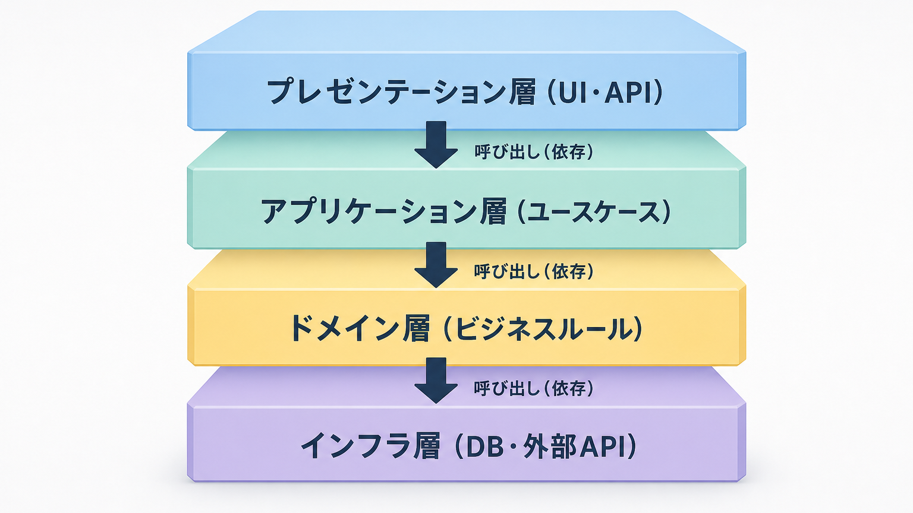

#### メリット / デメリット

**メリット**
- 役割が明確で、新人に説明しやすい
- 上位の変更が下位に波及しにくい
- どの Web フレームワーク（Rails / Spring / Next.js / Laravel）でも適用可能

**デメリット**
- 仕様変更で 4 層すべてを触る必要が出ることがある（手間）
- ドメイン層に処理を書かず、サービス層に詰め込みすぎると「貧血ドメインモデル」になる

#### 日常のたとえ ― 社員食堂

**社員食堂** で考えると一発で分かる。

| たとえ話の物体 | 実設計での対応 | 役割 |
|---|---|---|
| お客さん | プレゼンテーション層 | 注文を出す・料理を受け取る |
| 配膳カウンター | アプリケーション層 | 注文を整理してキッチンに伝える |
| キッチン | ドメイン層 | 「うちのレシピ」を知っていて料理する |
| 食材庫 | インフラ層 | 食材という外部資源を提供する |

お客さんは食材庫に勝手に入れない。**必ず上から順に通す**。これがレイヤ依存の方向制約。

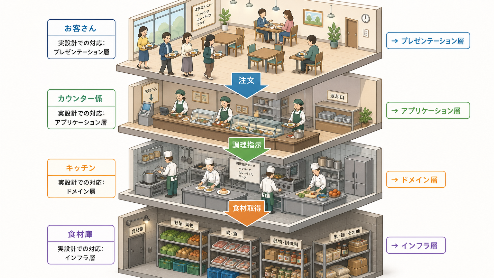

#### コード例（TypeScript）

```typescript
// === ドメイン層: ビジネスルール (例: 割引計算は 0-50% 以内) ===
class Order {
  constructor(public readonly id: string, public readonly total: number) {}
  applyDiscount(rate: number): Order {
    if (rate < 0 || rate > 0.5) throw new Error("割引率は 0-50% 以内");
    return new Order(this.id, this.total * (1 - rate));
  }
}

// インフラ層が実装する契約
interface OrderRepository {
  findById(id: string): Promise<Order | null>;
  save(order: Order): Promise<void>;
}

// === アプリケーション層: 業務フロー ===
class ApplyDiscountUseCase {
  constructor(private readonly repo: OrderRepository) {}
  async run(orderId: string, rate: number): Promise<Order> {
    const order = await this.repo.findById(orderId);
    if (!order) throw new Error("注文が見つかりません");
    const updated = order.applyDiscount(rate);
    await this.repo.save(updated);
    return updated;
  }
}

// === インフラ層: ドメイン層の契約を Prisma で実装 ===
class PrismaOrderRepository implements OrderRepository {
  async findById(id: string) {
    const r = await prisma.order.findUnique({ where: { id } });
    return r ? new Order(r.id, r.total) : null;
  }
  async save(order: Order) {
    await prisma.order.upsert({
      where: { id: order.id },
      update: { total: order.total },
      create: { id: order.id, total: order.total },
    });
  }
}

// === プレゼンテーション層: HTTP エンドポイント ===
export async function POST(req: Request) {
  const { orderId, rate } = await req.json();
  const usecase = new ApplyDiscountUseCase(new PrismaOrderRepository());
  const result = await usecase.run(orderId, rate);
  return Response.json(result);
}
```

---

### 1.2 Clean Architecture

#### 目的と使いどころ

Layered の発展形。Robert C. Martin（通称 Uncle Bob）が提唱した、**同心円状にレイヤを並べ、依存方向を「常に内向き」** に制約するパターン。

- 中心 = 「ビジネスルール」（変わりにくい）
- 外周 = 「フレームワーク / DB / UI」（取り替え可能な詳細）

**使いどころ**: DB やフレームワークを後から差し替えたい長寿命プロダクト、テストを徹底したい基幹系。

> Layered との違い: Layered は「層」、Clean は「同心円」。Clean は **依存性逆転** という仕組みで「外側が中心の `interface` を実装する」形にし、ドメイン層をフレームワーク非依存に保つ。

#### 構造イメージ

矢印は **常に外から内** へ向かう。中心の Entity 層は他の層を一切知らない。

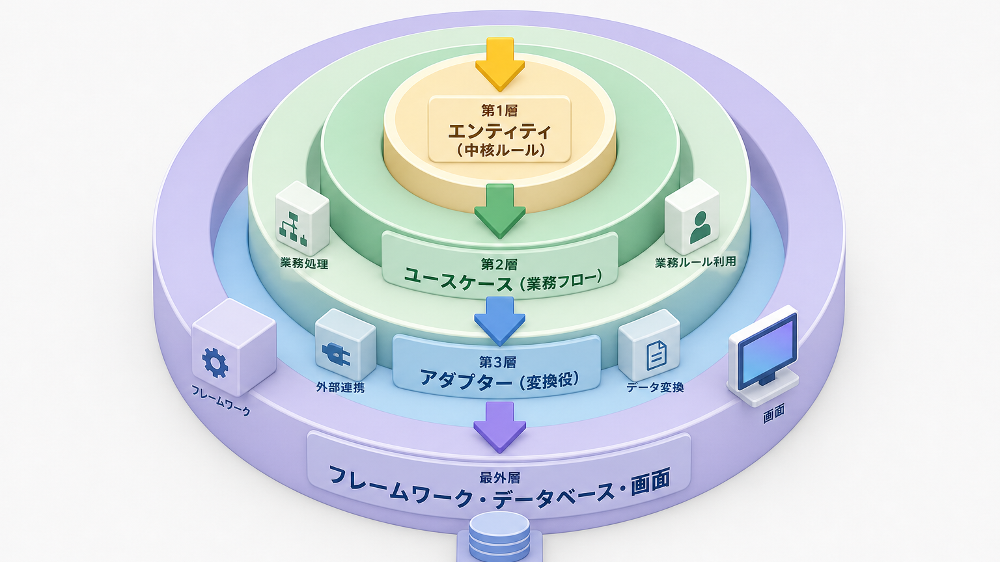

#### メリット / デメリット

**メリット**
- DB を起動しなくてもビジネスロジックを単体テストできる
- Web フレームワーク（Next.js → Hono）や DB（MySQL → PostgreSQL）を後から差し替え可能
- 10 年単位の長寿命システムに耐える

**デメリット**
- ファイル数・interface 定義が増える
- 小規模アプリだとオーバーキル

#### 日常のたとえ ― マトリョーシカ人形

**マトリョーシカ**（ロシアの入れ子人形）が完全な比喩。

| たとえ話の物体 | 実設計での対応 | 役割 |
|---|---|---|
| 一番小さい中心の人形 | Entity（中核ビジネスルール） | プロダクトの本質。最も変わらない |
| その外の人形 | Use Case（業務フロールール） | エンティティを組み合わせて業務を実現 |
| さらに外の人形 | Adapter（変換役） | UI/DB/外部 API との変換 |
| 一番大きい外側の人形 | Framework / Driver | Web フレームワーク・ORM・外部 SaaS |

外側の人形（Framework）を取り替えても、中の人形（Entity）は無事。**この「中身に触らずに外側を取り替えられる」** がパターンの核心。

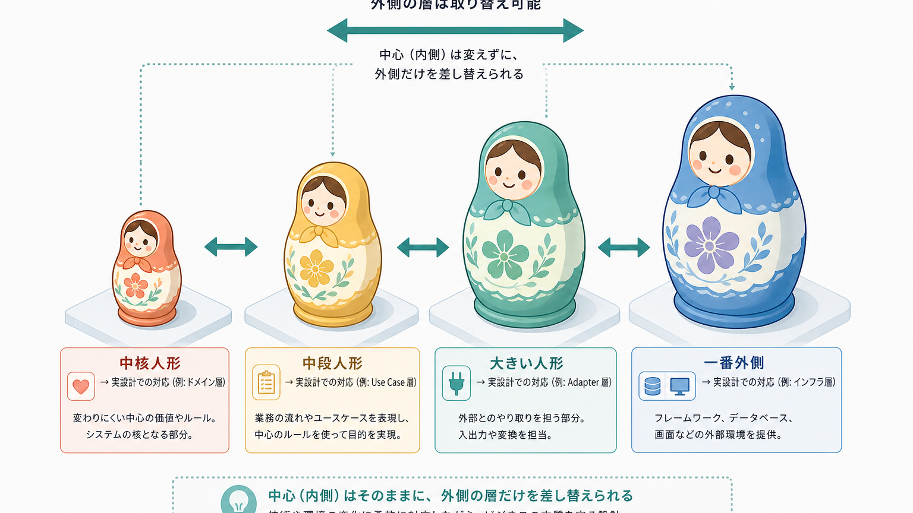

#### コード例（TypeScript）

```typescript
// === Entity (中心): プロダクトの不変ルール ===
class User {
  constructor(public readonly id: string, public readonly email: string) {
    if (!email.includes("@")) throw new Error("メール形式不正");
  }
}

// === Use Case (内側): 業務フロー。Entity と Port にだけ依存 ===
interface UserRepo {
  find(id: string): Promise<User | null>;
}
class GetUserUseCase {
  constructor(private readonly repo: UserRepo) {}
  async run(id: string): Promise<User> {
    const user = await this.repo.find(id);
    if (!user) throw new Error("ユーザー不在");
    return user;
  }
}

// === Adapter (外側): UseCase の Port を実装する ===
class SqlUserRepo implements UserRepo {
  async find(id: string) {
    const r = await prisma.user.findUnique({ where: { id } });
    return r ? new User(r.id, r.email) : null;
  }
}

// === Framework (最外殻): Next.js の HTTP ハンドラ ===
export async function GET(req: Request) {
  const id = new URL(req.url).searchParams.get("id") ?? "";
  const usecase = new GetUserUseCase(new SqlUserRepo());
  return Response.json(await usecase.run(id));
}
```

---

### 1.3 Hexagonal Architecture (Ports & Adapters)

#### 目的と使いどころ

Clean とほぼ同じ哲学だが、**「ポート」「アダプター」** という具体的な言葉で表現する。Alistair Cockburn が提唱。

- **Port** = 差込口（インターフェース。何を繋いでもいい規格）
- **Adapter** = 差し込むプラグ（実装。Web / DB / テスト用モックなど）

アプリケーション本体は **Port しか知らない**。Adapter は外から差し替え可能。

**使いどころ**: 外部依存（決済 SaaS、メール、地図 API）が多く、将来差し替える可能性があるシステム。テストで本物の依存を使いたくないケース。

#### 構造イメージ

中央の六角形 = アプリ本体。左右に「入力 Port (UI/CLI/Test)」と「出力 Port (DB/MQ/外部 API)」が差込口として並ぶ。

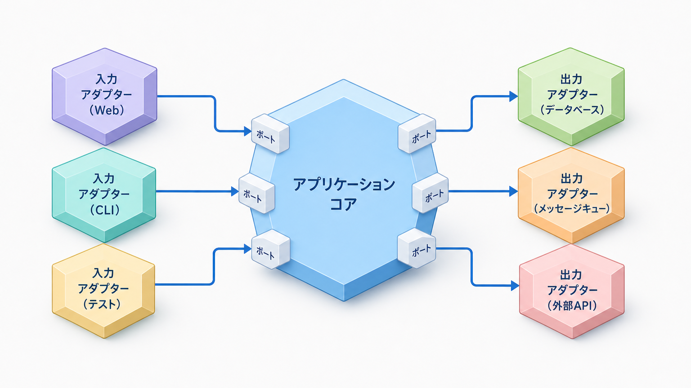

#### メリット / デメリット

**メリット**
- テストもただの Adapter として扱える（本物 DB 不要）
- インフラ差し替えが容易

**デメリット**
- Port 定義（interface）が増える

#### 日常のたとえ ― 家電のコンセントとプラグ

**家庭の電源コンセント** がそのもの。

| たとえ話の物体 | 実設計での対応 | 役割 |
|---|---|---|
| 電化製品本体（テレビ等） | アプリケーション本体 | ロジックの本体。電源があれば動く |
| コンセントの穴 | Port (interface) | 規格化された差込口 |
| 電源プラグ／変換プラグ | Adapter (実装) | コンセントに刺さって電気を渡す |
| 海外用変換アダプター | 環境別 Adapter | 海外で日本製テレビを使うときの変換 |

テレビ本体は「電源プラグの形」しか知らない。プラグの先（コンセント・電力会社・発電所）が何でも動く。

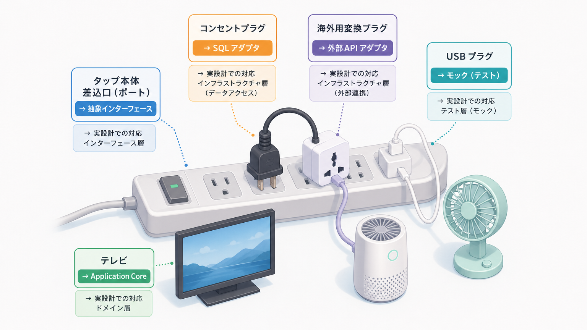

#### コード例（TypeScript）

```typescript
// === Port: 差込口の規格 ===
interface NotificationPort {
  send(message: string): Promise<void>;
}
interface OrderRepoPort {
  save(order: Order): Promise<void>;
}

// === Application Core: Port しか知らない本体 ===
class PlaceOrderService {
  constructor(
    private readonly notifier: NotificationPort,
    private readonly repo: OrderRepoPort,
  ) {}
  async run(order: Order) {
    await this.repo.save(order);
    await this.notifier.send(`注文 ${order.id} を受け付けました`);
  }
}

// === Adapter: 差し替え自由 ===
class SlackNotifier implements NotificationPort {
  async send(msg: string) { /* Slack Webhook */ }
}
class EmailNotifier implements NotificationPort {
  async send(msg: string) { /* SendGrid 経由 */ }
}
class PrismaOrderRepo implements OrderRepoPort {
  async save(order: Order) { /* Prisma */ }
}

// 本番では Slack + Prisma、テストでは InMemory に差し替え
const svc = new PlaceOrderService(new SlackNotifier(), new PrismaOrderRepo());
```

---

### 1.4 Onion Architecture

#### 目的と使いどころ

Jeffrey Palermo 提唱。Clean Architecture の **前身**。同心円の中心にドメインモデルを置き、外側ほど可変要素を配置する。Clean とほぼ同じ。

**Clean との違い**: Clean は「Use Case 層」を明示する。Onion はもっと素朴に「Domain Model」「Domain Service」「Application Service」「Infrastructure」の 4 層。

**使いどころ**: 「中身は変わらないが外側は変わる」という哲学をチームで共有したいとき。

#### 構造イメージ

中心 = Domain Model（変わらない）、外側に向かって変わりやすくなる。

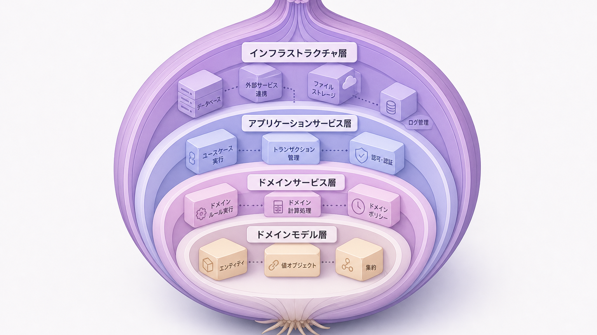

#### メリット / デメリット

**メリット**
- ドメインモデルが他のレイヤから独立 → 純粋に保てる
- DI コンテナと相性◎

**デメリット**
- Clean Architecture とほぼ同じで違いが分かりにくい
- 「Domain Service」と「Application Service」の使い分けで議論になる

#### 日常のたとえ ― 地球の断面

| たとえ話の物体 | 実設計での対応 | 役割 |
|---|---|---|
| 中心の核（鉄・ニッケル） | Domain Model | 何があっても変わらない地球の核 |
| マントル | Domain Service | 流動的だが基本性質は不変 |
| 地殻 | Application Service | 表面に近づくほど活動が活発 |
| 大気圏 | Infrastructure | 雲も雨も日々変わる外殻 |

**内側ほど不変、外側ほど可変**。設計の優先順位もこの順。

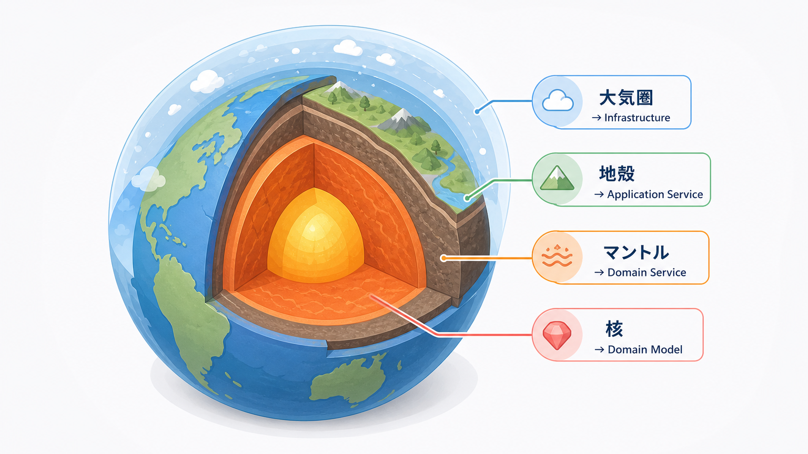

#### コード例（TypeScript）

```typescript
// === Domain Model (核): 値オブジェクト ===
class Money {
  constructor(public readonly amount: number, public readonly currency: "JPY") {}
}

// === Domain Service (マントル): ドメインに属する処理 ===
class TaxService {
  apply(price: Money): Money {
    return new Money(Math.floor(price.amount * 1.1), "JPY");
  }
}

// === Application Service (地殻): ユースケース調整 ===
class CheckoutService {
  constructor(private readonly tax: TaxService) {}
  checkout(price: Money) { return this.tax.apply(price); }
}

// === Infrastructure (大気): フレームワーク呼び出し ===
// Express ハンドラから上記 Service を呼ぶ
```

---

## 2. プレゼンテーション系パターン

> **章の位置づけ**: 1 章では「アプリ全体の縦割り」を見た。本章は **画面（UI）の作り方** にズームインする。

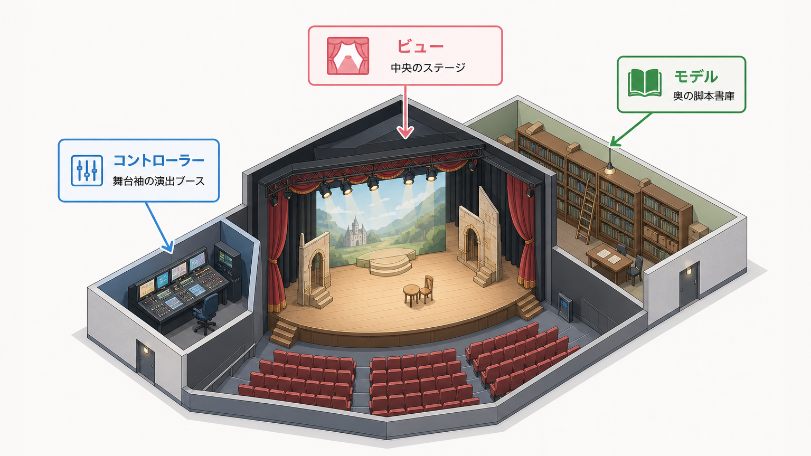

### 2.1 MVC (Model-View-Controller)

#### 目的と使いどころ

UI を **データ (Model)・表示 (View)・制御 (Controller)** の三役に分けるパターン。Web フレームワーク（Rails / Spring MVC / Laravel）の標準形。

**使いどころ**: サーバーサイド Web アプリの基本。今でも一番よく使われる形。

#### 構造イメージ

ユーザー操作 → Controller → Model 更新 → View 描画 → ユーザー、というループ。

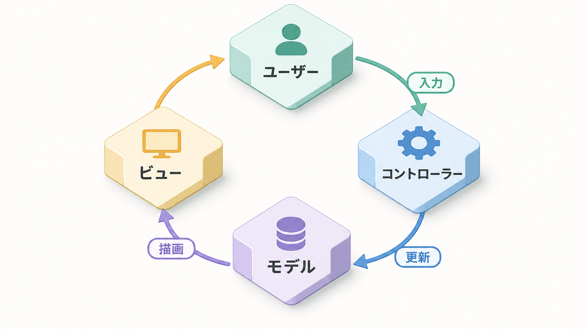

#### メリット / デメリット

**メリット**
- 多くのフレームワークが標準対応
- 役割分担が単純で学習しやすい

**デメリット**
- View が肥大化して「Massive View Controller」になりがち
- 大規模化すると責任の境界が曖昧になる

#### 日常のたとえ ― レストラン

| たとえ話の物体 | 実設計での対応 | 役割 |
|---|---|---|
| キッチン | Model | データ（食材）を持ち、処理（調理）を担う |
| ホール（ウェイター） | View | お客さんに見える部分。料理を提示 |
| 店長 | Controller | 注文を受けて誰に何を頼むか指示 |
| お客さん | ユーザー | 注文を出す・料理を食べる |

お客さんから見えるのはホールだけ。キッチンと店長は裏方。

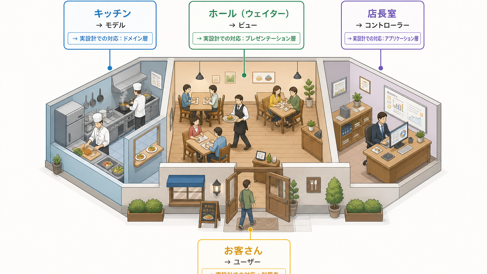

#### コード例（TypeScript）

```typescript
// === Model: データと処理 ===
class TodoModel {
  private items: string[] = [];
  add(s: string) { this.items.push(s); }
  list() { return [...this.items]; } // 不変コピーを返す
}

// === View: 描画専門 ===
class TodoView {
  render(items: string[]): string {
    return items.map((s) => `<li>${s}</li>`).join("");
  }
}

// === Controller: Model と View を繋ぐ ===
class TodoController {
  constructor(private model: TodoModel, private view: TodoView) {}
  handleAdd(text: string): string {
    this.model.add(text);
    return this.view.render(this.model.list());
  }
}
```

---

### 2.2 MVP (Model-View-Presenter)

#### 目的と使いどころ

MVC の改良版。View を **「完全に受け身（パッシブ）」** にし、判断を全部 Presenter に集中させる。View がロジックを持たないので **テストが書きやすい**。

**使いどころ**: 旧 Android、WinForms、GWT など。View の単体テストがしづらいプラットフォーム向け。

> MVC との違い: MVC は View が Model を直接見る。MVP は View が完全に受け身で、Presenter が View に「これを表示しろ」と命令する。

#### 構造イメージ

View → Presenter ↔ Model。View は Model を直接見ない。

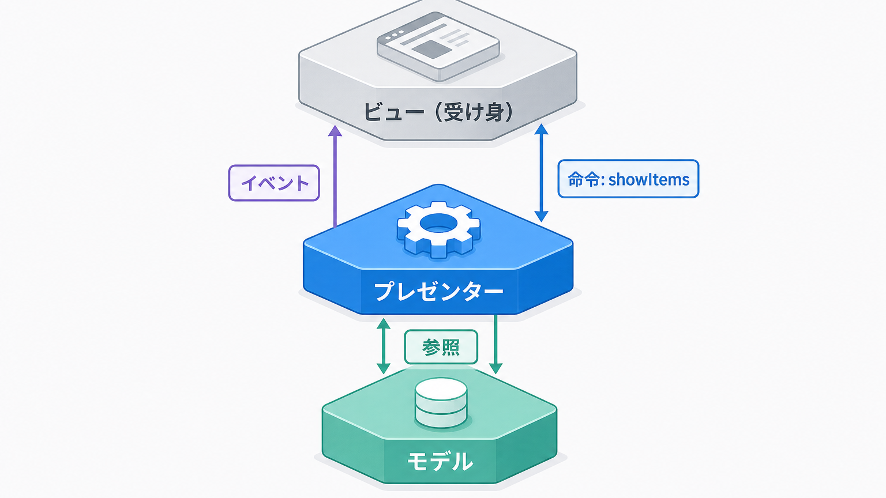

#### メリット / デメリット

**メリット**
- View がパッシブで Presenter をテストしやすい
- ロジックが Presenter に集中

**デメリット**
- View と Presenter の interface が増える
- MVVM の登場でモバイル領域では下火

#### 日常のたとえ ― 漫才の司会者

| たとえ話の物体 | 実設計での対応 | 役割 |
|---|---|---|
| 舞台上の漫才師 | View (パッシブ) | 司会の指示通り動く |
| 司会者（メガホン） | Presenter | 次のネタ・順番を全部判断 |
| 楽屋の脚本書庫 | Model | データ・台本を保持 |
| 観客 | ユーザー | 入力（拍手等）を司会者に届ける |

芸人（View）は判断しない。「次は○○のネタ」は司会者（Presenter）が全て決める。

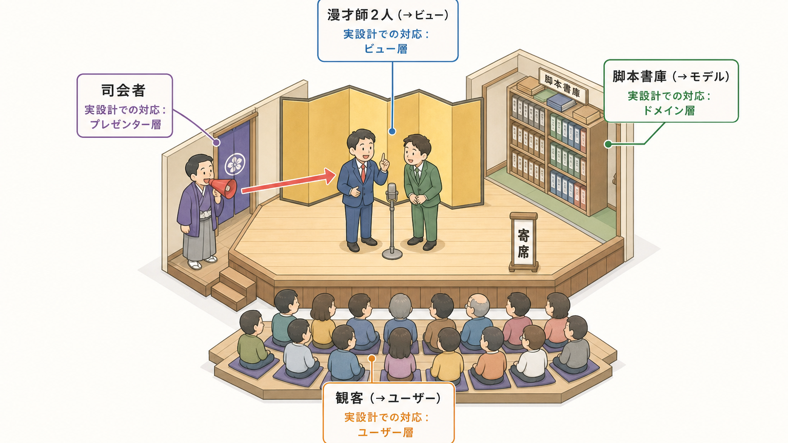

#### コード例（TypeScript）

```typescript
// === View interface: 受け身の表示メソッドだけを持つ ===
interface TodoView {
  showItems(items: string[]): void;
  showError(msg: string): void;
}

// === Presenter: 判断ロジックを全部担当 ===
class TodoPresenter {
  private items: string[] = [];
  constructor(private view: TodoView) {}
  add(text: string) {
    if (!text) {
      this.view.showError("空文字は不可");
      return;
    }
    this.items.push(text);
    this.view.showItems(this.items);
  }
}
```

---

### 2.3 MVVM (Model-View-ViewModel)

#### 目的と使いどころ

View と ViewModel を **「データバインディング」** で結ぶ。ViewModel が状態を持ち、View はそれを自動で映す（片方が変わるともう片方も変わる）。

**使いどころ**: 宣言的 UI フレームワーク（WPF / SwiftUI / Vue.js / Solid.js）。

> MVP との違い: MVP は Presenter が View を命令的に操作 (`view.showItems(...)`)。MVVM は ViewModel が State を更新するだけで View が自動追従する。

#### 構造イメージ

View ↔（双方向バインディング）↔ ViewModel → Model。

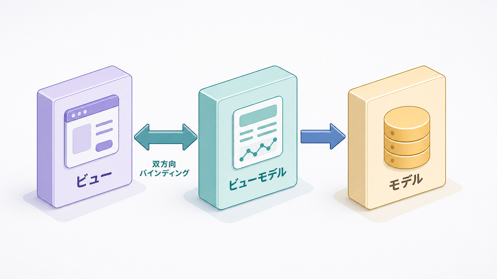

#### メリット / デメリット

**メリット**
- 宣言的に書ける（ボイラープレートが少ない）
- ViewModel が UI 状態を集約してテストしやすい

**デメリット**
- バインディングのデバッグが難しいことがある
- 大規模化で ViewModel が肥大化

#### 日常のたとえ ― 鏡

| たとえ話の物体 | 実設計での対応 | 役割 |
|---|---|---|
| あなた自身 | Model | データの源 |
| 鏡像 | View | 表示。Model の状態を映す |
| 鏡（反射装置） | ViewModel | Model ⇔ View を自動同期 |
| あなたの動き | ユーザー操作 | Model を変化させる |

あなた（Model）が手を上げれば鏡像（View）も同じ動きをする。間にある鏡（ViewModel）が自動反映を担う。

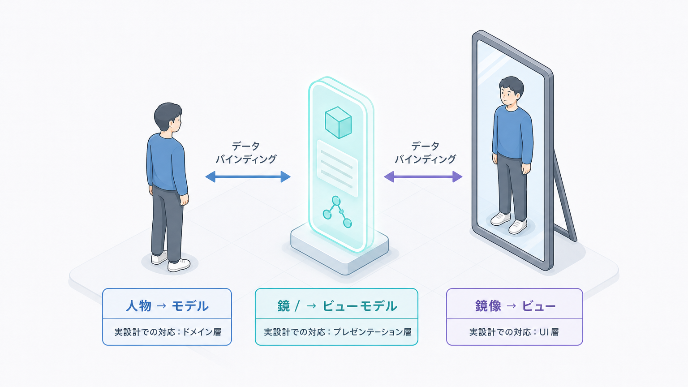

#### コード例（TypeScript）

```typescript
import { signal } from "@preact/signals-core";

// === ViewModel: observable な State を持つ ===
class TodoViewModel {
  items = signal<string[]>([]);
  add = (text: string) => {
    this.items.value = [...this.items.value, text]; // 不変更新
  };
}

// === View (SolidJS / Vue 等の宣言記法) ===
// <ul>
//   <For each={vm.items.value}>{(t) => <li>{t}</li>}</For>
// </ul>
// → vm.items.value を更新するだけで View が自動再描画
```

---

### 2.4 MVI (Model-View-Intent)

#### 目的と使いどころ

ユーザー操作を **「意図 (Intent)」** という値オブジェクトで表現し、Reducer が State を生成、View が State を映す **単方向データフロー**。

**使いどころ**: リアクティブ／関数型志向のモバイル UI（Jetpack Compose, Cycle.js 等）。

> MVVM との違い: MVVM は View と ViewModel が「双方向」。MVI は **一方向ループ** で、状態遷移が予測可能。

#### 構造イメージ

Intent → Reducer → State → View → 次の Intent... の循環。

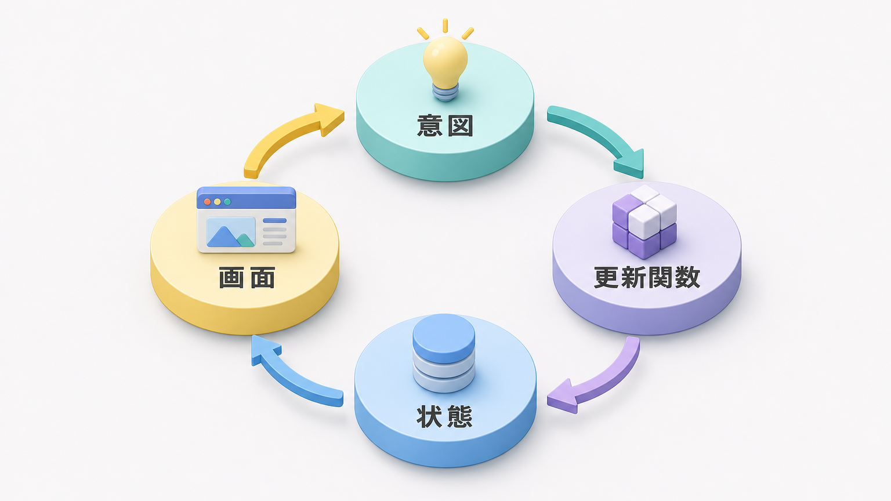

#### メリット / デメリット

**メリット**
- 状態遷移が予測可能（デバッグしやすい）
- Time-travel デバッガと相性◎

**デメリット**
- 全操作を Intent 型にするのでボイラープレートが多い

#### 日常のたとえ ― 自動販売機

| たとえ話の物体 | 実設計での対応 | 役割 |
|---|---|---|
| ボタン押下 | Intent | ユーザーの意図 |
| 内部の歯車・在庫管理 | Reducer | 状態を新しい状態へ更新 |
| 在庫表（内部状態） | Model (State) | 現在の状態を保持 |
| 商品落下・ランプ点灯 | View | 状態を物理的に表示 |

同じボタン（Intent）を押せば、同じ結果（State 更新 → View）が返る。**入力が決まれば出力が一意に決まる**。

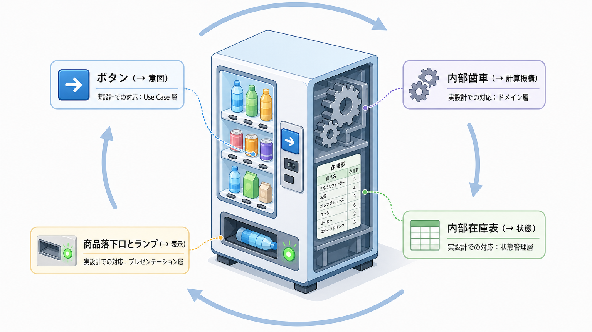

#### コード例（TypeScript）

```typescript
// === Intent: ユーザー操作を直列化したデータ ===
type Intent =
  | { type: "add"; text: string }
  | { type: "remove"; index: number };

// === State: アプリの状態 ===
type State = { items: string[] };

// === Reducer: 純粋関数 (State, Intent) -> State ===
const reducer = (state: State, intent: Intent): State => {
  switch (intent.type) {
    case "add":    return { items: [...state.items, intent.text] };
    case "remove": return { items: state.items.filter((_, i) => i !== intent.index) };
  }
};

// View が intent を dispatch → reducer で next state → View 再描画
```

---

### 2.5 Flux / Redux

#### 目的と使いどころ

MVI の Web 版。**Action → Reducer → Store → View** の一方通行で状態を管理。React アプリの定番。

**使いどころ**: 複数コンポーネントで状態を共有する React アプリ。状態のデバッグ可能性を重視するとき。

#### 構造イメージ

`dispatch(action)` → reducer が新 state を返す → store 更新 → 購読中の View が再描画。

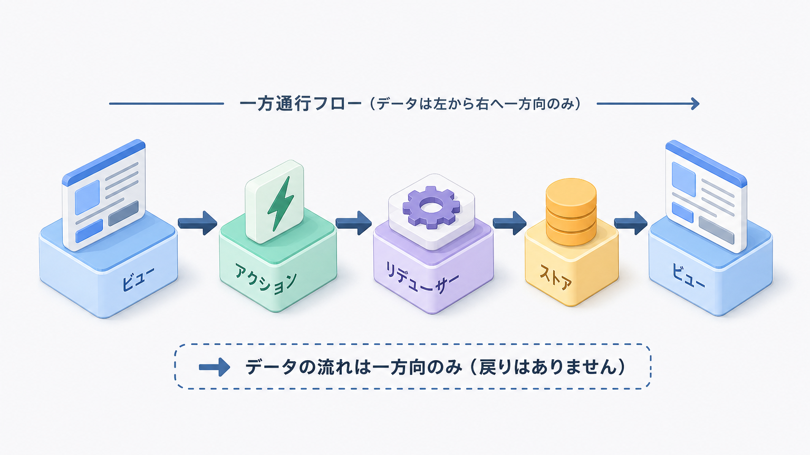

#### メリット / デメリット

**メリット**
- 状態変更が 1 箇所（Reducer）に集約 → 追跡しやすい
- DevTools で操作履歴を遡れる

**デメリット**
- 小規模では冗長
- ボイラープレートが多い（Redux Toolkit で緩和）

#### 日常のたとえ ― 銀行 ATM の入金窓口

| たとえ話の物体 | 実設計での対応 | 役割 |
|---|---|---|
| 入金伝票 | Action | 「何を起こすか」を表す指示書 |
| 窓口担当者 | Reducer | 伝票を処理して通帳を更新 |
| 通帳 | Store | 現在の残高を保持 |
| ATM 画面 | View | 通帳の最新残高を表示 |

伝票（Action）は必ず窓口（Reducer）を通って通帳（Store）に記帳される。**お金の流れが完全に追える**。

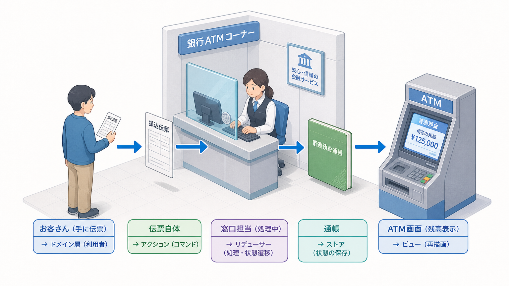

#### コード例（TypeScript）

```typescript
import { createStore } from "redux";

// === Action: dispatch するデータ ===
type Action = { type: "INC" } | { type: "DEC" };

// === State 型 ===
type State = { count: number };

// === Reducer: (state, action) -> new state ===
const reducer = (state: State = { count: 0 }, action: Action): State => {
  switch (action.type) {
    case "INC": return { count: state.count + 1 };
    case "DEC": return { count: state.count - 1 };
    default:    return state;
  }
};

const store = createStore(reducer);
store.subscribe(() => console.log(store.getState()));
store.dispatch({ type: "INC" }); // { count: 1 }
```

---

## 3. 分散系アーキテクチャ

> **章の位置づけ**: 1〜2 章は「1 つのアプリ」の中の話。本章はアプリを **複数に分割するか、1 つに集めるか** の選択を扱う。

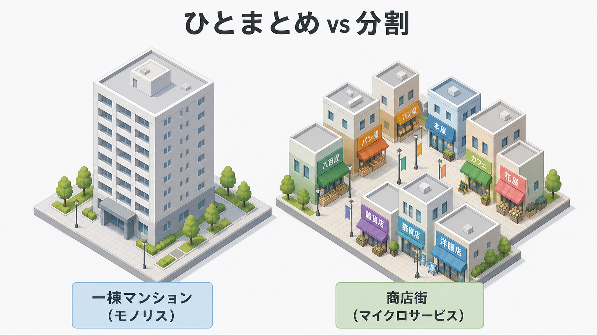

### 3.1 Monolithic Architecture

#### 目的と使いどころ

**1 つのアプリ／プロセスにすべての機能を詰め込む** 最も素朴な構成。

**使いどころ**: スタートアップ初期、PoC、小規模チーム。「分散する前に動くものを作る」の出発点。

#### 構造イメージ

1 つのプロセスに User / Order / Payment / Notification 等の機能ブロックが同居。DB も共有。

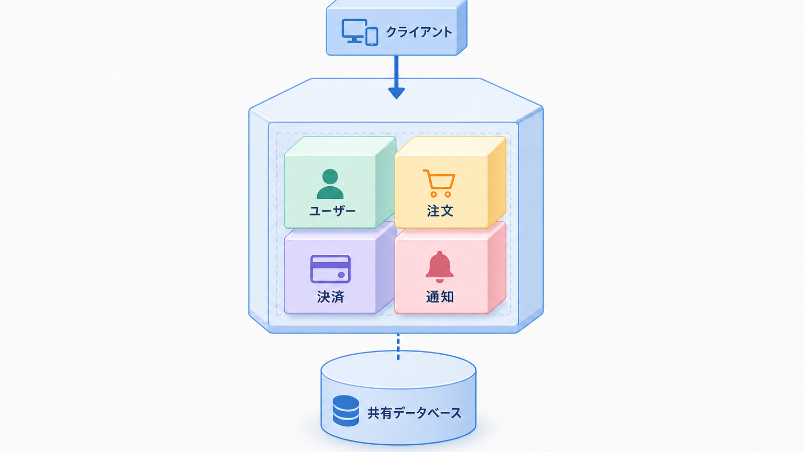

#### メリット / デメリット

**メリット**
- 開発・デプロイがシンプル（1 箇所更新で完結）
- 内部関数呼び出しなので高速

**デメリット**
- 1 機能の障害が全体停止
- 一部だけスケールアップできない

#### 日常のたとえ ― タワーマンション

| たとえ話の物体 | 実設計での対応 | 役割 |
|---|---|---|
| マンション全体 | Monolith Process | 全機能を含む 1 つの建物 |
| 各階（住居・コンビニ・ジム） | 各機能モジュール | User / Order / Billing 等 |
| 共有のエレベーター | 内部関数呼び出し | 機能間連携が高速 |
| 共有の電源・水道 | 共有 DB | 単一のデータ基盤 |

便利だがエレベーター（共有基盤）が止まると全員困る。

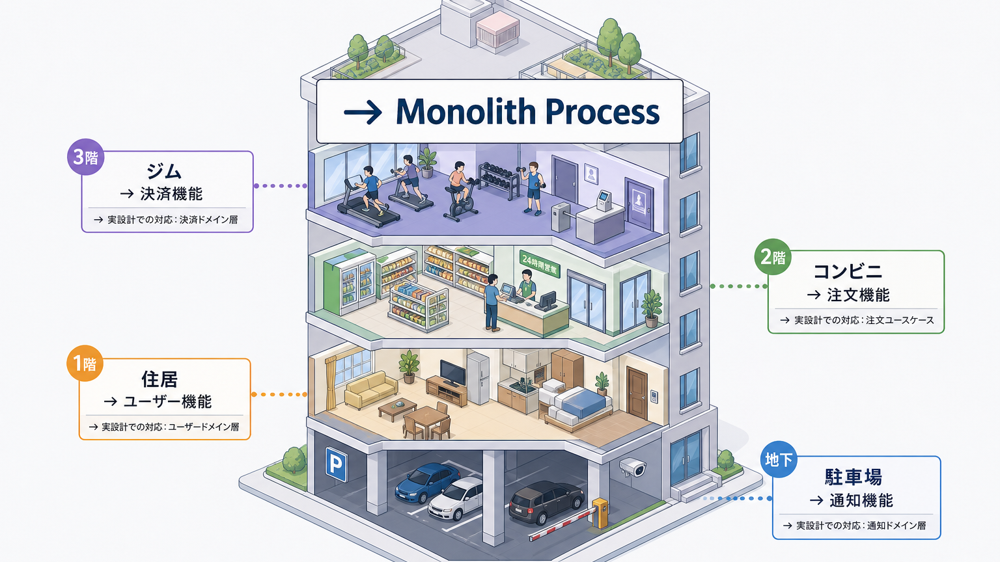

#### コード例（TypeScript）

```typescript
import express from "express";

const app = express();

// すべての機能を 1 つの app に
app.get("/users",  usersHandler);
app.get("/orders", ordersHandler);
app.get("/billing", billingHandler);
app.post("/notifications", notificationsHandler);

app.listen(3000);
```

---

### 3.2 Modular Monolith

#### 目的と使いどころ

単一プロセスのまま、**内部を明確なモジュール境界に分割** する。

**使いどころ**: マイクロサービスの運用コストはまだ払えないが、ドメイン境界は明確にしたい中規模プロダクト。マイクロサービス化への準備段階。

> Monolith との違い: Monolith は内部もごちゃっと。Modular Monolith は内部でモジュールを明確に分離し、モジュール間は公開 API でのみ通信する。

#### 構造イメージ

1 つの外枠の中で内部モジュールが明確に分離。各モジュールは独自のスキーマを持つ。

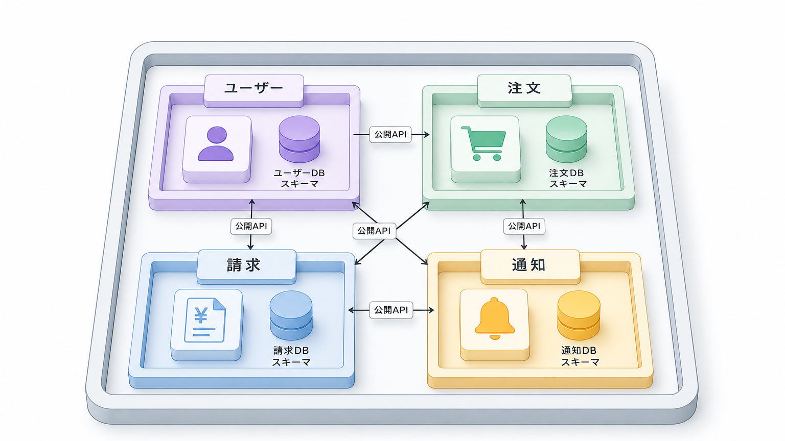

#### メリット / デメリット

**メリット**
- 単一プロセスの簡便さを維持しつつモジュール分離
- マイクロサービス化が容易

**デメリット**
- 境界を破ってモジュール直参照する誘惑が常にある
- 規律をチームで守る必要

#### 日常のたとえ ― シェアハウス

| たとえ話の物体 | 実設計での対応 | 役割 |
|---|---|---|
| 1 棟の家 | 単一プロセス | 物理的には 1 つ |
| 鍵付きの個室 | 各モジュール（境界） | 内部は独立 |
| 共用キッチン | 共通基盤（DB スキーマ間の連携） | 必要最小限の共有 |
| ハウスルール | 公開 API 規約 | モジュール越境ルール |

部屋（モジュール）には他の住人は入れない。共用スペース（公開 API）のみで交流。

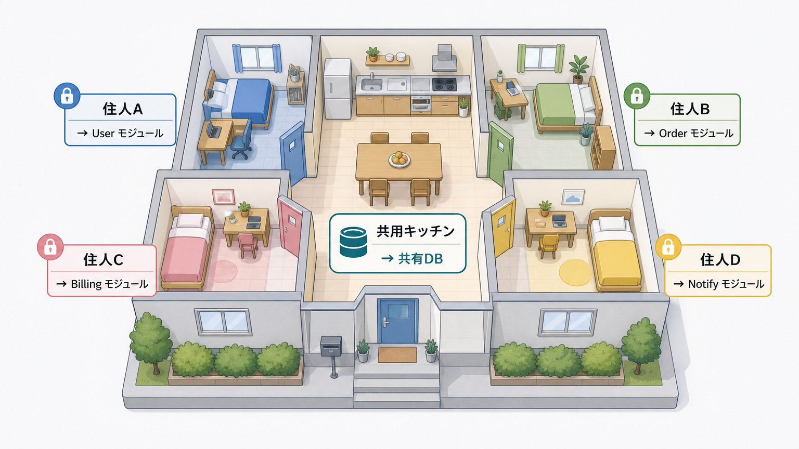

#### コード例（TypeScript）

```typescript
// === modules/user/index.ts: User モジュールの公開 API ===
export const UserModule = {
  findById: async (id: string) => userRepo.find(id),
};
// (userRepo は user モジュール内部の private)

// === modules/order/index.ts: Order モジュール ===
import { UserModule } from "../user";  // 公開 API 経由のみ
export const OrderModule = {
  async placeOrder(userId: string, items: Item[]) {
    const user = await UserModule.findById(userId); // 内部関数だが境界尊重
    if (!user) throw new Error("ユーザー不在");
    // ... order 作成
  },
};
```

---

### 3.3 Microservices

#### 目的と使いどころ

機能ごとに **独立したサービス** として **別プロセスでデプロイ**。サービス間は HTTP / gRPC で通信。

**使いどころ**: 大規模組織、複数チーム並走、Netflix・Amazon クラスの可用性要件。

> Modular Monolith との違い: Modular Monolith は同一プロセス内のモジュール。Microservices は **別プロセス・別サーバー・別 DB**。

#### 構造イメージ

各サービスが独立プロセス。間にメッセージブローカや API Gateway を置く。

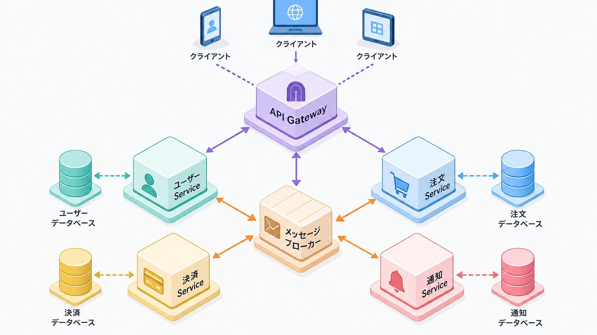

#### メリット / デメリット

**メリット**
- 独立スケール（売れ筋サービスだけ大きくできる）
- 障害局所化／独立デプロイ
- 技術選択の自由（チームごとに別言語可）

**デメリット**
- ネットワーク通信が複雑（タイムアウト・リトライ・整合性）
- 運用負荷が増大（ログ集約・分散トレーシング必須）

#### 日常のたとえ ― 商店街

| たとえ話の物体 | 実設計での対応 | 役割 |
|---|---|---|
| 商店街全体 | システム全体 | 各店舗の集合体 |
| 八百屋・肉屋・魚屋 | 個別サービス | 独立営業 |
| 各店主 | サービス担当チーム | 自分の店だけ管理 |
| 商店街の連絡網 | メッセージブローカー | 店舗間の通知 |

1 店閉店しても他は営業継続（障害局所化）。各店主は得意分野に集中。

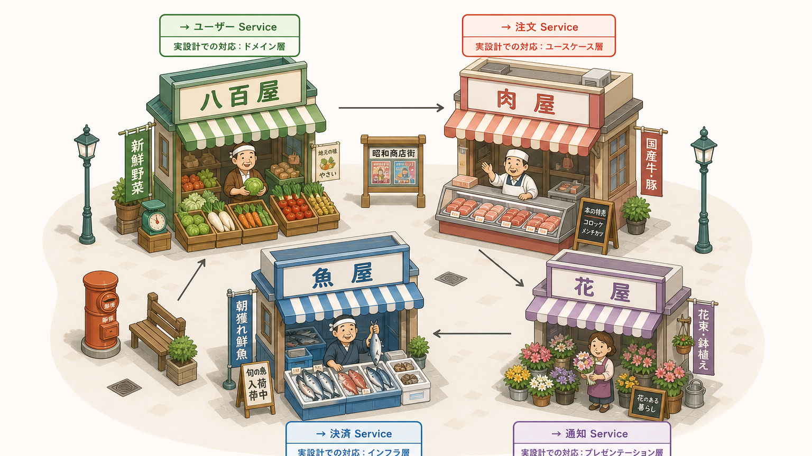

#### コード例（TypeScript）

```typescript
// === user-service/index.ts (プロセス 1) ===
app.get("/users/:id", async (req, res) => {
  res.json(await db.users.find(req.params.id));
});
// → http://user-service:3000 で起動

// === order-service/index.ts (プロセス 2、別 DB) ===
app.post("/orders", async (req, res) => {
  const userRes = await fetch(`http://user-service:3000/users/${req.body.userId}`);
  if (!userRes.ok) return res.status(400).json({ error: "ユーザー不在" });
  const user = await userRes.json();
  // ... order 作成
  res.json({ orderId: "o-1" });
});
```

---

### 3.4 SOA (Service-Oriented Architecture)

#### 目的と使いどころ

Microservices の **ご先祖様**。中央に **ESB (Enterprise Service Bus)** を置いて企業全体のシステムを統合。

**使いどころ**: 異なるベンダー製の業務システム（CRM / ERP / 人事）を統合したい大企業 IT。

> Microservices との違い: SOA は ESB を中心とした重厚な統合。Microservices は軽量プロトコル（HTTP/gRPC）の疎結合連携。

#### 構造イメージ

中央に ESB。CRM・ERP・人事システム・請求が ESB を介して相互連携。

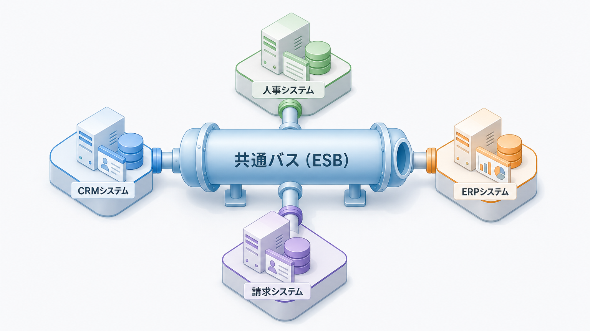

#### メリット / デメリット

**メリット**
- 異なる技術スタックの業務システムを統合できる
- 共通 ESB で標準化が進む

**デメリット**
- ESB がボトルネック／単一障害点
- マイクロサービスより重厚

#### 日常のたとえ ― 巨大ショッピングモール

| たとえ話の物体 | 実設計での対応 | 役割 |
|---|---|---|
| モール全体 | エンタープライズ全体 | 統合システム |
| 各テナント（服屋・家電・書店） | 業務システム | CRM / ERP / 在庫 等 |
| 館内放送・共通 Wi-Fi | ESB | テナント間の共通通信路 |
| ポイントカード制度 | 共通契約・規約 | データ標準化 |

各テナントは独立だが、共通インフラ（ESB）で統合される。

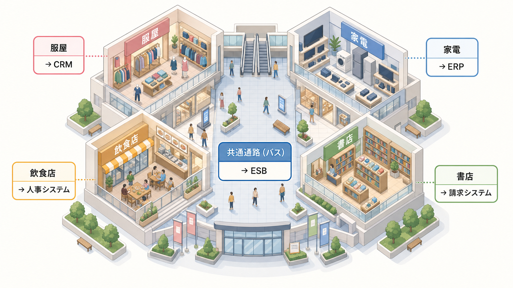

#### コード例（TypeScript）

```typescript
import { ServiceBus } from "enterprise-bus";

const bus = new ServiceBus();

// === Order System: 注文発生を ESB に発信 ===
await bus.publish("order.created", { orderId: "123", userId: "u1" });

// === Inventory System (別サービス): ESB の topic を購読 ===
bus.subscribe("order.created", async (event) => {
  await inventoryService.reserve(event.orderId);
});

// === Billing System: 同じ topic を別の視点で購読 ===
bus.subscribe("order.created", async (event) => {
  await billingService.issueInvoice(event.orderId);
});
```

---

### 3.5 Event-Driven Architecture

#### 目的と使いどころ

**イベントの発行 / 購読** で疎結合に通信。発信側は受信側を知らなくていい。

**使いどころ**: リアルタイム通知、IoT、複数システム連携。CQRS / Event Sourcing の基盤としても。

> SOA との違い: SOA は同期 RPC 中心。Event-Driven は **非同期メッセージ** が主役。受信側が反応するかどうかは受信側次第。

#### 構造イメージ

中央のイベントバス（Kafka / SNS / SQS）から複数の購読者へ放射状にイベントが配信される。

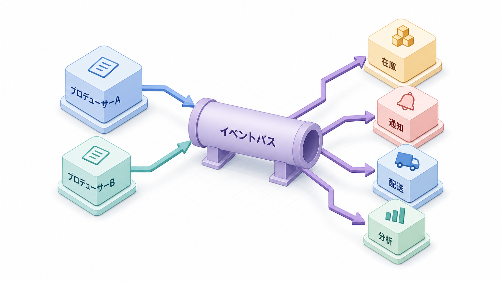

#### メリット / デメリット

**メリット**
- 疎結合：受信側を後から追加できる
- 非同期スケールしやすい

**デメリット**
- イベント順序保証・重複処理が難しい
- 全体フローが追いづらい

#### 日常のたとえ ― 駅構内放送

| たとえ話の物体 | 実設計での対応 | 役割 |
|---|---|---|
| 駅員のアナウンス | イベント発行（Producer） | 「3 番線発車」と放送 |
| スピーカー | イベントバス（Kafka 等） | 全員に届ける |
| 走り出す乗客 | 在庫サービス | イベントに反応して動く |
| 改札に向かう乗客 | 通知サービス | 別の動きで反応 |
| 無視する乗客 | 関係ないサービス | 反応しなくてもいい |

駅員（発信側）は誰が反応するか知らない。乗客（受信側）が自分の判断で動く。

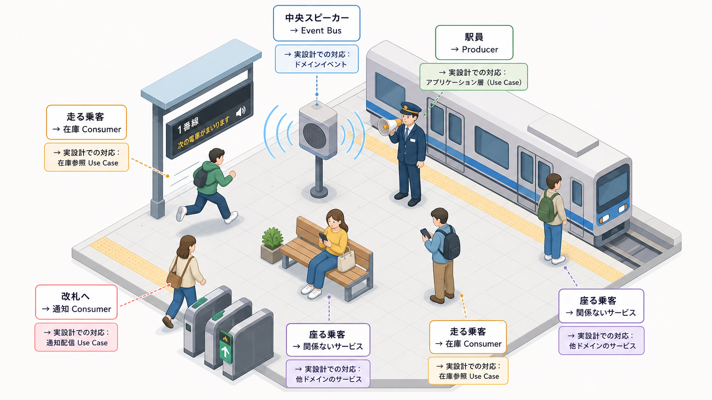

#### コード例（TypeScript）

```typescript
import { Kafka } from "kafkajs";

const kafka = new Kafka({ brokers: ["localhost:9092"] });

// === Producer: イベント発信 ===
const producer = kafka.producer();
await producer.connect();
await producer.send({
  topic: "order.created",
  messages: [{ value: JSON.stringify({ orderId: "123", total: 5000 }) }],
});

// === Consumer (別プロセス): topic を購読して反応 ===
const consumer = kafka.consumer({ groupId: "inventory" });
await consumer.connect();
await consumer.subscribe({ topic: "order.created" });
await consumer.run({
  eachMessage: async ({ message }) => {
    const event = JSON.parse(message.value!.toString());
    await reserveInventory(event.orderId);
  },
});
```

---

### 3.6 Serverless Architecture

#### 目的と使いどころ

FaaS (Function as a Service) と BaaS を組み合わせ、**サーバ管理を完全に外部化**。リクエストが来た瞬間だけ関数が起動する。

**使いどころ**: トラフィックが時間帯で変動するシステム、イベント駆動の小タスク、PoC。

#### 構造イメージ

クライアント → CDN/Edge → API Gateway → Function (短命プロセス) → Managed DB / Storage。

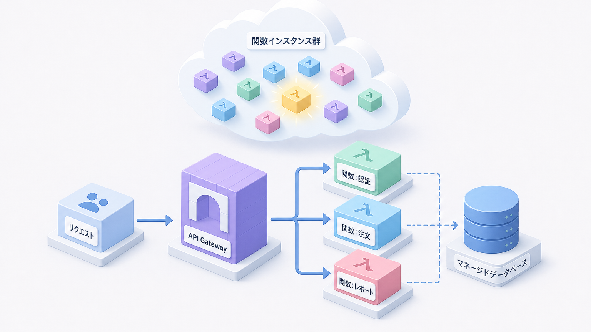

#### メリット / デメリット

**メリット**
- 運用ゼロ、使った分だけ課金
- 自動スケール

**デメリット**
- コールドスタートで初回応答が遅い
- ベンダーロック（Lambda 専用記法など）

#### 日常のたとえ ― 呼ばれた時だけ来るバイト

| たとえ話の物体 | 実設計での対応 | 役割 |
|---|---|---|
| 普段の店内（無人） | 関数が停止中 | コスト ゼロ |
| 客が入った瞬間 | リクエスト到着 | トリガー |
| 出てくるバイト店員 | Function インスタンス | 短時間だけ起動 |
| 接客後すぐ帰る | 関数終了 | 状態を持たない |

普段はシフトゼロ、客が来た瞬間だけ呼ばれて作業して帰る。**雇用主のサーバ管理ゼロ**。

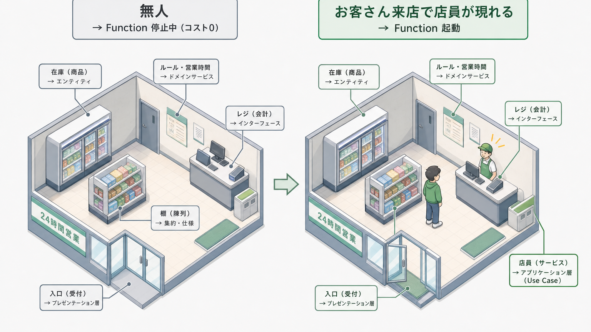

#### コード例（TypeScript）

```typescript
// === Vercel Functions (Next.js App Router) ===
import type { NextRequest } from "next/server";

export async function POST(req: NextRequest) {
  const body = await req.json();
  // ↓ リクエストが来た瞬間に起動 → 処理 → 終了
  const result = await processOrder(body);
  return Response.json({ ok: true, result });
}
```

---

### 3.7 BFF (Backend for Frontend)

#### 目的と使いどころ

クライアント (Web / iOS / Android) ごとに **専用の API レイヤ** を置き、UI に最適化したレスポンスを返す。

**使いどころ**: マルチプラットフォーム展開で、各クライアントの要件が大きく異なるプロダクト。

> 通常の API との違い: 単一の汎用 API は全クライアントに同じレスポンスを返すので、モバイル等で不要データが多い。BFF は **クライアント別に最適化**。

#### 構造イメージ

各クライアントが自分専用の BFF にだけアクセス、BFF が複数のバックエンドサービスを集約。

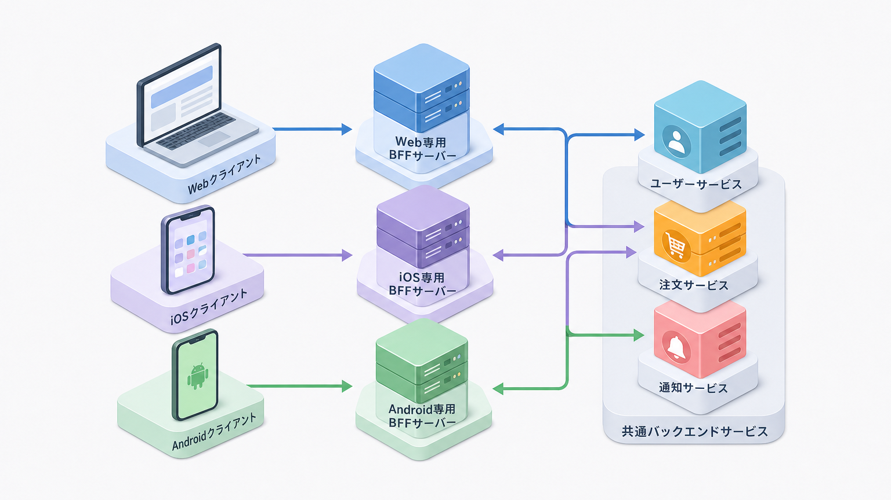

#### メリット / デメリット

**メリット**
- クライアント別最適化（モバイルでオーバーフェッチ回避）
- フロント担当者が自分の BFF を所有できる

**デメリット**
- BFF が増えるとメンテ負荷増
- ロジックが BFF に染み込みやすい

#### 日常のたとえ ― 国際会議の同時通訳

| たとえ話の物体 | 実設計での対応 | 役割 |
|---|---|---|
| 中央演説者 | バックエンドサービス群 | 共通の情報源 |
| 日本語通訳ブース | BFF Web | Web 向けに最適化 |
| 英語通訳ブース | BFF iOS | iOS 向けに最適化 |
| 仏語通訳ブース | BFF Android | Android 向けに最適化 |
| 各国代表団 | クライアントアプリ | 自国通訳経由でだけ受け取る |

中央の話者は 1 人だが、各言語向けに最適化された形で届く。

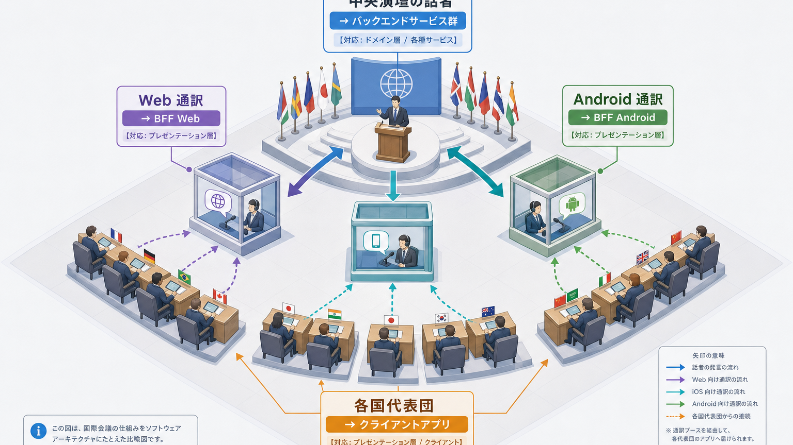

#### コード例（TypeScript）

```typescript
// === bff-web/api/dashboard.ts: Web 専用集約 ===
export async function GET(req: Request) {
  const uid = getUserId(req);
  const [user, orders, notifs] = await Promise.all([
    userSvc.get(uid),
    orderSvc.listRecent(uid, 5),
    notifSvc.unreadCount(uid),
  ]);
  // Web 用に必要な形に整形して返す
  return Response.json({
    welcomeName: user.name,
    recentOrders: orders.map((o) => ({ id: o.id, label: o.name })),
    unread: notifs,
  });
}
```

---

### 3.8 Space-Based Architecture

#### 目的と使いどころ

DB のボトルネック回避のため、**メモリ上のデータグリッド** を中心に水平スケール。永続化は非同期。

**使いどころ**: チケット販売、オンラインゲーム、株式取引など瞬間的に高 TPS（毎秒トランザクション）が要求されるシステム。

#### 構造イメージ

複数の Processing Unit がそれぞれ In-Memory Data Grid を持ち、相互同期。永続化は非同期に DB へ。

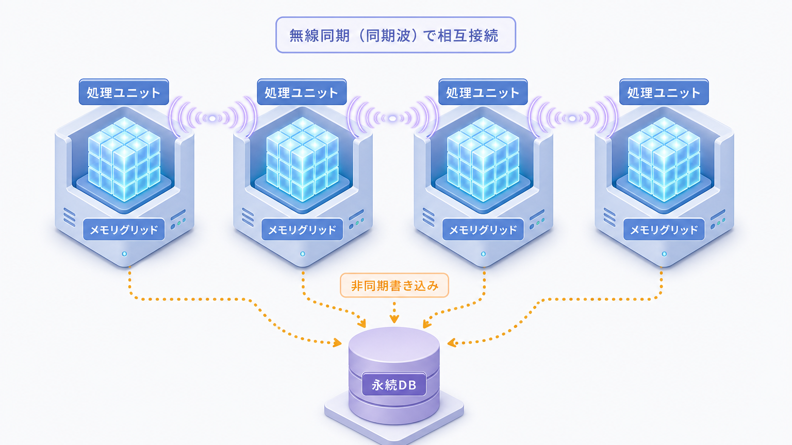

#### メリット / デメリット

**メリット**
- DB がボトルネックにならない
- 水平スケールで高スループット

**デメリット**
- メモリ整合性の制御が複雑
- 障害時にデータ消失リスク（永続化遅延）

#### 日常のたとえ ― コンサートの入場ゲート

| たとえ話の物体 | 実設計での対応 | 役割 |
|---|---|---|
| 入場ゲート 1〜N | Processing Unit | 並列処理 |
| 各ゲートのタブレット | In-Memory Data Grid | メモリ上の参加者リスト |
| タブレット間の無線同期 | グリッド間レプリケーション | 状態を共有 |
| 後でサーバーに集約 | 非同期 DB 書き込み | 永続化 |

ゲートごとに DB 照会していたら長蛇の列。**手元のリストで即判定** → 後で集約。

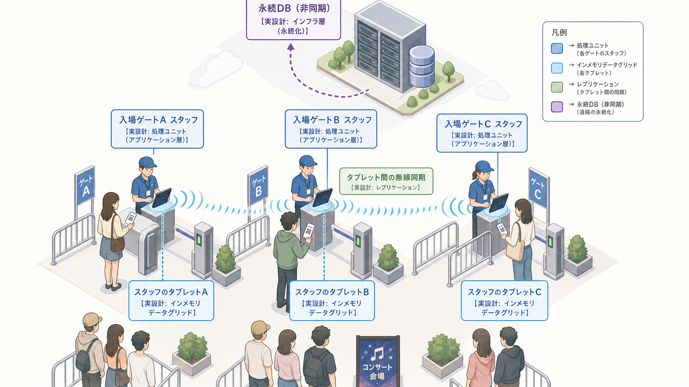

#### コード例（TypeScript）

```typescript
import { createCluster } from "redis";

// === In-Memory Data Grid (Redis Cluster) ===
const cache = createCluster({ rootNodes: [/* ... */] });
await cache.connect();

// 高速 read/write はすべてメモリへ
await cache.set(`ticket:${id}`, JSON.stringify(ticket));
const ticket = JSON.parse((await cache.get(`ticket:${id}`)) ?? "{}");

// 永続化は非同期キューへ
queueWriteToDb(ticket);
```

---

## 4. データ／DDD 系パターン

> **章の位置づけ**: 3 章までは「処理の並べ方」中心。本章は **データの扱い方／ドメインのモデリング** にズームインする。

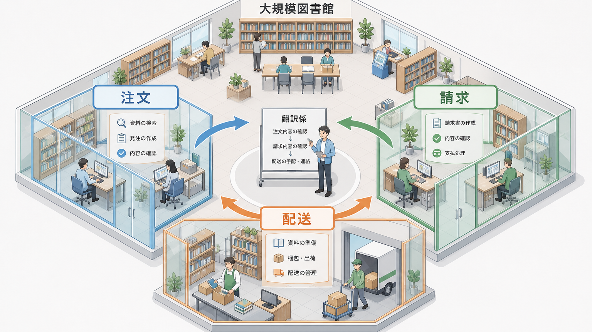

### 4.1 Repository Pattern

#### 目的と使いどころ

ドメイン層から **データアクセスを抽象化**。`UserRepository` のようなコレクション風 interface で「ユーザーを保存・取得」できる。

**使いどころ**: DB 実装を後から差し替える可能性があるシステム。テストでインメモリ実装を使いたい場合。Layered / Clean / Hexagonal すべてで使う基本部品。

#### 構造イメージ

UseCase は `IRepository` interface だけを知り、具体実装（SQL / InMemory / API）は外から注入。

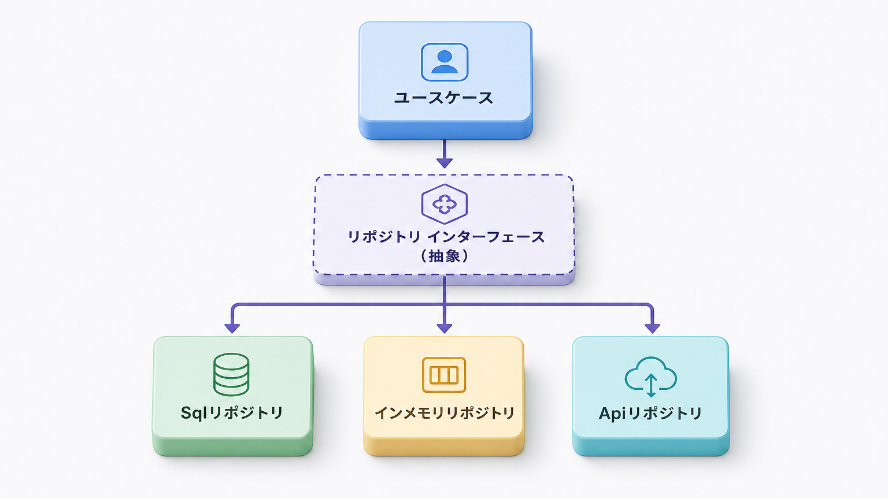

#### メリット / デメリット

**メリット**
- ドメイン層がインフラを知らない → 純粋に保てる
- テストでモック実装に差し替え可能

**デメリット**
- ORM 自体が既に Repository 的なら二重ラップになる

#### 日常のたとえ ― 図書館の司書

| たとえ話の物体 | 実設計での対応 | 役割 |
|---|---|---|
| 図書館の利用者 | ドメイン層 / UseCase | 「○○の本ありますか」と聞くだけ |
| カウンターの司書 | Repository interface | 窓口 |
| 地下書庫 | SQL 実装 (Postgres 等) | 大きなデータの本拠地 |
| 上階の特別資料室 | 外部 API 実装 | 別の保管場所 |
| 試験用簡易書架 | InMemory 実装 | テスト用ダミー |

利用者は本がどこにあるか知らない。司書経由でだけアクセスする。


#### コード例（TypeScript）

```typescript
// === Domain 層の interface ===
interface UserRepository {
  findById(id: string): Promise<User | null>;
  save(user: User): Promise<void>;
}

// === Infra: 本番実装 ===
class PrismaUserRepository implements UserRepository {
  async findById(id: string) {
    return prisma.user.findUnique({ where: { id } });
  }
  async save(user: User) {
    await prisma.user.upsert({
      where: { id: user.id },
      update: user,
      create: user,
    });
  }
}

// === テスト用実装 ===
class InMemoryUserRepository implements UserRepository {
  private store = new Map<string, User>();
  async findById(id: string) { return this.store.get(id) ?? null; }
  async save(user: User)     { this.store.set(user.id, user); }
}
```

---

### 4.2 CQRS (Command Query Responsibility Segregation)

#### 目的と使いどころ

**書き込み（Command）と読み出し（Query）を別モデル／別ストレージに分離** する。

**使いどころ**: 読み込みが書き込みの 10 倍以上、複雑な集計レポートが必要なシステム。

> 通常 CRUD との違い: CRUD は同じテーブルを read/write 両方使う。CQRS は **書き込み用の正規化テーブル** と **読み出し用の非正規化ビュー** を完全分離する。

#### 構造イメージ

Write 側は Domain Logic を通って Write DB へ。イベントを発射して Read 側に投影し、Read DB を更新。

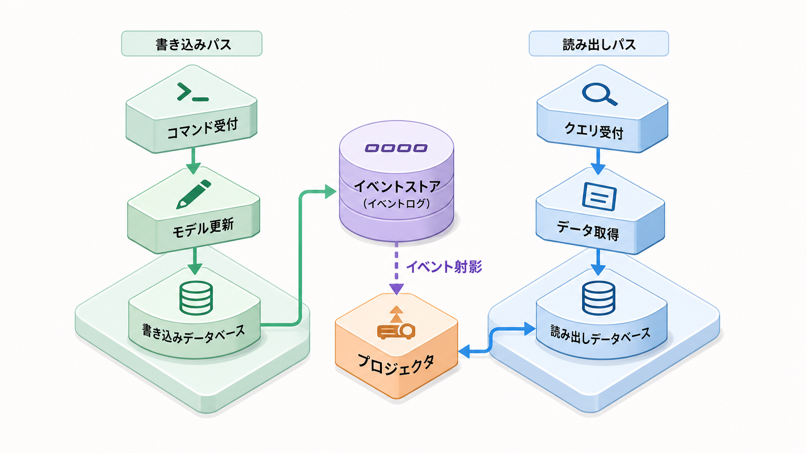

#### メリット / デメリット

**メリット**
- 読み書きを独立スケール可能
- 読み取りに特化した非正規化モデルで高速化

**デメリット**
- 結果整合性（Read が一瞬古い）を許容する必要
- 実装複雑度が増す

#### 日常のたとえ ― Amazon の倉庫

| たとえ話の物体 | 実設計での対応 | 役割 |
|---|---|---|
| 入荷口 | Command API | 書き込み専用入り口 |
| 入荷倉庫（仕分け前） | Write DB（正規化） | 書き込み最適 |
| 棚卸し作業 | Projector | 入荷情報を発送倉庫へ反映 |
| 発送倉庫（陳列済み） | Read DB（非正規化） | 読み取り最適 |
| 発送口 | Query API | 読み出し専用出口 |

入荷と発送が完全に別動線。**互いを邪魔しない**。

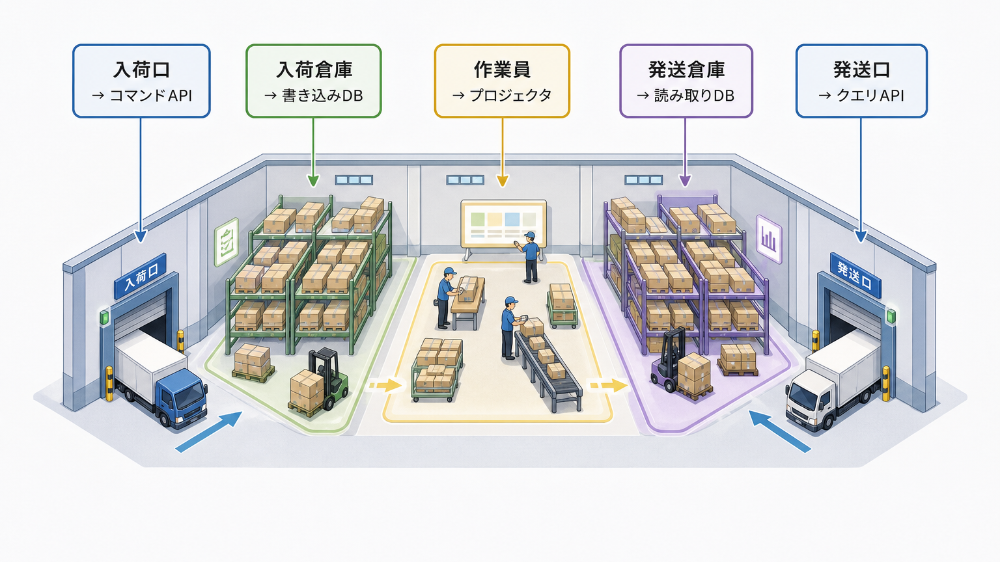

#### コード例（TypeScript）

```typescript
// === Write 側: ドメインロジック + Write DB ===
class OrderCommandHandler {
  async placeOrder(cmd: PlaceOrderCommand) {
    const order = Order.create(cmd);
    await writeDb.orders.insert(order);
    await eventBus.publish({ type: "OrderPlaced", payload: order });
  }
}

// === Projector: イベントを Read DB に投影 ===
eventBus.subscribe("OrderPlaced", async (e) => {
  await readDb.orders_view.upsert({
    orderId: e.payload.id,
    customerName: e.payload.customer.name, // 非正規化
    totalLabel: `¥${e.payload.total.toLocaleString()}`,
  });
});

// === Read 側: 非正規化ビューを読むだけ ===
class OrderQueryService {
  async listByUser(userId: string) {
    return readDb.orders_view.find({ userId });
  }
}
```

---

### 4.3 Event Sourcing

#### 目的と使いどころ

状態そのものを保存せず、**状態変化を「イベントの列」として保存**。任意時点の状態は replay で復元可能。

**使いどころ**: 金融、会計、規制対応、強い監査要件があるシステム。

> 通常 CRUD との違い: CRUD は「最新の残高」だけ持つ。Event Sourcing は「+5 万入金、-2 万出金、+7 万入金…」と取引履歴を全部残す。

#### 構造イメージ

Command → Aggregate → Event Store（時系列のイベント列）→ Projection で読み取り用ビュー生成。

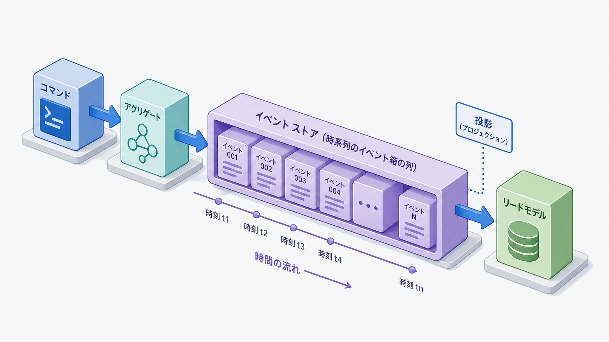

#### メリット / デメリット

**メリット**
- 完全な監査ログ（誰がいつ何をしたか）
- タイムトラベル（任意時点の状態を復元）

**デメリット**
- スキーマ進化が難しい（過去イベント形式も保持）
- 学習コスト・実装コストが高い

#### 日常のたとえ ― 銀行の通帳

| たとえ話の物体 | 実設計での対応 | 役割 |
|---|---|---|
| 通帳の各行（取引履歴） | Event | 状態変化の記録 |
| 通帳全体 | Event Store | 履歴の保管庫 |
| 「現在残高」（最後のページ） | Projection / 集約結果 | replay で導出 |
| 電卓で過去残高を計算 | Replay 処理 | 任意時点の状態復元 |

残高（最新状態）を保存しない。履歴さえあれば残高は計算できる。

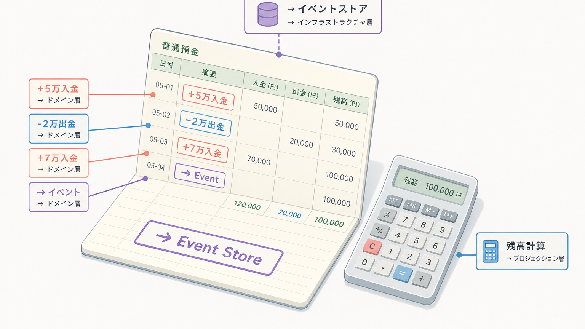

#### コード例（TypeScript）

```typescript
// === Event: 状態変化を表す不変データ ===
type Event =
  | { type: "AccountOpened"; userId: string; at: string }
  | { type: "Deposited";     amount: number; at: string }
  | { type: "Withdrawn";     amount: number; at: string };

// === Event Store: 追記のみのログ ===
const eventStore: Event[] = [];

// === Projection: 履歴から状態を再生 ===
const balance = (events: Event[]): number =>
  events.reduce((b, e) => {
    if (e.type === "Deposited") return b + e.amount;
    if (e.type === "Withdrawn") return b - e.amount;
    return b;
  }, 0);

// 任意時点 (at = "2026-04-01T00:00") の残高も復元できる
const at = "2026-04-01T00:00:00Z";
const past = eventStore.filter((e) => e.at <= at);
console.log("過去残高:", balance(past));
```

---

### 4.4 DDD (Domain-Driven Design)

#### 目的と使いどころ

ドメインモデルを中心にコードを構造化し、**Bounded Context（境界づけられたコンテキスト：1 つの言葉が 1 つの意味を持つ領域）** で大規模システムを分割。

**使いどころ**: ドメインが複雑で、ビジネス専門家との会話と実装を一致させたい大規模システム。

#### 構造イメージ

複数の Bounded Context（注文・請求・配送等）が独立し、ACL（後述 5.5）や Event でゆるく連携。

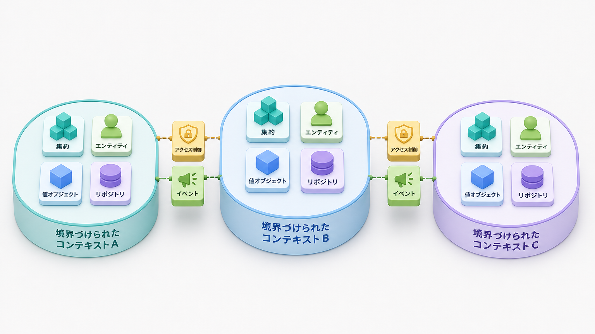

#### メリット / デメリット

**メリット**
- 業務とコードが一致する（変更時に話が早い）
- 大規模システムを認知負荷低く分割できる

**デメリット**
- 学習コストが高い（Aggregate / VO / Entity 等の用語）
- 過剰適用すると小さな業務にも重厚な構造を入れがち

#### 日常のたとえ ― 多国籍企業の会議

| たとえ話の物体 | 実設計での対応 | 役割 |
|---|---|---|
| 営業部の会議 | Bounded Context: Sales | 「顧客」 = 見込み客 |
| 経理部の会議 | Bounded Context: Billing | 「顧客」 = 請求先 |
| 法務部の会議 | Bounded Context: Legal | 「顧客」 = 契約相手 |
| 中央の翻訳係 | Anti-Corruption Layer | 部署間の用語変換 |
| 全部署で共通の社員 ID | 共有識別子（参照のみ） | 例: customer_id |

同じ「顧客」も部署ごとに意味が違う。**それぞれの言葉で別モデルを作り、翻訳係を間に置く**。

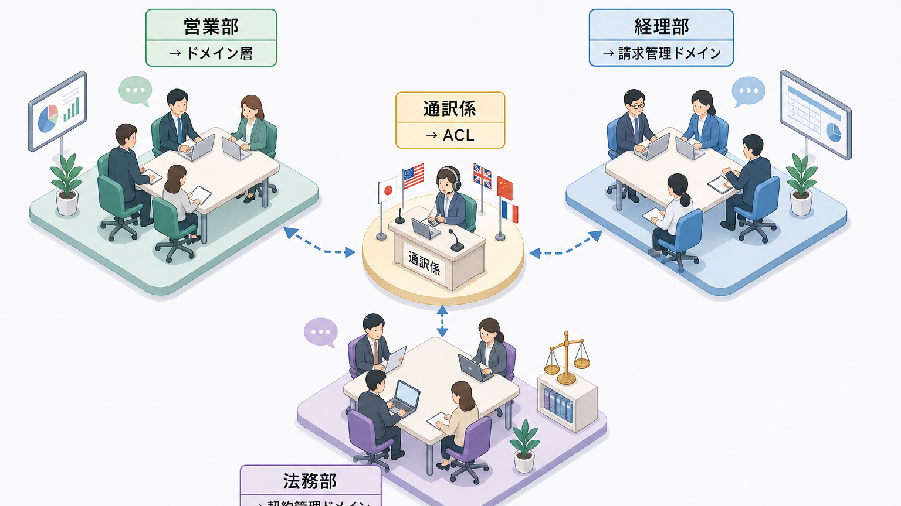

#### コード例（TypeScript）

```typescript
// === Value Object: 等値性は内容で決まる ===
class Money {
  constructor(public readonly amount: number, public readonly currency: "JPY" | "USD") {}
  add(other: Money): Money {
    if (this.currency !== other.currency) throw new Error("通貨不一致");
    return new Money(this.amount + other.amount, this.currency);
  }
}

// === Entity: 同じ ID なら同一とみなす ===
class Customer {
  constructor(public readonly id: string, public name: string) {}
}

// === Aggregate Root: 整合性の境界を持つ集約のルート ===
class Order {
  private items: OrderItem[] = [];
  private status: "draft" | "confirmed" = "draft";
  constructor(public readonly id: string, public readonly customerId: string) {}
  addItem(item: OrderItem) {
    if (this.status !== "draft") throw new Error("確定後は変更不可");
    this.items.push(item);
  }
  confirm() { this.status = "confirmed"; }
  total(): Money {
    return this.items.reduce(
      (acc, i) => acc.add(i.price),
      new Money(0, "JPY"),
    );
  }
}
```

---

## 5. 統合・移行パターン

> **章の位置づけ**: 複数のサービス／システムを **どう繋ぐか／どう置き換えるか** の章。

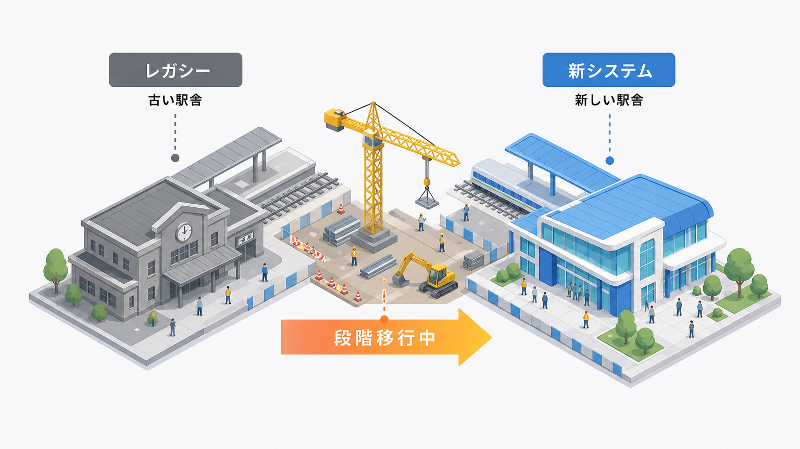

### 5.1 Saga Pattern

#### 目的と使いどころ

複数サービスにまたがる処理を **「ローカル Tx + 失敗時の補償処理」** の連鎖で実現する。マイクロサービスの分散トランザクション解。

**使いどころ**: 注文 → 決済 → 配送のように複数サービスを横断する処理で、途中失敗時にロールバックが必要なケース。

> 通常 DB Tx との違い: 単一 DB の Tx は 1 つの ROLLBACK で済む。Saga は **「各ステップに対応するキャンセル処理」** を自分で書く必要がある。

#### 構造イメージ

Tx1（注文）→ Tx2（決済）→ Tx3（配送） と順に進み、失敗時は逆順に補償。

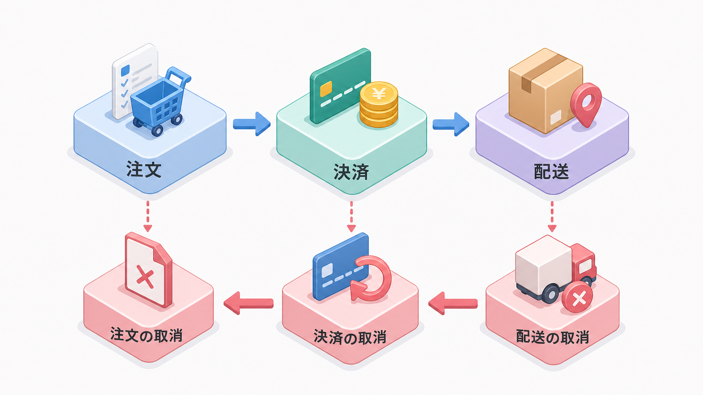

#### メリット / デメリット

**メリット**
- マイクロサービス間で整合性を担保
- 各サービスは自分の DB だけ意識すればよい

**デメリット**
- 補償処理の設計が難しい（冪等性必須）
- デバッグが大変

#### 日常のたとえ ― 旅行予約のキャンセル連鎖

| たとえ話の物体 | 実設計での対応 | 役割 |
|---|---|---|
| 航空券予約 | Local Tx 1 | サービス A の処理 |
| ホテル予約 | Local Tx 2 | サービス B の処理 |
| レンタカー予約（失敗） | Local Tx 3（NG） | サービス C の失敗 |
| ホテル予約のキャンセル | 補償処理 2 | Tx 2 を打ち消す |
| 航空券予約のキャンセル | 補償処理 1 | Tx 1 を打ち消す |

レンタカーが取れなければ、ホテル → 航空券と逆順にキャンセル。

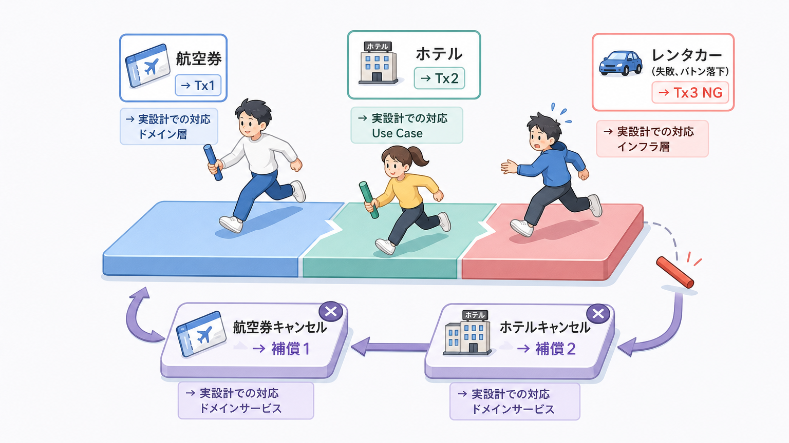

#### コード例（TypeScript）

```typescript
async function bookTrip(req: TripReq): Promise<string> {
  // Tx1: 航空券
  const flight = await flightSvc.book(req.flight);
  try {
    // Tx2: ホテル
    const hotel = await hotelSvc.book(req.hotel);
    try {
      // Tx3: レンタカー
      await carSvc.book(req.car);
      return "予約完了";
    } catch (e) {
      // Tx3 失敗 → Tx2 補償
      await hotelSvc.cancel(hotel.id);
      await flightSvc.cancel(flight.id); // Tx1 補償
      throw e;
    }
  } catch (e) {
    await flightSvc.cancel(flight.id); // Tx1 補償
    throw e;
  }
}
```

---

### 5.2 Strangler Fig Pattern

#### 目的と使いどころ

レガシーシステムを一気に置き換えず、**新システムで少しずつ「絞め殺す」ように段階移行**。

**使いどころ**: 既存システムが大きすぎてビッグバン移行できない、停止できないサービスをリプレースしたい場合。

> パターン名の由来: 「絞め殺し植物（Strangler Fig）」は熱帯の樹木で、宿主の木に巻きついて少しずつ覆い、最後に宿主が枯れる。レガシー置換に似ているため。

#### 構造イメージ

クライアント → Routing Proxy → 旧 (Legacy) と新 (Service A/B) に振り分け。旧は時間とともに縮小。

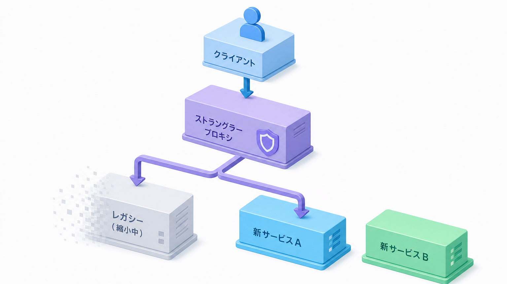

#### メリット / デメリット

**メリット**
- ダウンタイムなしで移行可能
- 部分ごとに検証しながら進められる

**デメリット**
- 新旧並走期間の運用負荷
- Routing 層が複雑化

#### 日常のたとえ ― 駅前再開発

| たとえ話の物体 | 実設計での対応 | 役割 |
|---|---|---|
| 古い駅ビル | レガシーシステム | 段階的に役目を終える |
| 新しい駅ビル | 新システム | 機能ごとに新装オープン |
| 連絡通路（Routing） | Strangler Proxy | 利用者を新旧に振り分け |
| テナント引越し（順次） | Feature flag | 段階移行 |
| 古い駅ビル解体 | Legacy 完全廃止 | 最終ゴール |

利用者から見ると駅機能は止まっていない。**新しい棟が建ちながら、古い棟が小さくなる**。

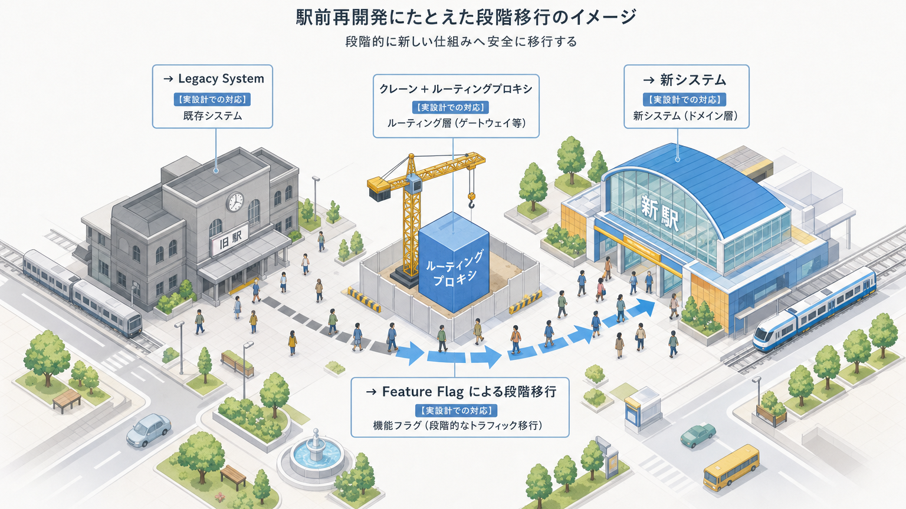

#### コード例（TypeScript）

```typescript
import { proxyTo } from "./proxy";

app.use("/api/v1/users", async (req, res) => {
  // Feature flag で振り分け
  if (await featureFlag.isOn("user-service-migrated", req)) {
    return proxyTo(newUserService, req, res); // 新
  }
  return proxyTo(legacyMonolith, req, res);   // 旧
});

// 段階的に featureFlag をユーザー 10% → 50% → 100% と上げていく
```

---

### 5.3 Sidecar Pattern

#### 目的と使いどころ

アプリ本体と並走する補助プロセスを同一 Pod に配置し、**横断的機能（ログ、認証、メトリクス）** を提供。Service Mesh（Istio 等）の基礎。

**使いどころ**: 複数サービスで共通の横断処理を、各言語・各実装に依存せず統一したい場合。

#### 構造イメージ

1 つの Pod 内に Main App と Sidecar (Envoy 等) が並ぶ。外部通信は Sidecar 経由。

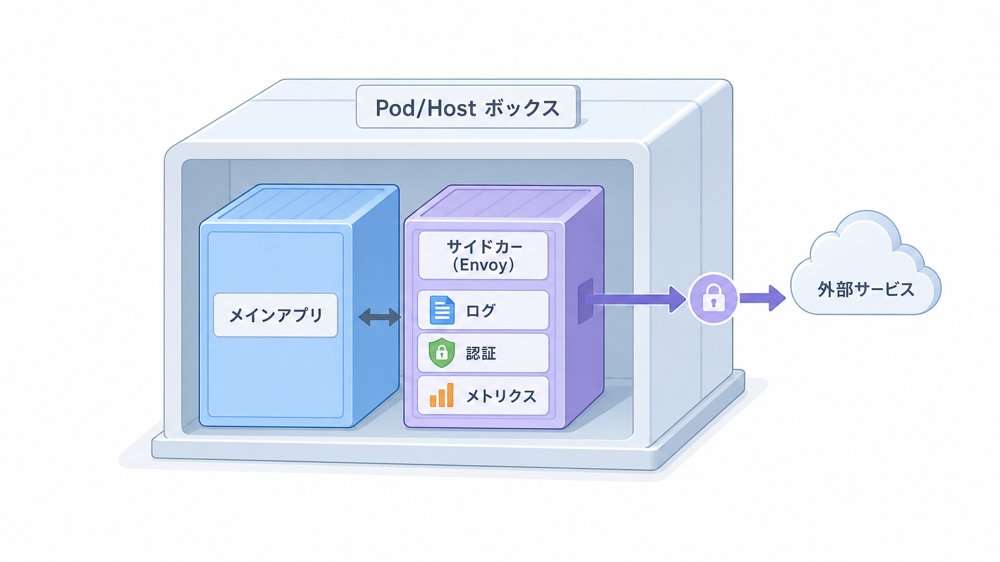

#### メリット / デメリット

**メリット**
- 横断的関心が言語非依存
- 本体コードに認証・ログを書かなくて済む

**デメリット**
- Pod の構成が複雑化
- パフォーマンスオーバーヘッドが少しある

#### 日常のたとえ ― バイクのサイドカー

| たとえ話の物体 | 実設計での対応 | 役割 |
|---|---|---|
| バイク本体 | Main App | 業務処理に集中 |
| サイドカー（横の補助席） | Sidecar (Envoy 等) | ログ・認証・監視 |
| 同じ車体フレーム | 同一 Pod / Host | ライフサイクル共有 |
| 道路への接続 | 外部ネットワーク | Sidecar が中継 |

本体は移動に集中、サイドカーが補助機能を専門に持つ。

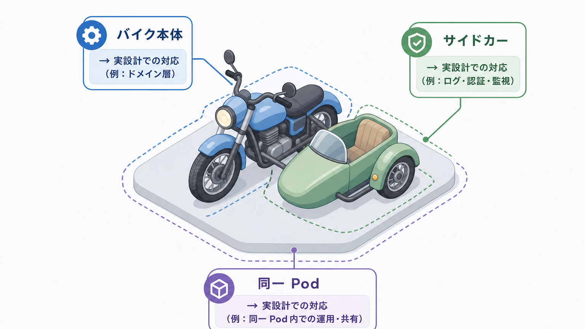

#### コード例（TypeScript）

```typescript
// === app/index.ts: ビジネスロジックのみ ===
app.get("/orders", async (_, res) => {
  res.json(await listOrders());
});
// 認証・ログ・メトリクスは一切書かない

// === docker-compose.yml (抜粋): 同一 Pod に Envoy を並走 ===
// services:
//   app:
//     image: my-app
//     ports: ["3000"]
//   envoy:                          # ← Sidecar
//     image: envoyproxy/envoy
//     network_mode: "service:app"   # 同じネットワーク
//     volumes: ["./envoy.yaml:/etc/envoy/envoy.yaml"]
```

---

### 5.4 Ambassador Pattern

#### 目的と使いどころ

クライアントの外部通信を **Ambassador プロキシ経由** にし、リトライ／サーキットブレーカ／監視を集約。

**使いどころ**: 外部 SaaS（決済、メール、地図 API）への依存が多く、失敗時の挙動を集中管理したい場合。

> Sidecar との違い: Sidecar は **入ってくる横断機能**（認証・ログ）担当。Ambassador は **出ていく外部呼び出し** の代理人。

#### 構造イメージ

App → Ambassador → External Service。Ambassador 内に retry / CB / 監視。

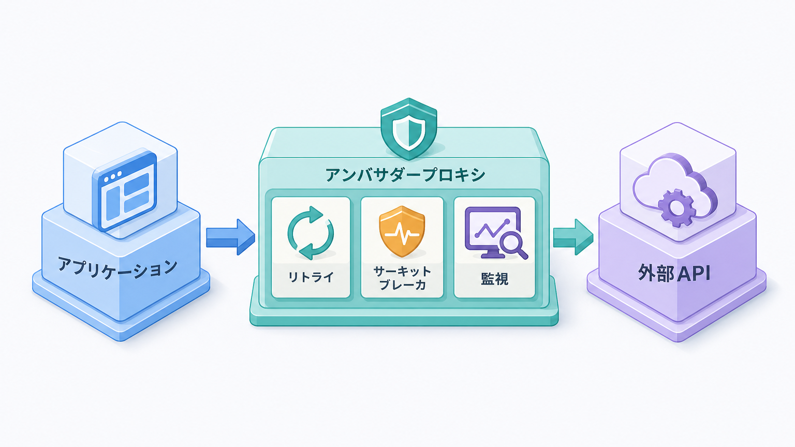

#### メリット / デメリット

**メリット**
- 外部依存を 1 箇所で制御
- リトライ・タイムアウト・CB を統一

**デメリット**
- Ambassador 自身が単一障害点になりうる

#### 日常のたとえ ― 大使館員

| たとえ話の物体 | 実設計での対応 | 役割 |
|---|---|---|
| 自国市民 | アプリケーション | 直接交渉しない |
| 大使館員 | Ambassador | 代理交渉・リトライ・記録 |
| 外国政府 | External API | 通信相手 |
| 大使館の本部マニュアル | リトライポリシー / CB | 統一ルール |

市民が直接外国政府と交渉せず、大使館員が代行。トラブル時の対応マニュアルも大使館が持つ。

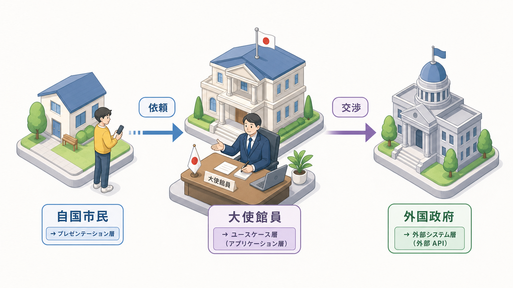

#### コード例（TypeScript）

```typescript
class StripeAmbassador {
  async charge(amount: number, currency: "JPY"): Promise<ChargeResult> {
    return retry(3, async () => {
      return circuitBreaker(() => stripe.charges.create({ amount, currency }));
    });
  }
}

// 業務コードは Ambassador だけ呼べばよい
const ambassador = new StripeAmbassador();
const result = await ambassador.charge(1000, "JPY");
```

---

### 5.5 Anti-Corruption Layer (ACL)

#### 目的と使いどころ

自ドメインと外部（レガシー／他社）ドメインの間に **翻訳層** を置き、**外部の概念汚染** を防ぐ。

**使いどころ**: レガシーシステムや他社 API の語彙が自ドメインに浸透しないよう、明確に境界を切るとき。

> 用語: "Anti-Corruption" = 「腐敗からの保護」。レガシーの古い概念で自ドメインのコードが「腐敗」しないように防御する。

#### 構造イメージ

自ドメイン（きれいなモデル）⇔ ACL ⇔ レガシー（古いモデル）。

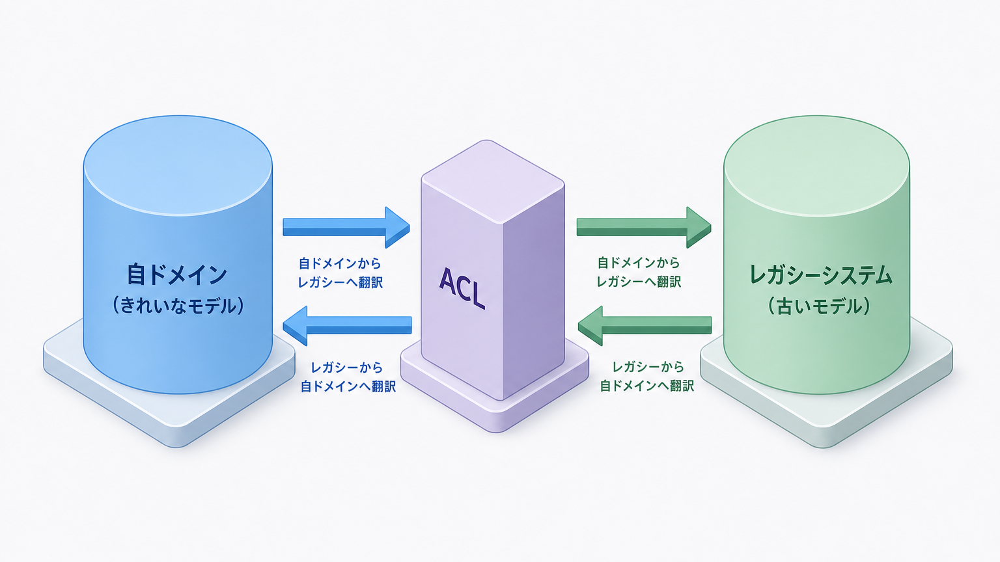

#### メリット / デメリット

**メリット**
- レガシーの呪いから自ドメインを守る
- 外部 API 変更時の影響を ACL で吸収

**デメリット**
- 翻訳コードのメンテが追加で必要

#### 日常のたとえ ― 海外駐在員（翻訳ガード）

| たとえ話の物体 | 実設計での対応 | 役割 |
|---|---|---|
| 日本本社のオフィス | 自ドメイン | きれいなドメインモデル |
| 駐在員（翻訳ガード） | ACL | 双方向の翻訳・防御 |
| 現地法人 | レガシーシステム | 古い／違う語彙 |
| 駐在員のレポート | 翻訳済みデータ | 本社用に整形済 |

現地の慣習をそのまま日本本社に持ち込ませない。駐在員が「日本本社が理解できる言葉」に翻訳。

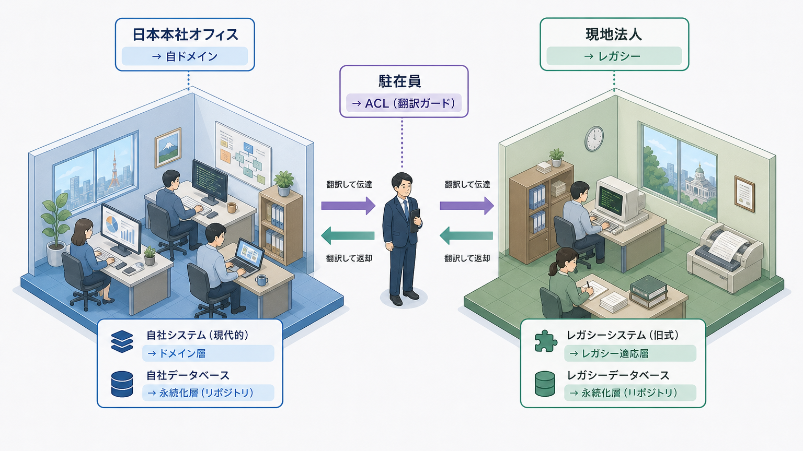

#### コード例（TypeScript）

```typescript
// === レガシーシステムのモデル（古い・触れたくない） ===
type LegacyUser = {
  user_id: string;
  user_name: string;
  flg: "0" | "1"; // "1" = 有効
};

// === 自ドメインのモデル（きれい） ===
type DomainUser = {
  id: string;
  name: string;
  isActive: boolean;
};

// === ACL: 双方向の翻訳 ===
const acl = {
  toDomain(l: LegacyUser): DomainUser {
    return { id: l.user_id, name: l.user_name, isActive: l.flg === "1" };
  },
  toLegacy(d: DomainUser): LegacyUser {
    return { user_id: d.id, user_name: d.name, flg: d.isActive ? "1" : "0" };
  },
};

// 自ドメインからは必ず acl.toDomain() 経由で取得
const user = acl.toDomain(await legacyApi.fetchUser("u1"));
```

---

### 5.6 API Gateway

#### 目的と使いどころ

マイクロサービスの **単一エントリポイント** として、認証・レート制限・ルーティング・レスポンス集約を担う。

**使いどころ**: 複数クライアントが複数サービスにアクセスするマイクロサービス構成で、横断ポリシーを一元化したい場合。

> BFF との違い: BFF は **クライアント別 API**。API Gateway は **全クライアント共通の入り口**。両者は併用できる（Client → API Gateway → BFF → Services）。

#### 構造イメージ

複数クライアント → API Gateway → 複数サービス。Gateway 内に認証・レート制限・ルーティング。

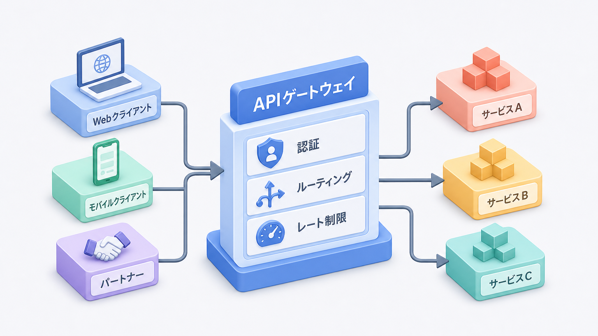

#### メリット / デメリット

**メリット**
- 認証・レート制限を集中管理
- クライアントは Gateway だけ知ればよい

**デメリット**
- Gateway がボトルネック／単一障害点
- Gateway 自体の運用が必要

#### 日常のたとえ ― オフィスビルの受付

| たとえ話の物体 | 実設計での対応 | 役割 |
|---|---|---|
| 来訪者 | クライアント (Web / Mobile / Partner) | アクセス元 |
| 受付カウンター | API Gateway | 単一入り口 |
| 入館証発行 | 認証 (JWT 検証等) | 認可 |
| 入館者数の制限 | レート制限 | 過剰アクセス防御 |
| 部署ごとの行先案内 | ルーティング | 適切なサービスへ |

各部署（サービス）が個別に来訪者対応せずに済む。

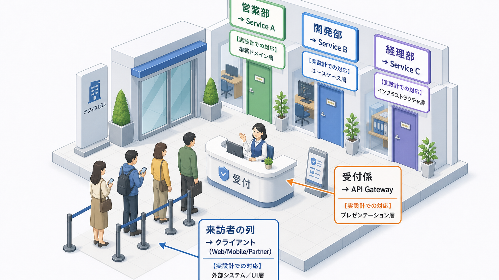

#### コード例（TypeScript）

```typescript
import express from "express";
import rateLimit from "express-rate-limit";
import { proxy } from "./lib/proxy";

const gateway = express();

// 全リクエスト共通
gateway.use(rateLimit({ max: 100, windowMs: 60_000 }));
gateway.use(authMiddleware);
gateway.use(logRequestMiddleware);

// ルーティング（各サービスへ proxy）
gateway.use("/users",   proxy("http://user-service:3001"));
gateway.use("/orders",  proxy("http://order-service:3002"));
gateway.use("/billing", proxy("http://billing-service:3003"));

gateway.listen(8080);
```

---

## 6. その他構造系パターン

> **章の位置づけ**: これまでに分類できない、特定領域で重要なパターン群。

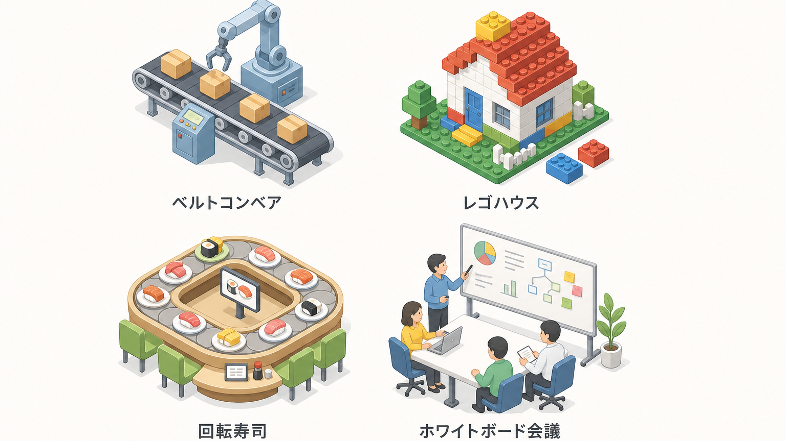

### 6.1 Pipe and Filter

#### 目的と使いどころ

データを連続するフィルタに流し込み、**各フィルタが入力を変換して次に渡す**。Unix パイプ思想。

**使いどころ**: ETL、コンパイラ、画像処理、ストリーミング処理、データ変換パイプライン。

#### 構造イメージ

Input → Filter1 → Filter2 → Filter3 → Output、と直列に変換。

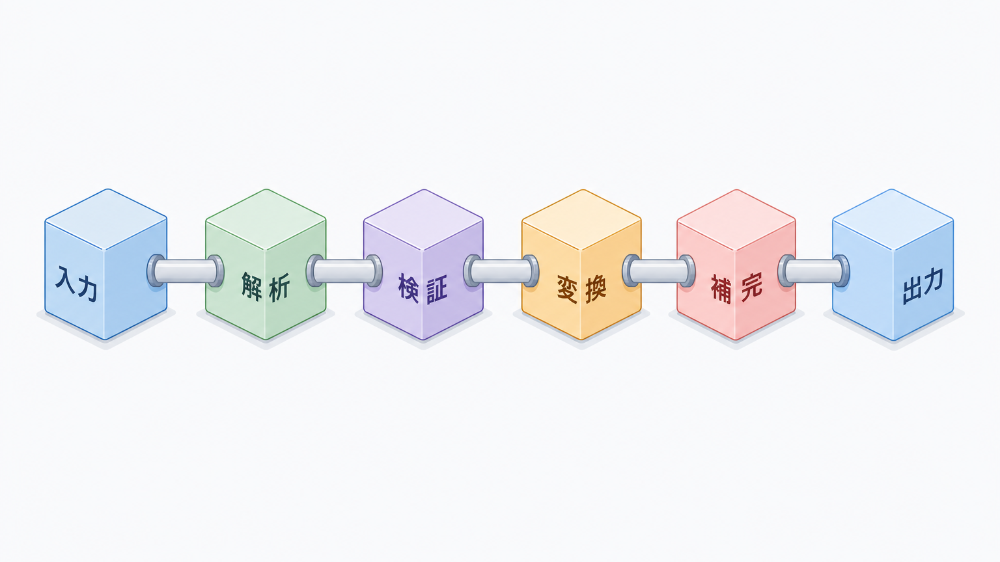

#### メリット / デメリット

**メリット**
- 各 Filter が独立してテスト可能
- 並列化／再利用しやすい

**デメリット**
- 共有状態を持たせにくい
- Filter 間のスキーマ整合性が課題

#### 日常のたとえ ― 回転寿司の調理ライン

| たとえ話の物体 | 実設計での対応 | 役割 |
|---|---|---|
| 米 | Input | 加工前のデータ |
| シャリ握り職人 | Filter 1 (Parse) | 第 1 段階加工 |
| ネタ載せ職人 | Filter 2 (Validate) | 第 2 段階加工 |
| わさび付け職人 | Filter 3 (Transform) | 第 3 段階加工 |
| ベルトコンベア | Pipe | 工程間の連結 |
| 完成寿司 | Output | 加工済データ |

各職人は前の工程しか知らない。

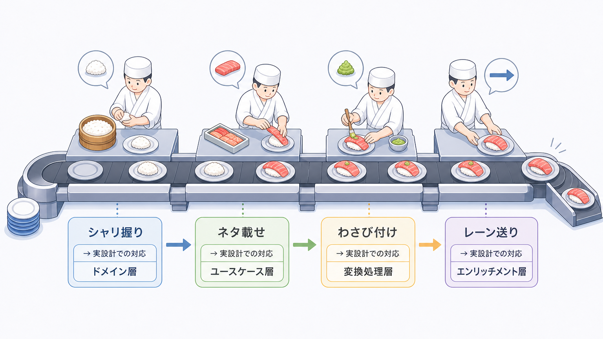

#### コード例（TypeScript）

```typescript
// === Pipe 関数: 関数合成で段階的変換 ===
const pipe =
  <T>(...fns: Array<(x: T) => T>) =>
  (input: T): T =>
    fns.reduce((acc, fn) => fn(acc), input);

// === 各 Filter ===
const parseCsv  = (raw: string): Row[] => /* CSV → 行配列 */ [];
const validate  = (rows: Row[]): Row[] => rows.filter(isValid);
const transform = (rows: Row[]): Domain[] => rows.map(toDomain);
const enrich    = (ds: Domain[]): EnrichedDomain[] => ds.map(addMeta);

// === Pipeline 構築 ===
const pipeline = pipe(parseCsv, validate, transform, enrich);
const result = pipeline(rawCsv);
```

---

### 6.2 Vertical Slice Architecture

#### 目的と使いどころ

技術レイヤで分割せず、**「機能 (Feature)」で縦に切る**。各機能内に Controller / Logic / Data がまとまる。

**使いどころ**: 機能追加が多く、レイヤ間の変更コストを減らしたいプロジェクト。CQRS + MediatR との相性◎。

> Layered との違い: Layered は「層」で水平分割。Vertical Slice は「機能」で垂直分割。

#### 構造イメージ

機能 A / B / C / D それぞれが Endpoint・Handler・Data を独立に持つ。

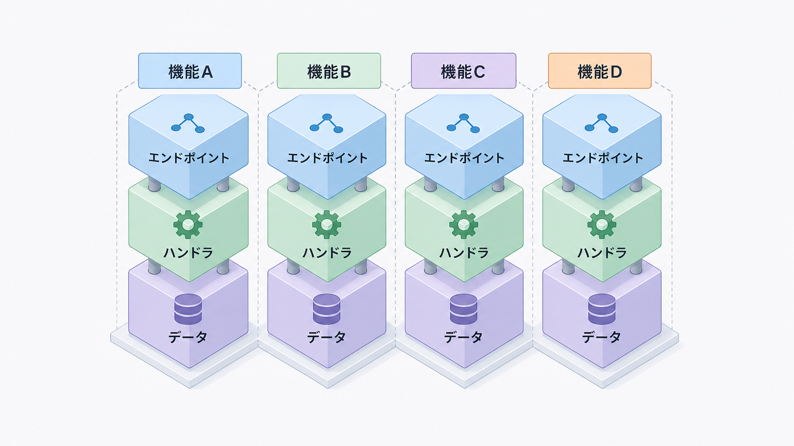

#### メリット / デメリット

**メリット**
- 機能追加が 1 箇所で完結
- 変更影響範囲が局所化

**デメリット**
- スライス間でコード重複しやすい
- 共通ロジック抽出のタイミング判断が難しい

#### 日常のたとえ ― ホールケーキの縦切り

| たとえ話の物体 | 実設計での対応 | 役割 |
|---|---|---|
| ホールケーキ全体 | アプリ全体 | 全機能集合 |
| 縦に切ったひと切れ | 1 つの Feature | 機能単位 |
| 切れ端のスポンジ層 | Endpoint / Controller | UI 層 |
| 切れ端のクリーム層 | Handler / Logic | 業務層 |
| 切れ端のチョコ層 | Data Access | データ層 |

縦に切ると、各皿に「スポンジ・クリーム・チョコ」が全部揃う。1 皿が 1 機能。

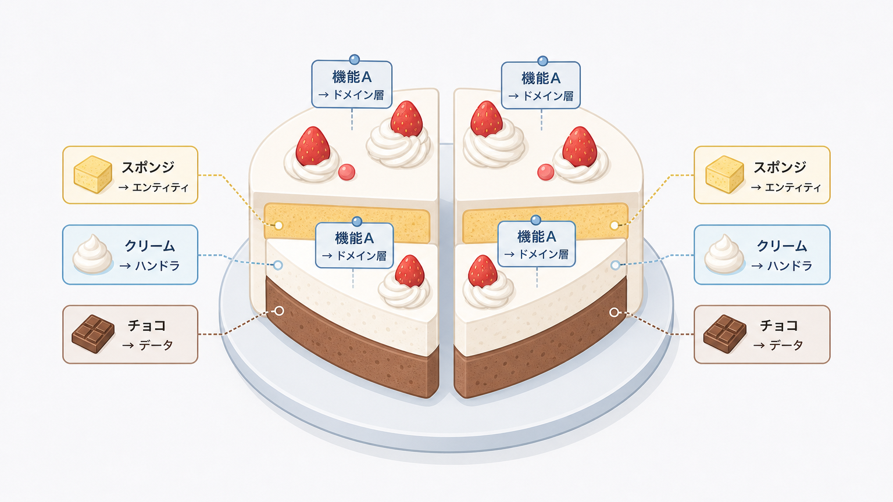

#### コード例（TypeScript）

```typescript
// === features/create-order/ ディレクトリに全部入り ===

// features/create-order/validation.ts
export const parseCreateOrder = (input: unknown) => /* zod parse */;

// features/create-order/repository.ts
export const createOrderInDb = async (data: CreateOrderInput) => /* prisma */;

// features/create-order/notify.ts
export const notifyCustomer = async (order: Order) => /* email */;

// features/create-order/handler.ts (← Endpoint)
import { parseCreateOrder } from "./validation";
import { createOrderInDb } from "./repository";
import { notifyCustomer } from "./notify";

export const createOrderHandler = async (req: Request) => {
  const body  = parseCreateOrder(await req.json());
  const order = await createOrderInDb(body);
  await notifyCustomer(order);
  return Response.json({ id: order.id });
};
```

---

### 6.3 Component-Based Architecture

#### 目的と使いどころ

UI または機能を **独立した再利用可能なコンポーネント** で構成。React / Vue / Web Components の基盤。

**使いどころ**: モダンな Web フロントエンド開発で標準採用。

#### 構造イメージ

App ルートからツリー状にコンポーネントが枝分かれ。各コンポーネントは props を受け取り、子コンポーネントを構成する。

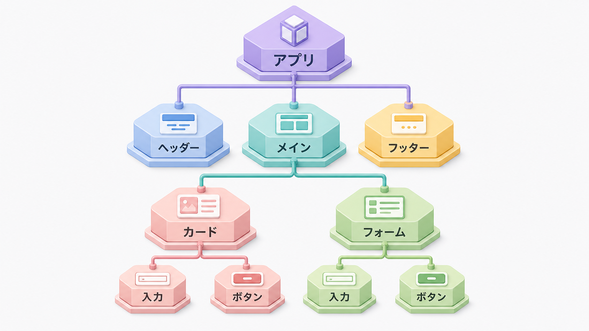

#### メリット / デメリット

**メリット**
- 再利用性が高い
- 単体テストが容易

**デメリット**
- 過剰分割で組み立てが複雑化
- 状態を多くのコンポーネントに分散すると追跡困難

#### 日常のたとえ ― レゴブロック

| たとえ話の物体 | 実設計での対応 | 役割 |
|---|---|---|
| 屋根ブロック | Header コンポーネント | 上部 |
| 窓ブロック | Input コンポーネント | 入力部品 |
| ドアブロック | Button コンポーネント | 操作部品 |
| 壁ブロック | Card コンポーネント | 構造部品 |
| 組み立てた家 | Page コンポーネント | 集合体 |

部品は他の家でも再利用可能。組み合わせ方で違う家が建つ。

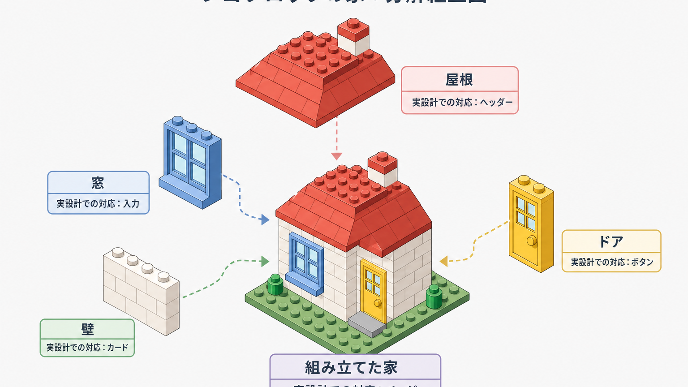

#### コード例（TypeScript）

```typescript
// === 部品: 再利用可能なコンポーネント ===
function Button({ onClick, label }: { onClick: () => void; label: string }) {
  return <button onClick={onClick}>{label}</button>;
}

function Card({ title, children }: { title: string; children: React.ReactNode }) {
  return (
    <section className="card">
      <h3>{title}</h3>
      {children}
    </section>
  );
}

// === 組み立て: 部品を組み合わせて画面を作る ===
function SettingsPage() {
  return (
    <Card title="設定">
      <Button onClick={save} label="保存" />
      <Button onClick={cancel} label="キャンセル" />
    </Card>
  );
}
```

---

### 6.4 Client-Server

#### 目的と使いどころ

最も基本的な分散構造。**クライアントがサーバにリクエストし、サーバが応答する**。

**使いどころ**: Web、モバイル、デスクトップアプリの大多数で採用される標準形。

#### 構造イメージ

複数 Client → 単一 Server → DB。

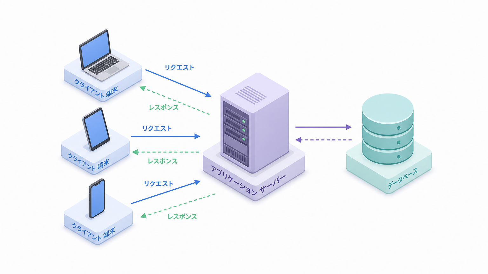

#### メリット / デメリット

**メリット**
- 学習コストが低く業界標準
- サーバー側でセキュリティ・整合性を集中管理

**デメリット**
- サーバー障害で全クライアントが影響
- スケールにロードバランサ等の追加コスト

#### 日常のたとえ ― 牛丼チェーン

| たとえ話の物体 | 実設計での対応 | 役割 |
|---|---|---|
| 来客 | クライアント | リクエスト発信元 |
| 注文 (「並、つゆだく」) | HTTP Request | 要求内容 |
| 店員（カウンター） | サーバー | 受付・処理 |
| 厨房 | DB / 計算リソース | データ・処理 |
| 出された牛丼 | HTTP Response | 結果 |

お客さんは厨房に入らない。店員（サーバー）経由でだけ料理（データ）を受け取る。

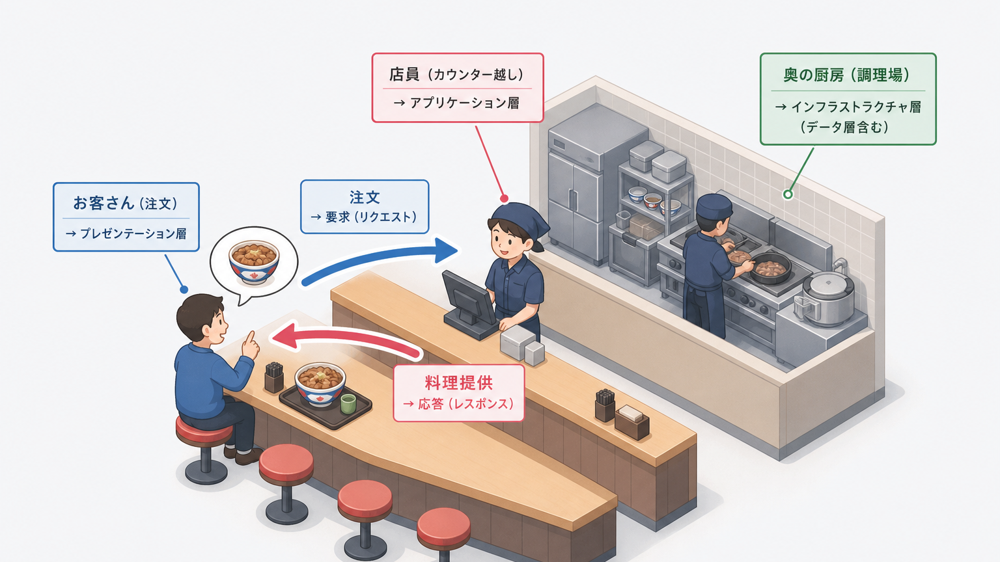

#### コード例（TypeScript）

```typescript
// === Server ===
import express from "express";
const app = express();
app.get("/api/hello", (_, res) => res.json({ msg: "hello" }));
app.listen(3000);

// === Client ===
const result = await fetch("http://localhost:3000/api/hello").then((r) => r.json());
console.log(result.msg); // "hello"
```

---

### 6.5 Peer-to-Peer

#### 目的と使いどころ

各ノードが対等に **クライアントとサーバの両役** を担う。中央サーバを持たない。

**使いどころ**: BitTorrent、ブロックチェーン、IPFS、WebRTC ベースのビデオ通話。

> Client-Server との違い: 中央サーバなし。ノード同士が直接通信。

#### 構造イメージ

複数 Peer が相互に接続。中央なし。

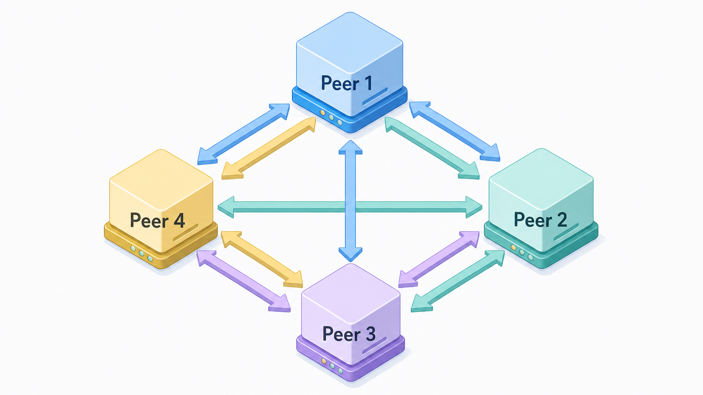

#### メリット / デメリット

**メリット**
- 中央サーバ不要、検閲耐性が高い
- 参加者が増えるほど資源も増える

**デメリット**
- ピア発見・NAT 越え・セキュリティが複雑
- ガバナンスが効きにくい

#### 日常のたとえ ― フリマアプリ（メルカリ）

| たとえ話の物体 | 実設計での対応 | 役割 |
|---|---|---|
| 各ユーザー | Peer（ノード） | 出品にも購入にもなる |
| ユーザー間の直接取引 | P2P 接続 | 中央を介さない |
| メルカリ運営 | 軽量シグナリングサーバ | ピア発見のみ補助 |
| 商品在庫 | 各ピアのリソース | 分散保有 |

中央の店長はいない。全員が売り手にも買い手にもなる。

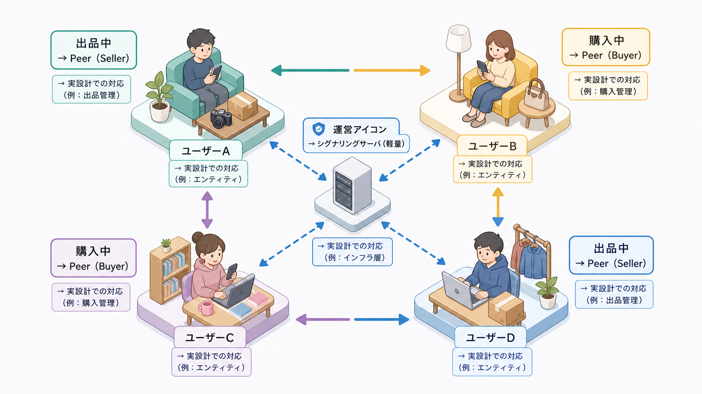

#### コード例（TypeScript）

```typescript
// === WebRTC でブラウザ同士が直接通信 ===
const pc = new RTCPeerConnection();
const dc = pc.createDataChannel("chat");

dc.onopen    = () => console.log("接続");
dc.onmessage = (e) => console.log("相手:", e.data);

dc.send("やあ、ピアくん");

// SDP/ICE 交換のため軽量シグナリングサーバが必要（接続確立後は P2P）
```

---

### 6.6 Broker / Blackboard

#### 目的と使いどころ

- **Broker**: 分散コンポーネント間の通信を仲介
- **Blackboard**: 共有データ空間に各専門コンポーネント（Knowledge Source）が読み書きし、協調して解を構築

**使いどころ**: AI システム、音声認識、専門家システム、複雑な多段推論。

#### 構造イメージ

中央の共有黒板に各専門モジュールが書き込み・読み取り。Controller が調停。

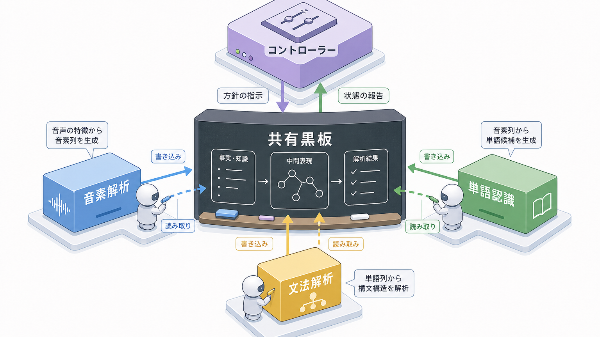

#### メリット / デメリット

**メリット**
- 専門領域ごとにモジュール独立
- 部分的知識でも協調して解に近づく

**デメリット**
- 共有状態の整合性管理が複雑
- 古典的で、モダンには Event-Driven 等で代替可能

#### 日常のたとえ ― 会議室のホワイトボード

| たとえ話の物体 | 実設計での対応 | 役割 |
|---|---|---|
| ホワイトボード | Blackboard (共有メモリ) | 全員が読み書きできる |
| 営業の書き込み | Knowledge Source 1 | 専門知識 1 |
| 開発の書き込み | Knowledge Source 2 | 専門知識 2 |
| 経理の書き込み | Knowledge Source 3 | 専門知識 3 |
| 司会者 | Controller | 誰が次に書くか調停 |

各部署が自分の専門で書き込み、他の書き込みも読んで企画書を完成させる。

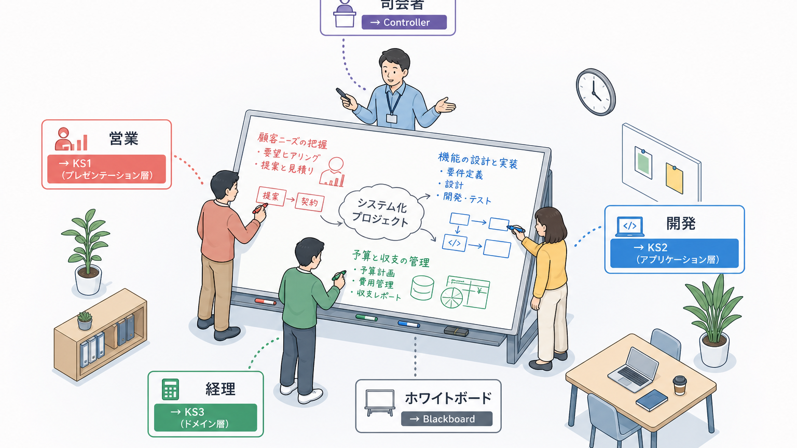

#### コード例（TypeScript）

```typescript
const blackboard: Record<string, unknown> = {};

// === Knowledge Source 1: 音素解析 ===
const phonemeKS = (audio: Buffer) => {
  blackboard.phonemes = analyzePhonemes(audio);
};

// === Knowledge Source 2: 単語認識 ===
const wordKS = () => {
  if (blackboard.phonemes) {
    blackboard.words = recognizeWords(blackboard.phonemes as Phoneme[]);
  }
};

// === Knowledge Source 3: 文法解析 ===
const sentenceKS = () => {
  if (blackboard.words) {
    blackboard.sentence = parseGrammar(blackboard.words as Word[]);
  }
};

// === Controller: 順序を調停 ===
phonemeKS(audioInput);
wordKS();
sentenceKS();
```

---

### 6.7 JAMstack

#### 目的と使いどころ

**JavaScript + APIs + Markup**。静的サイト生成 + CDN 配信 + 動的部分は API で実現。

**使いどころ**: ブログ、マーケサイト、ドキュメント、E コマースのフロントエンド。

#### 構造イメージ

Git Repo → SSG ビルド → CDN/Edge → ブラウザ。ブラウザからは別途 API へ fetch。

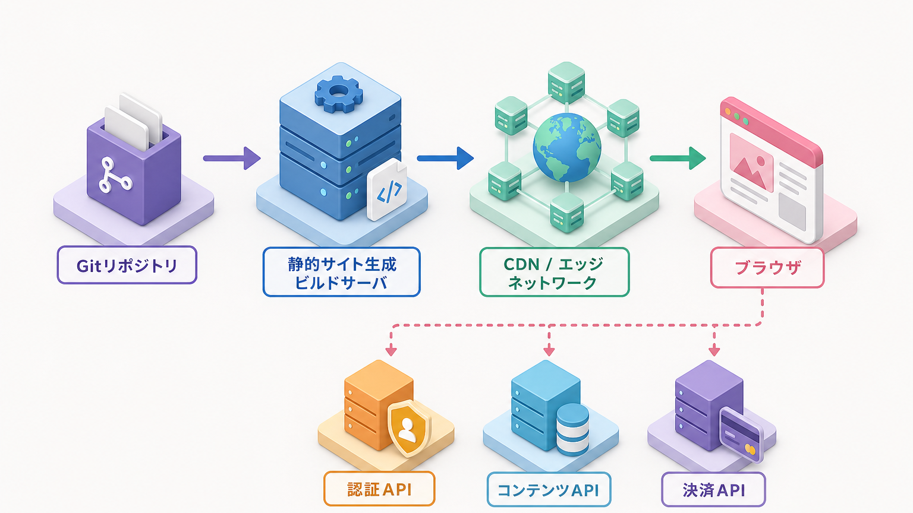

#### メリット / デメリット

**メリット**
- 圧倒的に速い（CDN 配信）
- セキュリティ／インフラ運用が軽い

**デメリット**
- ビルド時間が長くなる
- 完全動的なページには向かない

#### 日常のたとえ ― コンビニ

| たとえ話の物体 | 実設計での対応 | 役割 |
|---|---|---|
| 工場で完成した弁当 | ビルド済み静的 HTML | 事前生成 |
| コンビニの陳列棚 | CDN / Edge | 配信先 |
| 客が弁当を取る | 静的 HTML 配信 | 高速 |
| レジで決済 | 動的 API 呼び出し | 必要な部分だけ |
| 決済端末 | Auth/CMS/Payment API | バックエンド |

弁当（HTML）は完成品が並ぶだけなので超高速。動的処理（決済等）はレジ（API）で別途。

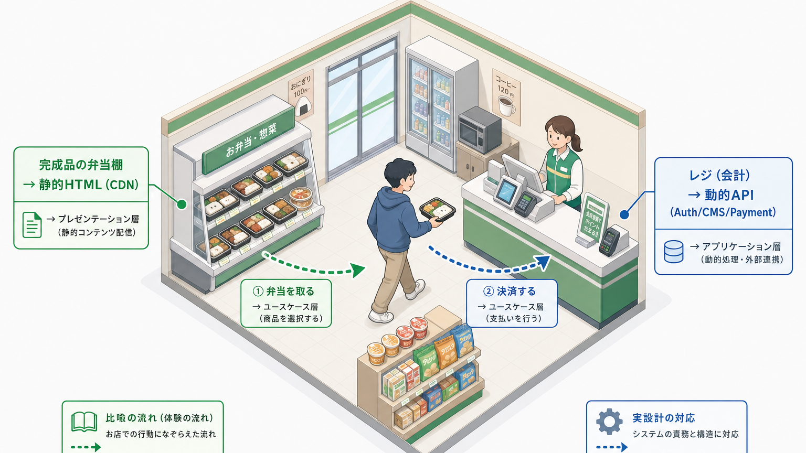

#### コード例（TypeScript）

```typescript
// === Next.js App Router: ビルド時 SSG + ISR ===

export const revalidate = 3600; // 1h ごとに静的再生成

export default async function PostsPage() {
  // ビルド時 or 再生成時に fetch → HTML に焼き込み
  const posts = await fetch("https://cms.example.com/posts", {
    next: { revalidate: 3600 },
  }).then((r) => r.json());

  return (
    <ul>{posts.map((p: Post) => <li key={p.id}>{p.title}</li>)}</ul>
  );
}
```

---

## 7. 選定チートシート

「迷ったらどれ?」 を 1 枚で:

| 状況 | 第一候補 | たとえ |
|---|---|---|
| PoC / 初期スタートアップ | Monolith + MVC | タワマン + 食堂 |
| 小規模 SaaS、CRUD 中心 | Layered (DDD 4 層) | 社員食堂 |
| ドメインが複雑、長期保守 | Clean / Hexagonal + DDD | マトリョーシカ + 国際会議 |
| 外部 API 依存が多い | Hexagonal (Ports & Adapters) | コンセントとプラグ |
| 複数チーム・組織スケール | Microservices + DDD | 商店街 |
| マイクロサービスはまだ早い | Modular Monolith | シェアハウス |
| 読み込み >>> 書き込み | CQRS | 倉庫の入荷口と発送口 |
| 監査・規制が厳しい（金融等） | Event Sourcing + CQRS | 銀行の通帳 |
| リアルタイム / IoT / 大量イベント | Event-Driven | 駅構内放送 |
| 多端末（Web/iOS/Android） | BFF | 同時通訳ブース |
| サーバ運用したくない | Serverless | 呼ばれた時だけ来るバイト |
| 高 TPS で DB がボトルネック | Space-Based | コンサート入場ゲート |
| レガシー段階移行 | Strangler Fig + ACL | 駅前再開発 + 海外駐在員 |
| 静的サイト中心 | JAMstack | コンビニ陳列 |
| データ変換パイプライン | Pipe and Filter | 回転寿司の調理ライン |
| 機能単位の開発・大規模分担 | Vertical Slice | ケーキの縦切り |
| 横断的関心（認証/ログ/メトリクス） | Sidecar / API Gateway | バイクのサイドカー / ビル受付 |
| 分散トランザクション | Saga | 旅行予約のキャンセル連鎖 |

---

## まとめ

設計パターンに **唯一の正解はない**。プロダクト規模、チーム人数、ドメインの複雑さ、変更速度の要求によって最適解は変わる。

押さえるべき原則は 3 つ:

1. **「変わらないもの」を中心に置く** — ビジネスルールは外部の道具より変わりにくい
2. **「責任を分離する」** — 1 つの場所に複数の責任を持たせると変更が連鎖する
3. **「早すぎる最適化は害」** — 最初から完璧を狙わず、必要になったら段階的に進化させる

設計は、コードを書く前の **「家の図面」** に相当する。図面が良ければ建築は速い。逆に図面が雑だと、住んでから後悔する。

本記事のたとえ話・対応表は、技術者でないステークホルダーへの説明にも使えるよう設計した。設計議論の共通言語として活用してほしい。

---

## 参考文献・出典

- Robert C. Martin, *Clean Architecture* (2017)
- Eric Evans, *Domain-Driven Design* (2003)
- Vaughn Vernon, *Implementing Domain-Driven Design* (2013)
- Mark Richards, Neal Ford, *Fundamentals of Software Architecture* (2020)
- Sam Newman, *Building Microservices* (2nd ed., 2021)
- Chris Richardson, *Microservices Patterns* (2018)
- Martin Fowler, *Patterns of Enterprise Application Architecture* (2002)
- Alistair Cockburn, "Hexagonal Architecture" (2005)
- Jeffrey Palermo, "Onion Architecture" (2008)

Layered Architecture の 4 層構成（プレゼンテーション / アプリケーション / ドメイン / インフラ）は DDD 由来の現代的な定義に基づく:

- [Layered Architecture – Domain-driven Design: A Practitioner's Guide](https://ddd-practitioners.com/home/glossary/layered-architecture/)
- [Domain Driven Design: Layers - HiBit](https://www.hibit.dev/posts/15/domain-driven-design-layers)
- [Designing a DDD-oriented microservice - Microsoft Learn](https://learn.microsoft.com/en-us/dotnet/architecture/microservices/microservice-ddd-cqrs-patterns/ddd-oriented-microservice)
- [Demystifying DDD — Part II: DDD vs. Layered Architecture - Medium](https://medium.com/@glauberfigueiredo/demystifying-domain-driven-design-ddd-part-ii-ddd-vs-layered-architecture-4c3b11600322)
