> Claude Code（および MCP 互換 AI コーディングエージェント）の「文脈喪失」を解決するための 8 ツール横断比較。ジュニア／テックリード／非エンジニア視点で採用判断できることを狙う。

## 0. TL;DR

### 一行サマリ

| ツール | 一行ポジション |
|---|---|
| **CLAUDE.md（純正）** | Claude Code が起動時に階層的に読み込む素の Markdown。最小構成・最高互換。 |
| **MCP Memory Server** | Anthropic 公式の知識グラフ。entity-relation-observation を JSONL に永続化。 |
| **Beads (bd)** | Steve Yegge 製。DAG 型 issue tracker でエージェントに「長期 TODO 記憶」を与える。 |
| **MemPalace** | verbatim（逐語）保存 + 宮殿メタファ索引。LongMemEval 96.6% R@5。 |
| **Serena** | LSP ベースのシンボル記憶 + プロジェクト memory MD。コーディング特化。 |
| **Letta（旧 MemGPT）**| 自己編集メモリを持つ自律エージェント基盤。長期自律タスク向け。 |
| **Mem0** | ベクトル＋知識グラフのデュアルストア。チャットボット向けの定番。 |
| **OpenMemory MCP** | Mem0 製ローカル MCP。Claude / Cursor / Windsurf で記憶を共有。 |

### 旧知識との差分（LLM 訓練データで陳腐化しやすい論点）

| 論点 | 古い理解（よくある誤り） | 2026-05 現在 |
|---|---|---|
| MemGPT | 「MemGPT というフレームワーク」 | MemGPT は研究パターン名。実装は **Letta** にリネーム済み |
| MCP Memory Server | 「サードパーティの非公式実装」 | **Anthropic 公式**（modelcontextprotocol/servers）として GA |
| Beads | 「単なる Markdown todo」 | **Go 製 DAG issue tracker**、Dolt バックエンド、18.7k stars |
| Mem0 graph 機能 | 「無料で全機能使える」 | knowledge graph は **$249/mo Pro tier 限定** |
| CLAUDE.md の長さ | 「長いほど良い」 | 実用上限は **80-120 行**。150-200 instruction で性能劣化 |
| Serena | 「ただの MCP の 1 つ」 | LSP 連携で**シンボル単位**の記憶／編集。Python 製 |
| OpenMemory | 「Mem0 とは別物」 | **Mem0 製のローカル MCP ラッパ**。エージェント横断記憶のローカル版 |
| MemPalace | （ほぼ未知） | **2026 年新興**。verbatim 保存で要約しない設計。29 MCP tools |

### 最大差別化点（要約）

- **「タスクの記憶」が欲しいなら Beads** — DAG 依存とハッシュ ID で多エージェント並列 OK
- **「会話の記憶」が欲しいなら MemPalace / Mem0** — 前者は逐語保存、後者は要約抽出
- **「コードの記憶」が欲しいなら Serena** — LSP シンボル単位で参照／編集
- **「自律エージェント」を作るなら Letta** — 自己編集メモリ + REST API
- **「ツール横断で共有」したいなら OpenMemory MCP** — Claude / Cursor / Windsurf を繋ぐ
- **「最初の一歩」は CLAUDE.md + MCP Memory Server** — 公式・無料・ベンダーロックインなし

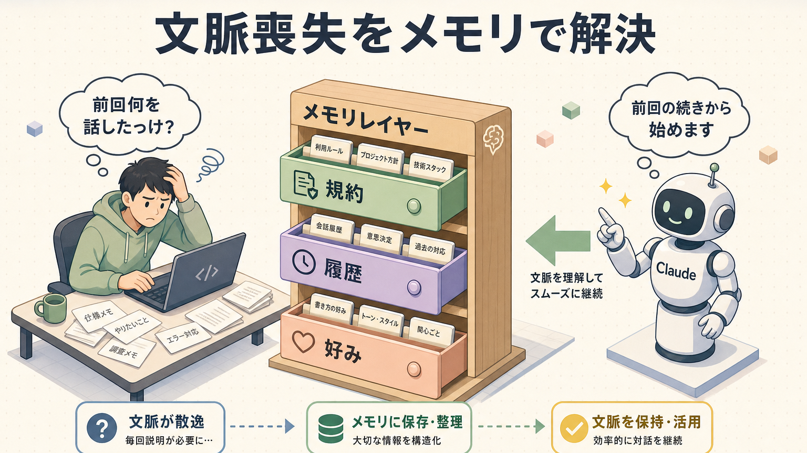

---

## 1. メモリ管理が必要な理由 — 理念とミッション

### 1.1 ミッション（各ツール公式の表現）

| ツール | 公式の言葉 |
|---|---|
| CLAUDE.md | "How Claude remembers your project" |
| MCP Memory Server | "Persistent memory using a local knowledge graph" |
| Beads | "A memory upgrade for your coding agent" |
| MemPalace | "The best-benchmarked open-source AI memory system. And it's free." |
| Serena | "The IDE for your agent" |
| Letta | "Stateful agents with persistent memory" |
| Mem0 | "The memory layer for personalized AI" |
| OpenMemory MCP | "Memory for your AI Tools" |

### 1.2 哲学

| 視点 | 設計思想 |
|---|---|
| ファイル派 (CLAUDE.md / Serena) | Markdown を真実源にして人間が読める形で保つ。バージョン管理が効く |
| グラフ派 (MCP Memory / Mem0 / Letta) | 構造化された entity-relation を成長させる。検索が強い |
| 逐語派 (MemPalace) | 要約せず原文保存。圧縮で意味が失われる問題を避ける |
| タスク派 (Beads) | 「覚えるべきは今やるべきこと」。長期 TODO こそ最重要な記憶 |
| ホスト派 (OpenMemory MCP) | 記憶はツールの外側に置き、複数エージェントから共有する |

### 1.3 なぜ存在するか

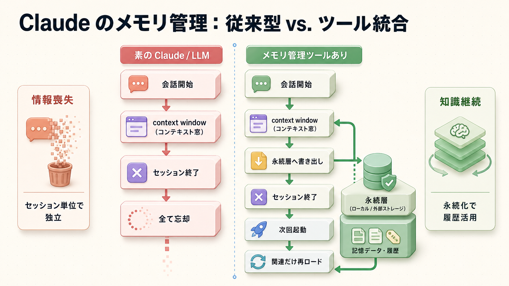

### 1.4 エンジニア（および非エンジニア利用者）にとっての意味

| 立場 | メモリ管理が解決する具体的痛み |
|---|---|
| **ジュニアエンジニア** | 「先週相談したコーディング規約をまた説明しないといけない」「Claude Code が同じ間違いを繰り返す」を構造的に解決 |
| **テックリード** | プロジェクト規約・アーキ判断・命名規則をチーム横断で共有資産化。新人 onboarding のコスト削減 |
| **SRE / 運用** | インシデント対応の判断履歴を Claude に持たせる。同じトラブルで同じ調査をやり直さない |
| **AI / プロンプト設計** | "few-shot をプロンプトに毎回貼る" から "長期記憶として参照される" に格上げ |
| **PM・非エンジニア（例: ライフライン事業の業務側）** | Claude Code で議事録・FAQ・顧客対応スクリプトを継続的に育てる。"前回の私の好み" を覚えてもらう |

---

## 2. 全体マップ（1 枚絵）

### 2.1 サービス全体俯瞰

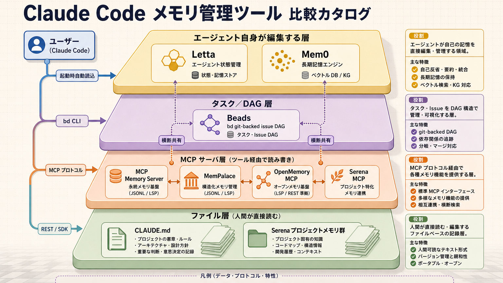

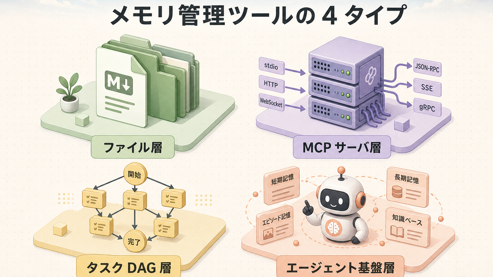

### 2.2 製品カテゴリ mindmap

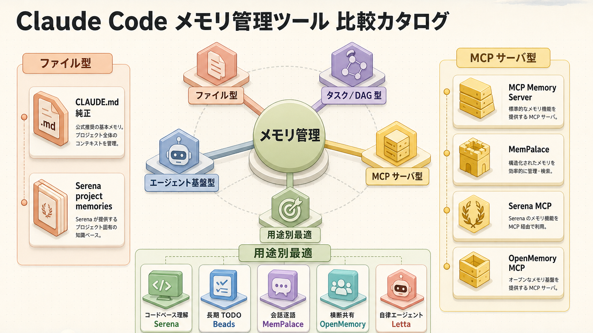

---

## 3. 比較軸の前提知識

### 3.1 比較軸概要表

| 軸 | 値域 | 意味 |
|---|---|---|
| **永続性** | session / project / global / cross-tool | どこまでスコープが広がるか |
| **検索方式** | full-text / vector / knowledge-graph / symbolic / dag-traversal | 取り出し方の主要メカニズム |
| **書き込み主体** | human-only / agent-self-editing / hybrid | 誰がメモリを更新するか |
| **セットアップ難度** | none / low / med / high | 導入の心理的コスト |
| **運用形態** | local / self-host / SaaS / hybrid | 実行・データ保管場所 |
| **ライセンス** | OSS / OSS+SaaS / proprietary | コードとビジネスモデル |

### 3.2 課金モデルの考え方

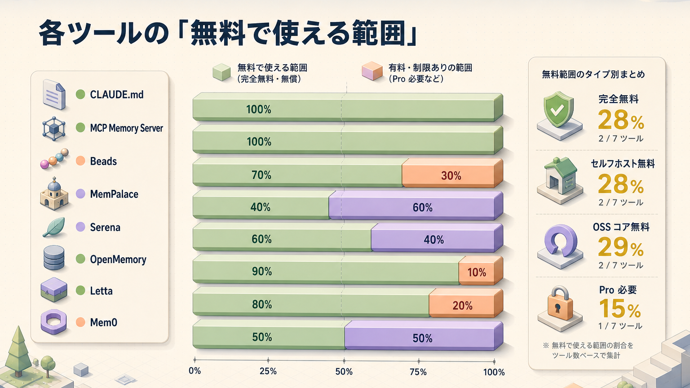

### 3.3 本ドキュメント内の表記凡例

| 表記 | 意味 |
|---|---|
| `利用可` | その機能・プランで標準的に使える |
| `制限あり` | 使えるが制約あり（要件・スコープ・容量など） |
| `不可` | 提供されていない |
| `従量課金` | 利用量に応じて課金される |
| `OSS` | 自前 host で完全無料 |
| `SaaS` | クラウド提供。料金体系あり |

---

## 4. 機能カタログ

8 ツールそれぞれを 7 ブロック構造（🎯 / 👨‍💻 / 💳 / 🏢 / 🔥 / 🔍 / ⚠️）で記述する。

### 4.1 CLAUDE.md（Claude Code 純正階層メモリ）

#### 4.1.1 階層メモリシステム

**🎯 概要**

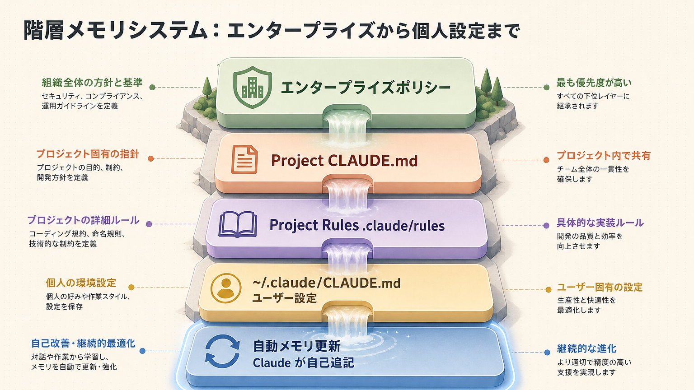

Claude Code がディレクトリツリーを遡って `CLAUDE.md` を自動連結ロードする標準機構。後で読まれた指示の方が（同じ論点なら）強く効く。

**👨‍💻 エンジニアへの関係**

最も低コストでメモリを持たせる方法。設定不要・MCP 不要・追加ツール不要。`~/.claude/CLAUDE.md` に書けば全プロジェクトに効き、リポジトリ直下に置けばそのプロジェクトだけに効く。

**💳 利用可能プラン**

| Claude Code 無料 | Claude Pro | Claude Team / Enterprise |
|:-:|:-:|:-:|
| 利用可 | 利用可 | 利用可（Enterprise Policy 層が追加） |

**🏢 ClassLab. での活用**

- **ジュニアエンジニア**: コーディング規約・命名規則・テスト方針を `CLAUDE.md` に書いておけば毎回説明不要
- **テックリード**: チーム共通の `.claude/rules/` をリポジトリに commit してコードレビュー観点を統一
- **非エンジニア**: 業務マニュアル・FAQ・社内用語集を `~/.claude/CLAUDE.md` に書いて Claude Code を社内アシスタント化

**🔥 差別化点**

- vs MCP Memory Server: **設定ゼロ**。Git で diff が見える
- vs Mem0 / Letta: **完全無料**。クラウドアカウント不要
- vs Beads: タスクではなく**規約・嗜好**を記述するのに向く

**🔍 深掘り**

- 実用上限は **80-120 行**（モデルが従える instruction 数 150-200 のうち、システムプロンプトで 50 使われる）
- `/memory` コマンドで現在ロード中のメモリを確認できる
- Auto memory 機能で Claude 自身が `MEMORY.md` インデックスに追記する（本ワークスペースでも稼働中）

**⚠️ 注意点**

- 長くすればするほど性能低下。**冗長な内容は別ファイルに切り出し**
- 機密情報を書くと履歴に残る。Secret は環境変数へ
- 後で読まれた指示が勝つので、Enterprise → Project → User の順を意識して書く

---

### 4.2 MCP Memory Server（Anthropic 公式 Knowledge Graph）

#### 4.2.1 知識グラフ永続化

**🎯 概要**

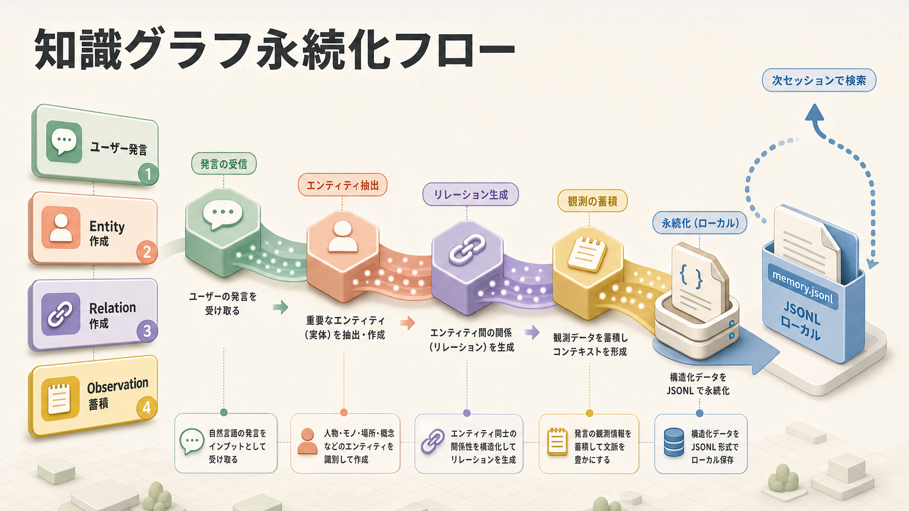

Entity（人・物・概念）と Relation（関係）と Observation（観察）の 3 概念だけで構成される最小知識グラフ。MCP 経由で 9 ツール提供。

**👨‍💻 エンジニアへの関係**

「Claude にプロジェクトの登場人物・モジュール・依存関係を覚えさせたい」場合の標準解。公式・無料・ローカルファイル保存というベンダーロックインなしの組み合わせが強い。

**💳 利用可能プラン**

| OSS self-host | クラウド版 |
|:-:|:-:|
| 利用可（無料） | 不可（提供なし、ローカル限定） |

**🏢 ClassLab. での活用**

- **ジュニアエンジニア**: 新規参画時のオンボーディングで「このリポジトリの主要モジュール」をグラフに登録
- **テックリード**: アーキテクチャ判断の根拠（"なぜマイクロサービス分割したか"）を entity に observation として残す
- **非エンジニア**: ライフライン事業のパートナー会社・契約条件・連絡窓口を entity 化して Claude に問い合わせ

**🔥 差別化点**

- vs Mem0: **完全ローカル**・SaaS 課金なし
- vs Letta: **エージェント基盤不要**。Claude Code の MCP に追加するだけ
- vs CLAUDE.md: **検索可能な構造化データ**として保持

**🔍 深掘り**

- 9 ツール: `create_entities` / `create_relations` / `add_observations` / `delete_*` / `read_graph` / `search_nodes` / `open_nodes` 等
- `memory.json` は JSONL なので `git diff` でレビュー可能
- Memory Visualizer（mjherich/memory-visualizer）で GUI 閲覧

**⚠️ 注意点**

- 検索はキーワード／node 探索ベース。**ベクトル検索ではない**ので類似意味検索は弱い
- スキーマフリーなので運用ルールがないと無秩序になる
- マルチユーザ共有は想定されていない（基本ローカル）

---

### 4.3 Beads (bd) — git-backed issue DAG

#### 4.3.1 タスク DAG による長期記憶

**🎯 概要**

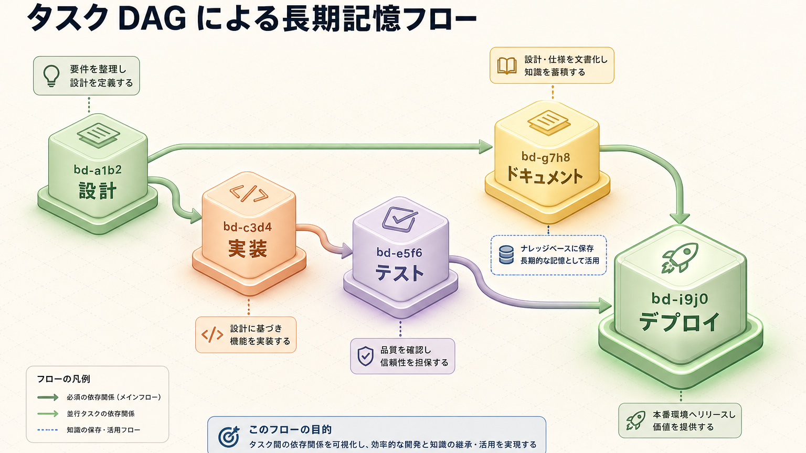

Steve Yegge 製。**ハッシュ ID** で多エージェント並列でも衝突しない DAG 型 issue tracker。git-backed JSONL + SQLite キャッシュ。閉じた古いタスクは自動的に "memory decay" で要約され context window を節約。

**👨‍💻 エンジニアへの関係**

長期タスク（数日〜数週間）を Claude に走らせるとき、Claude 自身が「次に何をすべきか」「これは何のためにやってるんだっけ」を見失う問題への構造的解。`AGENTS.md` / `CLAUDE.md` に `bd` への参照を 1 行入れるだけで long-horizon planning が劇的に安定する。

**💳 利用可能プラン**

| OSS / 個人 | チーム利用 | エンタープライズ |
|:-:|:-:|:-:|
| 利用可（無料） | 利用可（git で共有） | 利用可（自前 host のみ、SaaS なし） |

**🏢 ClassLab. での活用**

- **ジュニアエンジニア**: 巨大なリファクタタスクを Claude Code に任せる時に最適。途中で迷子にならない
- **テックリード**: 複数エージェント並列開発時の競合回避（hash ID 設計）
- **非エンジニア**: ライフライン事業の「申込フォーム改修」のような長期 PJ で Claude に進捗管理を任せる

**🔥 差別化点**

- vs GitHub Issues: **エージェントが直接読み書き**できる粒度で設計
- vs CLAUDE.md: **タスクの依存関係**を構造として持つ
- vs Letta: **コーディング特化**で軽量、フレームワーク不要

**🔍 深掘り**

- Go 製・92.9% Go コードベース
- Dolt（git-like DB）でマージ衝突解決を組み込み
- 2026-03 時点で v0.59.0、18.7k stars
- `bd list ready` で「今すぐ着手できる」タスクのみ抽出（依存解決済み）

**⚠️ 注意点**

- 学習コスト: `bd` CLI に慣れる必要あり
- DAG 設計を雑にやると「依存だらけで進まない」状態になる
- 純粋な「会話の記憶」用途には向かない

---

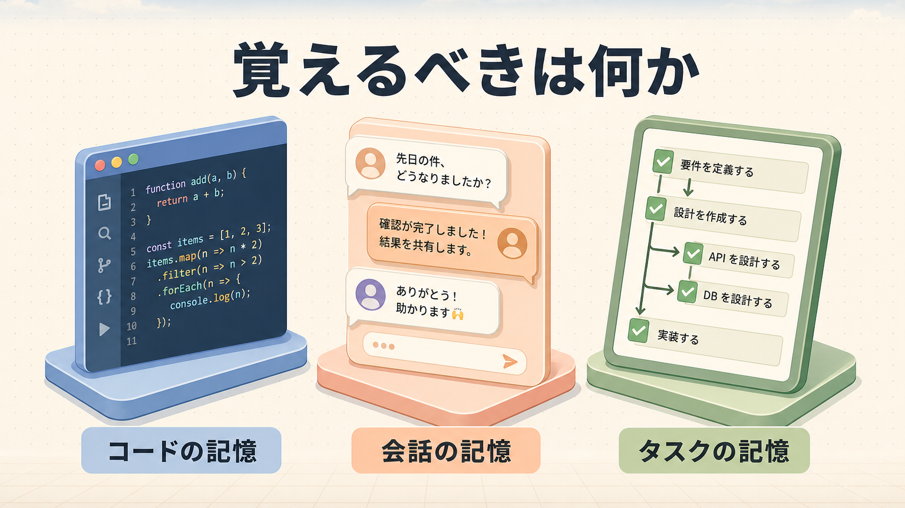

### 4.4 MemPalace

#### 4.4.1 逐語保存 + 宮殿メタファ索引

**🎯 概要**

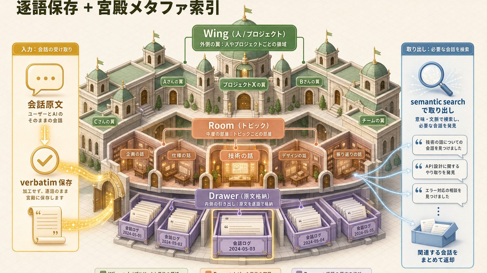

会話履歴を**そのまま**保存し、semantic search で取り出す。要約・抽出・パラフレーズしない設計思想。記憶宮殿メタファで Wing→Room→Drawer の階層索引を持つ。

**👨‍💻 エンジニアへの関係**

「Claude が以前何を提案したか・自分が何を言ったか」を**原文のニュアンスごと**保持したい場合の選択肢。要約による情報欠落を許容できないユースケース（議事録・契約相談・コードレビューコメント）に強い。

**💳 利用可能プラン**

| OSS self-host | MemPalace Cloud |
|:-:|:-:|
| 利用可（完全無料） | 利用可（OAuth MCP プラグイン経由） |

**🏢 ClassLab. での活用**

- **ジュニアエンジニア**: コードレビュー指摘の原文を残して同じ指摘を繰り返さない
- **テックリード**: 設計会議のやり取り原文を保存。「なぜこの結論にしたか」を後から検索
- **非エンジニア**: ライフライン事業の顧客対応スクリプトを逐語保存。トーン・敬語表現を学習素材化

**🔥 差別化点**

- vs Mem0: **要約しない**。原文の文脈・トーンが保たれる
- vs MCP Memory Server: **semantic search（ベクトル）**で意味的に類似な過去発言を引ける
- vs Letta: **ローカルファースト**で API コール不要

**🔍 深掘り**

- LongMemEval ベンチで **96.6% R@5（raw）** という極めて高いリコール
- 29 個の MCP tool: palace 読み書き、KG 操作、cross-wing 移動、drawer 管理、エージェント日記
- Claude Code フック 2 種: 定期保存・context 圧縮前保存
- インストール: `uv tool install mempalace` または `pipx install mempalace`

**⚠️ 注意点**

- 2026 年新興プロジェクト。**運用実績は浅い**
- 逐語保存ゆえに**ストレージ膨張**しやすい
- 索引設計（Wing/Room）をサボると検索精度が落ちる

---

### 4.5 Serena

#### 4.5.1 LSP ベース シンボル記憶

**🎯 概要**

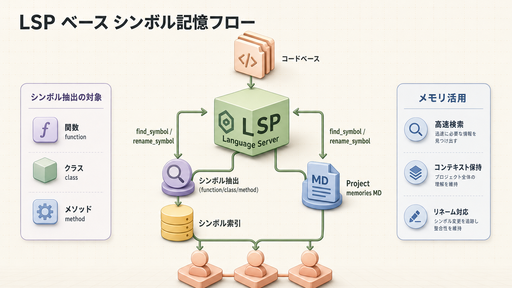

oraios 製。LSP（Language Server Protocol）を介してコードを**シンボル単位**で扱えるようにする MCP toolkit。`find_symbol` / `find_referencing_symbols` / `rename_symbol` などの IDE 級操作を Claude に与える。プロジェクト固有 memory MD ファイルも持つ。

**👨‍💻 エンジニアへの関係**

「Claude が grep ベースでコード探索して的外れな編集をする」「リファクタが安全に終わらない」問題に対する正攻法。シンボル単位で参照解析するので大規模 codebase で特に効く。

**💳 利用可能プラン**

| OSS self-host |
|:-:|
| 利用可（無料） |

**🏢 ClassLab. での活用**

- **ジュニアエンジニア**: 大規模リポジトリ初参画時に Claude へコード理解を任せる
- **テックリード**: 横断リファクタ（命名変更・API シグネチャ変更）の安全実行
- **非エンジニア**: 該当なし（コーディング特化）

**🔥 差別化点**

- vs Mem0 / Letta: **コード特化**。会話記憶ではなく**コード構造記憶**
- vs CLAUDE.md: 構造化された**シンボル参照**を持つ
- vs Beads: タスクではなく**コード理解**を覚える

**🔍 深掘り**

- Python 製、PyPI で `serena-agent`
- 2026-05-18 release
- 本ワークスペースでも MCP として利用可能（`mcp__serena__*` ツール群）
- プロジェクトごとの `memories/` ディレクトリに `.md` ファイルとして知見を蓄積

**⚠️ 注意点**

- LSP が必要なので**言語サポート依存**（多言語対応は LSP 側次第）
- 起動時にコードベースインデックス構築コストがある
- 純粋な「会話記憶」用途には向かない

---

### 4.6 Letta（旧 MemGPT）

#### 4.6.1 自己編集メモリエージェント基盤

**🎯 概要**

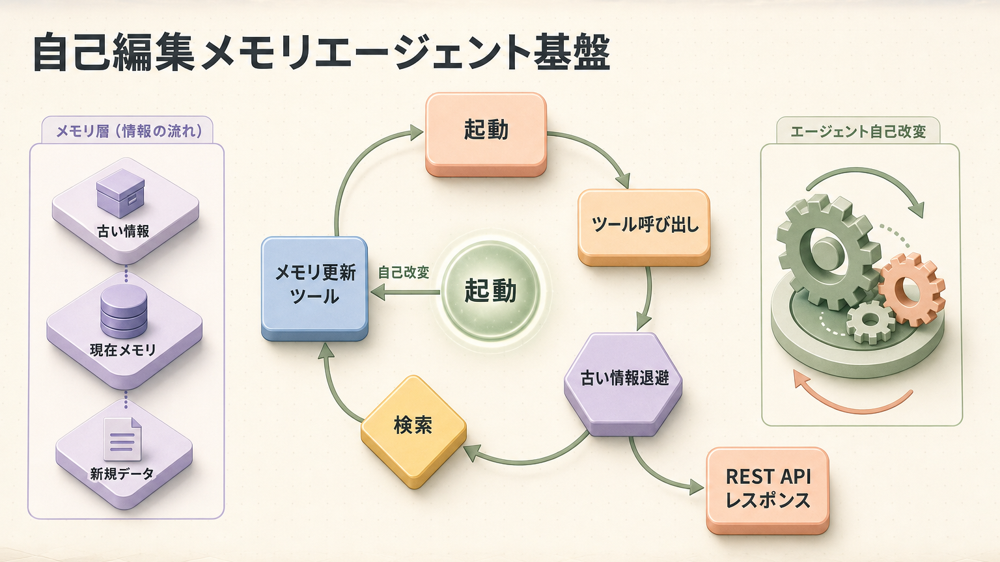

UC Berkeley 発の MemGPT 研究を製品化したエージェント基盤。**自己編集メモリ**（agent が自分でメモリを管理）と **OS 風メモリ階層**（core/working/archival）を持つ。REST API でエージェントを deploy できる。

**👨‍💻 エンジニアへの関係**

「数日〜数週間自律稼働する Claude / GPT エージェント」を作りたいときの本命。CLAUDE.md や MCP Memory Server より重いが、エージェント自身が記憶を整理してくれる。

**💳 利用可能プラン**

| OSS self-host | Letta Cloud |
|:-:|:-:|
| 利用可（無料） | 従量課金（production 想定） |

**🏢 ClassLab. での活用**

- **ジュニアエンジニア**: 単体では重すぎる。学習リソースとして触る程度
- **テックリード**: 社内向け自律エージェント（PR 自動レビュー、issue triage）の基盤として
- **非エンジニア**: ライフライン業務の自動応答エージェント（FAQ 応答→エスカレ判断）

**🔥 差別化点**

- vs Mem0: **自己編集メモリ**でエージェント自律性が桁違い
- vs MCP Memory Server: **エージェント runtime まで提供**
- vs Letta Cloud: **self-host 完結**できる OSS パス

**🔍 深掘り**

- MemGPT は研究パターン名、**Letta** が実装フレームワーク名
- OS 風: core memory（常時 context）/ working memory（最近）/ archival memory（長期・検索）
- Production 向け（REST API、agent runtime、developer tools）

**⚠️ 注意点**

- **重い**。CLAUDE.md 1 ファイルで済むタスクには過剰
- 自己編集メモリゆえに「エージェントが自分で変なことを覚える」リスク
- Claude Code 単体で完結したい場合は不向き

---

### 4.7 Mem0

#### 4.7.1 ベクトル + 知識グラフ デュアルストア

**🎯 概要**

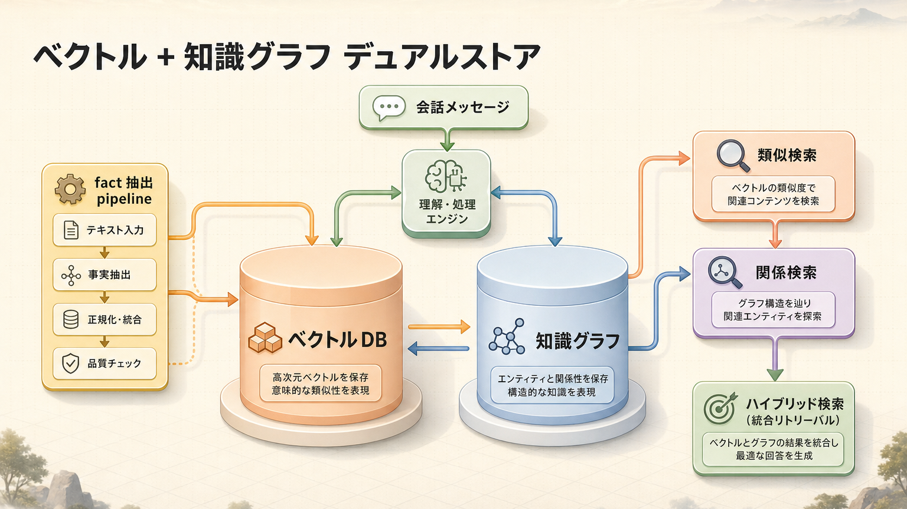

会話メッセージから **atomic な fact** を抽出して保存。ベクトル DB（類似検索）と知識グラフ（関係検索）を併用。チャットボット用記憶層として最も普及。

**👨‍💻 エンジニアへの関係**

「ユーザーの好み・履歴を覚える AI アシスタント」を作りたい場合の業界デフォルト。GitHub 48k stars、$24M Series A という採用実績の安心感。

**💳 利用可能プラン**

| OSS core | Cloud Free | Cloud Pro |
|:-:|:-:|:-:|
| 利用可（無料） | 制限あり（容量上限） | 従量課金（$50-500/月目安、graph 機能は $249/月〜） |

**🏢 ClassLab. での活用**

- **ジュニアエンジニア**: 個人開発の試作で「ユーザー好みを覚えるチャットボット」を作る
- **テックリード**: 社内向け AI アシスタントで「誰がどの案件担当」を覚えさせる
- **非エンジニア**: ライフライン事業の顧客プロフィール（過去契約・好み・連絡時間帯）を覚える接客 AI

**🔥 差別化点**

- vs MCP Memory Server: **ベクトル類似検索**が標準装備
- vs Letta: **軽量**で導入しやすい
- vs MemPalace: **要約抽出して fact 化**するので記憶が密

**🔍 深掘り**

- LongMemEval 49.0% （Zep 63.8% より低いが、軽量さで選ばれる）
- dual-store: vector + knowledge graph
- SDK: Python / TypeScript / REST
- **graph 機能は $249/mo Pro tier 以上**

**⚠️ 注意点**

- **抽出が雑な fact を蓄積**するとノイズになる
- Pro tier 必要な機能（graph）がある
- self-host だと運用責任が増す

---

### 4.8 OpenMemory MCP

#### 4.8.1 ローカル横断記憶レイヤ

**🎯 概要**

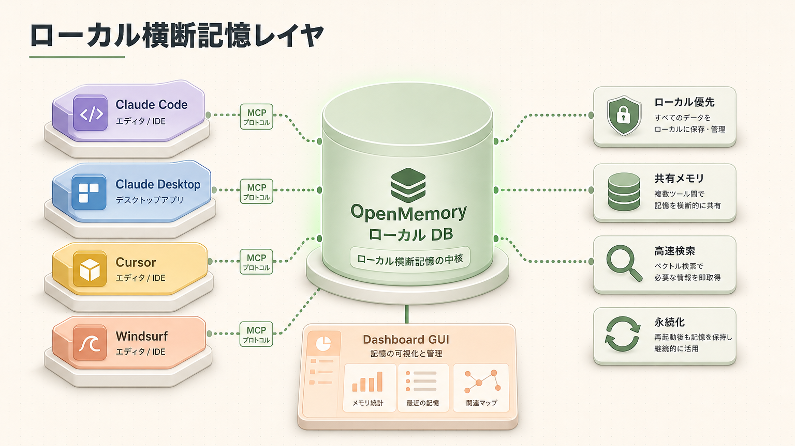

Mem0 製のローカル MCP サーバ。**複数の AI ツールから同一の記憶を共有**する。データは完全ローカル保存。MCP 互換クライアントなら何でも繋がる。

**👨‍💻 エンジニアへの関係**

「Cursor で要件定義 → Claude Code で実装 → Windsurf でデバッグ」のような複数ツール跨ぎワークフローで、毎回コンテキストを貼り直す手間を消す。

**💳 利用可能プラン**

| OSS self-host |
|:-:|
| 利用可（完全無料・ローカル） |

**🏢 ClassLab. での活用**

- **ジュニアエンジニア**: 個人の学習メモを複数 AI ツール間で共有
- **テックリード**: チーム標準として「全員 OpenMemory を入れる」運用にすればツール選択の自由を保ちつつ知識共有
- **非エンジニア**: Claude Desktop で要件整理 → Cursor で開発依頼するワークフローで継続性確保

**🔥 差別化点**

- vs Mem0 SaaS: **データがクラウドに行かない**
- vs MCP Memory Server: **複数クライアント前提**で設計
- vs CLAUDE.md: **ツール横断**で共有できる

**🔍 深掘り**

- Mem0 オープンソース、Apache-2.0 系ライセンス
- Dashboard GUI で memory の閲覧・削除・アクセス制御
- MCP 標準準拠なので Cline、ChatGPT Desktop（対応次第）も繋がる

**⚠️ 注意点**

- ローカル限定なので**マシン跨ぎ共有は別途仕組み必要**（同期ツール等）
- Mem0 の抽出ロジックを引き継ぐので fact 抽出品質に依存

---

## 5. 機能 × ツール マトリクス

凡例: `利用可` / `制限あり` / `不可` / `OSS-only`

| 軸 | CLAUDE.md | MCP Memory | Beads | MemPalace | Serena | Letta | Mem0 | OpenMemory |
|---|:-:|:-:|:-:|:-:|:-:|:-:|:-:|:-:|
| **設定ゼロで使える** | 利用可 | 制限あり（MCP 設定要） | 制限あり（CLI 導入要） | 制限あり（pipx 等） | 制限あり（LSP 要） | 不可（基盤構築要） | 制限あり（SDK 要） | 制限あり（MCP 設定要） |
| **完全ローカル動作** | 利用可 | 利用可 | 利用可 | 利用可 | 利用可 | 利用可（self-host） | 制限あり（OSS のみ） | 利用可 |
| **構造化検索（KG / シンボル）** | 不可 | 利用可（KG） | 利用可（DAG） | 利用可（KG） | 利用可（シンボル） | 利用可 | 利用可（Pro tier） | 利用可（Mem0 由来） |
| **意味検索（ベクトル）** | 不可 | 不可 | 不可 | 利用可 | 制限あり | 利用可 | 利用可 | 利用可 |
| **逐語（verbatim）保存** | 利用可（手書き） | 制限あり | 制限あり | 利用可 | 不可 | 不可 | 不可 | 不可 |
| **タスク／TODO 管理** | 制限あり | 不可 | 利用可（コア機能） | 制限あり | 不可 | 制限あり | 不可 | 不可 |
| **自己編集メモリ** | 制限あり（Auto memory） | 制限あり（tool 呼び出し） | 利用可（エージェント駆動） | 利用可（hooks） | 利用可（memory MD） | 利用可（コア機能） | 利用可 | 利用可 |
| **ツール横断共有** | 制限あり（手動） | 制限あり | 利用可（git 経由） | 不可 | 制限あり | 利用可（API） | 利用可（SaaS） | 利用可（設計目的） |
| **マルチエージェント並列** | 不可 | 制限あり | 利用可（hash ID） | 制限あり | 制限あり | 利用可 | 利用可 | 利用可 |
| **公式 SaaS あり** | 不可 | 不可 | 不可 | 利用可（Cloud） | 不可 | 利用可（Letta Cloud） | 利用可（Mem0 Cloud） | 不可 |
| **無料で本番運用可** | 利用可 | 利用可 | 利用可 | 利用可 | 利用可 | 利用可（self-host） | 制限あり（Pro 必要な機能あり） | 利用可 |
| **既に本ワークスペースで稼働中** | 利用可 | 不可 | 不可 | 不可 | 利用可（MCP） | 不可 | 不可 | 不可 |

---

## 6. 料金体系の詳細

### 6.1 ツール別の含み枠と超過料金

| ツール | 無料枠 | 課金条件 | 月額目安 |
|---|---|---|---|
| CLAUDE.md | 完全無料 | なし | $0 |
| MCP Memory Server | 完全無料（OSS） | なし | $0 |
| Beads | 完全無料（OSS） | なし | $0 |
| MemPalace OSS | 完全無料 | なし | $0 |
| MemPalace Cloud | 要確認 | OAuth MCP 経由 | 要確認 |
| Serena | 完全無料（OSS） | なし | $0 |
| Letta self-host | 完全無料 | LLM API コール代は別途 | LLM 利用次第 |
| Letta Cloud | 不明 | production 想定の従量課金 | 要見積もり |
| Mem0 OSS | 完全無料 | なし | $0 |
| Mem0 Cloud | 制限あり | 容量・retrieval 量 | $50-500（典型）、$249〜（graph 機能） |
| OpenMemory MCP | 完全無料（OSS） | なし | $0 |

### 6.2 競合との料金構造の違い

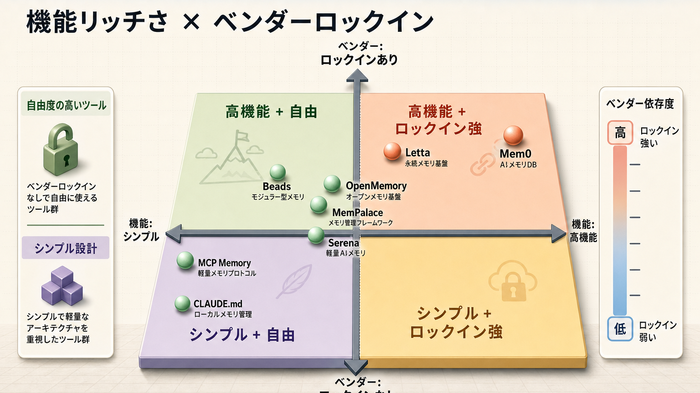

### 6.3 コスト最適化の勘所

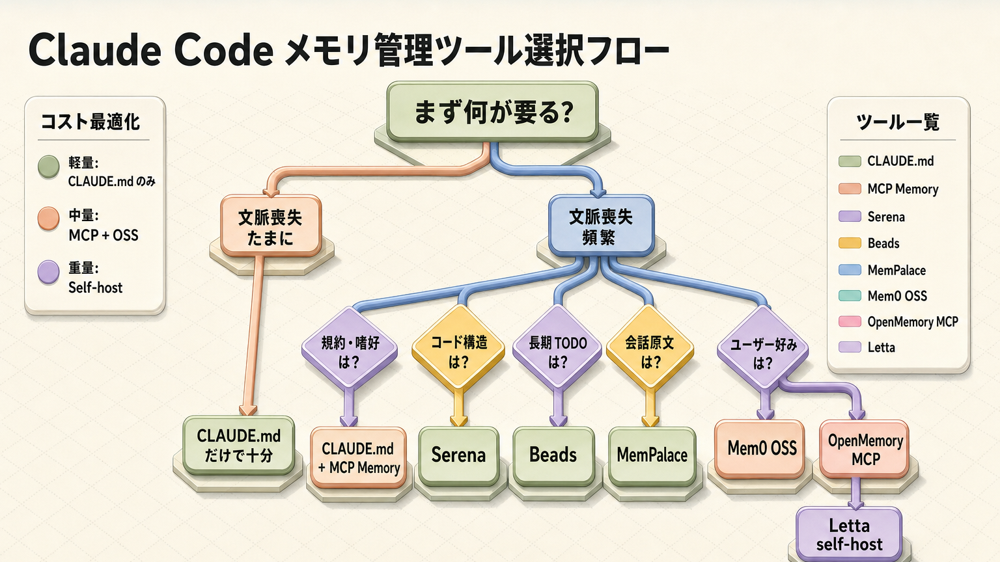

---

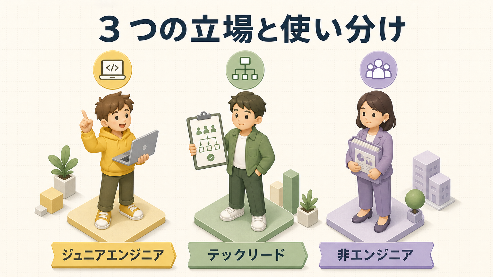

## 7. ClassLab. での活用ロードマップ

### 7.1 短期（〜3ヶ月）

| 立場 | 着手内容 | 推奨ツール |
|---|---|---|
| **ジュニアエンジニア** | 個人 `~/.claude/CLAUDE.md` に学んだコーディング規約・命名規則を追記 | CLAUDE.md（純正） |
| **ジュニアエンジニア** | 単一リポジトリで Claude Code を使い倒す | CLAUDE.md + Serena（既稼働） |
| **テックリード** | チームリポジトリに `.claude/rules/` を整備し commit | CLAUDE.md（プロジェクト層） |
| **テックリード** | 長期リファクタ PJ で Beads を試験導入 | Beads |
| **非エンジニア** | Claude Desktop / Claude Code で業務 FAQ を蓄積 | CLAUDE.md + OpenMemory MCP |

### 7.2 中長期（3〜12ヶ月）

| 立場 | 着手内容 | 推奨ツール |
|---|---|---|
| **ジュニアエンジニア** | 個人横断記憶を Cursor / Claude Code 間で共有 | OpenMemory MCP |
| **ジュニアエンジニア** | コードレビュー指摘の原文蓄積 | MemPalace |
| **テックリード** | 社内自律エージェント（PR 自動レビュー・issue triage）構築 | Letta self-host |
| **テックリード** | アーキテクチャ判断履歴のグラフ化 | MCP Memory Server |
| **非エンジニア** | ライフライン顧客プロフィール記憶 AI を試作（個人情報取扱に注意） | Mem0 OSS（self-host） |
| **非エンジニア** | 業務ワークフロー横断のメモ共有 | OpenMemory MCP |

### 7.3 既存資産棚卸し

| 既に稼働中 | 内容 | 拡張余地 |
|---|---|---|
| 本ワークスペースの `CLAUDE.md` + `.claude/memory/` | 階層メモリ + Auto memory（feedback / project / reference 等） | Enterprise 層追加（会社ポリシー）、`.claude/rules/` 共通化 |
| `mcp__serena__*` MCP | Serena が稼働中。シンボル検索・編集 | 各プロジェクトの memory MD を積極利用 |

---

## 8. 採用判断フロー

### 8.1 新規プロジェクトでの選択フロー

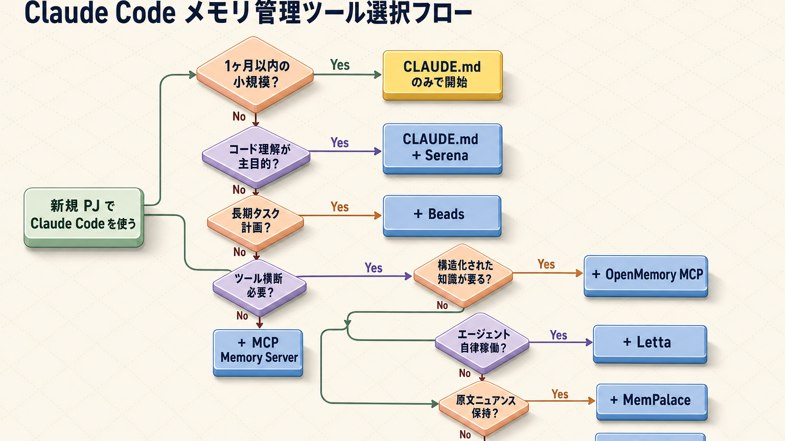

### 8.2 採用適性 Quadrant（軸: セットアップ難度 × ClassLab. 即効性）

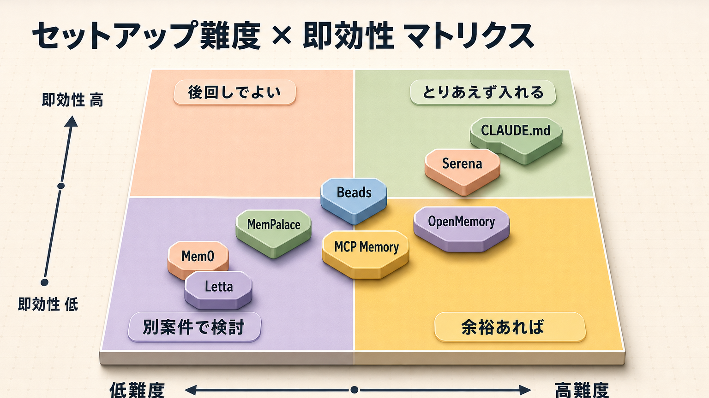

---

## 9. 公式リファレンス & Sources

### 公式ドキュメント / リポジトリ

- **CLAUDE.md（純正）**: https://code.claude.com/docs/en/memory
- **MCP Memory Server**: https://github.com/modelcontextprotocol/servers/tree/main/src/memory
- **Beads (bd)**: https://github.com/steveyegge/beads
- **MemPalace**: https://github.com/mempalace/mempalace / https://www.mempalace.tech/
- **Serena**: https://github.com/oraios/serena
- **Letta**: https://docs.letta.com/concepts/letta/ / https://www.letta.com/blog/memgpt-and-letta
- **Mem0**: https://mem0.ai/
- **OpenMemory MCP**: https://mem0.ai/blog/introducing-openmemory-mcp / https://github.com/CaviraOSS/OpenMemory

### 参照した Web Sources

- [Introducing Beads: A coding agent memory system — Steve Yegge / Medium](https://steve-yegge.medium.com/introducing-beads-a-coding-agent-memory-system-637d7d92514a)
- [Beads (bd) — the Missing Upgrade Your AI Coding Agent Needs in 2026 — bruton.ai](https://bruton.ai/blog/ai-trends/beads-bd-missing-upgrade-your-ai-coding-agent-needs-2026)
- [MemPalace: 170 Tokens to Recall Everything — recca0120](https://recca0120.github.io/en/2026/04/08/mempalace-ai-memory-system/)
- [Serena MCP: Free AI Coding Agent with Full Codebase Understanding (2026) — SmartScope](https://smartscope.blog/en/generative-ai/claude/serena-mcp-coding-agent/)
- [The Complete Guide to CLAUDE.md — Bijit Ghosh / Medium](https://medium.com/@bijit211987/the-complete-guide-to-claude-md-memory-rules-loading-and-cross-tool-compression-97cc12ed037b)
- [Claude Code Memory Management: The Complete Guide (2026) — Data Science Collective](https://medium.com/data-science-collective/claude-code-memory-management-the-complete-guide-2026-b0df6300c4e8)
- [Knowledge Graph Memory MCP Server by Anthropic — PulseMCP](https://www.pulsemcp.com/servers/modelcontextprotocol-memory)
- [Anthropic's Knowledge Graph Memory Server: The Engineer's Deep Dive — skywork.ai](https://skywork.ai/skypage/en/anthropics-knowledge-graph-memory/1977576322715676672)
- [MemGPT is now part of Letta — Letta Blog](https://www.letta.com/blog/memgpt-and-letta)
- [Mem0 vs Letta vs MemGPT 2026: AI Agent Memory Layer Comparison — TokenMix](https://tokenmix.ai/blog/ai-agent-memory-mem0-vs-letta-vs-memgpt-2026)
- [Agent Memory at Scale 2026: Letta, Zep, Mem0, and LangMem Compared — AgentMarketCap](https://agentmarketcap.ai/blog/2026/04/10/agent-memory-vendor-landscape-2026-letta-zep-mem0-langmem)
- [Introducing OpenMemory MCP — Mem0 Blog](https://mem0.ai/blog/introducing-openmemory-mcp)
- [How to make your clients more context-aware with OpenMemory MCP — DEV Community](https://dev.to/anmolbaranwal/how-to-make-your-clients-more-context-aware-with-openmemory-mcp-4h71)
