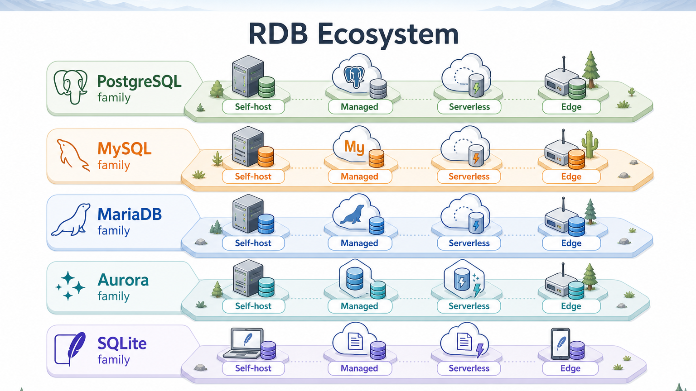
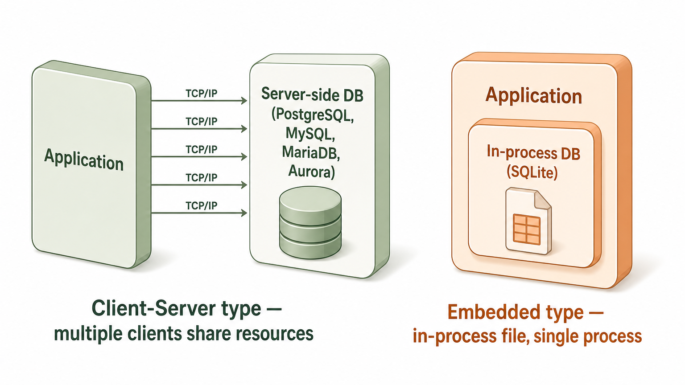
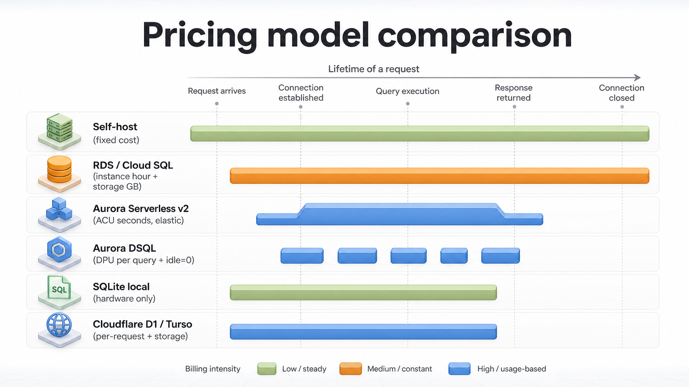
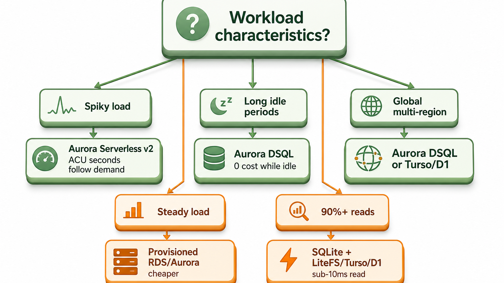
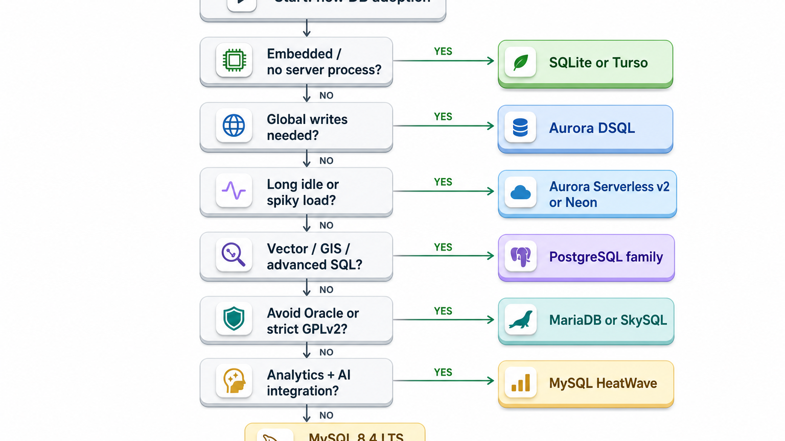
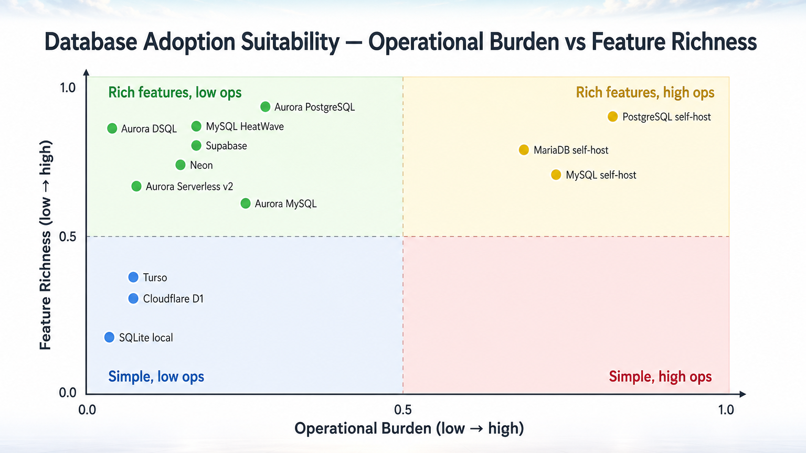

> PostgreSQL / MySQL / MariaDB / Amazon Aurora / SQLite の 5 大 RDB を横断比較。理念・機能マトリクス・サービス × 機能 早見表・ユースケース別 HowTo を 1 ドキュメントに集約。

---

## 0. TL;DR

### 各 DB の一行ポジショニング

| DB | 一行で言うと |
|---|---|
| **PostgreSQL** | ボランティア駆動の OSS、標準 SQL 準拠と拡張性で「何でも詰め込める」万能型 |
| **MySQL** | Oracle 主導の商用色強い OSS、Web 用途で世界最大の実装ベース |
| **MariaDB** | MySQL の永続フォーク、GPLv2 保証と独立イノベーション |
| **Amazon Aurora** | AWS マネージドのクラウドネイティブ RDB (MySQL/PostgreSQL 互換 + DSQL 新世代) |
| **SQLite** | ファイル代替の組込み DB、世界最デプロイ DB (デバイス上に偏在) |

### 旧知識との差分 (2024 以降の主要変化)

> **LLM の訓練データはここを取り違えやすい**。以下は明示的に上書きする:

| 項目 | 旧理解 (〜2023) | 2026-05 時点の実態 |
|---|---|---|
| MySQL バージョン | 8.0 が主流 | **8.0 は 2026-04 EOL**、**8.4 LTS** (2024 リリース) と **9.7 LTS** (2026-05 リリース) が現役 |
| MySQL のリリース戦略 | 年次メジャー | **Innovation + LTS の 2 軸**、9.x 系は Innovation、9.7 が初の 9.x LTS |
| MariaDB | MySQL 互換の代替 | バージョン 11.x で独立路線、optimizer / Storage Engine が大きく分岐 |
| Aurora | MySQL/Postgres 互換のマネージド | **Aurora DSQL** (2024 GA、サーバーレス分散 SQL) + **Aurora Serverless v2** が主流の二本柱 |
| Aurora 料金 | RDS 比 1.5x の固定 | DSQL は **DPU 課金**、Serverless v2 は **ACU 秒課金** で大幅に弾力的 |
| SQLite | プロトタイプ・モバイル専用 | **Turso/libSQL/Cloudflare D1/LiteFS** で本番分散デプロイ可能、Edge で再評価 |
| ベクトル DB | 専用 DB が必要 | **pgvector** (Postgres) + **HeatWave Vector** (MySQL) で既存 RDB に組込可能 |
| PostgreSQL | バージョン 15 が安定 | **17** が現役、**18** リリース済、**19 が 2026-09 予定** |

### 最大差別化点

```
PostgreSQL  → 拡張機能エコシステム (pgvector, PostGIS, TimescaleDB) と SQL 完全準拠
MySQL       → Oracle バックの商用サポート + HeatWave による分析・GenAI 統合
MariaDB     → GPLv2 永続保証 + 38% 高速 TPS (公称) + 15x 少ない CVE 件数
Aurora DSQL → 5-9s 可用性、active-active マルチリージョン、サーバーレス分散 SQL
SQLite      → サーバープロセス不要、KISS、edge で sub-10ms read
```

---

## 1. 5 DB の理念とミッション

### 1.1 PostgreSQL: 「ボランティア駆動 × 標準準拠」

> "PostgreSQL is a noncommercial, all volunteer, free software project with no formal list of feature requirements required for development."

- 1986 年 UC Berkeley の POSTGRES プロジェクト発祥
- ベンダー支配なし、PostgreSQL Global Development Group (PGDG) によるコミュニティガバナンス
- ANSI SQL 標準への準拠を強く重視 (MERGE, JSON_TABLE, WINDOW 関数等)
- 「全部 SQL でやる」哲学 (拡張機能でベクトル・地理・時系列まで包含)

### 1.2 MySQL: 「Web のデフォルト × Oracle 商用支援」

> "The world's most popular open source database"

- 1995 年 MySQL AB 創業、2008 Sun 買収、2010 Oracle 傘下
- Web/LAMP スタックのデフォルト DB として圧倒的シェア
- Innovation (機能追加重視) + LTS (安定性重視) の 2 軸リリース
- Enterprise Edition は商用機能 (HeatWave / Audit / TDE 等) を分離

### 1.3 MariaDB: 「Oracle 脱却 × GPLv2 永続保証」

> "MariaDB Foundation's governance structure provides a structural guarantee against proprietary re-licensing"

- 2009 年 MySQL 共同創業者 Monty Widenius が Oracle 買収を受けてフォーク
- MariaDB Foundation (非営利) によるガバナンスで proprietary 化を構造的に阻止
- 11.x で MySQL から独立、独自の Optimizer / Storage Engine
- 「Maria は娘の名前」 = 永続的に GPLv2 を守るという誓い

### 1.4 Amazon Aurora: 「クラウドネイティブ RDB」

> "Built for the cloud — separating compute from storage with 6-way replication"

- 2015 年 AWS が re:Invent で発表
- MySQL/PostgreSQL ワイヤープロトコル互換 + 独自のクラウドネイティブストレージ
- ストレージは 3 AZ × 2 = 6 way 複製、ログベース I/O
- DSQL (2024) で分散 SQL に進出、Spanner 系へ対抗

### 1.5 SQLite: 「KISS × ファイル代替」

> "Small. Fast. Reliable. Choose any three."
> "SQLite competes with fopen() — not with client/server databases"

- 2000 年 D. Richard Hipp 開発、Public Domain
- パブリックドメイン (商用利用完全自由)
- サーバープロセス・設定不要、1 ファイルで完結
- 世界で最も多くデプロイされた DB (Android/iOS/Chrome/Firefox/航空機システム等)

### 1.6 各 DB の哲学比較

| DB | ガバナンス | ライセンス | 開発主体 | 開発リズム |
|---|---|---|---|---|
| PostgreSQL | コミュニティ (PGDG) | PostgreSQL License (BSD 系) | ボランティア + Vendor 貢献 | 年次メジャー + 四半期マイナー |
| MySQL | Oracle 単独 | GPLv2 + 商用 | Oracle 社員中心 | Innovation 四半期 / LTS 年次 |
| MariaDB | MariaDB Foundation | GPLv2 (永続保証) | MariaDB Corp + Foundation | 半年ごと安定リリース |
| Aurora | AWS 単独 | AWS Proprietary | AWS 社員 | AWS の独自サイクル |
| SQLite | D. Richard Hipp + 少数 | Public Domain | Hipp + Hwaci 社 | 自由 (頻度高い) |

---

## 2. 全体マップ

### 2.1 RDB エコシステム俯瞰 (mindmap)



### 2.2 クライアント・サーバー型 vs 組込み型



---

## 3. デプロイ形態と運用モデル

### 3.1 デプロイ形態比較表

| 形態 | PostgreSQL | MySQL | MariaDB | Aurora | SQLite |
|---|---|---|---|---|---|
| Self-host (オンプレ・VM) | 利用可 | 利用可 | 利用可 | 不可 (AWS専用) | 利用可 |
| Docker / k8s | 利用可 | 利用可 | 利用可 | 不可 | 利用可 |
| マネージド (主要クラウド) | RDS / Cloud SQL / Supabase / Neon | RDS / Cloud SQL / HeatWave | RDS / SkySQL | RDS Aurora 系 | (該当なし) |
| サーバーレス | Aurora DSQL / Neon | Aurora Serverless v2 (MySQL) | 不可 | Aurora Serverless v2 / DSQL | (該当なし) |
| 組込み (in-process) | 不可 | 不可 | 不可 | 不可 | 利用可 |
| Edge 配信 | 制限あり (Neon Edge) | 不可 | 不可 | 制限あり (DSQL マルチリージョン) | 利用可 (D1 / Turso / LiteFS) |

### 3.2 ライセンス比較表

| DB | ライセンス | 商用利用 | プロプライエタリ再配布 | フォーク自由度 |
|---|---|---|---|---|
| PostgreSQL | PostgreSQL License (BSD 系) | 利用可 | 利用可 | 利用可 |
| MySQL Community | GPLv2 | 利用可 | 制限あり (GPL 影響) | 利用可 |
| MySQL Enterprise | 商用 | 利用可 (有償) | 利用可 (有償) | 不可 |
| MariaDB Community | GPLv2 (永続保証) | 利用可 | 制限あり | 利用可 |
| Aurora | AWS Service Terms | 利用可 (AWS 経由のみ) | 不可 | 不可 |
| SQLite | Public Domain | 利用可 | 利用可 | 利用可 |

### 3.3 料金モデル軸



---

## 4. 機能カタログ (機能 × DB マトリクス)

### 4.1 データ型

| 機能 | PostgreSQL | MySQL | MariaDB | Aurora MySQL | Aurora PG | SQLite |
|---|---|---|---|---|---|---|
| JSON | JSON + JSONB (バイナリ) | JSON (バイナリ) | JSON (= LONGTEXT 互換) | JSON (バイナリ) | JSON + JSONB | JSON1 拡張 |
| UUID | 利用可 (gen_random_uuid) | UUID() 関数のみ、型なし | UUID 型あり (10.7+) | MySQL と同等 | PG と同等 | TEXT/BLOB で代替 |
| Array | 利用可 (任意型の配列) | 不可 (JSON で代替) | 不可 | 不可 | 利用可 | 不可 |
| Geometry | PostGIS 拡張で完全対応 | 制限あり (Spatial) | 制限あり (Spatial) | 制限あり | PostGIS 利用可 | SpatiaLite 拡張 |
| Vector (AI) | pgvector で完全対応 | HeatWave Vector で対応 | 不可 (検討中) | PG: pgvector / MySQL: 不可 | pgvector 利用可 | sqlite-vec 拡張 |
| Range 型 | 利用可 (int4range 等) | 不可 | 不可 | 不可 | 利用可 | 不可 |
| Enum | 利用可 (CREATE TYPE) | 利用可 (制限あり) | 利用可 | 利用可 | 利用可 | 不可 |

### 4.2 トランザクション・同時実行

| 機能 | PostgreSQL | MySQL (InnoDB) | MariaDB (InnoDB) | Aurora | SQLite |
|---|---|---|---|---|---|
| MVCC | 利用可 (タプル多版) | 利用可 (Undo log 方式) | 利用可 | 利用可 | 利用可 (WAL モード) |
| 分離レベル | 4 レベル (RC が既定) | 4 レベル (RR が既定) | 4 レベル | 各互換と同等 | SERIALIZABLE 相当 |
| Savepoint | 利用可 | 利用可 | 利用可 | 利用可 | 利用可 |
| 行ロック | 利用可 | 利用可 | 利用可 | 利用可 | 制限あり (テーブル単位) |
| 楽観ロック | xmin システム列 | バージョン列で実装 | 同左 | 同左 | rowid で代替 |
| 同時書き込み | 高 | 高 | 高 | 高 (DSQL は分散) | 低 (1 writer / N reader) |

### 4.3 レプリケーション

| 機能 | PostgreSQL | MySQL | MariaDB | Aurora | SQLite |
|---|---|---|---|---|---|
| 物理レプリケーション | 利用可 (ストリーミング) | 不可 (論理のみ) | 不可 | 利用可 (6-way ストレージ) | LiteFS で対応 |
| 論理レプリケーション | 利用可 (Pub/Sub) | 利用可 (Binlog) | 利用可 (Binlog + GTID) | 利用可 | 不可 (Litestream で代替) |
| マルチマスター | BDR 等の拡張 | Group Replication | Galera Cluster | DSQL active-active | Turso で対応 |
| Logical Slot Failover | PG17 で利用可 | 利用可 | 利用可 | マネージド | 不可 |
| クロスリージョン | 拡張で対応 | 拡張で対応 | 拡張で対応 | Global Database / DSQL | Turso Edge replica |

### 4.4 拡張性 (Extension)

| 機能 | PostgreSQL | MySQL | MariaDB | Aurora | SQLite |
|---|---|---|---|---|---|
| 拡張機能 (CREATE EXTENSION) | 利用可 (数千) | 制限あり (Component) | 利用可 (Plugin) | PG 互換系は同等 | 利用可 (Loadable) |
| Foreign Data Wrapper | 利用可 (FDW) | FEDERATED Engine | CONNECT Engine | 利用可 | 不可 |
| カスタム関数 (C/Rust) | 利用可 | UDF | UDF | 制限あり | 利用可 |
| カスタム型 | 利用可 | 不可 | 制限あり | 利用可 | 不可 |
| ベクトル拡張 | pgvector | HeatWave Vector | 検討中 | pgvector (Aurora PG) | sqlite-vec |
| 時系列拡張 | TimescaleDB | 不可 | 不可 | 不可 | 不可 |
| 地理空間拡張 | PostGIS | Spatial (簡易) | Spatial (簡易) | PostGIS (Aurora PG) | SpatiaLite |

### 4.5 SQL 機能

| 機能 | PostgreSQL | MySQL 8.4+ | MariaDB 11.x | Aurora | SQLite |
|---|---|---|---|---|---|
| CTE (WITH) | 利用可 (再帰含む) | 利用可 | 利用可 | 利用可 | 利用可 |
| Window 関数 | 利用可 (フル) | 利用可 | 利用可 | 利用可 | 利用可 |
| MERGE 文 (SQL:2008) | 利用可 (PG15+) | 利用可 (8.0+ で部分) | 利用可 | 利用可 | 不可 |
| JSON_TABLE | 利用可 (PG17+) | 利用可 | 利用可 | 利用可 | 不可 |
| 共通 SQL 標準準拠度 | 高 | 中 | 中 | 各互換に準じる | 低 (簡略) |
| ストアドプロシージャ | PL/pgSQL + 多言語 (PL/Python, PL/R 等) | SQL/PSM | SQL/PSM + Oracle PL/SQL モード | 各互換と同等 | 不可 |
| マテリアライズドビュー | 利用可 | 不可 | 不可 | PG: 利用可 / MySQL: 不可 | 不可 |

### 4.6 パフォーマンス機能

| 機能 | PostgreSQL | MySQL | MariaDB | Aurora | SQLite |
|---|---|---|---|---|---|
| パーティショニング | 利用可 (宣言的) | 利用可 | 利用可 | 同左 | 不可 |
| インデックス種別 | B-tree / Hash / GIN / GiST / BRIN / SP-GiST / HNSW (pgvector) | B-tree / Hash / FullText | B-tree / Hash / FullText / RTree | 互換に準じる + 内部最適化 | B-tree のみ |
| 並列クエリ | 利用可 (PG10+) | 制限あり (8.0+ で一部) | 制限あり | 高度な並列 | 不可 |
| 並列バキューム | 利用可 | (該当なし) | (該当なし) | (該当なし) | (該当なし) |
| 列指向ストレージ | 拡張 (Citus 等) | HeatWave (OCI のみ) | ColumnStore | (該当なし) | 不可 |
| 自動チューニング | 制限あり | Optimizer ヒント | Optimizer ヒント | 高度な自動チューニング | 不可 |

### 4.7 運用機能

| 機能 | PostgreSQL | MySQL | MariaDB | Aurora | SQLite |
|---|---|---|---|---|---|
| 物理バックアップ | pg_basebackup / 拡張 | XtraBackup / mysqldump | mariabackup | 自動 (S3) | ファイルコピー |
| PITR (Point-In-Time-Recovery) | WAL アーカイブ | Binlog から | Binlog から | 自動 (5 分粒度) | WAL ファイル |
| 増分バックアップ | PG17 で標準対応 | XtraBackup 拡張 | mariabackup 拡張 | 自動 (継続的) | 不可 |
| オンライン DDL | 制限あり (拡張で改善) | INSTANT/INPLACE | INSTANT/INPLACE | 同左 | 制限あり |
| pg_stat_statements 等の監視 | 利用可 | Performance Schema | Performance Schema | CloudWatch 統合 | EXPLAIN のみ |

### 4.8 セキュリティ

| 機能 | PostgreSQL | MySQL | MariaDB | Aurora | SQLite |
|---|---|---|---|---|---|
| RBAC (ロール) | 利用可 | 利用可 | 利用可 | 利用可 | 不可 (アプリ層) |
| Row Level Security | 利用可 | 不可 | 不可 | PG: 利用可 / MySQL: 不可 | 不可 |
| TDE (透過的暗号化) | 拡張 / マネージドで対応 | Enterprise / RDS | MariaDB 単体で対応 | 利用可 | 拡張 (SEE) |
| 監査ログ | 拡張 (pgaudit) | Enterprise Audit | MariaDB Audit Plugin | CloudTrail / Audit | 不可 (アプリ層) |
| 動的データマスキング | 拡張 | Enterprise / 9.x | 利用可 | 同左 | 不可 |
| IAM 認証 | マネージドで対応 | 同左 | 同左 | 利用可 | (該当なし) |

### 4.9 AI / ベクトル機能

| 機能 | PostgreSQL | MySQL | MariaDB | Aurora | SQLite |
|---|---|---|---|---|---|
| ベクトル型 | pgvector で完全対応 (halfvec/sparsevec/bit) | HeatWave Vector | 検討中 | Aurora PG: pgvector / MySQL: 不可 | sqlite-vec |
| ANN 検索 | HNSW / IVFFlat / DiskANN | HeatWave 自動 Vector Index | 不可 | 同左 | sqlite-vec で対応 |
| 埋め込み生成 | 外部 API 呼び出し | HeatWave LLM 内蔵 | 不可 | Bedrock 連携 | 外部 API |
| RAG 統合 | LangChain / LlamaIndex で対応 | HeatWave GenAI 統合 | 不可 | Bedrock RAG | 外部 |
| In-DB LLM | 不可 | HeatWave (Llama 3 等) | 不可 | 不可 | 不可 |

---

## 5. プラン × 機能 早見表 (主要サービス形態 一覧)

> 縦軸 = 実際の提供形態、横軸 = 主要機能カテゴリ。**OSS の素の機能 + マネージド固有機能** の両方を横断比較する。

| サービス形態 | デプロイ | ベクトル | 自動スケール | マルチリージョン | サーバーレス | 増分バックアップ | 料金粒度 |
|---|---|---|---|---|---|---|---|
| PostgreSQL 17 self-host | 自前 | pgvector で対応 | 不可 | 拡張 (BDR/Citus) | 不可 | 利用可 (PG17 標準) | インフラ固定費 |
| AWS RDS for PostgreSQL | マネージド | pgvector | Storage 自動 | Read Replica | 不可 | 自動 | インスタンス時間 |
| Aurora PostgreSQL | マネージド | pgvector | Storage 自動 | Global Database | Serverless v2 で対応 | 自動 (継続) | ACU 秒 or インスタンス時間 |
| **Aurora DSQL** | サーバーレス分散 | pgvector | 完全自動 | Active-active 5-9s | 利用可 | 自動 | DPU per query |
| Neon | サーバーレス | pgvector | branch / autoscale | 利用可 | 利用可 | 自動 | 計算 + ストレージ |
| Supabase | マネージド | pgvector | 利用可 | 制限あり | 制限あり | 自動 | プラン固定 |
| MySQL 8.4 / 9.7 self-host | 自前 | 不可 (Community) | 不可 | 拡張 | 不可 | XtraBackup | インフラ固定費 |
| AWS RDS for MySQL | マネージド | 不可 | Storage 自動 | Read Replica | 不可 | 自動 | インスタンス時間 |
| Aurora MySQL | マネージド | 不可 | Storage 自動 | Global Database | Serverless v2 で対応 | 自動 | ACU 秒 or インスタンス時間 |
| **MySQL HeatWave (OCI)** | マネージド | HeatWave Vector | 利用可 | 利用可 | 自動 | 自動 | OCPU 時間 ($0.3536〜) |
| MariaDB 11.x self-host | 自前 | 不可 | 不可 | Galera/MaxScale | 不可 | mariabackup | インフラ固定費 |
| SkySQL | マネージド | 不可 | 利用可 | 利用可 | 不可 | 自動 | プラン固定 |
| AWS RDS for MariaDB | マネージド | 不可 | Storage 自動 | Read Replica | 不可 | 自動 | インスタンス時間 |
| SQLite (local file) | ローカル | sqlite-vec | (該当なし) | (該当なし) | (該当なし) | ファイルコピー | 無料 |
| **Cloudflare D1** | エッジ分散 | 制限あり | 自動 | 利用可 (グローバル) | 利用可 | 自動 | リクエスト数 + ストレージ |
| **Turso (libSQL)** | エッジ分散 | 利用可 (libsql-vector) | 利用可 | Embedded replicas | 利用可 | 自動 | リクエスト数 + ストレージ |
| LiteFS (Fly.io) | エッジ分散 | sqlite-vec | 利用可 | 利用可 | 制限あり | 自動 | Fly.io 計算 |

---

## 6. 料金体系の詳細

### 6.1 OSS 自己ホスト

| DB | ライセンス料 | 必要なもの |
|---|---|---|
| PostgreSQL | 0 円 | ハードウェア + 運用人件費 |
| MySQL Community | 0 円 | 同上 |
| MariaDB | 0 円 | 同上 |
| SQLite | 0 円 | アプリプロセス内で動く (追加コスト 0) |

### 6.2 マネージド主要料金

| サービス | 料金単位 | 例 (US East) |
|---|---|---|
| AWS RDS for PostgreSQL | インスタンス時間 + ストレージ | db.t4g.medium $0.073/h + gp3 $0.115/GB-month |
| AWS RDS for MySQL | 同上 | 同上 |
| Aurora MySQL/PG (provisioned) | インスタンス時間 + I/O or I/O-Optimized | db.r7g.large $0.29/h + I/O 課金 |
| **Aurora Serverless v2** | ACU 秒 | $0.12/ACU-h (1 ACU ≒ 2 GiB RAM) |
| **Aurora DSQL** | DPU + ストレージ | $8/M DPU + $0.33/GB-month、月 100K DPU + 1GB 無料 |
| MySQL HeatWave (OCI) | OCPU 時間 | $0.3536/h〜 |
| Neon | 計算 + ストレージ | Free / Pro $19/月〜 |
| Supabase | プラン固定 | Free / Pro $25/月〜 |
| Cloudflare D1 | リクエスト + ストレージ | 25 M read/月無料、500 K write/月無料 |
| Turso | リクエスト + ストレージ | Free 9 GB / Pro $29/月 |

### 6.3 競合との料金構造の違い



### 6.4 コスト最適化の勘所

1. **アイドルが長い**: Aurora DSQL (アイドル 0 円) or Neon (スケールゼロ)
2. **スパイクが激しい**: Aurora Serverless v2 (秒単位 ACU)
3. **定常負荷**: プロビジョンドインスタンス (Serverless より 20-40% 安い)
4. **読み 9 割**: Edge SQLite (Turso/D1) で CDN 並のレイテンシ
5. **分析併用**: MySQL HeatWave (OLTP + OLAP + AI 統合で ETL 不要)
6. **ライセンスコスト警戒**: MariaDB (GPLv2 永続) or PostgreSQL (BSD 系)

---

## 7. HowTo: どういう場合にどれを選ぶか

### 7.1 ユースケース別 Decision Matrix

| ユースケース | 第一候補 | 第二候補 | 理由 |
|---|---|---|---|
| **スマホアプリのローカル DB** | SQLite | (該当なし) | サーバープロセス不要、組込 |
| **オフライン対応 PWA / Local-first** | SQLite + Turso | Cloudflare D1 | Embedded replica で 0ms read |
| **CLI ツール / デスクトップアプリ** | SQLite | (該当なし) | 配布ファイル 1 個 |
| **WordPress / LAMP / EC** | MySQL 8.4 LTS | MariaDB 11.x | 互換性とエコシステム |
| **既存 MySQL からの脱却 (Oracle 回避)** | MariaDB 11.x | PostgreSQL | ほぼドロップイン互換 |
| **地理空間 (GIS) アプリ** | PostgreSQL + PostGIS | (該当なし) | 業界標準、300+ 空間関数 |
| **高度な SQL / 解析 SQL** | PostgreSQL | MariaDB | ウィンドウ・MERGE・CTE 完全対応 |
| **RAG / ベクトル検索 (AI)** | PostgreSQL + pgvector | MySQL HeatWave | 既存 RDB に統合可能 |
| **グローバル マルチリージョン書込み** | Aurora DSQL | (該当なし) | active-active 5-9s 可用性 |
| **トラフィック スパイク (キャンペーン等)** | Aurora Serverless v2 | Neon | ACU 秒課金で追従 |
| **AWS 完結のスタートアップ** | Aurora Serverless v2 / DSQL | RDS | マネージド + 弾力性 |
| **オンプレ中心の大企業** | PostgreSQL / MariaDB | (該当なし) | 自己ホスト + GPLv2 安全 |
| **分析 + トランザクション統合** | MySQL HeatWave | PostgreSQL + Citus | HTAP、ETL 不要 |
| **In-Database LLM** | MySQL HeatWave (GenAI) | (該当なし) | Llama 3 内蔵 |
| **時系列データ (IoT/メトリクス)** | PostgreSQL + TimescaleDB | (該当なし) | 圧縮 + 連続集計 |
| **Edge / CDN 配信 (読み中心)** | Cloudflare D1 / Turso | LiteFS | Sub-10ms グローバル read |
| **Salesforce 連携バッファ DB** | Aurora PostgreSQL | RDS for PostgreSQL | マネージド + 高可用 |
| **コスト最小の MVP** | SQLite (Turso Free) | Supabase Free / Neon Free | 0 円スタート |
| **ベンダーロックイン回避** | PostgreSQL | MariaDB | 標準 SQL + OSS |
| **PCI DSS / SOC2 要件** | RDS / Aurora / Supabase | (要件依存) | マネージドで監査統合 |

### 7.2 業務領域別の典型例 (ClassLab. 文脈)

| 業務領域 | 想定 DB | 理由 |
|---|---|---|
| Salesforce 外部キャッシュ / バッファ | Aurora PostgreSQL | マネージド + Heroku Connect 互換 |
| ライフライン契約代行のサブシステム | RDS for MySQL or Aurora MySQL | Web 系標準、過去資産流用 |
| 通話ログ・録音メタデータ | PostgreSQL + TimescaleDB | 時系列大量データ |
| エンジニア採用サイトのコンテンツ | SQLite + Turso or Supabase | 読み中心、低コスト |
| AI ナレッジ検索 (RAG) | PostgreSQL + pgvector | 既存 RDB を流用しつつベクトル拡張 |
| 経費精算・社内 SaaS | Aurora Serverless v2 | スパイク負荷、夜間アイドル |
| モバイルアプリのオフライン DB | SQLite | 標準、組込 |

---

## 8. 採用判断フロー

### 8.1 質問駆動の選定フロー



### 8.2 採用適性 Quadrant



---

## 9. ClassLab. での想定活用ロードマップ (汎用例)

### 9.1 短期 (〜3ヶ月)

| 活用候補 | 推奨 DB | 期待効果 |
|---|---|---|
| 既存 Salesforce 外部システムの DB 棚卸し | (現状確認) | 統一基準を持つ |
| 新規 MVP / 社内ツール | Supabase / Neon / Turso | サーバーレスで素早く立ち上げ |
| AI ナレッジ検索 PoC | Postgres + pgvector | RAG 統合の検証 |
| 経費・申請系のサブシステム | Aurora Serverless v2 PG | 日中スパイク・夜間アイドル |

### 9.2 中長期 (3〜12ヶ月)

| 活用候補 | 推奨 DB | 期待効果 |
|---|---|---|
| ライフライン事業の周辺 DB 統合 | Aurora MySQL | マネージド + 既存資産 |
| Salesforce バッファ DB | Aurora PostgreSQL | Heroku Connect 連携 |
| マルチリージョン読み込み (BCP) | Aurora DSQL | active-active で災害対策 |
| 通話・録音ログ集積 | PostgreSQL + TimescaleDB | 時系列圧縮で長期保管 |
| エッジ API のローカルキャッシュ | Turso / D1 | sub-10ms 応答 |
| 社内 AI チャット (Slack 統合) | Postgres + pgvector | 既存資料の RAG |

### 9.3 既存資産棚卸しの観点

- Salesforce 内部で完結する場合は RDB 採用不要 → 採用判断の最初の質問
- 既存に RDS for MySQL があるなら、新規も MySQL 系で揃えてオペレーション集約
- 既存に PostgreSQL があるなら、ベクトル・地理空間・時系列で pgvector / PostGIS / TimescaleDB の追加検討

---

## 10. 公式リファレンス & Sources

### 公式ドキュメント

- **PostgreSQL**: https://www.postgresql.org/docs/
- **PostgreSQL Roadmap**: https://www.postgresql.org/developer/roadmap/
- **MySQL**: https://dev.mysql.com/doc/
- **MySQL HeatWave**: https://www.mysql.com/products/heatwave/
- **MariaDB**: https://mariadb.org/documentation/
- **Amazon Aurora**: https://aws.amazon.com/rds/aurora/
- **Aurora DSQL**: https://aws.amazon.com/rds/aurora/dsql/
- **SQLite**: https://sqlite.org/docs.html
- **Turso (libSQL)**: https://docs.turso.tech/
- **Cloudflare D1**: https://developers.cloudflare.com/d1/

### 機能別ドキュメント

- pgvector: https://github.com/pgvector/pgvector
- PostGIS: https://postgis.net/
- TimescaleDB: https://docs.timescale.com/
- MySQL Releases (Innovation / LTS): https://dev.mysql.com/doc/refman/9.1/en/mysql-releases.html
- MariaDB vs MySQL: https://mariadb.com/reference/mariadb-vs-mysql-comparison-guide-enterprise-features-security-2026/
- Aurora DSQL pricing: https://aws.amazon.com/rds/aurora/dsql/pricing/

### 参照 Web Sources

- [PostgreSQL: Roadmap](https://www.postgresql.org/developer/roadmap/)
- [PostgreSQL 17 Features You Should Actually Be Using](https://devstarsj.github.io/database/postgresql/backend/2026/03/16/postgresql17-features-you-should-use-2026/)
- [MySQL Releases: Innovation and LTS](https://dev.mysql.com/doc/refman/9.1/en/mysql-releases.html)
- [MySQL 9.7: First Major LTS Since 8.4 - InfoQ](https://www.infoq.com/news/2026/05/mysql-97-lts/)
- [MySQL EOL Notice](https://www.mysql.com/support/eol-notice.html)
- [MariaDB vs MySQL — 8 reasons developers are switching in 2026](https://dev.to/piteradyson/mariadb-vs-mysql-8-reasons-developers-are-switching-in-2026-19cg)
- [MariaDB vs MySQL Comparison Guide 2026](https://mariadb.com/reference/mariadb-vs-mysql-comparison-guide-enterprise-features-security-2026/)
- [Amazon Aurora DSQL Pricing](https://aws.amazon.com/rds/aurora/dsql/pricing/)
- [Aurora Serverless v2: Features and Pricing - Dash0](https://www.dash0.com/knowledge/aws-aurora-serverless)
- [SQLite: Appropriate Uses For SQLite](https://sqlite.org/whentouse.html)
- [The SQLite Renaissance 2026](https://dev.to/pockit_tools/the-sqlite-renaissance-why-the-worlds-most-deployed-database-is-taking-over-production-in-2026-3jcc)
- [Distributed SQLite: Why LibSQL and Turso are the New Standard in 2026](https://dev.to/dataformathub/distributed-sqlite-why-libsql-and-turso-are-the-new-standard-in-2026-58fk)
- [pgvector 0.7.0 Released - PostgreSQL News](https://www.postgresql.org/about/news/pgvector-070-released-2852/)
- [Introducing Vector Store and Generative AI in MySQL HeatWave](https://blogs.oracle.com/mysql/introducing-vector-store-and-generative-ai-in-mysql-heatwave)

---

> 本ドキュメントは ClassLab. システム事業部の RDB 採用判断資料として 2026-05-25 時点で作成。
> 各 DB の最新情報は公式ドキュメントを必ず参照のこと。
