> ClassLab. エンジニア向け GitHub リファレンス。「なぜ存在するか → 何ができるか → 自社でどう使うか」を 1 本で完結させる。世界最大の開発者プラットフォーム — ソースコード管理 / CI/CD / セキュリティ / AI コーディング / プロジェクト管理を 1 アカウントで横断的に提供する、Microsoft 傘下のサービス。

---

## 0. TL;DR

### 一行サマリ

「Git ホスティング」ではなく「リポジトリを中心に CI/CD・セキュリティ・AI エージェント・プロジェクト管理を束ねる開発者プラットフォーム」。1 億人超の開発者 / 4.2 億超のリポジトリを抱える事実上の業界標準。

### 旧知識との差分（2025〜2026 の主要アップデート）

- **Copilot は usage-based billing に完全移行する**（2026-06-01）。従来の「Premium Requests 数」課金から、`GitHub AI Credits` 月次枠 + 超過従量への一本化。
- **Copilot のデフォルトモデルが GPT-5.3-Codex に変更**（2026 春）。Business / Enterprise の base model が GPT-4.1 から切り替わった。
- **Claude Opus 4.7 が Copilot Pro+ / Business / Enterprise で一般提供**。Copilot 内でも Claude モデル選択が可能。
- **Copilot Coding Agent は GA**（GitHub 上で非同期に PR を生成する agent）。code scanning / secret scanning / dependency vulnerability check が agent 内蔵。
- **Copilot Spaces API が GA**。コンテキスト共有空間 (Spaces) を REST API から CRUD 可能。
- **Project Padawan**（GitHub の自律エージェント構想）= Issue 割り当てだけで完結する次世代 Copilot の codename。
- **GitHub Spark が一般展開**。プロンプト → アプリ自動生成 (Pro+ / Enterprise) で Vercel v0 / Cursor 系と直接競合。
- **self-hosted runners が private リポジトリでも有料化**（2026-03 から $0.002/min）。従来「無料」の前提は崩れた。
- **GitHub-hosted runner が最大 39% 値下げ**（2026-01）。4-vCPU "Standard" runner が 2024 年の 2-vCPU と同価格。
- **Copilot code review が agentic 化**（2026-03）— PR 全文脈を取り込み、修正 PR を Coding Agent に自動委譲できる。
- **Models 機能（GitHub Models）が拡張** — OpenAI / Anthropic / Mistral / Meta 等のモデルを GitHub Token で叩く inference エンドポイントが本格化。

### 最大差別化点

- **GitLab** に対しては「世界最大の開発者ネットワーク / Marketplace 規模 / Copilot の完成度」で勝つ。逆に GitLab は単一アプリケーションで DevSecOps 完結性が強い。
- **Bitbucket** に対しては「単体での機能完全性 / OSS エコシステム / AI ネイティブ」で勝つ。Bitbucket は Jira/Confluence 連携が圧倒的。
- **Azure DevOps** に対しては「OSS 文化 / モダン UI / Copilot 統合」で勝つ。Azure DevOps は Microsoft エンタープライズ既存環境との結合が深い。
- **AWS CodeCatalyst** に対しては「成熟度 / Marketplace / 利用企業規模」で圧勝。CodeCatalyst は AWS リソース連携のみ強みで、市場シェアは限定的。

---

## 1. GitHub とは何か — 理念とミッション

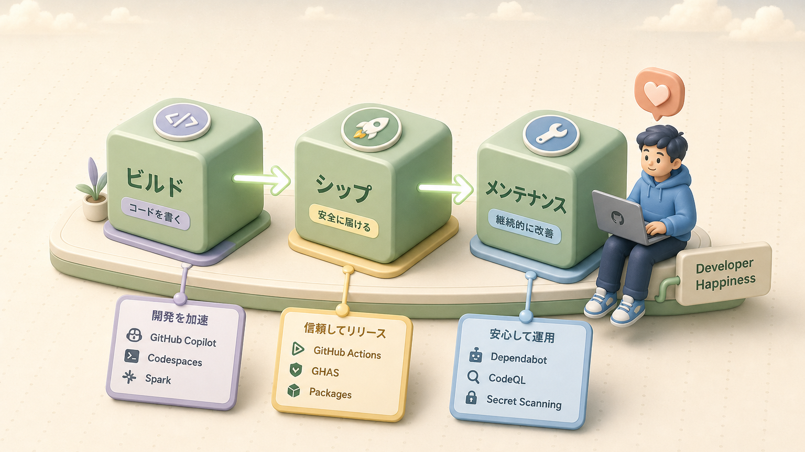

### 1.1 ミッション

公式表現（要旨）:

> *"To be the home for all developers"* — すべての開発者の home となること。

その根底に Thomas Dohmke (前 CEO, 2021〜2025) が掲げた **"Developer Happiness"** がある。Copilot 開発の第一義として「developer happiness scores」を社内最重要 KPI として扱ったと公言している。

### 1.2 哲学

| 発言者 | 立場 | 哲学・要旨 |
|---|---|---|
| Thomas Dohmke (前 CEO) | 元 Microsoft GitHub CEO | "AI は開発者を置き換えるのではなく、創造的な余白を与え、フロー状態に導く" |
| Thomas Dohmke | 同上 | "developer happiness の向上が最大の成果。Copilot 利用者は fulfilled / satisfied / happy と回答する" |
| Mario Rodriguez (Chief Product Officer) | Copilot プロダクト責任者 | "agentic DevOps loop — Issue → Coding Agent → PR → Code Review → Merge → Deploy をすべて agent で完結させる" |
| 公式 | プラットフォーム哲学 | "Octocat の OSS カルチャー + エンタープライズ最高水準のセキュリティ。両立は不可分" |
| 公式 | エンジニアリング哲学 | "build → ship → maintain の全工程をリポジトリを中心に置く (everything anchored to the repo)" |

### 1.3 なぜ存在するか

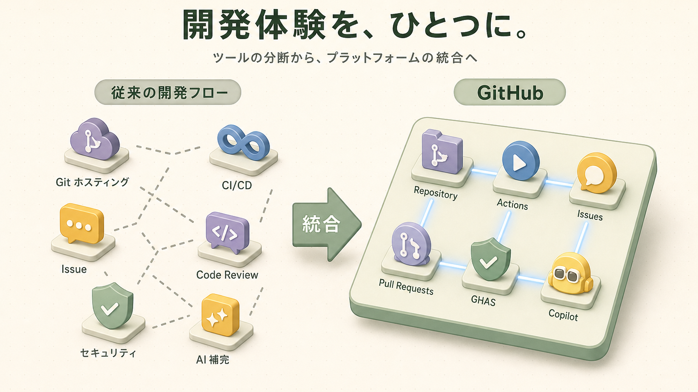

「バラバラに最適化されたツール群を統合する」がレゾンデートル。Microsoft 買収 (2018) 以降、エンタープライズ要件 (SAML / SCIM / Audit Log / Compliance) を満たしながら OSS カルチャーを保つことに振り切った。

### 1.4 エンジニアにとっての意味

| 立場 | GitHub をどう使うか |
|---|---|
| フロントエンド | Pages / Vercel 等への連携、Codespaces で即座にプレビュー、Copilot Chat で UI 改善、Storybook + Chromatic で視覚回帰 |
| バックエンド | Actions で test → build → deploy、Packages (npm/Docker)、Dependabot で依存性更新、CodeQL で脆弱性検出 |
| SRE / プラットフォーム | Self-hosted Runner (ARC on Kubernetes)、Environments + Required Reviewers、Audit Log、Webhook → 内製基盤連携 |
| AI / ML エンジニア | GitHub Models で推論、Copilot Coding Agent に LLM タスクを委譲、Spark で内製ツール内製化 |
| プロジェクトマネージャ | Projects v2 (テーブル/ボード/ロードマップ)、Issue forms、Milestones、Insights、Discussions で意思決定ログ |
| セキュリティ / コンプライアンス | Advanced Security、Secret Scanning（push protection）、SAML/SSO、SCIM、Audit Log API、Enterprise Server (オンプレ) |
| QA / テスト | Actions matrix で OS × バージョン横断、Playwright/Cypress action、PR ベースの test report、Coverage 集計 |
| 採用 / DevRel | プロファイル、貢献度グラフ、Sponsors、Discussions、Stars、GitHub Education |

---

## 2. 全体マップ（1 枚絵）

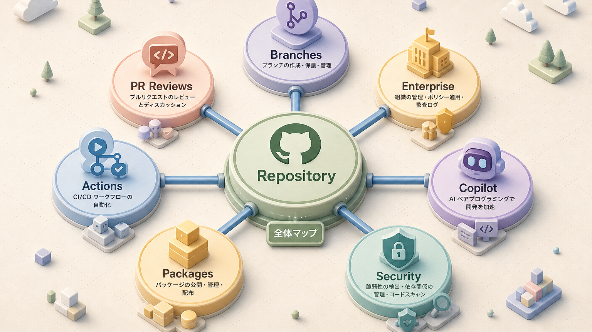

### 2.1 サービス全体俯瞰

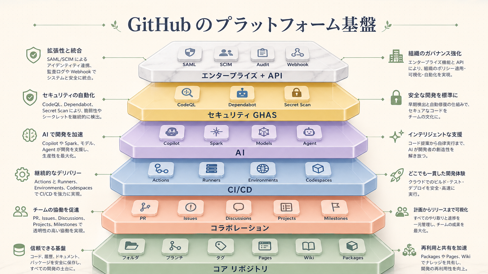

### 2.2 製品カテゴリ mindmap

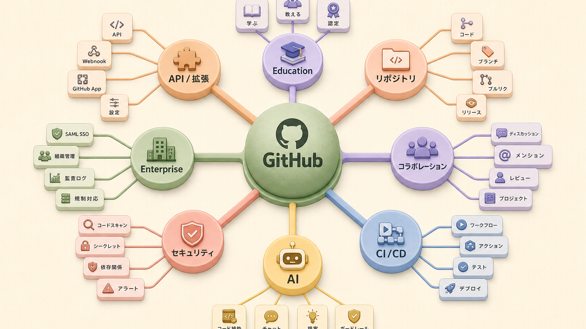

---

## 3. プラン体系の前提知識

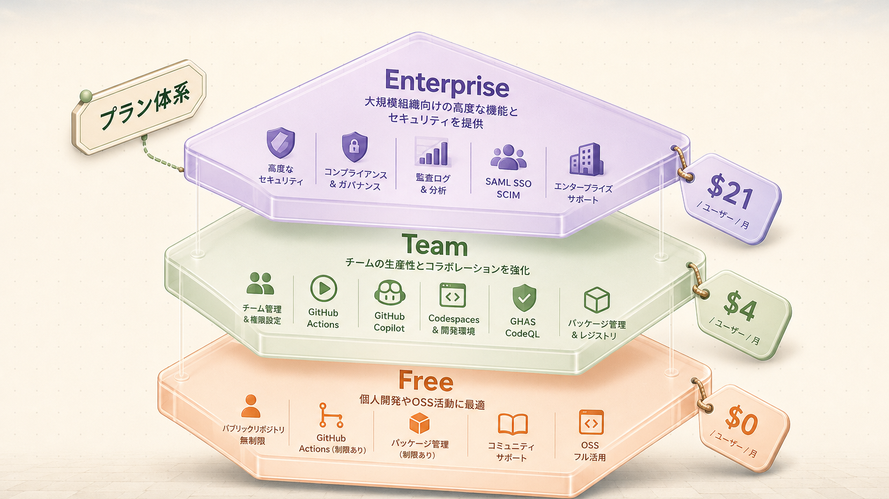

### 3.1 プラン概要表

#### プラットフォーム本体プラン

| 観点 | Free | Team | Enterprise Cloud | Enterprise Server (self-hosted) |
|---|---|---|---|---|
| 価格 | $0 | $4 / user / 月 | $21 / user / 月 | Enterprise Cloud 同等 + サポート費 |
| 対象 | 個人 / 公開 OSS / 小規模 private | スタートアップ / 中小チーム | 大企業 / 規制業種 / 高セキュリティ要件 | オンプレ運用必須の組織 / 機密度極大 |
| プライベートリポジトリ | 無制限 (ただし高度機能なし) | 無制限 | 無制限 | 無制限 |
| Actions 無料分 | 2,000 min/月 | 3,000 min/月 | 50,000 min/月 | self-host (実質無料) + GitHub-hosted は別料金 |
| Packages 無料分 | 500MB / 1GB 転送 | 2GB / 10GB 転送 | 50GB / 100GB 転送 | self-host (実質無料) |
| Codespaces 無料分 | 60h/月 (Free 個人) | 含まれず（個別課金） | 含まれず（個別課金） | サポート対象外 |
| SAML SSO | × | × | ◯ | ◯ |
| SCIM | × | × | ◯ | ◯ |
| Audit Log streaming | × | × | ◯ | ◯ |
| Required Reviewers | △ (public のみ) | ◯ | ◯ | ◯ |
| Advanced Security | 別料金 | 別料金 | 別料金 ($30/active committer) | 別料金 |
| サポート SLA | コミュニティ | Web | 24/7 Premium / Premium Plus | Premium / Premium Plus |

#### Copilot プラン

| 観点 | Free | Pro | Pro+ | Business | Enterprise |
|---|---|---|---|---|---|
| 価格 | $0 | $10/月 or $100/年 | $39/月 | $19 / user / 月 | $39 / user / 月 (+ Enterprise Cloud $21 必須) |
| 対象 | 個人カジュアル | 個人プロ | 個人ヘビーユーザ (agent モード常用) | チーム標準 | 大企業 / カスタムモデル要件 |
| Code Completion | 2,000 / 月 | 無制限 | 無制限 | 無制限 | 無制限 |
| Premium Requests | 50 / 月 | 一定枠 | 大枠 | 一定枠 | 大枠 |
| Chat (IDE) | ◯ | ◯ | ◯ | ◯ | ◯ |
| Chat (GitHub.com) | × | ◯ | ◯ | ◯ | ◯ |
| Agent Mode | × | ◯ | ◯ | ◯ | ◯ |
| Coding Agent (非同期) | × | ◯ (一部) | ◯ | ◯ | ◯ |
| Copilot Spaces | × | ◯ | ◯ | ◯ | ◯ |
| GitHub Spark | × | × | ◯ | × | ◯ |
| Custom Models / Fine-tuning | × | × | × | × | ◯ |
| Knowledge Bases | × | × | × | × | ◯ |
| Organization Policy | × | × | × | ◯ | ◯ |
| 課金モデル | request-based → 2026-06-01 から **AI Credits + 従量** に統一移行 | 同上 | 同上 | 同上 | 同上 |

### 3.2 課金モデルの考え方

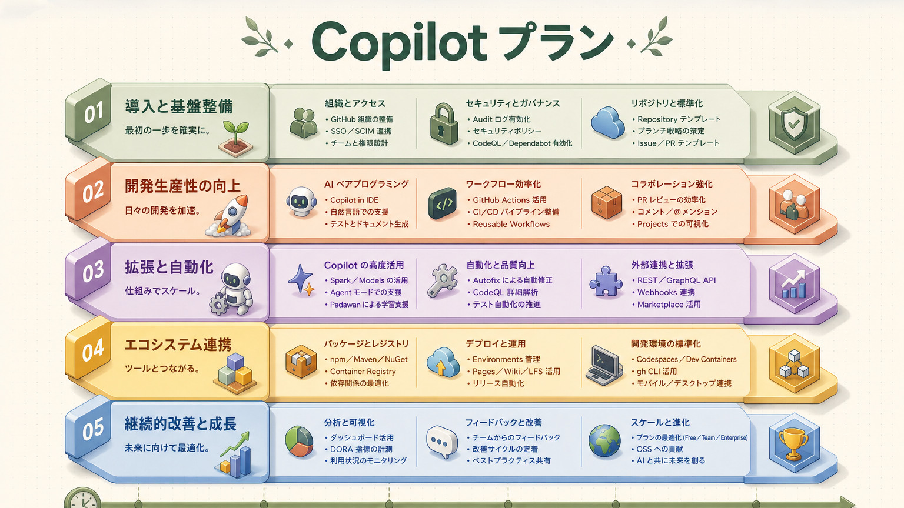

**重要な軸:**
1. **per-seat** (Copilot Business/Enterprise, Team, Enterprise Cloud) — 人数 × 単価
2. **per-active-committer** (Advanced Security) — 実際に commit したユニーク人数
3. **per-minute / per-hour** (Actions, Codespaces) — プラン無料枠 + 超過従量
4. **per-GB / per-transfer** (Packages, LFS) — ストレージ + 帯域
5. **per-credit** (Copilot 2026-06 以降 / Models) — AI Credits の月額枠 + 超過従量

### 3.3 本ドキュメント内のプラン表記凡例

- **利用可** : プランに含まれる
- **制限あり** : 利用可だが上限・機能差あり
- **不可** : このプランでは使えない
- **従量課金** : プランに枠あり + 超過は追加料金

---

## 4. 機能カタログ

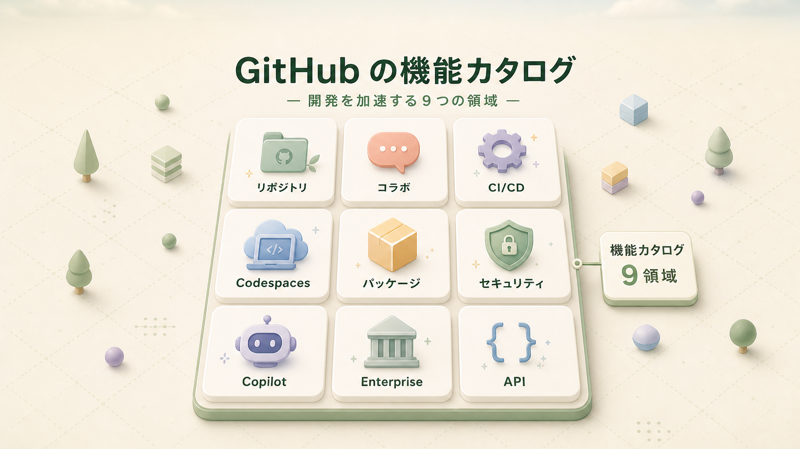

### 4.1 リポジトリ層

#### 4.1.1 Repository / Git / LFS

**🎯 概要**

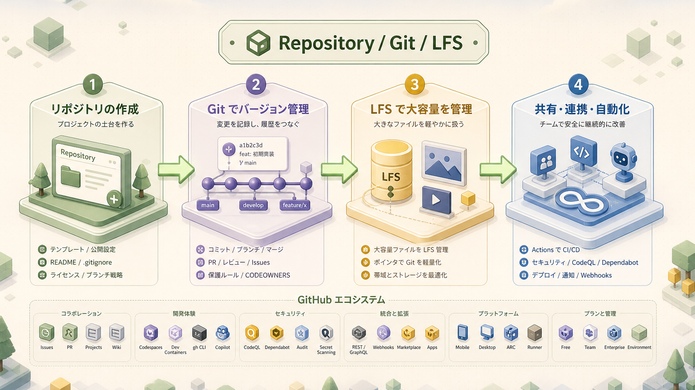

Git ホスティング本体。LFS で動画・モデルファイル等の大容量バイナリも管理。

**👨‍💻 エンジニアへの関係**

すべての雑務の起点。リポジトリ単位で権限・CI/CD・セキュリティ機能が紐づく。LFS は機械学習モデル・デザインアセット・動画素材を含む案件で必須。

**💳 利用可能プラン**

| Free | Team | Enterprise Cloud | Enterprise Server |
|:-:|:-:|:-:|:-:|
| 利用可 | 利用可 | 利用可 | 利用可 |

> LFS は別途従量課金 (1 GB / 1 GB 帯域 まで無料、超過は data pack 購入)。

**🏢 ClassLab. での活用**

- 短期: ライフライン事業の各バックエンド / LP / 業務スクリプトをすべて GitHub repo に集約。LFS は採用素材・動画素材で利用。
- 中長期: monorepo 化 + path filter で Actions を分割実行。

**🔥 差別化点**

- 公開リポジトリ数 4.2 億 (世界最大)。
- OSS との地続き感（fork / star / discussion）。
- GitLab/Bitbucket と比べて UI のレスポンスとプロファイル動線が圧倒的。

**🔍 深掘り**

- `gh repo create --template` でテンプレ展開。
- branch protection は organization policy で一括強制可。
- repository ruleset (新世代) で複数 repo に横串でルール適用。

**⚠️ 注意点**

- LFS bandwidth は静かに溶ける。Cloudflare R2 等の外部ストレージへの逃がしも検討。
- Default branch 名は組織でデフォルトを `main` に固定するべき。

---

#### 4.1.2 Branches / Branch Protection / Rulesets

**🎯 概要**

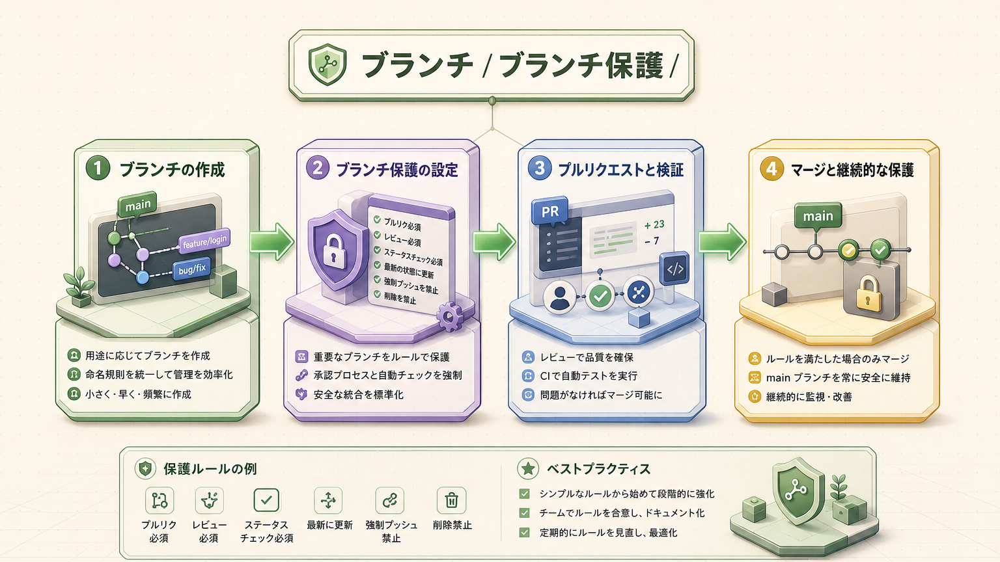

ブランチへの直接 push を禁止し、PR + 各種ゲートを必須化する仕組み。新世代の **Rulesets** で複数 repo にまたがる横串ポリシー化が可能。

**👨‍💻 エンジニアへの関係**

事故防止の最重要設定。`main` への直接 push、force-push、削除、approvals 不足を組織レベルで禁止する。

**💳 利用可能プラン**

| Free | Team | Enterprise Cloud | Enterprise Server |
|:-:|:-:|:-:|:-:|
| 制限あり (public のみ強制可) | 利用可 | 利用可 | 利用可 |

**🏢 ClassLab. での活用**

- 短期: `main` を `require PR + 1 approval + status checks (lint/test/typecheck)` で固定。signed commits を全 repo で必須化。
- 中長期: organization ruleset で「すべての本番 repo は 2 approvals + CodeQL pass」を一括強制。

**🔥 差別化点**

- Rulesets は GitLab の protected branches より柔軟（複数 repo にまたがる）。
- merge queue (後述) と組み合わせて競合解消を自動化。

**🔍 深掘り**

- `bypass list` で「緊急時に admin だけ通す」可能。
- `evaluate` モードで本適用前にドライラン可能。

**⚠️ 注意点**

- `Allow specified actors to bypass` は監査対象。Audit Log にしっかり残るが、誰でも bypass できる状態は禁止すべき。

---

#### 4.1.3 Tags / Releases

**🎯 概要**

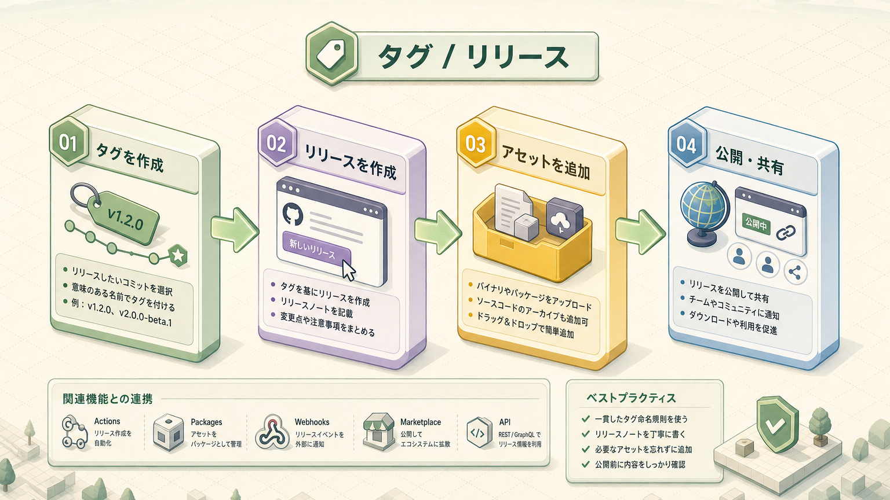

タグに紐づくバイナリ配布 + リリースノート + workflow トリガ。

**👨‍💻 エンジニアへの関係**

OSS 配布、Electron / モバイルアプリのバイナリ配布、Docker タグの起点として使う。Release Drafter / release-please で自動化可。

**💳 利用可能プラン**

| Free | Team | Enterprise Cloud | Enterprise Server |
|:-:|:-:|:-:|:-:|
| 利用可 | 利用可 | 利用可 | 利用可 |

**🏢 ClassLab. での活用**

- 業務スクリプト / 内製ツールの semver 配布。
- Salesforce デプロイパッケージの artifact 配布起点。

**🔥 差別化点**

- Release Notes の自動生成が PR title / label から自動構成され、Bitbucket / Azure DevOps より UI が良い。

**🔍 深掘り**

- `actions/create-release` 系 action でリリース自動化。
- `softprops/action-gh-release` が定番。

**⚠️ 注意点**

- Asset は 2GB / 1 ファイルが上限。

---

#### 4.1.4 Packages（npm / Docker / Maven / NuGet / Container Registry）

**🎯 概要**

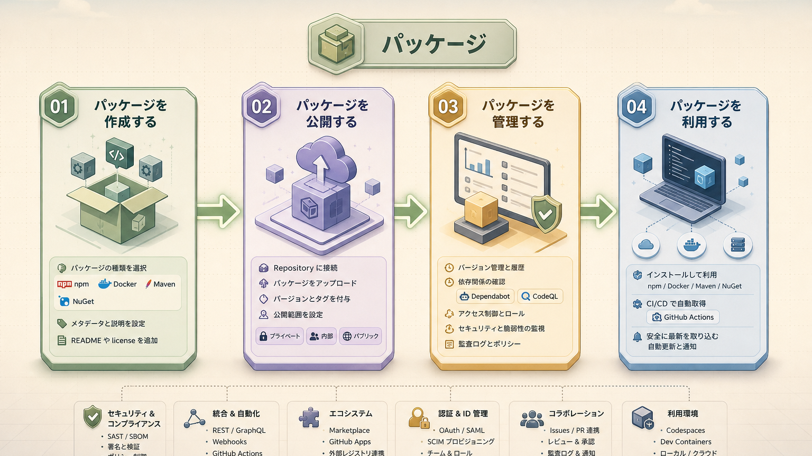

GitHub 公式パッケージレジストリ。Docker (ghcr.io)、npm、Maven、NuGet、RubyGems を統合。

**👨‍💻 エンジニアへの関係**

社内向け private パッケージ配布、Docker イメージのレジストリ。AWS ECR / Artifact Registry を使わずに GitHub に集約できる。

**💳 利用可能プラン**

| Free | Team | Enterprise Cloud | Enterprise Server |
|:-:|:-:|:-:|:-:|
| 制限あり (500MB / 1GB 帯域) | 制限あり (2GB / 10GB 帯域) | 制限あり (50GB / 100GB 帯域) | 利用可 (self-host) |

**🏢 ClassLab. での活用**

- 短期: 共通 utility npm パッケージを ghcr に置き、複数案件で共有。
- 中長期: ライフライン事業の Docker イメージを ghcr に集約し、デプロイは Actions 経由。

**🔥 差別化点**

- GitHub Token でそのまま push/pull できるため、認証統合が最少。
- Bitbucket は registry を持たない。GitLab Container Registry より UI と統合度が良い。

**🔍 深掘り**

- ghcr の image は repo に紐づき、repo 削除と連動する設定が可能。
- retention policy で古いタグを自動削除。

**⚠️ 注意点**

- 帯域消費がプライベートだと意外に高い。public OSS は無料無制限。

---

#### 4.1.5 Pages

**🎯 概要**

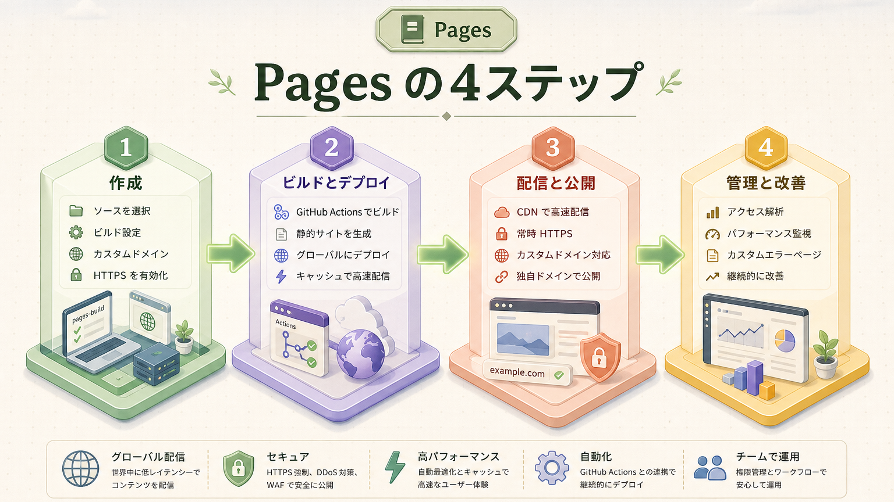

静的サイトホスティング。Jekyll / 任意の静的サイトジェネレータ / SPA を `*.github.io` または独自ドメインで公開。

**👨‍💻 エンジニアへの関係**

ドキュメントサイト、Storybook デモ、ポートフォリオ、OSS 紹介ページの即時公開先。

**💳 利用可能プラン**

| Free | Team | Enterprise Cloud | Enterprise Server |
|:-:|:-:|:-:|:-:|
| 利用可 (public のみ) | 利用可 | 利用可 | 利用可 |

**🏢 ClassLab. での活用**

- 社内 OSS / ドキュメントサイト用。本番 LP は Vercel に集約しているため Pages は補助用途。

**🔥 差別化点**

- カスタムドメイン + HTTPS が無料 (Let's Encrypt 自動)。
- GitLab Pages より CDN が高速。

**🔍 深掘り**

- 公式 action `actions/deploy-pages` で任意フレームワーク (Next.js static export, Astro, Vite) に対応。
- 任意 build から Pages artifact をアップロード可。

**⚠️ 注意点**

- 100 GB / 月 の帯域上限、1 GB のサイトサイズ上限。本番 LP には Vercel / Cloudflare Pages の方が向く。

---

#### 4.1.6 Wiki

**🎯 概要**

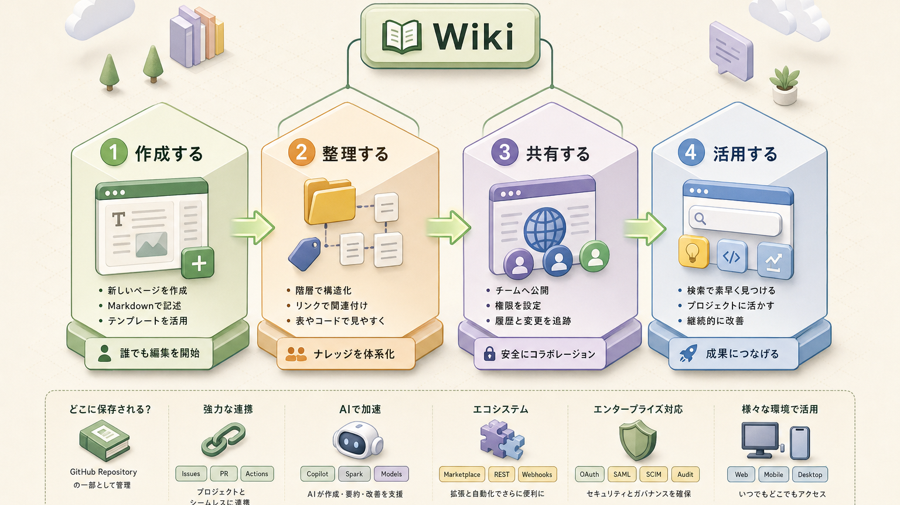

リポジトリに紐づく軽量ドキュメントスペース。実体は独立した git リポジトリ。

**👨‍💻 エンジニアへの関係**

簡易仕様書、運用手順、社内向け small docs に。Notion / Docs ほど構造化されないため割り切り。

**💳 利用可能プラン**

| Free | Team | Enterprise Cloud | Enterprise Server |
|:-:|:-:|:-:|:-:|
| 利用可 | 利用可 | 利用可 | 利用可 |

**🏢 ClassLab. での活用**

- ほぼ使わない（社内は Notion）。OSS 公開時の補足程度。

**🔥 差別化点**

- 独立 git なので docs 履歴が code とは別管理できる。

**⚠️ 注意点**

- 検索性が低い。中規模以上のドキュメントは Docs サイト or Notion 推奨。

---

### 4.2 コラボレーション層

#### 4.2.1 Pull Requests

**🎯 概要**

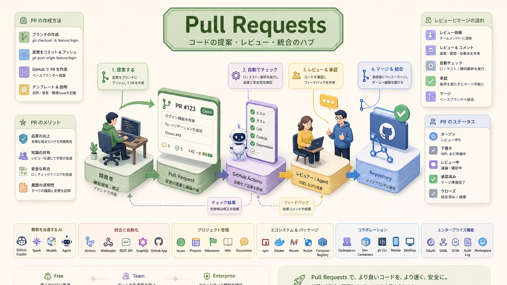

GitHub の中核。ブランチ間の差分を提示し、レビュー・議論・自動チェック・マージを一元化。

**👨‍💻 エンジニアへの関係**

毎日触る。draft PR / co-author / suggestions / batch review / merge queue / auto-merge / linked issues / required reviewers / file ownership (CODEOWNERS) のすべてが PR を中心に動く。

**💳 利用可能プラン**

| Free | Team | Enterprise Cloud | Enterprise Server |
|:-:|:-:|:-:|:-:|
| 利用可 | 利用可 | 利用可 | 利用可 |

**🏢 ClassLab. での活用**

- 短期: CODEOWNERS を整備し、ライフライン / 業務システム / 採用基盤の担当を明示。
- 中長期: merge queue を main 保護に組み込み、衝突しがちな monorepo 環境で並列マージを安全化。

**🔥 差別化点**

- Suggested change のインライン適用 UX が GitLab / Bitbucket より洗練。
- Auto-merge + merge queue + Copilot review の組み合わせが他社追随を許さない。

**🔍 深掘り**

- `Files changed` の Reviewed mark / Viewed 状態で大型 PR レビューを管理。
- PR template (`.github/PULL_REQUEST_TEMPLATE.md`) で品質を均一化。
- `gh pr create` `gh pr review` で CLI 駆動可能。

**⚠️ 注意点**

- Force-push 後の diff が消えるので、レビュー中の force-push は禁止すべし。

---

#### 4.2.2 Code Review / CODEOWNERS / Reviewer Assignment

**🎯 概要**

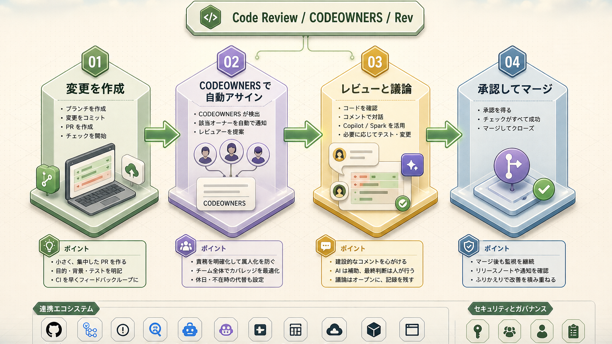

`.github/CODEOWNERS` ファイルでパス毎の所有者を定義。PR 作成時に自動レビュワー指名。

**👨‍💻 エンジニアへの関係**

「誰がレビューすべきか」を機械で決められる。team-based round-robin / load-balance も可能。

**💳 利用可能プラン**

| Free | Team | Enterprise Cloud | Enterprise Server |
|:-:|:-:|:-:|:-:|
| 制限あり (public のみ強制可) | 利用可 | 利用可 | 利用可 |

**🏢 ClassLab. での活用**

- 短期: 案件 / 機能ドメイン毎に @team を割り当て、PR レビューの暗黙負荷を分散。
- 中長期: 採用拡大時のオンボーディング期間中、レビュアー指名を Copilot Code Review + 人間のハイブリッドに。

**🔥 差別化点**

- GitLab の "code owners" より構文がシンプルで、ネストパターンに強い。
- team-based load balance は GitHub 固有。

**⚠️ 注意点**

- CODEOWNERS の最後にマッチした行が有効。順序を間違えると意図しない人がレビュワーになる。

---

#### 4.2.3 Issues / Issue Forms / Issue Types

**🎯 概要**

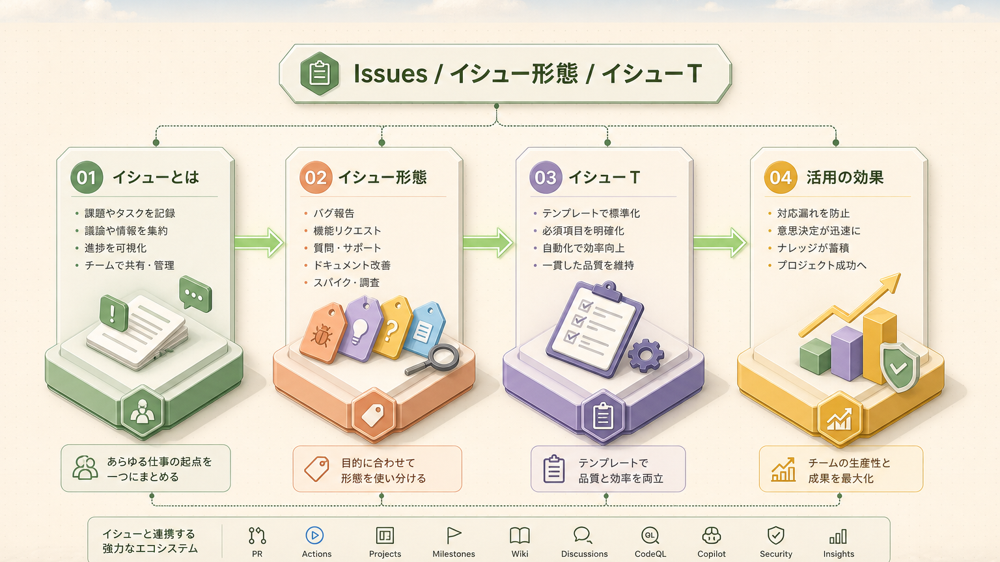

タスク管理の最小単位。Issue Forms (YAML) で入力フィールドを構造化、Issue Types で大分類。

**👨‍💻 エンジニアへの関係**

バグ報告・タスク管理・Discussion から昇格した議題の取り扱い。Jira を完全に置き換える組織も多い。

**💳 利用可能プラン**

| Free | Team | Enterprise Cloud | Enterprise Server |
|:-:|:-:|:-:|:-:|
| 利用可 | 利用可 | 利用可 | 利用可 |

**🏢 ClassLab. での活用**

- 短期: 案件毎の repo に Bug / Feature の Issue Form を整備。Findy 連携や Salesforce 移行案件もタスク管理は Issue で。
- 中長期: Issue Types を組織で標準化 (Bug/Task/Story/Epic/Incident)。

**🔥 差別化点**

- Issue Forms は GitLab の issue template より UI が圧倒的に良い (YAML 駆動の dynamic field)。
- 検索クエリの表現力（`is:open assignee:@me -label:wontfix sort:reactions-+1-desc`）が圧倒的。

**🔍 深掘り**

- `closed via` の relation で PR ↔ Issue を自動リンク。
- sub-issues (新機能) で階層化が可能になった。

**⚠️ 注意点**

- 高度なタスク管理（タイムトラッキング、ガントなど）は Linear / Jira に劣る。

---

#### 4.2.4 Discussions

**🎯 概要**

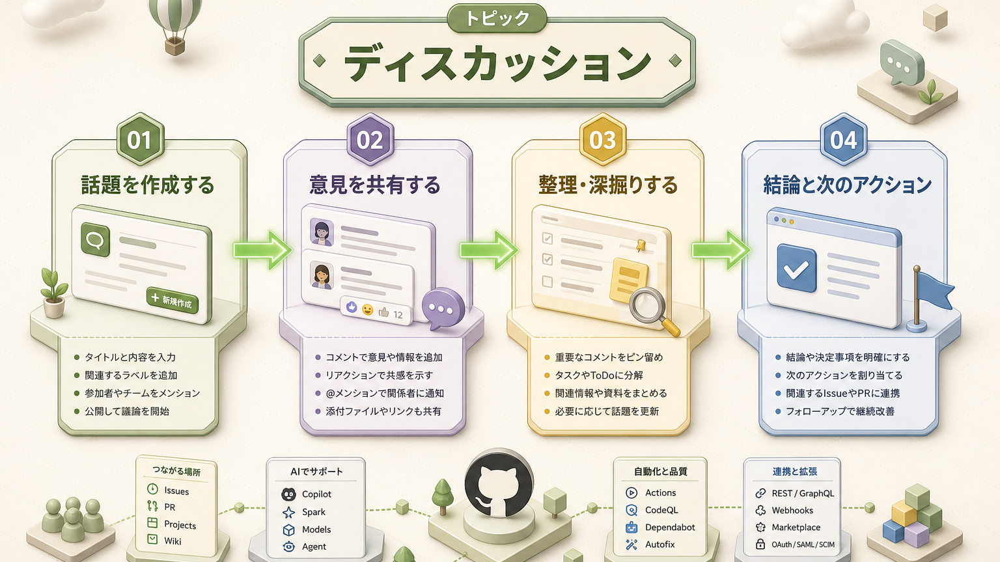

Issue より軽い、フォーラム的議論空間。Q&A 形式やアイデア募集、リリースノート補足に。

**👨‍💻 エンジニアへの関係**

OSS では「Issue にすべきでない質問」の受け皿。社内では「設計議論ログ」の保存場所として優秀。

**💳 利用可能プラン**

| Free | Team | Enterprise Cloud | Enterprise Server |
|:-:|:-:|:-:|:-:|
| 利用可 | 利用可 | 利用可 | 利用可 |

**🏢 ClassLab. での活用**

- 社内技術ナレッジ蓄積。Slack で消える議論を Discussions に残すルール。

**🔥 差別化点**

- Stack Overflow + Reddit + Issue を統合したような UX。GitLab / Bitbucket には類似機能なし。

**⚠️ 注意点**

- 通知が Issue とは別チャネル。Watch 設定を漏れなく。

---

#### 4.2.5 Projects v2

**🎯 概要**

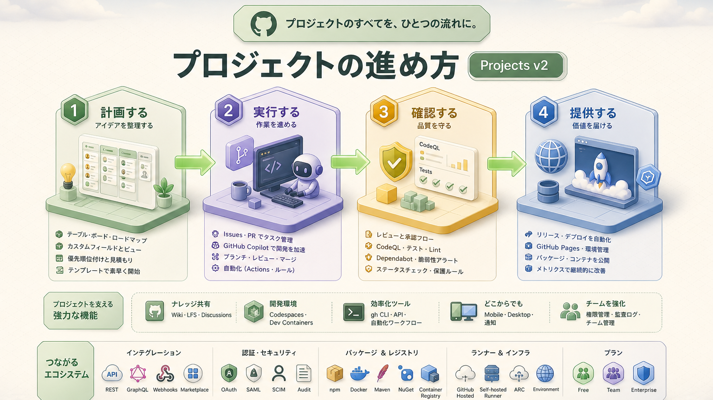

GitHub 公式プロジェクト管理。Issue / PR を横断する軽量 Linear ライクツール。

**👨‍💻 エンジニアへの関係**

スプリント管理、ロードマップ表示、ステータス遷移を Issue ベースで実現。GitHub Actions と連動して自動アップデート可。

**💳 利用可能プラン**

| Free | Team | Enterprise Cloud | Enterprise Server |
|:-:|:-:|:-:|:-:|
| 利用可 | 利用可 | 利用可 | 利用可 |

**🏢 ClassLab. での活用**

- 短期: 案件横断のロードマップを Projects v2 で可視化。Linear 採用前の代替として有力。
- 中長期: GraphQL API + Actions で「Issue 作成 → Project 自動追加 → Estimate 推定」自動化。

**🔥 差別化点**

- Linear ほど高速ではないが、Issue 統合は完全。Jira / Asana より UI が軽い。
- Insights (Burn-up / Burn-down) が標準内蔵。

**🔍 深掘り**

- Iteration field でスプリントを定義し、Burn-down 自動表示。
- Workflow (β) で「label → status 自動変更」を no-code 設定可。

**⚠️ 注意点**

- automation (GraphQL) は学習コスト高。Octokit + `gh project` CLI で簡略化推奨。

---

#### 4.2.6 Milestones

**🎯 概要**

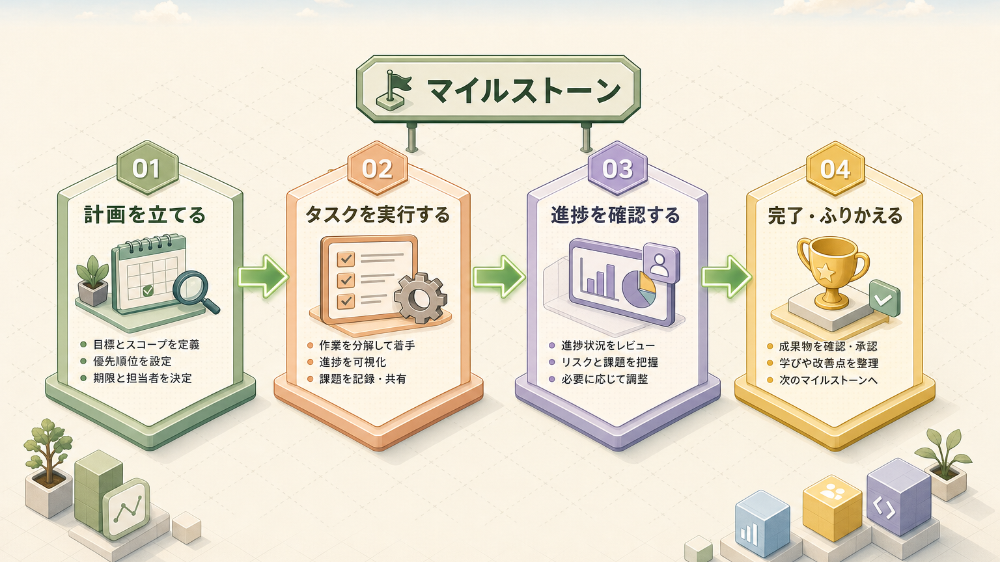

Issue / PR をリリース単位でグルーピング。Projects v2 より軽量。

**👨‍💻 エンジニアへの関係**

リリース計画 / sprint goal の単純ビュー。

**💳 利用可能プラン**

| Free | Team | Enterprise Cloud | Enterprise Server |
|:-:|:-:|:-:|:-:|
| 利用可 | 利用可 | 利用可 | 利用可 |

**🏢 ClassLab. での活用**

- リリース単位の絞り込み。

**🔥 差別化点**

- すべてのプランで使える基礎機能。Bitbucket は milestones を持たず Jira 依存。

---

#### 4.2.7 Sub-issues / Tasklists

**🎯 概要**

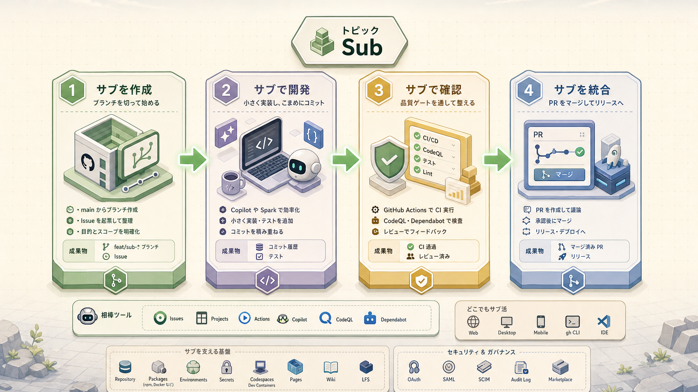

Issue 階層化。2025〜2026 で GA された。

**👨‍💻 エンジニアへの関係**

エピックを子タスクに分解。Linear / Jira 並みの階層管理が可能になった。

**💳 利用可能プラン**

| Free | Team | Enterprise Cloud | Enterprise Server |
|:-:|:-:|:-:|:-:|
| 利用可 | 利用可 | 利用可 | 利用可 |

**🏢 ClassLab. での活用**

- ライフライン事業の大規模機能リリースを Epic + Sub-issue で構造化。

**🔥 差別化点**

- Jira / Linear に追いついた重要機能。GitLab の「Epic」と同等。

---

### 4.3 Codespaces / 開発環境

#### 4.3.1 Codespaces（クラウド開発環境）

**🎯 概要**

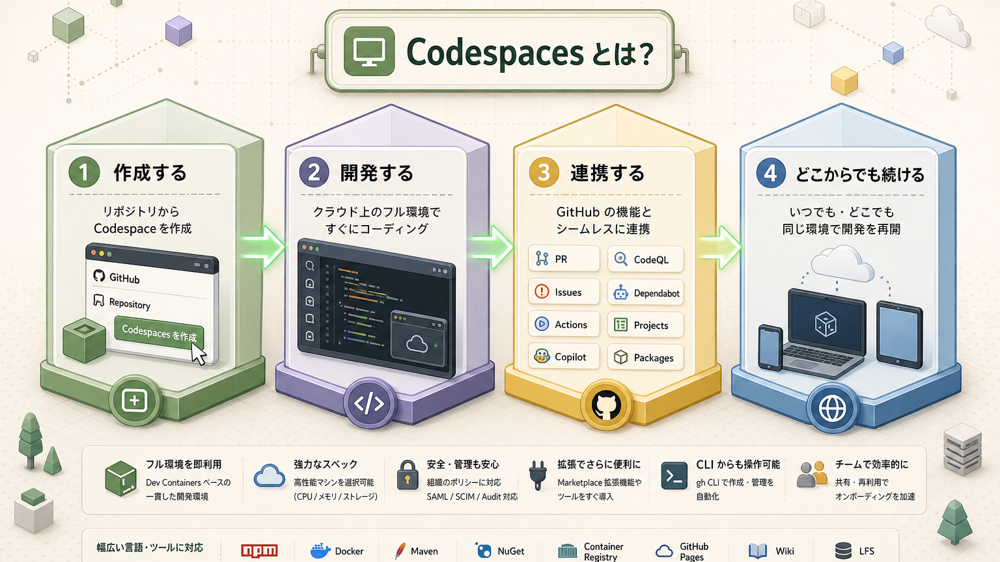

GitHub repo を即座にクラウド VM 上で開ける開発環境。devcontainer 定義で依存関係を git 管理。

**👨‍💻 エンジニアへの関係**

「ローカルセットアップ不要」「全員同一環境」「機密 repo を端末に落とさない」の三点が魅力。

**💳 利用可能プラン**

| Free | Team | Enterprise Cloud | Enterprise Server |
|:-:|:-:|:-:|:-:|
| 制限あり (個人 Free 60h/月) | 従量課金 | 従量課金 (組織管理) | サポート対象外 |

> 課金は per compute-hour。2-core で約 $0.18 / hour、ストレージ別途。

**🏢 ClassLab. での活用**

- 短期: 採用 / 業務委託オンボーディングの環境構築 0 化。Salesforce sandbox 接続用 CLI 環境も devcontainer 化。
- 中長期: BYO Cloud (Azure 上の自社サブスク) に置き、機密データを含む案件で利用。

**🔥 差別化点**

- GitLab Web IDE / Bitbucket Pipes より圧倒的に成熟。
- Coder / Gitpod / JetBrains Space に対しても repo 統合度で勝る。

**🔍 深掘り**

- Prebuild で `npm install` 等を事前実行 → 起動秒速化。
- `secrets` で組織横断のクラウド credential を自動注入。

**⚠️ 注意点**

- アイドル shutdown 設定をしないと請求が膨らむ。default 30 分推奨。

---

#### 4.3.2 Dev Containers

**🎯 概要**

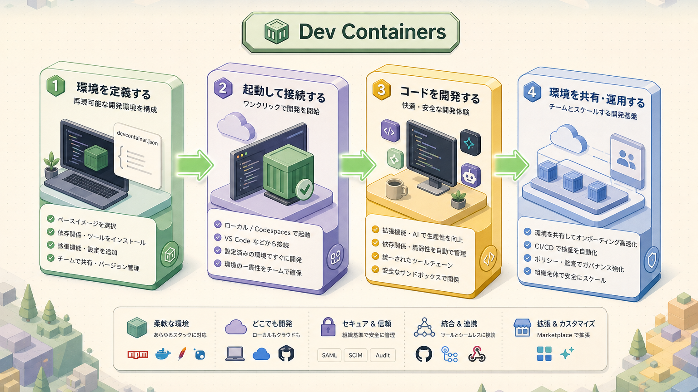

開発環境を Docker ベースで宣言的に定義する仕様。Codespaces とローカル VS Code Dev Containers の両方で動作。

**👨‍💻 エンジニアへの関係**

ローカル / Codespaces / CI で同一の base 環境を実現。

**💳 利用可能プラン**

| Free | Team | Enterprise Cloud | Enterprise Server |
|:-:|:-:|:-:|:-:|
| 利用可 | 利用可 | 利用可 | 利用可 |

**🏢 ClassLab. での活用**

- 既存 repo に `.devcontainer/` を追加するだけで採用候補者の試用環境を整備。

**🔥 差別化点**

- オープン仕様 (containers.dev) で GitHub 以外でも動く。

---

#### 4.3.3 gh CLI / GitHub Desktop / Mobile

**🎯 概要**

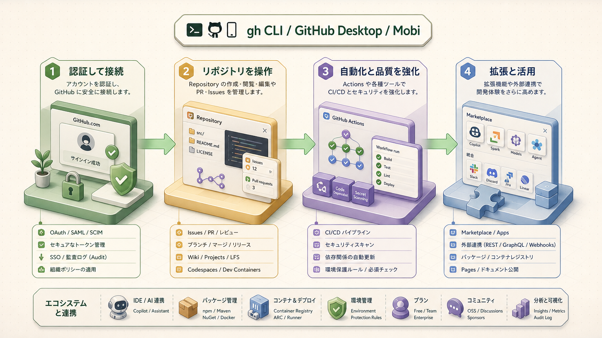

公式クライアント群。`gh` は最も実用度が高く、CI/Bot との親和性も極めて高い。

**👨‍💻 エンジニアへの関係**

`gh pr create` `gh issue list` `gh workflow run` `gh release create` `gh copilot suggest` などで日常業務を CLI 化可能。

**💳 利用可能プラン**

| Free | Team | Enterprise Cloud | Enterprise Server |
|:-:|:-:|:-:|:-:|
| 利用可 | 利用可 | 利用可 | 利用可 |

**🏢 ClassLab. での活用**

- `gh` + `jq` でレビュー待ち PR のダッシュボード化。Slack 通知と組合せる。
- Mobile はオンコール / アラート確認用途。

**🔥 差別化点**

- glab (GitLab CLI) より extension エコシステム (`gh extension`) が活発。

---

### 4.4 CI/CD — Actions と DevOps 設計

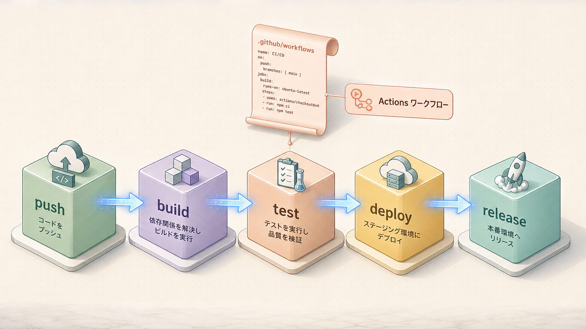

#### 4.4.1 GitHub Actions（ワークフロー基盤）

**🎯 概要**

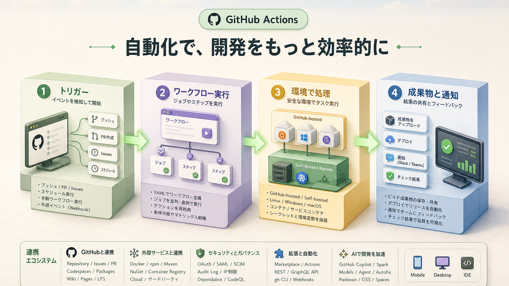

CI/CD の中核。YAML で workflow を定義し、25,000+ の Marketplace Action を組み合わせる。

**👨‍💻 エンジニアへの関係**

ビルド / テスト / Lint / デプロイ / リリース / IaC / セキュリティスキャン / Slack 通知 / Issue triage まで everything。

**💳 利用可能プラン**

| Free | Team | Enterprise Cloud | Enterprise Server |
|:-:|:-:|:-:|:-:|
| 制限あり (2,000 min/月, public は無制限) | 制限あり (3,000 min/月) | 制限あり (50,000 min/月) | 利用可 (self-host 中心) |

**🏢 ClassLab. での活用**

- 短期: ライフライン事業の Next.js / API バックエンドの test / typecheck / lint を Actions で常時実行。Vercel デプロイは Vercel 側に任せる。
- 中長期: 業務システムは self-hosted runner (ARC on EKS) に集約し、Salesforce CLI / Findy API 連携を内製化。

**🔥 差別化点**

- Marketplace 25,000+ アクションは Jenkins plugin より新しく、CircleCI Orbs より充実。
- GitLab CI と比べて DSL のシンプルさ・matrix 表現力で勝る。

**🔍 深掘り**

- `concurrency` group で同一ブランチの workflow を自動キャンセル → CI 料金節約。
- reusable workflow (`uses: org/repo/.github/workflows/foo.yml@v1`) で組織横断共通化。
- composite action でカスタム step 集合をパッケージング。
- OIDC で AWS/GCP/Azure に static credential なしで認証 (`aws-actions/configure-aws-credentials`)。

**⚠️ 注意点**

- secret は `secrets.GITHUB_TOKEN` の権限を最小化（`permissions:` ブロック）。
- pull_request_target はサプライチェーン攻撃の入り口になりやすい。

---

#### 4.4.2 Runners（Hosted / Self-hosted / ARC）

**🎯 概要**

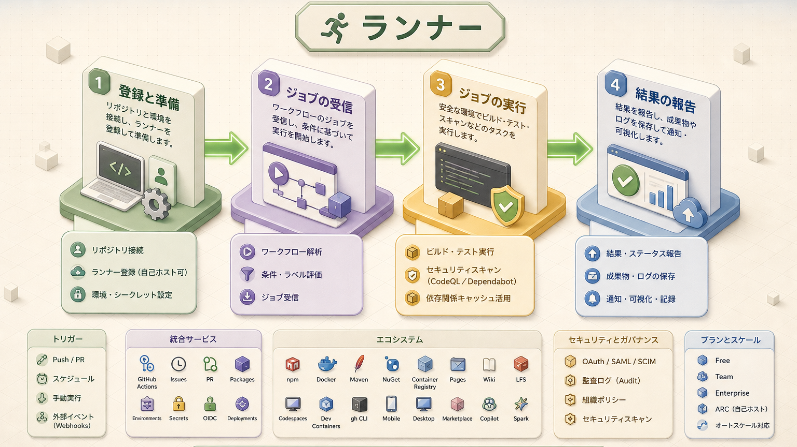

実行環境の選択。2026 以降は **ARC (Actions Runner Controller)** がエンタープライズの主流。

**👨‍💻 エンジニアへの関係**

セキュア環境への deploy / 大型ビルド / GPU が必要なジョブは self-hosted。一般用途は hosted。

**💳 利用可能プラン**

| Free | Team | Enterprise Cloud | Enterprise Server |
|:-:|:-:|:-:|:-:|
| Hosted のみ | Hosted + Self-host (有料) | Hosted + Self-host (有料) | Self-host 中心 |

> 2026-03 から private repo の self-hosted runner も $0.002/min 課金対象。Hosted runner は 2026-01 に最大 39% 値下げ済。

**🏢 ClassLab. での活用**

- 短期: 標準 workflow は GitHub-hosted のまま。
- 中長期: 業務システム / ライフライン本番デプロイは ARC (EKS) で完結。Salesforce CLI のような重い CLI も pre-baked image で高速化。

**🔥 差別化点**

- ARC は GitLab Runner より Kubernetes ネイティブ。
- Larger runners (4/8/16/32-vCPU + GPU) を hosted で借りられる。

**🔍 深掘り**

- ARC は `RunnerScaleSet` CRD で Pod を ephemeral に起動。
- Runner groups でリポジトリアクセス制御。
- Just-in-time provisioning でセキュリティ強化。

**⚠️ 注意点**

- self-hosted を public repo で使うと OSS contributor の悪意 workflow が走るリスク。原則 private のみ。

---

#### 4.4.3 Environments / Required Reviewers / Deployment Protection Rules

**🎯 概要**

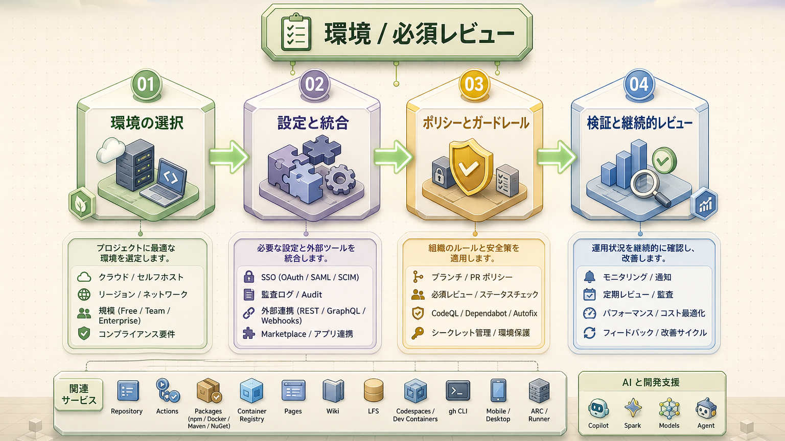

「デプロイ前に人間の承認」「特定ブランチからのみデプロイ可」「シークレットを環境別に分離」を実現。

**👨‍💻 エンジニアへの関係**

本番デプロイの安全性ゲート。staging → production の段階デプロイで必須。

**💳 利用可能プラン**

| Free | Team | Enterprise Cloud | Enterprise Server |
|:-:|:-:|:-:|:-:|
| 制限あり (public のみ) | 利用可 | 利用可 | 利用可 |

**🏢 ClassLab. での活用**

- 短期: production environment に `Required Reviewers: @sre-team` を設定し、Slack で承認動線を作る。
- 中長期: deployment protection rules (custom) で「金曜夜は deploy 禁止」「Salesforce 営業時間外限定」のような時間制約を導入。

**🔥 差別化点**

- GitLab の environments より UI が分かりやすい。

**🔍 深掘り**

- `deployment_branch_policy` で main / release/* のみ deploy 可に制限。

---

#### 4.4.4 Reusable Workflows / Composite Actions / Organization Variables

**🎯 概要**

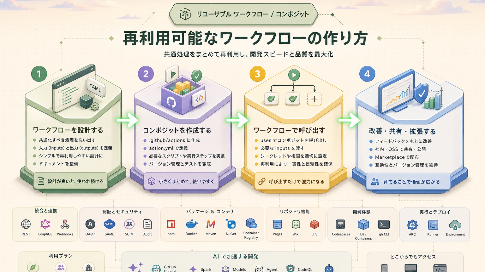

組織全体で共通する CI/CD 部品を 1 箇所で管理。

**👨‍💻 エンジニアへの関係**

「全 repo で deploy step を統一」「lint workflow をテンプレ化」「組織共通の AWS_REGION を OrgVar に置く」など。

**💳 利用可能プラン**

| Free | Team | Enterprise Cloud | Enterprise Server |
|:-:|:-:|:-:|:-:|
| 利用可 | 利用可 | 利用可 | 利用可 |

**🏢 ClassLab. での活用**

- 短期: lint / typecheck / test の共通 workflow を `.github` repo に集約。
- 中長期: Salesforce 移行用 workflow を一本化。Findy デプロイも同様。

**🔥 差別化点**

- GitLab の `include:` より composability が高い。

---

#### 4.4.5 Merge Queue

**🎯 概要**

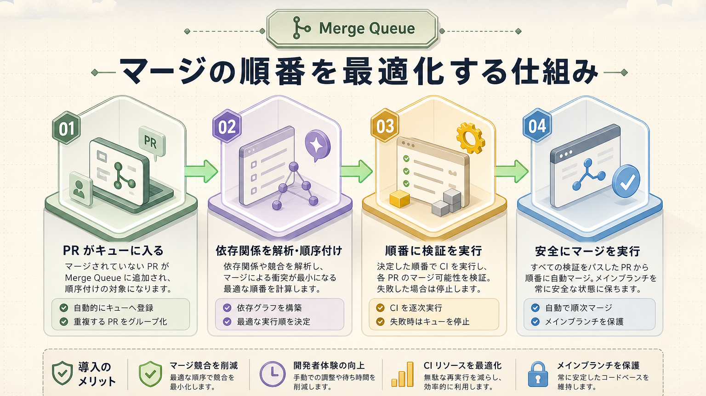

「main に対する競合を自動回避しつつ、並列で複数 PR をマージ可能にする」キュー。

**👨‍💻 エンジニアへの関係**

monorepo / 大規模チームで PR が滞留する問題を解消。

**💳 利用可能プラン**

| Free | Team | Enterprise Cloud | Enterprise Server |
|:-:|:-:|:-:|:-:|
| 制限あり (public のみ) | 利用可 | 利用可 | 利用可 |

**🏢 ClassLab. での活用**

- 中長期: monorepo 移行後の必須機能。

**🔥 差別化点**

- Mergify (3rd party) を内製化したような機能。GitLab の merge train と類似。

---

#### 4.4.6 DevOps 設計テンプレ（ClassLab. 向けリファレンスアーキテクチャ）

> 上記 4.4.x を組み合わせて、ClassLab. システム事業部の本番グレード CI/CD はどう組むべきかの参考設計。

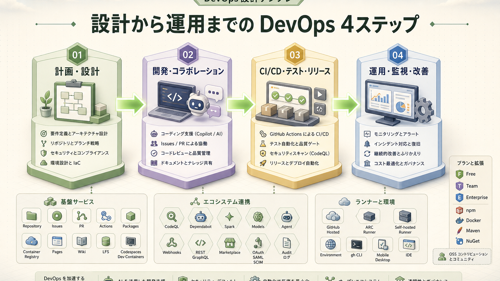

**設計の勘所:**

| 層 | 推奨設定 | 理由 |
|---|---|---|
| Branch | `main` 保護: PR 必須 / status check 全 green / 2 approvals / linear history / require signed commits / no force push | 取り返しのつかない事故防止 |
| Workflow | `concurrency: ${{ github.workflow }}-${{ github.ref }}` で重複 cancel | CI 料金節約 + キャッシュヒット率向上 |
| Permission | `permissions: contents: read` を全 workflow デフォルト | サプライチェーン攻撃の被害を最小化 |
| Secret | environment-scoped secrets を優先、repo secret は最小化 | スコープ分離 |
| OIDC | AWS / GCP / Azure / Vercel への credentialless 認証 | static credential ゼロ運用 |
| Runner | 標準は GitHub-hosted、本番 deploy のみ ARC on EKS | コストとガバナンスのバランス |
| Cache | `actions/cache` または framework 別 cache action でビルド高速化 | 平均 50〜80% の時間短縮 |
| Reusable WF | `.github` repo に lint / test / deploy の共通 workflow | DRY |
| Environment | staging → production の段階、Required Reviewers + branch policy | 人間ゲート |
| Merge Queue | monorepo か高並列チームで有効化 | merge 競合の自動解消 |

---

### 4.5 セキュリティ層（GitHub Advanced Security）

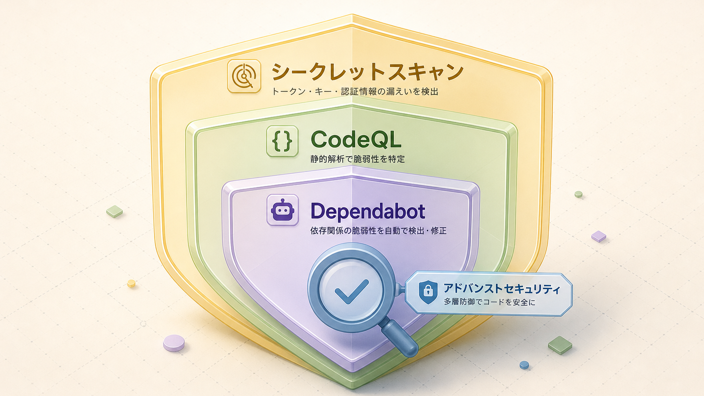

#### 4.5.1 CodeQL（SAST）

**🎯 概要**

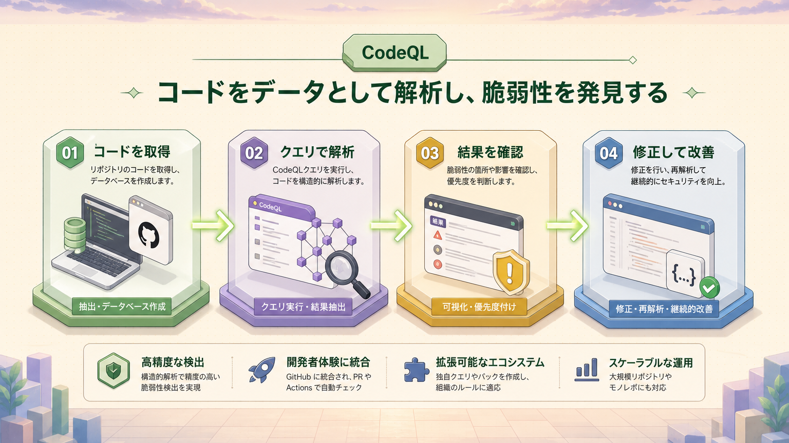

GitHub 公式のセマンティック SAST。AST + データフロー解析でゼロデイレベルの脆弱性まで検出。

**👨‍💻 エンジニアへの関係**

OWASP Top 10 / CWE 標準を網羅。PR 上でアラート + 自動修正提案を確認できる。

**💳 利用可能プラン**

| Free | Team | Enterprise Cloud | Enterprise Server |
|:-:|:-:|:-:|:-:|
| 利用可 (public のみ無料) | 従量課金 (GHAS / committer) | 従量課金 (GHAS / committer) | 従量課金 (GHAS / committer) |

> Advanced Security: $30 / active committer / 月。

**🏢 ClassLab. での活用**

- 短期: ライフライン事業 / 業務システムの本番 repo にすべて CodeQL を設定。
- 中長期: custom query で社内固有のアンチパターン (e.g., Salesforce API key hardcode) を検出。

**🔥 差別化点**

- Snyk Code / SonarQube より検出精度が高い (DataFlow ベース)。
- Copilot Autofix と連動した修正提案は他社未追随。

**🔍 深掘り**

- 言語サポート: JS/TS / Python / Java / Kotlin / Go / Ruby / C# / C/C++ / Swift。
- custom CodeQL pack を private published に置いて社内共有可。

**⚠️ 注意点**

- Build を伴うので runner 時間消費は大きい。`schedule: weekly` 推奨。

---

#### 4.5.2 Secret Scanning + Push Protection

**🎯 概要**

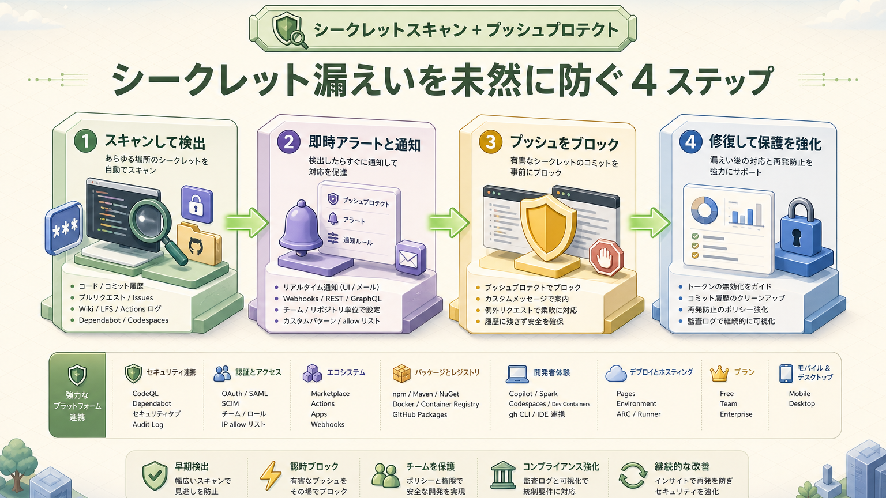

API キー / token / 鍵などのコミット時検知。Push Protection で commit 時点で拒否。

**👨‍💻 エンジニアへの関係**

「AWS キーを誤って push して数百ドル請求」事故の防止。Stripe / OpenAI / Anthropic などのパートナーは自動 revoke される。

**💳 利用可能プラン**

| Free | Team | Enterprise Cloud | Enterprise Server |
|:-:|:-:|:-:|:-:|
| 制限あり (public のみ無料) | 従量課金 (GHAS) | 従量課金 (GHAS) | 従量課金 (GHAS) |

**🏢 ClassLab. での活用**

- 短期: 全 private repo に Push Protection 有効化。
- 中長期: custom secret patterns で社内固有のキー形式 (Salesforce connected app secret) も検知。

**🔥 差別化点**

- partner program (200+ provider) による自動 revoke は GitHub の独自強み。

---

#### 4.5.3 Dependabot（Alerts / Updates / Security Updates）

**🎯 概要**

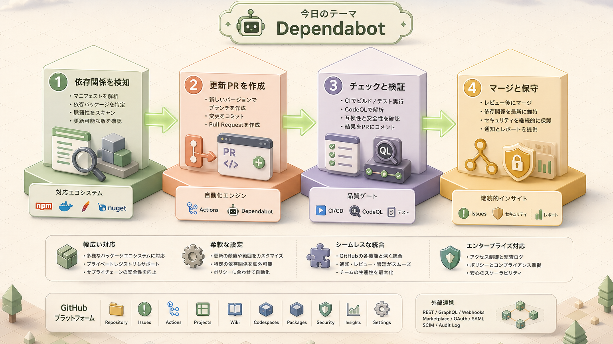

依存ライブラリの脆弱性検知 + 自動 PR 作成。

**👨‍💻 エンジニアへの関係**

依存性更新の人力作業を消滅させる。

**💳 利用可能プラン**

| Free | Team | Enterprise Cloud | Enterprise Server |
|:-:|:-:|:-:|:-:|
| 利用可 (Alerts は全プラン無料) | 利用可 | 利用可 | 利用可 |

**🏢 ClassLab. での活用**

- 短期: 全 repo に `.github/dependabot.yml` を配置。週次更新。
- 中長期: auto-merge + ステータスチェックで「minor patch は自動マージ」。

**🔥 差別化点**

- Renovate と比較すると統合度・UI で優位、設定柔軟性で劣る。

**🔍 深掘り**

- `groups` 設定で関連 PR をまとめて 1 つに。
- security-updates-only 設定で運用負荷削減。

---

#### 4.5.4 Dependency Review (PR 時)

**🎯 概要**

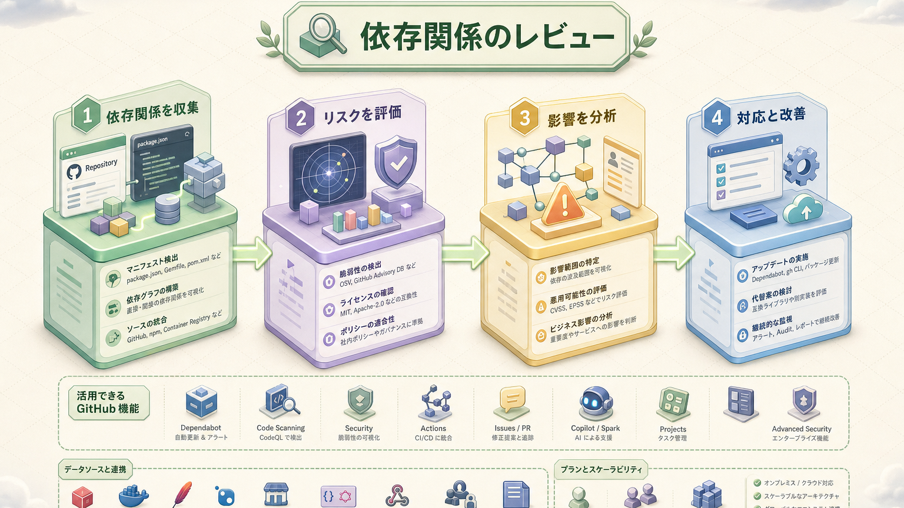

PR で追加された依存ライブラリの脆弱性 / ライセンス互換性をチェック。

**💳 利用可能プラン**

| Free | Team | Enterprise Cloud | Enterprise Server |
|:-:|:-:|:-:|:-:|
| 制限あり (public のみ) | 従量課金 (GHAS) | 従量課金 (GHAS) | 従量課金 (GHAS) |

**🏢 ClassLab. での活用**

- `dependency-review-action` を全 repo の PR check に。

**🔥 差別化点**

- ライセンス互換性 (GPL を MIT プロジェクトに混入させない) は他 SAST にない。

---

#### 4.5.5 Copilot Autofix

**🎯 概要**

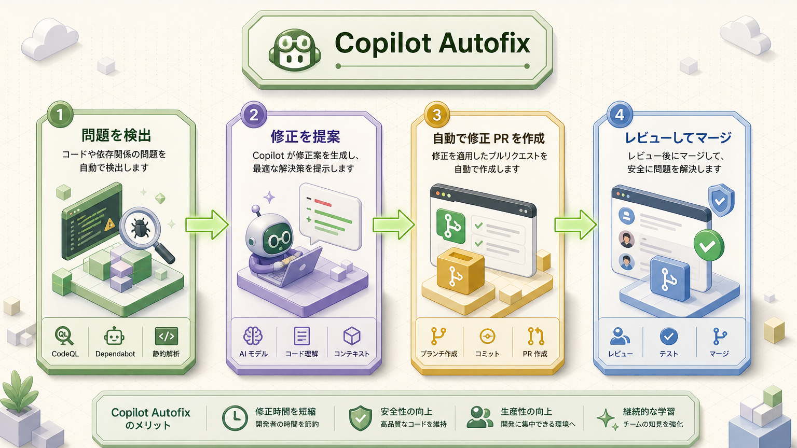

CodeQL アラートに対して LLM が修正 diff を自動提案。

**👨‍💻 エンジニアへの関係**

検出だけで終わらせず、修正までを 1 クリック化。

**💳 利用可能プラン**

| Free | Team | Enterprise Cloud | Enterprise Server |
|:-:|:-:|:-:|:-:|
| 利用可 (public は無料) | 利用可 (GHAS 加入時) | 利用可 (GHAS 加入時) | 利用可 (GHAS 加入時) |

**🏢 ClassLab. での活用**

- セキュリティ対応の TAT 短縮。

**🔥 差別化点**

- Snyk Fix / Semgrep Auto Fix と比べて精度が高く、PR 内 UX が完成。

---

#### 4.5.6 Security Overview / Custom Patterns / Campaigns

**🎯 概要**

組織全体の脆弱性ポートフォリオを可視化。Custom Patterns で社内固有の検出ルール、Security Campaigns で「四半期内に全 critical alert 解消」のようなキャンペーン管理。

**💳 利用可能プラン**

| Free | Team | Enterprise Cloud | Enterprise Server |
|:-:|:-:|:-:|:-:|
| 不可 | 不可 | 利用可 (GHAS 加入時) | 利用可 (GHAS 加入時) |

---

### 4.6 AI 層 (Copilot / Spark / Models)

#### 4.6.1 GitHub Copilot — IDE Completion / Chat / Edits / Agent Mode

**🎯 概要**

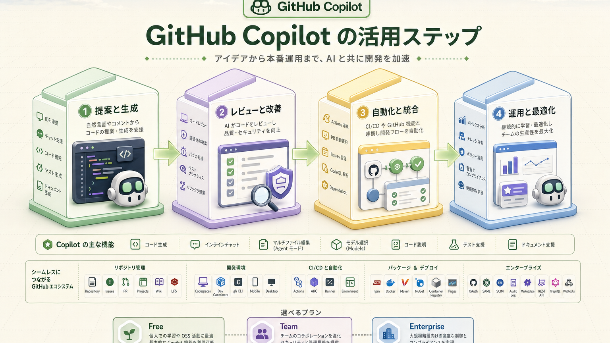

IDE 内補完とチャット。Agent Mode はローカル環境で自律的にコード変更を実行。

**👨‍💻 エンジニアへの関係**

主力 AI コーディングツール。Cursor / Claude Code とハイブリッド運用するチームが増加。

**💳 利用可能プラン**

| Free | Pro | Pro+ | Business | Enterprise |
|:-:|:-:|:-:|:-:|:-:|
| 制限あり (2,000 補完 / 50 premium 月) | 利用可 (無制限補完 + 一定の AI Credits) | 利用可 (大量 AI Credits, agent 常用向け) | 利用可 (per-seat $19) | 利用可 (per-seat $39 + Enterprise Cloud $21 必須) |

**🏢 ClassLab. での活用**

- 短期: 全員 Business 契約。Premium モデル (Claude Opus / GPT-5.3) は限られたヘビーユーザのみ Pro+。
- 中長期: 業務委託 / 採用面接時の試用権付与。Spaces で社内ドキュメントをチームコンテキストに。

**🔥 差別化点**

- Cursor は IDE が独立。Copilot は VS Code / JetBrains / Neovim / Vim / Xcode / Eclipse をネイティブサポート。
- モデルが多い (GPT-5.3-Codex / Claude Opus 4.7 / Sonnet 4.6 / Gemini 系)。

**🔍 深掘り**

- `Copilot Edits` で 5〜10 ファイル一括修正。
- `Agent Mode` はローカル環境で自律的に code/test 実行ループ。
- `Copilot CLI` (`gh copilot suggest` `gh copilot explain`) は terminal 系作業に有用。

**⚠️ 注意点**

- 2026-06-01 から AI Credits 制に移行。月間予算管理を組織レベルで設定すべき。

---

#### 4.6.2 Copilot Coding Agent（非同期エージェント）

**🎯 概要**

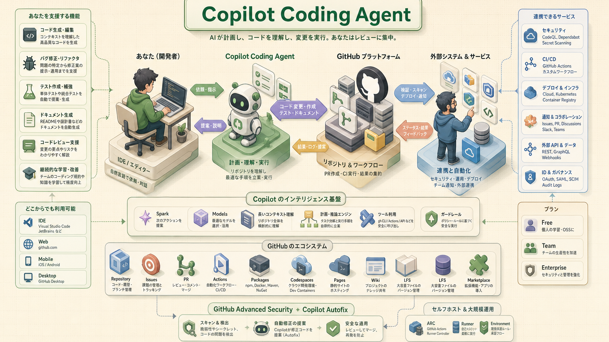

Issue を Copilot にアサインするだけで PR を自動生成する非同期 agent。

**👨‍💻 エンジニアへの関係**

雛形作成、定型バグ修正、依存性更新の追従、テスト追加など反復タスクを agent に投げる。

**💳 利用可能プラン**

| Free | Pro | Pro+ | Business | Enterprise |
|:-:|:-:|:-:|:-:|:-:|
| 不可 | 制限あり | 利用可 | 利用可 | 利用可 |

**🏢 ClassLab. での活用**

- 短期: 既知バグの修正・Issue 起点の小タスクを agent に委譲。
- 中長期: Findy / Salesforce 連携の定型変更 (フィールド追加に伴うコード更新) を agent パイプライン化。

**🔥 差別化点**

- 「Issue に assign するだけ」の最小 UX は他社（Devin / Sweep / Cursor Background Agent）に対しても優位。
- branch protection / controlled internet access が組み込み済みでエンタープライズ運用に耐える。

**🔍 深掘り**

- Custom Agents で組織固有の context (coding standards / test conventions) を埋め込み可能。
- CLI handoff で agent 結果を `gh` から取り回し。

**⚠️ 注意点**

- 大規模変更には依然として人間レビューが必須。merge は人間判断で。

---

#### 4.6.3 Copilot Code Review

**🎯 概要**

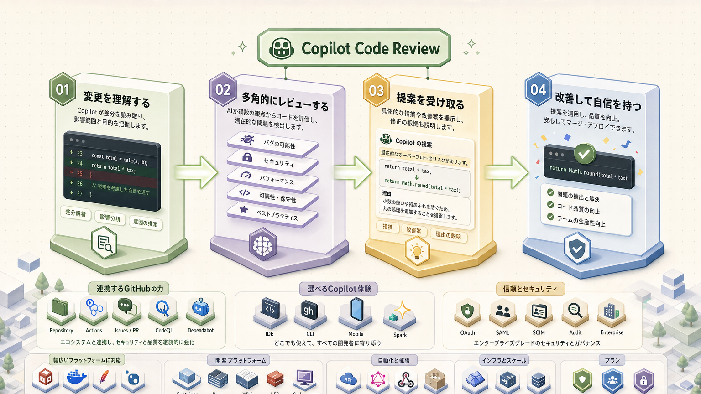

PR 全体を agentic に分析、修正提案 + Coding Agent への自動委譲。

**💳 利用可能プラン**

| Free | Pro | Pro+ | Business | Enterprise |
|:-:|:-:|:-:|:-:|:-:|
| 制限あり | 利用可 | 利用可 | 利用可 (組織で全 PR に拡張可能) | 利用可 |

**🏢 ClassLab. での活用**

- 短期: 全 PR に Copilot Review を default 設定。人間レビューを補完。

**🔥 差別化点**

- 2026-03 から agentic 化されコンテキスト取得能力が大幅向上。
- 組織契約だと non-licensee PR にもレビュー可能。

---

#### 4.6.4 Copilot Spaces

**🎯 概要**

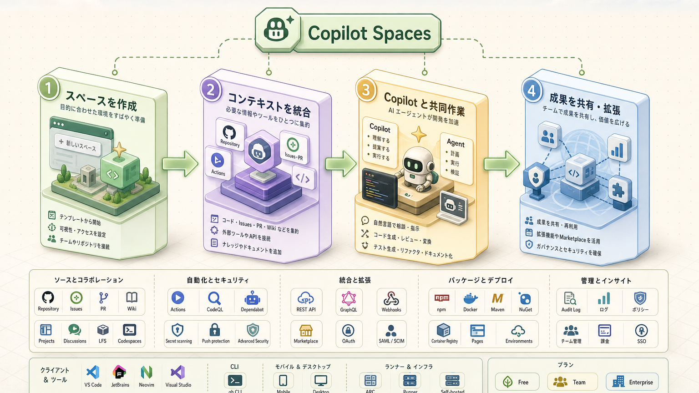

チーム共有の AI コンテキスト空間。社内 docs / コード / 規約を 1 つの "Space" に集約し、Copilot Chat の context として利用。

**💳 利用可能プラン**

| Free | Pro | Pro+ | Business | Enterprise |
|:-:|:-:|:-:|:-:|:-:|
| 不可 | 利用可 | 利用可 | 利用可 | 利用可 |

> **API GA**: 2026 に Spaces API が一般提供。CRUD 操作が外部システムから可能。

**🏢 ClassLab. での活用**

- 短期: ライフライン事業の業務ドメイン docs を Space に。
- 中長期: Salesforce 移行用 Space + Findy 仕様 Space + 採用基盤 Space と分割。

**🔥 差別化点**

- Cursor の Notepad / `.cursorrules` より組織共有性が高い。

---

#### 4.6.5 GitHub Spark — Prompt to App

**🎯 概要**

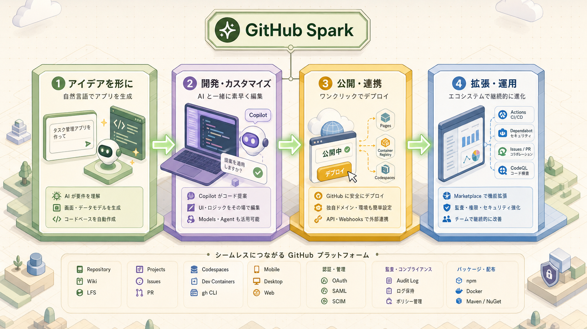

「文章でアプリ説明 → コード生成 + ライブプレビュー」。Vercel v0 / Cursor / Bolt / Replit Agent の競合。

**💳 利用可能プラン**

| Free | Pro | Pro+ | Business | Enterprise |
|:-:|:-:|:-:|:-:|:-:|
| 不可 | 不可 | 利用可 | 不可 | 利用可 |

**🏢 ClassLab. での活用**

- 短期: 業務小ツールのプロトタイプ。社内アンケート / 集計画面など。
- 中長期: ライフライン事業の社内オペレーション UI 内製化 (シンプルな CRUD はすべて Spark で量産)。

**🔥 差別化点**

- Vercel v0 / Bolt は外部サービス、Spark は GitHub アカウントだけで完結。

**⚠️ 注意点**

- Pro+ / Enterprise のみ。Business ユーザは別途 Pro+ が必要。

---

#### 4.6.6 GitHub Models — マルチプロバイダ推論

**🎯 概要**

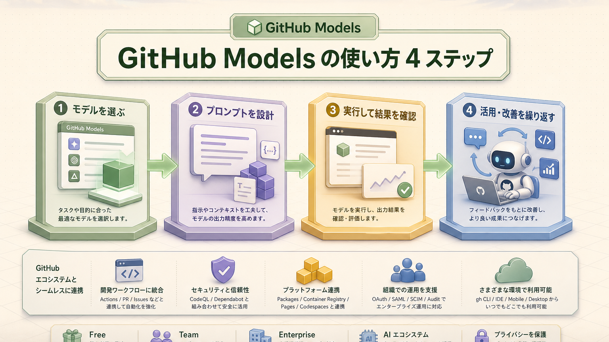

OpenAI / Anthropic / Mistral / Meta / Google などの推論を GitHub Token 1 本で叩ける gateway。Vercel AI Gateway 同等の思想。

**💳 利用可能プラン**

| Free | Pro | Pro+ | Business | Enterprise |
|:-:|:-:|:-:|:-:|:-:|
| 制限あり (試用枠) | 制限あり (試用枠) | 制限あり | 制限あり | 従量課金 (組織管理) |

**🏢 ClassLab. での活用**

- 短期: 試作品 / プロトの推論呼び出しで OpenAI / Anthropic を個別 API キー無しに利用。
- 中長期: Action 内で `gh models` を叩いて「PR コメントを自動要約」「Issue 自動分類」など。

**🔥 差別化点**

- LLM ベンダー乗り換えコストをゼロに近づける。Vercel AI Gateway と思想が近い。

---

#### 4.6.7 Project Padawan（自律エージェント構想）

**🎯 概要**

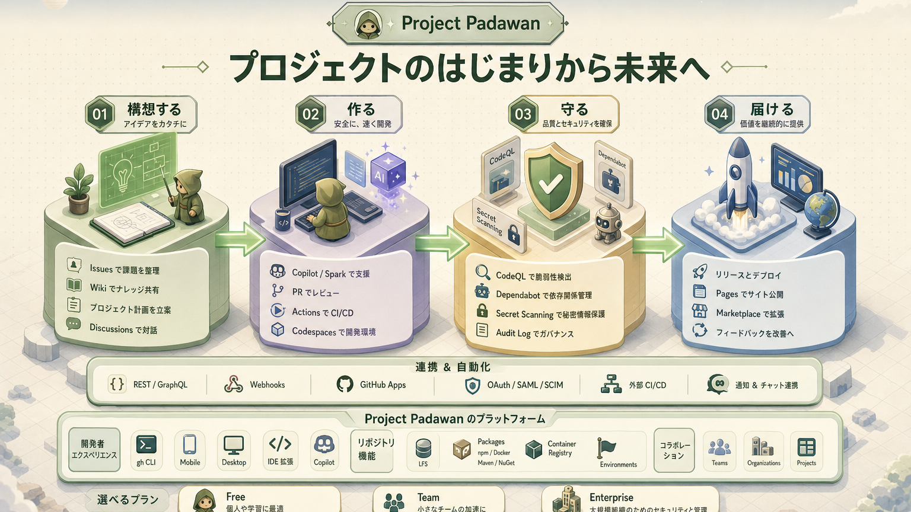

GitHub 次世代の自律エージェント構想 (codename)。Coding Agent をさらに自律化、最終マージまで agent が完結することを目指す。

**💳 利用可能プラン**

| Free | Pro | Pro+ | Business | Enterprise |
|:-:|:-:|:-:|:-:|:-:|
| 不可 | 不可 | 不可 (限定) | 不可 (限定) | 制限あり (early access) |

**🏢 ClassLab. での活用**

- 短期: ウォッチ。
- 中長期: 業務システム改修の定型 PR を自律化。

**🔥 差別化点**

- Devin / Cognition と直接競合する GitHub 本体の自律エージェント。

**⚠️ 注意点**

- Beta / 限定提供。GA 時期未確定。

---

### 4.7 エンタープライズ層

#### 4.7.1 SAML SSO / SCIM / Enterprise Managed Users (EMU)

**🎯 概要**

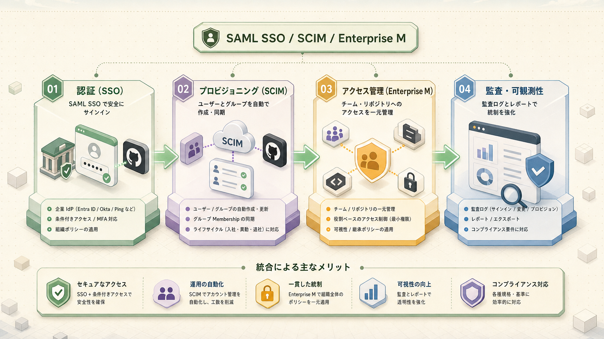

エンタープライズ ID 統合。EMU では「会社が作って会社が消す」managed account にすることで離職時の Off-boarding 漏れを完全防止。

**💳 利用可能プラン**

| Free | Team | Enterprise Cloud | Enterprise Server |
|:-:|:-:|:-:|:-:|
| 不可 | 不可 | 利用可 | 利用可 |

**🏢 ClassLab. での活用**

- 短期: SAML SSO + SCIM を Okta に統合。
- 中長期: EMU 移行検討 (今は個人 GitHub アカウントベース、規模拡大時に切り替え)。

**🔥 差別化点**

- EMU は GitHub 独自。GitLab は user 単位の所有が前提。

**⚠️ 注意点**

- EMU は個人アカウントを残しつつ会社 user を分離するため、人によっては OSS 活動と完全分離になる。

---

#### 4.7.2 Audit Log / Audit Log Streaming

**🎯 概要**

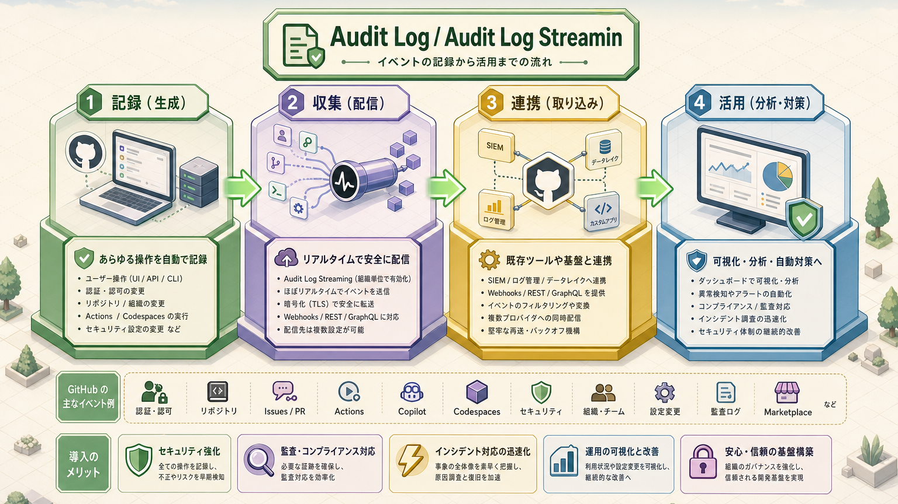

全アクションの完全ログ。Streaming で SIEM へ転送。

**💳 利用可能プラン**

| Free | Team | Enterprise Cloud | Enterprise Server |
|:-:|:-:|:-:|:-:|
| 制限あり | 制限あり | 利用可 (Streaming 含む) | 利用可 |

**🏢 ClassLab. での活用**

- 短期: 監査要件のある業務システム repo の Audit Log を Datadog にストリーミング。

**🔥 差別化点**

- Audit log streaming は GitHub 独自の SIEM 直結機能。

---

#### 4.7.3 IP Allow List / VPC

**🎯 概要**

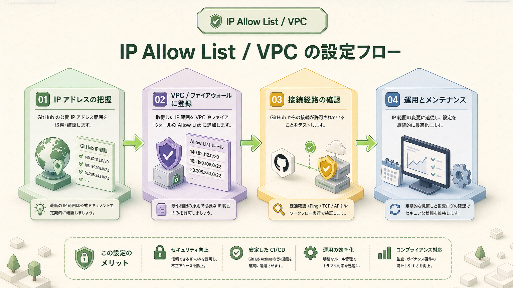

組織レベル / Enterprise レベルで IP 制限。

**💳 利用可能プラン**

| Free | Team | Enterprise Cloud | Enterprise Server |
|:-:|:-:|:-:|:-:|
| 不可 | 不可 | 利用可 | 利用可 |

**🏢 ClassLab. での活用**

- 規制業界向け案件の場合に有効化。通常運用では不要。

---

#### 4.7.4 GitHub Enterprise Server（オンプレ / self-hosted GitHub）

**🎯 概要**

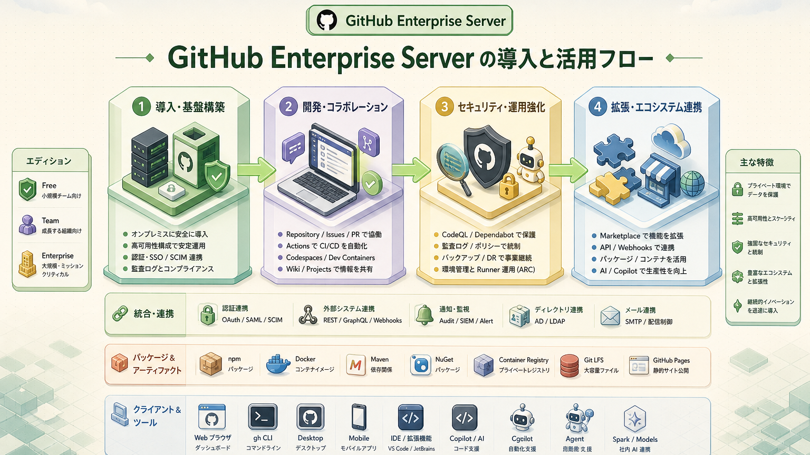

GitHub.com 同等機能をオンプレ運用できる appliance。Air-gap 環境 / 規制業種向け。

**💳 利用可能プラン**

| Free | Team | Enterprise Cloud | Enterprise Server |
|:-:|:-:|:-:|:-:|
| 不可 | 不可 | — | 利用可 |

**🏢 ClassLab. での活用**

- 通常は不要。Enterprise Cloud で十分。

**🔥 差別化点**

- Air-gap で完全動作。GitLab self-managed と直接競合。

---

#### 4.7.5 Data Residency / Enterprise Cloud リージョン

**🎯 概要**

EU / US / Australia など特定リージョンでのデータ保管。

**💳 利用可能プラン**

| Free | Team | Enterprise Cloud | Enterprise Server |
|:-:|:-:|:-:|:-:|
| 不可 | 不可 | 利用可 (有償 add-on) | — |

**🏢 ClassLab. での活用**

- 個人情報を含む案件で必要に応じ検討。

---

### 4.8 API / 拡張層

#### 4.8.1 REST API / GraphQL API / Webhooks

**🎯 概要**

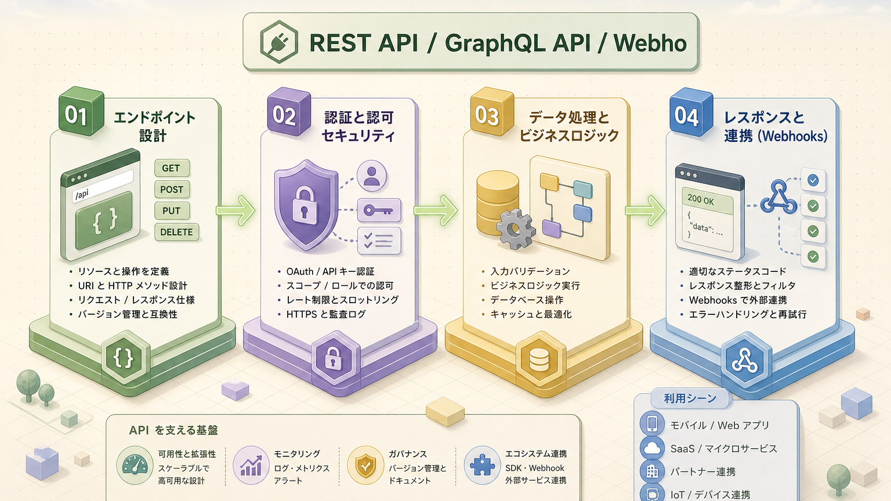

GitHub のあらゆるリソースを REST / GraphQL で操作可能。Webhook でイベント駆動。

**👨‍💻 エンジニアへの関係**

社内ツール統合、bot 開発、Project 自動化、データ抽出。

**💳 利用可能プラン**

| Free | Team | Enterprise Cloud | Enterprise Server |
|:-:|:-:|:-:|:-:|
| 利用可 (rate limit あり) | 利用可 | 利用可 (higher limit) | 利用可 |

**🏢 ClassLab. での活用**

- 短期: PR / Issue の状況を Datadog ダッシュボード化。
- 中長期: Findy / Salesforce 連携 bot を GitHub Apps として実装。

**🔥 差別化点**

- GraphQL の表現力は Bitbucket / GitLab に対して優位。

---

#### 4.8.2 GitHub Apps / OAuth Apps

**🎯 概要**

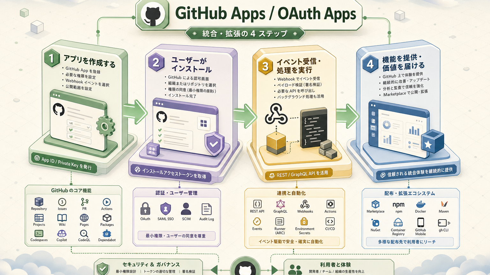

GitHub に対する第三者統合の標準仕様。OAuth より細かいパーミッション制御。

**💳 利用可能プラン**

| Free | Team | Enterprise Cloud | Enterprise Server |
|:-:|:-:|:-:|:-:|
| 利用可 | 利用可 | 利用可 | 利用可 |

**🏢 ClassLab. での活用**

- 短期: 内製 Bot は GitHub App で実装。OAuth より権限管理が安全。

**🔥 差別化点**

- App ごとに repo を選んでインストール可能。GitLab Application は organization-wide。

---

#### 4.8.3 Marketplace

**🎯 概要**

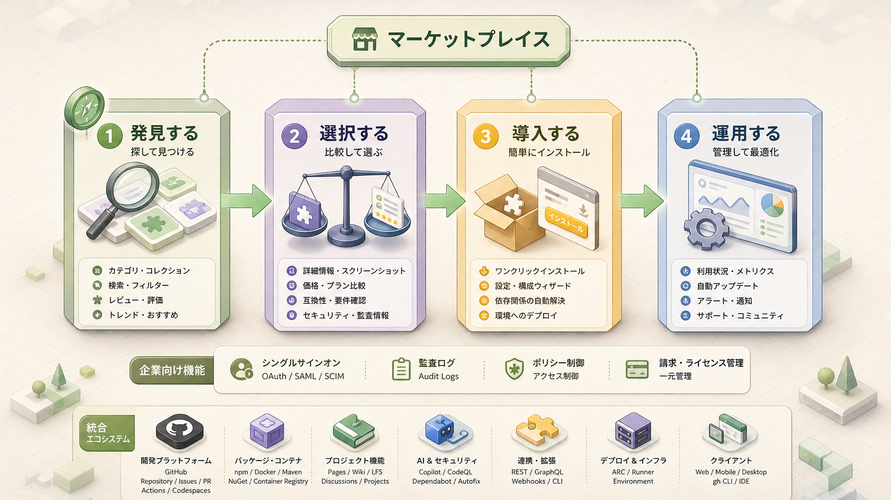

20,000+ Apps と 25,000+ Actions が並ぶ統合ストア。

**💳 利用可能プラン**

| Free | Team | Enterprise Cloud | Enterprise Server |
|:-:|:-:|:-:|:-:|
| 利用可 | 利用可 | 利用可 | 利用可 (verified Apps のみ) |

**🏢 ClassLab. での活用**

- 後述「§ 4.10 おすすめ Marketplace 拡張」参照。

**🔥 差別化点**

- 規模で他追随を許さない（GitLab CI Catalog の 10 倍以上）。

---

### 4.9 利用企業と利用パターン

#### 4.9.1 主要利用企業（公開事例ベース）

| 企業 | 業界 | 主な利用 | 出典 |
|---|---|---|---|
| Mercedes-Benz | 自動車 | 全エンジニア組織で Enterprise + Copilot Business、車載ソフトの CI/CD | GitHub Customer Stories |
| Ford | 自動車 | "modern car" 開発で Enterprise + Codespaces | GitHub Customer Stories |
| General Motors | 自動車 | Enterprise + Advanced Security、ソフトウェアデリバリ高速化 | GitHub Customer Stories |
| Shopify | EC | Enterprise + Actions + Copilot、巨大 monorepo 運用 | GitHub Customer Stories |
| Stripe | 決済 | Enterprise + Codespaces、グローバル分散チーム | Stripe ↔ GitHub 相互利用 |
| Microsoft 全社 | テック | Enterprise + Copilot + Codespaces、内部 dogfood | 公式 |
| OpenAI | AI | Enterprise + Copilot Enterprise、AI モデル開発 | 公式 |
| Mercari, クックパッド, LayerX, freee | 日本テック | Enterprise + Copilot、Codespaces 試験運用多数 | 各種カンファ事例 |
| GitLab Inc.（皮肉） | ツール | OSS は GitHub にもミラー | — |

#### 4.9.2 典型利用パターン

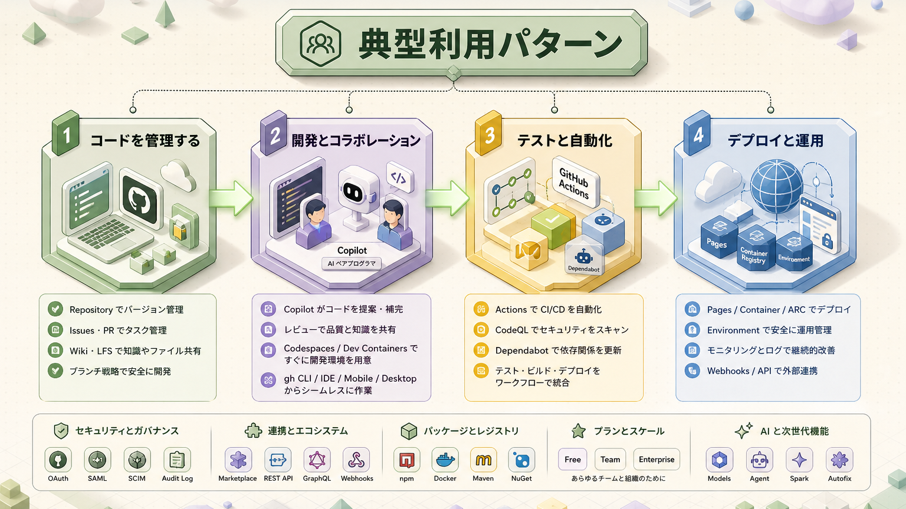

**ClassLab. の現在地と進化方向:**

- 現在: P3〜P4（Team + Copilot Business、案件規模により Enterprise Cloud 移行検討段階）。
- 短期 (〜6ヶ月): Enterprise Cloud へ移行、Copilot Business 全員、GHAS は Tier1 案件のみ。
- 中長期 (12〜18ヶ月): Copilot Enterprise + EMU + Audit Streaming へ拡張。

---

### 4.10 おすすめ Marketplace 拡張（30+ 本網羅）

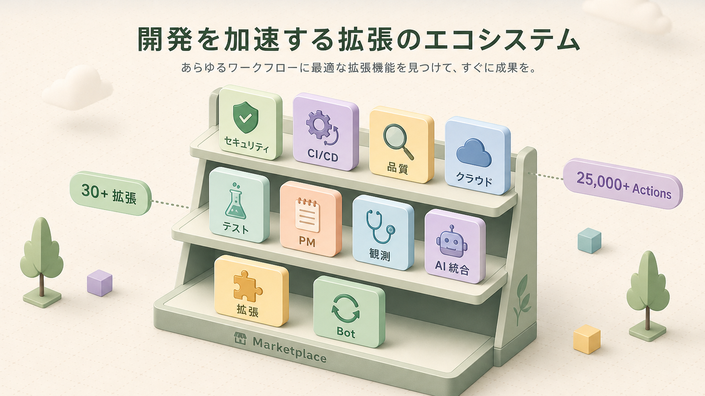

カテゴリ別。Action / App / Browser Extension を混在。

#### 4.10.1 コード品質 / 静的解析

| 名前 | カテゴリ | 概要 | おすすめ用途 |
|---|---|---|---|
| SonarQube Cloud (旧 SonarCloud) | SaaS | 静的解析 + 品質ゲート。OSS 無料 | コード品質 KPI 追跡 |
| Snyk | SaaS | SCA + IaC + Code | SAST / SCA を 1 サービスに集約したいとき |
| Codecov | SaaS | カバレッジ集計 + PR コメント | テスト網羅率を PR で可視化 |
| CodeClimate Quality | SaaS | 複雑度 / 重複 / 保守性スコア | レガシー化 / 技術負債モニタ |
| DeepSource | SaaS | 多言語 lint + autofix | 軽量 lint as service |
| Trunk Code Quality | SaaS | 50+ linter を統合 | monorepo 品質統括 |
| Semgrep | OSS + Cloud | カスタムルール SAST | 社内固有パターン検出 |
| ESLint Action / Prettier Action | Action | format / lint | TypeScript / JS 必須 |
| ruff / Black Action | Action | Python format / lint | Python repo |
| golangci-lint Action | Action | Go lint バンドル | Go repo |

#### 4.10.2 セキュリティ

| 名前 | カテゴリ | 概要 | おすすめ用途 |
|---|---|---|---|
| Dependabot | 内蔵 | 依存性自動更新 | 全 repo 標準 |
| CodeQL | 内蔵 (GHAS) | セマンティック SAST | Advanced Security の柱 |
| Snyk Open Source | SaaS | SCA | npm/Maven/PyPI ライブラリ脆弱性 |
| Trivy Action | Action | Container / IaC スキャン | Docker / Terraform スキャン |
| Gitleaks | OSS / Action | secret scan | OSS 代替の追加レイヤ |
| GitGuardian | SaaS | secret scanning ハイブリッド | GHAS 未契約時の代替 |
| Mend (旧 WhiteSource) | SaaS | SCA + license | 法務観点でのライセンス管理 |
| Anchore Action | Action | Container 脆弱性 | コンテナの SBOM 生成 |
| Aqua Trivy DB | OSS | 高速脆弱性 DB | CI 軽量化 |
| StepSecurity Harden-Runner | Action | runner ネットワーク監視 | CI サプライチェーン保護 |

#### 4.10.3 CI/CD / リリース管理

| 名前 | カテゴリ | 概要 | おすすめ用途 |
|---|---|---|---|
| actions/checkout, setup-node, setup-python, setup-go, setup-java | Action | 必須 setup 系 | 全 workflow ベース |
| actions/cache | Action | キャッシュ管理 | 共通ビルド高速化 |
| actions/upload-artifact / download-artifact | Action | ジョブ間データ共有 | matrix 結果集約 |
| softprops/action-gh-release | Action | Release 自動化 | tag → release notes |
| release-please | Action | semver + changelog 自動生成 | OSS / 内製ライブラリ |
| semantic-release | Action | commit 規約から release | conventional commits 派 |
| Renovate | App | 依存性自動更新（Dependabot 代替） | monorepo / group 設定が強力 |
| Mergify | App | merge queue + ルール自動化 | 大量 PR の自動マージ |
| Kodiak | App | 軽量 auto-merge | Mergify より小ぶり |
| Argo CD GitHub App | App | GitOps 連携 | Kubernetes デリバリ |
| Octopus Deploy | App | デプロイ管理 | エンタープライズ deploy |
| GoReleaser | Action | Go バイナリリリース | Go OSS |
| Docker Build-Push Action | Action | docker build & push | コンテナビルド標準 |
| Buildkite | App | ハイブリッド CI/CD | GitHub Actions 補完 (大規模) |

#### 4.10.4 クラウド / IaC

| 名前 | カテゴリ | 概要 | おすすめ用途 |
|---|---|---|---|
| aws-actions/configure-aws-credentials | Action | OIDC で AWS 認証 | AWS デプロイ標準 |
| azure/login | Action | OIDC で Azure 認証 | Azure 案件 |
| google-github-actions/auth | Action | OIDC で GCP 認証 | GCP 案件 |
| HashiCorp Terraform Cloud | App | TF 実行 + state | IaC 標準 |
| Terraform Action | Action | terraform fmt/plan/apply | IaC 小規模 |
| Pulumi Action | Action | Pulumi 実行 | TypeScript IaC |
| serverless-framework Action | Action | Serverless デプロイ | AWS Lambda 案件 |
| Vercel Action / Vercel App | Action + App | Vercel デプロイ | Next.js / フロントエンド |
| Netlify Action | Action | Netlify デプロイ | 静的サイト |
| Cloudflare Pages / Workers Action | Action | CF デプロイ | エッジワーカ案件 |

#### 4.10.5 テスト / QA

| 名前 | カテゴリ | 概要 | おすすめ用途 |
|---|---|---|---|
| Playwright Action | Action | E2E テスト | フロントエンド E2E 標準 |
| Cypress Action | Action | E2E テスト | Cypress 派 |
| BugBug | App | E2E SaaS | コード書かない E2E |
| Lighthouse CI Action | Action | パフォーマンス計測 | Core Web Vitals 監視 |
| Chromatic | App + Action | ビジュアル回帰 (Storybook) | デザインシステム |
| Percy | App | ビジュアル回帰 | Chromatic 代替 |
| CodSpeed | App | パフォーマンス回帰 | バックエンドベンチ |
| Checkly | App | API E2E モニタ | 本番監視 |

#### 4.10.6 プロジェクト管理 / コミュニケーション

| 名前 | カテゴリ | 概要 | おすすめ用途 |
|---|---|---|---|
| Slack | App | GitHub ↔ Slack 双方向 | 通知 / 議論 |
| Microsoft Teams | App | GitHub ↔ Teams | MS 中心組織 |
| Linear | App | Issue ↔ Linear 同期 | プロダクト管理は Linear 派 |
| Jira | App | Issue ↔ Jira 同期 | Atlassian 中心組織 |
| Notion | App | repo / PR を Notion に埋め込み | Notion knowledge base |
| Asana | App | task 同期 | Asana 中心組織 |
| ZenHub | App | Projects v2 拡張 + ロードマップ | スプリント詳細管理 |
| Discord | App | OSS コミュニティ通知 | OSS / ゲーミング |

#### 4.10.7 観測性 / 運用

| 名前 | カテゴリ | 概要 | おすすめ用途 |
|---|---|---|---|
| Datadog | App | DORA / CI 観測 | DevOps メトリクス |
| Sentry | App | エラー ↔ Issue / PR 連携 | runtime エラー |
| New Relic | App | APM 連携 | パフォーマンスモニタ |
| Honeybadger | App | エラー連携 | 軽量代替 |
| Grafana Cloud | App | metrics 連携 | OSS 監視 |
| Last9 | App | DORA 計測 | DevOps メトリクス第二候補 |

#### 4.10.8 自動化 / 雑務系 Bot

| 名前 | カテゴリ | 概要 | おすすめ用途 |
|---|---|---|---|
| actions/labeler | Action | 自動ラベル付与 | path-based 自動分類 |
| actions/stale | Action | 古い Issue 自動 close | OSS / 雑然 repo |
| first-interaction | Action | 初回コントリビュータ歓迎 | OSS |
| imjohnbo/issue-bot | Action | 定期 Issue 自動生成 | 定例タスク |
| peter-evans/create-pull-request | Action | 自動 PR 生成 | bot 開発の基本 |
| tj-actions/changed-files | Action | 変更ファイル検出 | monorepo path filter |
| dorny/paths-filter | Action | 同上、UI 良好 | monorepo 標準 |

#### 4.10.9 ブラウザ拡張 / ローカルツール

| 名前 | カテゴリ | 概要 | おすすめ用途 |
|---|---|---|---|
| Octotree | Chrome ext | repo に IDE 風サイドバー | OSS 探索 |
| Refined GitHub | Chrome ext | UX 改善多数 | パワーユーザ必携 |
| GitHub Mobile | iOS / Android | 公式モバイル | 出先レビュー |
| GitHub Desktop | macOS / Win | git GUI | git CLI 苦手向け |
| `gh` CLI (再掲) | CLI | 公式 | CI 統合に必須 |
| Sourcegraph | Browser ext + SaaS | コード横断検索 | 大規模 monorepo |

#### 4.10.10 AI コーディング統合

| 名前 | カテゴリ | 概要 | おすすめ用途 |
|---|---|---|---|
| Copilot for PRs / Chat / CLI | 内蔵 | (前述) | 標準 |
| Cursor (外部 IDE) | 外部 | GitHub repo を Cursor で開く | Cursor 派 |
| Claude Code | 外部 | terminal ベース AI | エージェント駆動開発 |
| Continue.dev | Action / IDE ext | OSS Copilot 代替 | OSS 派 |
| Replit Agent | App | クラウド agent | 試作 |
| Sweep AI | App | Issue → PR 自動 (Copilot Coding Agent と競合) | Coding Agent 試用前の比較対象 |
| Devin (Cognition) | 外部 | 自律エンジニア agent | 高度自動化試用 |
| Cody (Sourcegraph) | IDE ext | code intel + AI chat | 巨大コードベース |

> **ClassLab. 視点での重要 10 本（既に使っていない / 優先導入候補）:**
> 1. Renovate (Dependabot 補完)
> 2. SonarQube Cloud or DeepSource (品質可視化)
> 3. Codecov (カバレッジ可視化)
> 4. Chromatic (採用サイトなどビジュアル要素ある repo)
> 5. Lighthouse CI Action (LP 計測)
> 6. dorny/paths-filter (monorepo 化準備)
> 7. StepSecurity Harden-Runner (CI セキュリティ強化)
> 8. Datadog GitHub App (DORA メトリクス)
> 9. Linear GitHub App (PM 連携、Linear 採用時)
> 10. Trivy Action (Docker イメージスキャン)

---

### 4.11 Education / Sponsors

#### 4.11.1 GitHub Student Developer Pack / Campus / Classroom

学生向け Pro 無料、教員向けクラスルーム、大学向けキャンパスプログラム。採用パイプライン構築に有効。

#### 4.11.2 GitHub Sponsors

OSS メンテナへの寄付プラットフォーム。Stripe 連携で月次定額。

> ClassLab. では、社内 OSS 貢献活動の延長として個人で利用するエンジニアが現れた場合のサポート方針を持っておくべき (一定額の会社マッチングなど)。

---

## 5. プラン早見表（全機能 × プラン マトリクス）

| 機能カテゴリ | 機能 | Free | Team | Enterprise Cloud | Enterprise Server |
|---|---|:-:|:-:|:-:|:-:|
| Repo | Git / LFS | 利用可 | 利用可 | 利用可 | 利用可 |
| Repo | Branch Protection / Rulesets | 制限あり | 利用可 | 利用可 | 利用可 |
| Repo | Tags / Releases | 利用可 | 利用可 | 利用可 | 利用可 |
| Repo | Packages | 制限あり | 制限あり | 制限あり | 利用可 |
| Repo | Pages | 利用可 | 利用可 | 利用可 | 利用可 |
| Repo | Wiki | 利用可 | 利用可 | 利用可 | 利用可 |
| Collab | Pull Requests | 利用可 | 利用可 | 利用可 | 利用可 |
| Collab | CODEOWNERS | 制限あり | 利用可 | 利用可 | 利用可 |
| Collab | Issues / Forms / Types | 利用可 | 利用可 | 利用可 | 利用可 |
| Collab | Discussions | 利用可 | 利用可 | 利用可 | 利用可 |
| Collab | Projects v2 | 利用可 | 利用可 | 利用可 | 利用可 |
| Collab | Milestones / Sub-issues | 利用可 | 利用可 | 利用可 | 利用可 |
| Dev Env | Codespaces | 制限あり | 従量課金 | 従量課金 | 不可 |
| Dev Env | Dev Containers | 利用可 | 利用可 | 利用可 | 利用可 |
| Dev Env | gh CLI / Desktop / Mobile | 利用可 | 利用可 | 利用可 | 利用可 |
| CI/CD | Actions | 制限あり | 制限あり | 制限あり | 利用可 (self-host) |
| CI/CD | GitHub-hosted Runners | 制限あり | 従量課金 | 従量課金 | 従量課金 |
| CI/CD | Self-hosted Runners | 利用可 | 利用可 | 利用可 (有料 2026-03〜) | 利用可 |
| CI/CD | Environments / Required Reviewers | 制限あり | 利用可 | 利用可 | 利用可 |
| CI/CD | Reusable Workflows | 利用可 | 利用可 | 利用可 | 利用可 |
| CI/CD | Merge Queue | 制限あり | 利用可 | 利用可 | 利用可 |
| Security | CodeQL | 制限あり (public のみ) | 従量課金 (GHAS) | 従量課金 (GHAS) | 従量課金 (GHAS) |
| Security | Secret Scanning / Push Protection | 制限あり (public のみ) | 従量課金 (GHAS) | 従量課金 (GHAS) | 従量課金 (GHAS) |
| Security | Dependabot Alerts / Updates | 利用可 | 利用可 | 利用可 | 利用可 |
| Security | Dependency Review | 制限あり | 従量課金 (GHAS) | 従量課金 (GHAS) | 従量課金 (GHAS) |
| Security | Copilot Autofix | 利用可 (public) | 利用可 (GHAS) | 利用可 (GHAS) | 利用可 (GHAS) |
| Security | Security Overview / Campaigns | 不可 | 不可 | 利用可 (GHAS) | 利用可 (GHAS) |
| AI | Copilot Free | 制限あり | — | — | — |
| AI | Copilot Pro / Pro+ | — | — | — | — |
| AI | Copilot Business / Enterprise | — | 別途 per-seat | 別途 per-seat (Enterprise Cloud 必須) | 別途 (Duo 経由) |
| AI | Copilot Coding Agent | 不可 | 利用可 (Business+) | 利用可 (Enterprise) | 制限あり |
| AI | Copilot Code Review | 制限あり | 利用可 | 利用可 | 利用可 |
| AI | Copilot Spaces | 不可 | 利用可 (Business+) | 利用可 | 利用可 |
| AI | GitHub Spark | 不可 | 不可 | 利用可 (Pro+ / Enterprise のみ) | 不可 |
| AI | GitHub Models | 制限あり | 制限あり | 従量課金 (組織管理) | 制限あり |
| AI | Project Padawan | 不可 | 不可 | 制限あり (early access) | 不可 |
| Enterprise | SAML SSO | 不可 | 不可 | 利用可 | 利用可 |
| Enterprise | SCIM / EMU | 不可 | 不可 | 利用可 | 利用可 |
| Enterprise | Audit Log / Streaming | 制限あり | 制限あり | 利用可 | 利用可 |
| Enterprise | IP Allow List | 不可 | 不可 | 利用可 | 利用可 |
| Enterprise | Data Residency | 不可 | 不可 | 従量課金 (add-on) | — |
| Enterprise | GitHub Enterprise Server (オンプレ) | 不可 | 不可 | — | 利用可 |
| API | REST / GraphQL / Webhooks | 利用可 | 利用可 | 利用可 | 利用可 |
| API | GitHub Apps / OAuth | 利用可 | 利用可 | 利用可 | 利用可 |
| API | Marketplace | 利用可 | 利用可 | 利用可 | 制限あり (verified のみ) |

---

## 6. 料金体系の詳細

### 6.1 プラン別の含み枠と超過料金

| 項目 | Free | Team ($4/u) | Enterprise Cloud ($21/u) |
|---|---|---|---|
| Actions GitHub-hosted (Linux) | 2,000 min/月 | 3,000 min/月 | 50,000 min/月 |
| Actions 超過料金 (Linux) | $0.008/min | $0.008/min | $0.008/min |
| Actions Windows | x2 倍消費 | x2 | x2 |
| Actions macOS | x10 倍消費 | x10 | x10 |
| Self-hosted Runner (private) | (旧無料) $0.002/min | 同上 | 同上 |
| Packages ストレージ | 500MB | 2GB | 50GB |
| Packages 帯域 (private) | 1GB/月 | 10GB/月 | 100GB/月 |
| Packages 超過 | $0.25/GB | $0.25/GB | $0.25/GB |
| Codespaces compute (2-core) | 60h/月 (個人 Free) | 従量課金 | 従量課金 |
| Codespaces 価格 | $0.18/h (2-core) | 同上 | 同上 |
| Codespaces ストレージ | 15GB/月 (個人) | 従量課金 ($0.07/GB-月) | 同上 |
| LFS ストレージ | 1GB | 1GB | 1GB |
| LFS 帯域 | 1GB/月 | 1GB/月 | 1GB/月 |
| LFS data pack | $5/50GB | 同上 | 同上 |

#### Advanced Security 料金

- $30 / active committer / 月（90 日以内に commit したユニーク user）

#### Copilot 料金（per user / month）

| プラン | 料金 | 含まれる枠 |
|---|---|---|
| Free | $0 | 2,000 補完 + 50 premium req |
| Pro | $10 / $100 年 | 無制限補完 + 一定 AI Credits |
| Pro+ | $39 | 無制限補完 + 大量 AI Credits |
| Business | $19 | 無制限補完 + 一定 AI Credits |
| Enterprise | $39 (+ Enterprise Cloud $21 必須) | 無制限補完 + 大量 AI Credits + Custom Models |

> 2026-06-01 から全プランが `GitHub AI Credits` 月次枠 + 超過従量に統一移行。

### 6.2 競合との料金構造の違い

| 観点 | GitHub | GitLab | Bitbucket | Azure DevOps | AWS CodeCatalyst |
|---|---|---|---|---|---|
| 最安有料プラン | Team $4/u | Premium $29/u | Standard $3/u | Basic $6/u | Standard tier 含み |
| エンタープライズ | Enterprise Cloud $21/u | Ultimate $99/u | Premium $6/u | Basic + Test Plans $52/u | Enterprise tier |
| 内蔵セキュリティ | GHAS 別 $30/committer | Ultimate に内蔵 | 別 | Defender for DevOps 別 | Amazon Q 別 |
| CI/CD 内蔵 | Actions (枠 + 従量) | GitLab CI (枠 + 従量) | Pipelines (枠 + 従量) | Pipelines (枠 + 従量) | Workflows (枠) |
| AI コーディング | Copilot $19〜$39 | Duo $19 | Atlassian Intelligence (Jira/Confluence 統合) | Copilot (同じ) | Amazon Q $19〜$29 |
| 完全 self-hosted | Enterprise Server | 完全可 | Data Center | Server (廃止予定) | 不可 |

### 6.3 コスト最適化の勘所

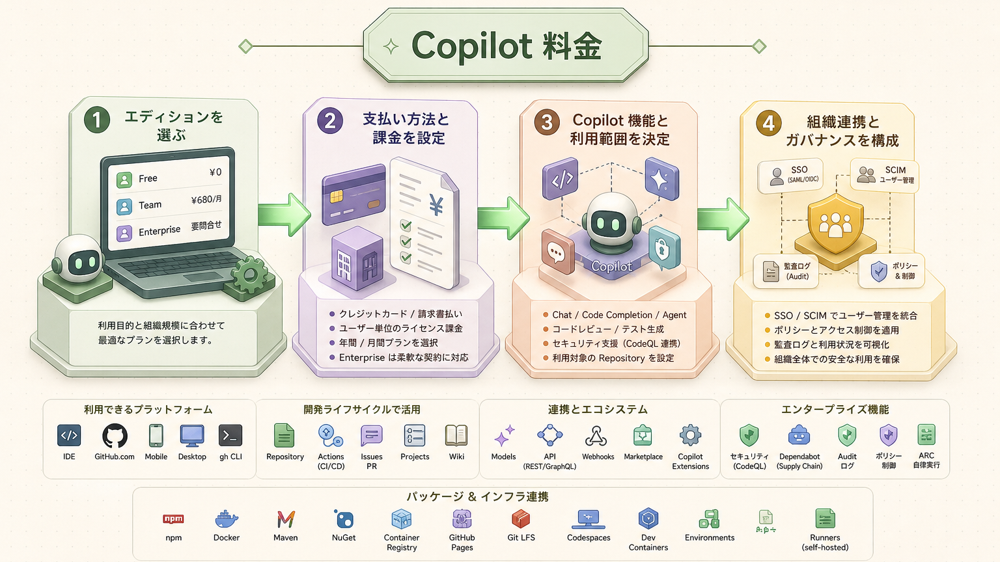

**実用 Tips:**
- macOS runner は 10x 課金。可能なら Linux で代替。
- self-hosted runner は EKS Spot + ARC で大幅圧縮可能。
- Codespaces は `default idle timeout` を org policy で 30 分以下に。
- Copilot 非アクティブユーザを月次で棚卸 (組織管理画面で usage 表示)。
- Actions cache を framework cache (Next.js / Turborepo / Gradle) と組み合わせて 50〜80% 短縮。

---

## 7. ClassLab. での活用ロードマップ（汎用例）

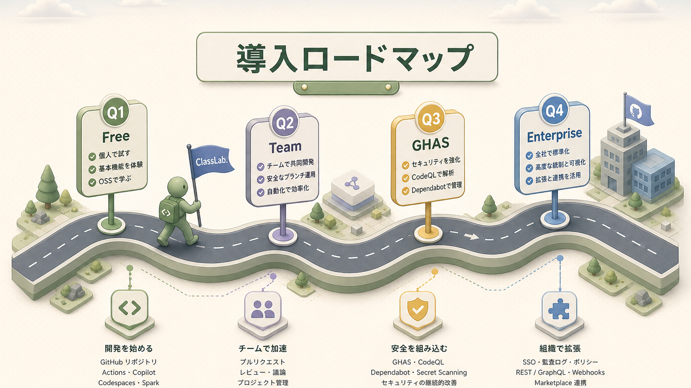

### 7.1 短期（〜3ヶ月）の活用候補

| # | 活用 | 業務領域 | 期待効果 |
|---|---|---|---|
| 1 | 全 repo に Branch Protection + CODEOWNERS 整備 | 受託 / 自社開発全般 | 事故ゼロ、レビュー漏れゼロ |
| 2 | Copilot Business 全員契約 | 全業務領域 | コーディング速度 30〜50% UP |
| 3 | Dependabot + Push Protection を全 repo 標準化 | 受託 / ライフライン | 既知脆弱性の常時 0 件運用 |
| 4 | 共通 Actions Workflow を `.github` repo に集約 | 受託 / 自社開発全般 | 全 repo の lint/test 統一 |
| 5 | OIDC で AWS/GCP/Vercel に static credential ゼロ化 | ライフライン / 自社開発 | 鍵管理事故ゼロ |
| 6 | Codespaces を採用候補者向けに整備 | 採用 / オンボーディング | 試用環境 0 分セットアップ |
| 7 | Copilot Coding Agent を定型 Issue で試験運用 | 業務システム / ライフライン | エンジニア工数の Issue 処理 -40% |
| 8 | Renovate or Dependabot Groups でライブラリ更新 PR を週次集約 | 全業務領域 | レビュー疲労減 |
| 9 | Datadog GitHub App で DORA メトリクス取得 | 自社開発 | チーム生産性の可視化 |
| 10 | GitHub Models で API 鍵管理を集約 | AI ハイブリッド | OpenAI/Anthropic キーを GitHub Token 1 本化 |

### 7.2 中長期（3〜12ヶ月）の活用候補

| # | 活用 | 業務領域 | 期待効果 |
|---|---|---|---|
| 1 | Enterprise Cloud + SAML SSO + SCIM (Okta) | 全業務領域 | アクセス管理を ID 統合 |
| 2 | Advanced Security 段階導入 (Tier1 案件 → 全社) | ライフライン / 業務システム | 監査 + 脆弱性ゼロ運用 |
| 3 | Copilot Enterprise 移行 (Spaces + Custom Models) | 全業務領域 | 業務ドメイン特化 AI |
| 4 | ARC on EKS で self-hosted runner 集約 | 業務システム / ライフライン | runner コスト最適 + 機密処理 |
| 5 | Merge Queue 導入 (monorepo 化と同期) | 全業務領域 | merge 衝突自動解消 |
| 6 | Audit Log Streaming → Datadog | 監査 / 規制案件 | SIEM 一元化 |
| 7 | Reusable Workflow で Salesforce / Findy デプロイ統一 | 業務システム | 移行案件のデプロイ標準化 |
| 8 | GitHub Spark で社内オペレーション UI 量産 | ライフライン | 営業 / オペレーション内製 UI |
| 9 | Project Padawan (early access) で定型変更自動化 | 業務システム | 人手レビューのみで完結 |
| 10 | Copilot Spaces で「ライフライン業務ドメイン」「Salesforce 移行」「Findy 仕様」を分離した社内 AI 知識基盤 | AI ハイブリッド | 新人立ち上がり速度 2x |
| 11 | EMU (Enterprise Managed Users) 移行 | 人事 / コンプライアンス | 退職時 off-boarding 完全自動 |
| 12 | Security Campaigns で四半期 OKR 連動 | 経営 / セキュリティ | 経営 KPI に脆弱性数を組込 |

### 7.3 既存資産棚卸し（推奨アクション）

1. 全 repo の **branch protection 状況**を `gh api` でリスト化、未設定 repo を洗い出し
2. 全 repo の **Dependabot alerts** を集約、Critical / High を期限内に対応する SLO 設定
3. 全 user の **last commit / last login** を抽出、非アクティブ seat を棚卸
4. **Copilot 利用率** を `gh copilot usage` で月次抽出、利用 0 名は契約解除
5. **Actions コスト** を Insights で抽出、上位 5 workflow を最適化対象に
6. **CODEOWNERS** が `.github` の標準ファイルとして全 repo に存在するか確認

---

## 8. 採用判断フロー

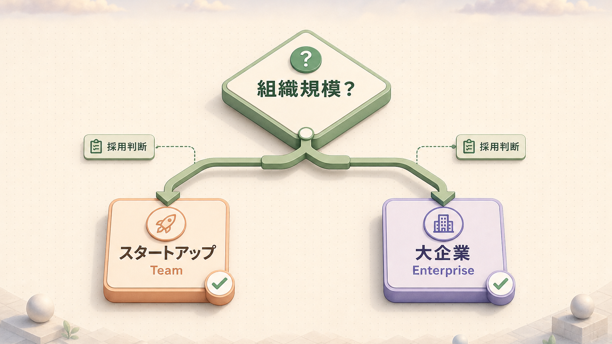

### 8.1 新規プロジェクトでの選択フロー

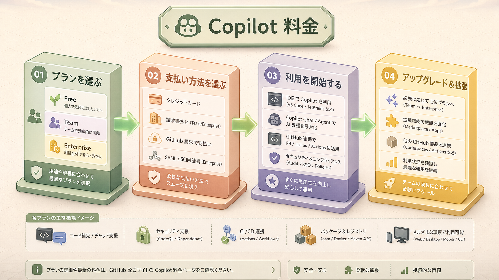

### 8.2 採用適性 Quadrant

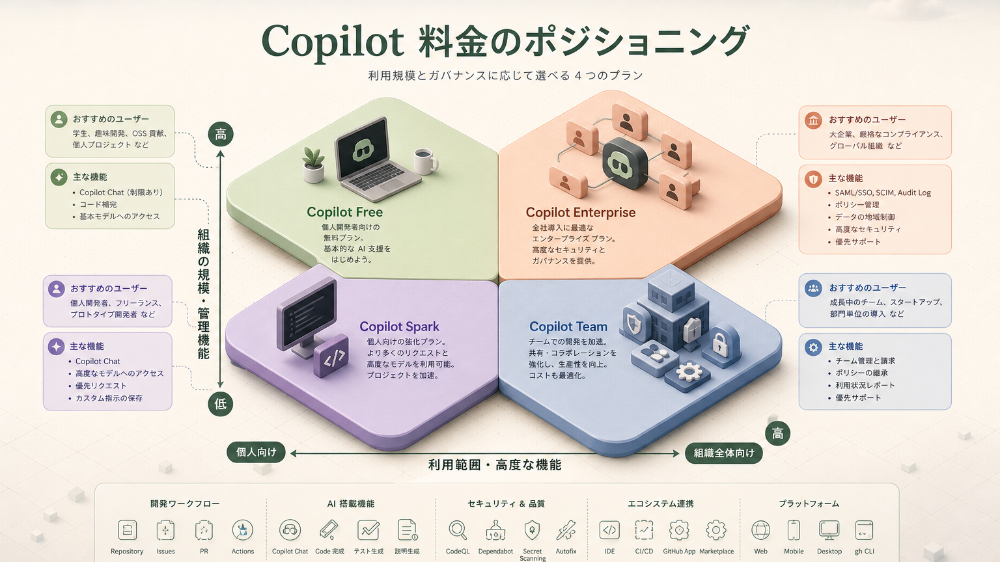

> ClassLab. の中長期目標位置は「GitHub Enterprise の独壇場」象限。GitHub Enterprise Cloud + GHAS + Copilot Enterprise の組合せで完結する。

---

## 9. 公式リファレンス & Sources

### 9.1 公式ドキュメント (Top-level)

- GitHub Docs ホーム: https://docs.github.com/
- GitHub Pricing: https://github.com/pricing
- GitHub Copilot Plans: https://github.com/features/copilot/plans
- GitHub Copilot Docs: https://docs.github.com/en/copilot
- GitHub Actions Docs: https://docs.github.com/en/actions
- GitHub Advanced Security: https://docs.github.com/en/code-security
- GitHub Enterprise: https://github.com/enterprise
- GitHub Marketplace: https://github.com/marketplace
- GitHub Customer Stories: https://github.com/customer-stories
- GitHub Newsroom: https://github.com/newsroom
- GitHub Blog: https://github.blog/
- GitHub Models: https://docs.github.com/en/github-models
- GitHub Spark: https://docs.github.com/en/copilot/concepts/spark

### 9.2 機能別ドキュメント

- Branch protection / Rulesets: https://docs.github.com/en/repositories/configuring-branches-and-merges-in-your-repository/managing-rulesets
- Actions Self-hosted Runners: https://docs.github.com/en/actions/hosting-your-own-runners
- Actions OIDC: https://docs.github.com/en/actions/deployment/security-hardening-your-deployments/about-security-hardening-with-openid-connect
- Codespaces: https://docs.github.com/en/codespaces
- Dependabot: https://docs.github.com/en/code-security/dependabot
- CodeQL: https://codeql.github.com/
- GitHub Apps: https://docs.github.com/en/apps
- GraphQL API: https://docs.github.com/en/graphql
- gh CLI: https://cli.github.com/manual/
- Enterprise Managed Users: https://docs.github.com/en/enterprise-cloud@latest/admin/managing-iam/understanding-iam-for-enterprises/about-enterprise-managed-users

### 9.3 参照した Web Sources

- [GitHub Copilot · Your AI pair programmer](https://github.com/features/copilot)
- [GitHub Introduces Coding Agent For GitHub Copilot · GitHub Newsroom](https://github.com/newsroom/press-releases/coding-agent-for-github-copilot)
- [GitHub Copilot features - GitHub Docs](https://docs.github.com/en/copilot/get-started/features)
- [What's new with GitHub Copilot coding agent - The GitHub Blog](https://github.blog/ai-and-ml/github-copilot/whats-new-with-github-copilot-coding-agent/)
- [See what's new with GitHub Copilot](https://github.com/features/copilot/whats-new)
- [GitHub Copilot · Plans & pricing](https://github.com/features/copilot/plans)
- [GitHub Copilot Pricing 2026: Free vs Pro vs Pro+ (PeCollective)](https://pecollective.com/tools/github-copilot-pricing/)
- [Plans for GitHub Copilot - GitHub Docs](https://docs.github.com/en/copilot/get-started/plans)
- [GitHub Copilot Pricing 2026: $10 Pro to $39 Enterprise (Automation Atlas)](https://automationatlas.io/answers/github-copilot-pricing-explained-2026/)
- [GitHub Copilot Pricing 2026: All 5 Plans Compared](https://githubcopilotpricing.com/)
- [GitHub Copilot is moving to usage-based billing - The GitHub Blog](https://github.blog/news-insights/company-news/github-copilot-is-moving-to-usage-based-billing/)
- [About billing for GitHub Copilot in organizations and enterprises - GitHub Docs](https://docs.github.com/en/copilot/concepts/billing/organizations-and-enterprises)
- [GitHub Pricing 2026: 3 Plans from Free–$21/user/month](https://costbench.com/software/developer-tools/github/)
- [GitHub Software Pricing & Plans 2026 (Vendr)](https://www.vendr.com/marketplace/github)
- [Developers, Reinvented – Thomas Dohmke](https://ashtom.github.io/developers-reinvented)
- [GitHub CEO on Why We'll Still Need Human Programmers - The New Stack](https://thenewstack.io/github-ceo-on-why-well-still-need-human-programmers/)
- [GitHub's Thomas Dohmke on Building Copilot - Sequoia Capital](https://sequoiacap.com/podcast/training-data-thomas-dohmke/)
- [Former GitHub CEO Thomas Dohmke launches Entire](https://entire.io/news/former-github-ceo-thomas-dohmke-raises-60-million-seed-round)
- [GitHub, GitLab, Bitbucket & Azure DevOps: What's The Difference? (BMC)](https://www.bmc.com/blogs/github-vs-gitlab-vs-bitbucket/)
- [Bitbucket vs GitHub (Updated for 2026) - UpGuard](https://www.upguard.com/blog/bitbucket-vs-github)
- [GitHub vs GitLab vs Bitbucket: Feature Comparison - Hoverify](https://tryhoverify.com/blog/github-vs-gitlab-vs-bitbucket-feature-comparison/)
- [GitLab vs GitHub vs Bitbucket: Leading DevSecOps Solutions Compared](https://cloudfresh.com/en/blog/gitlab-github-bitbucket-compared/)
- [How does GitHub compare to other DevOps tools? · GitHub](https://resources.github.com/devops/tools/compare/)
- [GitHub's Success Stories](https://github.com/customer-stories/all)
- [GitHub case study | Stripe](https://stripe.com/customers/github)
- [Shopify case study | Stripe](https://stripe.com/customers/shopify)
- [Customer stories · GitHub](https://github.com/customer-stories)
- [143 GitHub Case Studies, Success Stories & Customer Stories (FeaturedCustomers)](https://www.featuredcustomers.com/vendor/github/case-studies)
- [20+ Best CI/CD Tools for DevOps in 2026 - Spacelift](https://spacelift.io/blog/ci-cd-tools)
- [Top 7 CI/CD Tools to Explore in 2026 - testRigor](https://testrigor.com/blog/ci-cd-tools/)
- [Best GitHub Integrations for 2026 - bugbug.io](https://bugbug.io/blog/test-automation-tools/best-github-integrations/)
- [Best GitHub Security Tools for Secure Repositories - Aikido](https://www.aikido.dev/blog/top-github-security-tools)
- [Best CI/CD tools in 2026 - Northflank](https://northflank.com/blog/best-ci-cd-tools)
- [Best CI/CD Pipeline Tools in 2026 (Scopir)](https://scopir.com/posts/best-cicd-pipeline-tools-2026/)
- [GitHub Marketplace: tools to improve your workflow](https://github.com/marketplace)
- [Best practices working with self-hosted GitHub Action runners at scale on AWS](https://aws.amazon.com/blogs/devops/best-practices-working-with-self-hosted-github-action-runners-at-scale-on-aws/)
- [GitHub Actions Self-Hosted Runner: A Complete Guide (BetterLink)](https://eastondev.com/blog/en/posts/dev/20260423-github-actions-self-hosted-runner/)
- [Build a CI/CD Pipeline in 20 Min with GitHub Actions (Tech-Insider)](https://tech-insider.org/github-actions-ci-cd-pipeline-tutorial-2026/)
- [When to choose GitHub-Hosted runners or self-hosted runners - The GitHub Blog](https://github.blog/enterprise-software/ci-cd/when-to-choose-github-hosted-runners-or-self-hosted-runners-with-github-actions/)
- [Self-hosted runners - GitHub Docs](https://docs.github.com/en/actions/hosting-your-own-runners/managing-self-hosted-runners/about-self-hosted-runners)
- [GitHub Copilot 2026: Complete Guide - NxCode](https://www.nxcode.io/resources/news/github-copilot-complete-guide-2026-features-pricing-agents)
- [About GitHub Spark - GitHub Docs](https://docs.github.com/en/copilot/concepts/spark)
- [GitHub Copilot Evolves: Agent Mode and Multi-Model Support - DevOps.com](https://devops.com/github-copilot-evolves-agent-mode-and-multi-model-support-transform-devops-workflows-2/)
- [GitHub Copilot Introduces Agent Mode and Next Edit Suggestions](https://github.com/newsroom/press-releases/agent-mode)
- [GitHub Updates Spark, Its AI Prompt-Based App Builder - Visual Studio Magazine](https://visualstudiomagazine.com/articles/2025/12/12/github-updates-spark-its-ai-prompt-based-app-builder.aspx)
- [GitHub Weekly: Copilot Hits Infrastructure Limits, Security Gets Smarter](https://htek.dev/articles/github-weekly-2026-04-21/)
