**対象**: Google I/O 2026 をリアルタイムで追えなかった、または発表が多すぎて全体像を掴みかねている開発者・PdM
**ゴール**: Gemini 3.5 / Antigravity 2.0 / WebMCP / Android XR グラス / TPU 第8世代まで含めた I/O 2026 の発表マップを **1 記事で把握** し、自分の領域に関連する公式リンクへ最短到達する

---

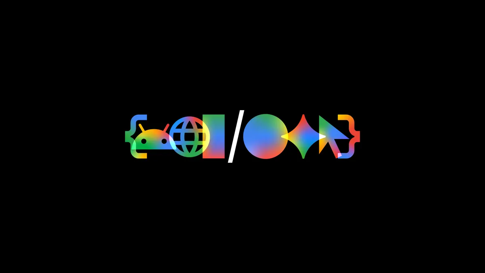

## 0. なぜ今年の I/O は「エージェントの年」だったのか

去年の I/O 2025 が「Gemini 2.5 と Project Astra のお披露目」だったのに対し、今年は **AI モデル単体ではなくエージェントの周辺装備が主役** になった。Sundar Pichai の基調講演で繰り返されたフレーズは "from AI that simply assists you, to agents that can independently navigate"（補助する AI から、自律的に動くエージェントへ）。

実数値で裏付けると:

- Google のトークン処理量: **月間 3.2 クアドリリオン以上** (前年比 7 倍)
- API 利用開発者: **月間 850 万人超**
- 月間 1 兆トークン以上を処理する Cloud 顧客: **375 社以上**
- インフラ Capex: 2022 年 $310 億 → **2026 年 $1,800〜1,900 億** (約 6 倍)

つまり「LLM を呼ぶアプリ」から「LLM が常駐して仕事を回すエージェント」へ需要のかたまりが移った前提で、開発者向けのスタック全体を再構成してきたのが今年の I/O だ。以降のセクションで、その再構成を **「モデル」→「エージェント基盤」→「Web 開発」→「Android 開発」→「プロダクト」→「ハードウェア」→「インフラ」** の順に通読できるようまとめる。

https://blog.google/innovation-and-ai/sundar-pichai-io-2026/

---

## 1. Gemini 3.5 シリーズ — フラッグシップは「速い Flash」になった

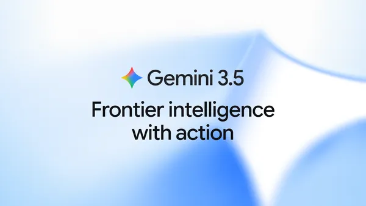

### 1.1 Gemini 3.5 Flash

最大の方針転換は **「Pro より Flash が主役」** になったこと。

- ベンチマーク
  - Terminal-Bench 2.1: **76.2%**
  - GDPval-AA: **1,656 Elo**
  - MCP Atlas: **83.6%**
  - CharXiv Reasoning (マルチモーダル): **84.2%**
- **Gemini 3.1 Pro をほぼ全ベンチで上回り**、他のフロンティアモデルの **4 倍の出力速度** (tokens/sec)
- Artificial Analysis Index の「Intelligence vs Output Speed」プロットで右上に位置
- リッチでインタラクティブな Web UI / グラフィックスをマルチモーダルに生成
- 提供窓口: Gemini App / AI Mode (Search) / Antigravity / Gemini API (AI Studio + Android Studio) / Gemini Enterprise Agent Platform

「内部最適化版の Flash は他フロンティアモデルより **12 倍高速**」とも明言されており、Antigravity の裏で動くサブエージェント群は基本これ。Pro の存在感は今年は明らかに薄かった。

### 1.2 Gemini Omni Flash

「あらゆる入力モダリティから任意の出力モダリティへ」という Omni Flash も同時発表。立ち上げはまずビデオ出力からで、Gemini App と SNS から利用可能。

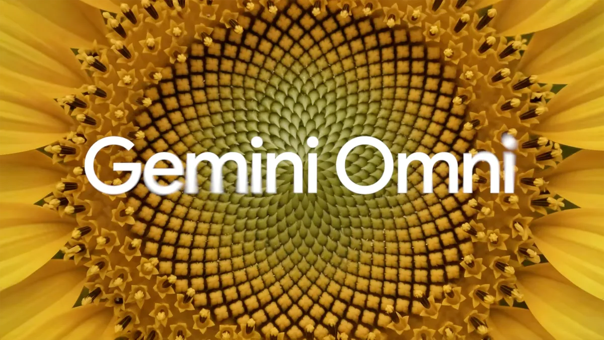

https://blog.google/innovation-and-ai/models-and-research/gemini-models/gemini-3-5/

---

## 2. Gemini Spark — 24/7 で動くパーソナル AI エージェント

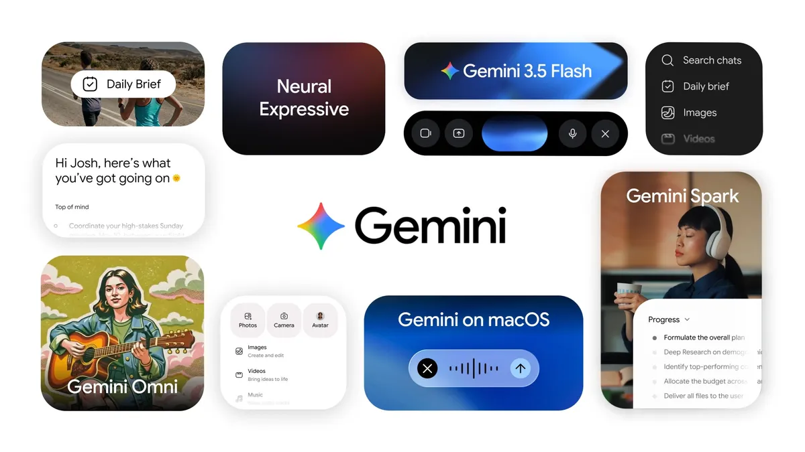

「Gemini App の進化形」として、ChatGPT における Operator / Atlas に相当するレイヤーが Google 純正で出てきた。

- バックグラウンドで長時間タスクを継続実行
- Google Cloud 上の **専用仮想マシン** で稼働 (ユーザーごとに分離)
- メール / チャット経由でのアクセスにも対応予定
- 提供: 信頼テスター(今週) → 来週から **Google AI Ultra 加入者向けの US ベータ**
- Web 版は本日、macOS 版は夏ロールアウト
- セーフティ: **高額決済やメール送信の前に必ず確認** を入れる仕組みが標準搭載
- MCP 連携パートナー: Canva / OpenTable / Instacart (本日付)

価格に関しては「Google AI Ultra: $100/月」のラインで提供される。Pro プラン比で **Antigravity の利用枠は 5 倍** とアナウンスされており、5月25日までの登録なら **$100 分のボーナスクレジット** が付く。

https://blog.google/innovation-and-ai/products/gemini-app/next-evolution-gemini-app/

---

## 3. Antigravity 2.0 — IDE から「マルチサーフェスのエージェント基盤」へ

2025 年 11 月にローンチされた Antigravity (IDE) は、今年の I/O で **デスクトップアプリ + CLI + SDK + Managed Agents** の 4 サーフェス構成に再設計された。Cursor / Devin / Codex CLI に対する Google 側の総合的な回答と読める。

### 3.1 Antigravity 2.0 Desktop App

- スタンドアロンのデスクトップアプリ (旧 IDE モードからの再出発)
- **マルチエージェントのオーケストレーション** を UI の中心に据え、複数のエージェントを並列に走らせて結果をマージ
- **動的サブエージェント**: メインエージェントが必要に応じて専門サブエージェントを spawn
- **Scheduled tasks**: バックグラウンドで cron 的に自動実行
- **Google AI Studio / Android / Firebase / Cloud Run** とのエコシステム統合

### 3.2 Antigravity CLI

- "Lightweight, high-velocity" を掲げたコマンドラインインターフェース
- GUI を必要としない CI / バッチ用途を想定
- サブエージェントは **クロスプラットフォームのターミナルサンドボックス + クレデンシャルマスキング + 強化された Git ポリシー** で保護
- 旧 `gemini-cli` は CLI 系のデフォルト位置を Antigravity CLI に明け渡した形

### 3.3 Antigravity SDK

- Google プロダクト内部で動いている **同じエージェントハーネスにプログラマティックアクセス**
- Gemini モデルに最適化、ただし **任意のインフラ** にホスト可能
- カスタムエージェント挙動の定義、ツール登録、評価フックなどを TypeScript / Python から記述
- "Devin / Cursor を内部で再現したいチーム" 向けの土台になる

### 3.4 Managed Agents (Gemini API)

```bash
# 1 行で隔離 Linux 環境ごと立ち上がるエージェント
curl -X POST https://generativelanguage.googleapis.com/v1/managed_agents \
  -H "x-goog-api-key: $GEMINI_API_KEY" \
  -d '{"model":"gemini-3.5-flash","tools":["code_exec","web_search"]}'
```

- **インフラ設定ゼロ** で「推論する・ツールを使う・隔離 Linux 環境でコードを実行する」エージェントを即起動
- 単一 API 呼び出しで完全プロビジョニング
- SaaS 開発者が「自分でサンドボックスを立てる」必要がなくなった点が大きい

### 3.5 Google AI Studio モバイルアプリ

- iOS / Android で **事前登録受付中**
- 「移動中にアイデアを掴んでスマホで投げ、デスクに戻る頃にはプロトタイプが出来上がっている」体験を狙ったクライアント
- AI Studio 自体には Kotlin ネイティブ対応 + Google Play Console 統合が追加され、Android アプリの "Prompt-to-build" がさらに本気モードに

https://blog.google/innovation-and-ai/technology/developers-tools/google-io-2026-developer-highlights

---

## 4. Web 開発 — WebMCP / Chrome DevTools for Agents / HTML-in-Canvas

ブラウザ側もエージェントを前提に再武装。重要なのは以下 4 点。

### 4.1 WebMCP (Web Model Context Protocol)

- **ブラウザベースの AI エージェント向けオープン規格**
- Web ページが JavaScript 関数 / HTML フォームなどを **構造化ツールとしてエージェントに露出**
- **Chrome 149 でオリジン試験** スタート
- Gemini in Chrome から呼び出される予定

最小例 (記事内サンプル — 仕様はオリジン試験中で変化する可能性あり):

```html
<script type="application/webmcp">
{
  "tools": [
    {
      "name": "search_products",
      "description": "商品を検索する",
      "handler": "window.__mcp__.searchProducts",
      "schema": {
        "type": "object",
        "properties": { "query": { "type": "string" } }
      }
    }
  ]
}
</script>
```

Chrome Extension で「ブラウザに常駐するエージェント」を作ってきた人にとって、これは **Open Standards 側からの正規ルートが用意された** という意味で大きい。

### 4.2 Chrome DevTools for Agents

- 品質監査・リアルユーザー体験エミュレーション・**セッションハンドオーバー** までを DevTools 側で自動化
- 手動でブラウザを開いて確認する作業をエージェントに委譲できる

### 4.3 HTML-in-Canvas API

- **`<canvas>` の中に DOM を埋め込んで、WebGL / WebGPU シーンと共存させる**
- "Immersive 3D experiences that remain fully searchable" がキーフレーズで、ゲーム / 没入体験でも SEO とアクセシビリティを犠牲にしない
- オリジン試験開始

### 4.4 Modern Web Guidance

- コーディングエージェント向けの **専門家が検証したスキルセット**
- 100 以上のユースケースをカバーし、Baseline と直接統合・自動フォールバック
- Antigravity からワンクリックインストール、または CLI 経由でインストール可能

https://developer.chrome.com/docs/ai/webmcp

---

## 5. Android 開発 — CLI / Bench / Migration Agent / Halo UI

### 5.1 Android CLI & スキル

- AI 向けのスタンドアロン CLI
- **Android SDK の自動ダウンロード**、デバイス実行までを 1 ツールで完結
- ベストプラクティス集をオープンソース化し、**任意のエージェント / LLM / ツール** から呼び出せる中立的なインターフェイスに

https://goo.gle/CLI_IO26

### 5.2 Android Bench

- Android 開発タスク向けの **LLM リーダーボード** (d.android.com/bench)
- Gemma 4 などのオープンウェイトモデルが追加
- 「Android 開発ではどのモデルが強いのか」を選ぶ材料になる

### 5.3 Migration Agent (Android Studio プレビュー)

- React Native / Web フレームワーク / iOS → Kotlin の **自動マイグレーション**
- 「数週間 → 数時間」と紹介されたが、規模・既存コード品質依存なのは要注意
- まずは Android Studio 内のプレビュー機能

### 5.4 Android Halo

- Spark などのエージェントの **ライブ更新やタスク進捗を OS レベル UI で表示** する仕組み
- 年内後半ローンチ予定
- iOS の Live Activities や Dynamic Island に近いポジショニング

---

## 6. Search の 30 年ぶり大改修 — Ask YouTube / Ask Maps / Generative UI

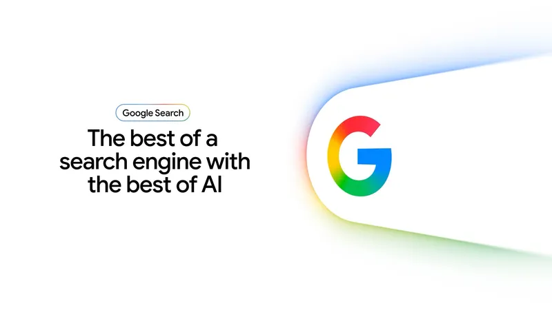

### 6.1 Ask YouTube

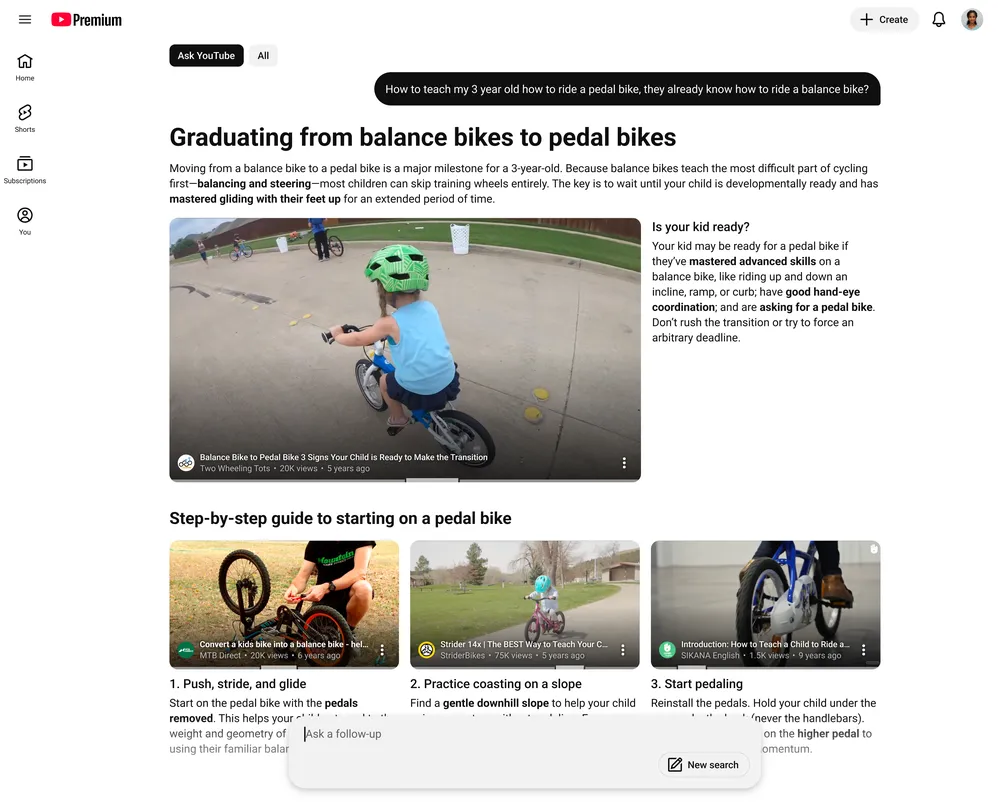

- 関心に合致する動画 + **動画内の関連箇所への直接ジャンプ**
- 米国で夏ロールアウト

### 6.2 Ask Maps

- **Maps の 10 年ぶり大改修**
- 自然言語で「日曜の昼に子連れで行ける、駐車場ありで雨でも遊べる場所」みたいな複雑質問に対応
- 既にユーザーの問い合わせ平均長さが伸びているとのこと

### 6.3 Search 内インテリジェンスエージェント

- 24/7 バックグラウンドで動き、必要なタイミングで検索・アクションを自律実行
- Google AI Pro / Ultra 加入者向けに夏ロールアウト

### 6.4 ジェネレーティブ UI

- 質問内容に応じた **カスタムレイアウト + インタラクティブビジュアル** を自動生成
- 夏に全ユーザー無料提供

「検索結果ページを LLM に書かせる」を全ユーザーに無料で配るのは、UX 的にも広告ビジネス的にもインパクトが大きい。

---

## 7. Workspace / Creator 系プロダクト

### 7.1 Google Pics

- Nano Banana ベースの AI 画像生成・編集
- 要素単位でのオブジェクト操作 (人物だけ差し替える、背景だけ変える、など)
- 信頼テスター向け提供中 → 夏に Google AI Pro / Ultra 加入者へ

### 7.2 Google Flow

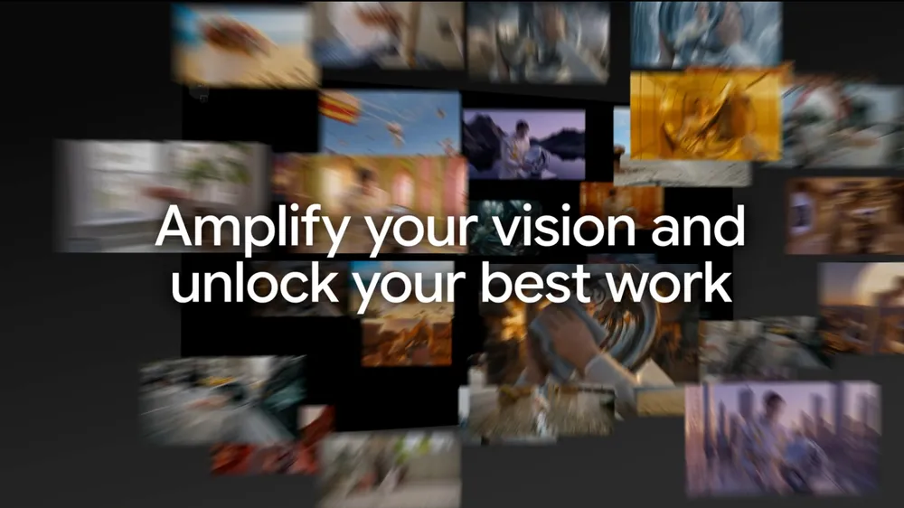

- 動画系の「複雑タスクを計画 + 推論」できるエージェント
- ブレインストーミングから編集まで、ビデオエフェクト設計ツールと連動

### 7.3 Daily Brief / Docs Live

- **Daily Brief**: Gmail + Calendar + Tasks を統合した朝の要約。Plus / Pro / Ultra 向け、まず US から
- **Docs Live**: 音声で「脳ダンプ → 自動文書化」、夏に加入者向け。Gmail / Keep にも展開予定

### 7.4 Neural Expressive

- Gemini App の新デザイン言語
- 流動的アニメ + 鮮やかな色 + 触覚フィードバック
- Web / Android / iOS で本日ローンチ、全ユーザー無料

---

## 8. Android XR Intelligent Eyewear — 今秋ローンチ

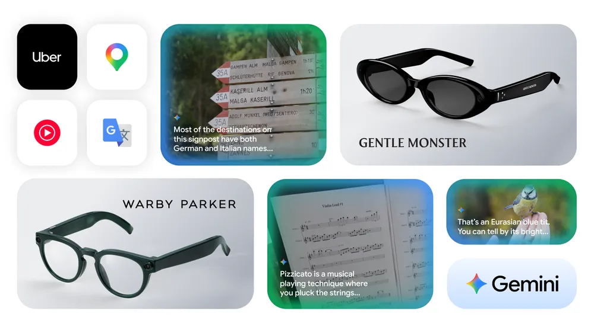

VP & GM of XR の Shahram Izadi から発表された Android XR 最新版。

- 2 種類のフォームファクター
  - **Audio glasses** (耳元スピーカーから音声で案内 / 質問応答) — **今秋ローンチ**
  - **Display glasses** (情報をレンズ内に表示) — 後追いで提供
- パートナー: **Samsung / Qualcomm + Gentle Monster (黒フレーム) + Warby Parker (ダークグリーンフレーム)**
- Gemini 連携機能
  - "Hey Google" もしくはフレームタップで起動
  - 周囲のオブジェクトに対する質問応答 (Visual QA)
  - **コンテキスト認識付きターン式ナビゲーション** (向いている方向を把握する)
  - 音声 + 書記の **リアルタイム翻訳 (ボイス模倣付き)**
  - ハンズフリー通話 / メッセージ / 音楽
  - 写真 / 動画撮影 + Nano Banana 背景除去
  - マルチステップタスク (例: フードオーダー)
  - Uber / Mondly / Doordash 等のサードパーティ統合
- **Android にも iOS にもペアリング可能** (Apple ロックインを意図的に外した設計)

Apple Vision Pro が「家の中の据置 XR」を志向していたのに対し、Google 側は **「街に持ち出す軽量 AI ウェアラブル」** という、より日常密着のポジションを取りに来た。

https://blog.google/products-and-platforms/platforms/android/android-xr-io-2026/

---

## 9. TPU 第 8 世代 — Training / Inference を 2 系統に分割

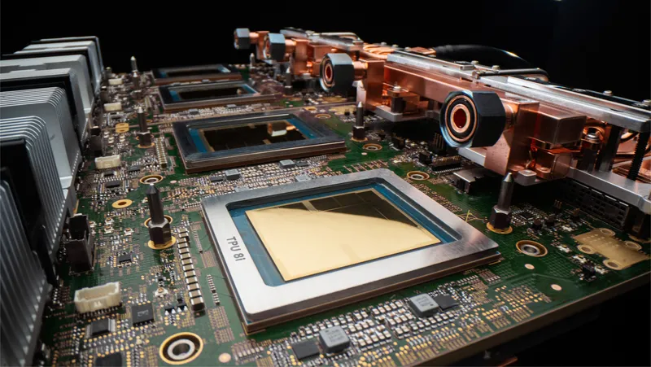

ハードウェア側の主役は、訓練用 **TPU 8t** と推論用 **TPU 8i** の 2 チップ構成。

### 9.1 TPU 8t (Training)

- 1 ポッドあたり前世代比 **約 3 倍の演算性能**
- 単一スーパーポッドで **121 ExaFlops** / 9,600 チップ / 共有メモリ 2 ペタバイト
- ICI 帯域は前世代の 2 倍、TPUDirect でストレージアクセスは **10 倍高速**
- 100 万チップ規模までほぼ線形にスケール、**Goodput (有効計算時間) は 97% 超**

### 9.2 TPU 8i (Inference)

- HBM **288 GB** + オンチップ SRAM **384 MB** (前世代の 3 倍)
- **前世代比 +80% の性能/価格比**
- ICI 帯域 19.2 Tb/s (MoE モデル最適化)
- 新トポロジ **Boardfly** でネットワーク径を **約 50% 削減**
- **Collectives Acceleration Engine** によりオンチップレイテンシを最大 1/5 に

### 9.3 共通仕様

- 前世代 Ironwood 比 **性能/W 約 2 倍**
- 第 4 世代液冷で空冷では到達不可能な実装密度
- JAX / MaxText / PyTorch / SGLang / vLLM 対応
- **仮想化オーバーヘッドなしのベアメタル提供**
- **Google AI Hypercomputer** スタックに統合
- 一般提供は 2026 年後半予定

数字だけ見ると、Blackwell に対して **「推論専用チップ」をハイパースケーラとして明示的に独立 SKU 化** してきたのが大きい。エージェント時代は推論コストの方が支配的になるという読み筋がはっきり出ている。

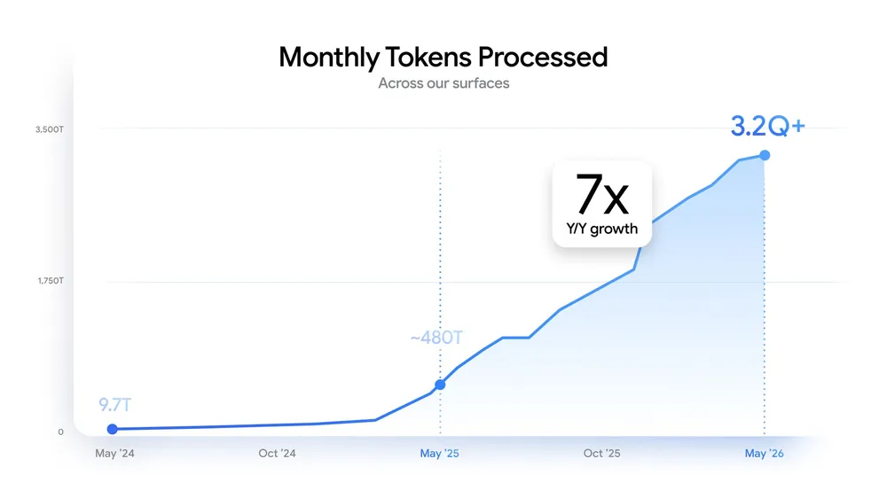

https://blog.google/innovation-and-ai/infrastructure-and-cloud/google-cloud/eighth-generation-tpu-agentic-era/

---

## 10. SynthID と AI 透明性 — OpenAI / Kakao / Eleven Labs も採用

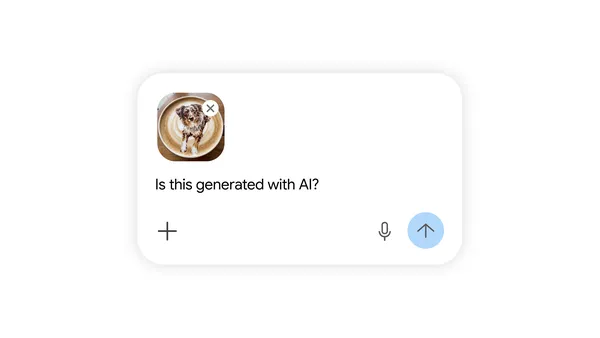

- 既に **1,000 億超の画像 / 動画** に Google の不可視透かし SynthID が付与済み
- **OpenAI / Kakao / Eleven Labs** が SynthID を採用 (業界横断の標準化が一歩進んだ)
- **Content Credentials の検証** が Search と Chrome に統合され、AI 生成か撮影か、加工有無を直接表示

これは規制 (EU AI Act / 米州ごとの AI 開示法) 側に向けた、業界アライアンス志向の打ち手と読める。

---

## 11. Gemini for Science — 30+ ライフサイエンス DB と連携

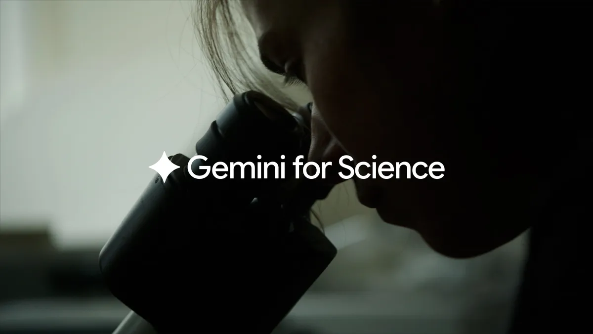

- Deep Think / Deep Research を統合した研究加速ツール群
- 30 以上の **ライフサイエンス DB / ツール** と連動
- 一般向けより、研究機関 + バイオ系スタートアップ向けの "Antigravity for Science" として位置付け

https://labs.google/science

---

## 12. Build with Gemini XPRIZE — $200 万のハッカソン

- **賞金総額 $200 万 — ハッカソン史上最大規模**
- ファイナリストは 2026 年 9 月の Moonshot Gathering (ロサンゼルス) でピッチ
- Gemini API + Antigravity SDK を使った Greenfield プロダクトが対象

参加要件は緩く、Hobbyist / Side-project 開発者でもエントリーできる設計。

---

## 13. 開発者として今すぐ手を付けるなら

最後に「どこから触り始めると一番リターンが大きいか」だけ、優先度付きでまとめる。

| 優先度 | 触る場所 | 理由 |
|:---|:---|:---|
| ⭐⭐⭐ | **Gemini 3.5 Flash** を既存パイプラインの主力モデルに差し替え | 速度 4 倍 / 価格据え置きで、ほぼノーリスクで体感性能が上がる |
| ⭐⭐⭐ | **Antigravity CLI** を Codex CLI / Devin の代替候補として評価 | サブエージェント + サンドボックスがネイティブ、社内 IT 規定との相性が良い |
| ⭐⭐ | **Managed Agents (Gemini API)** で社内ボットを 1 つだけ作ってみる | サンドボックス自前構築の運用負荷ゼロが効く |
| ⭐⭐ | **WebMCP** をプロダクトの検索 / フォームに 1 ヶ所だけ仕込む | Chrome 149 のオリジン試験中に動かしておくと、Gemini in Chrome 解禁時に先行優位 |
| ⭐ | **Android Migration Agent** プレビュー | 既存 React Native / iOS コードベースを Kotlin に寄せたい人のみ。それ以外は様子見でよい |
| ⭐ | **Gemini Spark** はユーザーとして触る | 開発者目線では「Operator 競合の UX 観察」が一番のリターン |

---

## 14. 公式リンク一覧

- [Sundar Pichai の I/O 2026 基調講演まとめ](https://blog.google/innovation-and-ai/sundar-pichai-io-2026/)
- [Developer Keynote 公式まとめ](https://developers.googleblog.com/all-the-news-from-the-google-io-2026-developer-keynote/)
- [Gemini 3.5 シリーズ](https://blog.google/innovation-and-ai/models-and-research/gemini-models/gemini-3-5/)
- [Gemini App / Spark の進化](https://blog.google/innovation-and-ai/products/gemini-app/next-evolution-gemini-app/)
- [Developer Highlights](https://blog.google/innovation-and-ai/technology/developers-tools/google-io-2026-developer-highlights/)
- [Android XR Intelligent Eyewear](https://blog.google/products-and-platforms/platforms/android/android-xr-io-2026/)
- [TPU 第 8 世代](https://blog.google/innovation-and-ai/infrastructure-and-cloud/google-cloud/eighth-generation-tpu-agentic-era/)
- [Antigravity 公式](https://antigravity.google/)
- [Google AI Studio](https://aistudio.google.com/)
- [Chrome WebMCP ドキュメント](https://developer.chrome.com/docs/ai/webmcp)
- [Chrome DevTools for Agents](https://developer.chrome.com/docs/devtools/agents)
- [Android CLI](https://goo.gle/CLI_IO26)
- [Android Bench](https://d.android.com/bench)
- [Gemini for Science](https://labs.google/science)
- [I/O 2026 公式サイト (オンデマンド)](https://io.google/2026/)

---

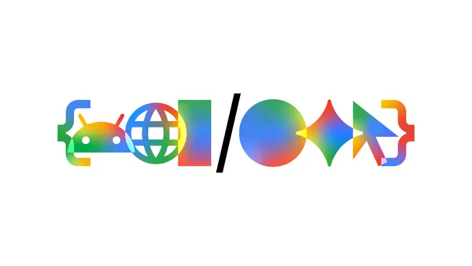

I/O 2026 を一言でまとめるなら、**「モデルの強さを語る I/O は終わり、エージェント基盤の整備度を語る I/O が始まった」**。Gemini 3.5 単体の数値より、Antigravity 2.0 のサーフェスの広さや WebMCP のような Open Standard 側の動きの方が、来年の開発体験を大きく変える可能性が高い。
