# Linear 全機能カタログ（2026-05 時点）

> プロダクト開発チームのための、コーディングエージェント時代の Issue Tracker。
> 「人間も Agent も一級市民として動かす」開発オペレーティングシステム。

---

## 0. TL;DR

### 一行サマリ

**Linear は "Issue Tracker" を再定義し、2026 年時点で「コーディングエージェントを一級メンバーとして組み込んだ製品開発 OS」に進化した。**速度・craft・focus を価値の中心に据え、Jira/Asana の対極を行く設計判断で OpenAI・Ramp・Vercel・Cash App などを顧客に持つ。

### 旧知識との差分（LLM 訓練データで陳腐化しやすい論点）

LLM の訓練データ（〜2024 年）に基づく Linear 像は、2026 年現在のものとは大きく乖離している。以下を上書き宣言する:

1. **プラン名再編**: 旧 `Standard` プランは `Basic`（$10/user/月）に改名され、`Business` が $16/user/月、`Enterprise` が要見積。Free は **無制限メンバー** だが **250 issues / 2 teams** の上限。
2. **Linear Agent が全プランで GA**（2026-03-24）: チャット・Slack・Microsoft Teams・Issue コメントから対話的に呼び出せる組み込みエージェント。
3. **Linear for Agents エコシステム**: Devin / Codex / Cursor / GitHub Copilot / Claude Code (Cyrus) / Factory / Sentry Agent / Jules / v0 / Windsurf / Zed など 20+ の外部 AI エージェントが Linear Issue を起点に動く時代に。
4. **Linear MCP サーバー公式提供**: `https://mcp.linear.app/mcp` で OAuth 2.1 認証付きで稼働。任意の MCP 対応 AI クライアントから Linear データに安全アクセス可能。
5. **Code Intelligence**（2026-05-14 GA）: Linear Agent にリポジトリの読み取り権限を与え、「プロダクトが実際にどう動くか」をエージェントに推論させる新機能。Business 以上。
6. **Customer Requests + Product Intelligence**: Intercom / Zendesk / Front / Salesforce / Slack から顧客フィードバックを集約し、AI が自動で team / labels / projects を推定。GTM × Product 統合のための新しい型。
7. **Triage Intelligence / Insights は Business 以上、Dashboards は Enterprise**: 「AI とアナリティクスは Business から」が現行ライン。
8. **Releases**（2026-04-30）: CI/CD 統合でデプロイ環境とバージョンを追跡し、Issue ステータスを自動更新する新機能。
9. **Multi-level sub-teams**（2026-04-09）: 5 階層までのサブチーム構造で組織階層を表現可能になった。
10. **Project Slack channels 自動生成**（2026-05-21）: 新規プロジェクト作成時に Slack チャネルを自動作成し、参加者と通知を自動構成。

### 最大差別化点（vs Jira / Shortcut / Asana）

| 観点 | Linear | Jira | Shortcut | Asana |
|---|---|---|---|---|
| **速度** | 全操作が即時、キーボード駆動 | 重い、ページ遷移多い | 中速 | 中速 |
| **対象** | 開発者ファースト、Agent ネイティブ | 大規模・全部入り設定可能 | 開発者寄り、PM/Design も配慮 | 非エンジニア横断 |
| **AI/Agent** | Linear Agent + MCP + Code Intelligence が標準 | Atlassian Intelligence、Agent は別売 | 限定的 | Asana Intelligence、開発文脈は弱い |
| **思想** | Craft / Focus / Opinionated | Configurable / Universal | Balanced | Cross-functional |
| **料金** | $10〜$16/user | $7〜$15.25/user + Premium | $8.50〜$12/user | $10.99〜$24.99/user |

> **要点**: Linear の差別化は「速い・美しい・Opinionated」だけでなく、2026 年では **「Agent と人間が同じ Issue 上で協働する設計」が他社より 1〜2 世代先行している**点。

---

## 1. Linear とは何か — 理念とミッション

### 1.1 ミッション
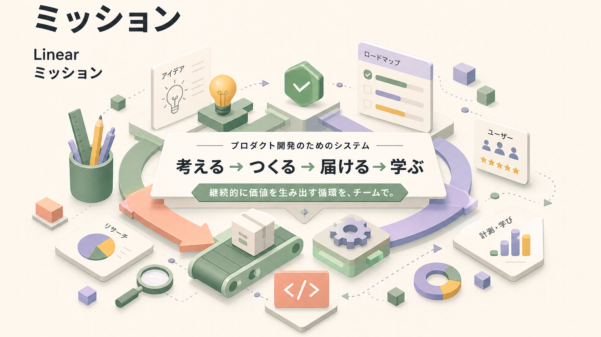

> **"The system for product development."**
> （プロダクト開発のためのシステム）

Linear は単なる「Issue Tracker」を名乗らない。プロダクトをつくる活動全体 — 計画・実行・顧客対話・分析 — を 1 つの一貫したシステムにまとめることを使命としている。

### 1.2 哲学（CEO Karri Saarinen の表現）
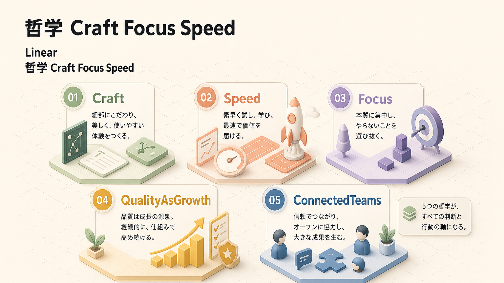

| 価値観 | 公式表現の要旨 |
|---|---|
| **Craft（職人性）** | 「impenetrable quality」を差別化の中心に据える。Zuckerberg の "move fast and break things" の対極。 |
| **Speed（速度）** | 「The fastest issue tracker available. Everything loads instantly.」操作の即時性そのものが UX 価値。 |
| **Focus（焦点）** | 機能を追加するより削る／磨く方を優先。Opinionated な選択を辞さない。 |
| **Quality as Growth** | 「Product quality is the best growth hack.」マーケより口コミを信じる。 |
| **Connected Teams** | "no handoff to dev"。デザイン・実装・運用の責任分離を否定し、全員が品質の所有者。 |

### 1.3 なぜ存在するか
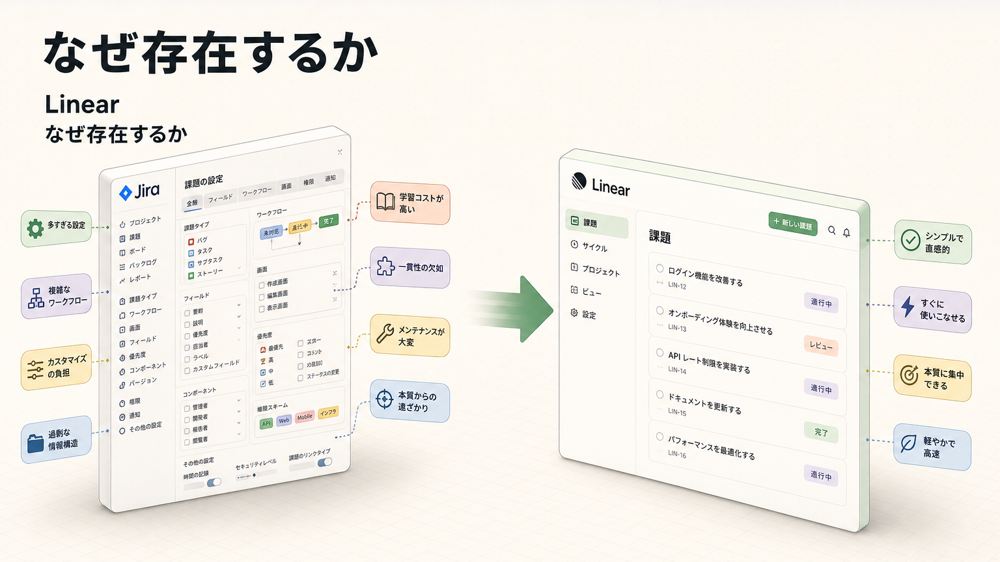

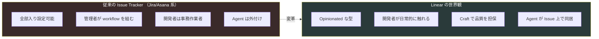
```mermaid
flowchart LR
    subgraph Old["従来の Issue Tracker （Jira/Asana 系）"]
        A1[全部入り設定可能]
        A2[管理者が workflow を組む]
        A3[開発者は事務作業者]
        A4[Agent は外付け]
    end
    subgraph New["Linear の世界観"]
        B1[Opinionated な型]
        B2[開発者が日常的に触れる]
        B3[Craft で品質を担保]
        B4[Agent が Issue 上で同居]
    end
    Old -.変革.-> New
    style Old fill:#3a2a2a,color:#fff
    style New fill:#2a3a3a,color:#fff
```

「ツールが組織の動きを決める」ことを認め、ツール側で **正しい型** を提供する立場。

### 1.4 エンジニアにとっての意味（立場別）
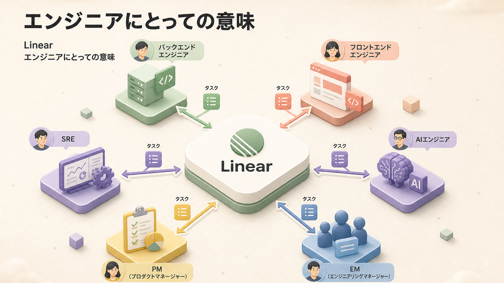

| 立場 | Linear が変えること |
|---|---|
| **フロントエンド** | Issue → ブランチ自動作成、PR 自動リンク、Figma 連携でデザイン↔実装のループが Linear 上で完結。 |
| **バックエンド** | GraphQL API / Webhook で自前のオートメーションが書きやすい。Cycle / Project 粒度でデリバリ管理。 |
| **SRE / Platform** | Releases で CI/CD パイプラインと Issue を双方向同期。Sentry Agent が障害を Issue 化。 |
| **AI / ML** | Linear MCP + Code Intelligence でコーディングエージェントが Linear Issue を起点に動く。Agent Skills で自社ワークフローを記録・再利用。 |
| **PM / プロダクト** | Customer Requests で顧客の声と Roadmap が直結。Insights でサイクルタイム・スループットを即可視化。 |
| **EM / 部門長** | Initiatives で OKR レベルの戦略を、Project / Cycle で実行を、Insights でメトリクスを 1 ツールに集約。 |

---

## 2. 全体マップ（1 枚絵）

### 2.1 サービス全体俯瞰
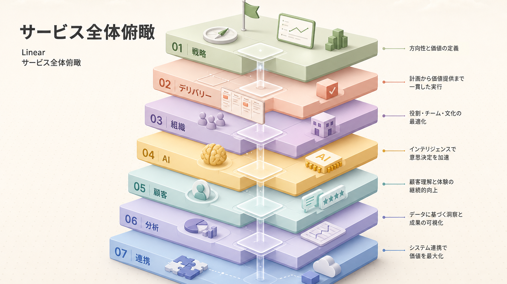

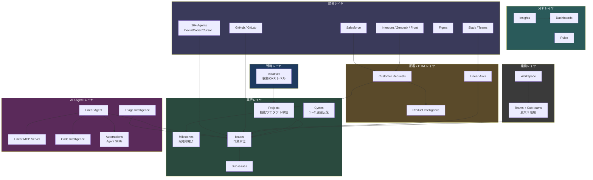
```mermaid
flowchart TB
    subgraph Strategy["戦略レイヤ"]
        INIT[Initiatives<br/>事業/OKR レベル]
    end
    subgraph Delivery["実行レイヤ"]
        PROJ[Projects<br/>機能/プロダクト単位]
        MILE[Milestones<br/>段階的完了]
        CYC[Cycles<br/>1〜2 週間反復]
        ISS[Issues<br/>作業単位]
        SUB[Sub-issues]
    end
    subgraph Org["組織レイヤ"]
        WS[Workspace]
        TEAM[Teams + Sub-teams<br/>最大 5 階層]
    end
    subgraph AI["AI / Agent レイヤ"]
        AGENT[Linear Agent]
        MCP[Linear MCP Server]
        CODEI[Code Intelligence]
        TRIAGE[Triage Intelligence]
        AUTO[Automations<br/>Agent Skills]
    end
    subgraph Customer["顧客 / GTM レイヤ"]
        CR[Customer Requests]
        ASKS[Linear Asks]
        PI[Product Intelligence]
    end
    subgraph Analytics["分析レイヤ"]
        INS[Insights]
        DASH[Dashboards]
        PULSE[Pulse]
    end
    subgraph Integrations["統合レイヤ"]
        GH[GitHub / GitLab]
        SLACK[Slack / Teams]
        SUPPORT[Intercom / Zendesk / Front]
        CRM[Salesforce]
        DESIGN[Figma]
        EXT[20+ Agents<br/>Devin/Codex/Cursor...]
    end

    WS --> TEAM
    INIT --> PROJ
    PROJ --> MILE
    PROJ --> ISS
    CYC --> ISS
    ISS --> SUB
    TEAM --> ISS
    AGENT --> ISS
    AGENT --> MCP
    AGENT --> CODEI
    AGENT --> AUTO
    TRIAGE --> ISS
    CR --> PROJ
    CR --> PI
    ASKS --> ISS
    INS --> DASH
    GH --> ISS
    SLACK --> ASKS
    SUPPORT --> CR
    CRM --> CR
    EXT --> ISS

    style Strategy fill:#1e3a5f,color:#fff
    style Delivery fill:#2a4a3e,color:#fff
    style Org fill:#3a3a3a,color:#fff
    style AI fill:#5a2a5a,color:#fff
    style Customer fill:#5a4a2a,color:#fff
    style Analytics fill:#2a5a5a,color:#fff
    style Integrations fill:#3a3a5a,color:#fff
```

### 2.2 製品カテゴリ mindmap
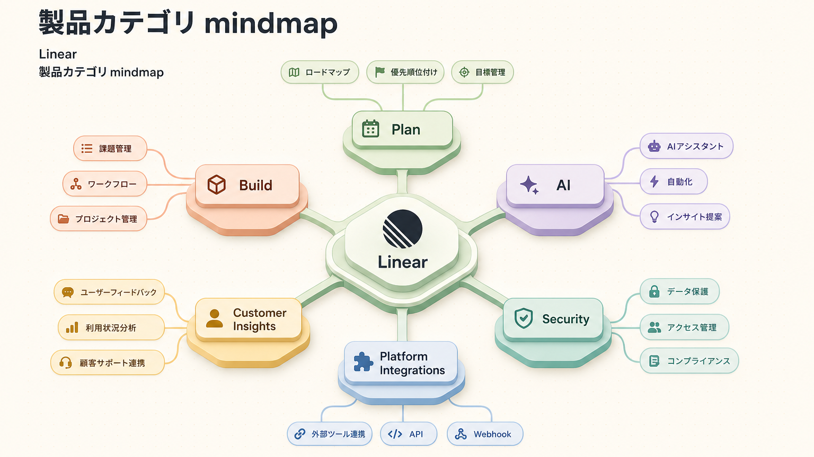

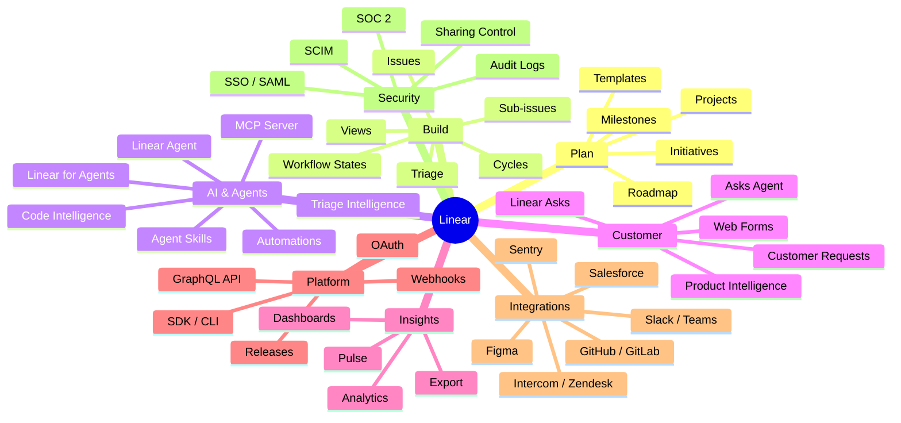
```mermaid
mindmap
  root((Linear))
    Plan
      Initiatives
      Projects
      Milestones
      Roadmap
      Templates
    Build
      Issues
      Cycles
      Sub-issues
      Workflow States
      Views
      Triage
    AI & Agents
      Linear Agent
      Linear for Agents
      MCP Server
      Triage Intelligence
      Code Intelligence
      Automations
      Agent Skills
    Customer
      Customer Requests
      Product Intelligence
      Linear Asks
      Asks Agent
      Web Forms
    Insights
      Analytics
      Dashboards
      Pulse
      Export
    Platform
      GraphQL API
      Webhooks
      OAuth
      SDK / CLI
      Releases
    Integrations
      GitHub / GitLab
      Slack / Teams
      Intercom / Zendesk
      Salesforce
      Figma
      Sentry
    Security
      SSO / SAML
      SCIM
      Audit Logs
      SOC 2
      Sharing Control
```

---

## 3. プラン体系の前提知識

### 3.1 プラン概要表（2026-05 時点）
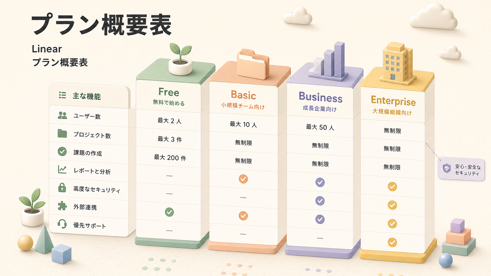

| プラン | 月額（年払） | チーム数 | Issue 数 | Linear Agent | Triage Intelligence | Code Intelligence | Insights | Dashboards | SAML/SCIM | Uptime SLA |
|---|---|---|---|---|---|---|---|---|---|---|
| **Free** | $0 | 2 | 250 | 利用可（基本） | 不可 | 不可 | 不可 | 不可 | 不可 | 不可 |
| **Basic** | $10/user | 5 | 無制限 | 利用可 | 不可 | 不可 | 不可 | 不可 | 不可 | 不可 |
| **Business** | $16/user | 無制限 | 無制限 | 利用可（強化） | 利用可 | 利用可（beta） | 利用可 | 不可 | 不可 | 不可 |
| **Enterprise** | 要見積 | 無制限 | 無制限 | 利用可（強化） | 利用可 | 利用可 | 利用可 | 利用可 | 利用可（SAML + SCIM） | 利用可 |

補足:
- 月払はおおむね Basic $12 / Business $20 程度（20% プレミアム）。
- メンバー数はどのプランも無制限。Guest（外部協業者）も別枠で許可される。
- Linear Agent 自体は全プランで利用可能だが、**Automations / Agent Skills は Business 以上**、**Code Intelligence は Business 以上（Enterprise で完全機能）**。
- Enterprise のみ、専任アカウントマネージャー、優先サポート、SLA、SCIM、SAML、データ保持ポリシーカスタマイズが付く。

### 3.2 課金モデルの考え方
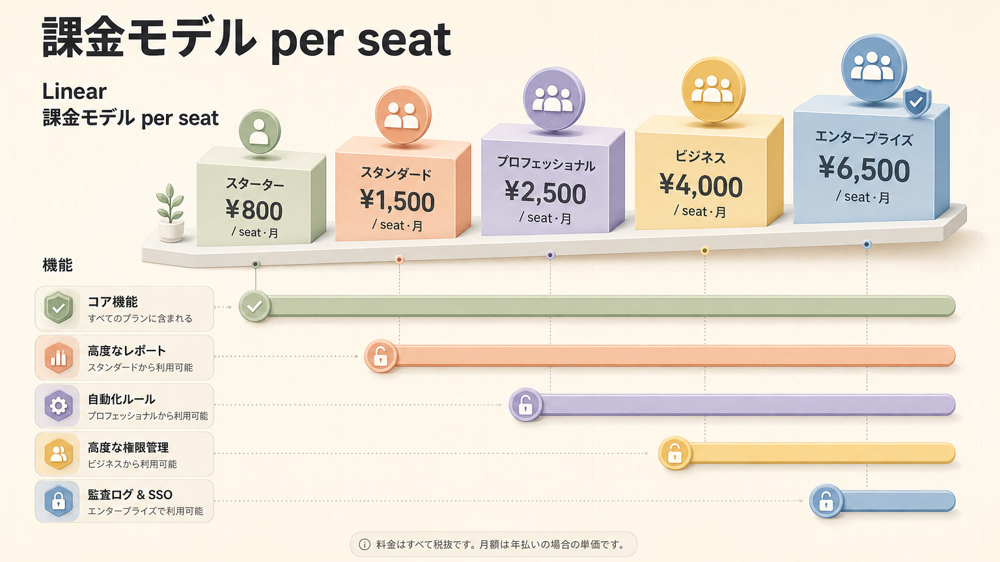

```mermaid
gantt
    title Linear 課金軸の構造（per-seat × 機能ゲート）
    dateFormat X
    axisFormat %s

    section ベース課金
    Free（$0）            :a1, 0, 1
    Basic（$10/user）     :a2, 0, 2
    Business（$16/user）  :a3, 0, 3
    Enterprise（要見積）   :a4, 0, 4

    section AI 機能ゲート
    Linear Agent（全プラン）        :b1, 0, 4
    Automations（Business+）       :b2, 2, 4
    Code Intelligence（Business+） :b3, 2, 4
    Triage Intelligence（Business+）:b4, 2, 4

    section ガバナンス機能ゲート
    SSO Google（全プラン）  :c1, 0, 4
    SAML（Enterprise）      :c2, 3, 4
    SCIM（Enterprise）      :c3, 3, 4
    監査ログ（Enterprise）   :c4, 3, 4
```

- **基本は per-seat、AI は seat 価格に含む**（外部 LLM API のような従量課金は無し）。
- ただし「Agent のヘビーユース」を想定したエンタープライズ向け追加課金は将来導入の余地あり。
- Customer Requests / Linear Asks は基本プランから利用可能。AI による自動分類（Product Intelligence）は Business 以上。

### 3.3 本ドキュメント内のプラン表記凡例
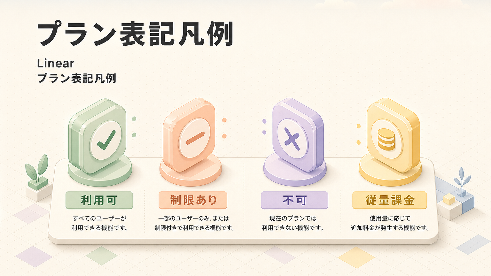

各機能の「💳 利用可能プラン」表で使う表記:

| 表記 | 意味 |
|---|---|
| **利用可** | 制限なくフル機能で利用可能 |
| **制限あり** | 利用可だが上限や機能制約がある（カッコ内に補足） |
| **不可** | このプランでは利用できない |
| **従量課金** | 含み枠を超えると追加料金（カッコ内に単位） |

---

## 4. 機能カタログ

### 4.1 Core Concepts

#### 4.1.1 Workspaces & Teams

**🎯 概要**

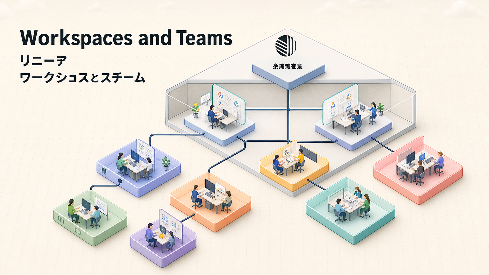

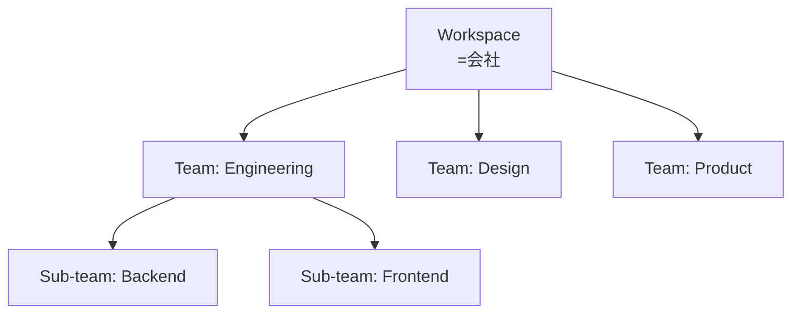
```mermaid
flowchart TB
    WS[Workspace<br/>=会社]
    T1[Team: Engineering]
    T2[Team: Design]
    T3[Team: Product]
    ST1[Sub-team: Backend]
    ST2[Sub-team: Frontend]
    WS --> T1
    WS --> T2
    WS --> T3
    T1 --> ST1
    T1 --> ST2
```

Workspace は会社全体の入れ物。その下に Team が並び、Team はさらに 5 階層までの sub-team を持てる（2026-04 から）。

**👨‍💻 エンジニアへの関係**

Issue は必ず Team 配下に作られる（ID は `ENG-123` のように Team プレフィックス付き）。Team ごとに workflow / cycle / label / view を独立して定義できるため、組織のリアルな分業構造をそのままツールに写像できる。

**💳 利用可能プラン**

| Free | Basic | Business | Enterprise |
|:-:|:-:|:-:|:-:|
| 制限あり (2 teams) | 制限あり (5 teams) | 利用可 | 利用可 |

**🏢 ClassLab. での活用**

- 短期: 「システム事業部」「ライフライン事業」「コーポレート IT」を Team として切り、各事業のサブ機能を sub-team で表現。
- 中長期: 全社的に Linear を採用する場合、各事業を Team、プロジェクトチームを sub-team として階層化することで「事業全体の進捗が 1 つの Workspace で見える」状態を作る。

**🔥 差別化点**

- Jira は Project が中心で Team の概念が薄い → 組織再編に弱い。
- Asana は Team とプロジェクトが並列で重複しやすい。
- Linear は Team が一級概念で、sub-team の階層化を 2026 年に強化したことで、エンプラ階層にも対応。

**🔍 深掘り**

- Issue ID プレフィックスは Team 作成時に決定し、後から変更可能（ただし URL/外部リンクへの影響あり）。
- Team 単位で「issue auto-archive 期間」「cycle 長さ」「workflow ステータス」を独自定義できる。

**⚠️ 注意点**

- Free / Basic ではチーム数上限に注意。中堅以上は実質 Business からスタートになる。
- Sub-team を深く切りすぎると view のスコープ管理が複雑化する。3 階層程度に抑えるのが推奨。

---

#### 4.1.2 Issues

**🎯 概要**

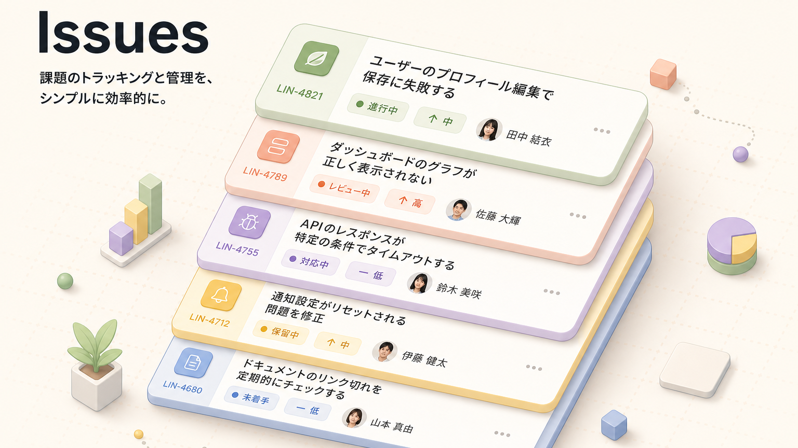

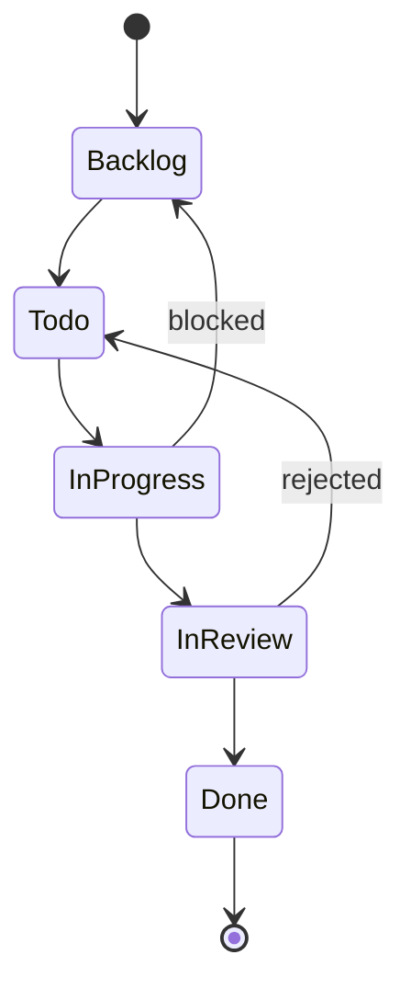
```mermaid
stateDiagram-v2
    [*] --> Backlog
    Backlog --> Todo
    Todo --> InProgress
    InProgress --> InReview
    InReview --> Done
    Done --> [*]
    InProgress --> Backlog: blocked
    InReview --> Todo: rejected
```

Linear の最小単位。タイトル・ステータスが必須、Markdown 説明・優先度・assignee・labels・estimate・親子関係・関連 Issue・カスタムフィールドが任意。

**👨‍💻 エンジニアへの関係**

- キーボードショートカット中心の UI（`C` で作成、`/` でコマンドパレット、`Cmd+K` でナビゲーション）。
- GitHub PR の本文に Issue ID を書くと自動リンク、PR マージで Issue クローズも自動。
- Issue ごとに Git ブランチ名が自動生成され、コピー可能。

**💳 利用可能プラン**

| Free | Basic | Business | Enterprise |
|:-:|:-:|:-:|:-:|
| 制限あり (250 件) | 利用可 | 利用可 | 利用可 |

**🏢 ClassLab. での活用**

- 短期: 既存の Asana タスクや GitHub Issues を Linear Issue に移行。Issue → ブランチ自動作成のフローを定着。
- 中長期: Issue を起点に Linear Agent / Codex / Claude Code を呼び出す「Agent on Issue」運用へ移行。

**🔥 差別化点**

- Jira の Issue は重く、ロード時間と UI 階層が深い。
- Linear Issue は **「リスト → 詳細 → 完了」が 3 キーで完結する密度**が他社の追随を許さない。

**🔍 深掘り**

- Issue 間の関係性: parent / sub-issue / blocks / blocked-by / duplicate / relates-to の 5 種類を構造化。
- 2026-05 から **Issue duplicates** に専用ステータスがつき、重複時のコンテキスト自動移行に対応。
- Custom Fields（Business 以上）で組織固有のメタデータを追加可能。

**⚠️ 注意点**

- Free は 250 issues 上限。アクティブなチームは数週間で到達する。
- Custom Fields は Business 以上。Free / Basic では labels の使い分けで代替する設計が必要。

---

#### 4.1.3 Cycles

**🎯 概要**

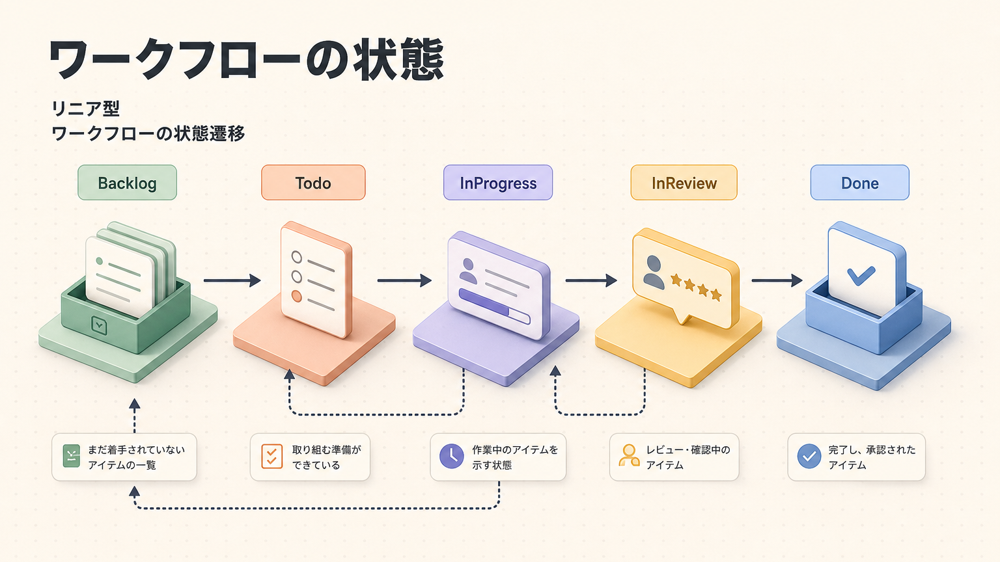

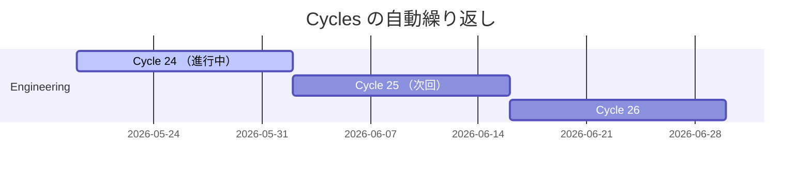
```mermaid
gantt
    title Cycles の自動繰り返し
    dateFormat YYYY-MM-DD
    section Engineering
    Cycle 24 （進行中） :active, c1, 2026-05-19, 2w
    Cycle 25 （次回）   :c2, after c1, 2w
    Cycle 26          :c3, after c2, 2w
```

Sprint に相当する繰り返し期間。長さ・開始曜日を Team ごとに設定し、未完了 Issue の自動ロールオーバーも構成可能。

**👨‍💻 エンジニアへの関係**

Cycle の進捗グラフ（バーンダウン）が自動生成され、velocity / scope creep / remaining estimate が一目でわかる。Scrum 運用が「設定→自動」になる体験。

**💳 利用可能プラン**

| Free | Basic | Business | Enterprise |
|:-:|:-:|:-:|:-:|
| 利用可 | 利用可 | 利用可 | 利用可 |

**🏢 ClassLab. での活用**

- 短期: ライフライン事業の開発チームで 1 週間サイクルを試験運用、velocity を計測。
- 中長期: 全システム事業部で 2 週間サイクルに統一し、Insights で組織横断の velocity 比較。

**🔥 差別化点**

- Jira では Sprint 機能が別売（Premium）感が強く、設定も冗長。
- Linear は Cycle が **「設定 1 度で永続的に自動運用される」**ため、運用負荷がほぼゼロ。

**🔍 深掘り**

- Cycle の自動繰り越し時、未完了 Issue を「次サイクルに移動」「アーカイブ」「triage に戻す」から選択。
- Cycle Graph: scope / progress / outstanding を時系列で表示。

**⚠️ 注意点**

- Cycle と Project は直交概念（Cycle = 時間、Project = 成果物）。混同すると Issue の重複管理に陥る。

---

#### 4.1.4 Projects

**🎯 概要**

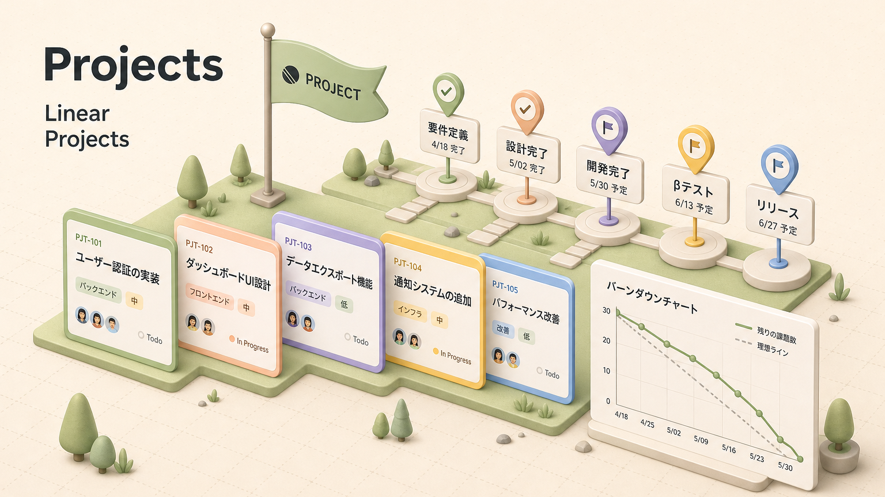

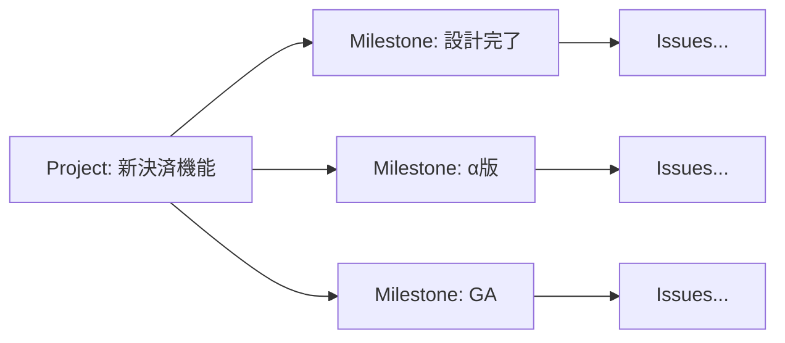
```mermaid
flowchart LR
    P[Project: 新決済機能]
    M1[Milestone: 設計完了]
    M2[Milestone: α版]
    M3[Milestone: GA]
    I1[Issues...]
    I2[Issues...]
    I3[Issues...]
    P --> M1 --> I1
    P --> M2 --> I2
    P --> M3 --> I3
```

特定の成果物に向けた「期限付きの取り組み」。Issue を束ね、進捗グラフ・予定完了日・参加メンバーを管理。複数 Team を横断可能。

**👨‍💻 エンジニアへの関係**

機能開発・リプレース・調査タスクなど「複数 Issue で構成される塊」を Project にし、Roadmap で他 Project と俯瞰。Cycle が時間軸の枠なら、Project は意味の枠。

**💳 利用可能プラン**

| Free | Basic | Business | Enterprise |
|:-:|:-:|:-:|:-:|
| 利用可 | 利用可 | 利用可 | 利用可 |

**🏢 ClassLab. での活用**

- 短期: 「電気契約代行 UI リニューアル」「Salesforce → 新環境データ移行」などを Project 化。
- 中長期: 1 つの事業課題（例: AI 自動審査の導入）を Project に、その下に複数 Cycle で実装。

**🔥 差別化点**

- Asana の Project はタスクのコンテナでしかなく、進捗の自動グラフ化が弱い。
- Linear Project は **自動的にバーンダウン・予定完了日・リスクが算出される**。

**🔍 深掘り**

- 2026-05-21 から **Project Slack channels** が自動生成可能になり、新規 Project 作成時に Slack チャネル + 参加者追加 + 更新通知が一括設定される。
- 2026-04-09 から Project / Initiative にコメント機能が追加。

**⚠️ 注意点**

- Project と Cycle の使い分けを最初に決めないと、組織で運用観念がブレる。「Cycle は時間枠、Project は成果物」を徹底。

---

#### 4.1.5 Initiatives

**🎯 概要**

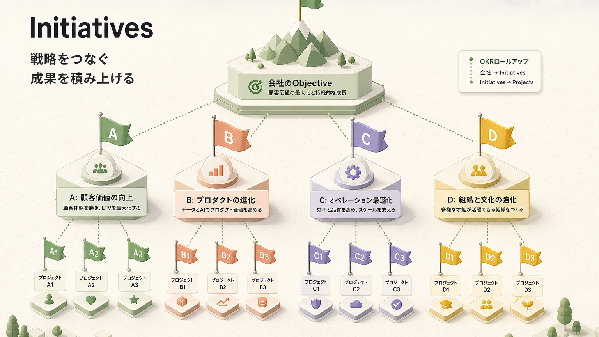

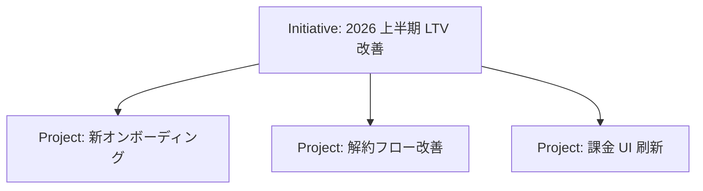
```mermaid
flowchart TB
    INIT[Initiative: 2026 上半期 LTV 改善]
    P1[Project: 新オンボーディング]
    P2[Project: 解約フロー改善]
    P3[Project: 課金 UI 刷新]
    INIT --> P1
    INIT --> P2
    INIT --> P3
```

OKR や事業戦略レベルの最上位概念。複数の Project を束ねて Workspace 全体のロードマップに乗せる。

**👨‍💻 エンジニアへの関係**

EM / CTO レベルから見たとき、「事業戦略 → 実行プロジェクト → Issue」が 1 つのツリーで追える。経営との対話で同じツールが使える。

**💳 利用可能プラン**

| Free | Basic | Business | Enterprise |
|:-:|:-:|:-:|:-:|
| 制限あり (1 件) | 制限あり (3 件) | 利用可 | 利用可 |

**🏢 ClassLab. での活用**

- 短期: 「2026 上半期: ライフライン事業の AI 化」を Initiative に。
- 中長期: 各事業部の四半期 OKR を Initiative にし、システム事業部の Project 群をぶら下げる。

**🔥 差別化点**

- Asana の Goals 機能と近いが、Initiative は Project とシームレスに連携し **Roadmap に自動反映**される点が強い。
- 2026-03 から **Multiple parents for sub-initiatives** をサポートし、複数 Initiative にまたがる Project の表現が可能に。

**🔍 深掘り**

- Initiative ごとに「all related projects」「all related issues」のビューが自動生成。
- ステータス: Planned / Active / Paused / Completed / Canceled。

**⚠️ 注意点**

- Free / Basic では実質使えない（件数制限）。経営レベルで使うなら Business 以上が前提。

---

#### 4.1.6 Milestones

**🎯 概要**

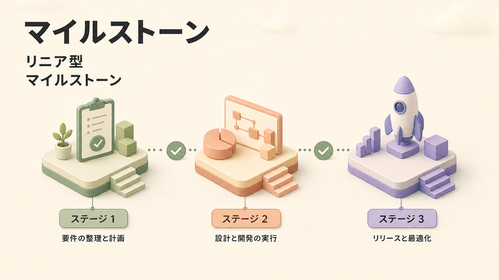

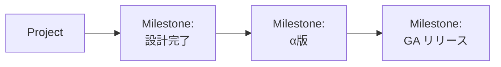
```mermaid
flowchart LR
    P[Project]
    M1[Milestone:<br/>設計完了]
    M2[Milestone:<br/>α版]
    M3[Milestone:<br/>GA リリース]
    P --> M1 --> M2 --> M3
```

Project 内部の段階区切り。各 Issue を Milestone に紐づけることで、Project の進捗を「段階単位」で可視化。

**👨‍💻 エンジニアへの関係**

「設計フェーズ完了」「ステージング検証完了」「本番リリース」などのゲートを Milestone で表現し、Issue を Milestone にバインドして進捗を立体化。

**💳 利用可能プラン**

| Free | Basic | Business | Enterprise |
|:-:|:-:|:-:|:-:|
| 利用可 | 利用可 | 利用可 | 利用可 |

**🏢 ClassLab. での活用**

- 中長期: 大型 Project（例: Salesforce 移行）で「移行準備完了」「テスト環境移行」「本番移行」を Milestone に。

**🔥 差別化点**

- Jira では Version / Release で代替するが UX が分離している。
- Linear は **Project 内に Milestone がネイティブに存在**し、Project ビューに自動表示。

**🔍 深掘り**

- Milestone ごとに予定日と実績日を設定でき、Project レベルでスケジュール遅延が自動計算される。

**⚠️ 注意点**

- Milestone と Sub-issue を混同する組織が多い。「Milestone = 大きな節目、Sub-issue = 親 Issue の構成要素」と明確化。

---

#### 4.1.7 Views & Filters

**🎯 概要**

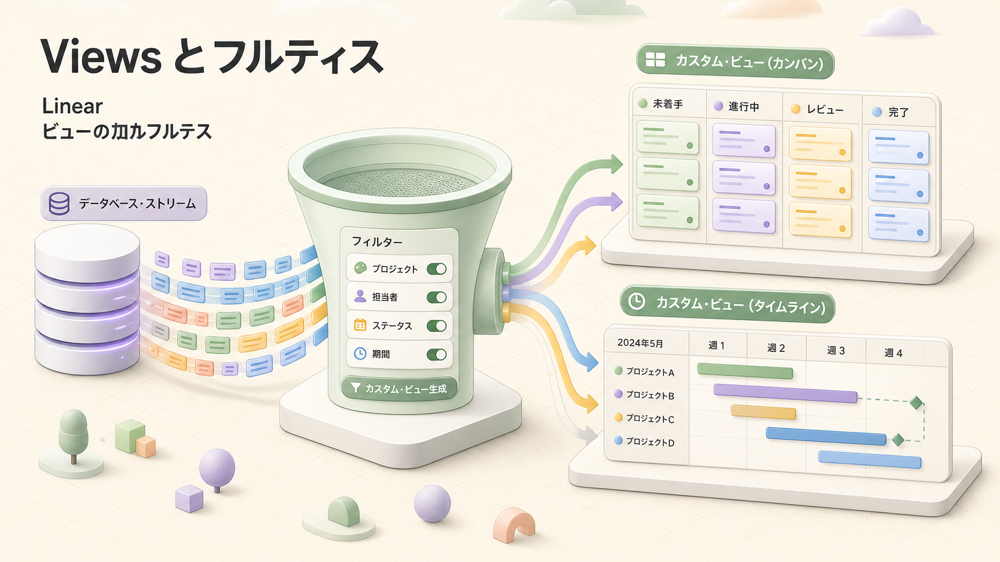

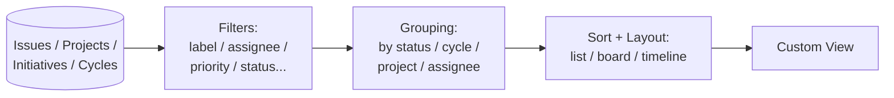
```mermaid
flowchart LR
    DATA[(Issues / Projects /<br/>Initiatives / Cycles)]
    FILTER[Filters:<br/>label / assignee /<br/>priority / status...]
    GROUP[Grouping:<br/>by status / cycle /<br/>project / assignee]
    SORT[Sort + Layout:<br/>list / board / timeline]
    VIEW[Custom View]
    DATA --> FILTER --> GROUP --> SORT --> VIEW
```

任意のフィルタ・グルーピング・並び順を保存して再利用可能なビュー。個人用・チーム用・workspace 共有の 3 スコープ。

**👨‍💻 エンジニアへの関係**

「自分の今 cycle の Issue」「P0/P1 のみ」「triage 中の bug」「Sentry から来た Issue」など、日々の作業に最適化したダッシュボードを自作できる。

**💳 利用可能プラン**

| Free | Basic | Business | Enterprise |
|:-:|:-:|:-:|:-:|
| 利用可 | 利用可 | 利用可 | 利用可 |

**🏢 ClassLab. での活用**

- 短期: 各エンジニアが「自分の cycle ビュー」を作成、PM は「全体 triage ビュー」を共有。
- 中長期: 事業横断の「P0 障害一覧」「リリース予定一覧」を workspace ビューとして公開。

**🔥 差別化点**

- 2026-05 から **Reorder groups in views** に対応し、Kanban のステータス順を自由に並び替え可能。
- Asana / Jira のフィルタは保存しても共有がぎこちないが、Linear は **共有 URL がそのままビュー**になる。

**🔍 深掘り**

- Layout: List / Board (Kanban) / Timeline (Gantt 風) / Roadmap。
- Filter は AND / OR の混在条件、null チェック、相対日付フィルタ（"due this week"）に対応。

**⚠️ 注意点**

- ビューが乱立すると workspace が散らかる。team-shared ビューは厳選し、個人ビューに寄せるのが推奨。

---

#### 4.1.8 Workflow States

**🎯 概要**

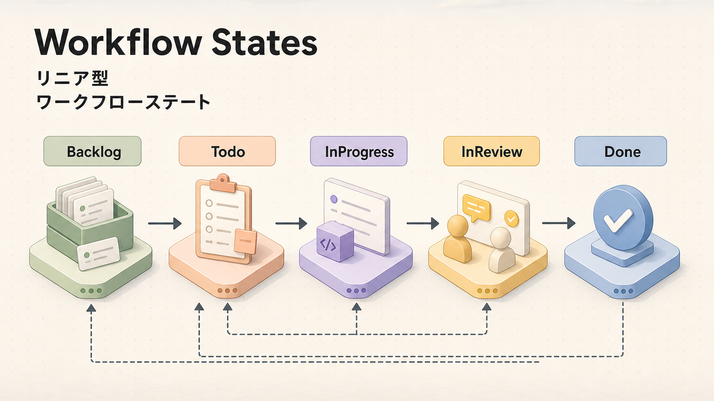

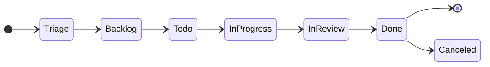
```mermaid
stateDiagram-v2
    direction LR
    [*] --> Triage
    Triage --> Backlog
    Backlog --> Todo
    Todo --> InProgress
    InProgress --> InReview
    InReview --> Done
    Done --> [*]
    Done --> Canceled
```

Team ごとに定義できる Issue のステータス遷移。標準カテゴリ: Backlog / Unstarted / Started / Completed / Canceled / Triage。

**👨‍💻 エンジニアへの関係**

GitHub PR の状態（Draft → Open → Merged）と Linear Workflow State の自動同期が肝。`In Review` → `Done` の遷移を PR マージで自動化できる。

**💳 利用可能プラン**

| Free | Basic | Business | Enterprise |
|:-:|:-:|:-:|:-:|
| 利用可 | 利用可 | 利用可 | 利用可 |

**🏢 ClassLab. での活用**

- 短期: 標準テンプレートで開始し、3 ヶ月の運用後にチームごとに最適化。
- 中長期: バグ専用 workflow（"Reported" → "Investigating" → "Hotfix" など）をライフライン事業に導入。

**🔥 差別化点**

- Jira の Workflow Editor は強力だが学習コストが高い。
- Linear はカテゴリベースの **「型がある自由」** で、設定の暴走を抑制。

**🔍 深掘り**

- Workflow State にはアイコン・色を割り当て可能。
- Auto-transition: assignee 設定で `Todo → In Progress`、PR マージで `In Review → Done` などのオートメーション。

**⚠️ 注意点**

- カテゴリは変更不可（5 種）。状態名のみカスタム可能。組織内で命名を統一しないと混乱の元。

---

### 4.2 Planning & Roadmap

#### 4.2.1 Roadmap

**🎯 概要**

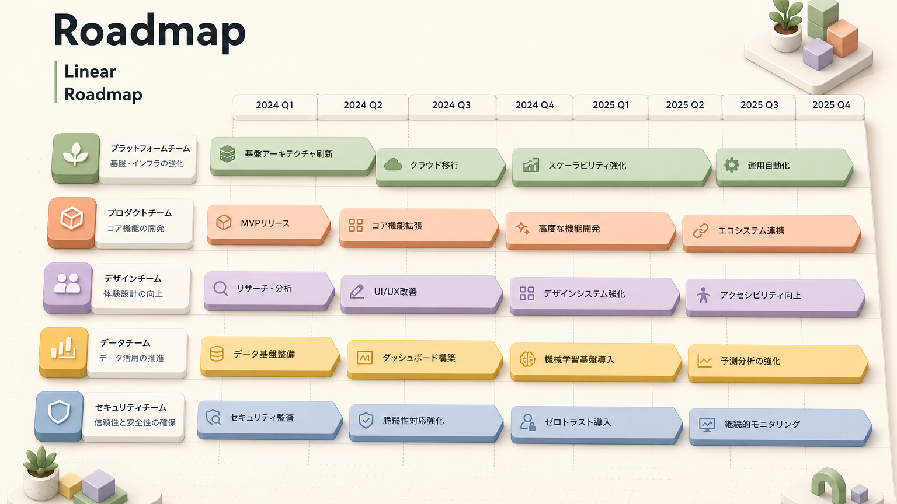

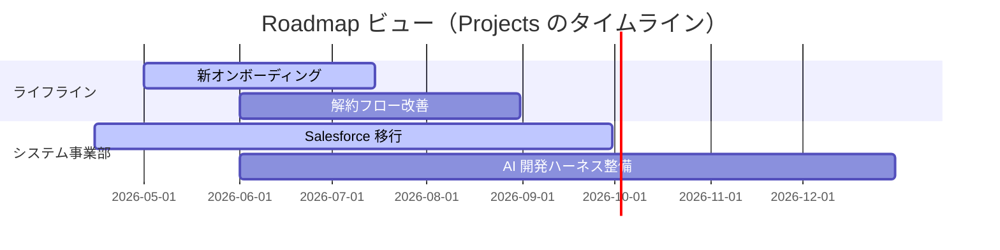
```mermaid
gantt
    title Roadmap ビュー（Projects のタイムライン）
    dateFormat YYYY-MM-DD
    section ライフライン
    新オンボーディング     :active, 2026-05-01, 2026-07-15
    解約フロー改善         :2026-06-01, 2026-08-31
    section システム事業部
    Salesforce 移行       :active, 2026-04-15, 2026-09-30
    AI 開発ハーネス整備   :2026-06-01, 2026-12-31
```

Project / Initiative をタイムライン上に並べたビュー。期日・進捗・依存関係を俯瞰。

**👨‍💻 エンジニアへの関係**

四半期の負荷感、リソース競合、他チームとの連携タイミングが視覚的に把握できる。Roadmap ビューはステークホルダー共有用に最適。

**💳 利用可能プラン**

| Free | Basic | Business | Enterprise |
|:-:|:-:|:-:|:-:|
| 利用可 | 利用可 | 利用可 | 利用可 |

**🏢 ClassLab. での活用**

- 短期: システム事業部の半期 Roadmap を Linear で作り、全社に共有。
- 中長期: 事業部間の依存関係（例: Salesforce 移行 完了後にライフライン UI 刷新）を Roadmap で可視化。

**🔥 差別化点**

- Asana の Timeline ビューより読み込みが速く、Project 進捗が即座に反映。

**🔍 深掘り**

- Roadmap は Workspace 全体 / Team 単位 / Initiative 単位で生成可能。
- Project の予定完了日は Issue の estimate と完了率から自動再計算される。

**⚠️ 注意点**

- Roadmap を「経営報告書」として固定運用すると、Linear の動的更新性を活かしきれない。共有時は「リアルタイム反映前提」のリテラシーが必要。

---

#### 4.2.2 Triage

**🎯 概要**

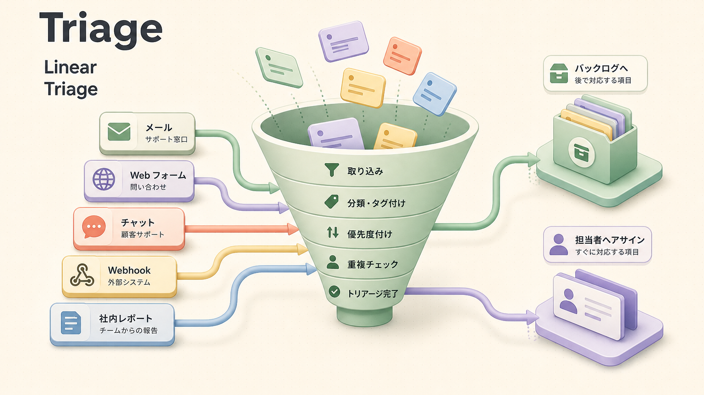

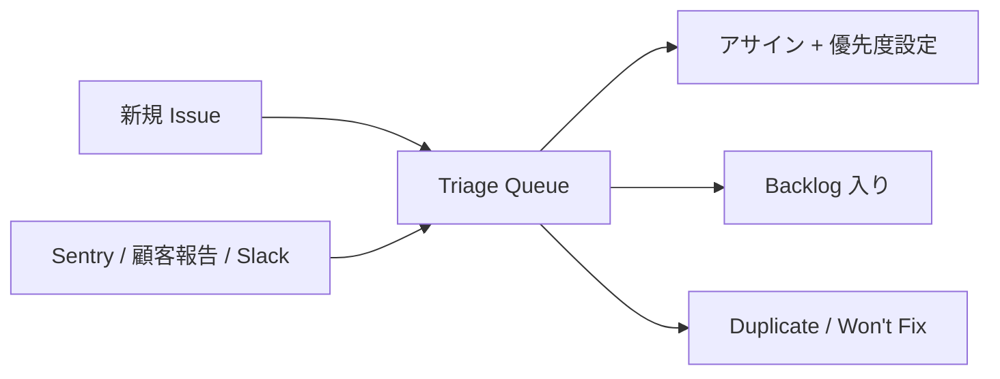
```mermaid
flowchart LR
    IN1[新規 Issue]
    IN2[Sentry / 顧客報告 / Slack]
    TRIAGE[Triage Queue]
    OUT1[アサイン + 優先度設定]
    OUT2[Backlog 入り]
    OUT3[Duplicate / Won't Fix]
    IN1 --> TRIAGE
    IN2 --> TRIAGE
    TRIAGE --> OUT1
    TRIAGE --> OUT2
    TRIAGE --> OUT3
```

未割り当て・未分類の Issue が集まる入口キュー。Team ごとに triage 担当を回す運用が標準。

**👨‍💻 エンジニアへの関係**

外部統合（Sentry / Intercom / Slack / Customer Requests）から自動で issue が triage に入り、毎朝の triage で分類するワークフローが定着する。

**💳 利用可能プラン**

| Free | Basic | Business | Enterprise |
|:-:|:-:|:-:|:-:|
| 利用可 | 利用可 | 利用可 | 利用可 |

**🏢 ClassLab. での活用**

- 短期: ライフライン事業のサポート起因タスクを Slack 経由で Linear Triage に集約。
- 中長期: AI Triage Intelligence で自動振り分けを導入し、PM の triage 時間を削減。

**🔥 差別化点**

- Jira では「未割り当て Issue」はビューで切るしかないが、Linear は **Triage が一級概念**。

**🔍 深掘り**

- Triage 通知設定: 担当を「全員」「ローテーション」「特定ユーザー」から選択。
- Triage 専用の workflow state（カテゴリ）が用意されており、通常の Backlog と分離。

**⚠️ 注意点**

- Triage を放置すると数百件溜まる。週次の「triage zero」運用ルールが必要。

---

#### 4.2.3 Templates

**🎯 概要**

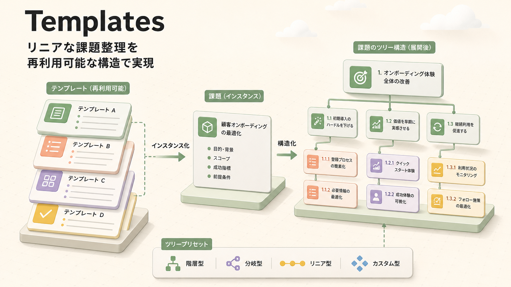

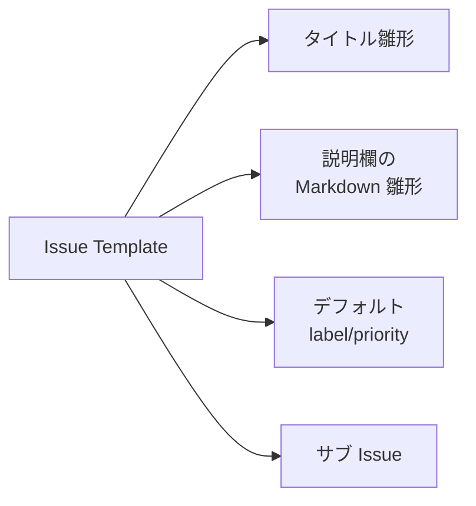
```mermaid
flowchart LR
    TPL[Issue Template]
    TPL --> F1[タイトル雛形]
    TPL --> F2[説明欄の<br/>Markdown 雛形]
    TPL --> F3[デフォルト<br/>label/priority]
    TPL --> F4[サブ Issue]
```

Issue / Project / Document に対するテンプレート機能。よく使うフォーマット（バグ報告、機能要望、リリース手順）を再利用。

**👨‍💻 エンジニアへの関係**

「PR テンプレート」「バグ報告テンプレート」「ポストモーテムテンプレート」を Linear で集中管理。Issue 作成時にワンクリック適用。

**💳 利用可能プラン**

| Free | Basic | Business | Enterprise |
|:-:|:-:|:-:|:-:|
| 制限あり (Team 共有のみ) | 利用可 | 利用可 | 利用可 |

**🏢 ClassLab. での活用**

- 短期: ライフライン事業のバグ報告 / 顧客要望テンプレートを整備。
- 中長期: ポストモーテム・SLA インシデント・リリース手順を Workspace 共通テンプレート化。

**🔥 差別化点**

- Asana のテンプレートはタスクレベルのみだが、Linear は **Issue / Project / Document / Sub-issue ツリー全体** をテンプレ化。

**🔍 深掘り**

- 親 Issue + サブ Issue のツリー全体を 1 テンプレに保存可能。リリース作業のような決まったワークフローを 1 操作で生成。

**⚠️ 注意点**

- テンプレートが乱立すると逆効果。命名規則と棚卸し運用が必要。

---

#### 4.2.4 Sub-issues / Multi-level sub-teams

**🎯 概要**

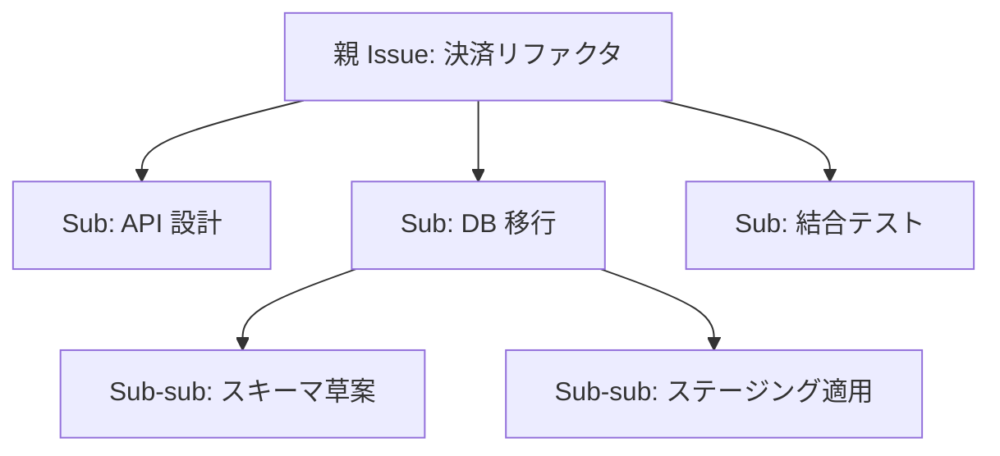
```mermaid
flowchart TB
    P[親 Issue: 決済リファクタ]
    S1[Sub: API 設計]
    S2[Sub: DB 移行]
    S3[Sub: 結合テスト]
    SS1[Sub-sub: スキーマ草案]
    SS2[Sub-sub: ステージング適用]
    P --> S1
    P --> S2
    P --> S3
    S2 --> SS1
    S2 --> SS2
```

Issue は親子関係を持ち、入れ子の深さに制限がない。Sub-team は 2026-04 から 5 階層まで対応。

**👨‍💻 エンジニアへの関係**

大きなタスクを分解しても、親 Issue の進捗が子 Issue から自動集計される。Estimate ロールアップで親の合計工数も自動。

**💳 利用可能プラン**

| Free | Basic | Business | Enterprise |
|:-:|:-:|:-:|:-:|
| 利用可 | 利用可 | 利用可 | 利用可 |

**🏢 ClassLab. での活用**

- 短期: 「Salesforce 移行」を親、移行対象オブジェクトごとに子 Issue で分解。
- 中長期: Multi-level sub-team でシステム事業部 → 開発チーム → スクラムチームの 3 階層を表現。

**🔥 差別化点**

- Jira のエピック / ストーリーは粒度が固定だが、Linear の sub-issue は **自由な深さ**でかつ **ロールアップが自動**。

**🔍 深掘り**

- 親 Issue の `Estimate sum` は子 Issue の estimate 合計（または親自身の estimate のどちらか）から計算可能。

**⚠️ 注意点**

- ネストを深くしすぎると、view 表示で折りたたみと展開が頻繁になり可読性が落ちる。3〜4 階層が実用上限。

---

### 4.3 AI & Agents（2026 年最大の進化領域）

#### 4.3.1 Linear Agent

**🎯 概要**

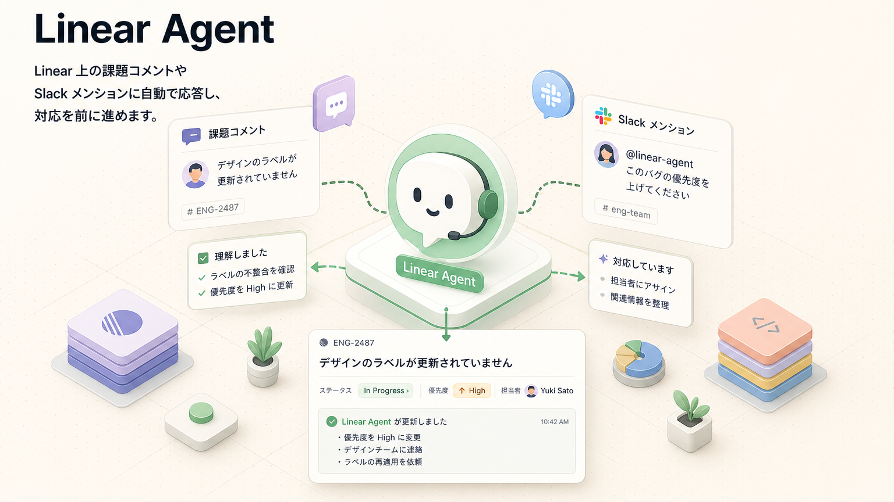

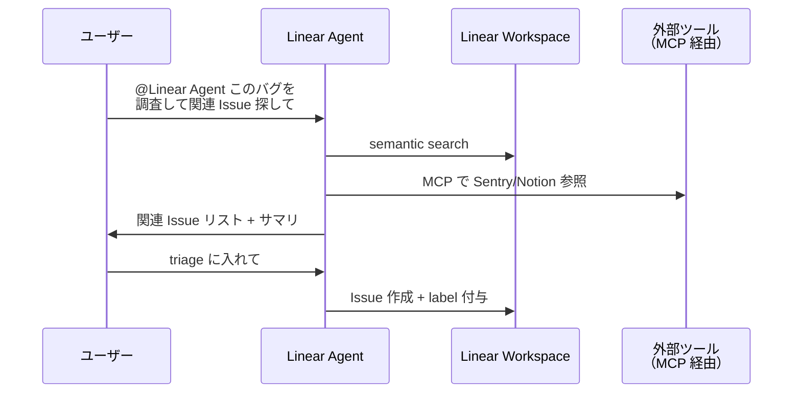
```mermaid
sequenceDiagram
    participant U as ユーザー
    participant LA as Linear Agent
    participant LIN as Linear Workspace
    participant EXT as 外部ツール<br/>（MCP 経由）

    U->>LA: @Linear Agent このバグを<br/>調査して関連 Issue 探して
    LA->>LIN: semantic search
    LA->>EXT: MCP で Sentry/Notion 参照
    LA->>U: 関連 Issue リスト + サマリ
    U->>LA: triage に入れて
    LA->>LIN: Issue 作成 + label 付与
```

Linear が公式に提供する組み込み AI Agent。Issue コメント・Slack・Microsoft Teams・チャットから対話的に呼び出し、Issue 操作・検索・要約・トリアージを実行。**2026-03-24 に全プランで GA**。

**👨‍💻 エンジニアへの関係**

「Slack で `@Linear` メンション → Issue 化」「Issue コメントで Agent に要約させる」「複数 Issue を semantic 検索で発見させる」など、日常の Linear 操作の半分が会話化できる。

**💳 利用可能プラン**

| Free | Basic | Business | Enterprise |
|:-:|:-:|:-:|:-:|
| 制限あり (基本機能) | 利用可 | 利用可 (Automations+) | 利用可 (Automations+) |

**🏢 ClassLab. での活用**

- 短期: Slack の `#dev` チャネルで `@Linear` メンションを定着、口頭の依頼を Issue 化。
- 中長期: Agent Skills で「リリース手順 Issue を自動生成」「障害対応テンプレを自動展開」などの繰り返し業務をスキル化。

**🔥 差別化点**

- Atlassian Intelligence や Asana Intelligence と比べ、**Linear Agent は MCP で外部ツール拡張が前提**になっており、エコシステム参加者が多い。

**🔍 深掘り**

- Agent 呼び出し方:
  - Issue コメント `@Linear` メンション
  - Slack `@Linear`
  - Microsoft Teams `@Linear`
  - Web UI 内チャットパネル
- 2026-03 同時に **Agent Skills & Automations** が発表され、対話を再利用可能なスキルとして保存可能。

**⚠️ 注意点**

- Agent の応答は LLM ベースのため、ハルシネーション対策として **Issue 作成は人間の最終確認** を運用ルールにすべき。

---

#### 4.3.2 Linear for Agents（外部 AI エコシステム）

**🎯 概要**

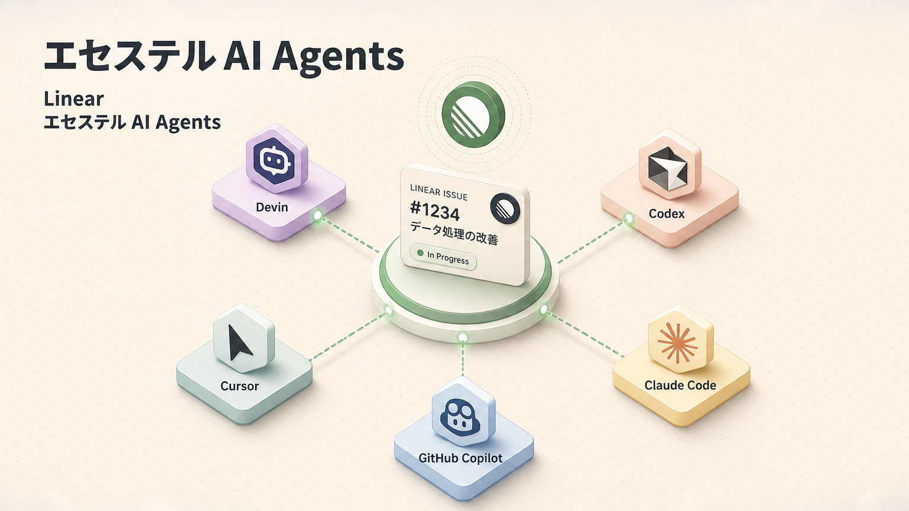

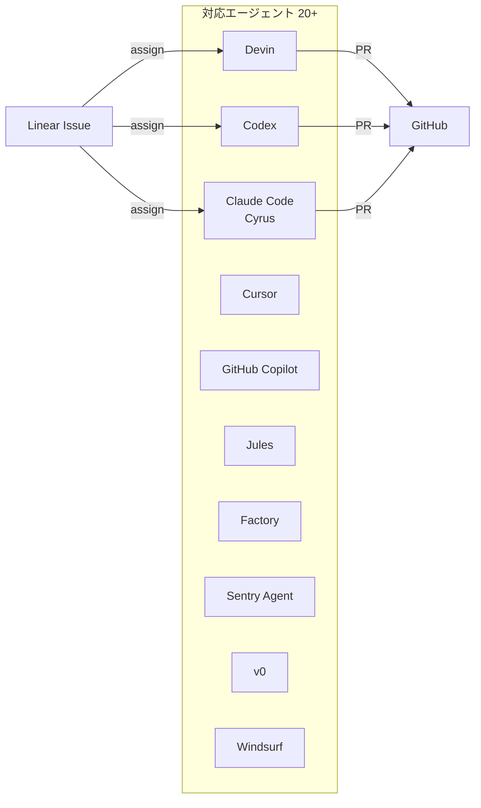
```mermaid
flowchart LR
    ISS[Linear Issue]
    subgraph Agents["対応エージェント 20+"]
        DEVIN[Devin]
        CODEX[Codex]
        CC[Claude Code<br/>Cyrus]
        CURSOR[Cursor]
        GHC[GitHub Copilot]
        JULES[Jules]
        FACTORY[Factory]
        SENTRY[Sentry Agent]
        V0[v0]
        WIND[Windsurf]
    end
    ISS -->|assign| DEVIN
    ISS -->|assign| CODEX
    ISS -->|assign| CC
    DEVIN -->|PR| GH[GitHub]
    CODEX -->|PR| GH
    CC -->|PR| GH
```

Linear Issue を外部 AI コーディングエージェントにアサインして、計画→実装→PR まで自動化する公式エコシステム。

**👨‍💻 エンジニアへの関係**

「Issue にエージェントをアサインしておくと、寝ている間に PR が立っている」型の開発ワークフローが現実的に。並列 PR レビューの時代が来た。

**💳 利用可能プラン**

| Free | Basic | Business | Enterprise |
|:-:|:-:|:-:|:-:|
| 利用可 (各 Agent 側の料金別) | 利用可 | 利用可 | 利用可 |

**🏢 ClassLab. での活用**

- 短期: Claude Code (Cyrus) を試験導入し、ライフライン事業の定形タスク（UI 微修正、テスト追加）を Linear Issue 経由でエージェント実行。
- 中長期: Devin / Codex / Cyrus を Issue 種別ごとに使い分け、並列 PR を 1 名のレビュアーで捌く体制へ。

**🔥 差別化点**

- Jira も Agent 連携を進めているが、**Linear は Agent 側からの公式統合数（20+）が圧倒的**。
- Cyrus（Claude Code 駆動の Linear エージェント、コミュニティ製）が「どこでも動く」設計で OSS 系開発者にも受けが良い。

**🔍 深掘り**

- 主要対応エージェント:
  - **Devin**（Cognition）: 自律的にコード書く SWE エージェント
  - **Codex**（OpenAI）: MCP 完全対応、構造化ツール呼び出し
  - **Claude Code (Cyrus)**: 「どこでも動く」Claude Code 駆動 Linear エージェント
  - **Cursor / Windsurf / Zed**: IDE 統合
  - **GitHub Copilot**: GitHub ワークフロー統合
  - **Jules**（Google）: ペアプロ向け
  - **v0**（Vercel）: UI 生成
  - **Factory**: DevOps 自動化
  - **Sentry Agent**: 障害 → Issue → 修正提案

**⚠️ 注意点**

- 各エージェントの API/利用料金は別。Linear はあくまでオーケストレーション層。
- 並列実行時のコンフリクト管理、PR レビュー人件費の再設計が必要。

---

#### 4.3.3 Linear MCP Server

**🎯 概要**

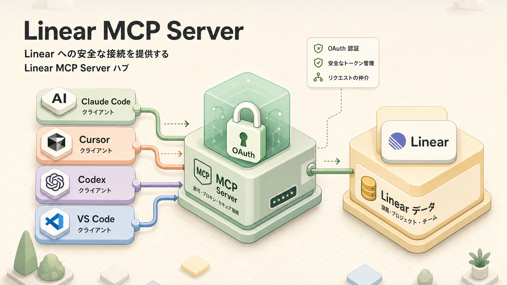

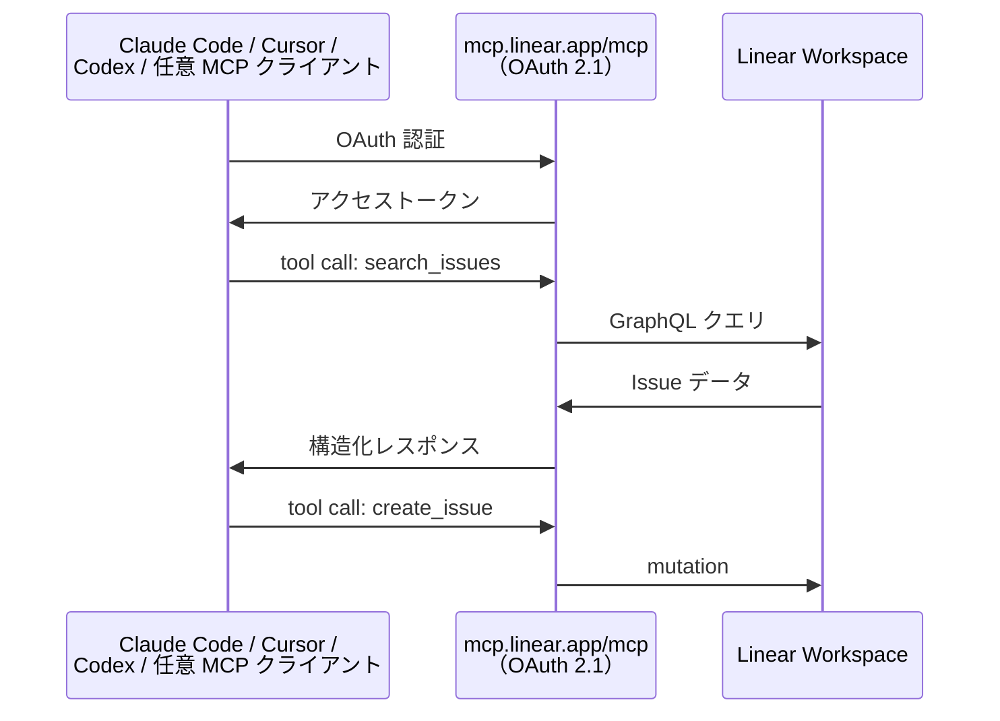
```mermaid
sequenceDiagram
    participant CC as Claude Code / Cursor /<br/>Codex / 任意 MCP クライアント
    participant MCP as mcp.linear.app/mcp<br/>（OAuth 2.1）
    participant LIN as Linear Workspace

    CC->>MCP: OAuth 認証
    MCP->>CC: アクセストークン
    CC->>MCP: tool call: search_issues
    MCP->>LIN: GraphQL クエリ
    LIN->>MCP: Issue データ
    MCP->>CC: 構造化レスポンス
    CC->>MCP: tool call: create_issue
    MCP->>LIN: mutation
```

Linear が公式に提供する Model Context Protocol サーバー。`https://mcp.linear.app/mcp` で稼働、OAuth 2.1 認証付き。

**👨‍💻 エンジニアへの関係**

Claude Code / Cursor / Codex / VS Code (mcp-remote) / Jules / v0 / Windsurf / Zed など、任意の MCP 対応クライアントから安全に Linear を操作可能。自前で API ラッパーを書く必要が無い。

**💳 利用可能プラン**

| Free | Basic | Business | Enterprise |
|:-:|:-:|:-:|:-:|
| 利用可 | 利用可 | 利用可 | 利用可 |

**🏢 ClassLab. での活用**

- 短期: Claude Code から Linear MCP を有効化し、ローカル開発から Issue 検索・作成。
- 中長期: 全社 Workspace の Issue データをエージェントから安全参照する基盤として標準化。

**🔥 差別化点**

- Atlassian も MCP 対応を進めているが、**Linear は 2025 年末から先行**しており、エコシステム側の実装が成熟。

**🔍 深掘り**

- 認証: OAuth 2.1（PKCE 対応）、Workspace 単位でスコープ管理。
- 提供ツール例: `search_issues`, `create_issue`, `update_issue`, `get_project`, `list_cycles`, `get_user` など。
- 2026-04 から **Agent MCP support** が拡張され、Granola / Notion / PostHog などの統合データを Agent から参照可能に。

**⚠️ 注意点**

- MCP 経由のエージェント操作は基本的に **ユーザーのアクセストークンで実行**されるため、権限境界の設計を組織側で行う必要がある。
- ローカル MCP サーバー実装を使う場合、認証・監査・データ持ち出しに注意。

---

#### 4.3.4 Triage Intelligence

**🎯 概要**

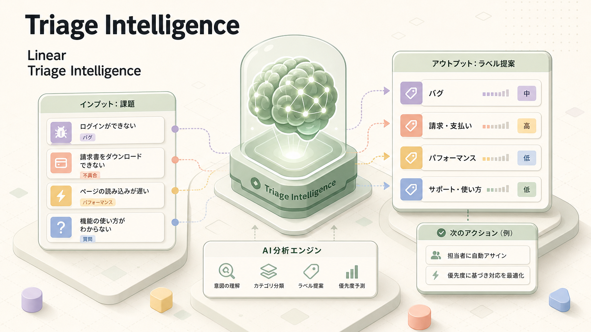

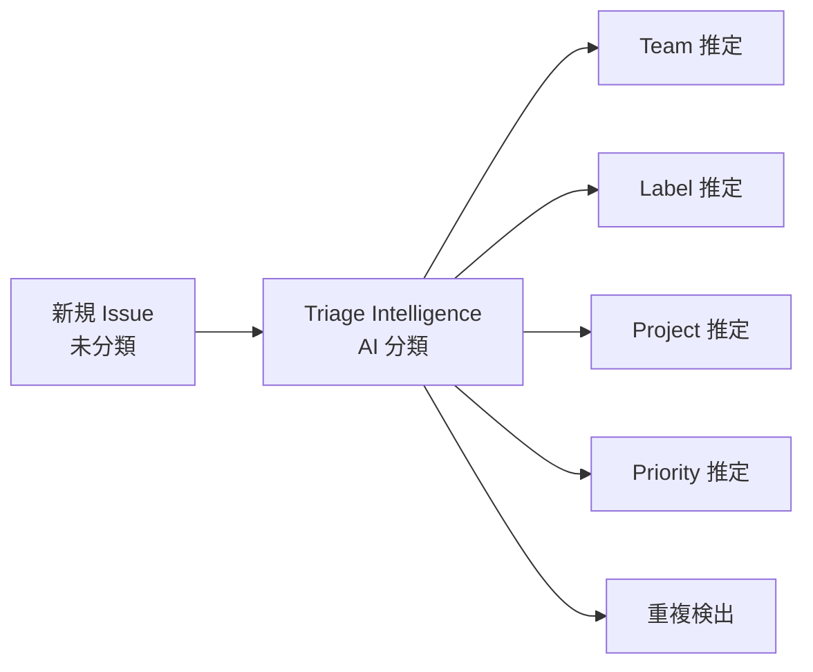
```mermaid
flowchart LR
    IN[新規 Issue<br/>未分類]
    AI[Triage Intelligence<br/>AI 分類]
    OUT1[Team 推定]
    OUT2[Label 推定]
    OUT3[Project 推定]
    OUT4[Priority 推定]
    OUT5[重複検出]
    IN --> AI
    AI --> OUT1
    AI --> OUT2
    AI --> OUT3
    AI --> OUT4
    AI --> OUT5
```

新規 Issue に対して AI が team / label / project / priority を自動推定し、重複も検出。

**👨‍💻 エンジニアへの関係**

triage 担当者の作業負荷を 5〜8 割削減。「AI 提案を承認するだけ」のワークフローになる。

**💳 利用可能プラン**

| Free | Basic | Business | Enterprise |
|:-:|:-:|:-:|:-:|
| 不可 | 不可 | 利用可 | 利用可 |

**🏢 ClassLab. での活用**

- 短期: ライフライン事業の triage で AI 推定を試験運用。
- 中長期: AI 推定の精度を学習させて、triage zero を恒常化。

**🔥 差別化点**

- Atlassian Intelligence にも近い機能はあるが、Linear は **Workspace の Issue 履歴を学習する精度が高い**。

**🔍 深掘り**

- Issue 重複検出: 既存 Issue との意味類似度を計算し、duplicates として提案。
- 2026-05 から duplicates 専用 workflow state と統合され、UX がさらに洗練。

**⚠️ 注意点**

- AI 推定の品質は Workspace の Issue 量と一貫性に依存。最初の 1〜3 ヶ月は精度が低いことを許容。

---

#### 4.3.5 Code Intelligence（2026-05-14 GA）

**🎯 概要**

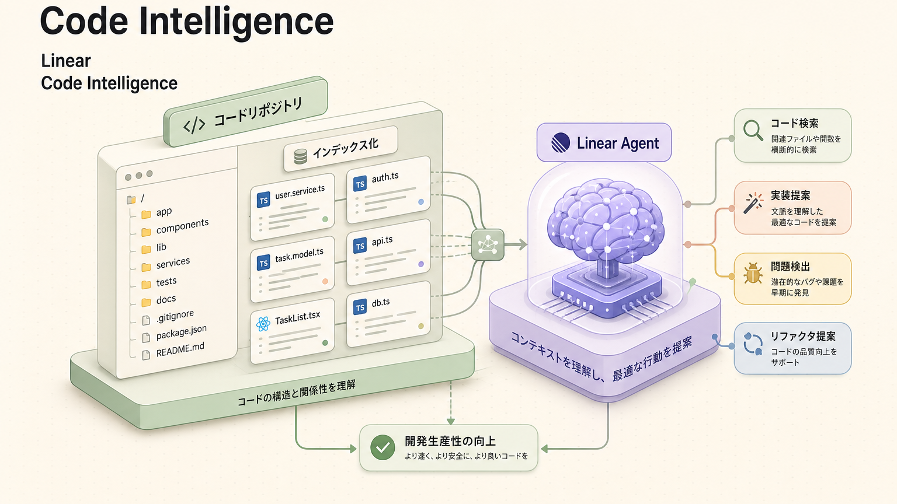

```mermaid
flowchart LR
    REPO[GitHub Repo]
    INDEX[Code Index<br/>コードベース要約]
    AGENT[Linear Agent]
    ISS[Issue]
    REPO --> INDEX
    INDEX --> AGENT
    AGENT --> ISS
    ISS -->|"プロダクトが<br/>どう動くかを<br/>推論しながら回答"| AGENT
```

Linear Agent にリポジトリの読み取りアクセスを与え、コードベースの構造を理解させた上で Issue に応答させる新機能。

**👨‍💻 エンジニアへの関係**

「この機能どこに実装されてる?」「この Issue を解決するならどのファイルを触る?」を Linear Agent が即答できる。コーディングエージェントへの引き継ぎ精度も向上。

**💳 利用可能プラン**

| Free | Basic | Business | Enterprise |
|:-:|:-:|:-:|:-:|
| 不可 | 不可 | 利用可 (beta) | 利用可 |

**🏢 ClassLab. での活用**

- 短期: ライフライン事業のメインリポジトリ 1〜2 本で Code Intelligence を有効化、Agent の回答精度を検証。
- 中長期: 全社リポジトリで有効化し、Issue → エージェント → PR の引き継ぎ品質を底上げ。

**🔥 差別化点**

- Atlassian には現時点で直接の対抗機能なし。
- GitHub Copilot Chat と近いが、**Linear は Issue 文脈と組み合わせる**点が独自。

**🔍 深掘り**

- インデックス更新はリポジトリの変更を検知して自動。プライベートリポにも対応。
- 権限は GitHub アプリ経由で発行し、Linear Workspace 内のメンバーのみ閲覧可能。

**⚠️ 注意点**

- リポジトリ内容を Linear 側にインデックスする点で、機密性の高いコードは事前確認が必要。

---

#### 4.3.6 Automations & Agent Skills

**🎯 概要**

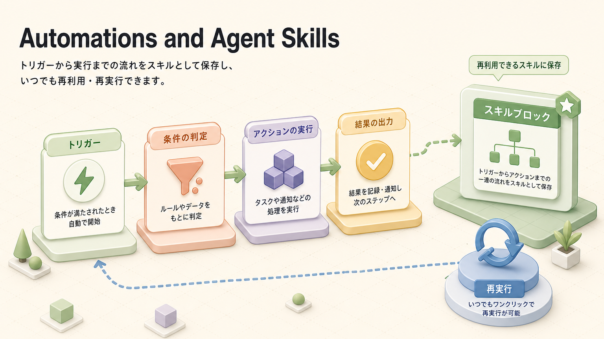

```mermaid
flowchart LR
    TRIG[トリガー:<br/>Issue 作成 /<br/>label 変更 / etc.]
    COND[条件:<br/>label = bug かつ<br/>priority = P0]
    ACT[アクション:<br/>Slack 通知 + label 付与 +<br/>担当者アサイン]
    SKILL[Agent Skill:<br/>会話を再利用可能<br/>スキルに保存]
    TRIG --> COND --> ACT
    SKILL -.-> ACT
```

Issue 状態変化をトリガーに自動アクションを実行。Agent との対話を「スキル」として保存し再利用可能。

**👨‍💻 エンジニアへの関係**

「P0 バグが立ったら自動で Slack 通知 + 担当者ローテーション割り当て」「特定 label が付いたら自動でテンプレ展開」などの定形作業を完全自動化。

**💳 利用可能プラン**

| Free | Basic | Business | Enterprise |
|:-:|:-:|:-:|:-:|
| 不可 | 不可 | 利用可 | 利用可 |

**🏢 ClassLab. での活用**

- 短期: ライフライン事業の SLA インシデント自動エスカレーション。
- 中長期: ポストモーテム自動展開、リリース後の振り返り Issue 自動生成。

**🔥 差別化点**

- Jira Automation と機能的に近いが、Linear は **Agent との対話自体をスキル化できる**点が新しい。

**🔍 深掘り**

- トリガー例: Issue 作成 / status 変更 / label 追加 / 担当者変更 / コメント追加 / SLA 違反。
- アクション例: Issue 作成、コメント、Slack/Teams 通知、担当変更、label 追加、Webhook 呼び出し。

**⚠️ 注意点**

- 過剰な自動化は workspace のノイズを増やす。最初は通知系から導入するのが安全。

---

#### 4.3.7 Deeplink to AI coding tools

**🎯 概要**

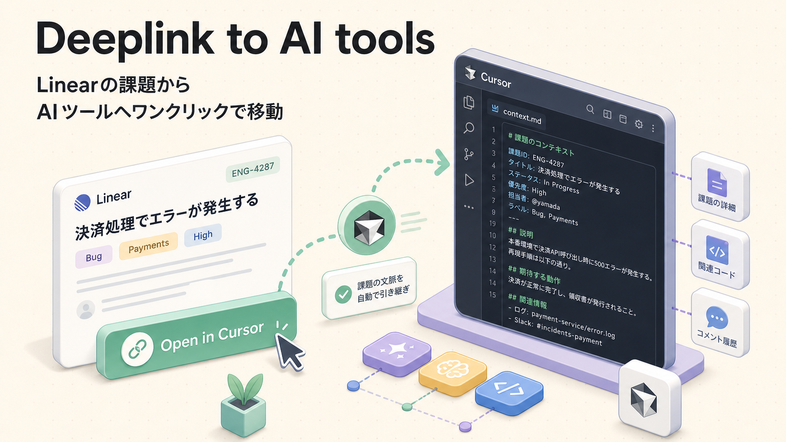

```mermaid
sequenceDiagram
    participant U as ユーザー
    participant LIN as Linear Issue
    participant CC as コーディングエージェント<br/>（Claude Code / Cursor / 等）

    U->>LIN: Issue を開く
    LIN->>U: "Open in [Tool]" ボタン表示
    U->>CC: ボタンクリック
    CC->>CC: Issue タイトル + 説明 +<br/>関連ファイルを自動入力
    CC->>U: コンテキスト準備済みで起動
```

Linear Issue から直接、好みのコーディングエージェントを起動。Issue 内容が自動でコンテキストとして渡される。

**👨‍💻 エンジニアへの関係**

「Issue を読んで → エージェントを開いて → 文脈をコピペ」の 3 ステップが 1 クリックに。エージェント駆動開発の摩擦を最小化。

**💳 利用可能プラン**

| Free | Basic | Business | Enterprise |
|:-:|:-:|:-:|:-:|
| 利用可 | 利用可 | 利用可 | 利用可 |

**🏢 ClassLab. での活用**

- 短期: 各エンジニアが普段使うエージェント（Claude Code / Cursor 等）を deeplink 設定。
- 中長期: 「カスタムコーディングツール統合」で社内ツールにも対応。

**🔥 差別化点**

- 2026-02-26 にリリースされた比較的新しい機能で、競合に類例なし。
- 2026-04-16 に **Custom coding tool integrations** が追加され、URL パラメータまたはローカルコマンド経由で未サポートツールにも対応可能に。

**🔍 深掘り**

- 標準サポート: Cursor / Windsurf / Zed / Codex / Claude Code 等。
- カスタム統合: `linear://issue/.../open?tool=...` のような URL スキームで自前ツールも呼び出し可能。

**⚠️ 注意点**

- エージェント側がローカル起動を必要とする場合、ブラウザの URL スキーム許可が必要。

---

### 4.4 Customer & GTM

#### 4.4.1 Customer Requests

**🎯 概要**

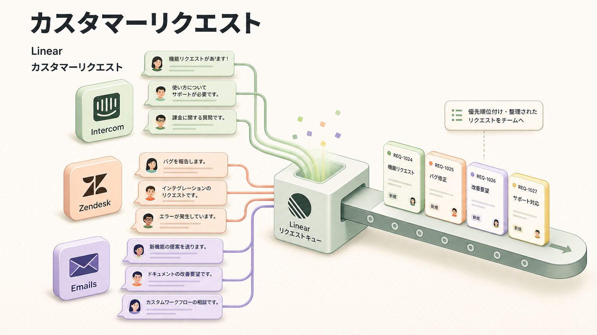

```mermaid
flowchart LR
    SRC1[Intercom]
    SRC2[Zendesk]
    SRC3[Front]
    SRC4[Slack channels]
    SRC5[Email]
    CR[Customer Requests<br/>キュー]
    PROJ[Project / Issue に紐付け]
    PRIO[顧客 tier / revenue で<br/>優先度自動算出]
    SRC1 --> CR
    SRC2 --> CR
    SRC3 --> CR
    SRC4 --> CR
    SRC5 --> CR
    CR --> PRIO
    PRIO --> PROJ
```

顧客サポート・営業ツールから入る顧客要望を Linear に集約し、Project / Issue に直接紐付ける機能。

**👨‍💻 エンジニアへの関係**

「この機能を実装すると、いくらの売上に影響するか」が Issue ベースで見える。Roadmap 議論で営業側のデータを引用しやすい。

**💳 利用可能プラン**

| Free | Basic | Business | Enterprise |
|:-:|:-:|:-:|:-:|
| 制限あり | 利用可 | 利用可 (Product Intelligence+) | 利用可 |

**🏢 ClassLab. での活用**

- 短期: ライフライン事業のサポート（Intercom 等）からの顧客要望を Linear Customer Requests に集約。
- 中長期: Salesforce の顧客 tier / revenue を Linear に同期し、Roadmap 議論を「顧客価値の数字」ベースで実施。

**🔥 差別化点**

- Productboard / Canny が独立ツールとして提供する機能を、**Linear ネイティブで Issue / Project と直結**。
- ツール統合（Intercom / Zendesk / Front / Salesforce / Slack）のカバレッジが広い。

**🔍 深掘り**

- リクエストは「volume（要望数）」「customer tier」「revenue」で自動セグメント。
- Salesforce custom fields をベースに自動トリアージルールを定義可能。

**⚠️ 注意点**

- Customer Requests は **量で押し付けると Roadmap 議論が偏る**。質的判断とのバランスが必要。

---

#### 4.4.2 Product Intelligence

**🎯 概要**

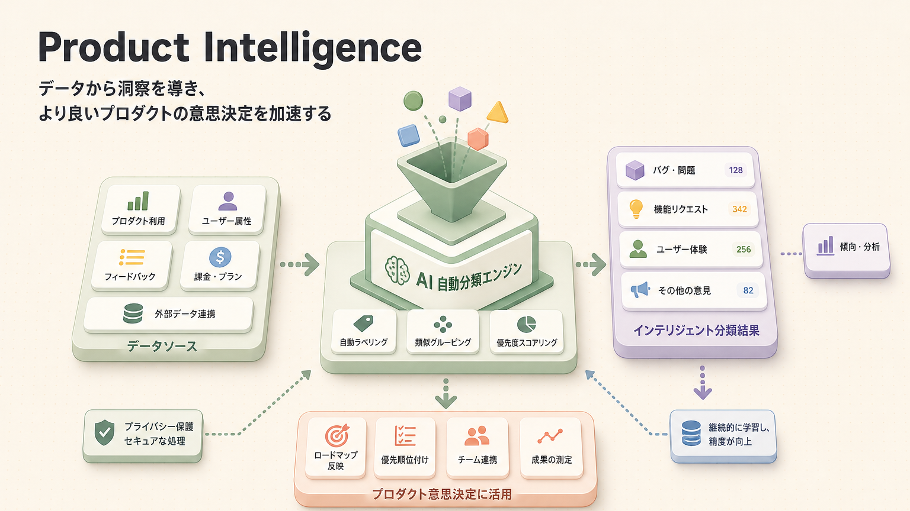

```mermaid
flowchart LR
    NEW[新規 Customer Request]
    AI[Product Intelligence<br/>AI 分類]
    TEAM[Team 推定]
    LBL[Labels 推定]
    PROJ[Project 推定]
    NEW --> AI
    AI --> TEAM
    AI --> LBL
    AI --> PROJ
```

Customer Requests に対して AI が自動で team / labels / project を推定する機能。

**👨‍💻 エンジニアへの関係**

PM が手動で振り分けていた顧客要望が AI によって自動分類され、Roadmap 議論の準備時間が圧縮される。

**💳 利用可能プラン**

| Free | Basic | Business | Enterprise |
|:-:|:-:|:-:|:-:|
| 不可 | 不可 | 利用可 | 利用可 |

**🏢 ClassLab. での活用**

- 中長期: ライフライン事業の顧客要望（年間数千件規模）を Product Intelligence で自動分類。

**🔥 差別化点**

- Productboard の AI も近いが、Linear は **Issue / Project に直結する分類**を行う点で開発側に近い。

**🔍 深掘り**

- 分類モデルは Workspace の過去データを学習。
- 既存 Issue との重複も同時に検出。

**⚠️ 注意点**

- AI の分類精度は最初の 3 ヶ月は人間レビューが必須。

---

#### 4.4.3 Linear Asks

**🎯 概要**

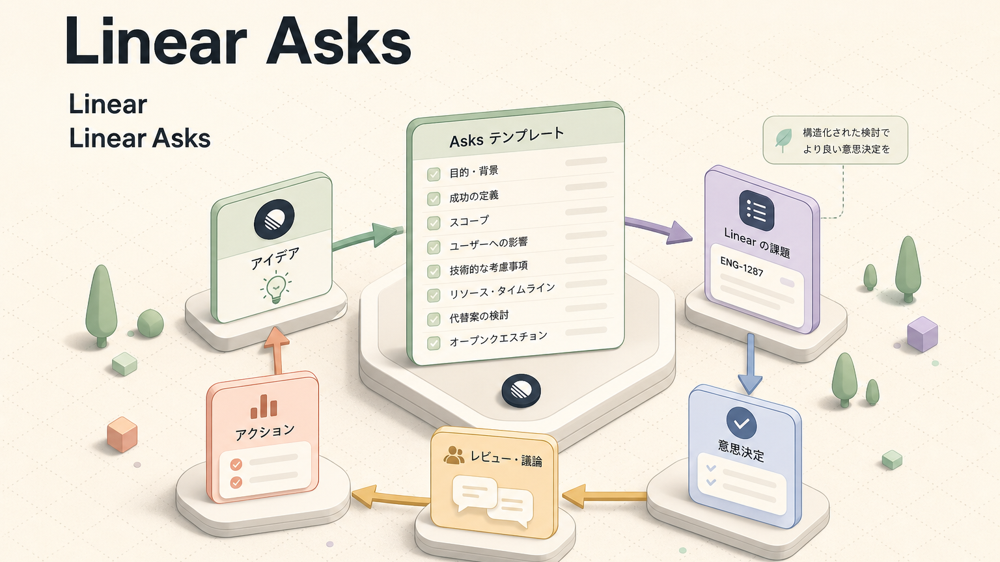

```mermaid
flowchart LR
    SLACK[Slack でリクエスト]
    ASK[Linear Asks 受信]
    TPL[テンプレートマッチ]
    ISS[Issue 自動生成]
    SLACK --> ASK
    ASK --> TPL
    TPL --> ISS
```

社内の他部署からの依頼（IT サポート、開発依頼、ドキュメント依頼など）を Linear Issue として体系的に受け付ける機能。

**👨‍💻 エンジニアへの関係**

「Slack DM で来た依頼が雪崩のように積もる」問題を構造化。依頼受付チャネル（Slack / Web フォーム）を統一できる。

**💳 利用可能プラン**

| Free | Basic | Business | Enterprise |
|:-:|:-:|:-:|:-:|
| 制限あり | 利用可 | 利用可 | 利用可 |

**🏢 ClassLab. での活用**

- 短期: コーポレート IT への依頼を Linear Asks で集約。
- 中長期: システム事業部への横断依頼（営業から開発、CS から開発）を全部 Asks 経由に。

**🔥 差別化点**

- Jira Service Management 相当の機能を、Linear Asks として **同じツール内** で提供。
- 2026-04 から **Web forms for Linear Asks** が追加され、Slack を使わない部署からの受付も可能に。

**🔍 深掘り**

- 各 Team が「Asks ページ」を持ち、専用 URL でリクエスト受付。
- テンプレート機能と連携し、受付フォーマットを統一。

**⚠️ 注意点**

- Asks の受付フォームが乱立すると逆効果。組織で 3〜5 種類に絞る運用を推奨。

---

#### 4.4.4 Asks Agent（Slack）

**🎯 概要**

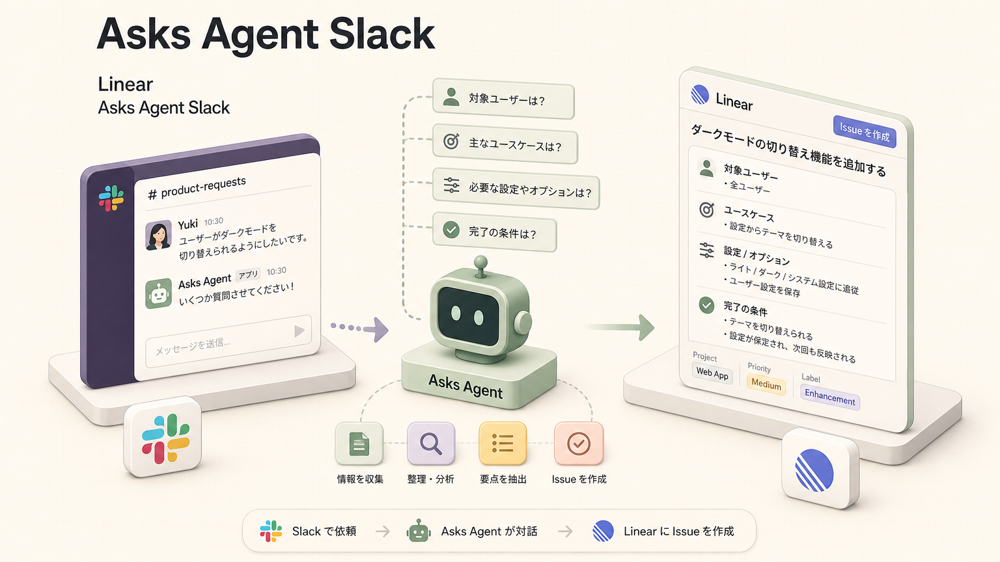

```mermaid
sequenceDiagram
    participant U as 依頼者
    participant SL as Slack
    participant AA as @Linear Asks Agent
    participant TPL as テンプレートライブラリ
    participant LIN as Linear

    U->>SL: @Linear Asks 「新しい iPad 申請したい」
    SL->>AA: メンション
    AA->>TPL: 「申請」系テンプレマッチ
    AA->>U: 不足情報を質問
    U->>AA: 回答
    AA->>LIN: Issue 自動作成
```

Slack で `@Linear Asks` メンションすると、AI が依頼内容を解釈してテンプレートマッチし、Issue を自動生成する 2026-05-21 公開の新機能。

**👨‍💻 エンジニアへの関係**

「Slack DM で依頼が来る → エンジニアが Issue 化する」という二度手間が完全に消える。

**💳 利用可能プラン**

| Free | Basic | Business | Enterprise |
|:-:|:-:|:-:|:-:|
| 不可 | 制限あり | 利用可 | 利用可 |

**🏢 ClassLab. での活用**

- 短期: コーポレート IT で `@Linear Asks` 運用開始、IT 依頼を全部 Issue 化。
- 中長期: 開発依頼にも展開し、Slack DM の駆け込み依頼を構造化。

**🔥 差別化点**

- ServiceNow / Jira Service Management の Slack ボットに近いが、**Linear は Issue Tracker 本体に統合**されている点で開発フローと地続き。

**🔍 深掘り**

- テンプレートライブラリは Team ごとに管理。
- マッチしないリクエストは triage に流す動線。

**⚠️ 注意点**

- 機密性の高い依頼（個人情報、給与関連等）が Asks に流れる可能性に注意。チャネル分離が必要。

---

#### 4.4.5 Web Forms（Linear Asks 用）

**🎯 概要**

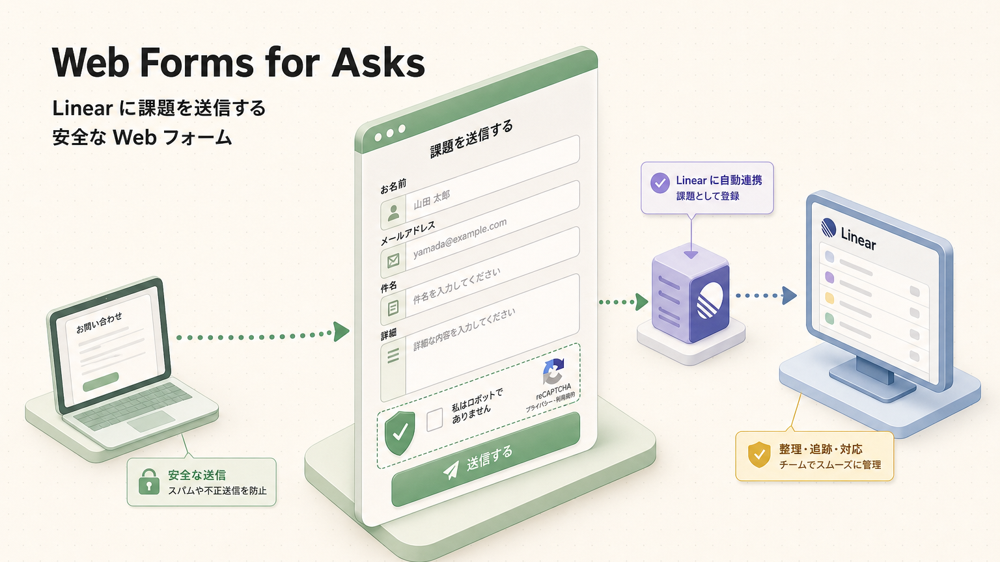

```mermaid
flowchart LR
    URL[公開 URL]
    FORM[Linear Asks<br/>Web Form]
    AUTH[認証なしで受付可]
    LIN[Linear Issue 自動作成]
    URL --> FORM
    FORM --> AUTH
    AUTH --> LIN
```

Linear ユーザーでない人（外部協力会社、社外パートナー）からも依頼を受け付けるための Web フォーム。

**👨‍💻 エンジニアへの関係**

外部からのバグ報告や依頼を Linear に直接集約。専用ツールを立てる必要がない。

**💳 利用可能プラン**

| Free | Basic | Business | Enterprise |
|:-:|:-:|:-:|:-:|
| 不可 | 制限あり | 利用可 | 利用可 |

**🏢 ClassLab. での活用**

- 中長期: ライフライン事業のパートナー（電力会社、工事業者）からの連絡受付を Web フォームに統一。

**🔥 差別化点**

- Asana Forms / Jira Forms と機能は近いが、Linear は **エンジニア向けのコンテキストに最適化**。

**🔍 深掘り**

- フィールドは Custom Fields と連動。
- フォーム送信時に reCAPTCHA 相当の保護あり。

**⚠️ 注意点**

- 公開 Web フォームはスパム対策必須。フィルタとレートリミット設計を確認。

---

### 4.5 Insights & Analytics

#### 4.5.1 Insights

**🎯 概要**

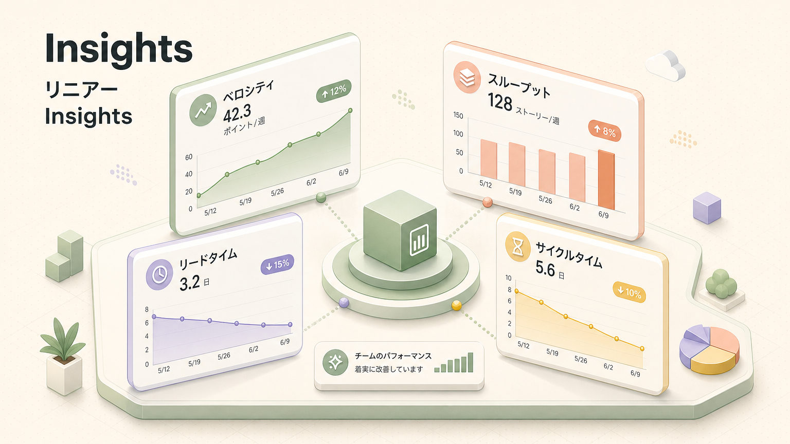

```mermaid
flowchart LR
    DATA[(Issues / Cycles /<br/>Projects)]
    FILTER[Filter:<br/>team / project /<br/>label / date]
    METRIC[Metric:<br/>count / effort /<br/>cycle time / lead time]
    GROUP[Grouping:<br/>by status / assignee /<br/>label / time bucket]
    VIS[可視化:<br/>line / bar / area /<br/>pie / time series]
    DATA --> FILTER --> METRIC --> GROUP --> VIS
```

Workspace のデータをリアルタイムで集計・可視化する分析エンジン。Issue count、effort、cycle time、triage time、lead time、issue age を集計軸として扱える。

**👨‍💻 エンジニアへの関係**

「先週の cycle velocity」「P0 バグの lead time」「triage の滞留時間」などの開発生産性メトリクスを 1 クリックで可視化。

**💳 利用可能プラン**

| Free | Basic | Business | Enterprise |
|:-:|:-:|:-:|:-:|
| 不可 | 不可 | 利用可 | 利用可 |

**🏢 ClassLab. での活用**

- 短期: ライフライン事業の cycle velocity と triage time を Insights で可視化。
- 中長期: 全社の DORA メトリクス（lead time, deployment frequency 等）を Linear Insights + Releases + CI/CD で算出。

**🔥 差別化点**

- Jira の Reports は重く、カスタマイズ性も Linear Insights ほどでは無い。
- LinearB / Swarmia のような専用 SaaS と機能的に近く、**ツール統合不要で同等のことができる**点が強み。

**🔍 深掘り**

- 集計粒度: daily / weekly / monthly / quarterly / yearly。
- フィルタ次元: status / assignee / priority / labels / project / team / dates。
- データ出力: CSV / Google Sheets / Airbyte 経由でデータウェアハウスへ同期可能。

**⚠️ 注意点**

- Insights は Business 以上。Basic ではプレビューやサンプル表示のみ。

---

#### 4.5.2 Custom Dashboards

**🎯 概要**

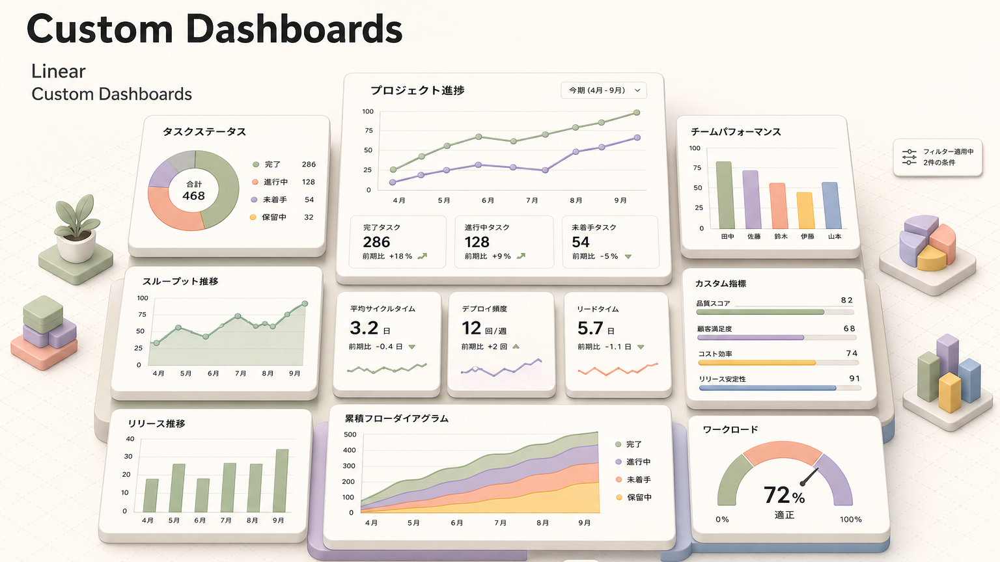

```mermaid
flowchart TB
    INS1[Insight: cycle velocity]
    INS2[Insight: triage time]
    INS3[Insight: bug count]
    INS4[Insight: PR throughput]
    DASH[Custom Dashboard]
    INS1 --> DASH
    INS2 --> DASH
    INS3 --> DASH
    INS4 --> DASH
```

複数の Insight を組み合わせて、目的別のダッシュボードを構築。チーム/プロジェクト/事業部単位で共有。

**👨‍💻 エンジニアへの関係**

「経営報告ダッシュボード」「事業部生産性ダッシュボード」「障害対応ダッシュボード」を Linear 内で構築・共有。

**💳 利用可能プラン**

| Free | Basic | Business | Enterprise |
|:-:|:-:|:-:|:-:|
| 不可 | 不可 | 不可 | 利用可 |

**🏢 ClassLab. での活用**

- 中長期: システム事業部の経営ダッシュボードを Linear で構築、毎週の事業報告に直接利用。

**🔥 差別化点**

- Tableau / Looker などの BI ツールを使わずに、**Linear データに特化したダッシュボード**を作れる。

**🔍 深掘り**

- ダッシュボード共有: 公開 / Workspace 限定 / 個人。
- レイアウト: グリッド配置、ウィジェットのドラッグ。

**⚠️ 注意点**

- Enterprise 限定。Business では Insights は使えても Dashboard 化はできない。

---

#### 4.5.3 Pulse

**🎯 概要**

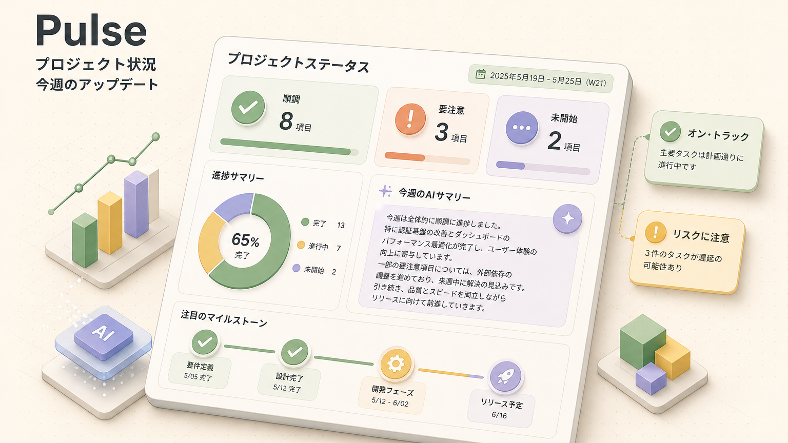

```mermaid
flowchart LR
    PROJ[Project]
    UPDATE[Pulse Update<br/>進捗の自然言語更新]
    FEED[Activity Feed]
    NOTIFY[ステークホルダー通知]
    PROJ --> UPDATE
    UPDATE --> FEED
    FEED --> NOTIFY
```

Project の進捗を自然言語で更新する機能。AI が Issue の状態から自動下書きを生成。

**👨‍💻 エンジニアへの関係**

「週次プロジェクト報告」を Slack で書く時間を圧縮。AI が Issue の動きをサマライズして下書き。

**💳 利用可能プラン**

| Free | Basic | Business | Enterprise |
|:-:|:-:|:-:|:-:|
| 制限あり | 利用可 | 利用可 (AI 下書き) | 利用可 (AI 下書き) |

**🏢 ClassLab. での活用**

- 中長期: 大型 Project（Salesforce 移行など）の週次報告を Pulse で自動下書き。

**🔥 差別化点**

- Asana の Project Status と機能的に近いが、**Linear は AI による自動下書きとアクティビティフィード統合**が強み。

**🔍 深掘り**

- Update のタイプ: On Track / At Risk / Off Track / Completed。
- 過去の Update は時系列で蓄積され、振り返りに使える。

**⚠️ 注意点**

- Pulse Update を放置すると Roadmap の信頼性が低下。週次のリズムを組織で守る。

---

#### 4.5.4 CSV / Google Sheets / Airbyte Export

**🎯 概要**

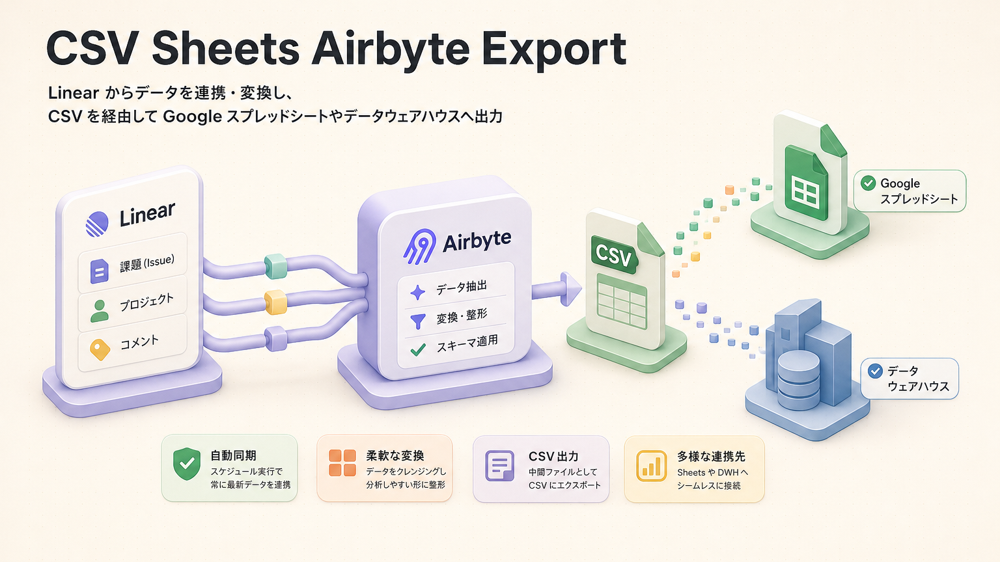

```mermaid
flowchart LR
    LIN[(Linear Data)]
    CSV[CSV Export]
    GS[Google Sheets<br/>双方向同期]
    AB[Airbyte → DWH<br/>BigQuery / Snowflake / etc.]
    LIN --> CSV
    LIN --> GS
    LIN --> AB
```

Linear データを外部に持ち出して分析・連携。

**👨‍💻 エンジニアへの関係**

社内データウェアハウスに同期して、Linear データを他システムのデータと結合分析。

**💳 利用可能プラン**

| Free | Basic | Business | Enterprise |
|:-:|:-:|:-:|:-:|
| 制限あり (CSV のみ) | 利用可 | 利用可 | 利用可 (Airbyte 含む) |

**🏢 ClassLab. での活用**

- 中長期: BigQuery / Snowflake などの社内 DWH に Linear データを同期し、Salesforce との結合分析。

**🔥 差別化点**

- Airbyte 連携で **DWH への直接同期**が公式サポート。Jira / Asana より整理されている。

**🔍 深掘り**

- Airbyte: ストリーミング差分同期に対応。
- Google Sheets: Insights の生データを Sheets で受け取り、Pivot / Chart で加工可能。

**⚠️ 注意点**

- 大量データを毎日同期するとレート制限。差分同期を推奨。

---

### 4.6 Integrations

#### 4.6.1 GitHub / GitLab / GitHub Enterprise Cloud

**🎯 概要**

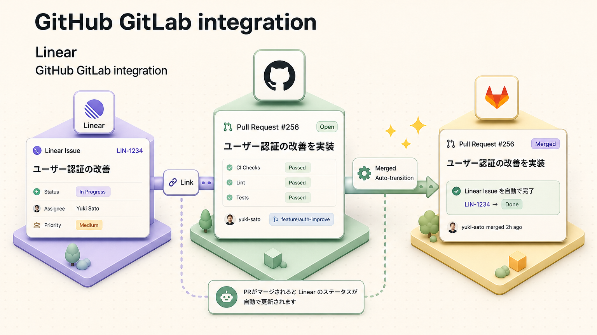

```mermaid
sequenceDiagram
    participant ENG as Engineer
    participant GH as GitHub
    participant LIN as Linear

    ENG->>GH: ブランチ作成 (ENG-123-...)
    GH->>LIN: ブランチ通知 → Issue 関連付け
    ENG->>GH: PR 作成 (本文に ENG-123)
    GH->>LIN: PR 自動リンク + status: In Review
    ENG->>GH: PR Merge
    GH->>LIN: status: Done に自動遷移
```

Git ホスティングと Linear Issue を双方向に自動同期。ブランチ名・コミットメッセージ・PR 本文の ID マッチングで自動関連付け。

**👨‍💻 エンジニアへの関係**

「ブランチ作成 → PR → マージ」が Linear Issue のステータス遷移と完全同期。手動更新ゼロ。

**💳 利用可能プラン**

| Free | Basic | Business | Enterprise |
|:-:|:-:|:-:|:-:|
| 利用可 | 利用可 | 利用可 | 利用可 (GitHub Enterprise Cloud) |

**🏢 ClassLab. での活用**

- 短期: 全リポジトリで Linear ↔ GitHub 連携を有効化。
- 中長期: GitHub Enterprise Cloud 利用時の二重認証 + Linear 連携を整備。

**🔥 差別化点**

- 2026-05-21 から **GitHub Enterprise Cloud** に対応。エンプラ向け要件をカバー。
- Jira の GitHub 連携と比べて **設定がほぼゼロ**。

**🔍 深掘り**

- ブランチ命名規則: `{user}/{issue-id}-{slug}` を Linear 側が推奨。
- PR 本文に `ENG-123` を含めると自動リンク。
- マージ時のステータス遷移は Workflow ごとにカスタム可能。

**⚠️ 注意点**

- GitLab はサポートしているが GitHub に比べ機能差あり（特に PR テンプレート連携）。

---

#### 4.6.2 Slack / Microsoft Teams

**🎯 概要**

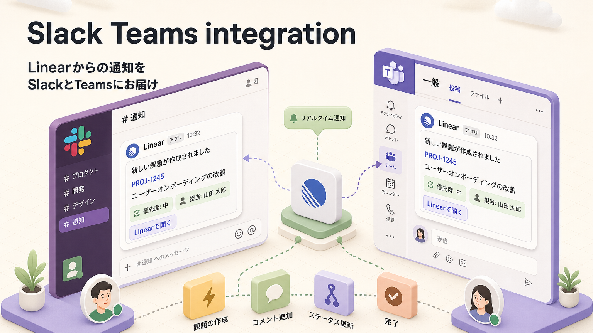

```mermaid
flowchart LR
    SLACK[Slack / Teams]
    LIN[Linear Workspace]
    SLACK -.メンション/通知.- LIN
    LIN -.Issue 更新通知.- SLACK
    SLACK -.@Linear で Issue 作成.- LIN
    SLACK -.Project Slack channel.- LIN
```

チャットツールと Linear をシームレスに統合。通知・Issue 作成・更新を相互。

**👨‍💻 エンジニアへの関係**

Slack の `#dev` チャネルで `@Linear` メンションするだけで Issue 化。Issue の更新は Slack スレッドに自動コメント。

**💳 利用可能プラン**

| Free | Basic | Business | Enterprise |
|:-:|:-:|:-:|:-:|
| 利用可 | 利用可 | 利用可 | 利用可 |

**🏢 ClassLab. での活用**

- 短期: 全社 Slack で `@Linear` 運用開始。
- 中長期: Microsoft Teams を使う事業部にも展開。

**🔥 差別化点**

- 2026-04-16 から **Linear for Microsoft Teams** が公開。Slack 偏重を脱却。
- 2026-04-16 から **複数 Slack スレッドへの同期**に対応し、報告・要望集約が可能に。
- 2026-05-21 から **Project Slack channels** が自動生成可能。

**🔍 深掘り**

- 個人通知: Slack DM / Teams DM で自分宛 Issue の更新を受け取る。
- 双方向同期: Slack スレッドで議論したコメントが Linear Issue にも残る。

**⚠️ 注意点**

- 過剰通知に注意。Notification preferences で粒度を調整。

---

#### 4.6.3 Intercom / Zendesk / Front / Salesforce

**🎯 概要**

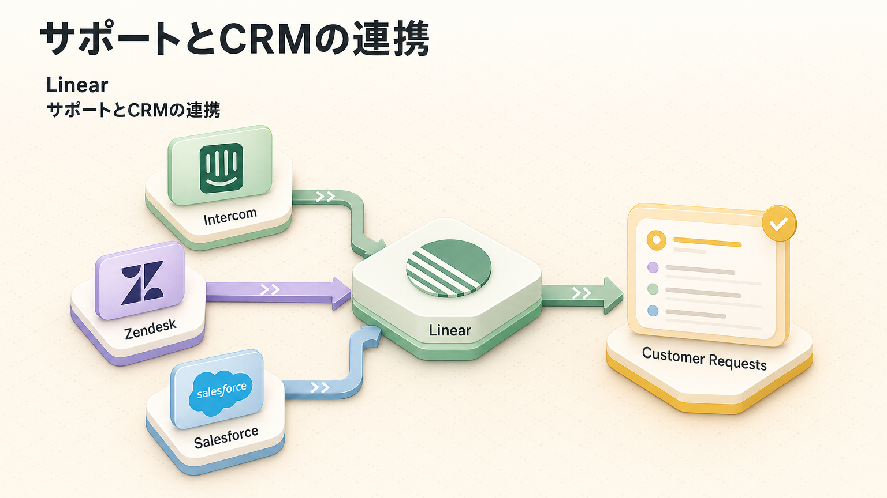

```mermaid
flowchart LR
    INT[Intercom]
    ZEN[Zendesk]
    FRT[Front]
    SF[Salesforce]
    CR[Customer Requests]
    INT --> CR
    ZEN --> CR
    FRT --> CR
    SF -.顧客 attribute 同期.-> CR
```

カスタマーサポート・CRM ツールから顧客要望を Linear Customer Requests に流す統合。

**👨‍💻 エンジニアへの関係**

「サポートに来た要望が開発側で見える」状態が自動で実現。Issue → Project → Roadmap → 顧客への返信ループが閉じる。

**💳 利用可能プラン**

| Free | Basic | Business | Enterprise |
|:-:|:-:|:-:|:-:|
| 制限あり | 利用可 | 利用可 | 利用可 |

**🏢 ClassLab. での活用**

- 短期: ライフライン事業のサポートツールから Customer Requests に集約。
- 中長期: Salesforce の顧客 tier / revenue を同期し、Roadmap 議論を数値ベースに。

**🔥 差別化点**

- Productboard / Canny を使わずに **Linear ネイティブ**でこの統合が成立する点が独自。

**🔍 深掘り**

- 各ツールの Webhook / OAuth を Linear が受け取り、Customer Request として正規化。
- Salesforce custom fields を Linear 側で参照できる。

**⚠️ 注意点**

- 各ツールの API レート制限に注意。大量同期時はバッチ設定。

---

#### 4.6.4 Figma / Notion / PostHog / Sentry

**🎯 概要**

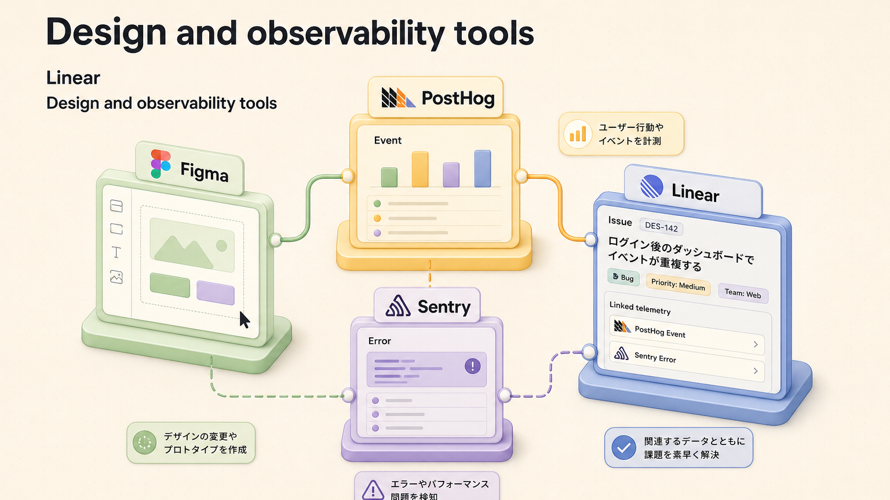

```mermaid
flowchart LR
    FIG[Figma]
    NOT[Notion]
    PH[PostHog]
    SEN[Sentry]
    LIN[Linear Issue]
    FIG -.デザイン埋め込み.- LIN
    NOT -.ドキュメント参照.- LIN
    PH -.イベント→Issue.- LIN
    SEN -.エラー→Issue + Sentry Agent.- LIN
```

開発エコシステムの主要ツールと Linear を双方向統合。

**👨‍💻 エンジニアへの関係**

「Figma デザインを Issue に貼る」「Sentry のエラーが Issue になり、Sentry Agent が修正提案」「PostHog のイベント条件で Issue を自動作成」が全て自動。

**💳 利用可能プラン**

| Free | Basic | Business | Enterprise |
|:-:|:-:|:-:|:-:|
| 利用可 | 利用可 | 利用可 | 利用可 |

**🏢 ClassLab. での活用**

- 短期: Figma + Sentry の連携を有効化。
- 中長期: PostHog のアラート → Linear Issue の自動化を全プロダクトで標準化。

**🔥 差別化点**

- **Sentry Agent** が 2026 年に登場し、Sentry エラーから直接 Linear Issue + PR 修正提案まで自動化。

**🔍 深掘り**

- Figma 連携は Issue 内で Figma フレームをライブプレビュー可能。
- Notion 連携は Linear Issue から Notion ページを参照、逆も可能。

**⚠️ 注意点**

- 統合数が多いと Workspace の通知設計が複雑化。優先度を明確に。

---

#### 4.6.5 Releases（CI/CD 連携）

**🎯 概要**

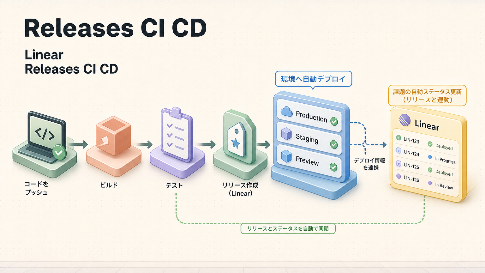

```mermaid
flowchart LR
    GIT[Git Tag / Deploy Event]
    CI[CI/CD<br/>GitHub Actions / Vercel / etc.]
    REL[Linear Releases]
    ISS[Issue ステータス自動更新]
    GIT --> CI
    CI --> REL
    REL --> ISS
```

CI/CD パイプラインと統合し、デプロイ環境・バージョンを追跡。リリースに含まれる Issue を自動でマーク。

**👨‍💻 エンジニアへの関係**

「どの Issue がどの環境にデプロイ済みか」が Linear 内で見える。リリースノートの下書きも自動。

**💳 利用可能プラン**

| Free | Basic | Business | Enterprise |
|:-:|:-:|:-:|:-:|
| 制限あり | 利用可 | 利用可 | 利用可 |

**🏢 ClassLab. での活用**

- 短期: ライフライン事業のフロントエンドリポで Releases を有効化、Vercel デプロイと連動。
- 中長期: 全システムで本番/ステージング/開発の 3 環境を Linear Releases で追跡し、DORA メトリクスを自動計算。

**🔥 差別化点**

- Jira の Release / Version は手動運用が中心だが、Linear Releases は **CI/CD イベント駆動で自動更新**。
- 2026-04-30 にリリースされた最新機能で、競合よりモダンな設計。

**🔍 深掘り**

- 対応 CI/CD: GitHub Actions / Vercel / Netlify / Render / 自前 Webhook。
- Release ごとに含まれる PR / Issue / Commit のリストを自動生成。

**⚠️ 注意点**

- 既存の CI/CD パイプラインの修正が必要な場合あり。導入時にハーネス設計を組み直す覚悟が必要。

---

### 4.7 Developer Platform

#### 4.7.1 GraphQL API

**🎯 概要**

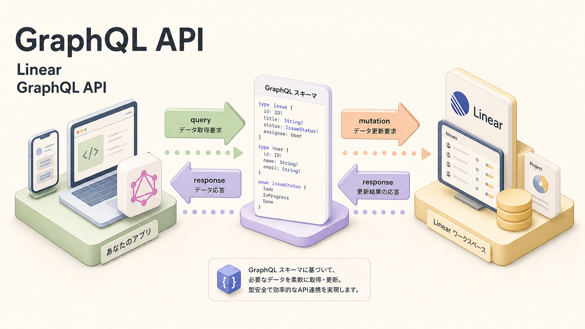

```mermaid
flowchart LR
    APP[自前アプリ / スクリプト]
    GQL[Linear GraphQL API<br/>api.linear.app/graphql]
    WS[Linear Workspace]
    APP -->|query/mutation| GQL
    GQL --> WS
```

Linear の全データに GraphQL 経由でアクセス可能。Issue / Project / Cycle / User / Team などの CRUD。

**👨‍💻 エンジニアへの関係**

カスタムオートメーション、社内ツール、CLI 拡張など自由に書ける。Linear SDK が TypeScript / Python / Go で提供。

**💳 利用可能プラン**

| Free | Basic | Business | Enterprise |
|:-:|:-:|:-:|:-:|
| 利用可 | 利用可 | 利用可 | 利用可 |

**🏢 ClassLab. での活用**

- 短期: 雑務スキルから Linear API を叩いて Issue 一括生成。
- 中長期: Salesforce → Linear、Asana → Linear の自社移行スクリプトを GraphQL で実装。

**🔥 差別化点**

- Jira REST API より **GraphQL ベース**で開発体験が良い。
- 公式 SDK（@linear/sdk）の TypeScript 型サポートが手厚い。

**🔍 深掘り**

- レート制限: 認証付きで 1500 req/h（標準）、エンタープライズで増加可能。
- Pagination: cursor ベース。

**⚠️ 注意点**

- レート制限を超えるとブロック。バルク操作はバッチ + 待機を実装。

---

#### 4.7.2 Webhooks

**🎯 概要**

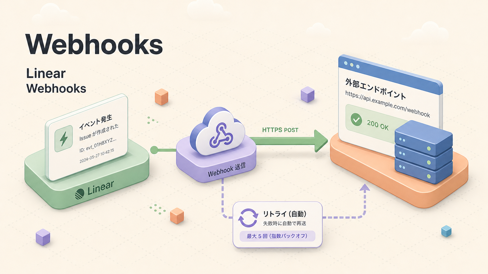

```mermaid
sequenceDiagram
    participant LIN as Linear
    participant HOOK as Webhook Endpoint
    participant APP as 自社システム

    LIN->>HOOK: Issue 作成 / 更新 イベント
    HOOK->>APP: ペイロード転送
    APP->>APP: 任意の処理
```

Workspace のイベントを外部にプッシュ通知。Issue / Project / Comment / Cycle などの変更を購読可能。

**👨‍💻 エンジニアへの関係**

「Issue が `Done` になったら社内 Wiki に自動で記載」のようなオートメーションを Webhook で実装。

**💳 利用可能プラン**

| Free | Basic | Business | Enterprise |
|:-:|:-:|:-:|:-:|
| 利用可 | 利用可 | 利用可 | 利用可 |

**🏢 ClassLab. での活用**

- 短期: Linear → 社内 Slack ボット連携（Linear 標準通知の補完）。
- 中長期: Linear → BigQuery への即時 ETL を Webhook で構築。

**🔥 差別化点**

- イベント種別が細かく、ペイロードに前後の状態が含まれる。

**🔍 深掘り**

- 認証: HMAC 署名（X-Linear-Signature ヘッダ）でペイロード検証。
- リトライ: 失敗時は最大 24 時間まで指数バックオフでリトライ。

**⚠️ 注意点**

- Webhook 受信エンドポイントを公開する必要あり。社内向けは Tunnel / VPC 設定を検討。

---

#### 4.7.3 OAuth / Personal API Keys

**🎯 概要**

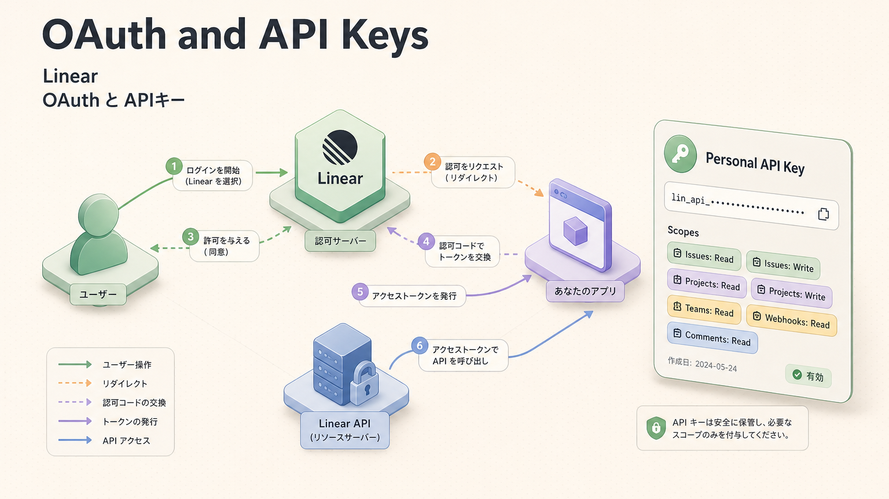

```mermaid
flowchart LR
    USER[Developer]
    OAUTH[OAuth 2.0]
    PAT[Personal API Key]
    APP[外部アプリ]
    LIN[Linear]
    USER --> OAUTH --> APP
    USER --> PAT --> APP
    APP --> LIN
```

外部アプリから Linear にアクセスするための 2 種類の認証方式。

**👨‍💻 エンジニアへの関係**

OAuth: ユーザー認証付きで複数ユーザー向けアプリを構築。
Personal API Key: 個人スクリプト用、即発行。

**💳 利用可能プラン**

| Free | Basic | Business | Enterprise |
|:-:|:-:|:-:|:-:|
| 利用可 | 利用可 | 利用可 | 利用可 |

**🏢 ClassLab. での活用**

- 短期: 個人スクリプト用に Personal API Key を発行。
- 中長期: 社内アプリは OAuth に統一し、退職時の権限剥奪を SCIM で自動化。

**🔥 差別化点**

- MCP サーバーも OAuth 2.1 ベースで統一されており、認可境界が明確。

**🔍 深掘り**

- OAuth scopes: read / write / admin の粒度。
- Personal API Key は失効期限を任意設定可能。

**⚠️ 注意点**

- Personal API Key の Git コミットへの混入に注意。Secret Scanning を必ず有効化。

---

#### 4.7.4 Linear SDK & CLI

**🎯 概要**

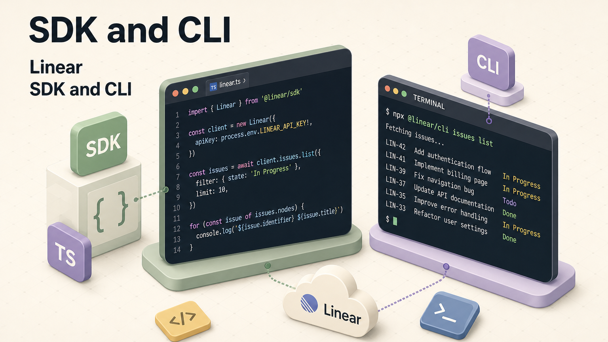

```mermaid
flowchart LR
    SDK[Linear SDK<br/>@linear/sdk]
    CLI[Linear CLI<br/>composio.dev/toolkits/linear]
    APP[アプリ / スクリプト]
    LIN[Linear API]
    SDK --> LIN
    CLI --> LIN
    APP --> SDK
    APP --> CLI
```

公式 TypeScript SDK と、コミュニティ製 CLI（AI Agent 向け）。

**👨‍💻 エンジニアへの関係**

`@linear/sdk` で型安全な GraphQL クエリ。CLI は AI Agent から呼び出す軽量インターフェース。

**💳 利用可能プラン**

| Free | Basic | Business | Enterprise |
|:-:|:-:|:-:|:-:|
| 利用可 | 利用可 | 利用可 | 利用可 |

**🏢 ClassLab. での活用**

- 短期: Linear SDK で雑務スキルを拡張、Issue 一括生成・移行スクリプト。
- 中長期: 社内ツール（管理コンソール、ダッシュボード）の認証バックエンドに統一。

**🔥 差別化点**

- TypeScript 型サポートが非常に手厚い（API ドキュメントと型が同じソースから生成）。

**🔍 深掘り**

- SDK は `LinearClient` を起点に全リソースをクエリ可能。
- ページング・ストリーミング対応。

**⚠️ 注意点**

- SDK のメジャーバージョン更新時は破壊的変更に注意。

---

### 4.8 Mobile

#### 4.8.1 iOS / Android アプリ

**🎯 概要**

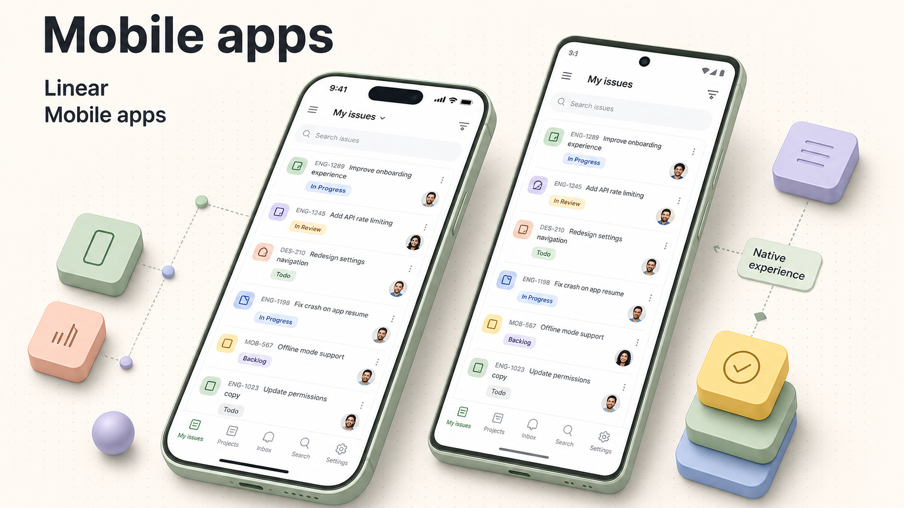

```mermaid
flowchart LR
    IOS[iOS App]
    AND[Android App]
    WS[Linear Workspace]
    IOS <--> WS
    AND <--> WS
```

ネイティブモバイルアプリで Issue 確認・コメント・トリアージが可能。

**👨‍💻 エンジニアへの関係**

「移動中の triage」「障害対応時の Issue 確認」を出先で実行可能。

**💳 利用可能プラン**

| Free | Basic | Business | Enterprise |
|:-:|:-:|:-:|:-:|
| 利用可 | 利用可 | 利用可 | 利用可 |

**🏢 ClassLab. での活用**

- 短期: PM / EM がモバイルアプリで通知を受け、移動中に triage 対応。
- 中長期: 全エンジニアにインストール推奨、リモートワーク時の継続性確保。

**🔥 差別化点**

- Jira / Asana のモバイルアプリより **動作が圧倒的に軽快**。

**🔍 深掘り**

- オフライン対応: 限定的（読み取り中心）。
- プッシュ通知: メンション / 担当変更 / SLA 違反などをフィルタ設定可能。

**⚠️ 注意点**

- 大量 Issue 操作には不向き。本格作業は Web 版を推奨。

---

### 4.9 Security & Governance

#### 4.9.1 SSO (Google / SAML)

**🎯 概要**

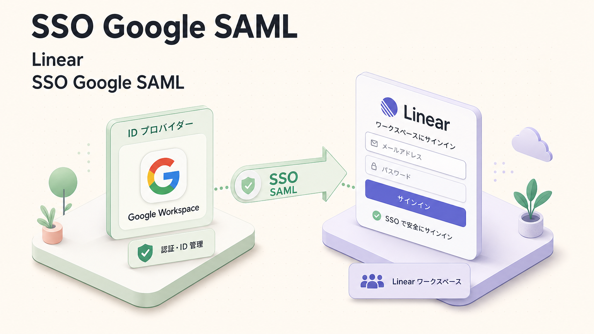

```mermaid
flowchart LR
    IDP[Identity Provider<br/>Google / Okta / Azure AD]
    SAML[SAML 2.0]
    LIN[Linear Workspace]
    IDP --> SAML --> LIN
```

Google Workspace SSO は全プラン、SAML は Enterprise のみ。

**👨‍💻 エンジニアへの関係**

社内 IdP（Okta / Azure AD など）と統合し、ID 管理を一元化。

**💳 利用可能プラン**

| Free | Basic | Business | Enterprise |
|:-:|:-:|:-:|:-:|
| 制限あり (Google) | 制限あり (Google) | 制限あり (Google) | 利用可 (SAML 含む) |

**🏢 ClassLab. での活用**

- 中長期: 全社 IdP（Google Workspace）から SSO 統合、退職者の即時アクセス遮断。

**🔥 差別化点**

- SSO Tax が控えめ（Business でも Google SSO は利用可、SAML のみ Enterprise）。

**🔍 深掘り**

- SAML 2.0 対応、JIT Provisioning 可能。
- セッション期限カスタム設定。

**⚠️ 注意点**

- 50 人超の組織は SAML 必須レベルになりがちで、結果的に Enterprise 必須。

---

#### 4.9.2 SCIM プロビジョニング

**🎯 概要**

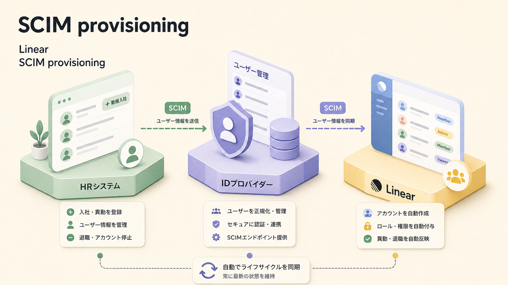

```mermaid
sequenceDiagram
    participant HR as HR System
    participant IDP as Identity Provider
    participant LIN as Linear

    HR->>IDP: 新入社員 追加
    IDP->>LIN: SCIM 経由でユーザー作成
    HR->>IDP: 退職者 無効化
    IDP->>LIN: SCIM 経由で deactivate
```

IdP からの自動ユーザー作成・削除・属性同期。

**👨‍💻 エンジニアへの関係**

人事システムと Linear のユーザー状態が常時同期。退職者の置き忘れリスク排除。

**💳 利用可能プラン**

| Free | Basic | Business | Enterprise |
|:-:|:-:|:-:|:-:|
| 不可 | 不可 | 不可 | 利用可 |

**🏢 ClassLab. での活用**

- 中長期: SCIM 経由で人事 → IdP → Linear の自動化を構築。

**🔥 差別化点**

- Enterprise 専用機能だが、SCIM 2.0 標準準拠で **Okta / Azure AD / OneLogin** から即接続可能。

**🔍 深掘り**

- 同期可能属性: email / name / role / team membership。
- グループ同期で Team 自動構成も可能。

**⚠️ 注意点**

- SCIM 同期失敗時のアラート設計を IdP 側に組み込むこと。

---

#### 4.9.3 監査ログ

**🎯 概要**

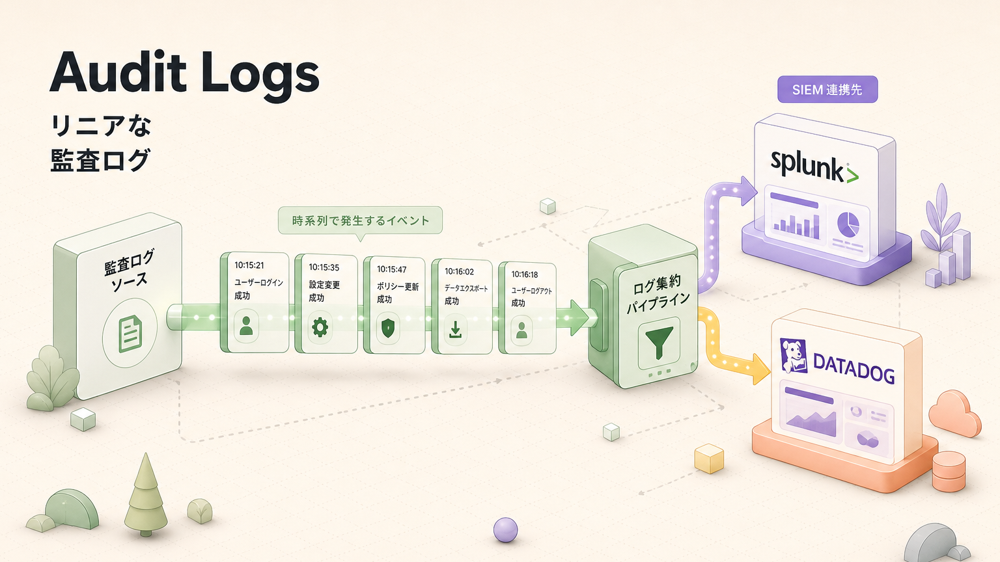

```mermaid
flowchart LR
    EVENT[Workspace イベント<br/>ログイン / 設定変更 /<br/>権限変更 / Issue 削除]
    LOG[Audit Log]
    EXP[CSV / API エクスポート]
    SIEM[SIEM 統合<br/>Splunk / Datadog 等]
    EVENT --> LOG
    LOG --> EXP
    LOG --> SIEM
```

Workspace 内の重要イベントを記録、外部 SIEM へエクスポート可能。

**👨‍💻 エンジニアへの関係**

セキュリティインシデント時の調査、コンプライアンス監査対応。

**💳 利用可能プラン**

| Free | Basic | Business | Enterprise |
|:-:|:-:|:-:|:-:|
| 不可 | 不可 | 不可 | 利用可 |

**🏢 ClassLab. での活用**

- 中長期: SOC 2 / ISMS 等の監査対応で Linear 監査ログを利用。

**🔥 差別化点**

- Jira / Asana の監査ログより **ストリーミング API 提供**で SIEM 統合が容易。

**🔍 深掘り**

- ログ保持期間: Enterprise でカスタム設定可能。
- イベント種別: ユーザー管理 / 設定変更 / API key 操作 / Issue 削除など。

**⚠️ 注意点**

- Enterprise 限定。コンプライアンス要件があるなら Business では対応不可。

---

#### 4.9.4 Issue-level sharing control（2026-04-23）

**🎯 概要**

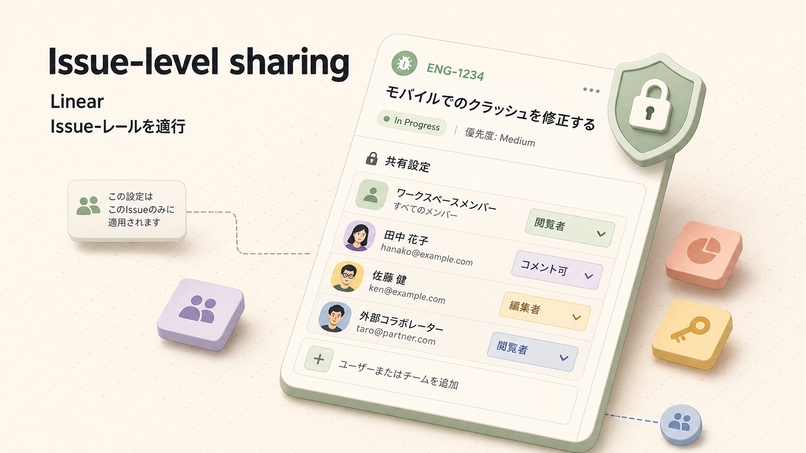

```mermaid
flowchart LR
    OWNER[Team Owner]
    POLICY[Sharing Policy 設定]
    ISS[Issue]
    SUB[Sub-issue]
    EXT[外部共有 URL]
    OWNER --> POLICY
    POLICY --> ISS
    POLICY --> SUB
    ISS --> EXT
```

Team 所有者が Issue の共有権限を制御。子 Issue は独立した共有設定も可能。

**👨‍💻 エンジニアへの関係**

機密性の高い Issue を外部共有から除外しつつ、それ以外は柔軟に共有可能。

**💳 利用可能プラン**

| Free | Basic | Business | Enterprise |
|:-:|:-:|:-:|:-:|
| 制限あり | 利用可 | 利用可 | 利用可 |

**🏢 ClassLab. での活用**

- 中長期: ライフライン事業の顧客個人情報を含む Issue について共有禁止ポリシーを適用。

**🔥 差別化点**

- 2026-04 にリリースされた新機能で、競合より細かい粒度。

**🔍 深掘り**

- Team 所有者のみが共有ポリシーを変更可能。
- 共有 URL は invalidate 可能。

**⚠️ 注意点**

- 子 Issue が親より緩い共有設定になると意図しない露出が起きる。テンプレート化推奨。

---

#### 4.9.5 SOC 2 / GDPR / 各種コンプライアンス

**🎯 概要**

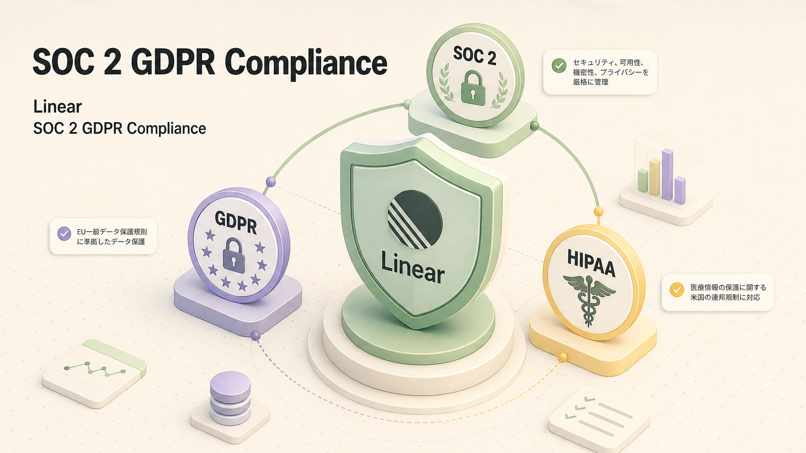

```mermaid
flowchart LR
    LIN[Linear]
    S2[SOC 2 Type II]
    GDPR[GDPR]
    HIPAA[HIPAA<br/>（BAA 個別契約）]
    LIN --> S2
    LIN --> GDPR
    LIN --> HIPAA
```

主要コンプライアンス認証取得済み。エンタープライズ要件をカバー。

**👨‍💻 エンジニアへの関係**

ClassLab. の ISMS / SOC 2 取得時に、Linear のコンプライアンス証跡を取り込み可能。

**💳 利用可能プラン**

| Free | Basic | Business | Enterprise |
|:-:|:-:|:-:|:-:|
| 利用可 (証跡共有) | 利用可 | 利用可 | 利用可 (DPA / BAA 個別交渉) |

**🏢 ClassLab. での活用**

- 中長期: ISMS / プライバシーマーク取得時に Linear の SOC 2 レポートを提出資料に。

**🔥 差別化点**

- HIPAA 対応は BAA 契約付き Enterprise で可能。

**🔍 深掘り**

- データレジデンシー: 北米中心、リクエスト次第で EU リージョン対応も検討可能（Enterprise）。

**⚠️ 注意点**

- 国内法（個人情報保護法）対応は契約書ベースで確認が必要。

---

## 5. プラン早見表（全機能 × プラン マトリクス）

| カテゴリ | 機能 | Free | Basic | Business | Enterprise |
|---|---|:-:|:-:|:-:|:-:|
| **基本** | Workspaces & Teams | 制限あり (2) | 制限あり (5) | 利用可 | 利用可 |
| | Issues | 制限あり (250) | 利用可 | 利用可 | 利用可 |
| | Cycles | 利用可 | 利用可 | 利用可 | 利用可 |
| | Projects | 利用可 | 利用可 | 利用可 | 利用可 |
| | Initiatives | 制限あり (1) | 制限あり (3) | 利用可 | 利用可 |
| | Milestones | 利用可 | 利用可 | 利用可 | 利用可 |
| | Views & Filters | 利用可 | 利用可 | 利用可 | 利用可 |
| | Custom Fields | 不可 | 不可 | 利用可 | 利用可 |
| **計画** | Roadmap | 利用可 | 利用可 | 利用可 | 利用可 |
| | Triage | 利用可 | 利用可 | 利用可 | 利用可 |
| | Templates | 制限あり | 利用可 | 利用可 | 利用可 |
| | Sub-issues / Multi-level sub-teams | 利用可 | 利用可 | 利用可 | 利用可 |
| **AI/Agent** | Linear Agent | 制限あり | 利用可 | 利用可 | 利用可 |
| | Linear for Agents (外部) | 利用可 | 利用可 | 利用可 | 利用可 |
| | Linear MCP Server | 利用可 | 利用可 | 利用可 | 利用可 |
| | Triage Intelligence | 不可 | 不可 | 利用可 | 利用可 |
| | Code Intelligence | 不可 | 不可 | 利用可 (beta) | 利用可 |
| | Automations / Agent Skills | 不可 | 不可 | 利用可 | 利用可 |
| | Deeplink to AI tools | 利用可 | 利用可 | 利用可 | 利用可 |
| **顧客/GTM** | Customer Requests | 制限あり | 利用可 | 利用可 | 利用可 |
| | Product Intelligence | 不可 | 不可 | 利用可 | 利用可 |
| | Linear Asks | 制限あり | 利用可 | 利用可 | 利用可 |
| | Asks Agent (Slack) | 不可 | 制限あり | 利用可 | 利用可 |
| | Web Forms | 不可 | 制限あり | 利用可 | 利用可 |
| **分析** | Insights | 不可 | 不可 | 利用可 | 利用可 |
| | Custom Dashboards | 不可 | 不可 | 不可 | 利用可 |
| | Pulse | 制限あり | 利用可 | 利用可 (AI) | 利用可 (AI) |
| | CSV / Sheets / Airbyte Export | 制限あり | 利用可 | 利用可 | 利用可 (Airbyte) |
| **統合** | GitHub / GitLab | 利用可 | 利用可 | 利用可 | 利用可 (GHEC) |
| | Slack / Teams | 利用可 | 利用可 | 利用可 | 利用可 |
| | Intercom / Zendesk / Front | 制限あり | 利用可 | 利用可 | 利用可 |
| | Salesforce | 不可 | 制限あり | 利用可 | 利用可 |
| | Figma / Notion / PostHog / Sentry | 利用可 | 利用可 | 利用可 | 利用可 |
| | Releases (CI/CD) | 制限あり | 利用可 | 利用可 | 利用可 |
| **API** | GraphQL API / Webhooks / SDK | 利用可 | 利用可 | 利用可 | 利用可 |
| | OAuth / Personal API Keys | 利用可 | 利用可 | 利用可 | 利用可 |
| **Mobile** | iOS / Android | 利用可 | 利用可 | 利用可 | 利用可 |
| **セキュリティ** | SSO (Google) | 利用可 | 利用可 | 利用可 | 利用可 |
| | SSO (SAML) | 不可 | 不可 | 不可 | 利用可 |
| | SCIM | 不可 | 不可 | 不可 | 利用可 |
| | 監査ログ | 不可 | 不可 | 不可 | 利用可 |
| | Issue-level sharing control | 制限あり | 利用可 | 利用可 | 利用可 |
| | SOC 2 証跡 / GDPR | 利用可 | 利用可 | 利用可 | 利用可 (BAA可) |
| | Uptime SLA | 不可 | 不可 | 不可 | 利用可 |

---

## 6. 料金体系の詳細

### 6.1 プラン別の含み枠と超過料金
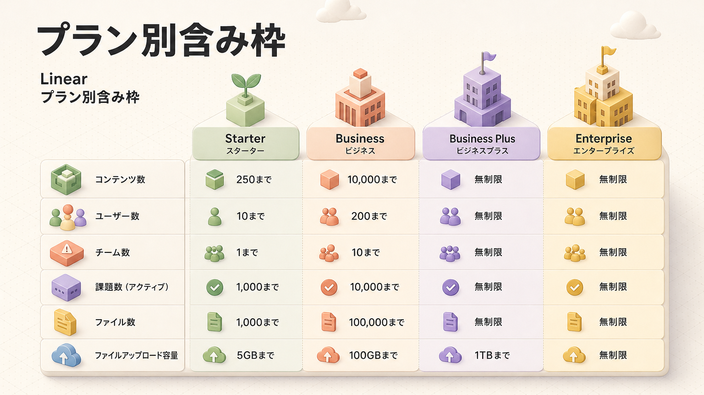

| 項目 | Free | Basic ($10/user) | Business ($16/user) | Enterprise (要見積) |
|---|---|---|---|---|
| **メンバー** | 無制限 | 無制限 | 無制限 | 無制限 |
| **チーム** | 2 | 5 | 無制限 | 無制限 |
| **Issues** | 250 | 無制限 | 無制限 | 無制限 |
| **ファイル** | 10MB | 無制限 | 無制限 | 無制限 |
| **超過時の挙動** | 上限到達でロック | — | — | 個別交渉 |

Linear は **per-seat + 機能ゲート** が基本で、生成 AI 利用に対する追加課金は現時点では設定なし。ただしヘビーユース時の将来的な追加課金リスクは認識しておくべき。

### 6.2 競合との料金構造の違い
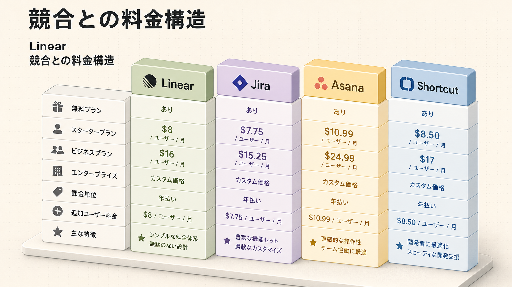

| ツール | Free | エントリ | 中位 | エンプラ | AI 機能 |
|---|---|---|---|---|---|
| **Linear** | 無制限メンバー / 250 issues / 2 teams | Basic $10 | Business $16 | 要見積 | 中位以上で AI 機能群が全部入り |
| **Jira** | 10 users まで | Standard $7.53 | Premium $13.53 | $15.25+ | Atlassian Intelligence は中位以上 |
| **Asana** | 10 users まで | Starter $10.99 | Advanced $24.99 | 要見積 | Asana Intelligence は中位以上 |
| **Shortcut** | 10 users まで | Team $8.50 | Business $12 | 要見積 | AI は限定的 |

**Linear の料金的特徴**:
- メンバー数が「無制限」（Jira/Asana は Free で 10 まで）。
- Business $16 で **Insights + AI + 無制限 Team** が全部入り → 中規模組織で最強コスパ。
- Enterprise への壁は SAML / SCIM / 監査ログという「ガバナンス要件」が中心。

### 6.3 コスト最適化の勘所
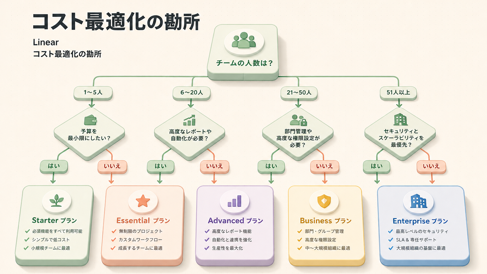

```mermaid
flowchart TD
    START([導入時点])
    Q1{ユーザー数 < 10<br/>かつ Issues < 250?}
    Q2{Team 数 < 5<br/>かつ AI 不要?}
    Q3{SAML / SCIM /<br/>監査ログ必須?}
    FREE[Free で開始]
    BASIC[Basic $10/user]
    BUS[Business $16/user]
    ENT[Enterprise 見積]

    START --> Q1
    Q1 -- Yes --> FREE
    Q1 -- No --> Q2
    Q2 -- Yes --> BASIC
    Q2 -- No --> Q3
    Q3 -- Yes --> ENT
    Q3 -- No --> BUS
```

実用ガイドライン:
- **5 人以下の試験運用**: Free で開始 → 250 issues 到達か 2 teams 必要になった時点で Basic へ。
- **10〜50 人の本格運用**: Business が標準。Insights / Triage Intelligence / Customer Requests を活用する価値あり。
- **50 人超 or 規制業種**: Enterprise 必須（実質的に SAML / SCIM が要件化する）。
- **ライフライン事業のような顧客個人情報を扱う場合**: Issue-level sharing control を厳密設定 + Enterprise 監査ログを推奨。

---

## 7. ClassLab. での活用ロードマップ（汎用例）

### 7.1 短期（〜3 ヶ月）の活用候補
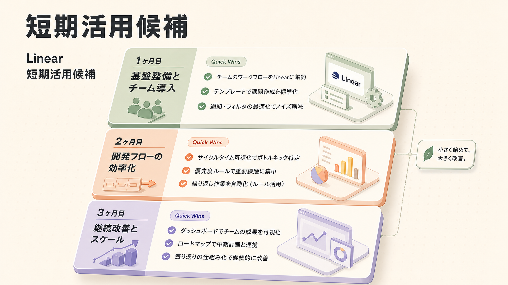

| 業務領域 | Linear 機能 | 期待効果 |
|---|---|---|
| システム事業部の Issue 集約 | Issues / Cycles / Triage | Asana / GitHub Issues に分散した開発タスクを Linear に統一、velocity 可視化 |
| ライフライン事業のサポート→開発フロー | Customer Requests (Intercom 連携) | 顧客要望が Roadmap 議論に直結 |
| コーディングエージェント実験 | Linear Agent + Claude Code (Cyrus) + MCP | 既存スキル群（雑務スキル）から Linear Issue を操作する PoC |
| 開発依頼の構造化 | Linear Asks + Asks Agent (Slack) | Slack の駆け込み依頼を Issue 化 |
| デザイン→実装ループ | Figma 連携 | デザイン更新が Issue にライブ反映 |

### 7.2 中長期（3〜12 ヶ月）の活用候補
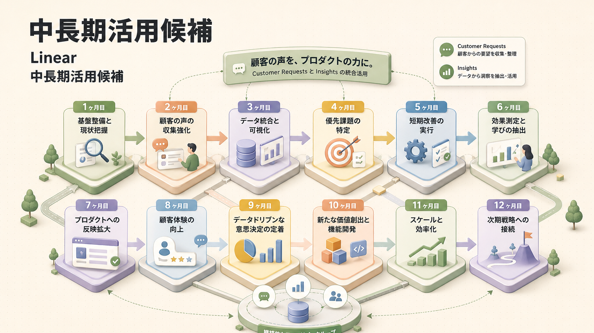

| 業務領域 | Linear 機能 | 期待効果 |
|---|---|---|
| 事業横断 Roadmap | Initiatives + Roadmap + Pulse | 経営報告と開発実態が同じツール上で同期 |
| 顧客価値ドリブンの優先度設計 | Customer Requests + Salesforce 連携 + Product Intelligence | 機能要望と売上の数値接続 |
| AI トリアージ | Triage Intelligence + Automations | PM の triage 時間を 5〜8 割削減 |
| 並列エージェント開発 | Linear for Agents + Code Intelligence | Devin / Codex / Claude Code を Issue 単位で並列実行 |
| DORA メトリクス自動計測 | Releases + Insights + Airbyte → BigQuery | Lead time / Deployment frequency / Change failure rate を Linear 起点で算出 |
| ISMS / SOC 2 対応 | 監査ログ + SSO/SAML + SCIM (Enterprise) | コンプライアンス審査での Linear 証跡を整備 |

### 7.3 既存資産の棚卸し
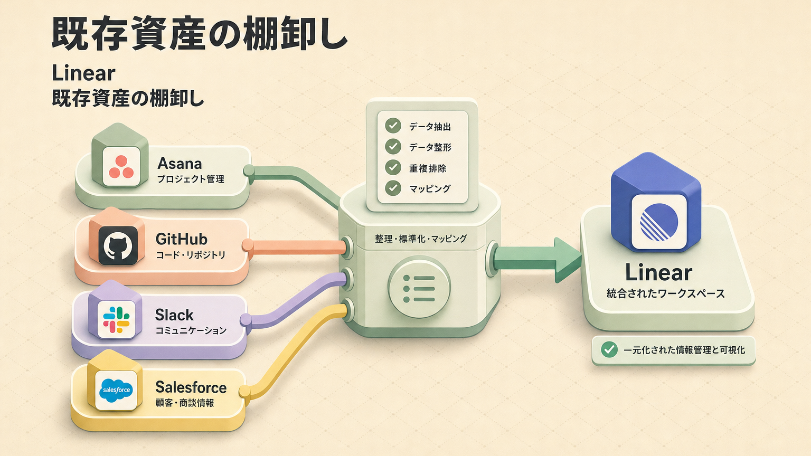

| 現在使っているもの | Linear での代替候補 | 移行判断 |
|---|---|---|
| Asana（タスク管理） | Linear Issues / Projects | 開発系は Linear へ、非開発（マーケ等）は Asana 残存も可 |
| GitHub Issues | Linear Issues | 完全移行が標準パターン |
| Slack DM 依頼 | Linear Asks + Asks Agent | 積極的に移行（依頼の見える化） |
| Sentry → Slack 通知 | Sentry → Linear Issue (Sentry Agent) | 障害対応の構造化に大きな効果 |
| Salesforce 顧客データ | Customer Requests に同期 | 営業 ↔ 開発の見える化 |
| 個別の Excel/Notion 進捗管理 | Linear Insights + Dashboards | 経営報告を Linear に一元化 |
| 雑務スキル群（Claude Code skills） | Linear MCP 経由で Linear 操作 | 自動化のハブが Linear に |

---

## 8. 採用判断フロー

### 8.1 新規プロジェクトでの選択フロー
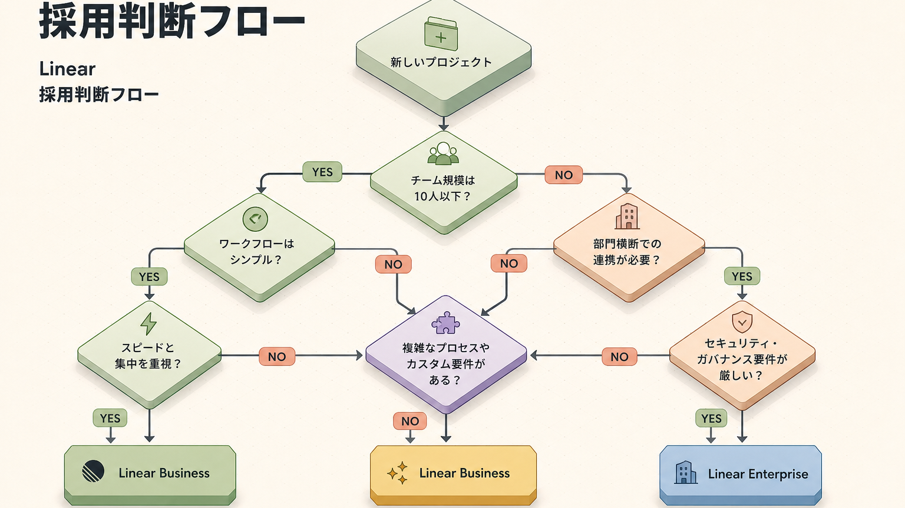

```mermaid
flowchart TD
    START([新規開発プロジェクト立ち上げ])
    Q1{チームは<br/>開発者主体?}
    Q2{AI/Agent 活用を<br/>積極的に進めたい?}
    Q3{50 人超 or<br/>規制業種?}
    Q4{既存 Jira/Asana<br/>からの移行コスト<br/>許容できる?}
    LINEAR_BUS[Linear Business 採用]
    LINEAR_ENT[Linear Enterprise 採用]
    JIRA[Jira 継続/採用]
    ASANA[Asana 継続/採用]
    HYBRID[Linear + 既存ツール並走]

    START --> Q1
    Q1 -- Yes --> Q2
    Q1 -- No --> ASANA
    Q2 -- Yes --> Q3
    Q2 -- No --> Q4
    Q3 -- Yes --> LINEAR_ENT
    Q3 -- No --> LINEAR_BUS
    Q4 -- Yes --> LINEAR_BUS
    Q4 -- No --> HYBRID

    style LINEAR_BUS fill:#2a5a3a,color:#fff
    style LINEAR_ENT fill:#1e3a5f,color:#fff
    style JIRA fill:#5a4a2a,color:#fff
    style ASANA fill:#5a2a5a,color:#fff
    style HYBRID fill:#3a3a3a,color:#fff
```

### 8.2 採用適性 Quadrant
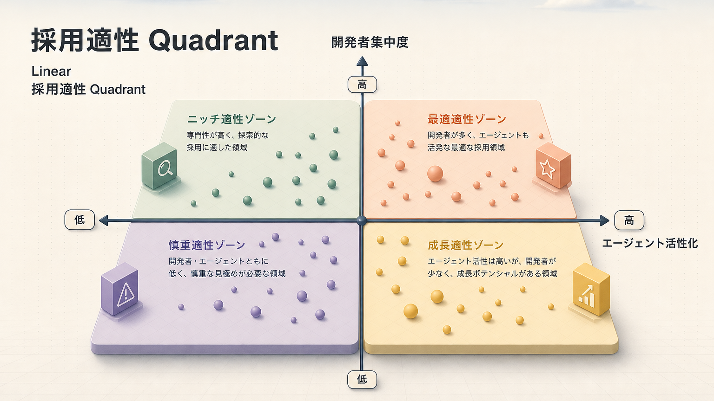

```mermaid
quadrantChart
    title Linear が刺さる組織の Quadrant
    x-axis "開発者集中度" --> "高（エンジニア比率高）"
    y-axis "Agent 活用度" --> "高（AI/エージェント駆動志向）"
    quadrant-1 "Linear が圧倒的に最適"
    quadrant-2 "Linear or Shortcut"
    quadrant-3 "Asana が無難"
    quadrant-4 "Jira が無難"
    "ClassLab. システム事業部": [0.78, 0.82]
    "ClassLab. ライフライン事業": [0.62, 0.55]
    "OpenAI/Vercel等の対象顧客像": [0.92, 0.95]
    "従来型 SIer": [0.45, 0.25]
    "大手 SaaS": [0.7, 0.6]
    "プロダクトファースト Startup": [0.85, 0.85]
```

**読み方**:
- 右上（開発者集中 + Agent 活用志向）: Linear が最適解。
- 左上（非エンジニア中心 + Agent 志向）: Linear / Shortcut。
- 左下（非エンジニア中心 + Agent 不要）: Asana。
- 右下（開発者中心だが Agent 不要）: Jira（既存資産がある場合）。

**ClassLab. の位置**:
- システム事業部: 右上に位置し Linear Business〜Enterprise が最適解。
- ライフライン事業: 中央寄りで、Linear 採用は十分妥当（特に Customer Requests 機能の親和性）。

---

## 9. 公式リファレンス & Sources

### 公式ドキュメント

- Linear トップ: https://linear.app/
- Features 一覧: https://linear.app/features
- Pricing: https://linear.app/pricing
- Concepts (概念モデル): https://linear.app/docs/conceptual-model
- Projects: https://linear.app/docs/projects
- Changelog: https://linear.app/changelog
- Insights: https://linear.app/insights
- Customer Requests: https://linear.app/customer-requests
- Agents Integrations: https://linear.app/integrations/agents
- Claude Integration: https://linear.app/integrations/claude
- Code Intelligence (2026-05-14): https://linear.app/changelog/2026-05-14-code-intelligence
- Releases (2026-04-30): https://linear.app/changelog/2026-04-30-releases

### Linear MCP / Developer

- Linear MCP Server: `https://mcp.linear.app/mcp`
- Linear SDK: `@linear/sdk` (npm)
- Linear CLI for AI Agents: https://composio.dev/toolkits/linear/framework/cli
- Linear MCP for Codex: https://composio.dev/toolkits/linear/framework/codex
- Composio Linear Toolkit: https://composio.dev/toolkits/linear
- mcpservers.org Linear エントリ: https://mcpservers.org/servers/tacticlaunch/mcp-linear

### 第三者レビュー / 比較記事（2026 年）

- Linear Pricing 2026 (Quackback): https://quackback.io/blog/linear-pricing
- Linear Pricing (Costbench): https://costbench.com/software/developer-tools/linear/
- Linear Pricing (AI Productivity): https://aiproductivity.ai/blog/linear-pricing/
- Linear vs Jira vs Asana (IdeaPlan): https://www.ideaplan.io/compare/jira-vs-linear-vs-asana
- Linear vs Shortcut (IdeaPlan): https://www.ideaplan.io/compare/linear-vs-shortcut
- Linear vs Asana (alfred): https://get-alfred.ai/compare/linear-vs-asana
- Linear vs Jira (monday.com): https://monday.com/blog/rnd/linear-or-jira/
- Plane vs Linear: https://plane.so/blog/plane-versus-linear-which-should-you-choose-in-2026
- Linear App Complete Guide: https://productivitystack.io/guides/linear-app-complete-guide/
- Linear Setup Best Practices (Morgen): https://www.morgen.so/blog-posts/linear-project-management

### 創業者 / 哲学

- Karri Saarinen's 10 Rules (Figma Blog): https://www.figma.com/blog/karri-saarinens-10-rules-for-crafting-products-that-stand-out/
- Inside Linear (First Round Review): https://review.firstround.com/podcast/inside-linear-why-craft-and-focus-still-win-in-product-building/
- Karri Saarinen (Accel Podcast): https://www.accel.com/podcast-episodes/how-linears-karri-saarinen-is-redefining-what-scale-looks-like
- Crafting Excellence (Medium): https://medium.com/design-bootcamp/crafting-excellence-how-linears-ceo-builds-products-that-stand-out-5527c113fe03

### AI / Agent エコシステム関連

- Best AI Coding Agents 2026 (Blink): https://blink.new/blog/best-ai-coding-agents-2026
- Multi-Agent Orchestration 2026 (Scopir): https://scopir.com/posts/multi-agent-orchestration-parallel-coding-2026/
- Adopt AI Linear: https://www.adopt.ai/apps/linear
- daily.dev: How we built a Linear coding agent: https://daily.dev/blog/how-we-built-a-linear-coding-agent-the-hard-parts/

### 社内ドキュメント参照（取得不可だったが想定タイトル）

- linear-deep-dive-2026-05-01
- agent-first-workflow-2026-05-01
- linear-pricing-2026-05-01
- enterprise-harness-design-v3
- linear-scrum-guide

> 上記 5 ドキュメントは MarkdownViewer 2.0 の動的レンダリングのため本カタログ作成時には本文取得不可。社内で取得可能になった時点で本カタログとの差分マージを推奨。

---

> 本カタログは 2026-05 時点の Linear 公式情報および第三者レビュー記事から再構成したものであり、Linear の機能・料金は今後変更される可能性があります。実際の採用判断時は公式ドキュメントの最新版を参照してください。

---

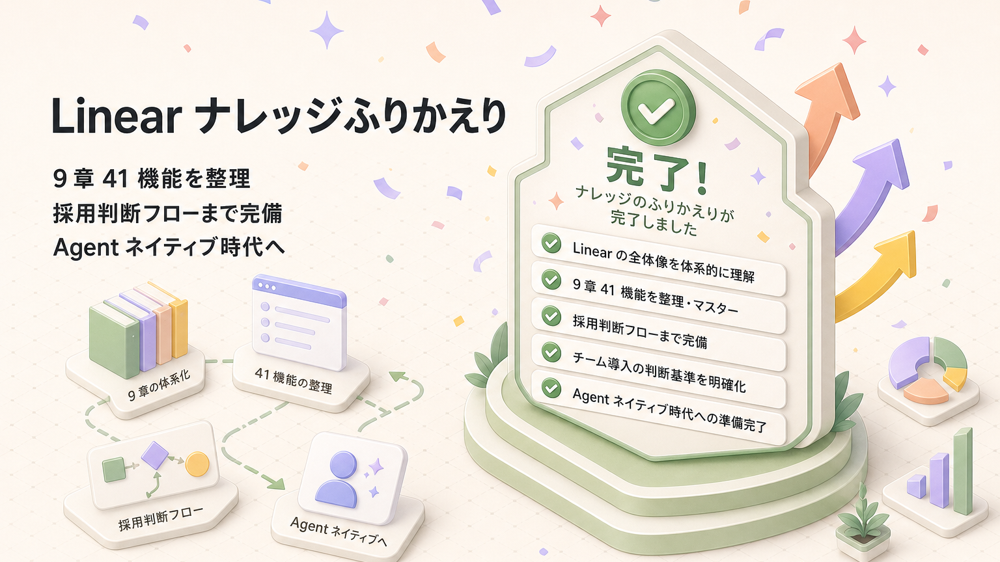
