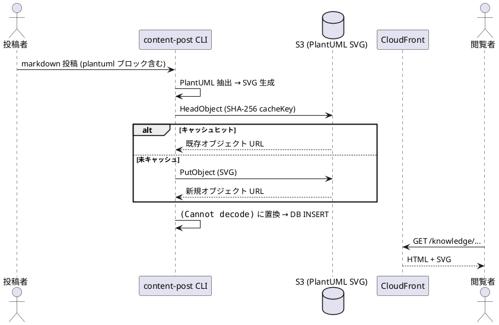
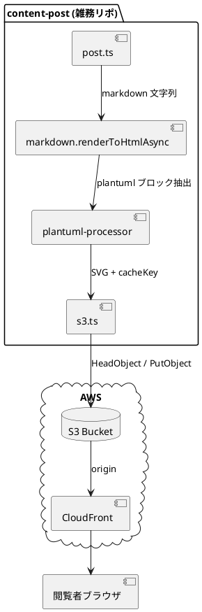

# PlantUML を社内ドキュメントに埋め込む — レンダリングパイプラインと使い方

## 1. なぜ PlantUML を採用したか

社内ドキュメントで図を扱うとき、画像ファイル (PNG / JPG) を貼ると次の問題が起きます。

- レビュー時に差分が読めない (バイナリ diff になる)
- 修正のたびに描画ツールを開き直す必要がある
- 図と本文が乖離しても気付かない

PlantUML はテキストで図を記述するため、Git で diff が取れて Pull Request 上でレビューでき、本文と一緒にバージョン管理できます。Weekly News サイトでは markdown ブロックに書いた PlantUML を投稿時に SVG へ変換し、CDN 経由で配信します。

## 2. 使い方

markdown 内で `plantuml` 言語タグの fenced code block を書くだけです。投稿パイプラインが自動で SVG に変換し、`` として本文に埋め込みます。

`@startuml` / `@enduml` は必須です。テーマ指定 (`!theme`) は通常書く必要はありません — 後述のとおり blueprint テーマが自動で注入されます。

## 3. 対応している図種

PlantUML がサポートする全種類の図に対応しています。シーケンス図・クラス図・アクティビティ図・コンポーネント図・デプロイ図・ステート図・ユースケース図など、いずれもそのまま `plantuml` ブロックに書けば描画されます。

例として、本投稿パイプライン自体の依存関係をコンポーネント図で示します。

シーケンス図は時系列のメッセージ授受、コンポーネント図はモジュール間の責務と依存関係の可視化に向いています。用途に応じて使い分けてください。

## 4. 裏側の仕組み

投稿時のパイプラインは次のとおりです。

1. `post.ts` が markdown を読み込み、`renderToHtmlAsync` を呼び出す
2. `plantuml-processor` が `plantuml` fenced block を抽出し、ソースの SHA-256 を計算
3. SHA-256 を cacheKey として S3 に `HeadObject` を投げる (冪等性チェック)
4. 未キャッシュの場合のみ、PlantUML 公開サーバーで SVG を生成して `PutObject`
5. 該当ブロックを `` に置換

ユーザーが `!theme` を明示しない場合は blueprint テーマを自動注入します。明示した場合はユーザー指定が優先されます。cacheKey はソース文字列のハッシュなので、同じ図を複数記事で書いても 1 オブジェクトに収束します。

## 5. 執筆時の注意

- 1 ブロックあたり最大 100,000 文字まで。それ以上は描画前に拒否されます
- ソースに `<script>` を含む場合は XSS guard で拒否されます (PlantUML から SVG が出る前段で弾く)
- 図のテキストを変更すると SHA が変わり、新しい SVG オブジェクトが S3 に生成されます。CloudFront の invalidation は不要です (古い URL を参照する記事は古い図のまま、新しい記事は新しい図を参照します)
- 改行や空白の差で SHA が変わるため、不要な編集はキャッシュ効率を下げます

## 6. トラブルシュート

レンダリングに失敗した場合、該当ブロックは元の `<pre>` ソースのまま本文に残ります。HTML コメントで失敗理由 (タイムアウト・構文エラーなど) が埋め込まれるので、ブラウザの開発者ツールで `<!-- plantuml render failed: ... -->` を検索してください。多くの場合は `@enduml` の閉じ忘れ、または不正な構文 (`!theme` の typo など) が原因です。
