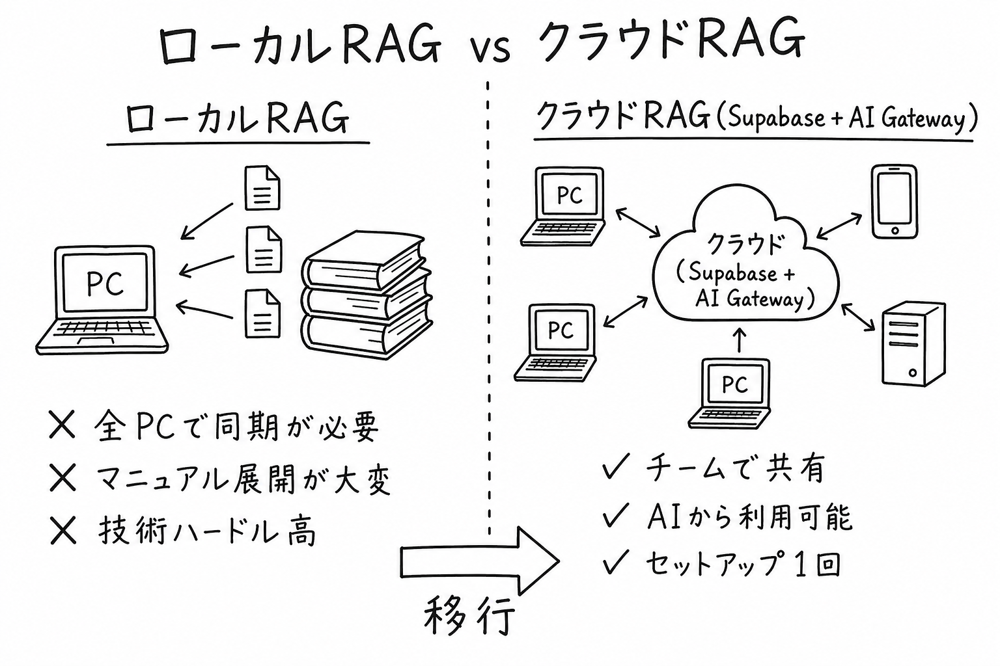
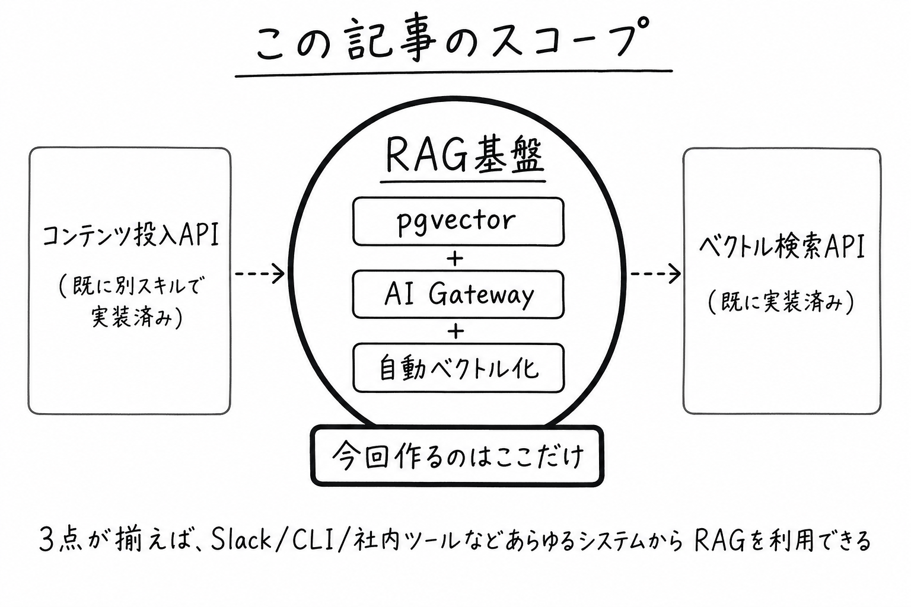
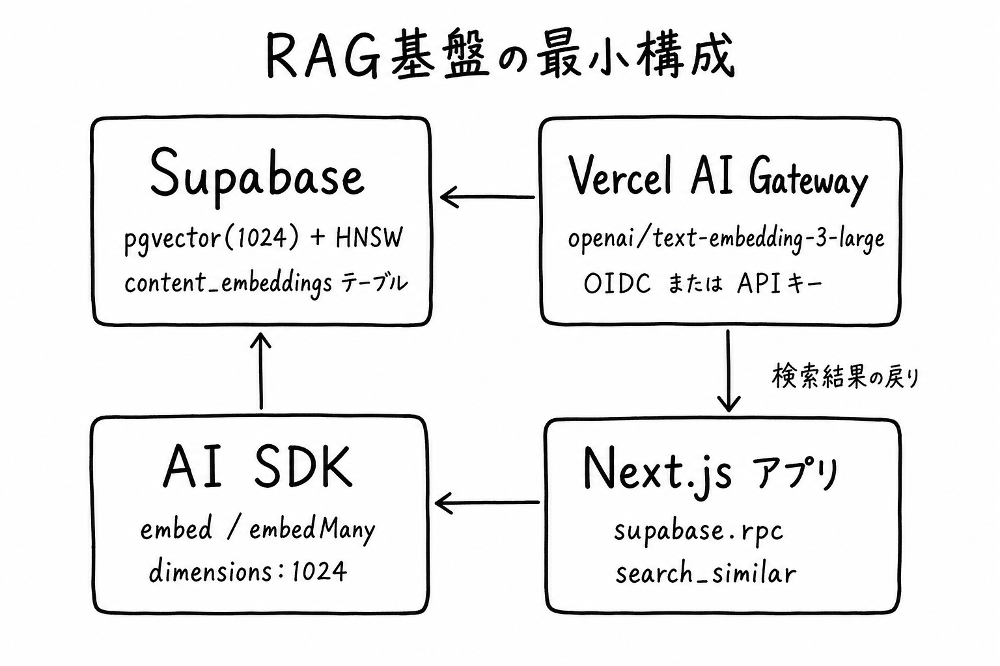
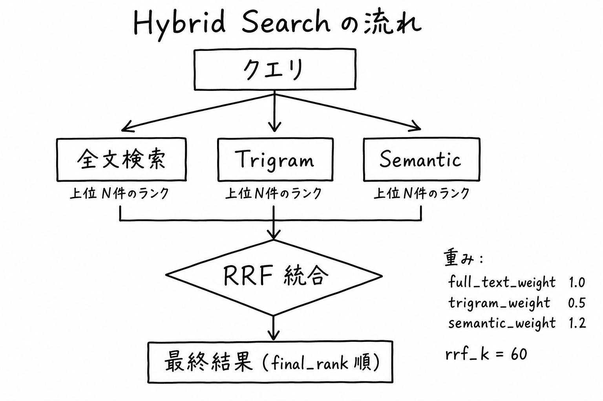
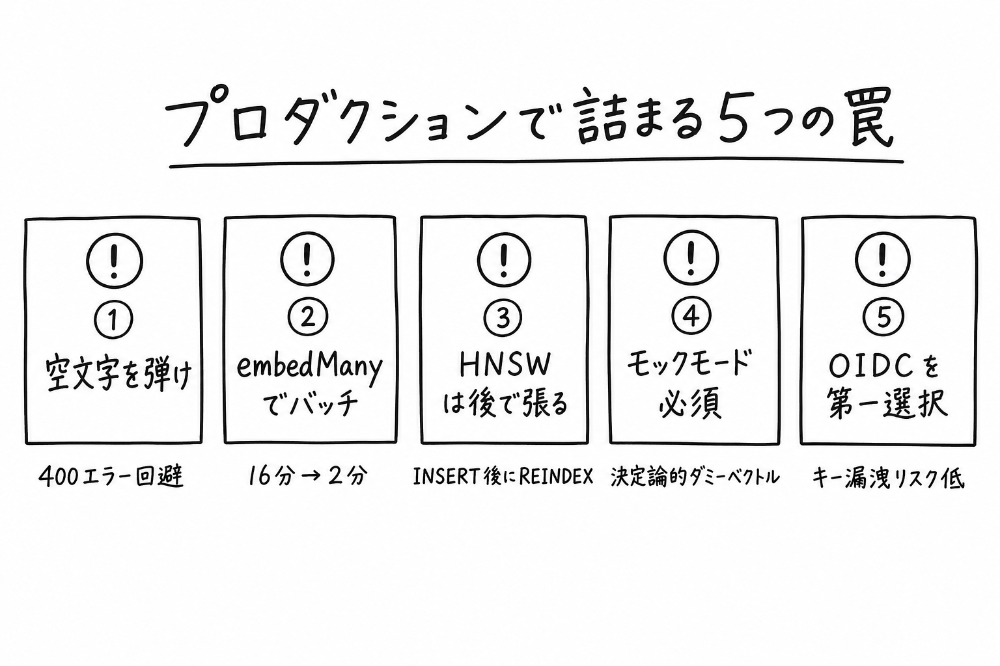

**対象**: 自社プロダクトに RAG（Retrieval-Augmented Generation）を載せたいが、ベクトル DB / 埋め込み API / 検索ロジックの選定で詰まっているエンジニア
**ゴール**: Supabase + Vercel AI Gateway + AI SDK の **3 点だけで RAG の最小実装を完成** させ、その上で Hybrid Search にスケールできるようにする
**この記事の元実装**: [ClassLab Weekly News](https://classlab-weekly-news.vercel.app) の本番 RAG パイプライン

> **RAG の概念から押さえたい人へ:** 「そもそも RAG って何？」「Fine-tuning や Long Context との違いは？」を整理した姉妹記事を先に読むのを推奨します → [RAG という技術について今更解説する](https://classlab-weekly-news.vercel.app/articles/rag-tech-explained-now)

---

## 0. やろうと思ったきっかけ — ローカル RAG の限界

最初は **個人の手元（ローカル）** で RAG を組んでいました。VS Code の拡張やローカル LLM に手元の資料を食わせて検索させる、というアレです。**個人の開発生産性は確かに上がる**。コードの引用元を秒で持ってきてくれるし、ググる時間も減る。

ただ、**チームで AI を介して RAG を使う段になると、ローカル構成は破綻します**。



ローカル運用の主なハードル:

- **全 PC で同じインデックスを同期する手間** — 誰かが資料を更新した瞬間にズレる
- **マニュアル展開がだるい** — 「これ入れてあのコマンド叩いて〜」を全員にやらせるのは現実的じゃない
- **技術ハードルが高い** — エンジニアでない職種（営業・サポート）には到底配れない
- **AI 連携が個人の手元に閉じる** — 社内 Slack ボットや業務ツールから叩けない

「**チームで使う**」を満たすには、結局 **RAG をクラウド側に置いて、誰もが API 1 本で叩ける状態** にするしかない、というのが本記事の出発点です。

---

## 1. この記事のスコープ — 作るのは「基盤」だけ

最初に切り分けておきたいのが **「RAG って何を作ればいいの？」** です。RAG は単一のものではなく、最低 3 つの責務に分かれています。



| # | 責務 | この記事 | 既存実装 |
|---|---|---|---|
| 1 | **コンテンツ投入 API**（資料 → DB） | ❌ 対象外 | 別スキルで実装済み |
| 2 | **RAG 基盤**（自動ベクトル化 / 検索インフラ） | ✅ **本記事** | classlab-weekly-news 本番 |
| 3 | **ベクトル検索 API**（クエリ → 関連コンテンツ） | ❌ 対象外 | 別スキルで実装済み |

**本記事が作るのは「2. RAG 基盤」だけ** です。「コンテンツを投入したら自動でベクトル化されて、検索できる状態になる」という **下回り** に集中します。

なぜ基盤だけに絞るかというと、

- 投入 API と検索 API は **業務要件によって形が変わる**（CSV 一括 / Webhook / 管理画面手入力 / Slack スラッシュコマンド…）
- 基盤さえ汎用に作っておけば、**投入 API と検索 API を後から好きな形で生やせる**
- **「基盤 + 投入 + 検索」の 3 つが揃えば、Slack ボット・CLI・社内ツール・Chrome 拡張などあらゆるシステムから AI 経由で同じ RAG を呼べる**

逆に言えば、3 点セットの中で **基盤だけが「全システム共通」** で、残り 2 点はそれぞれの用途ごとに何度でも実装することになる。だからまず基盤を最短で立てて、後段に投資できる体力を残しておく — これが今回の戦略です。

---

## 2. なぜ「Supabase + Vercel AI Gateway」なのか

RAG をゼロから組むときに迷う点はおおむね 3 つに集約されます。

1. **ベクトル DB を何にするか**（Pinecone / Weaviate / Qdrant / pgvector / …）
2. **埋め込み API のキー管理をどう一元化するか**（OpenAI / Cohere / Voyage / …）
3. **検索ロジックをどう作るか**（純ベクトル / ハイブリッド / リランキング）

この 3 つに対して、**Supabase（pgvector + RLS + RPC）** と **Vercel AI Gateway（プロバイダ統合 + キー一元化）** を組み合わせると、それぞれ「PostgreSQL の延長」「1 本のキー」で全部解ける。**インフラを増やさず、既存の Next.js + Postgres スタックの中で完結する** のが最大のメリットです。

Vercel AI Gateway 自体については別ナレッジで詳しく書いています:

[Vercel AI Gateway とは — 1 本のキーで全 AI プロバイダを横断できる統一ゲートウェイ](https://classlab-weekly-news.vercel.app/knowledge/vercel-ai-gateway-unified-access)

---

## 1. 全体アーキテクチャ

最小構成は次の 4 コンポーネントだけで成立します。



| 層 | 採用技術 | 役割 |
|---|---|---|
| ベクトルストア | **Supabase pgvector(1024) + HNSW** | 埋め込み保存と近似最近傍検索 |
| 埋め込み生成 | **Vercel AI Gateway → openai/text-embedding-3-large** | テキスト → 1024 次元ベクトル |
| クライアント SDK | **AI SDK v6 の `embed` / `embedMany`** | TS / Next.js から呼び出し |
| 検索インターフェース | **Postgres RPC（search_similar / search_hybrid）** | DB 内で完結する検索ロジック |

ポイントは **「アプリ側ではベクトル計算を一切しない」** こと。すべて DB の RPC に押し込み、アプリ側は `supabase.rpc("search_similar", { query_embedding })` を呼ぶだけにする。これが最短で、かつ後から RLS / リランキング / Recency Boost を足せる構造です。

---

## 2. 最短セットアップ（5 ステップ）

ここから写経で動くレベルまで落とした手順です。

### Step 1. Supabase で pgvector を有効化

Supabase ダッシュボード → Database → Extensions で `vector` と `pg_trgm`（後の hybrid 検索で使う）を有効化。

```sql
CREATE EXTENSION IF NOT EXISTS vector;
CREATE EXTENSION IF NOT EXISTS pg_trgm;
```

### Step 2. `content_embeddings` テーブルを作る

実運用は **「コンテンツ本体テーブル」と「embedding テーブル」を分ける** のが扱いやすい。再生成・モデル切替・複数ベクトル並存（粒度違い）に効きます。

```sql
CREATE TABLE content_embeddings (
  id UUID PRIMARY KEY DEFAULT gen_random_uuid(),
  content_type TEXT NOT NULL CHECK (content_type IN ('issue','article','knowledge')),
  content_id UUID NOT NULL,
  embedding VECTOR(1024) NOT NULL,
  model TEXT NOT NULL DEFAULT 'text-embedding-3-large',
  created_at TIMESTAMPTZ DEFAULT now(),
  UNIQUE (content_type, content_id, model)
);

-- HNSW インデックス（cosine 距離）
CREATE INDEX idx_embeddings_vector ON content_embeddings
  USING hnsw (embedding vector_cosine_ops);
```

> **なぜ 1024 次元？** OpenAI `text-embedding-3-large` のデフォルト 3072 次元はストレージと検索コストが重い。AI SDK の `providerOptions.openai.dimensions: 1024` で **品質をほぼ落とさず ストレージ 1/3、レイテンシ 1/2** にできる。実運用ではこちらが標準。

### Step 3. Vercel AI Gateway を設定（OIDC 認証を第一選択に）

**本番は OIDC トークン自動発行を使うのが推奨**。Vercel プロジェクトで AI Gateway を有効化すれば、デプロイ環境では `VERCEL_OIDC_TOKEN` が自動注入されるので、**API キーをコードや env に置かない** 運用ができます（手動ローテ不要・漏洩リスク低）。

ローカルは `vercel env pull` で OIDC トークンを取り込むだけで、本番と同じコードパスを再現できます。

```bash
# 本番: Vercel が VERCEL_OIDC_TOKEN を自動付与（何もしなくて良い）
# ローカル:
vercel link
vercel env pull
```

長寿命キー運用が必要な場合（CI 外部 / オンプレ Worker など）に限り、`AI_GATEWAY_API_KEY` を発行して使う。手動ローテが必要な点を理解した上で。

これで OpenAI / Anthropic / Google / Cohere ほか **どのプロバイダも `provider/model` 形式の文字列だけで呼べる** ようになる（詳細は [Vercel AI Gateway ナレッジ](https://classlab-weekly-news.vercel.app/knowledge/vercel-ai-gateway-unified-access)）。

### Step 4. AI SDK で embedding を生成して INSERT

`ai` パッケージの `embed` / `embedMany` を使う。本番では **`embedMany` でバッチ生成** することで 10,000 件規模のリビルドが **16 分 → 2 分** まで縮みます。

```ts
// src/lib/embedding.ts
import { embed, embedMany } from "ai";

const MODEL = "openai/text-embedding-3-large";
const DIMENSIONS = 1024;

export async function generateEmbedding(text: string): Promise<number[]> {
  const safe = sanitize(text);
  if (!safe) throw new Error("empty input after sanitize");

  const { embedding } = await embed({
    model: MODEL,
    value: safe,
    providerOptions: {
      openai: { dimensions: DIMENSIONS },
    },
  });
  return embedding;
}

export async function generateEmbeddings(
  texts: string[],
): Promise<(number[] | null)[]> {
  const valid: { idx: number; text: string }[] = [];
  texts.forEach((t, idx) => {
    const safe = sanitize(t);
    if (safe) valid.push({ idx, text: safe });
  });
  if (valid.length === 0) return texts.map(() => null);

  const { embeddings } = await embedMany({
    model: MODEL,
    values: valid.map((v) => v.text),
    providerOptions: {
      openai: { dimensions: DIMENSIONS },
    },
  });

  // 入力順を維持（空入力位置は null）
  const result: (number[] | null)[] = texts.map(() => null);
  valid.forEach((v, i) => {
    result[v.idx] = embeddings[i];
  });
  return result;
}

function sanitize(text: string | null | undefined): string | null {
  if (!text) return null;
  const trimmed = text.trim();
  if (trimmed.length === 0) return null;
  // text-embedding-3-large の上限 8192 tokens ≒ 6000 文字で truncate
  return trimmed.length > 6000 ? trimmed.slice(0, 6000) : trimmed;
}
```

INSERT 側はシンプル:

```ts
const embedding = await generateEmbedding(article.body);

await supabase.from("content_embeddings").upsert({
  content_type: "article",
  content_id: article.id,
  embedding,
  model: "text-embedding-3-large",
}, { onConflict: "content_type,content_id,model" });
```

### Step 5. 検索 RPC を 1 本だけ作る（純ベクトル検索）

「クエリ → ベクトル化 → 近傍検索」の最小実装は次の 1 本で完結します。

```sql
CREATE OR REPLACE FUNCTION search_similar(
  query_embedding vector(1024),
  match_count INTEGER DEFAULT 10,
  filter_type TEXT DEFAULT NULL
)
RETURNS TABLE (
  id UUID,
  content_type TEXT,
  content_id UUID,
  similarity REAL
)
LANGUAGE SQL STABLE AS $$
  SELECT
    ce.id,
    ce.content_type,
    ce.content_id,
    (1 - (ce.embedding <=> query_embedding))::REAL AS similarity
  FROM content_embeddings ce
  WHERE (filter_type IS NULL OR ce.content_type = filter_type)
  ORDER BY ce.embedding <=> query_embedding
  LIMIT match_count;
$$;
```

アプリ側からの呼び出し:

```ts
const queryEmbedding = await generateEmbedding(userQuery);

const { data } = await supabase.rpc("search_similar", {
  query_embedding: queryEmbedding,
  match_count: 10,
  filter_type: "knowledge",
});
```

**ここまでで RAG の検索層は完成**。あとは取得した `content_id` で本体テーブルを JOIN し、LLM にプロンプトとして渡すだけ。

---

## 3. 上級編 — Hybrid Search（Full-text + Trigram + Semantic を RRF で統合）

純ベクトル検索だけだと **「キーワード一致を取りこぼす」「短い固有名詞に弱い」** という弱点があります。実運用では 3 つの検索手法を **Reciprocal Rank Fusion（RRF）** で統合するのが定番。



| 手法 | 強み | 弱み |
|---|---|---|
| Full-text 検索 (`tsvector`) | 完全一致・形態素 | 表記ゆれに弱い |
| Trigram (`pg_trgm`) | 表記ゆれ・部分一致 | 意味は取れない |
| Semantic (`pgvector`) | 意味的類似 | 短いクエリに弱い |

RRF の式は:

```text
final_rank(d) = Σ weight_i / (rrf_k + rank_i(d))
```

各手法で取った上位 N 件の順位の逆数に重みをかけて合算。**重みとパラメータを env で動かせる** ようにすると A/B テストが楽になります。

```sql
CREATE OR REPLACE FUNCTION search_hybrid(
  query_text TEXT,
  query_embedding vector(1024),
  match_count INTEGER DEFAULT 20,
  full_text_weight REAL DEFAULT 1.0,
  trigram_weight REAL DEFAULT 0.5,
  semantic_weight REAL DEFAULT 1.2,
  rrf_k INTEGER DEFAULT 60
) RETURNS TABLE (...) ...
-- 全文 / trigram / semantic それぞれの CTE を組み、
-- RRF で final_rank を計算して ORDER BY で返す
```

ClassLab Weekly News では、ここに **Recency Boost（公開日からの減衰）** と **Sem Rank Min（低類似度の足切り）** を加えた本番 RPC `search_hybrid` を運用しています。それでも基本パターンは上記の通りで、最初は `search_similar` だけで始め、必要になってから hybrid に拡張するのが最短ルートです。

---

## 4. プロダクションで詰まりやすい 5 点

ここまでのコードは「動く最小実装」ですが、本番投入時に **黙って失敗する** 罠があります。最初から組み込んでおくと事故が消えます。



### 4-1. 空文字・空白だけの入力は事前に弾く

`text-embedding-3-large` は **空文字 / 空白だけの入力で 400 を返します**。バッチで混ざると全部失敗するので、`embedMany` 前に必ず `sanitize()` でフィルタ。空入力位置は **null を返す API 設計** にすると上流が壊れません（Step 4 のコード参照）。

### 4-2. 大量再生成は必ず `embedMany`

逐次 `embed()` だと 10,000 件で **16 分**、`embedMany` だと **2 分**。キャッシュ層と組み合わせれば再生成の本数自体も減らせます。

### 4-3. HNSW のリビルドタイミング

`CREATE INDEX ... USING hnsw` は大量 INSERT の **後に張る** か、INSERT 完了後に `REINDEX` を打つほうが速い。途中で張ると挿入が遅くなります。次元変更（1536 → 1024 など）も先に index を `DROP` してから `ALTER COLUMN` する必要あり。

### 4-4. ローカル / CI 用のモックモード

Supabase URL も AI Gateway キーもない環境（ユニットテスト / プレ PR CI）では **決定論的なダミーベクトル** を返すモック層を用意すると外部依存ゼロでテストできます。

```ts
function isMockEmbeddingMode(): boolean {
  return (
    !process.env.NEXT_PUBLIC_SUPABASE_URL &&
    !process.env.AI_GATEWAY_API_KEY &&
    !process.env.VERCEL_OIDC_TOKEN
  );
}
```

入力テキストのハッシュからシードを作って `1024` 次元の単位ベクトルを返せば、**同じテキスト → 同じベクトル** が保証され、検索テストが安定します。

### 4-5. OIDC 認証は Vercel 上で勝手に動く

Vercel 上で動かす場合 `AI_GATEWAY_API_KEY` を **そもそも設定する必要がない**。OIDC トークンが自動で付与されるので、本番でキー漏洩のリスクが消えます。ローカルだけ `vercel env pull` で OIDC トークンを取得しておけば、開発と本番で同じコードパスが走ります。

---

## 5. まとめ — 最短 RAG のチェックリスト

- [x] **Supabase**: `vector` + `pg_trgm` 拡張、`content_embeddings(VECTOR(1024))` + HNSW インデックス
- [x] **Vercel AI Gateway**: `AI_GATEWAY_API_KEY`（または OIDC）、モデル文字列 `openai/text-embedding-3-large`
- [x] **AI SDK**: `embed` / `embedMany`、`providerOptions.openai.dimensions: 1024`、`sanitize()` で空文字除外
- [x] **検索**: まず `search_similar` 1 本で開始、必要になってから RRF Hybrid に拡張
- [x] **モック層**: env 未設定時は決定論的ダミーベクトルでテストを通す

ここまでが **「インフラを増やさず、Next.js + Postgres スタックの中で完結する RAG」** の最小形です。Pinecone も Weaviate も Qdrant も追加しない。**既存の Supabase に列を 1 つ足すだけ** で立ち上がるのが、このスタックの一番強いところです。

---

## 関連記事

- [RAG という技術について今更解説する — 検索 + 生成のハイブリッドが LLM のハルシネーションを潰す仕組み](https://classlab-weekly-news.vercel.app/articles/rag-tech-explained-now) — 本記事の前に読むと「なぜ RAG なのか」「Fine-tuning や Long Context との違い」が整理できる姉妹記事
- [Vercel AI Gateway とは — 1 本のキーで全 AI プロバイダを横断できる統一ゲートウェイ](https://classlab-weekly-news.vercel.app/knowledge/vercel-ai-gateway-unified-access) — 本記事の埋め込みも生成も同じゲートウェイで叩ける仕組み

## Sources

- 元実装: [ClassLab Weekly News](https://classlab-weekly-news.vercel.app)
- [Supabase pgvector ドキュメント](https://supabase.com/docs/guides/ai)
- [Vercel AI Gateway ドキュメント](https://vercel.com/docs/ai-gateway)
- [AI SDK — embed / embedMany](https://sdk.vercel.ai/docs/reference/ai-sdk-core/embed)
- [OpenAI text-embedding-3-large](https://platform.openai.com/docs/guides/embeddings)
- [Reciprocal Rank Fusion (RRF) - Microsoft Research](https://www.microsoft.com/en-us/research/publication/reciprocal-rank-fusion-outperforms-condorcet-and-individual-rank-learning-methods/)
