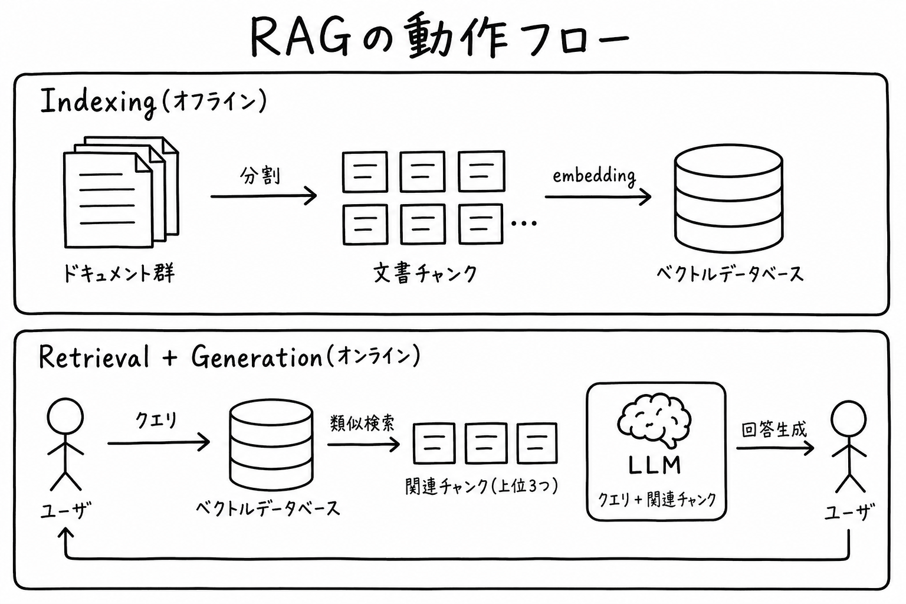
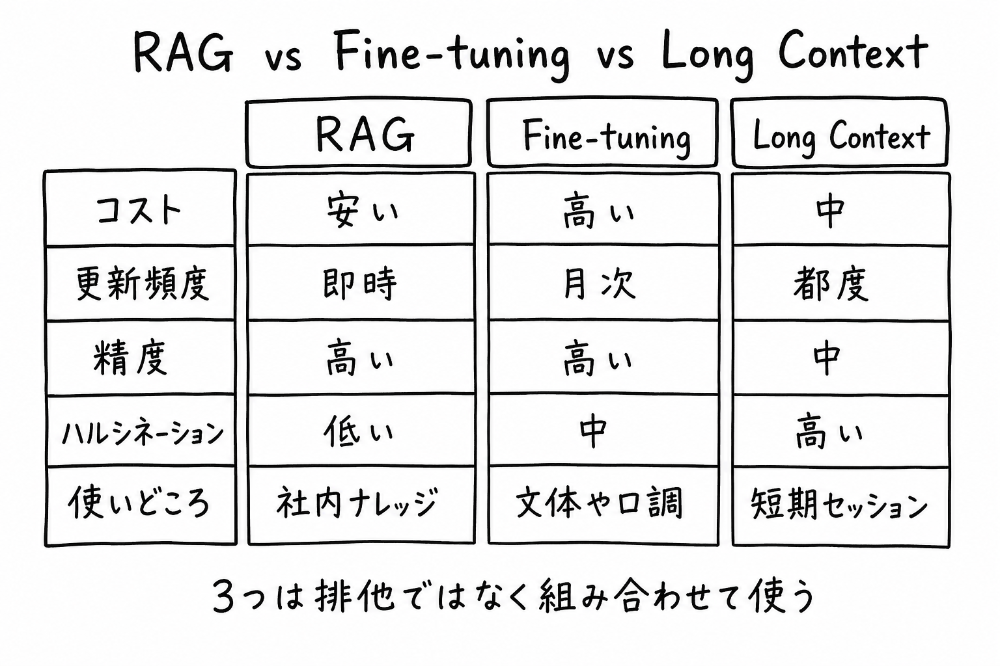
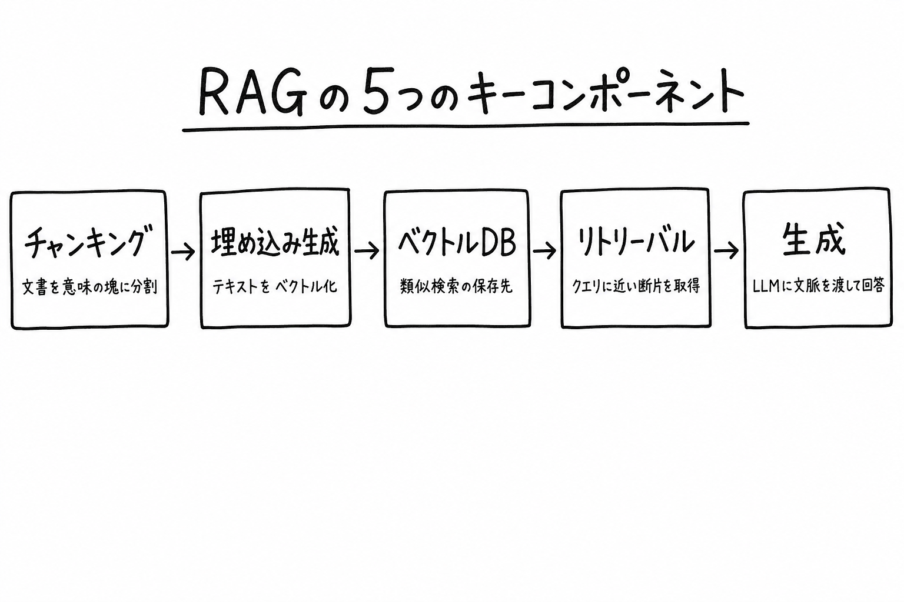

**対象**: LLM をプロダクトに組み込みたいが、「RAG ってよく聞くけど結局何がうれしいの？」を一回ちゃんと整理したいエンジニア / 非エンジニア
**ゴール**: RAG が解いている問題、動作の 2 段階フロー、Fine-tuning や Long Context との使い分けを **図 3 枚で説明できる状態** にする
**実装の最短手順**: [Supabase + Vercel AI Gateway で RAG 基盤を最短で構築する](https://classlab-weekly-news.vercel.app/articles/rag-foundation-supabase-vercel-ai-gateway)

---

## 0. なぜ「今更」解説するのか

「RAG」という単語が SNS に溢れ出して 2 年以上経ちます。**なんとなく雰囲気で使ってる人** と **業務に載せ切った人** の差がそろそろ大きくなってきました。

差を分けるのは派手な手法ではなく、**「なぜ RAG なのか」「いつ RAG じゃないのか」を区別できているか** だけです。本記事はその境界線を、コードを書かずに腰を据えて整理します。実装は別記事に切り出してあるので、概念を掴んだあとそちらに進めば手が止まりません。

---

## 1. RAG とは何か — 1 行でいうと

> **RAG = 「LLM が答える前に、関連する社内ドキュメントを引っ張ってきてプロンプトに混ぜる」仕組み**

それだけ。`Retrieval-Augmented Generation`（検索で増強された生成）の頭文字で、2020 年に Meta（当時 Facebook AI Research）が論文化したパターンです。

LLM は学習時に見た情報しか知らないので、**自社の最新マニュアルや、昨日リリースされた API 仕様書は答えられません**。RAG はそこを「LLM に答えさせる前に、外から関連情報を持ってくる」ことで埋めます。

---

## 2. なぜ普通の LLM だけでは足りないのか

LLM 単体運用の弱点は、業務利用だと一気に効いてきます。

| 弱点 | 具体例 |
|---|---|
| **学習カットオフ** | 「2024 年 6 月以降の情報は知りません」と言われる |
| **社内ナレッジを知らない** | 自社の業務フロー / 製品仕様 / 顧客固有情報は学習対象外 |
| **ハルシネーション** | 知らないのに「それっぽく」嘘を流暢に生成する |
| **更新コスト** | 知識を更新するには Fine-tuning が必要、しかもコスト高 |

これを「**LLM そのものを賢くする**」方向で解こうとすると Fine-tuning になり、コストも開発負荷も跳ね上がります。RAG は **「LLM はそのまま、プロンプトに事実を差し込めばいい」** という逆向きの発想で同じ問題を潰します。

---

## 3. RAG の動作フロー — 2 段階で理解する

ここを理解すれば RAG の 9 割は終わります。重要なのは **オフライン（事前準備）とオンライン（クエリ時）が完全に別モノ** という点です。



### 3-1. Indexing（オフライン段）

事前にドキュメントをベクトル化しておく工程。**ユーザが質問する前** に終わらせておきます。

1. ドキュメントを **チャンク** に分割（数百〜数千文字単位）
2. 各チャンクを **embedding モデル** でベクトル化
3. **ベクトル DB** に `(チャンク本文, ベクトル, メタデータ)` を保存

ここはバッチ処理で OK。新しい資料が追加されたら、そのチャンクだけを差分で embedding し直して DB に追加します。

### 3-2. Retrieval + Generation（オンライン段）

ユーザの質問が飛んできた瞬間に走る工程。**速度が UX を決める** ので、ここはレイテンシが重要。

1. ユーザの質問を embedding モデルでベクトル化
2. ベクトル DB で **類似検索**（cosine 距離など）して上位 N 件のチャンクを取得
3. 取得したチャンクを **プロンプトに差し込んで** LLM に渡す
4. LLM が「与えられた情報を根拠に」回答を生成

ポイントは **「LLM 自身は何も学習し直していない」** こと。プロンプトに「これらのチャンクを根拠に答えてください」と書くだけで、LLM の振る舞いが事実ベースに切り替わります。

---

## 4. RAG vs Fine-tuning vs Long Context — 使い分け

「RAG って Fine-tuning と何が違うの？」「最近のモデルは 100 万トークン入るから RAG いらなくない？」は超頻出の質問です。それぞれ得意分野が違うので、**排他ではなく組み合わせて使う** のが正解。



| 手法 | 何をする | 強み | 弱み |
|---|---|---|---|
| **RAG** | 外部情報をプロンプトに差し込む | 更新が即時 / 安い / 出典つき | リトリーバル品質に依存 |
| **Fine-tuning** | モデル自体を追加学習 | 文体・口調・固有タスクの精度 | 高コスト / 知識の更新が遅い |
| **Long Context** | 全資料をプロンプトに突っ込む | 設計が単純 | 長コンテキスト = 高コスト + 中央の情報を見落とす |

**実務での使い分け:**

- **社内ナレッジ・最新情報** → RAG
- **特定の文体や API レスポンス形式の固定** → Fine-tuning
- **数十ページ規模の単一文書を一回限り読む** → Long Context

「RAG + Fine-tuning + Long Context」を併用する構成も普通です。「文体は Fine-tuning で固定、知識は RAG、当該セッションの会話履歴は Long Context」のように層を分けます。

---

## 5. RAG の 5 つのキーコンポーネント

実装するときに必ず触ることになる 5 要素。それぞれを「何のために」「何を選ぶか」で整理します。



### 5-1. チャンキング（分割）

長すぎる文書はチャンクに割らないと、関連する 1 段落だけ取り出せない。**「意味の塊」を切る基準** が肝心。

- **固定文字数**（例: 800 文字 + オーバーラップ 100 文字）— 実装が楽、品質はそこそこ
- **見出し・段落単位** — 構造化された Markdown / HTML に強い
- **文ベース（spaCy など）** — 自然な切れ目だが処理が重い

最初は固定文字数 + オーバーラップで始めて、品質に不満が出たら見出しベースへ移行が定石。

### 5-2. 埋め込み生成（Embedding）

テキストを数百〜数千次元のベクトルに変換するモデル。

- **OpenAI `text-embedding-3-large`** — バランス型、`dimensions: 1024` が実用的な落としどころ
- **Cohere `embed-multilingual`** — 多言語特化、日本語に強い
- **Voyage AI** — 専門ドメイン（コード / 法律 / 医療）に強い亜種あり
- **オープンソース（BGE / E5）** — 自前ホスティングしたいとき

**全チャンクとクエリは必ず同じモデル + 同じ次元** で揃える。ここを混ぜると検索精度が崩壊します。

### 5-3. ベクトル DB

ベクトルを保存して類似検索する箱。

- **Postgres + pgvector** — 既存 DB に乗る、RLS / SQL JOIN がそのまま使える
- **Pinecone / Weaviate / Qdrant** — 専用 SaaS、大規模 / 低レイテンシ向き
- **FAISS（ライブラリ）** — オンメモリ、研究用途

「**専用 DB を立てる** か **既存 Postgres に列を生やす** か」が最初の意思決定。10 万件くらいまでなら pgvector で十分速い。

### 5-4. リトリーバル（検索）

どのチャンクを LLM に渡すかを決める核。

- **純ベクトル検索** — cosine 距離で上位 N 件
- **ハイブリッド検索** — 全文検索 + ベクトル検索を Reciprocal Rank Fusion で統合（実務ではほぼ必須）
- **リランキング** — 上位候補を別モデル（Cohere Rerank など）で再ソート

純ベクトルだけだと **短い固有名詞 / コード片に弱い** ので、最初からハイブリッド前提で設計するのが安全。

### 5-5. 生成（Generation）

取得したチャンクをプロンプトに混ぜて LLM に渡す段。

```text
あなたは社内ヘルプボットです。次の【参考資料】**だけ** を根拠に質問に答えてください。
資料に書かれていないことは「資料にありません」と答えてください。

【参考資料】
{retrieved_chunks}

【質問】
{user_query}
```

**「資料に書かれていないことは『資料にありません』」と明示** するのが最重要。これを書かないとせっかく事実情報を入れても LLM が補完で嘘を足します。

---

## 6. RAG のよくある誤解 5 つ

業務に載せようとして詰まる典型を集めました。

### 6-1. 「RAG を入れればハルシネーションがゼロになる」

**ならない**。RAG は「資料に書いてあれば」事実ベースで答えますが、

- リトリーバルが間違ったチャンクを引いてきたら、間違った前提で生成する
- 取得したチャンクの中に矛盾があれば、適当に補完する
- 「資料にない」ことを聞かれると、依然として作話するモデルもいる

ハルシネーションは **減る** が **消えない**。出典表示と「資料にありません」フォールバックを必ず組み込む。

### 6-2. 「Long Context が伸びれば RAG はいらなくなる」

**ならない理由が 3 つ**:

1. 長コンテキストは **トークン課金がそのまま跳ねる**（100 万トークン = 1 リクエスト数百円規模）
2. 中央付近の情報を **「失う」** 性質（lost in the middle）が論文で繰り返し報告されている
3. **更新粒度** が違う — 資料 1 万件のうち 1 件だけ直したいときに毎回全部読み直すのは非効率

### 6-3. 「embedding モデルは何でも一緒」

**全然違う**。日本語 / コード / 専門ドメインで体感差が出る。最低 2〜3 モデル比較した上で選ぶこと。

### 6-4. 「チャンクサイズは大きいほど良い」

**逆**。チャンクが大きいと「関連する 1 段落」を取り出せず、ノイズで LLM の判断を鈍らせる。**小さく切って、関連性の高いものだけを少数渡す** のが王道。

### 6-5. 「ベクトル検索だけで十分」

**短い固有名詞 / 製品コード / SQL 句に弱い**。全文検索（BM25 / tsvector）と組み合わせる Hybrid Search がほぼ必須。

---

## 7. これから RAG を始めるなら — 最短ルート

「概念は分かった、で何を作ればいい？」への答え:

1. **まず動く最小構成を立てる**: pgvector + 埋め込み API + 1 本の検索 RPC
2. **チャンクサイズは固定 800 文字 + 100 文字オーバーラップで開始**（後で見直す）
3. **embedding は OpenAI `text-embedding-3-large` の 1024 次元** で開始（実用十分）
4. **検索は純ベクトル → ハイブリッド** の順で拡張
5. **プロンプトに「資料にないことは答えない」を必ず明示**

ここまでをコード付きでなぞる手順は別記事にまとめてあります:

[Supabase + Vercel AI Gateway で RAG 基盤を最短で構築する — pgvector × text-embedding-3-large × AI SDK の最小実装](https://classlab-weekly-news.vercel.app/articles/rag-foundation-supabase-vercel-ai-gateway)

---

## 8. まとめ

- **RAG = LLM が答える前に関連資料を引っ張ってきてプロンプトに混ぜる仕組み**
- **動作は 2 段階**: Indexing（オフライン）と Retrieval+Generation（オンライン）が完全に別モノ
- **Fine-tuning / Long Context とは排他ではなく組み合わせ**。社内ナレッジは RAG、文体は Fine-tuning、当該セッションは Long Context
- **5 つのキーコンポーネント**: チャンキング / 埋め込み / ベクトル DB / リトリーバル / 生成
- **ハルシネーションは減るがゼロにはならない**。出典表示と「資料にありません」フォールバックを忘れない

「概念は理解できた、次は手を動かしたい」となったら関連記事へ。3 点（基盤 / 投入 API / 検索 API）が揃えば Slack ボット・社内ツール・CLI どこからでも RAG を呼べる状態になります。

---

## 関連記事

- [Supabase + Vercel AI Gateway で RAG 基盤を最短で構築する](https://classlab-weekly-news.vercel.app/articles/rag-foundation-supabase-vercel-ai-gateway) — 本記事の概念を、Supabase + Vercel AI Gateway + AI SDK で最短実装する手順
- [Vercel AI Gateway とは — 1 本のキーで全 AI プロバイダを横断できる統一ゲートウェイ](https://classlab-weekly-news.vercel.app/knowledge/vercel-ai-gateway-unified-access) — 埋め込みも生成も同じゲートウェイで叩ける仕組み

## Sources

- [Lewis et al. (2020) "Retrieval-Augmented Generation for Knowledge-Intensive NLP Tasks"](https://arxiv.org/abs/2005.11401) — RAG 原論文
- [Liu et al. (2023) "Lost in the Middle: How Language Models Use Long Contexts"](https://arxiv.org/abs/2307.03172) — 長コンテキストの中央情報落ちの実証
- [OpenAI Embeddings](https://platform.openai.com/docs/guides/embeddings)
- [Supabase pgvector ドキュメント](https://supabase.com/docs/guides/ai)
- [Cohere Rerank ドキュメント](https://docs.cohere.com/docs/rerank)
