> AI 企業が自社プロダクトに会議録画・トランスクリプトを **組込む** ための Meeting Bot Infrastructure。SaaS の完成品ではなく、開発者向けの "AWS for conversations"。

---

## 0. TL;DR

- Recall.ai は **Zoom / Google Meet / Microsoft Teams / Webex / Slack Huddles / GoTo** に対応した Meeting Bot API + Desktop / Mobile Recording SDK + Transcription API の統合プラットフォーム。
- 1 つのプラットフォームに統合すれば、6+ の会議ツール全てに対応した bot 機能を提供できる。
- **1000+ AI 企業が採用**、$38M Series B (Bessemer 主導)、創業者 David Gu (YC W20)。
- **旧知識との差分（LLM 訓練データを上書き）**
  - 2026 初頭に **$0.70 → $0.50/h** へ値下げ（Meeting Bot API + Desktop SDK 同一料金）。
  - **Desktop Recording SDK / Mobile Recording SDK** がラインナップ追加（Bot を会議に入れずに録画）。
  - **Calendar API が無料**（Google Calendar / Outlook 連携、競合は別料金が多い）。
  - **HIPAA 取得**（医療系統合可能）、SOC2 / ISO 27001:2022 / GDPR / CCPA 対応。
  - **Breakout Rooms 対応は Recall.ai のみ**。
  - 内蔵 transcription エンジン $0.15/h（旧: 必ず BYO だった）。Deepgram / AWS Transcribe / ElevenLabs 等の BYO も継続サポート。
  - **Real-time webhook サブ秒レイテンシ**、`prioritize_low_latency` / `prioritize_accuracy` の 2 モード。
  - "Recall 2.0" という名称の **別サービス**（学習アプリ）と混同注意 — 本ドキュメントの対象は recall.ai (API インフラ)。
- **最大差別化点**: Fireflies / Otter / MeetGeek は **完成 SaaS（UI ありの自己完結ツール）** に対し、Recall.ai は **API インフラ（自社プロダクトに組込む層）**。Symbl.ai と比較しても **6+ プラットフォーム横断対応 + Breakout Rooms** が独自。

---

## 1. Recall.ai とは何か — 理念とミッション

### 1.1 ミッション

> **"The common infrastructure for every company that needs to access and apply AI to conversations."**
> 会議データに AI を適用したい全ての企業のための共通インフラ。AWS が "クラウドの土台" になったように、Recall.ai は "会話 AI の土台" になる。

### 1.2 哲学

| 表現 | 意味 |
|---|---|
| **"AWS for conversations"** | 各社が会議統合を自前で実装するのは無駄。一度作って 1000 社に提供する。 |
| **"API, not UI"** | エンドユーザー向けのアプリは作らない。開発者向けの API だけを磨く。 |
| **"Drop-in infrastructure"** | 既存プロダクトに数日で組み込める粒度に分解された API。 |
| **"Build vs Buy" の Buy 側** | "会議録画 SaaS の機能の 80% を 1/10 のコストで自前プロダクトに" を実現。 |

### 1.3 なぜ存在するか

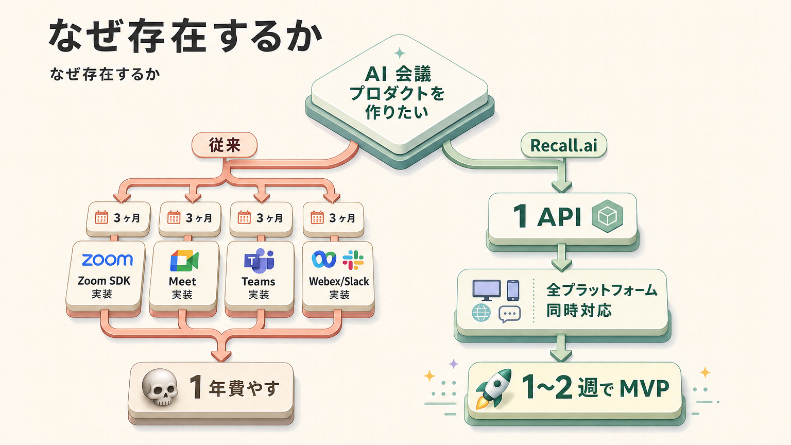

David Gu と Amanda Zhu は University of Waterloo を 19 歳で中退、最初はリアルタイム翻訳ツールを作っていたが、**会議データへのアクセス自体が 1 番難しい** ことに気づき、ピボットして 2022 年に Recall.ai を立ち上げた。

### 1.4 エンジニアにとっての意味

| 立場 | Recall.ai が解くこと |
|---|---|
| AI / バックエンドエンジニア | Zoom/Meet/Teams 統合を 1 API に抽象化。会議統合の専門知識なしで AI プロダクトを作れる。 |
| プロダクト | "会議の AI 機能" を 1〜2 週で MVP 化、Fireflies と同等の機能を自社ブランドで提供できる。 |
| 営業オペレーション | 商談録画 → CRM 自動入力のパイプラインを自社制御できる（SaaS では困難）。 |
| カスタマーサクセス | 通話品質管理・コンプラ録音の独自フロー設計が可能。 |
| セキュリティ | HIPAA / SOC2 / GDPR / CCPA 取得済、医療・金融も統合可能。 |

---

## 2. 全体マップ（1 枚絵）

### 2.1 サービス全体俯瞰

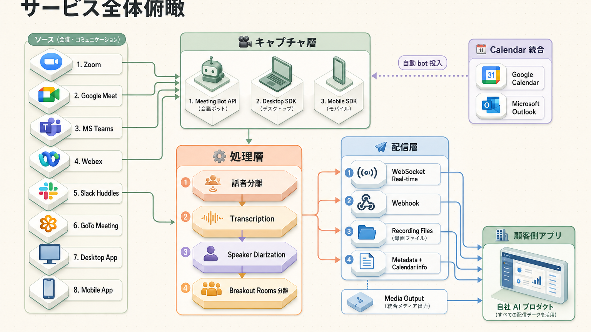

### 2.2 製品カテゴリ Mindmap

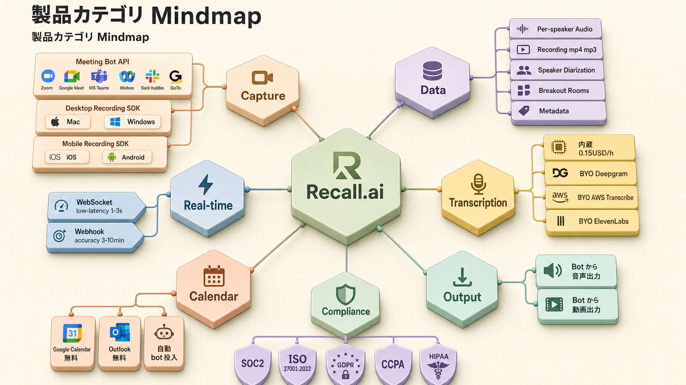

---

## 3. プラン体系の前提知識

### 3.1 プラン概要表

| 軸 | **Pay As You Go** | **Launch** | **Enterprise** |
|---|---|---|---|
| 月額固定費 | $0 | カスタム | カスタム |
| 録画料金 | $0.50/h | ボリューム割引 | ボリューム割引 |
| 内蔵 Transcription | $0.15/h | $0.15/h or BYO | $0.15/h or BYO |
| Calendar API | 無料 | 無料 | 無料 |
| 課金単位 | 秒単位プロレート | 秒単位 | 秒単位 |
| サポート | チケット | Priority | 専用 + SLA |
| Compliance | SOC2/ISO/GDPR/CCPA | + HIPAA | + HIPAA + BAA |
| Volume Discount | 不可 | 利用可 | 利用可 |
| 適用シーン | PoC / 小〜中規模 | 月数千時間以上 | エンタープライズ |

### 3.2 課金モデル

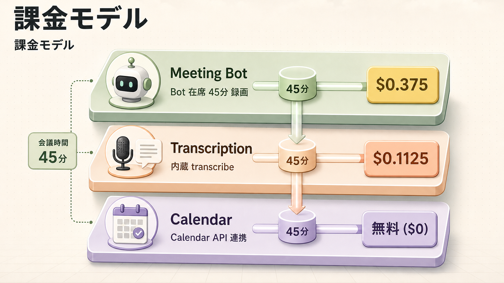

- **秒単位プロレート**: 5 分会議 → $0.50 × 5/60 = $0.042 のように厳密計算。
- **アイドル時間に課金しない**: bot が会議室に入った瞬間〜退出までだけ。月額プラットフォーム手数料なし。

### 3.3 プラン表記凡例

| 記号 | 意味 |
|---|---|
| 利用可 | プラン標準で利用可能 |
| 制限あり | 制限付き / Beta / Volume 要件 |
| 不可 | 利用不可 |
| 従量課金 | 標準で含まれるが、超過は従量課金 |

---

## 4. 機能カタログ

### 4.1 Meeting Bot API（Zoom / Meet / Teams / Webex / Slack Huddles / GoTo）

**🎯 概要**

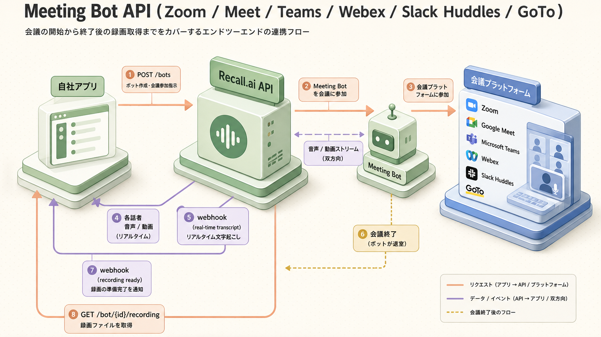

6+ の主要会議プラットフォームに統一 API で bot を投入。`meeting_url` を渡すだけ。

**👨‍💻 エンジニアへの関係**

- Zoom SDK / Google Meet API / Teams Graph API を **個別に学ぶ必要なし**。1 つのスキーマで全部済む。
- bot の表示名 / アバター画像 / 参加待機メッセージもカスタマイズ可能（ホワイトラベル運用）。

**💳 利用可能プラン**

| Pay As You Go | Launch | Enterprise |
|:-:|:-:|:-:|
| $0.50/h | Volume Discount | Volume Discount |

**🏢 ClassLab. での活用**

- 短期: 営業/CS の Zoom 商談を自動録画し、AI 要約を Slack / SF に投稿する PoC。
- 中長期: 全社の社外会議を録画 → AI ナレッジベースに自動蓄積、検索可能化。

**🔥 差別化点**

| | Recall.ai | Fireflies / Otter | Symbl.ai | 自前実装 (Zoom SDK 直) |
|---|:-:|:-:|:-:|:-:|
| 6+ プラットフォーム横断 | 利用可 | (主要のみ) | 制限あり | (個別実装) |
| ホワイトラベル可能 | 利用可 | 不可 | 利用可 | 利用可 |
| **Breakout Rooms 対応** | 唯一 | 不可 | 不可 | 制限あり |
| 完成 UI 提供 | (API のみ) | 利用可 | 不可 | 不可 |
| 開発期間 | 1〜2 週 | 即日 (UI 利用) | 2〜4 週 | 3 ヶ月+ |

**🔍 深掘り**

##### 1. bot 生成リクエストの主要パラメータ

```bash
curl -X POST https://us-west-2.recall.ai/api/v1/bot/ \
  -H "Authorization: Token YOUR_KEY" \
  -d '{
    "meeting_url": "https://zoom.us/j/...",
    "bot_name": "ClassLab. Notetaker",
    "transcription_options": { "provider": "recallai" },
    "real_time_transcription": {
      "destination_url": "https://your-server.com/hook",
      "transcription_mode": "prioritize_low_latency"
    },
    "recording_mode": "speaker_view",
    "automatic_leave": {
      "waiting_room_timeout": 600,
      "silence_detection": { "timeout": 300, "activate_after": 1200 }
    }
  }'
```

| キー | 用途 |
|---|---|
| `meeting_url` | Zoom/Meet/Teams 等の URL。プラットフォームは自動判定 |
| `bot_name` | 会議室での表示名（ホワイトラベル時はブランド名） |
| `bot_avatar_url` | アバター画像 (Zoom/Meet/Teams で表示される PNG URL) |
| `recording_mode` | `speaker_view` / `gallery_view` / `audio_only` |
| `transcription_options.provider` | `recallai` / `deepgram` / `assembly_ai` / `aws_transcribe` |
| `real_time_transcription.transcription_mode` | `prioritize_low_latency`（1〜3 秒遅延）/ `prioritize_accuracy`（バッチ寄り） |
| `automatic_leave.waiting_room_timeout` | 待機室で承認されなかった場合の自動退出秒数 |
| `automatic_leave.silence_detection.timeout` | 無音継続で自動退出（idle 課金回避に必須） |
| `chat.on_bot_join.send_to` | bot 入室時に会議チャットへ自動送信するメッセージ宛先 |
| `recording.transcript.provider` | 録画 + 後追い transcription を別 provider にする場合 |

##### 2. bot のライフサイクル（status_change webhook の流れ）

| status | 意味 | 課金 |
|---|---|:-:|
| `ready` | bot 生成完了、会議開始待ち | 不可（無料） |
| `joining_call` | 会議室へ接続試行中 | 不可 |
| `in_waiting_room` | 待機室で承認待ち | 不可 |
| `in_call_not_recording` | 入室済み・録画前 | 不可 |
| `in_call_recording` | 録画中 | 利用可（メーター開始） |
| `call_ended` | 会議終了、後処理開始 | 不可 |
| `done` | 録画 / トランスクリプト確定、media URL 取得可 | 不可 |
| `fatal` | 致命的失敗（参加拒否 / ネットワーク断 / 認証失敗） | 不可 |

`bot.status_change` イベントは順序保証されるが **at-least-once** で重複受信を許容しないと整合性が崩れる。`event_id` を見て idempotent に処理すること。

##### 3. 利用可能リージョン（API endpoint）

| 識別子 | 適用シーン |
|---|---|
| `us-west-2` | 既定。北米中心 |
| `us-east-1` | 北米東側、レイテンシ最適化 |
| `eu-central-1` | GDPR 準拠（EU 内データ完結） |
| `ap-northeast-1` | **東京。日本顧客 PoC 推奨** |
| `ap-southeast-2` | シドニー |

リージョン跨ぎでのデータ転送はしない設計。日本国内顧客の個人情報を扱うなら `ap-northeast-1` で API key を発行し、`https://ap-northeast-1.recall.ai/...` を叩く。

##### 4. ホワイトラベル設計の勘所

- `bot_name` / `bot_avatar_url` だけでなく `chat.on_bot_join.message` も差し替えて「自社の AI アシスタントが入室しました」のような UX に統一する
- Zoom は会議参加直後に bot が **チャット欄に自己紹介する** のがマナー（合意録音の証跡にもなる）
- Teams / Webex は bot が「組織外参加者」として表示されるため、`bot_name` の頭に `[AI]` を付けると参加者の心理的抵抗が減る

**⚠️ 注意点**

- ホスト側で「外部参加者 / bot 入室許可」設定が必要な会議システムあり（Zoom / Teams）。事前に IT / 取引先と合意。
- Zoom の「録画はホストのみ許可」設定が ON の場合、bot 単独では録画開始できないため `request_recording_permission` を有効にしてホストへ許可を求めるフローを組む。
- Teams は **テナント側で「外部 bot 参加」を許可** していないと `meeting_url` が有効でも入室拒否される（IT 管理者と事前合意必須）。
- `meeting_url` に有効期限がある会議サービス（Teams guest URL、Webex 一部）では、Calendar API 連携で都度最新 URL を引き直す方が安全。

---

### 4.2 Desktop Recording SDK

**🎯 概要**

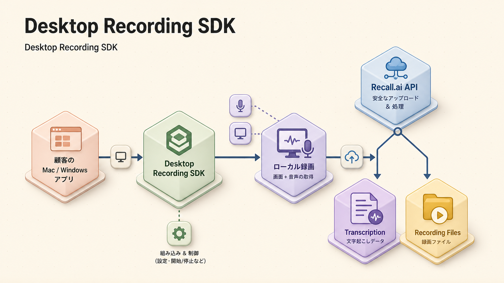

会議システムに **bot を入れずに**、ユーザの PC 上で画面 + 音声を直接キャプチャ。Mac / Windows 両対応。

**👨‍💻 エンジニアへの関係**

- bot を嫌がる組織（社外参加者対応や法務懸念）でも導入可能。
- 任意の会議システム（Zoom 等以外の社内ツール、SIer の独自システム等）も対象に。

**💳 利用可能プラン**

| Pay As You Go | Launch | Enterprise |
|:-:|:-:|:-:|
| $0.50/h | 従量課金 | 従量課金 |

**🏢 ClassLab. での活用**

- 短期: 営業端末に組込み、対面商談 + Zoom 混在ケースを 1 つの仕組みで録画。
- 中長期: 全社 PC に標準展開、内製ナレッジ蓄積基盤。

**🔥 差別化点**

- Fireflies / Otter は基本的に bot 方式のみ。**Bot レス録画は Recall.ai の独自ライン**。
- Krisp / Read.ai もデスクトップ録画あるが、API インフラとしての提供は限定的。

**🔍 深掘り**

##### 1. 対応プラットフォームと SDK 配布形態

| OS | バイナリ | 注意 |
|---|---|---|
| macOS | Apple Silicon (`arm64`) ネイティブ。最低 macOS 12 Monterey | Intel Mac は別ビルド配布、サポートが順次縮小 |
| Windows | x64 (`Win10 22H2` 以降推奨) | ARM64 Windows は preview |

配布されているのは **JavaScript / TypeScript SDK + ネイティブヘルパー** の組合せ。Electron を第一級サポートし、Bun ランタイム下でも動く。Tauri / WPF / Swift ホストアプリからは **JS bridge** 越し（あるいはネイティブヘルパーを直接 spawn する）パターンで利用する。

##### 2. キャプチャできるソース

- **会議システムウィンドウ**: Zoom / Microsoft Teams / Google Meet（ブラウザ Chrome/Edge）/ Webex / Slack Huddles を SDK が自動検出
- **任意のアプリ**: 会議システム以外の独自アプリ（例: 社内 VoIP、SIer 製の専用ツール）も `windowId` 指定でキャプチャ可
- **対面会議 / VoIP 電話**: アプリ無しでもマイク + システム音声を録ればよく、訪問商談・対面研修も対象
- **画面共有**: ユーザ側・参加者側どちらの画面共有もキャプチャ
- **オーディオソース分離**: マイク（ローカル話者）/ システム音声（リモート参加者）を別トラックで取得、後段で話者分離

##### 3. API メソッドとイベント

主な呼び出し:

```typescript
import { RecallAiSdk } from "@recallai/desktop-sdk";

await RecallAiSdk.init({ apiUrl: "https://us-west-2.recall.ai" });
await RecallAiSdk.requestPermission("accessibility");
await RecallAiSdk.requestPermission("microphone");
await RecallAiSdk.requestPermission("screen-capture");

RecallAiSdk.addEventListener("meeting-detected", (evt) => {
  // evt.platform: zoom | meet | teams ...
  // evt.windowId: OS のウィンドウ ID
});

RecallAiSdk.addEventListener("participant-events", (evt) => { /* join/leave/speak */ });
RecallAiSdk.addEventListener("recording-events", (evt) => { /* started/stopped */ });
RecallAiSdk.addEventListener("realtime-event", (evt) => {
  // type: participant_join / participant_leave / participant_speech_start /
  //       participant_speech_end / screenshare_start / transcript.data ...
});

await RecallAiSdk.startRecording({
  windowId: detectedWindow.id,
  uploadToken: tokenFromBackend
});
```

| メソッド | 用途 |
|---|---|
| `init(opts)` | SDK 初期化、リージョン指定 |
| `requestPermission(kind)` | macOS の `accessibility` / `microphone` / `screen-capture` を順に要求 |
| `addEventListener(name, cb)` | 全イベントの subscribe |
| `startRecording(opts)` | 指定 windowId / Backend 発行 uploadToken で録画開始 |
| `stopRecording()` | 任意停止（会議終了は自動検知） |
| `enumerateWindows()` | 候補となる会議ウィンドウを列挙 |

##### 4. アップロードフロー（バックエンド分離）

```text
[Backend]   POST /api/v1/sdk-upload/    (API key 保持はここだけ)
   ↓        ← upload_token (短期失効, scope=単一録画)
[Desktop]   startRecording({ uploadToken })
   ↓        ローカル録画 → 分割アップロード → Recall.ai
[Webhook]   recording.done / transcript.done を backend が受信
```

**API key を desktop バイナリに埋めない** のがベストプラクティス。短期 `upload_token` を Backend で発行して desktop に渡す方式は Recall.ai 側もデフォルトサポート。流出した token は次回 issue で revoke 可能。

##### 5. 出力フォーマット

- mp4（speaker view / gallery view 風の合成）
- mp3（混合音声）
- per-participant audio / video（話者分離後の個別トラック）
- 各話者の発話時刻メタデータ（JSON）
- リアルタイム部分トランスクリプト（partial → final 確定）

##### 6. Bot 不可ケースとの組合せ

- 取引先が「外部 bot 入室禁止」の場合 → Desktop SDK で自社員 PC 側のみ録画
- 自社 PC は Desktop SDK、外部参加 Zoom は bot、と同居運用しても整合性を `meeting_id` で取れる
- 訪問商談（対面）も Desktop SDK が「会議システム未検出 = ad-hoc 録画」として受け付ける

##### 7. リアルタイム機能の差分（vs Bot）

- Bot 経由のリアルタイム音声は 200ms 程度の遅延。Desktop SDK は **ローカル録音なのでさらに低遅延** で transcript を流せる
- ただし PC が CPU 高負荷 / オフライン時はキューに溜まり後追いアップロード（at-least-once）
- イベントの順序保証は `event_id` + `seq` の組合せで担保

**⚠️ 注意点**

- macOS の Screen Recording / Microphone 権限 UX 設計が肝。プロビジョニング時の同意フロー設計必須。`requestPermission` が初回呼出で「システム環境設定 → プライバシーとセキュリティ」を開かせる。**ユーザがシステム設定を閉じてしまうとアプリ再起動が必要**になる OS 仕様も合わせて説明する UI を用意する。
- Windows は WASAPI ループバックでシステム音声を取得するため、**音声出力デバイスが変わると一時的に取得失敗**する。デバイス変更イベントで自動再接続するロジックが望ましい。
- 録音中の会議ウィンドウを最小化しても録画継続するが、**Apple Silicon の Low Power Mode** では fps が低下するため、Lid 開閉時の挙動を社内テストで確認。
- Desktop SDK のみでは **ホスト承認なしで他参加者の同意は取得できない**。録音の事前同意（GDPR / 個人情報保護法）は **自社運用責任**。bot 方式と異なり「画面に bot がいる = 視覚的同意」が無いので、UI 側で同意ダイアログを必ず出す。

---

### 4.3 Mobile Recording SDK

**🎯 概要**

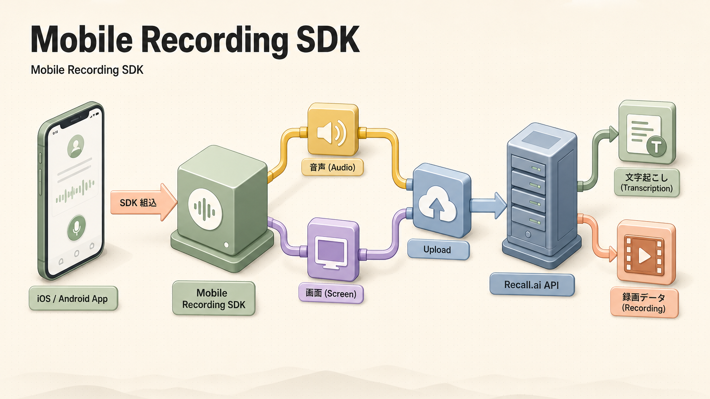

iOS / Android アプリに組み込んで、モバイル端末からの会議参加・電話通話を録画。

**💳 利用可能プラン**

| Pay As You Go | Launch | Enterprise |
|:-:|:-:|:-:|
| 従量課金 | 従量課金 | 従量課金 |

**🏢 ClassLab. での活用**

- 短期: 訪問営業の現場で端末から商談録音 → AI 要約。
- 中長期: フィールド業務（ライフライン現地調査等）の音声記録基盤。

**🔥 差別化点**

- **モバイル対応の Meeting Bot 系 SaaS は希少**。Otter にもモバイル収録あるが、SDK として組込配布は Recall.ai が先行。

---

### 4.4 Transcription（内蔵 + BYO）

**🎯 概要**

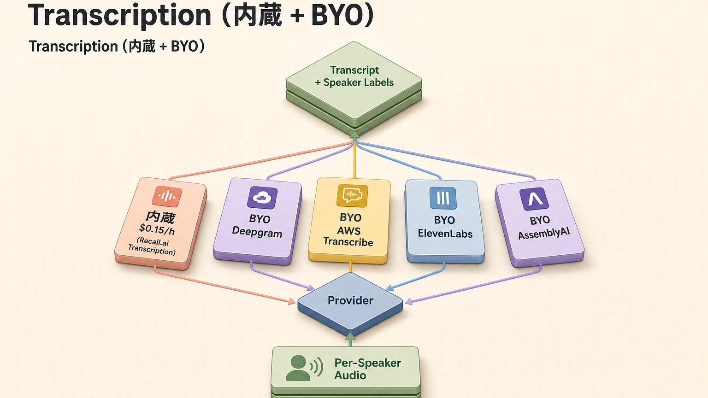

**内蔵エンジン $0.15/h** で十分品質。精度要件が厳しい場合は BYO API キーで Deepgram / AWS Transcribe / ElevenLabs / AssemblyAI 等に差替可能。

**👨‍💻 エンジニアへの関係**

- 1 つの transcription SaaS にロックインせずに済む。コスト / 言語 / 精度で柔軟に選択。
- Speaker Diarization は Recall.ai 側で処理されるので、provider に依存しない。

**💳 利用可能プラン**

| Pay As You Go | Launch | Enterprise |
|:-:|:-:|:-:|
| $0.15/h (内蔵) | 従量課金 | 従量課金 |

**🏢 ClassLab. での活用**

- 短期: 日本語商談は Deepgram Nova-2 (BYO)、英語は内蔵を選ぶ等の運用。
- 中長期: 多言語顧客向けに provider 自動切替パイプライン。

**🔥 差別化点**

- AssemblyAI / Deepgram は単体で transcription のみ。Recall.ai は **会議統合 + transcription の組合せ最適化** が独自。

**🔍 深掘り**

- BYO 時は環境変数で各 provider の API key を Recall.ai に保管、リクエストパラメータで切替。

---

### 4.5 Real-time Streaming（WebSocket / Webhook）

**🎯 概要**

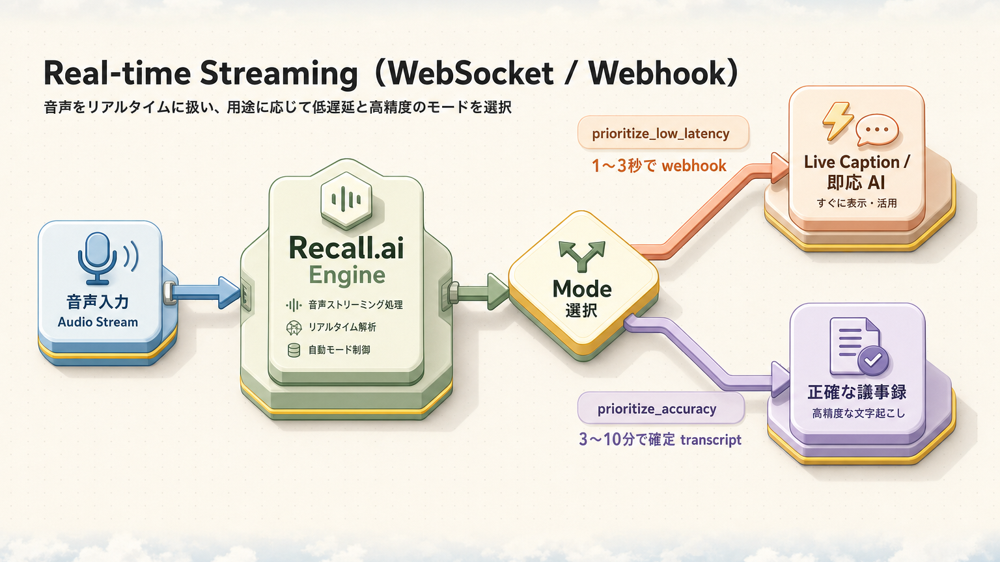

`prioritize_low_latency`（1〜3 秒）と `prioritize_accuracy`（3〜10 分）の 2 モード。WebSocket / Webhook の好きな方で受信。

**👨‍💻 エンジニアへの関係**

- ライブキャプション / リアルタイム AI 応答型のプロダクトを設計可能（例: 商談中に AI が次の質問を提案）。

**💳 利用可能プラン**

| Pay As You Go | Launch | Enterprise |
|:-:|:-:|:-:|
| 利用可 | 利用可 | 利用可 |

**🏢 ClassLab. での活用**

- 短期: 商談中に LLM が「未確認情報」をハイライト → 営業に通知。
- 中長期: 顧客対応中のコンプライアンス即時チェック（NG ワード検知）。

**🔥 差別化点**

- Symbl.ai のリアルタイムも有名だが、**Recall.ai は会議 bot + リアルタイムが一体**で、bot の参加待機〜退出までのライフサイクル全体を 1 つの API で扱える。

**🔍 深掘り**

##### 1. 2 つの受信チャネル — Webhook と WebSocket の選択

| 観点 | Webhook | WebSocket |
|---|---|---|
| 接続 | bot が `destination_url` を HTTPS で POST | bot が `wss://` に接続、サーバから push |
| インフラ | 受信側に **公開 HTTPS endpoint** が必要 | クライアントが繋ぎに行く（NAT 内で OK） |
| 順序保証 | 順序前後あり（at-least-once + `seq` で再構成） | TCP 順序通り |
| 遅延 | 1〜3 秒（HTTP オーバーヘッド込） | 200〜500 ms（音声フレーム単位） |
| 推奨用途 | 長期記録 / Webhook 中心の既存基盤 | ライブ字幕 / リアルタイム AI 応答 |
| Authentication | Signature ヘッダ（HMAC-SHA256） | URL 内 short-lived token |

##### 2. 受信できるイベント種別

```text
participant_events.join              参加者入室
participant_events.leave             参加者退室
participant_events.speech_on         発話開始
participant_events.speech_off        発話終了
participant_events.update            名前/役割の変更
participant_events.webcam_on / off   カメラ ON/OFF
participant_events.screenshare_on    画面共有開始
transcript.data                      partial （部分文）
transcript.partial_data              utterance ごとの finalize 前
transcript.final                     確定済みフレーズ
audio_mixed.data                     全話者ミックス（PCM 16-bit / 16kHz）
audio_separate.data                  話者ごとの個別 PCM ストリーム
video_separate_png.data              話者ごとの動画フレーム（PNG ベース）
chat_messages.data                   会議内チャット投稿の受信
bot.status_change                    bot のライフサイクル変化
```

##### 3. transcript_mode の差

| mode | 遅延 | 用途 |
|---|---|---|
| `prioritize_low_latency` | 1〜3 秒 | ライブ字幕 / リアルタイム支援 / NG ワード検知 |
| `prioritize_accuracy` | 3〜10 分 | 会議後の議事録、Diarization 精度重視 |

低レイテンシモードは **partial → final へ随時上書き** されるので、UI 側で「未確定はグレー、確定は黒」のような描画分けが必要。

##### 4. 実装例（WebSocket 受信側 / Node.js）

```typescript
import WebSocket from "ws";

const ws = new WebSocket("wss://meeting-data.bot.recall.ai/api/v1/transcript", {
  headers: { Authorization: `Token ${process.env.RECALL_KEY}` }
});

ws.on("message", (raw) => {
  const event = JSON.parse(raw.toString());
  switch (event.type) {
    case "transcript.data":
      // partial: 確定前テキスト
      renderPartial(event.data);
      break;
    case "transcript.final":
      // final: 確定、AI 処理キューへ
      enqueueAnalysis(event.data);
      break;
  }
});
```

**⚠️ 注意点**

- partial / final は **同じ `utterance_id` で更新** される。final が来るまで AI 解析を走らせるとトークン無駄遣い。
- WebSocket は idle 60 秒で切られるので heartbeat 必須。
- `prioritize_low_latency` でも会議参加者の通信が悪いと 5 秒以上遅延することがある。SLA を顧客に約束するなら **会議終了後の `transcript.done` でリプレイ** する設計に倒す。

---

### 4.6 Calendar API（無料）

**🎯 概要**

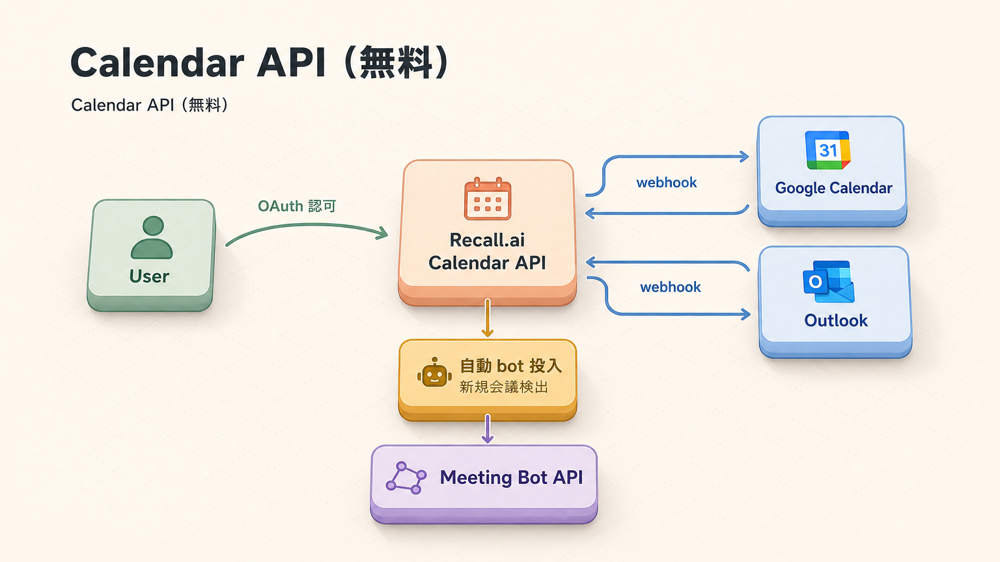

Google Calendar / Outlook と OAuth 連携。指定条件の会議へ **自動的に bot を投入**。Calendar 情報を録画メタデータに付与。

**💳 利用可能プラン**

| Pay As You Go | Launch | Enterprise |
|:-:|:-:|:-:|
| **無料** | **無料** | **無料** |

**🏢 ClassLab. での活用**

- 短期: 営業の Google Calendar を連携し、外部参加者あり会議だけを自動録画。
- 中長期: 全社 Calendar 連携 → ナレッジベース化を ZeroTouch で実現。

**🔥 差別化点**

- **多くの競合は別料金**（Fireflies の Calendar 連携は有料プラン限定）。Recall.ai は全プラン無料。

**🔍 深掘り**

##### 1. 対応カレンダー / 認証

| プロバイダ | 認証 | スコープ |
|---|---|---|
| Google Calendar | OAuth 2.0 | `calendar.readonly` + `calendar.events.readonly` |
| Microsoft Outlook (M365) | OAuth 2.0 + Graph API | `Calendars.Read` + `OnlineMeetings.Read` |
| iCloud / その他 | 直接対応なし | Google 経由 or サブ Cal の集約で対応 |

OAuth Token は Recall.ai が暗号化保管。**ユーザ単位** で接続するため、Connect Account 画面を自社 UI に埋め込む（refresh token は Recall 側でローテーション）。

##### 2. 自動 bot 投入のフィルタ

```json
{
  "automatic_bot_creation": {
    "enabled": true,
    "rules": {
      "include_external_only": true,
      "skip_recurring_after_first": false,
      "exclude_attendee_domains": ["internal.example.com"],
      "exclude_keywords": ["1on1", "private"],
      "platforms": ["zoom", "google_meet", "ms_teams"]
    },
    "bot_config": {
      "bot_name": "ClassLab. Notetaker",
      "transcription_options": { "provider": "recallai" }
    }
  }
}
```

実用パターン:
- 「外部参加者がいる会議のみ」録画 → `include_external_only: true`
- 「定例の初回だけ」録画 → `skip_recurring_after_first: true`
- 1on1 など特定キーワードは録画しない → `exclude_keywords`

##### 3. 録画に紐付くメタデータ

- `calendar_event.id` / `attendees[].email` / `organizer.email`
- `recurring_event_id`（連続会議の親 ID）
- `title` / `description` — 自動タグ付け・Salesforce 取引先紐付けに利用
- `online_meeting.platform` — 自動的に bot 起動先を判定

##### 4. 同期方式

- Google: **Push Notification (channel)** + 1 時間ごとの再同期 polling
- Outlook: Graph API の Webhook subscription、3 日ごとに自動 renew
- ローカル時刻 / TZ は Recall 側が UTC に正規化 → `bot.scheduled_at` で取得

**⚠️ 注意点**

- Calendar API 自体は無料だが、bot が会議に入室した瞬間から **録画料金は発生**。「無料で何でも自動化」と誤解しないこと。
- ユーザが Calendar 招待を **後から編集** すると、`meeting_url` が変わるケース（特に Teams）あり。`calendar.event_update` webhook で常に再評価する。
- 取引先テナントの Calendar 招待が `googlemeet.com` でなく `https://meet.google.com/lookup/...` のような変則 URL の場合、自動判定が外れることがある。fallback で `platforms: ["google_meet"]` を強制指定するルールを書ける。

---

### 4.7 Speaker Diarization & Breakout Rooms 分離

**🎯 概要**

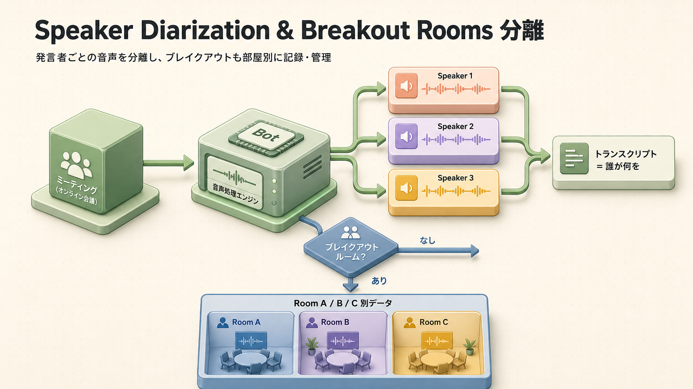

各話者の音声を **別トラックで取得**。同時発話があっても誰が何を言ったか正確に判別。**Breakout Rooms 分離は Recall.ai 唯一**。

**💳 利用可能プラン**

| Pay As You Go | Launch | Enterprise |
|:-:|:-:|:-:|
| 利用可 | 利用可 | 利用可 |

**🏢 ClassLab. での活用**

- 短期: 多拠点同時参加会議の議事録を、参加者ごとに分けて検索可能化。
- 中長期: 教育系ワークショップで Breakout 内の会話を分析、グループごとに AI 講評。

**🔥 差別化点**

- **Breakout Rooms 録画は他社 0**。研修・教育・ワークショップ向けの決定打。

**🔍 深掘り**

##### 1. 話者分離の出力構造

通常録画から得られる `transcript` JSON は以下の単位で発話を保持する。

```json
{
  "utterances": [
    {
      "speaker": "山田太郎",
      "speaker_id": "user_4f1...",
      "start_timestamp": 12.34,
      "end_timestamp": 18.10,
      "is_final": true,
      "words": [
        { "text": "それでは", "start": 12.34, "end": 12.78 },
        { "text": "見積りを", "start": 12.79, "end": 13.55 }
      ],
      "breakout_room_id": null
    }
  ]
}
```

- `speaker_id` は会議内で安定。再入室しても同 ID
- `is_final` が `false` の partial データは後で更新される（partial を DB に保存する場合は upsert）

##### 2. Breakout Rooms の録画モデル

Recall.ai は Breakout Room ごとに **子 bot を自動スピンアップ** する。

- 親 bot は「メインルーム」を担当
- ユーザが Breakout Room に分かれると、自動で **N 個の子 bot** が各部屋に入室
- 子 bot ごとに独立した `bot_id` / `transcript` / `recording` が発行され、`parent_bot_id` で関連付け
- メインルームに戻ると子 bot は退出 → `breakout_session_ended` webhook 発火

##### 3. 録画の取り出し

```bash
GET /api/v1/bot/{parent_bot_id}/                # 親 bot メタ
GET /api/v1/bot/{parent_bot_id}/breakout_rooms/ # 子 bot ID 一覧
GET /api/v1/bot/{child_bot_id}/transcript/      # 部屋ごとの transcript
```

##### 4. 同時発話 / クロストーク

- 内蔵 Diarization は **同時 2〜3 話者まで** 安定して分離
- 4 人以上が同時発話するワークショップでは `transcription_options.provider: "assembly_ai"` に切替が精度向上
- 各話者の発話量・割合は `utterances` を集計すれば算出（教育用途で「均等発言度」KPI など）

**⚠️ 注意点**

- Breakout Rooms 録画は **Zoom / Meet のみ完全対応**。Teams の Breakout は Recall.ai が一部対応中（プラットフォーム差は変動するので最新 docs を確認）。
- 子 bot は **親 bot とは別課金カウント**。10 人ワークショップで 5 部屋 × 30 分なら 5 部屋分の録画時間がそれぞれ発生する。
- Breakout Room 名（Zoom UI で命名したもの）も `room_name` で取得できるが、ホストが命名しないと `Breakout Room 1` のような連番のみ。

---

### 4.8 Media Output（Bot からの音声・動画・チャット・画面共有 出力）

**🎯 概要**

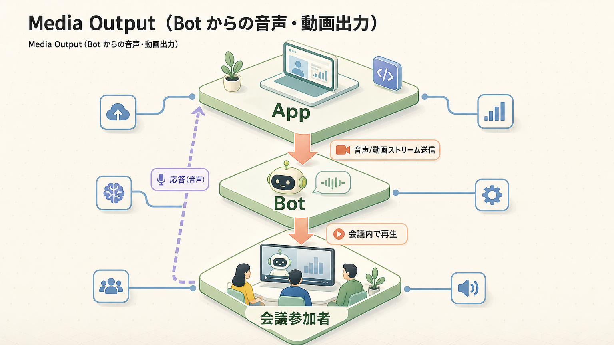

Bot を「リスナー」だけでなく **会議への発信者** として使える層。Recall.ai はここを **3 系統の API** に整理している:

| 系統 | 用途 | 入力 |
|---|---|---|
| **Output Audio API** | 短い音声スニペット（合意確認、参加通知、アラート、ワークフローの口頭プロンプト） | MP3 ファイル（≤ ~1.75MB） |
| **Stream Media（Webpage Output）** | リアルタイム双方向の音声/映像。AI アバターや TTS エージェント | 任意の HTML/CSS/JS をホストした URL |
| **Chat Message API** | 会議チャットへのテキスト投稿 | プレーンテキスト |

これに加え、**Screen Share Output**（bot がスクリーン共有として外部 URL の映像を流す）と **Camera Output**（bot のカメラ枠に同上の URL を流す）の 2 つの出力チャネルがある。

**💳 利用可能プラン**

| Pay As You Go | Launch | Enterprise |
|:-:|:-:|:-:|
| 利用可 | 利用可 | 利用可 |

Stream Media は **bot variant** によって追加料金が発生する点に注意（後述）。

**🏢 ClassLab. での活用**

- 短期: 商談 bot が入室時に **「録音同意の口頭通知 + チャット文言」** を自動再生（コンプラ証跡）。
- 中長期: 「不在の SE が AI アバターとして商談に同席し質問対応」「契約説明を AI が音声で読み上げ」「Salesforce の見積を画面共有で即座に提示」。

**🔥 差別化点**

- **音声出力ができる meeting bot SaaS は希少**。AI Agent と組合せた次世代 UX 開発に必須。
- **任意の Webpage を bot のカメラ/画面共有として流せる** のは Recall.ai 独自。OBS のような合成済み映像を WebGL 含めて配信できる（`web_gpu` variant）。

**🔍 深掘り**

##### 1. Output Audio API（短尺音声）

会議に短い音声を流すための専用 endpoint。

```bash
# 1) Bot 作成時に有効化
curl -X POST https://us-west-2.recall.ai/api/v1/bot/ \
  -H "Authorization: Token YOUR_KEY" \
  -d '{
    "meeting_url": "...",
    "automatic_audio_output": {
      "in_call_recording": { "data": { "kind": "mp3", "b64_data": "<base64>" } }
    }
  }'

# 2) 在席中に手動で再生
curl -X POST https://us-west-2.recall.ai/api/v1/bot/{bot_id}/output_audio/ \
  -H "Authorization: Token YOUR_KEY" \
  -d '{ "kind": "mp3", "b64_data": "<base64 mp3 ≤ 1.75MB>" }'

# 3) 停止
curl -X DELETE https://us-west-2.recall.ai/api/v1/bot/{bot_id}/output_audio/
```

| 項目 | 仕様 |
|---|---|
| フォーマット | MP3 のみ（`kind: "mp3"`） |
| サイズ上限 | 1,835,008 bytes（約 1.75 MB） |
| 想定用途 | 同意通知 / 参加挨拶 / アラート音 / ワークフロー開始プロンプト |
| 非対応 | 双方向の会話 AI、長尺 TTS の連続出力、ライブ TTS ストリーミング |

> 双方向の AI エージェント音声を流したい場合は Output Audio API ではなく **Stream Media** を使う。

##### 2. Stream Media（Webpage Output）— リアルタイム双方向

bot 内部で **ヘッドレスブラウザ** が指定 URL を開き、その画面と音声をそのまま **bot のカメラ or 画面共有として** 会議に流す。Webpage 側は会議側の音声を `MediaStream` API で受け取れる。

```json
{
  "meeting_url": "...",
  "output_media": {
    "camera": {
      "kind": "webpage",
      "config": { "url": "https://your-agent.example.com/?session=abc123" }
    }
  },
  "variant": "web_4_core",
  "include_bot_in_recording": { "audio": true }
}
```

**実行環境**

| 項目 | 値 |
|---|---|
| 解像度 | 1280 × 720 px |
| フレームレート | 15 fps |
| マイク権限 | 自動付与（ユーザ操作不要） |
| WebSocket | `wss://meeting-data.bot.recall.ai/api/v1/transcript` 経由でライブ字幕受信 |

**Bot Variant（CPU/メモリ/GPU）**

| variant | CPU | Memory | WebGL | 追加料金 |
|---|---|---|---|---|
| `web`（既定） | 250m core | 750MB | 不可 | $0 |
| `web_4_core` | 2250m core | 5250MB | 不可 | +$0.10/h |
| `web_gpu` | 6000m core | 13250MB | 利用可 | +$1.00/h |

**Recording への取り込み**

| 設定 | 挙動 |
|---|---|
| `include_bot_in_recording.audio: true` | bot 発話を mp4 / mp3 にミックス |
| `include_bot_in_recording.video: false` | bot 映像は録画に含まれない（仕様上 true 不可） |
| Diarization | bot 発話を別話者トラックとして分離 |

**対応プラットフォーム**

| プラットフォーム | カメラ出力 | 画面共有出力 | 備考 |
|---|:-:|:-:|---|
| Zoom | 利用可 | 利用可 | 標準動作 |
| Google Meet | 利用可 | 利用可 | 標準動作 |
| Microsoft Teams | 利用可 | 利用可 | 標準動作 |
| Webex | 利用可 | 利用可 | 標準動作 |
| Slack Huddles | 不可 | 不可 | Stream Media 非対応 |

**制御 API**

| 動作 | endpoint |
|---|---|
| 開始 | `POST /api/v1/bot/{bot_id}/output_media/` |
| 停止（カメラ） | `DELETE /api/v1/bot/{bot_id}/output_media/`（body: `{ "camera": true }`） |
| 切替（URL 動的変更） | 既存セッションを停止 → 新 URL で再 POST |

**ベストプラクティス**

- 認証は URL クエリに **短期失効 session token** を埋め込む（API key を Webpage に置かない）
- ローカル開発は ngrok でトンネル、デバッグは Recall ダッシュボード → Bot Explorer → **Debug Data タブで Chrome DevTools** を直接アタッチ
- `automatic_audio_output` / `automatic_video_output` とは **同時利用不可**。混在させたい場合は Stream Media 側に統合
- 音声のみの bot にしたい場合は黒画面 + ロゴの Webpage を流す（動画フィードは必須）

##### 3. Chat Message API

```bash
curl -X POST https://us-west-2.recall.ai/api/v1/bot/{bot_id}/send_chat_message/ \
  -H "Authorization: Token YOUR_KEY" \
  -d '{ "message": "本会議は AI Notetaker により録音されています" }'
```

- bot 入室直後に自動送信したい場合は `chat.on_bot_join.send_to` を bot 作成時に指定
- Slack Huddles / 一部プラットフォームでは送信不可
- 受信側は `chat_messages` webhook で会議内チャットを取得（顧客発言を入力に使う UI 設計が可能）

##### 4. 主要ユースケース

| シナリオ | 採用 API |
|---|---|
| 録音同意の口頭通知（5 秒） | Output Audio API（MP3） |
| AI セールスアバター（顔 + 音声で対話） | Stream Media（`web_gpu`） |
| TTS エージェントが質問に応答 | Stream Media（任意の Webpage で TTS） |
| リアルタイム通訳の音声差し込み | Stream Media + サイドカー翻訳 |
| 「議事録準備中…」のチャット投稿 | Chat Message API |
| 共有画面に Salesforce 見積を表示 | Stream Media `screenshare` |
| 録音開始時に効果音 | Output Audio API |

**⚠️ 注意点**

- **Output Audio API は対話用ではない**。LLM ストリーミングを直接流すと細切れに再生され UX が崩壊する。連続音声は Stream Media を使う。
- `web_gpu` variant は 1 時間 +$1.00 と非常に高価。WebGL 必須でない限り `web_4_core` で十分。
- Slack Huddles は Stream Media 完全非対応。Slack 側で AI アバター運用は無理。
- bot の Webpage がクラッシュすると会議側には「黒画面」しか映らない。`recording-events` の `bot.media_output_failed` を必ず subscribe してリトライする。

---

### 4.9 Recording Output（mp4 / mp3 / Per-speaker）

**🎯 概要**

| 形式 | 用途 |
|---|---|
| `mp4` (gallery view) | ZIP で全員映像 |
| `mp4` (speaker view) | 発話者切替の標準動画 |
| `mp3` (mixed) | 音声単独、軽量 |
| **Per-speaker tracks** | 個別話者の音声/映像 = 詳細分析向け |

**💳 利用可能プラン**

| Pay As You Go | Launch | Enterprise |
|:-:|:-:|:-:|
| 利用可 | 利用可 | 利用可 |

**🏢 ClassLab. での活用**

- 短期: 商談録画を mp4 で保管、AI 分析は per-speaker で実施。
- 中長期: 教育系では各受講者の発話量・割合を per-speaker 分析。

**🔍 深掘り**

##### 1. 出力されるファイル種別

| ファイル | 内容 | 想定サイズ目安（60 分） | 用途 |
|---|---|---|---|
| `mp4` (speaker view) | 発話切替合成、H.264 + AAC | 200〜400 MB | 通常視聴 / 商談ライブラリ |
| `mp4` (gallery view) | 全員グリッド表示 | 400〜800 MB | 教育・ワークショップの全体観 |
| `mp3` (mixed) | 全話者ミックス | 50〜90 MB | 軽量保管、テキスト前処理 |
| Per-speaker `mp4` | 話者ごと独立トラック × N | 各 100〜200 MB | 話者単位の AI 分析 / 編集 |
| Per-speaker `mp3` | 話者ごと音声トラック | 各 30〜60 MB | Diarization 精度向上、再 transcription |
| `transcript.json` | utterance 配列 | <5 MB | LLM 入力 / 検索 |
| `chat.json` | 会議内チャットログ | <1 MB | コンテキスト補強 |
| `metadata.json` | 参加者・タイムスタンプ・platform 情報 | <100 KB | 監査 / 検索 index |

##### 2. ダウンロード方式 — Signed URL

```bash
GET /api/v1/bot/{bot_id}/recordings/
# レスポンス内の media_shortcuts.video_mixed.url は短期失効 (24h) S3 signed URL
```

- Signed URL は 24 時間で失効。永続保管したい場合は自社 S3 / R2 / GCS に即時 mirror
- HEAD で `Content-Length` を取れるのでチャンクダウンロードを安全に組める
- 30 日間は Recall.ai 側でも保持（プランで延長可）。それ以降は **必ず自社保管に移行** する設計が前提

##### 3. リテンションとアーカイブ

| 動作 | デフォルト | 設定 |
|---|---|---|
| Recall.ai 側の保管期間 | 30 日 | Enterprise で延長 / 即時削除化可 |
| 自動削除 | あり（30 日経過後） | DPA で短縮 / 削除コマンド `DELETE /api/v1/bot/{id}/recordings/` |
| 法定保持 | 顧客責任 | 自社 S3 への Glacier 階層送りが推奨 |

##### 4. ストリーミング再生 vs ダウンロード

- `media_shortcuts.video_mixed.url` は **range request 対応**。HLS 等の追加変換なしで `<video>` タグから直接ストリーム可能
- 商談ライブラリ UI で「再生 + コメント挿入」を作るなら、signed URL を 1 時間ごとに renew する SSR API を間に挟む

**⚠️ 注意点**

- per-speaker トラックは話者数分のストレージを食う。10 人会議 60 分なら ~2GB。S3 コスト試算必須。
- transcript.json と mp4 の時刻軸は **同じ秒単位**。動画再生位置と transcript ハイライト連動は signed URL の TTL に注意して実装。

---

### 4.10 Compliance

| 認証 / 規制 | Pay As You Go | Launch | Enterprise |
|---|:-:|:-:|:-:|
| SOC 2 | 利用可 | 利用可 | 利用可 |
| ISO 27001:2022 | 利用可 | 利用可 | 利用可 |
| GDPR | 利用可 | 利用可 | 利用可 |
| CCPA | 利用可 | 利用可 | 利用可 |
| **HIPAA** | 不可 | 制限あり | + BAA |
| 専用リージョン | 不可 | 不可 | 利用可 |
| 専用 DPA / SLA | 不可 | 制限あり | 利用可 |

**🏢 ClassLab. での活用**

- 短期: 通常業務利用は SOC2 / ISO で十分。
- 中長期: 医療系統合（ライフライン顧客の高齢者対応含む）は HIPAA + BAA 契約検討。

---

### 4.11 Webhooks / Async Job 管理

**🎯 概要**

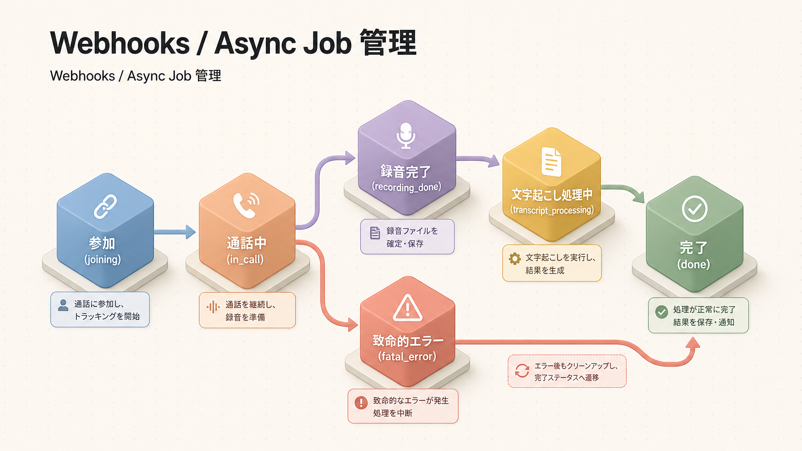

Bot のライフサイクル全てを webhook で通知。`bot.status_change` / `transcript.data` / `recording.done` 等を購読。

**💳 利用可能プラン**

| Pay As You Go | Launch | Enterprise |
|:-:|:-:|:-:|
| 利用可 | 利用可 | 利用可 |

**🏢 ClassLab. での活用**

- 短期: webhook で SF / Slack 自動通知。
- 中長期: 状態管理を独自 DB に同期し、社内ダッシュボード化。

**🔍 深掘り**

##### 1. 受信できる主な Webhook イベント

| イベント名 | タイミング |
|---|---|
| `bot.status_change` | bot の status が遷移するたび |
| `bot.joining_call` / `bot.in_waiting_room` / `bot.in_call_recording` / `bot.call_ended` / `bot.done` / `bot.fatal` | 各 status への突入 |
| `transcript.data` | partial transcript |
| `transcript.partial_data` | utterance 単位の partial |
| `transcript.done` | 会議終了後 transcript 確定 |
| `recording.done` | 録画ファイルが S3 に置かれた |
| `recording.processing_failure` | 後処理エラー（再生成可） |
| `chat_messages.data` | 会議内チャット投稿の発生 |
| `calendar.event_created` / `event_updated` / `event_deleted` | Calendar 同期イベント |
| `breakout_session_started` / `breakout_session_ended` | Breakout Room の開始 / 終了 |
| `bot.recording_permission_denied` | ホストが録画を拒否 |

##### 2. 配信モデル

- **at-least-once**（重複あり）：受信側で `event_id` を見て idempotent 処理
- **順序保証なし**：bot.in_call_recording が bot.in_waiting_room より先に届くケースあり。`occurred_at` ベースで状態機械を更新
- **リトライ**：2xx を返さないと指数バックオフで最大 24 時間まで自動リトライ
- **タイムアウト**：受信エンドポイントは **10 秒以内** に 2xx を返す。長い処理は queue に積んで先に 200 OK を返す
- **失敗 webhook はダッシュボードで再送可能**

##### 3. 署名検証（HMAC-SHA256）

```typescript
import crypto from "node:crypto";

export function verifyRecallSignature(req: Request): boolean {
  const signature = req.headers.get("X-Recall-Signature") ?? "";
  const timestamp = req.headers.get("X-Recall-Timestamp") ?? "";
  const body = await req.text();

  const payload = `${timestamp}.${body}`;
  const expected = crypto
    .createHmac("sha256", process.env.RECALL_WEBHOOK_SECRET!)
    .update(payload)
    .digest("hex");

  // タイミング攻撃対策で timingSafeEqual を使う
  return crypto.timingSafeEqual(
    Buffer.from(expected),
    Buffer.from(signature)
  );
}
```

`timestamp` が **現在時刻 ± 5 分** を外れていたら replay 攻撃として reject すること。

##### 4. ペイロード形（共通スキーマ）

```json
{
  "event": "bot.status_change",
  "event_id": "evt_01HZE...",
  "occurred_at": "2026-05-21T03:12:04.812Z",
  "delivery_attempt": 1,
  "data": {
    "bot": { "id": "bot_01HZE...", "status": "in_call_recording", "metadata": {} },
    "previous_status": "in_call_not_recording"
  }
}
```

##### 5. ローカル開発

- Recall ダッシュボード → Webhooks → **"Send Test Event"** で任意イベントを再送
- `ngrok http 3000` で公開、Webhook URL に `https://xxxx.ngrok-free.app/recall` を登録
- 「失敗 webhook の再配信」ボタンで送り直しが可能（24 時間以内）

##### 6. アンチパターン

- ❌ webhook 受信 ハンドラで Salesforce / Slack を **同期呼び出し** → 10 秒 timeout でリトライ嵐
- ❌ `event_id` を保存せずに重複処理 → 同じ商談を SF に 5 件 INSERT
- ❌ HTTP 200 を返さずに WAF が 403 を返す構成 → 24 時間連続リトライで Recall.ai 側から **自動 disable** される
- ✅ 受信 → 200 即返し → Queue（SQS / Vercel Queues / Redis）→ Worker で実処理

**⚠️ 注意点**

- production / staging を **別 secret** で運用すること。secret が漏れると payload 改竄が可能になる。
- `delivery_attempt` が 5 以上の webhook は **アラート** を上げる運用にする（恒常的に失敗している兆候）。

---

## 5. プラン早見表（全機能 × プラン）

| カテゴリ | 機能 | Pay As You Go | Launch | Enterprise |
|---|---|:-:|:-:|:-:|
| Capture | Meeting Bot API | $0.50/h | Volume | Volume |
| Capture | Desktop Recording SDK | $0.50/h | 従量課金 | 従量課金 |
| Capture | Mobile Recording SDK | 従量課金 | 従量課金 | 従量課金 |
| Capture | Breakout Rooms 録画 | 利用可 | 利用可 | 利用可 |
| Transcription | 内蔵エンジン | $0.15/h | 従量課金 | 従量課金 |
| Transcription | BYO (Deepgram / AWS / ElevenLabs / AssemblyAI) | 利用可 | 利用可 | 利用可 |
| Real-time | Webhook / WebSocket | 利用可 | 利用可 | 利用可 |
| Real-time | `prioritize_low_latency` / `prioritize_accuracy` | 利用可 | 利用可 | 利用可 |
| Calendar | Google Calendar / Outlook | 無料 | 無料 | 無料 |
| Data | Per-speaker audio tracks | 利用可 | 利用可 | 利用可 |
| Data | Speaker Diarization | 利用可 | 利用可 | 利用可 |
| Data | Recording (mp4 / mp3 / per-speaker) | 利用可 | 利用可 | 利用可 |
| Output | Bot からの音声/動画出力 | 利用可 | 利用可 | 利用可 |
| Compliance | SOC2 / ISO 27001 / GDPR / CCPA | 利用可 | 利用可 | 利用可 |
| Compliance | HIPAA + BAA | 不可 | 制限あり | 利用可 |
| Platform | Volume Discount | 不可 | 利用可 | 利用可 |
| Platform | Priority Support | 不可 | 利用可 | 利用可 |
| Platform | 専用 SLA / DPA | 不可 | 制限あり | 利用可 |

---

## 6. 料金体系の詳細

### 6.1 プラン別含み枠 & 超過料金

**Pay As You Go**: 月額固定費 $0

| 項目 | 単価 |
|---|---|
| Meeting Bot API 録画 | $0.50 / h |
| Desktop Recording SDK | $0.50 / h |
| Mobile Recording SDK | $0.50 / h |
| 内蔵 Transcription | $0.15 / h |
| Calendar API | $0 (無料) |
| BYO Transcription | $0 (各 provider に直接支払) |

- **秒単位プロレート**。月額ミニマム / 起動料なし。
- PoC や小規模利用に最適。

**Launch**: カスタム月額 + ボリューム割引

- 月数千時間以上の利用で単価が下がる契約。
- Priority Support / HIPAA オプション。

**Enterprise**: カスタム

- 専用リージョン / SLA / BAA / DPA。
- カスタム機能要望対応。

### 6.2 競合との料金構造の違い

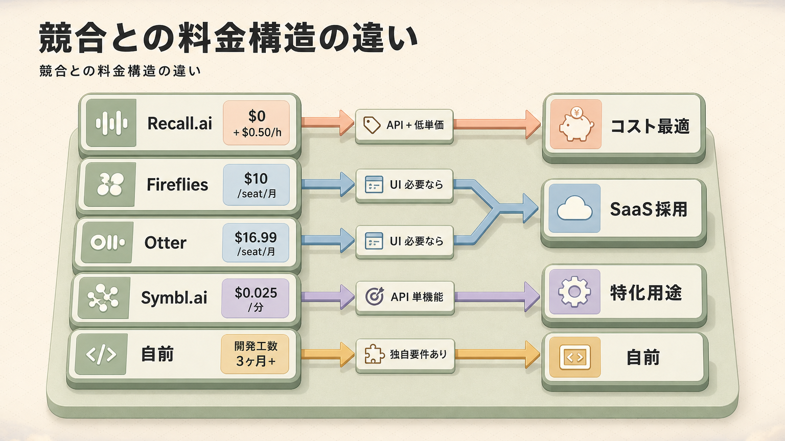

### 6.3 コスト最適化の勘所

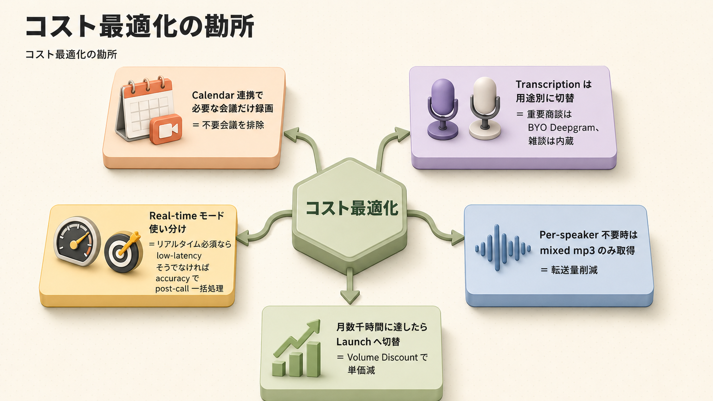

---

## 7. ClassLab. での活用ロードマップ（汎用例）

### 7.1 短期（〜3 ヶ月）

| テーマ | 機能 | 想定効果 |
|---|---|---|
| 営業商談録画 & AI 要約 PoC | Meeting Bot + Calendar | Zoom 商談から自動的に SF への要約投入 |
| 社内会議の議事録自動化 | Meeting Bot + Real-time webhook | 全社会議の議事録作成工数を削減 |
| 内蔵 transcription の品質検証 | Transcription | 日本語精度を Deepgram / AssemblyAI / 内蔵で比較 |
| Calendar 連携 PoC | Calendar API (無料) | 営業の Google Calendar 自動 bot 投入 |
| Slack 連携 | Webhooks | 商談終了 → Slack 要約自動投稿 |

### 7.2 中長期（3〜12 ヶ月）

| テーマ | 機能 | 想定効果 |
|---|---|---|
| 顧客接点の知識化 | Meeting Bot + Transcript + Vector DB | 全商談・サポート対応を検索可能化、CS 提案高度化 |
| コールセンター品質管理 | Desktop SDK + Real-time | NG ワード検知・コンプラ即時アラート |
| 教育プロダクト | Meeting Bot + Breakout Rooms + Speaker Diarization | グループワーク内の参加度・発話量を可視化 |
| 訪問営業録音 | Mobile SDK | 現地調査内容を端末から録音 → AI 要約 |
| 高齢者顧客対応 | Meeting Bot + HIPAA Enterprise | ライフライン契約で高齢者向け医療相談を統合 |
| AI エージェント発話 | Media Output | 不在者代理 AI が会議に応答 |

### 7.3 既存資産棚卸し（汎用枠）

| 既存 | 移行候補 |
|---|---|
| Zoom Phone 通話の手動議事録化 | Recall.ai 経由で自動化 |
| 商談録画の手動 SF 入力 | Meeting Bot + Webhook で自動投入 |
| 個別の transcription SaaS 契約 | Recall.ai 内蔵 or BYO 統合 |
| 各営業 PC のローカル録音 | Desktop SDK で標準化 |
| Calendar 別ツール統合 | Recall.ai Calendar API（無料） |

---

## 8. 採用判断フロー

### 8.1 新規プロジェクト選択フロー

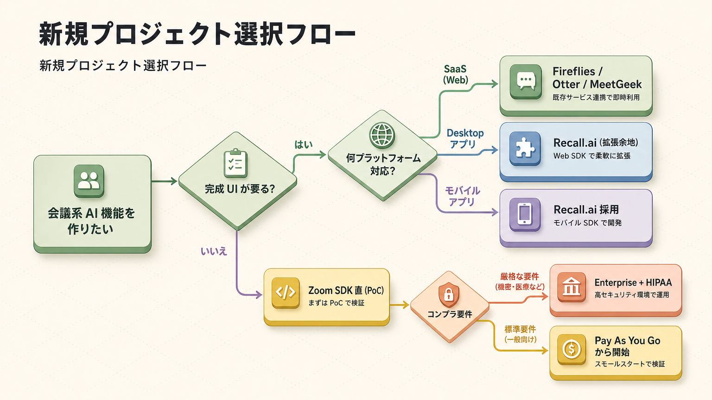

### 8.2 採用適性 Quadrant

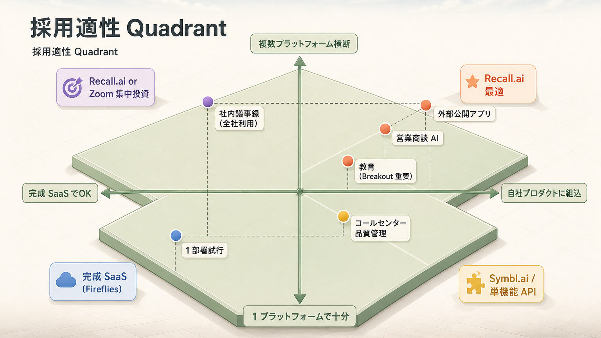

> 右上に近いほど Recall.ai が最適。左下は完成 SaaS（Fireflies / Otter）が早い。

---

## 9. 公式リファレンス & Sources

### 公式ドキュメント

- 全体: https://docs.recall.ai/
- Getting Started: https://docs.recall.ai/docs/getting-started
- Meeting Bot API: https://www.recall.ai/product/meeting-bot-api
- Desktop Recording SDK: https://www.recall.ai/product/desktop-recording-sdk
- Transcription API: https://www.recall.ai/product/transcription-api
- Real-time Transcription: https://docs.recall.ai/docs/real-time-transcription
- Transcription Overview: https://docs.recall.ai/docs/transcription
- Calculating Usage: https://docs.recall.ai/docs/calculating-usage
- Desktop SDK Changelog: https://docs.recall.ai/docs/dsdk-changelog
- 料金: https://www.recall.ai/pricing
- ブログ: https://www.recall.ai/blog
- GitHub: https://github.com/recallai

### Web Sources

- [Recall.ai - The API for Meeting Recording](https://www.recall.ai/)
- [Meeting Bot API](https://www.recall.ai/product/meeting-bot-api)
- [New Recall.ai Pricing for 2026: $0.50 per Hour](https://www.recall.ai/blog/new-recall-ai-pricing-for-2026)
- [Recall.ai Series B (The API for Meeting Recording)](https://www.recall.ai/blog/recall-ai-series-b-the-api-for-meeting-recording)
- [Recall.ai Transcription](https://docs.recall.ai/docs/recallai-transcription)
- [Real-Time Transcription](https://docs.recall.ai/docs/real-time-transcription)
- [Tracking and Calculating Usage](https://docs.recall.ai/docs/calculating-usage)
- [Inside David Gu's $38M Raise (Founders in Arms)](https://foundersinarms.substack.com/p/inside-david-gus-38m-raise-the-pivot)
- [API for meeting bots — David Gu (Krisp Voice AI Newsletter)](https://voice-ai-newsletter.krisp.ai/p/api-for-meeting-bots-david-gu-co)
- [YC-backed Recall.ai $10M Series A (TechCrunch)](https://techcrunch.com/2024/05/16/yc-backed-recall-ai-gets-10m-series-a-to-help-companies-utilize-virtual-meeting-data/)
- [Recall AI Alternative: Best Open Source Meeting Bot 2026](https://screenapp.io/blog/recall-ai-alternative-open-source-meeting-bot)
- [Recall.ai vs MeetingBaas](https://www.recall.ai/recall-ai-vs-meetingbaas)
- [Recall.ai meeting-bot reference (GitHub)](https://github.com/recallai/meeting-bot)
- [Zoom real-time transcription API blog](https://www.recall.ai/blog/zoom-real-time-transcription-api)
