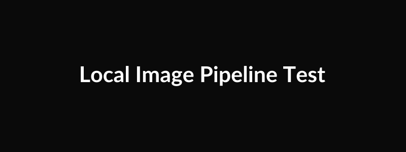
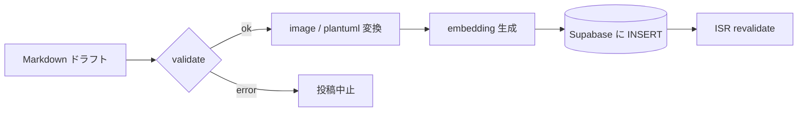
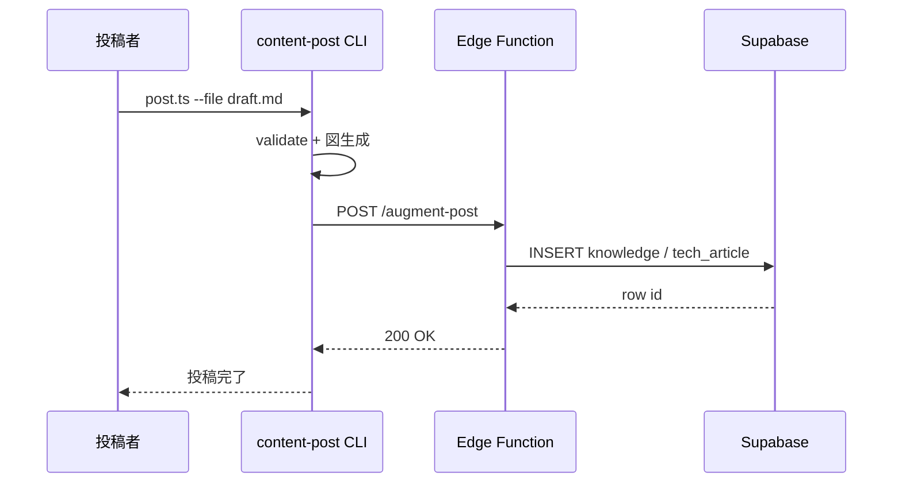
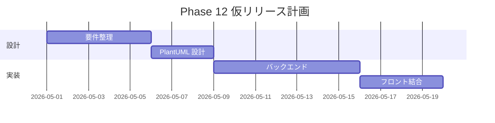
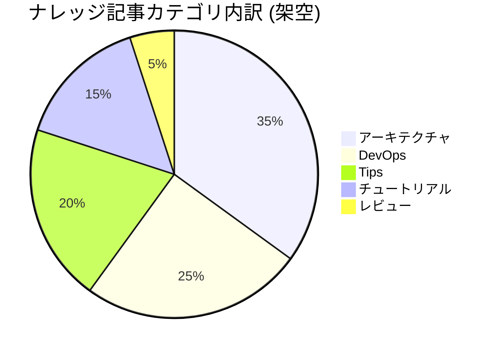
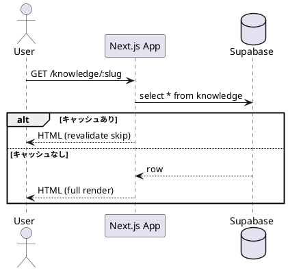
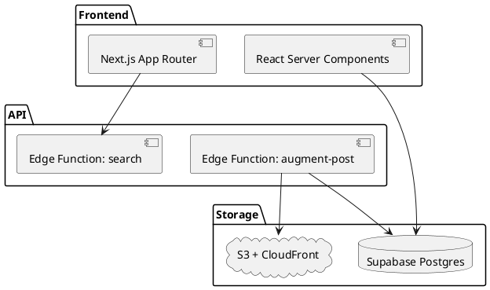
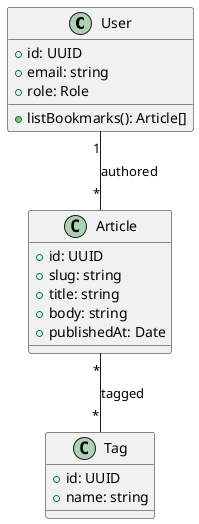
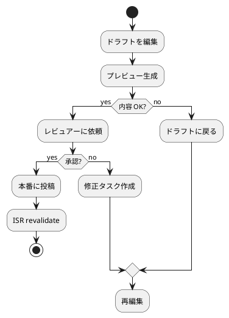

# レンダリングパターン総合テスト — 画像 + Mermaid + PlantUML 全図種

## 1. この記事の位置づけ

ClassLab. Weekly News の投稿パイプラインは、Markdown に書かれた本文・画像・図を自動で SVG / PNG / CDN URL に変換してから DB へ格納する。新しいレンダリング機能を入れたとき、あるいは依存ライブラリを更新したときに「何がどう壊れるか」を把握する起点として、対応する全種類の表現を 1 記事に集約しておくとリグレッションが取りやすい。

本記事ではローカル画像 1 枚・リモート画像 1 枚・Mermaid 4 種・PlantUML 4 種、計 10 個の埋め込み要素を扱う。それぞれの「期待される変換結果」と「閲覧時の見え方」を明記してあるので、サイト上で本文を開いて目視確認するだけで全レンダリング経路を一通り検証できる。

## 2. 本文画像 — ローカルとリモートの取り扱いの違い

ローカル画像は `drafts/` 直下に配置した相対パスで参照する。投稿時に image-processor が S3 にアップロードし、CloudFront URL に置換するため、本番 DB の `body` には CDN URL だけが残る。

リモート画像は外部 URL のまま埋め込む。パイプラインは外部ホストに対する再アップロードはせず、URL をそのまま通過させる。CSP の `img-src` 許可リストに該当ドメインが含まれているかが実質的なゲートになる。

確認したいのは、ローカル画像が CloudFront ドメイン (`*.cloudfront.net` など) に書き換わっていること、リモート画像は `placehold.co` のまま残っていることの 2 点。

## 3. Mermaid — 4 種類の図種

Mermaid は client-side レンダリングで `<pre class="mermaid">` を `<svg>` に変換する想定。図ごとに「何を表現しているか」と「テストの意図」を併記する。

### 3.1 flowchart — 投稿パイプラインの簡略フロー

ドラフト Markdown が DB レコードに変換されるまでの主要ステップを左→右で示す。条件分岐とノードラベルがちゃんと折り返されるかを見る。

### 3.2 sequenceDiagram — 投稿者から DB までの API 呼び出し

縦のアクター列と矢印、自己ループ (`->>` から同名アクター) が崩れずに描画されるかを確認する。

### 3.3 gantt — 架空のリリーススケジュール

ガントチャートはタスク・期間・依存の 3 軸を描く。ここでは仮の Phase 12 リリースを 4 タスクで構成し、軸ラベルと色帯がモノトーンで読めるかを見る。

### 3.4 pie — ナレッジカテゴリの架空内訳

円グラフはラベルと割合のみのシンプルな構造。文字色 (黒) と背景 (白) のコントラスト、凡例位置を確認する。

## 4. PlantUML — 4 種類の図種

PlantUML は投稿時にサーバーサイドで SVG にレンダリングし、SHA-256 ベースのキャッシュキーで S3 に保存される。テーマは投稿パイプラインが `!theme blueprint` を自動付与するため、本文側では指定しない。

### 4.1 sequence — リクエスト処理の順序

ユーザー操作からレスポンスまでの 1 リクエストを縦の時系列で描く。`alt / else` ブロックが正しく囲まれることを確認する。

### 4.2 component — システム構成の俯瞰

フロント / API / Storage の 3 層を箱で表現し、矢印で依存方向を示す。コンポーネント間の境界線とラベルの折返しを確認する。

### 4.3 class — ドメインモデル

ドメインの主要エンティティを 3 クラスで描き、関連 (`*--` / `--`) と多重度を示す。フィールド・メソッドの段落区切り線が出ていることを確認する。

### 4.4 activity — 編集から公開までの業務フロー

業務フローを縦のアクティビティ図で描く。条件分岐 (`if / else`) と再ループのアローが崩れないかを確認する。

## 5. 検証ポイント

投稿後、サイトと Supabase の `knowledge.body` カラムを開いて以下を順に確認する。

- [ ] ローカル画像が CloudFront ドメインに置換されている (`./rendering-test-local.png` が消えている)
- [ ] リモート画像は `placehold.co` URL のまま残っている
- [ ] Mermaid 4 種 (`flowchart` / `sequenceDiagram` / `gantt` / `pie`) が SVG として表示されている
- [ ] PlantUML 4 種 (`sequence` / `component` / `class` / `activity`) が blueprint テーマで描画されている
- [ ] 各 `` の `alt` が元の Markdown キャプションを保持している
- [ ] DB の `body` に生の `@startuml` ブロックが残っていない (S3 URL に置換されている)

ここまで全て緑なら、画像・Mermaid・PlantUML の 3 経路が想定どおり機能していると判断できる。新しい図種を増やしたときは、この記事の章を一つ足して同じ要領で並べておくと、毎回 fresh な検証記事を立てる必要がなくなる。
