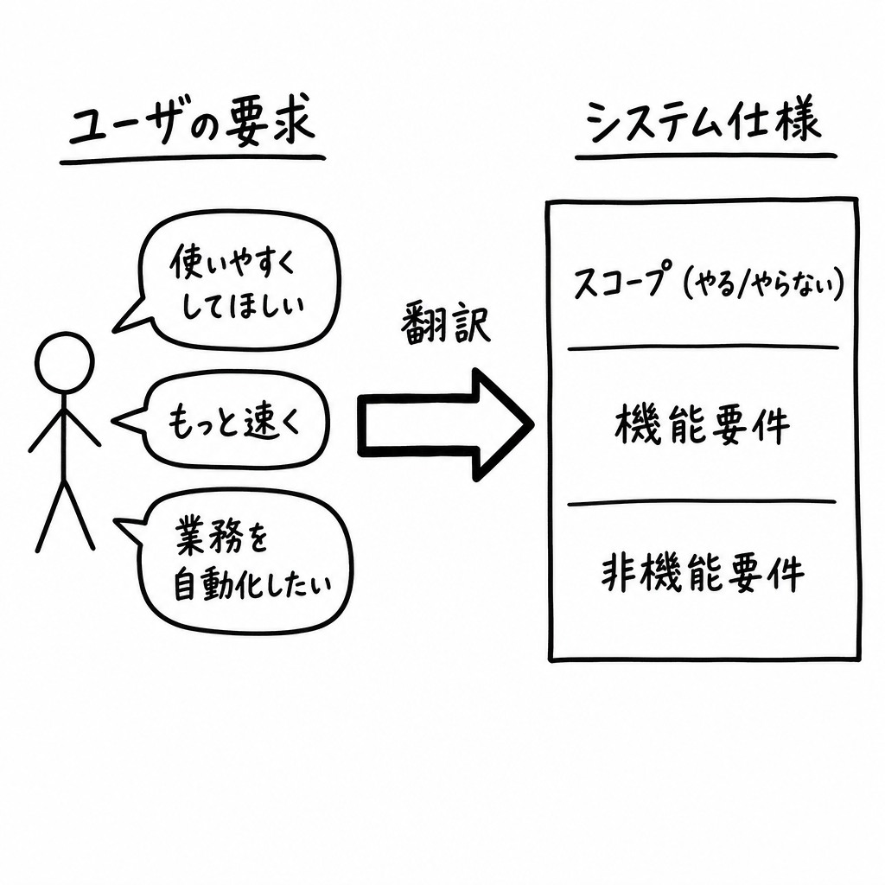
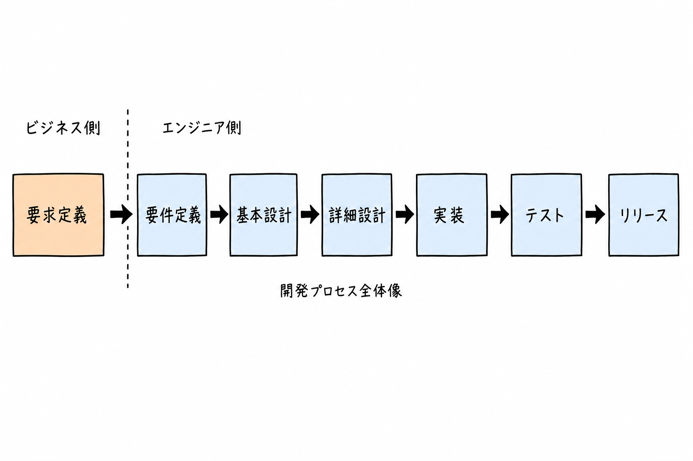
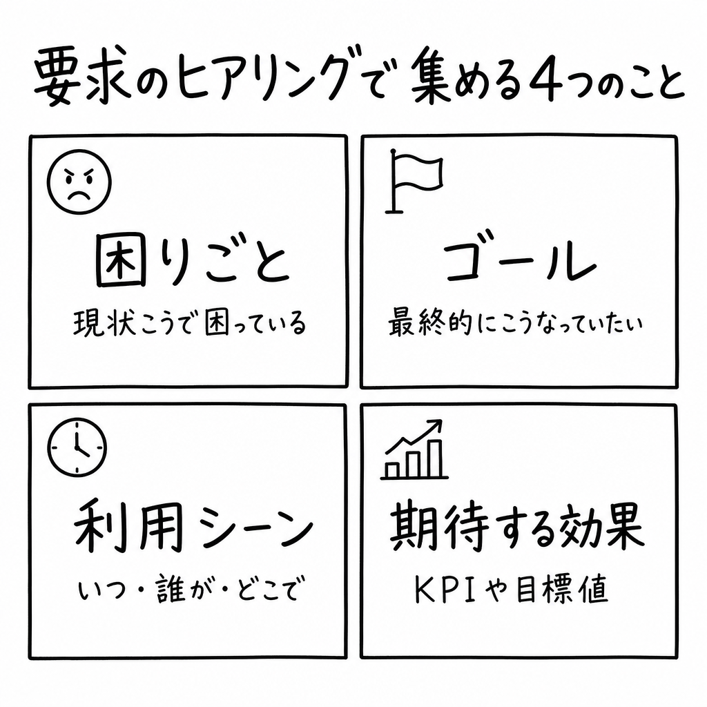
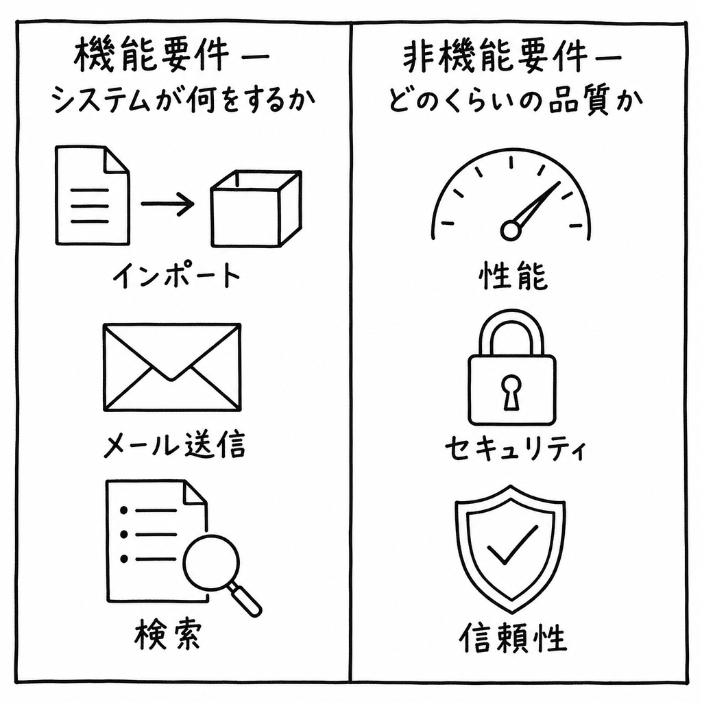

**対象**: 開発プロセスを最初から最後まで自分で回す必要が出てきた Jr. エンジニア / これから要件定義を任されそうな若手
**ゴール**: 「要求定義」と「要件定義」を区別して説明でき、要件定義書に最低限書くべき項目（機能要件・非機能要件）を自力で書き出せる状態になる

---

## 0. はじめに — なぜこの 2 つを混ぜると現場が壊れるのか

新人のうちは「要求」も「要件」も同じ「やりたいことリスト」に見えがちです。実際、現場でも口頭では混ぜて使われます。

ただ、開発プロジェクトが燃えるパターンの大半はここで起きます。

- ユーザ「**もっと使いやすくしてほしい**」 ← 要求
- エンジニア「**承知しました、UI を全部リニューアルします**」 ← 勝手に要件化した

ユーザはログインボタンが小さいだけだったかもしれない。なのに 3 ヶ月の UI 全リニューアル案件が走り出してしまう。

要求と要件を分けるのは、**「ユーザが言ったこと」と「我々が作ると約束したこと」を別ドキュメントで管理する**ための仕組みです。

---



## 1. 1 行で言うと

| 工程 | 1 行定義 | 主な担い手 |
|------|---------|-----------|
| **要求定義** | ユーザ・事業側が「**こうしたい / こう困っている**」を集める | 事業部 / PdM / 営業 / ユーザ本人 |
| **要件定義** | その要求を **「何を作って、何を作らないか」のシステム仕様** に翻訳する | エンジニア / SE / PM |

つまり要求定義は **「Why / What を聞く」** 工程、要件定義は **「What / How まで書き切る」** 工程です。

---

## 2. 開発プロセス全体での位置づけ

エンジニアが関わる開発プロセス（ウォーターフォール寄りに整理）は、ざっくり次の流れになります。



ポイントは **要求定義はビジネスサイド寄り、要件定義から先がエンジニアの責任範囲** だということ。

要件定義はその境界線にあるので、両側の言語を翻訳する一番ストレスの大きい工程です。だからこそ、ここをきっちりやれる人がプロジェクトの成否を握ります。

---

## 3. 要求定義とは

### 3-1. 目的

ユーザ・事業側が **「現状こうで、こうしたい」** を言語化する工程。

ヒアリングで集めるのは **「手段ではなく目的のレベル」** の情報です。具体的には次の 4 つのカテゴリを必ず網羅します。



- **困りごと（pain）** — 「いま、何にどれだけ時間 / 工数 / 機会損失が出ているか」を **数値で**。「面倒」「大変」だけで終わらせない
- **ゴール（goal）** — 「実現したらどんな状態になっていたいか」を **動詞ではなく状態で**。「自動化したい」ではなく「金曜夜に手作業がゼロになっている」
- **利用シーン（context）** — いつ / 誰が / どこで / どの頻度で。週次か日次か、PC か外出先か、で要件は丸ごと変わる
- **期待する効果（KPI）** — 残業時間 -10h/月、エラー件数 -50% など、**完了判定可能な指標** に落とす

この 4 軸を埋められない要求は、まだ「言語化が足りない」という意味です。**要件定義に進む前に必ずユーザに戻して詰める** こと。

### 3-2. 要求は「手段」ではなく「目的」で書く

要求定義の最大の落とし穴が **「ユーザがすでに手段を提案してくる」** ことです。

| ユーザの口から出る言葉 | 本当の要求 |
|---|---|
| 「Excel をやめたい」 | Excel で困っている真因（属人化 / 重い / 共有不可）は何か |
| 「ボタンをもう 1 個追加してほしい」 | そのボタンで何をしたい業務シーンか |
| 「AI を使ってなんとかしたい」 | どの作業のどの工数を減らしたいか |

**手段はユーザの最初の思いつき** にすぎません。要求定義の役割は、その手段の **裏にある困りごとと達成したいゴール** まで掘り下げることです。

掘り下げ方の常套手段は **「なぜ？」を 3〜5 回繰り返す（5 Whys）** です:

- ユーザ:「Excel をやめたい」
- なぜ? →「金曜夜の手集計が辛い」
- なぜ辛い? →「3 時間かかって帰れない」
- なぜ 3 時間かかる? →「店舗ごとにフォーマットが違って手で揃えている」
- → 真の要求: **店舗別フォーマットの統一 or 取込時の自動正規化**（必ずしも Excel 廃止ではない）

### 3-3. 成果物

- 要求一覧（要求番号 / 要求内容 / 重要度 / 起票者）
- ユーザストーリー or ペルソナ
- 業務フロー（As-Is / To-Be）

「要求番号」は **必ず通し番号で振る**。後の要件定義書 / テストケース / 受入チェックリストすべてが、この要求番号にトレースバックする形になります。

### 3-4. 例

「営業担当が、毎週金曜の夜に **顧客リストを Excel で手集計** している。これを **自動化して残業を減らしたい**」

これが要求。**「Excel をやめろ」「自動化しろ」が要件ではない** ことに注意。

「自動化」と聞いてエンジニアがすぐ「じゃあバッチ処理を組みます」と動くと、実はユーザが本当に欲しかったのは **「金曜夜にダッシュボードが見られればいい」** だけだった、ということが起きます。

要求定義の段階で **「最終的にどんな状態になっていたいか」** をユーザに言語化してもらえれば、エンジニア側はその状態を満たす一番安いソリューションを選べる。これが要求定義をきっちりやる最大のリターンです。

---

## 4. 要件定義とは

### 4-1. 目的

要求を受け取り、**「我々のシステムでは、これを作る／これは作らない」** を確定する工程。

ここで決まったことが、設計・実装・テスト・受入の **すべての基準** になります。

### 4-2. 成果物

- 機能一覧 / 非機能一覧
- スコープ定義（やる / やらない）
- 業務フロー（システム化後）
- 画面遷移 / 画面項目
- データ項目 / I/O 一覧
- 制約条件（法令・社内規定・既存システム連携）

### 4-3. 「何をして、何をしないのか」を必ず書く

要件定義書で **一番もめるのが「やらない」の明文化** です。書かないとリリース直前に「これも当然入ってると思ってた」になります。

```text
[やる]
- 顧客リストを CSV インポートし、システム上の顧客マスタに反映する
- インポート時のバリデーションエラーは画面に一覧表示する
- 重複は「メールアドレス」をキーに自動マージする

[やらない]
- 既存基幹システムへの自動連携（手動 CSV エクスポート運用とする）
- スマートフォンからのインポート（PC ブラウザのみ対応）
- インポート結果のメール通知（v2 以降で検討）
```

このスコープアウト記述が、後の追加要望を「v2 で対応」と切り返すための盾になります。

---

## 5. 要求 と 要件 の違いを 1 つの例で

| 観点 | 要求 | 要件 |
|------|------|------|
| 主語 | 「ユーザは」 | 「システムは」 |
| 粒度 | 解決したいこと | 作るもの |
| 例 | 顧客リストの集計を自動化したい | CSV を 1 日 1 回 03:00 にバッチ取込し、集計テーブルを更新する |
| 検証方法 | ユーザが「困りが消えた」と言うか | テストケースが PASS するか |
| 変更頻度 | 比較的安定 | 設計検討で頻繁に動く |

---

## 6. 主な要件定義内容（チェックリスト）

要件定義書に **最低限書くべき項目** を、機能要件 / 非機能要件に分けて整理します。



### 6-1. 機能要件 — 「システムが何をするか」

機能要件は **業務上の処理 1 つ 1 つ** を指します。代表的なものを挙げます。

> **注記**: ここに挙げる項目は **あくまで一例** です。プロジェクトの業務領域（業務系 / EC / SaaS / 基幹系 など）によって必要な機能要件は大きく変わるため、自分のプロジェクトでは該当しないものを落とし、足りないものを追加してください。

#### 6-1-a. 入力 / インポート機能

- データ取込元（CSV / Excel / 外部 API / 手入力）
- 取込頻度（リアルタイム / 1 日 1 回 / 月次）
- 取込件数の最大値（1 ファイル 10 万行など）
- バリデーションルール（必須項目 / 文字種 / 桁数 / 重複チェック）
- エラー時のリカバリ（全件ロールバック / 行単位スキップ）

#### 6-1-b. 出力 / 通知機能（メール送信、エクスポートなど）

- 送信トリガ（イベント駆動 / スケジュール）
- 宛先（ユーザ自身 / 管理者 / 取引先）
- テンプレート（HTML / プレーンテキスト）
- 添付ファイルの上限
- 送信失敗時の再送ポリシー（最大 3 回 / 24 時間以内）

#### 6-1-c. 検索 / 一覧 / 詳細表示

- 検索条件（キーワード / 期間 / 担当者）
- 表示件数 / ページング / ソート
- 出力形式（画面 / CSV / PDF）

#### 6-1-d. データ更新 / 削除

- 更新可能な項目と権限
- 物理削除 / 論理削除
- 履歴の保持有無

#### 6-1-e. 認証 / 認可

- 認証方式（ID/PW / SSO / 多要素）
- ロール定義
- 操作ログ

### 6-2. 非機能要件 — 「どのくらい / どんな品質で」

機能が同じでも、非機能要件次第でアーキテクチャが丸ごと変わります。**機能要件と同じ熱量で書く** のが鉄則です。

#### 6-2-a. 性能要件（Performance）

- レスポンスタイム（画面表示 95% タイル 2 秒以内 など）
- スループット（ピーク時 1,000 req/min）
- 同時接続ユーザ数（最大 500 人）
- バッチ処理時間（10 万件を 30 分以内）

#### 6-2-b. セキュリティ要件（Security）

- 認証 / 認可ポリシー
- 通信暗号化（TLS 1.2 以上）
- 保存時暗号化（個人情報項目は AES-256）
- 監査ログ保持期間（最低 1 年）
- 脆弱性対策（OWASP Top 10、定期診断）
- 法令対応（個人情報保護法、GDPR、業界規制）

#### 6-2-c. 信頼性要件（Reliability）

- 稼働率（99.9% / 月）
- 障害復旧時間（RTO 4 時間以内）
- データ復旧ポイント（RPO 1 時間以内）
- バックアップ頻度・保管期間
- 冗長化方針（マルチ AZ / マルチリージョン）

#### 6-2-d. 可用性 / 拡張性 / 運用性（その他）

- メンテナンスウィンドウ
- 監視 / アラート要件
- ログ集約方針
- 想定データ量増加率（年 30% 増 など）

---

## 7. 要件定義書の最小テンプレ

新人がいきなり「要件定義書を書いて」と言われたとき、何もないと固まります。最低限これだけ埋めれば前に進む、というテンプレを置いておきます。

```text
1. 概要
   1.1 目的
   1.2 背景（紐づく要求番号）
   1.3 用語定義

2. スコープ
   2.1 やること
   2.2 やらないこと
   2.3 前提・制約

3. 業務フロー（To-Be）

4. 機能要件
   4.1 機能一覧
   4.2 各機能の詳細（入力・処理・出力）
   4.3 画面・帳票一覧

5. 非機能要件
   5.1 性能
   5.2 セキュリティ
   5.3 信頼性 / 可用性
   5.4 運用 / 保守

6. 外部インタフェース
   6.1 連携先システム
   6.2 連携データ・タイミング

7. データ要件
   7.1 主要エンティティ
   7.2 データ量見積

8. 移行要件
   8.1 既存データ移行範囲
   8.2 移行方式
```

---

## 8. よくあるアンチパターン

### 8-1. 要求をそのまま要件として書く

「使いやすくする」「速くする」をそのまま要件にしないこと。**測定可能な数値か、具体的な機能仕様** に必ず落とす。

NG: 「画面表示は速くすること」
OK: 「商品一覧画面の初期表示は、本番想定データ 10 万件において 95% タイルで 2.0 秒以内」

### 8-2. 非機能要件を「特に無し」にする

エンドユーザは非機能を口に出しません。「**書かれていない非機能 = ベストエフォート**」になり、後で性能問題が出ると揉めます。
最低でも **性能・セキュリティ・信頼性の 3 軸** はゼロでも数字を入れること。

### 8-3. やらないことを書かない

スコープアウトは **要件定義書の中で最も価値のあるページ** です。書かないと無限に追加要望が乗ります。

### 8-4. ユーザに見せず机上で完成させる

要件定義書はエンジニアの納品物ではなく **ユーザとの契約書** です。必ず読み合わせをして、合意の証跡を残すこと。

---

## 9. まとめ

- **要求定義** = ユーザの「こうしたい」を集める。Why / What。事業サイド主導。
- **要件定義** = それを「作る / 作らない」の仕様に翻訳する。What / How。エンジニア主導。
- **境界を曖昧にすると、後工程すべてに歪みが伝播する**。
- 要件定義書には **機能要件と非機能要件（性能・セキュリティ・信頼性）を同じ熱量で** 書く。
- 「**やらないこと**」を明文化することが、追加要望に対する一番強い盾になる。

要件定義は「**書く力**」より「**確定させる力**」の工程です。最後まで決まらないものを、関係者を巻き込んで決め切るところに価値があります。
