> Postgres を中核に、Auth / Storage / Realtime / Edge Functions / Vector を 1 プラットフォームで提供する Open Source Backend。Firebase の簡潔さと Postgres の柔軟性を両立させたい開発者向け。

---

## 0. TL;DR

- Supabase は **"Postgres Development Platform"** を旗印に、フロント・モバイル・AI アプリの裏側を 1 プロジェクトで完結させる Open Source BaaS。
- 2026 時点で **5M developers / 10M databases**、GitHub・Meta・Netflix・Microsoft も採用。
- **旧知識との差分（LLM 訓練データを上書き）**
  - pgvector のインデックスは **HNSW がデフォルト**（旧: IVFFlat）。`halfvec` で 16bit 量子化、Matryoshka embeddings で次元削減対応。
  - Edge Functions は **Cron / Queues (pgmq) / Background Tasks** を統合済み。単発実行モデルではない。
  - **Supabase Cron** が Postgres Module として GA。SQL から Edge Functions / Webhook を呼べる。
  - **Database Branching** が SaaS 開発の標準フロー（PR ごとに DB ブランチを作成）。
  - **Pro プランは Spend Cap デフォルト ON**。意図的にオフにしないと従量課金されない（旧: 予算超過事故が起きやすかった）。
  - **Team プラン $599** で SOC2 / ISO 27001 / 14 日 PITR バックアップが付く。
  - **Vault** が Postgres extension として secrets / encryption を標準提供。
  - **Vercel Marketplace 経由でのプロビジョン**が可能になり、Vercel との課金統合 OK。
- **最大差別化点**: Firebase より「Postgres の柔軟性 + Row Level Security」、Neon より「Auth/Storage/Realtime バンドル」、PlanetScale より「Postgres + 無料枠あり」、AWS Amplify より「OSS + セルフホスト可能」。

---

## 1. Supabase とは何か — 理念とミッション

### 1.1 ミッション

> **"Build in a weekend, scale to millions."**
> Firebase レベルの簡潔さを保ったまま、Postgres レベルの柔軟性を提供する。

### 1.2 哲学

| 表現 | 意味 |
|---|---|
| **"Open Source Firebase Alternative"** | Firebase の DX を再現しつつ、ベンダーロックインを排除。AGPL OSS + 自己ホスト可能。 |
| **"Postgres lens"**（Paul Copplestone） | あらゆる機能は Postgres という単一の源泉に従属。Auth も Storage も Realtime も Postgres 上で表現される。 |
| **"Composable / Portable / Integrated"** | 既存標準（Postgres / PostgREST / GoTrue / S3 互換）を組合せ、移植性とロックイン回避を両立。 |
| **"No outbound sales"**（Paul Copplestone） | プロダクトを試して気に入ったらアップグレード。インバウンド一本のセールスモデル。 |

### 1.3 なぜ存在するか

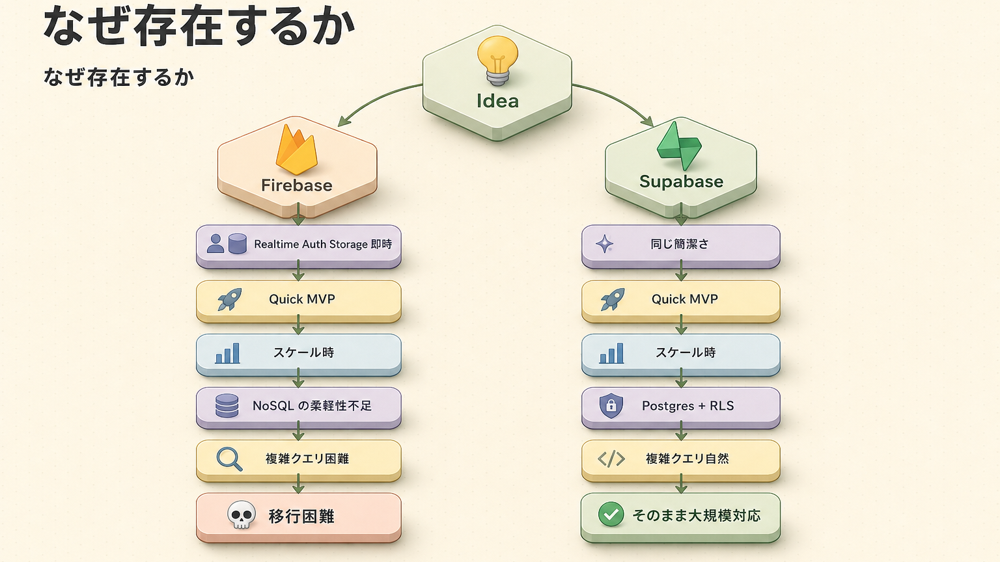

**Firebase が "実は NoSQL の檻" だった問題を、Postgres を中核に据えて解決する** ─ Paul Copplestone の起業ストーリーそのもの。

### 1.4 エンジニアにとっての意味

| 立場 | Supabase が解くこと |
|---|---|
| フロントエンド | `supabase-js` 1 行で Auth / DB / Realtime / Storage が動く。Firebase 移行も容易。 |
| バックエンド | Postgres そのものが手に入る。複雑な JOIN / window function / extension をフル活用可能。RLS で認可をスキーマに埋め込める。 |
| AI エンジニア | pgvector が既定。RAG / 類似検索が外部ベクトル DB なしで完結。Edge Functions + Cron + Queue で embedding 生成パイプライン構築可能。 |
| SRE / インフラ | 自己ホスト可能（Docker / k8s）。マネージドでも PITR / Read Replica / BYO Cloud（Enterprise）対応。 |
| PdM / リード | Branching で機能ごとに環境分離。Studio で SQL 知らないメンバーも DB 閲覧。 |

---

## 2. 全体マップ（1 枚絵）

### 2.1 サービス全体俯瞰

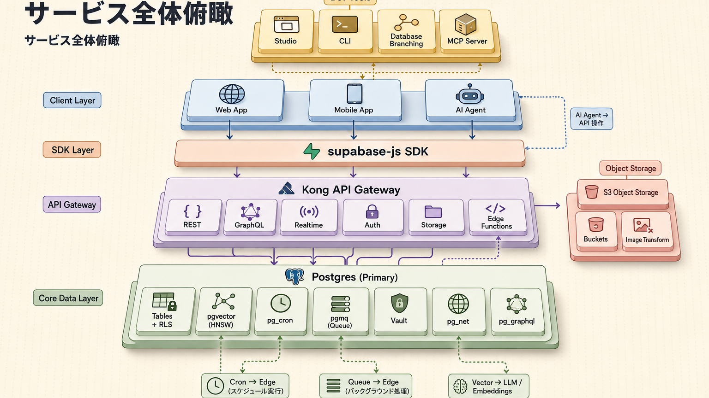

### 2.2 製品カテゴリ Mindmap

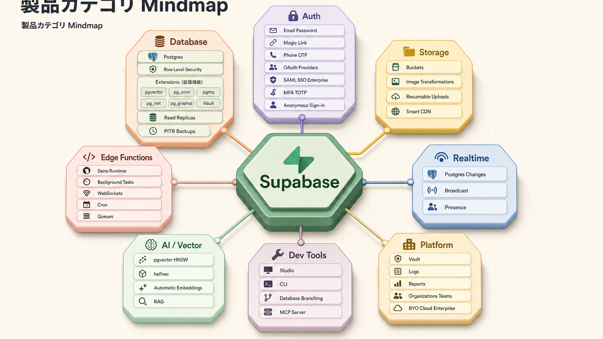

---

## 3. プラン体系の前提知識

### 3.1 プラン概要表

| 軸 | **Free** | **Pro** | **Team** | **Enterprise** |
|---|---|---|---|---|
| 料金 | $0 | $25/月 + 従量 | $599/月 + 従量 | カスタム |
| プロジェクト数 | 2（非アクティブ 1週で停止） | 無制限 | 無制限 | 無制限 |
| DB ストレージ | 500 MB | 8 GB 含み | 8 GB 含み | 契約 |
| MAU | 50,000 | 100,000 含み | 100,000 含み | 契約 |
| ファイル Storage | 1 GB | 100 GB 含み | 100 GB 含み | 契約 |
| Realtime 同時接続 | 200 | 500 | 500 | 契約 |
| Egress | 5 GB | 250 GB 含み | 250 GB 含み | 契約 |
| Backup | 7 日 (Pro 以上) | 7 日 PITR | 14 日 PITR | カスタム |
| SOC2 / ISO 27001 | 不可 | 不可 | 利用可 | 利用可 |
| HIPAA | 不可 | 不可 | 不可 | 利用可 |
| サポート | コミュニティ | チケット | Priority | 専用 24/7 |
| **Spend Cap** | — | デフォルト ON | デフォルト ON | カスタム |
| BYO Cloud | 不可 | 不可 | 不可 | 利用可 |

### 3.2 課金モデル

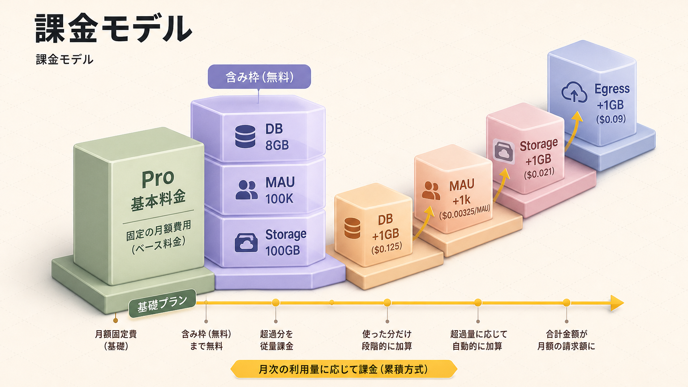

- **Spend Cap デフォルト ON** = 含み枠内なら絶対に超過課金されない。停止して安全。
- 超過したい場合は明示的に Spend Cap を OFF にする（意図しない請求の事故を防ぐ）。

### 3.3 プラン表記凡例

| 記号 | 意味 |
|---|---|
| 利用可 | プラン標準で利用可能 |
| 制限あり | 制限付き / Beta / 一部機能のみ |
| 不可 | 利用不可 |
| 従量課金 | 標準で含まれるが超過は従量課金 |

---

## 4. 機能カタログ

### 4.1 Database — Postgres + RLS

#### 4.1.1 Postgres 本体

**🎯 概要**

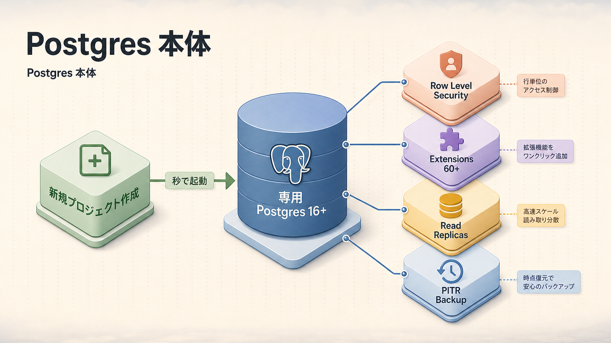

各プロジェクトに **専用の Postgres インスタンス** を払い出し。共有 DB ではない。

**👨‍💻 エンジニアへの関係**

- 「フルマネージド Postgres」が裏側にあると分かれば、ORM・複雑 JOIN・トランザクション・ストアド・トリガが全部使える。
- 既存 Postgres 知識・ツール（psql / pgAdmin / Drizzle / Prisma）がそのまま使える。

**💳 利用可能プラン**

| Free | Pro | Team | Enterprise |
|:-:|:-:|:-:|:-:|
| 500MB | 8GB 含 | 8GB 含 | 契約 |

**🏢 ClassLab. での活用**

- 短期: 雑務スキル群のメタデータ DB（job log / config）を Free or Pro で集約。
- 中長期: ライフライン申込・顧客マスタの primary DB として採用検討。

**🔥 差別化点**

| | Supabase | Firebase (Firestore) | Neon | PlanetScale |
|---|:-:|:-:|:-:|:-:|
| Postgres | 利用可 | (NoSQL) | 利用可 | (MySQL) |
| Auth/Storage 同梱 | 利用可 | 利用可 | 不可 | 不可 |
| RLS でマルチテナント | 利用可 | (rules) | (pure PG) | 制限あり |
| 自己ホスト OSS | 利用可 | 不可 | 制限あり | 不可 |

**🔍 深掘り**

- Connection pooling は Supavisor（Elixir 製、PgBouncer の置き換え）。
- 拡張は Studio から GUI で有効化可能（`uuid-ossp` / `pg_stat_statements` / `pg_trgm` 等）。

**⚠️ 注意点**

- Free プランは **1 週間無操作で自動停止**。継続開発しない PoC は注意。

---

#### 4.1.2 Row Level Security (RLS)

**🎯 概要**

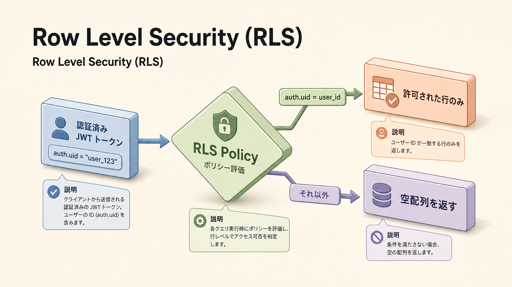

Postgres 標準機能。各テーブルにポリシーを SQL で書き、JWT クレームを参照して行レベル認可。

**👨‍💻 エンジニアへの関係**

- フロントから直接 DB を叩いても認可漏れが起きない。バックエンド層を薄くできる。

**💳 利用可能プラン**

| Free | Pro | Team | Enterprise |
|:-:|:-:|:-:|:-:|
| 利用可 | 利用可 | 利用可 | 利用可 |

**🏢 ClassLab. での活用**

- 短期: マルチテナント管理画面でテナント ID を JWT クレームに含め、RLS 一発で全テーブル分離。
- 中長期: 顧客毎のライフライン契約データ閲覧権限を SQL ポリシーで管理。

**🔥 差別化点**

- Firebase Security Rules はカスタム DSL。Supabase RLS は **標準 SQL** = どの Postgres ツールでも検証可能。

**🔍 深掘り**

```sql
create policy "Users can only see their own rows"
on contracts for select
using (auth.uid() = user_id);
```

**⚠️ 注意点**

- RLS を **有効化し忘れる**と全公開になる事故が多発。テーブル作成時に必ず `enable row level security`。

---

#### 4.1.3 Extensions（pgvector / pg_cron / pgmq / pg_net / pg_graphql / Vault）

**🎯 概要**

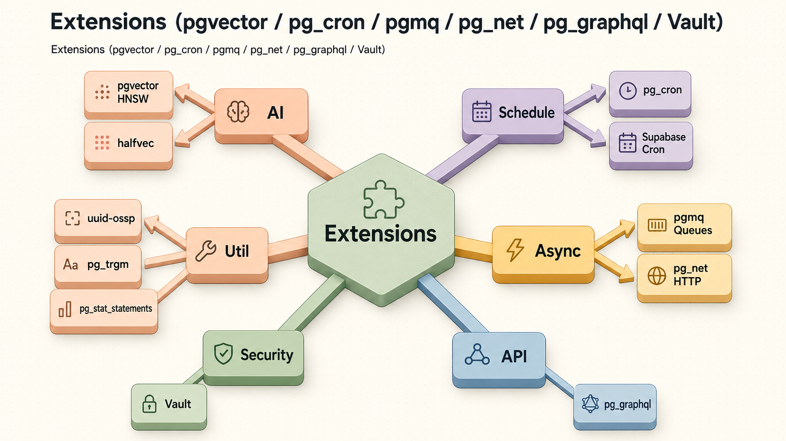

60+ の拡張をワンクリック有効化。

**💳 利用可能プラン**

| Free | Pro | Team | Enterprise |
|:-:|:-:|:-:|:-:|
| 利用可 | 利用可 | 利用可 | 利用可 |

**🔍 深掘り**

- `pg_net` で Postgres トリガから HTTP 呼出 → Edge Functions / 外部 API へ連動できる（"Postgres lens" の真骨頂）。

---

### 4.2 Auth

**🎯 概要**

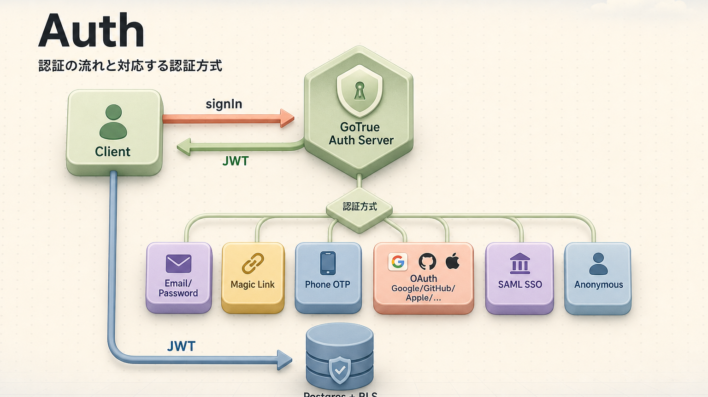

Email/Password、Magic Link、Phone OTP、20+ OAuth、SAML SSO、匿名サインイン、MFA (TOTP)。`auth.users` テーブルが Postgres 内に存在し、RLS と直接統合。

**👨‍💻 エンジニアへの関係**

- 認証 SaaS（Auth0 / Clerk）の代わりに、DB と同じプラットフォームで完結。
- JWT のクレームを RLS で直接参照できる = 認可ロジックが SQL に一元化。

**💳 利用可能プラン**

| 機能 | Free | Pro | Team | Enterprise |
|---|:-:|:-:|:-:|:-:|
| Email/Password | 利用可 | 利用可 | 利用可 | 利用可 |
| Magic Link | 利用可 | 利用可 | 利用可 | 利用可 |
| OAuth (20+) | 利用可 | 利用可 | 利用可 | 利用可 |
| Phone OTP | SMS 費用別 | 従量課金 | 従量課金 | 従量課金 |
| MFA TOTP | 利用可 | 利用可 | 利用可 | 利用可 |
| **SAML SSO** | 不可 | 不可 | 制限あり | 利用可 |
| **MAU 含み枠** | 50K | 100K | 100K | 契約 |
| 超過 MAU | — | $0.00325/MAU | $0.00325/MAU | 契約 |

**🏢 ClassLab. での活用**

- 短期: 社内ツールの SSO ログイン（Google OAuth）即時導入。
- 中長期: ライフライン顧客向けマイページの認証基盤、Salesforce 連携 SSO。

**🔥 差別化点**

| | Supabase Auth | Firebase Auth | Auth0 | Clerk |
|---|:-:|:-:|:-:|:-:|
| DB と同居 (RLS) | 利用可 | 制限あり | 不可 | 不可 |
| OSS / 自己ホスト | 利用可 | 不可 | 不可 | 不可 |
| 100K MAU 込料金 | $25 | $0〜 | $240+ | $25〜 |
| 匿名サインイン | 利用可 | 利用可 | 制限あり | 制限あり |

**🔍 深掘り**

- 匿名サインイン → Email 紐付け昇格が可能（"ゲストで使い始めて後でアカウント作成" のフロー実現）。

**⚠️ 注意点**

- SMS 送信は外部プロバイダ（Twilio / MessageBird）連携で料金別。日本語 SMS は要 SMS 用署名。

---

### 4.3 Storage

**🎯 概要**

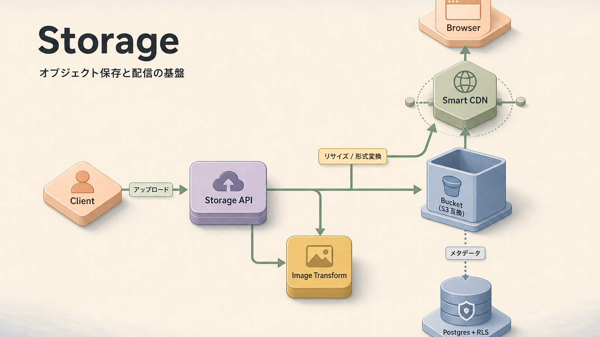

S3 互換オブジェクトストレージ + Smart CDN + Image Transformation。Bucket の権限は Postgres RLS で制御。

**👨‍💻 エンジニアへの関係**

- ファイルメタデータが Postgres に乗るので、JOIN で「ユーザーごとのファイル一覧」等が SQL で取れる。
- レジューム可能アップロード（TUS）が標準サポート、巨大ファイル対応。

**💳 利用可能プラン**

| Free | Pro | Team | Enterprise |
|:-:|:-:|:-:|:-:|
| 1GB | 100GB 含 | 100GB 含 | 契約 |

**🏢 ClassLab. での活用**

- 短期: 雑務スキルの画像中間保存（OG 画像生成・記事サムネ）。
- 中長期: ライフライン申込時の本人確認書類（運転免許/保険証）保管庫、RLS で本人のみ閲覧。

**🔥 差別化点**

- Firebase Storage: GCS ベース、metadata は別管理。
- Supabase Storage: **メタデータが Postgres に乗る** = SQL で検索/JOIN 可能。

**🔍 深掘り**

- Image Transformation の URL クエリパラメータで `?width=400&quality=80&format=webp` のように on-the-fly。

---

### 4.4 Realtime

**🎯 概要**

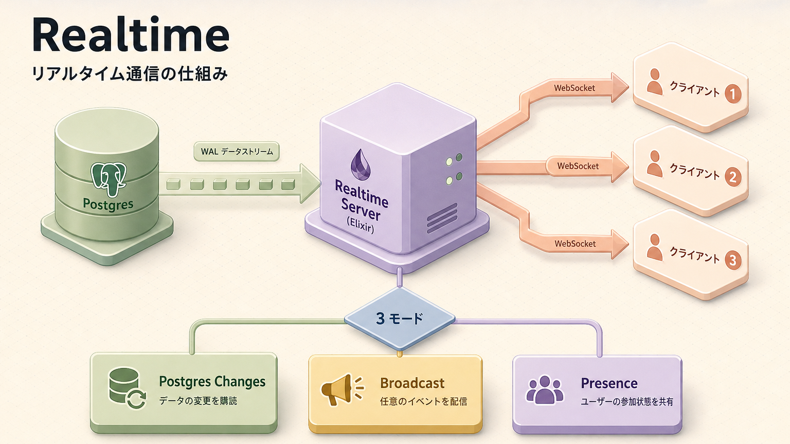

3 種類のリアルタイム機能:

1. **Postgres Changes**: INSERT/UPDATE/DELETE を WAL から購読
2. **Broadcast**: チャンネルへ任意イベントを送受信
3. **Presence**: オンラインユーザー状態同期

**👨‍💻 エンジニアへの関係**

- Pusher / Ably / Socket.io を別途契約する必要なし。
- DB 変更を WebSocket に流すパイプラインを自前で書く必要なし。

**💳 利用可能プラン**

| 同時接続 | Free | Pro | Team | Enterprise |
|---|:-:|:-:|:-:|:-:|
| 接続数 | 200 | 500 | 500 | 契約 |
| メッセージ数/月 | 2M | 5M | 5M | 契約 |

**🏢 ClassLab. での活用**

- 短期: 内部ダッシュボードのライブ更新（雑務スキル実行状況の可視化）。
- 中長期: ライフライン申込の進捗ライブ表示、教育プロダクトの受講者進捗同期。

**🔥 差別化点**

- Firebase Realtime DB / Firestore リスナーと同等体験を、SQL の表現力と引き換えなく提供。

---

### 4.5 Edge Functions

**🎯 概要**

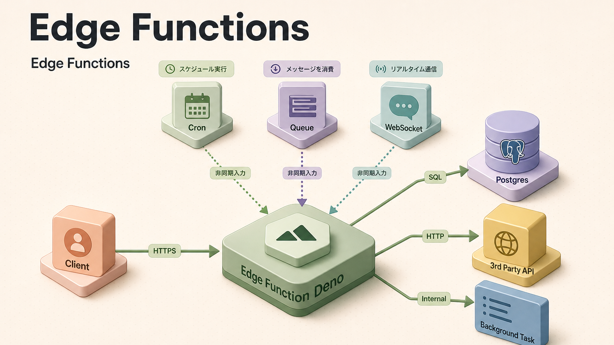

Deno ランタイムで動くサーバサイド TypeScript。グローバル分散。Background Tasks / WebSocket / Queue consume 対応。

**👨‍💻 エンジニアへの関係**

- 「PostgREST だけで足りない処理」（外部 API 呼出、Webhook、AI embeddings 生成）の置き場。
- npm パッケージは互換レイヤで一部利用可。

**💳 利用可能プラン**

| 呼出回数/月 | Free | Pro | Team | Enterprise |
|---|:-:|:-:|:-:|:-:|
| 含み枠 | 500K | 2M | 2M | 契約 |
| 超過 | — | $2/M | $2/M | 契約 |

**🏢 ClassLab. での活用**

- 短期: WP REST API への Webhook 中継、Salesforce 連携の薄いゲートウェイ。
- 中長期: AI 自動応答、書類 OCR 後処理、LLM embedding パイプライン。

**🔥 差別化点**

| | Supabase EF | Vercel Functions | Cloudflare Workers | Firebase Functions |
|---|:-:|:-:|:-:|:-:|
| Deno ネイティブ | 利用可 | (Node) | (V8 Isolate) | (Node) |
| DB ネイティブ統合 | 利用可 | 制限あり | 制限あり | 利用可 |
| Background Tasks | 利用可 | (waitUntil) | 利用可 | 制限あり |
| OSS で自己ホスト | 利用可 | 不可 | 不可 | 不可 |

**🔍 深掘り**

```ts
Deno.serve(async (req) => {
  // メインレスポンス
  const result = await processFast(req);
  // バックグラウンド継続
  EdgeRuntime.waitUntil(slowEmbeddingGeneration(req));
  return new Response(JSON.stringify(result));
});
```

**⚠️ 注意点**

- Cold start は Vercel Fluid より重い。レイテンシ要件厳しい用途は要計測。

---

### 4.6 AI / Vector — pgvector + Automatic Embeddings

**🎯 概要**

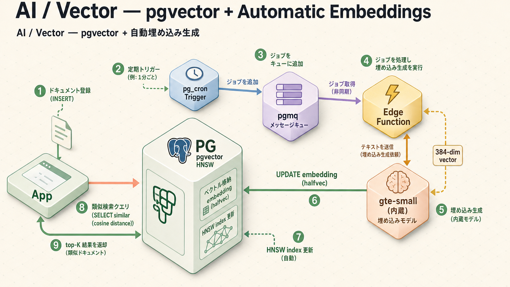

`pgvector` を既定有効化。`HNSW` インデックス + `halfvec` (16bit) + Matryoshka で大規模化対応。Edge Functions に **gte-small (384 次元) が同梱**、外部 API なしで embedding 生成可能。

**👨‍💻 エンジニアへの関係**

- 別途 Pinecone / Weaviate を契約せず、Postgres 1 本で RAG が組める。
- INSERT トリガで自動 embedding → 検索クエリが SQL で書ける。

**💳 利用可能プラン**

| Free | Pro | Team | Enterprise |
|:-:|:-:|:-:|:-:|
| DB 枠内 | 利用可 | 利用可 | 利用可 |

**🏢 ClassLab. での活用**

- 短期: 社内ナレッジ検索（議事録 / 申込書テンプレ）の RAG。
- 中長期: ライフライン契約条件の質問応答 bot、過去問合せからの類似事例提示。

**🔥 差別化点**

| | Supabase Vector | Pinecone | Weaviate | Firestore Vector |
|---|:-:|:-:|:-:|:-:|
| SQL JOIN 可能 | 利用可 | 不可 | 不可 | 制限あり |
| `halfvec` 16bit | 利用可 | 制限あり | 制限あり | 不可 |
| 内蔵 embedding model | gte-small | 不可 | 不可 | 不可 |
| RLS で行制限 | 利用可 | 不可 | 不可 | 制限あり |

**🔍 深掘り**

```sql
create index on documents using hnsw (embedding halfvec_cosine_ops);
select * from documents order by embedding <=> query_embedding limit 10;
```

**⚠️ 注意点**

- HNSW は memory 要求が高い。大規模時はメモリ見積もり必須。

---

### 4.7 Cron — Supabase Cron

**🎯 概要**

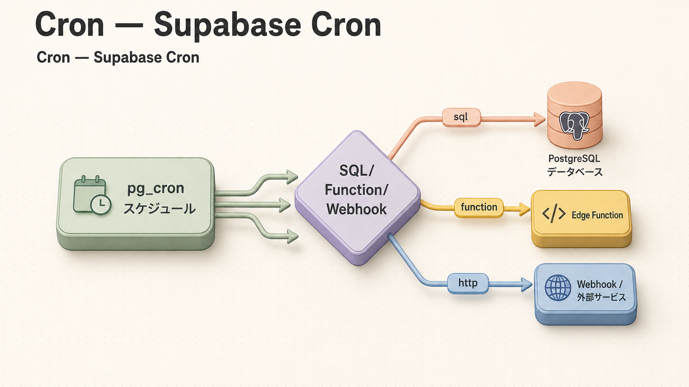

Postgres Module として動作。SQL スニペット / DB 関数 / Edge Function / 外部 Webhook を cron で起動。

**💳 利用可能プラン**

| Free | Pro | Team | Enterprise |
|:-:|:-:|:-:|:-:|
| 利用可 | 利用可 | 利用可 | 利用可 |

**🏢 ClassLab. での活用**

- 短期: 雑務スキルの定期実行（weekly-news 等）の置き場。
- 中長期: ライフライン日次集計、Salesforce 同期。

**🔥 差別化点**

- Firebase Scheduled Functions / Vercel Cron と異なり、**Postgres 内のデータ参照しながら**実行できる。SQL の世界で完結。

---

### 4.8 Queues — pgmq

**🎯 概要**

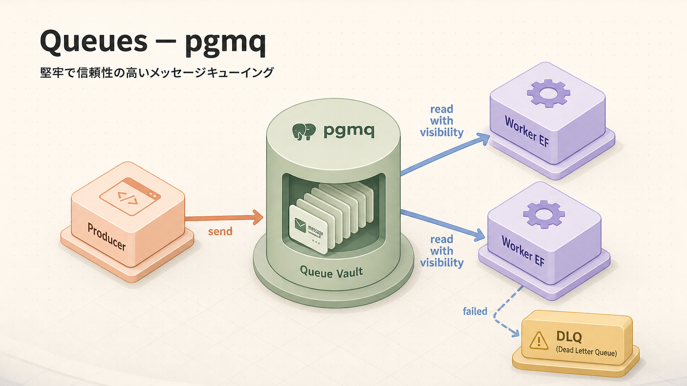

Postgres extension `pgmq` ベースの at-least-once メッセージキュー。Edge Functions の Background Tasks と組み合わせて非同期処理。

**💳 利用可能プラン**

| Free | Pro | Team | Enterprise |
|:-:|:-:|:-:|:-:|
| 利用可 | 利用可 | 利用可 | 利用可 |

**🏢 ClassLab. での活用**

- 短期: 大量メール送信 / PDF 生成のバックグラウンド化。
- 中長期: ライフライン申込時の与信 / 開通連絡の非同期パイプライン。

**🔥 差別化点**

- SQS / Cloud Tasks と異なり、**Postgres トランザクションと一体**で enqueue 可能（"DB 更新成功時のみ enqueue" がトランザクション保証される）。

---

### 4.9 Database Branching

**🎯 概要**

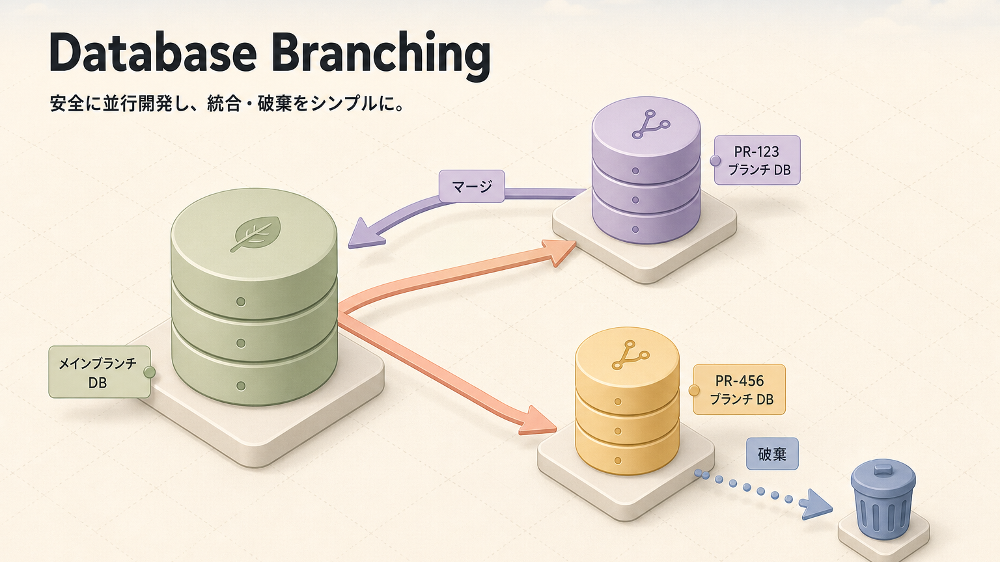

PR ごとに分離された DB ブランチを作成、マイグレーション検証後にマージ。

**💳 利用可能プラン**

| Free | Pro | Team | Enterprise |
|:-:|:-:|:-:|:-:|
| 不可 | 従量課金 | 従量課金 | 従量課金 |

**🏢 ClassLab. での活用**

- 短期: weekly-news 等のスキーマ変更時の PR ごと検証。
- 中長期: 全社プロダクトの DB マイグレーション安全網。

**🔥 差別化点**

- Neon の Branching が先行だが、Supabase は **Auth/Storage/RLS まで含んだプロジェクト全体**をブランチ化できる。

---

### 4.10 Auto-generated APIs — REST + GraphQL

**🎯 概要**

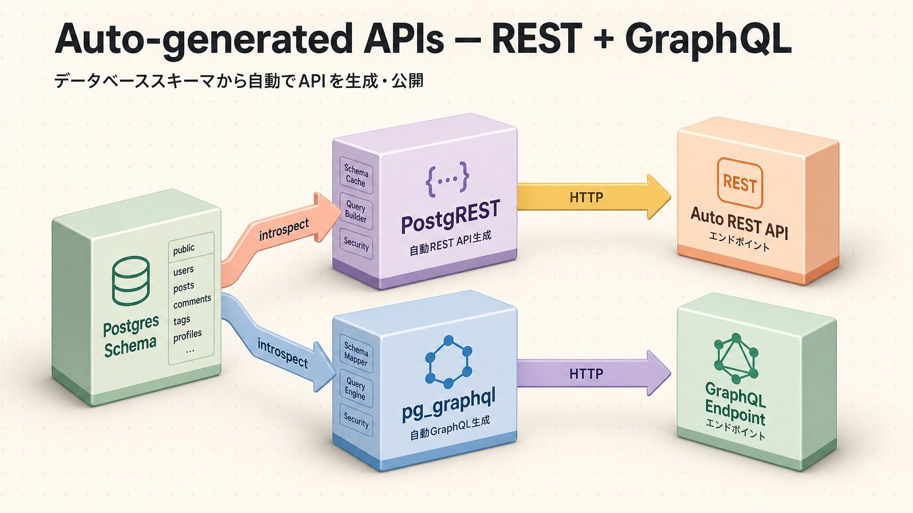

テーブルを作るだけで REST + GraphQL エンドポイントが自動生成。

**💳 利用可能プラン**

| Free | Pro | Team | Enterprise |
|:-:|:-:|:-:|:-:|
| 利用可 | 利用可 | 利用可 | 利用可 |

**🏢 ClassLab. での活用**

- 短期: 管理画面のフォームから直接 DB を CRUD（バックエンドコード不要）。
- 中長期: Headless CMS 用途、外部システム連携 API。

**🔥 差別化点**

- Hasura のようなセットアップ不要、テーブル定義そのままが API になる。

---

### 4.11 Vault — Secrets / Encryption

**🎯 概要**

Postgres extension で機密値（API キー、トークン）を暗号化して保存。`pg_net` 等から参照。

**💳 利用可能プラン**

| Free | Pro | Team | Enterprise |
|:-:|:-:|:-:|:-:|
| 利用可 | 利用可 | 利用可 | 利用可 |

**🏢 ClassLab. での活用**

- 短期: 雑務スキルが使う各種 API キーを env と分離して Vault 保管。
- 中長期: ライフラインの取引先 API 認証情報の集中管理。

---

### 4.12 Dev Tools — Studio / CLI / MCP Server

**🎯 概要**

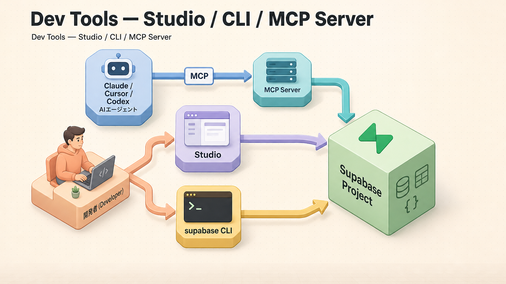

| ツール | 役割 |
|---|---|
| **Studio** | Web UI。テーブル編集 / SQL Editor / Auth 管理 / Storage / Logs |
| **CLI** | ローカル開発、マイグレーション、Branching、Type 生成 |
| **MCP Server** | AI ツール（Claude Code / Cursor 等）から直接プロジェクト操作 |

**💳 利用可能プラン**

| Free | Pro | Team | Enterprise |
|:-:|:-:|:-:|:-:|
| 利用可 | 利用可 | 利用可 | 利用可 |

**🏢 ClassLab. での活用**

- 短期: Claude Code から Supabase MCP 経由で雑務 DB のスキーマ参照・データ投入。
- 中長期: ローカル開発フローの標準化（`supabase start` で Docker 一発）。

**🔥 差別化点**

- Firebase Console と比較して **SQL Editor がフル機能**。Postgres エンジニアの生産性が高い。

---

## 5. プラン早見表（全機能 × プラン）

| カテゴリ | 機能 | Free | Pro | Team | Enterprise |
|---|---|:-:|:-:|:-:|:-:|
| Database | Postgres 専用インスタンス | 500MB | 8GB | 8GB | 従量課金 |
| Database | Row Level Security | 利用可 | 利用可 | 利用可 | 利用可 |
| Database | Extensions (pgvector 等) | 利用可 | 利用可 | 利用可 | 利用可 |
| Database | Read Replicas | 不可 | 制限あり | 利用可 | 利用可 |
| Database | PITR Backup | 不可 | 7日 | 14日 | カスタム |
| Auth | Email/Password/Magic/OAuth | 利用可 | 利用可 | 利用可 | 利用可 |
| Auth | Phone OTP (SMS 別料金) | 従量課金 | 従量課金 | 従量課金 | 従量課金 |
| Auth | MFA TOTP | 利用可 | 利用可 | 利用可 | 利用可 |
| Auth | SAML SSO | 不可 | 不可 | 制限あり | 利用可 |
| Auth | MAU 含み枠 | 50K | 100K | 100K | 契約 |
| Storage | Buckets / Image Transform | 1GB | 100GB | 100GB | 従量課金 |
| Storage | Resumable Upload (TUS) | 利用可 | 利用可 | 利用可 | 利用可 |
| Realtime | Postgres Changes / Broadcast / Presence | 利用可 | 利用可 | 利用可 | 利用可 |
| Realtime | 同時接続 | 200 | 500 | 500 | 契約 |
| Edge Functions | Deno ランタイム | 500K | 2M | 2M | 従量課金 |
| Edge Functions | Background Tasks | 利用可 | 利用可 | 利用可 | 利用可 |
| AI/Vector | pgvector HNSW + halfvec | 利用可 | 利用可 | 利用可 | 利用可 |
| AI/Vector | 内蔵 gte-small | 利用可 | 利用可 | 利用可 | 利用可 |
| Cron | Supabase Cron | 利用可 | 利用可 | 利用可 | 利用可 |
| Queues | pgmq | 利用可 | 利用可 | 利用可 | 利用可 |
| Branching | Database Branching | 不可 | 従量課金 | 従量課金 | 従量課金 |
| API | Auto REST (PostgREST) | 利用可 | 利用可 | 利用可 | 利用可 |
| API | GraphQL (pg_graphql) | 利用可 | 利用可 | 利用可 | 利用可 |
| Security | Vault | 利用可 | 利用可 | 利用可 | 利用可 |
| Security | SOC2 / ISO 27001 | 不可 | 不可 | 利用可 | 利用可 |
| Security | HIPAA | 不可 | 不可 | 不可 | 利用可 |
| DevTools | Studio / CLI / MCP Server | 利用可 | 利用可 | 利用可 | 利用可 |
| Platform | BYO Cloud | 不可 | 不可 | 不可 | 利用可 |
| Platform | Priority Support | 不可 | 不可 | 利用可 | 利用可 |
| Platform | 24/7 SLA | 不可 | 不可 | 不可 | 利用可 |

---

## 6. 料金体系の詳細

### 6.1 プラン別含み枠 & 超過料金

**Free**: $0 — 商用も可（小規模）。1 週間無操作で自動停止。

**Pro**: $25/月（Spend Cap デフォルト ON）

| リソース | 含み枠 | 超過料金 |
|---|---|---|
| DB Storage | 8 GB | $0.125/GB/月 |
| MAU | 100K | $0.00325/MAU |
| File Storage | 100 GB | $0.021/GB/月 |
| Egress | 250 GB | $0.09/GB |
| Edge Function 呼出 | 2M | $2/M |
| Realtime 接続 | 500 | $10/100 接続 |

**Team**: $599/月

- Pro 含み + SOC2 / ISO 27001 / 14 日 PITR / Priority Support
- SAML SSO（要 add-on）

**Enterprise**: カスタム

- HIPAA / BYO Cloud / 24/7 SLA / 専用サポート

### 6.2 競合との料金構造の違い

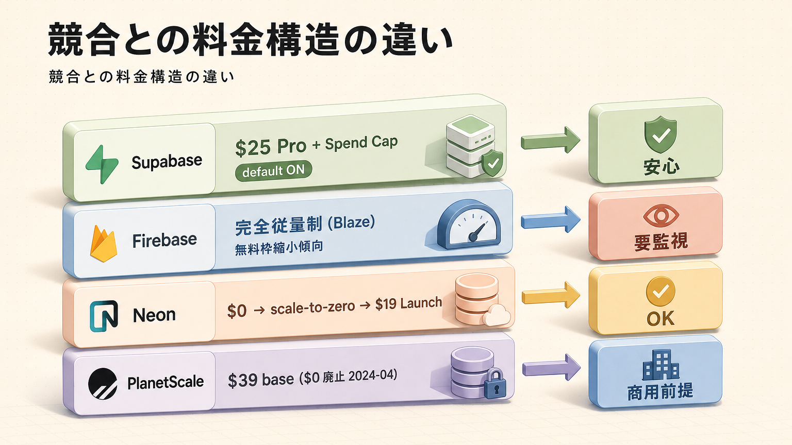

- Supabase Pro の **Spend Cap デフォルト ON** が他社にない予算保護機能。

### 6.3 コスト最適化の勘所

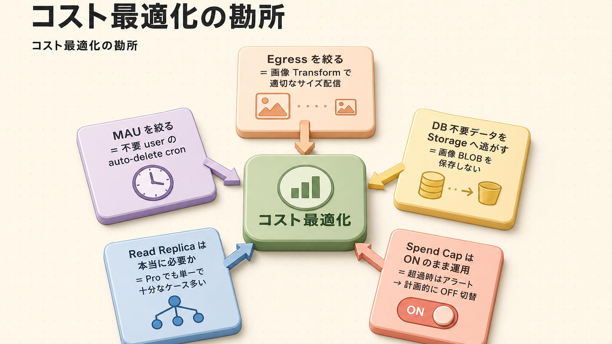

---

## 7. ClassLab. での活用ロードマップ（汎用例）

### 7.1 短期（〜3 ヶ月）

| テーマ | 機能 | 想定効果 |
|---|---|---|
| 雑務スキル群のメタ DB 集約 | Postgres + RLS | 個別 sqlite/csv 散在を統合、SQL で横断分析可能に |
| 社内ナレッジ RAG PoC | pgvector + Edge Function 内蔵 gte-small | 外部ベクトル DB 不要、$25 で開始 |
| 内部ダッシュボードのライブ更新 | Realtime Postgres Changes | スキル実行状況の即時可視化 |
| 認証統合 | Auth (Google OAuth) | Auth0 等の別契約不要 |
| 定期ジョブ集約 | Supabase Cron + Edge Functions | macOS launchd / GitHub Actions schedule の代替 |

### 7.2 中長期（3〜12 ヶ月）

| テーマ | 機能 | 想定効果 |
|---|---|---|
| 顧客向けマイページ | Auth + RLS + Realtime | フロントから直接 DB アクセス、薄いバックエンド |
| 申込フォームの本人確認書類管理 | Storage + RLS | S3 別管理 → 一元化、本人のみ閲覧 RLS で保証 |
| 申込フロー durable 化 | Cron + Queues + Edge Functions | 与信→開通→完了の非同期パイプライン |
| 多拠点同時接続の進捗共有 | Presence + Broadcast | 営業/拠点間のリアルタイム連携 |
| エンプラ要件対応 | Team → Enterprise (SOC2 / HIPAA / SAML) | 法人顧客契約時のコンプラ要件 |
| Vercel との統合請求 | Vercel Marketplace 経由プロビジョン | 請求一本化、env 自動連携 |

### 7.3 既存資産棚卸し（汎用枠）

| 既存 | 移行候補 |
|---|---|
| 個別の sqlite / csv / Google Sheets | Postgres + Auto REST API |
| 個別の認証実装 | Supabase Auth に集約 |
| ファイルを WP / Drive に分散保存 | Supabase Storage + RLS |
| 外部スケジューラ（cron / launchd / GitHub Actions schedule） | Supabase Cron に統一 |
| 別契約のベクトル DB | pgvector に集約（コスト削減） |

---

## 8. 採用判断フロー

### 8.1 新規プロジェクト選択フロー

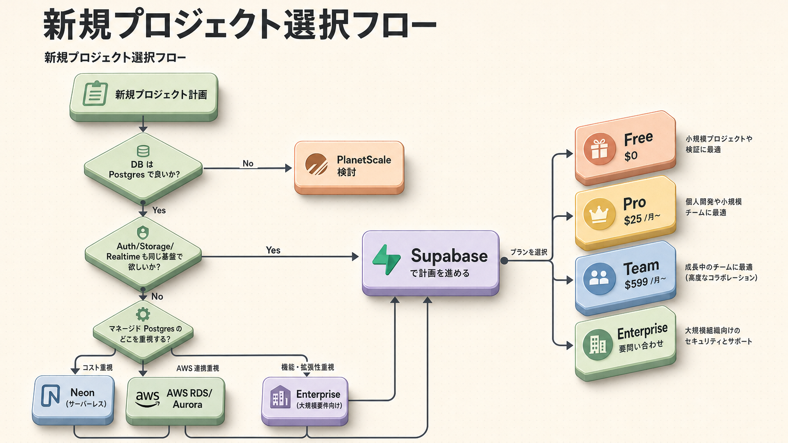

### 8.2 採用適性 Quadrant

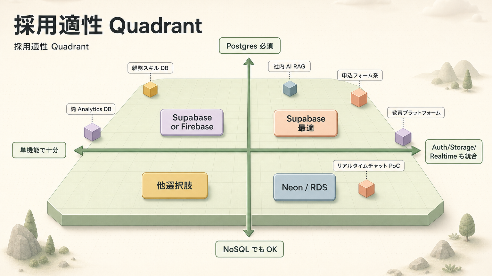

> 右上に近いほど Supabase が最適。左下は Neon / Aurora / Firestore 等を比較検討。

---

## 9. 公式リファレンス & Sources

### 公式ドキュメント

- 全体: https://supabase.com/docs
- 料金: https://supabase.com/pricing
- Database: https://supabase.com/docs/guides/database/overview
- Auth: https://supabase.com/docs/guides/auth
- Storage: https://supabase.com/docs/guides/storage
- Realtime: https://supabase.com/docs/guides/realtime
- Edge Functions: https://supabase.com/docs/guides/functions
- AI / Vector: https://supabase.com/docs/guides/ai
- pgvector: https://supabase.com/docs/guides/database/extensions/pgvector
- Cron: https://supabase.com/modules/cron
- Branching: https://supabase.com/docs/guides/platform/branching
- CLI: https://supabase.com/docs/reference/cli
- MCP Server: https://supabase.com/docs/guides/getting-started/mcp
- 機能カタログ: https://supabase.com/features
- GitHub: https://github.com/supabase/supabase

### Web Sources

- [Supabase Documentation](https://supabase.com/docs)
- [Supabase Features](https://supabase.com/features)
- [Supabase Pricing](https://supabase.com/pricing)
- [Founder Story: Paul Copplestone of Supabase (Frederick AI)](https://www.frederick.ai/blog/paul-copplestone-supabase)
- [Supabase's Paul Copplestone on strategy (Accel)](https://www.accel.com/podcast-episodes/supabases-paul-copplestone-on-the-difference-between-playing-startup-and-strategy)
- [Supabase in 2026: Complete Developer Guide (DEV)](https://dev.to/ottoaria/supabase-in-2026-the-complete-developer-guide-to-the-open-source-firebase-alternative-357j)
- [Supabase Pricing 2026 (UI Bakery)](https://uibakery.io/blog/supabase-pricing)
- [Supabase vs Firebase: Complete Comparison (Bytebase)](https://www.bytebase.com/blog/supabase-vs-firebase/)
- [Neon vs Supabase vs PlanetScale (DEV)](https://dev.to/whoffagents/neon-vs-supabase-vs-planetscale-managed-postgres-for-nextjs-in-2026-2el4)
- [Processing large jobs with Edge Functions, Cron, and Queues](https://supabase.com/blog/processing-large-jobs-with-edge-functions)
- [Automatic embeddings | Supabase Docs](https://supabase.com/docs/guides/ai/automatic-embeddings)
- [Supabase Cron blog](https://supabase.com/blog/supabase-cron)
- [pgvector: Embeddings and vector similarity](https://supabase.com/docs/guides/database/extensions/pgvector)
- [Supabase Vector module](https://supabase.com/modules/vector)
