> ClassLab. エンジニア向け Vercel リファレンス。「なぜ存在するか → 何ができるか → 自社でどう使うか」を 1 本で完結させる。

---

## 0. TL;DR

- Vercel は **"Develop. Preview. Ship."** を体現する AI Cloud。インフラ設定ゼロで Git push のたびに本番配信される世界を実現する。
- 旧来の「フロントエンドのデプロイ先」ではなく、**フロント + バックエンド + AI + ストレージ + 観測 + セキュリティ** の統合プラットフォーム。
- LLM 訓練データで古くなりがちな論点（2026 時点での正解）:
  - `Edge Functions` 非推奨 → **Fluid Compute** が標準
  - `Vercel Postgres` / `Vercel KV` 廃止 → **Marketplace**（Neon / Supabase / Upstash 等）
  - Node.js 24 LTS / Python 3.13-14 / Bun / Rust 対応
  - 関数タイムアウト デフォルト **300 秒**
  - 課金は **Active CPU pricing**（CPU 時間 + Memory + Invocations）
  - 設定ファイルは **`vercel.ts`**（TypeScript、`@vercel/config`）
- 競合（Netlify / Cloudflare Pages / AWS Amplify / Render / Railway / Fly.io）との最大差別化は「**Next.js を作っている本家**」「**AI Cloud としての統合度**」「**Fluid Compute による LLM ワークロード最適化**」。

---

## 1. Vercel とは何か — 理念とミッション

### 1.1 ミッション

> **Develop. Preview. Ship.** — アイデアからユーザーに届くまでの摩擦を消す。

Vercel はクラウドが developer に対して「過剰に約束し、過小に届けている」現状を解決するために生まれた。設定に数日かけて初めて Hello World が出るような従来のクラウドではなく、**Git push の瞬間にプロダクトが本番に乗っている** 体験を作ることがプロダクトの北極星。

### 1.2 哲学（公式表現）

| 表現 | 意味 |
|---|---|
| **"Iteration velocity is the answer to all software problems."**（CTO Malte Ubl） | ソフトウェアのあらゆる問題は反復速度で解ける。だから DX の高速化はすべての投資の中心。 |
| **"Progressive disclosure of complexity"**（CEO Guillermo Rauch） | 入門者は 1 行で始められ、エンタープライズは深く拡張できる。複雑さは必要に応じて段階的に開示される。 |
| **"Frontend Cloud → AI Cloud"** | フロントエンド配信基盤から「AI で生成され、AI が実行するアプリ」の基盤へ進化。 |
| **"Team Web"** | App Store のゲートキーピングと遅延に対する哲学的対立。Web こそが最も即時かつオープンな配信チャネル。 |

### 1.3 なぜ存在するか

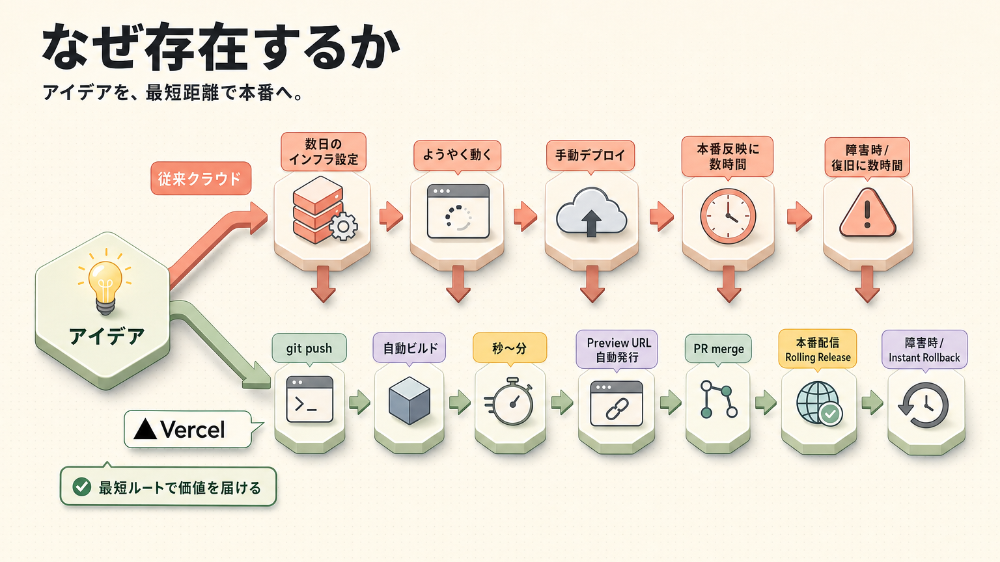

「**インフラと開発フローに使う時間を全部、プロダクトに戻す**」が存在理由。

### 1.4 エンジニアにとっての意味

| 立場 | Vercel が解くこと |
|---|---|
| フロントエンド | フレームワーク選定 → デプロイ → CDN 配信 → Web Vitals 計測まで一気通貫。`next dev` と同じ体験が本番に直結。 |
| バックエンド | Express/NestJS/FastAPI/Hono をそのまま Fluid Compute で動かせる。Postgres / Redis は Marketplace で 1 クリック。 |
| AI エンジニア | AI Gateway で複数プロバイダ抽象化、Sandbox で untrusted コード実行、WDK で長時間 Agent を durable に。 |
| インフラ / SRE | Firewall / WAF / BotID / DDoS が標準装備。Drains で既存 Datadog / Axiom に観測データ集約。 |
| デザイナー / PdM 連携 | PR 単位の Preview URL で「動く UI」をベースに議論。Toolbar で本番上から直接コメント・編集。 |

---

## 2. 全体マップ（1 枚絵）

### 2.1 サービス全体俯瞰

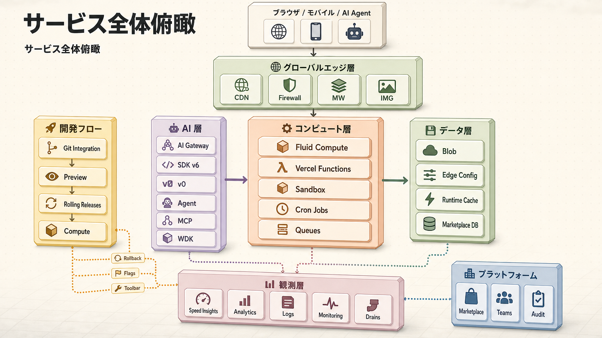

### 2.2 製品カテゴリ Mindmap

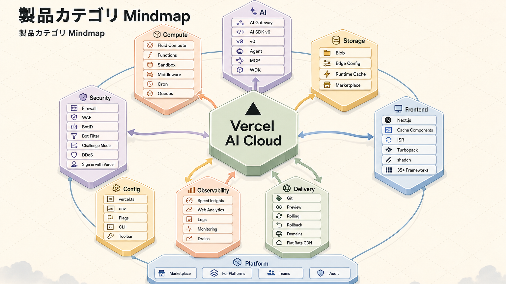

---

## 3. プラン体系の前提知識

### 3.1 Hobby / Pro / Enterprise 概要

| 軸 | **Hobby** | **Pro** | **Enterprise** |
|---|---|---|---|
| 料金 | 無料 | $20/開発者/月 + 従量 | カスタム（$25k〜/年） |
| 商用 | 不可（Fair Use 違反） | 可 | 可 |
| SLA | なし | なし | 99.99% |
| サポート | コミュニティ | チケット | 専用 + DDR |
| 含まれる枠 | 100GB 転送 / 1M Edge Req / 1M 関数 / 4h CPU / 360GB-h Mem / 1GB Blob | $20 利用クレジット / 1TB 転送 / 10M Edge Req | 個別契約 |
| 超過時 | 即停止（オーバージ不可） | 従量課金で継続 | 契約による |
| SSO / SAML | 不可 | △ (一部) | 利用可 |
| SCIM / Audit | 不可 | 不可 | 利用可 |
| 専用インフラ | 不可 | 不可 | 利用可 |

### 3.2 Active CPU pricing の考え方

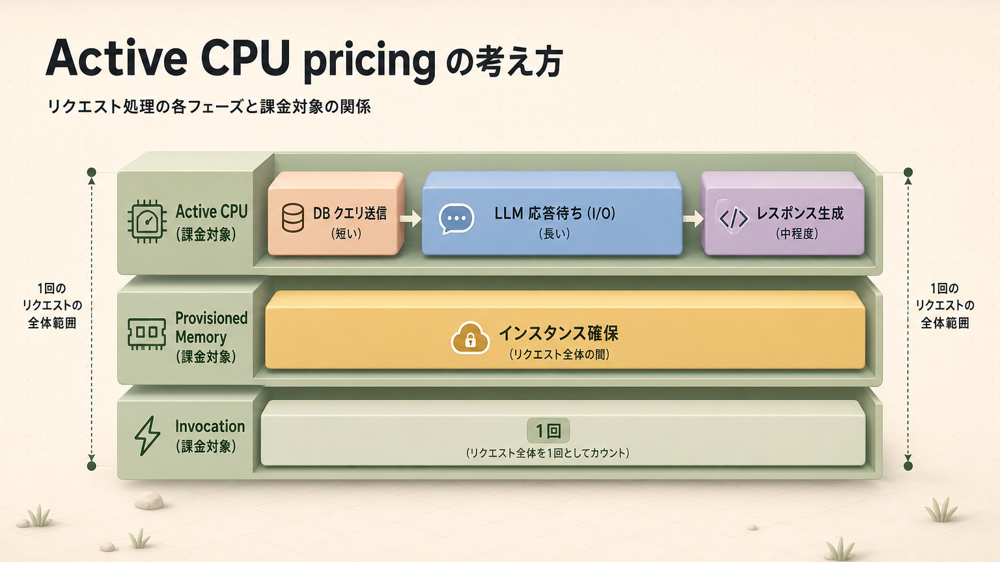

- **Active CPU** ($0.128/h): CPU が実際に動いている間だけ課金。I/O 待ち中は **停止**。
- **Provisioned Memory** ($0.0106/GB-h): インスタンス生存中ずっと課金（I/O 待ち中も継続）。
- **Invocations** ($0.60/M): 呼出回数。

→ LLM 呼出のような I/O 主体のワークロードでは、従来の GB-sec 課金より **大幅に安く**なる（Fluid Compute の利点）。

### 3.3 プラン表記の凡例

本ドキュメント内の機能カタログで使う記号:

| 記号 | 意味 |
|---|---|
| 利用可 | プラン標準で利用可能 |
| 制限あり | 制限付き / Public Beta / 一部機能のみ |
| 不可 | 利用不可 |
| 従量課金 | 標準で含まれるが、超過は従量課金 |

---

## 4. 機能カタログ

各機能は以下の定型フォーマット:

```
🎯 概要（+ 図）
👨‍💻 エンジニアへの関係
💳 利用可能プラン
🏢 ClassLab. での活用（短期 / 中長期）
🔥 差別化点
🔍 深掘り
⚠️ 注意点
```

---

### 4.1 Compute（計算基盤）

#### 4.1.1 Fluid Compute

**🎯 概要**

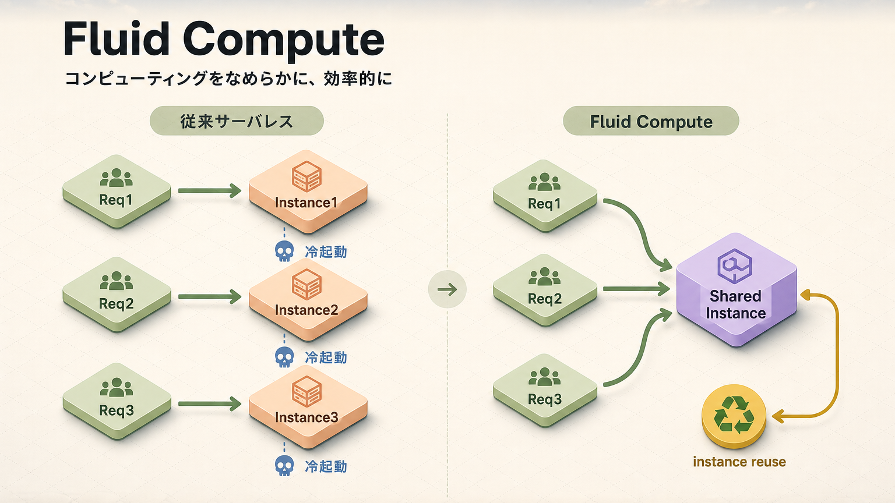

関数インスタンスを並行リクエストで再利用。コールドスタート激減、グレースフルシャットダウン、リクエストキャンセル対応。AI / I/O 主体のワークロード向けに最適化。

**👨‍💻 エンジニアへの関係**

- LLM ストリーミング、外部 API 集約、Server Components のような「I/O が長く CPU は短い」処理で **料金が劇的に安い**。
- グローバル変数を信頼すべきでないなど、設計が従来 Lambda と異なる。

**💳 利用可能プラン**

| Hobby | Pro | Enterprise |
|:-:|:-:|:-:|
| 利用可 | 利用可 | 利用可 |

**🏢 ClassLab. での活用**

- 短期: 既存 Next.js API Route を **そのまま** デプロイするだけで AI 処理コストが下がる。
- 中長期: 社内 AI ツール群を Fluid 上の Hono / FastAPI に統一移行し、Lambda 等の運用コスト削減。

**🔥 差別化点**

| | Vercel Fluid | AWS Lambda | Cloudflare Workers |
|---|:-:|:-:|:-:|
| インスタンス再利用 | 利用可 | (1req/1instance) | (Isolate) |
| Node.js フル機能 | 利用可 | 利用可 | (一部 npm 非互換) |
| Python / Bun / Rust | 利用可 | (一部) | 制限あり |
| グレースフルシャットダウン | 利用可 | 不可 | 制限あり |
| 300s タイムアウト | 利用可 | (15min) | (CPU 制限) |

**🔍 深掘り**

- 既定でオン。`vercel.ts` の `functions` セクションでメモリ・リージョン・タイムアウトを上書き可能。
- 同一インスタンス内で複数リクエストが並行実行されるため、**リクエスト間でグローバル状態を共有しない**設計が必須。
- `waitUntil()` API でレスポンス送信後の処理（ログ送信・キャッシュ更新等）を継続可能。

**⚠️ 注意点**

- インスタンス共有を前提とするため、メモリリーク・グローバル DB クライアントの誤用に気をつける。

---

#### 4.1.2 Vercel Functions

**🎯 概要**

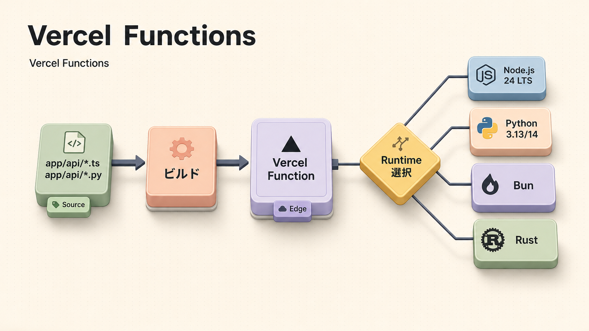

Fluid Compute 上で動く HTTP 関数。デフォルト 300 秒タイムアウト。Express / FastAPI / NestJS / Hono など backend フレームをそのまま動かせる。

**👨‍💻 エンジニアへの関係**

- バックエンドエンジニアにとっての「サーバの代わり」。EC2 / ECS / Cloud Run の代替。

**💳 利用可能プラン**

| Hobby | Pro | Enterprise |
|:-:|:-:|:-:|
| 1M 呼出 / 4h CPU / 360GB-h Mem | 含み + 従量 | 契約 |

**🏢 ClassLab. での活用**

- 短期: 雑務スキル（content-post / wp-post 等）の Webhook 受け口として活用。
- 中長期: ライフライン申込フォームのバックエンド、API ゲートウェイ統合。

**🔥 差別化点**

- `Edge Functions` は非推奨化されており、新規は **Functions on Fluid** を選ぶ（旧ドキュメントとの大きな乖離点）。
- Bun / Rust ランタイム標準提供は Netlify / Amplify にない。

**🔍 深掘り**

```ts
// vercel.ts
import type { VercelConfig } from '@vercel/config/v1';

export const config: VercelConfig = {
  functions: {
    'api/heavy/*.ts': {
      memory: 3008,
      maxDuration: 300,
      regions: ['hnd1', 'iad1'],
    },
  },
};
```

**⚠️ 注意点**

- リージョン指定はレイテンシに直結。データソース近接性を意識する。

---

#### 4.1.3 Vercel Sandbox

**🎯 概要**

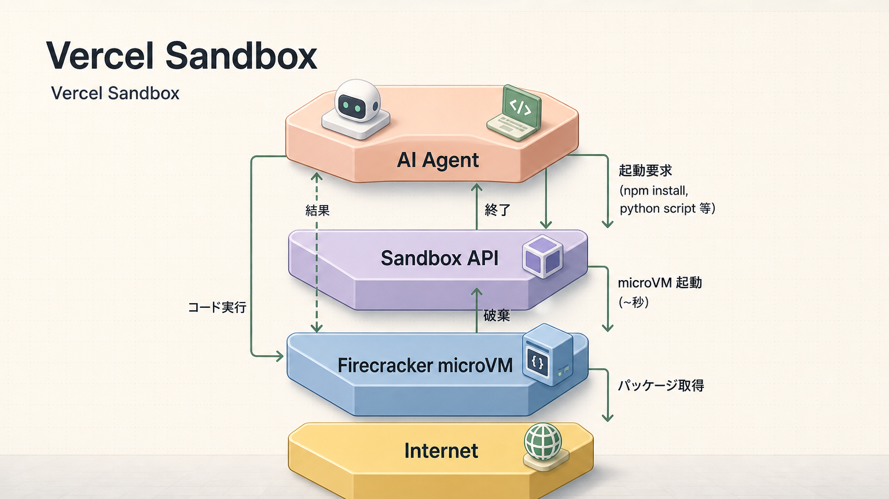

Firecracker microVM で untrusted コードを実行（GA 2026-01）。Claude Managed Agents 等が利用。Active CPU pricing。

**👨‍💻 エンジニアへの関係**

- 「ユーザーが書いたコードを安全に動かしたい」（コードジャッジ、AI Agent、CTF、教育プラットフォーム）用途で唯一の正解。
- 自前で gVisor / Firecracker を運用する必要がない。

**💳 利用可能プラン**

| Hobby | Pro | Enterprise |
|:-:|:-:|:-:|
| 従量課金 | 従量課金 | 従量課金 |

**🏢 ClassLab. での活用**

- 短期: Claude Code 系エージェントの代替実行環境として検証。
- 中長期: 受講者が書いたコードを採点する教育系プロダクト（ClassLab. の社名にも関連する事業領域）。

**🔥 差別化点**

- E2B / Modal / Lambda Sandbox と比較して **Vercel の他プロダクトと完全統合**（AI Gateway / Functions / Storage と同一課金面）。
- Node.js / Python / sudo 可能、ユーザアクセス可能な URL を持つ。

**🔍 深掘り**

- 1 セッション = 1 microVM、エフェメラル。永続化したいデータは Blob / Marketplace DB に逃がす。
- 公式の SDK あり（TypeScript）。

**⚠️ 注意点**

- セキュリティ的に「外向き通信を許可するか」設計を慎重に。

---

#### 4.1.4 Routing Middleware

**🎯 概要**

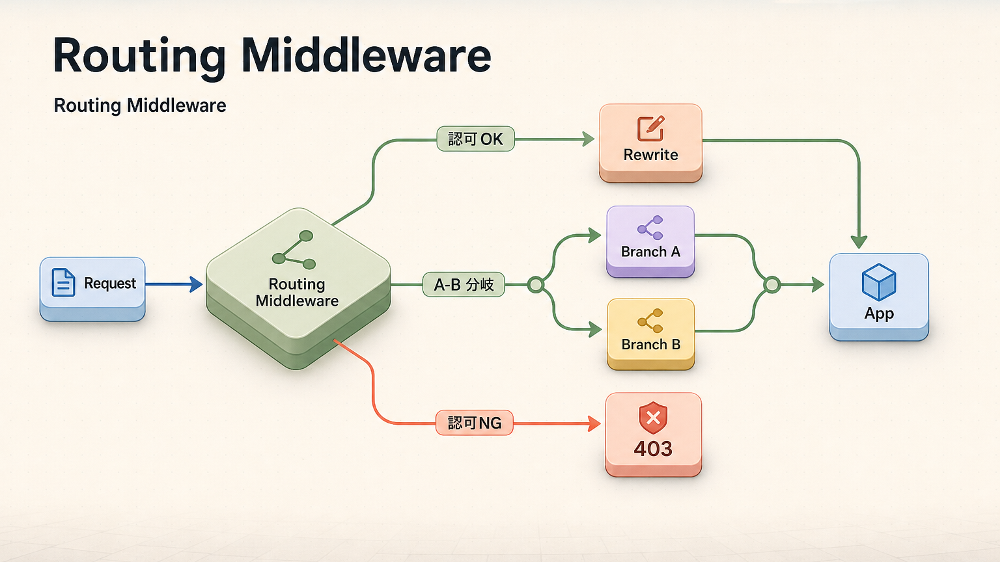

フレームワーク非依存のリクエスト書換 / リダイレクト / A-B テスト / 認可。**Next.js Middleware とは別物**（こちらは framework-agnostic）。

**👨‍💻 エンジニアへの関係**

- 複数フレームワークが混在するサイトでも統一的にリクエスト処理できる。

**💳 利用可能プラン**

| Hobby | Pro | Enterprise |
|:-:|:-:|:-:|
| 利用可 | 利用可 | 利用可 |

**🏢 ClassLab. での活用**

- 短期: ステージング環境への Basic 認証付与。
- 中長期: マルチテナント SaaS でテナント識別 → リライト。

**🔥 差別化点**

- Cloudflare Workers と類似だが、Vercel デプロイと完全統合。`vercel.ts` で宣言可能。

**⚠️ 注意点**

- キャッシュ前に走る = 過剰実装はレイテンシに直結。

---

#### 4.1.5 Cron Jobs

**🎯 概要**

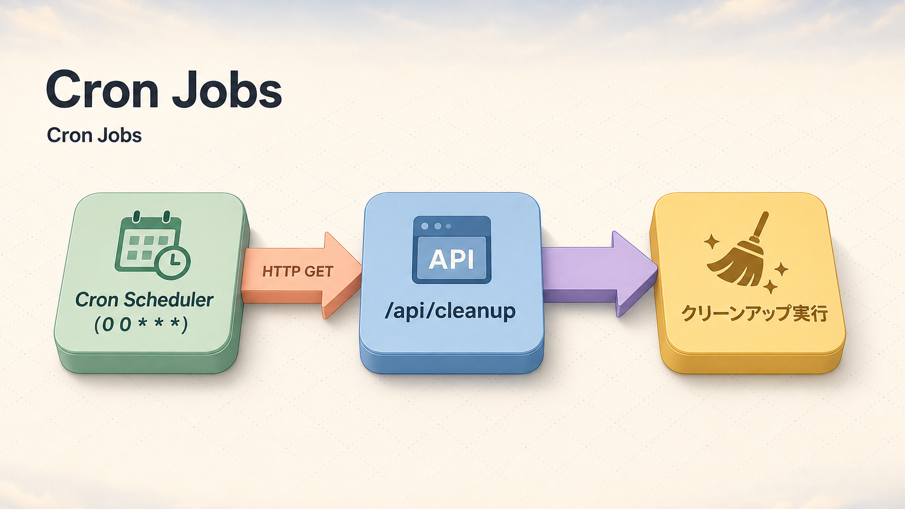

`vercel.ts` の `crons` で宣言。HTTP GET でルートを叩くシンプルな定期実行。

**💳 利用可能プラン**

| Hobby | Pro | Enterprise |
|:-:|:-:|:-:|
| 1日1回 | 制限緩和 | 利用可 |

**🏢 ClassLab. での活用**

- 短期: weekly-news の毎週自動生成、findy-enterprise の求人同期。
- 中長期: ライフライン契約データの日次集計、Salesforce 同期。

**🔥 差別化点**

- Netlify Functions / GitHub Actions Schedule よりも **アプリのデプロイ単位で完結**（CI 不要）。

**⚠️ 注意点**

- 長時間ジョブは WDK へ移行。Cron は trigger に徹し、処理本体は別関数や Queue へ。

---

#### 4.1.6 Vercel Queues（Public Beta）

**🎯 概要**

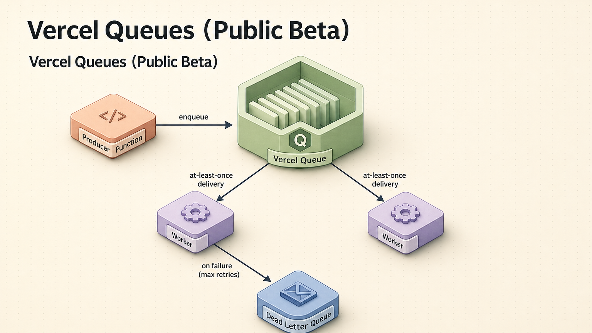

Fluid Compute 上の at-least-once 配信キュー。イベント駆動・バックグラウンドジョブ・Agent タスク分配。

**💳 利用可能プラン**

| Hobby | Pro | Enterprise |
|:-:|:-:|:-:|
| Beta | Beta | Beta |

**🏢 ClassLab. での活用**

- 短期: weekly-news の記事生成ジョブを並列分散。
- 中長期: ライフライン申込時のメール送信・帳票生成・SF 連携の非同期化。

**🔥 差別化点**

- SQS / Cloud Tasks と異なり、**Vercel 内完結 = 認証・課金が一本化**。

**⚠️ 注意点**

- Beta。本番採用前に SLA を確認。

---

### 4.2 AI

#### 4.2.1 AI Gateway

**🎯 概要**

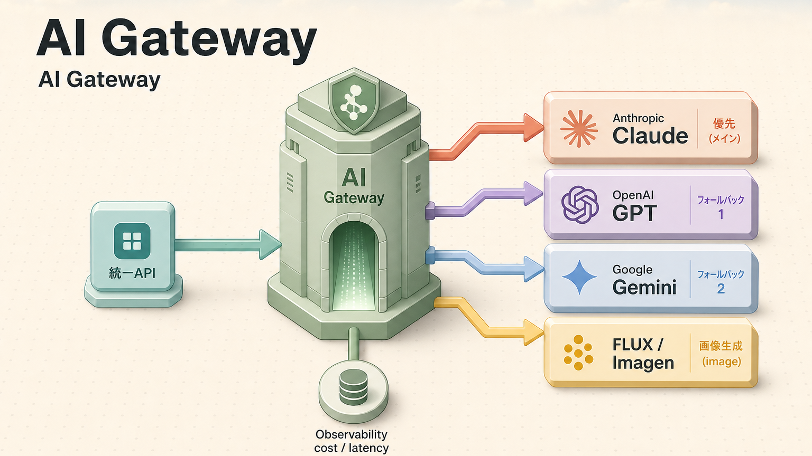

複数 AI プロバイダ統一 API、自動フォールバック、Zero Data Retention、画像 / 動画生成対応（GA 2025-08）。Claude Code 連携あり（2026-04 Opus 4.7 追加）。

**👨‍💻 エンジニアへの関係**

- プロバイダ毎に SDK を切り替える必要なし。コスト・レイテンシ・障害を一元的に観測できる。

**💳 利用可能プラン**

| Hobby | Pro | Enterprise |
|:-:|:-:|:-:|
| トークン課金 | トークン課金 | 契約 |

**🏢 ClassLab. での活用**

- 短期: 全雑務スキル（content-post, weekly-news, hn-trends, output-idea 等）の LLM 呼出を Gateway 経由に統一。コスト可視化。
- 中長期: モデル切替を運用判断（コスト悪化時に低価格モデルへ自動フォールバック）、画像生成の集約。

**🔥 差別化点**

| | Vercel AI Gateway | OpenRouter | Portkey |
|---|:-:|:-:|:-:|
| Zero Data Retention | 利用可 | 制限あり | 制限あり |
| Vercel 統合 (env / billing) | 利用可 | 不可 | 不可 |
| 画像 / 動画生成統合 | 利用可 | 制限あり | 不可 |
| Claude Code 直接連携 | 利用可 | 不可 | 不可 |

**🔍 深掘り**

- `AI_GATEWAY_API_KEY` 一本で全プロバイダ。`AI SDK` と組み合わせると数行で fallback を宣言可能。
- 料金は各モデル原価 + Vercel マージン。トークン使用量がダッシュボードでリアルタイム可視化。

---

#### 4.2.2 AI SDK v6

**🎯 概要**

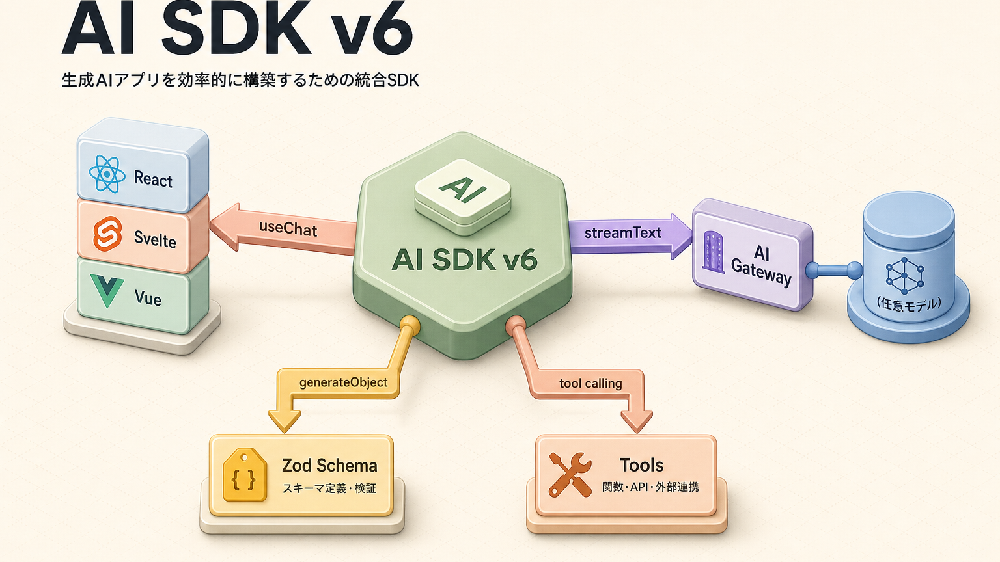

TypeScript の AI 開発標準。チャット UI、tool calling、streaming、構造化出力。

**💳 利用可能プラン**

| Hobby | Pro | Enterprise |
|:-:|:-:|:-:|
| OSS | OSS | OSS |

**🏢 ClassLab. での活用**

- 短期: weekly-news の記事生成、output-idea のネタ整理を `generateObject` で型安全に。
- 中長期: 採用面接 AI、社内 chatbot の標準フレームに。

**🔥 差別化点**

- LangChain JS / LlamaIndex TS より **React/Next.js との親和性が圧倒的**。`useChat` フックでストリーミング UI を 10 行で書ける。

---

#### 4.2.3 v0

**🎯 概要**

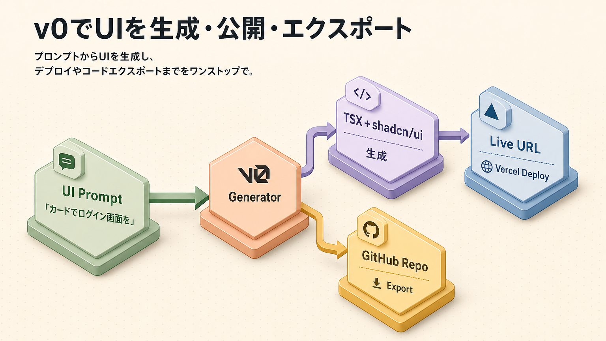

プロンプトから UI / アプリを生成。shadcn/ui 互換、Tailwind 標準。

**💳 利用可能プラン**

| 個人 v0 Free | v0 Pro ($20/月) | v0 Team / Enterprise |
|:-:|:-:|:-:|
| 制限あり | 利用可 | 利用可 |

> v0 は Vercel 本体プランとは別の独立サブスクリプション。

**🏢 ClassLab. での活用**

- 短期: 内製ダッシュボードのプロトタイプ高速化。Findy Enterprise の管理画面など。
- 中長期: ライフライン申込フォームの UI バリエーション生成 → A-B テスト。

**🔥 差別化点**

- Bolt.new / Lovable と並ぶが、**Vercel デプロイへの一気通貫が最短**。生成結果が即 Live URL。

---

#### 4.2.4 Vercel Agent（Public Beta）

**🎯 概要**

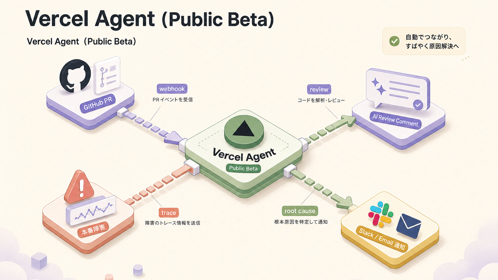

AI コードレビュー + 本番インシデント調査。

**💳 利用可能プラン**

| Hobby | Pro | Enterprise |
|:-:|:-:|:-:|
| Beta | Beta | Beta |

**🏢 ClassLab. での活用**

- 短期: 内製リポジトリの PR レビュー一次フィルタとして導入。
- 中長期: 本番障害の root cause を Salesforce 連携 / ライフライン申込ピーク時の自動分析へ。

**🔥 差別化点**

- CodeRabbit / Greptile に類似だが、Vercel デプロイ・ログ・観測データに **ネイティブアクセス**できる点が独自。

---

#### 4.2.5 Vercel MCP Server

**🎯 概要**

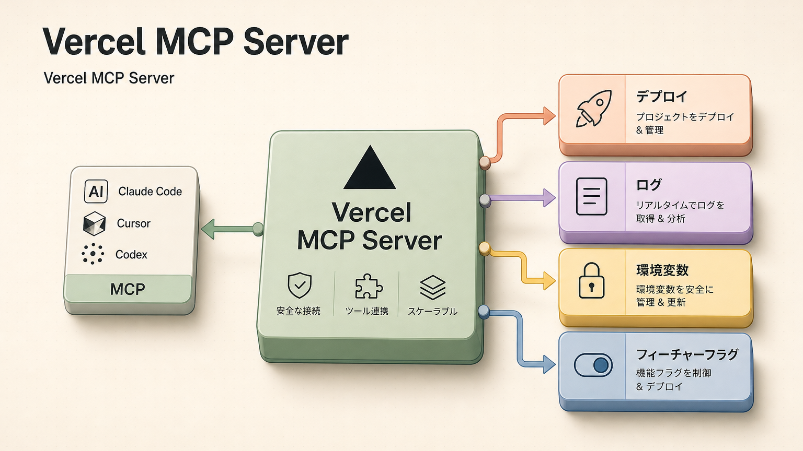

AI ツール（Claude Code / Cursor / Codex 等 12 クライアント承認済）から Vercel API を操作。

**💳 利用可能プラン**

| Hobby | Pro | Enterprise |
|:-:|:-:|:-:|
| Beta | Beta | Beta |

**🏢 ClassLab. での活用**

- 短期: Claude Code から雑務リポジトリのデプロイ状況・ログ確認を会話のまま。
- 中長期: 障害一次対応を AI に委譲（log 確認 → rollback 提案）。

**🔥 差別化点**

- 「**Anthropic 公認の 12 クライアント**」と接続可能。自前 MCP 構築不要。

---

#### 4.2.6 Workflow DevKit (WDK)

**🎯 概要**

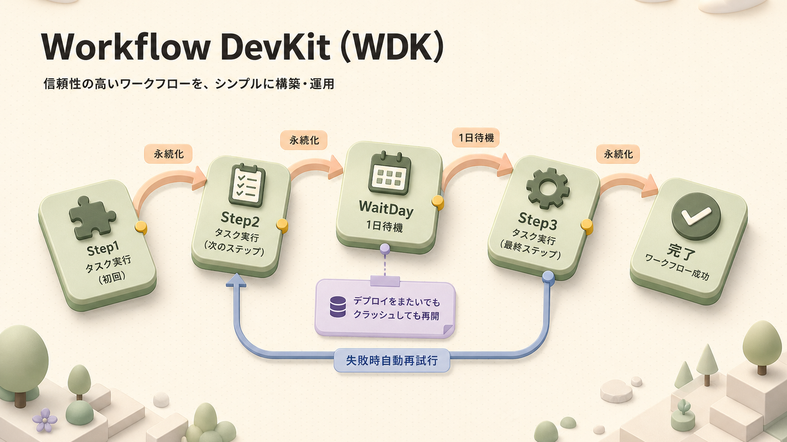

TypeScript の関数を **durable workflow** 化。8 フレームワーク対応（Next.js / Nitro / SvelteKit / Astro / Express / Hono 等）。

**💳 利用可能プラン**

| Hobby | Pro | Enterprise |
|:-:|:-:|:-:|
| OSS | OSS | OSS |

**🏢 ClassLab. での活用**

- 短期: weekly-news の「複数ソースから記事 → LLM 編集 → 投稿」を WDK 化し、途中失敗でも再開可能に。
- 中長期: ライフライン申込の数日待機を含むフロー（与信 → 開通日連絡 → 完了報告）の durable 実装。

**🔥 差別化点**

| | WDK | AWS Step Functions | Temporal |
|---|:-:|:-:|:-:|
| TypeScript ネイティブ | 利用可 | (JSON) | 利用可 |
| Vercel デプロイ統合 | 利用可 | 不可 | 不可 |
| 関数を直接 durable 化 | ("use workflow") | 不可 | 制限あり |
| 数ヶ月待機 | 利用可 | 利用可 | 利用可 |

---

### 4.3 Storage

#### 4.3.1 Vercel Blob

**🎯 概要**

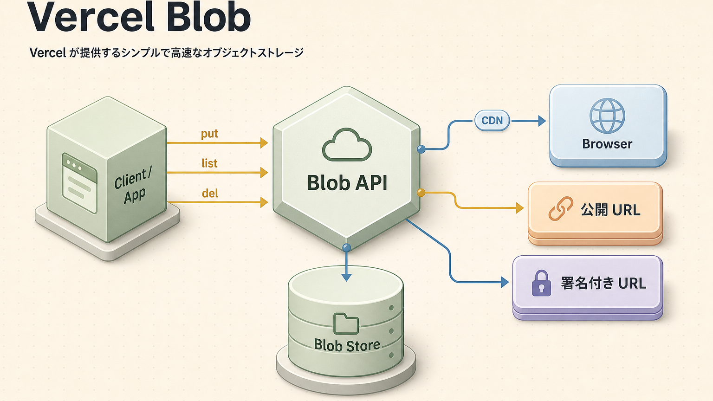

グローバル CDN 配信の Blob ストア。公開 / 非公開両対応（2026 で private GA）。

**💳 利用可能プラン**

| Hobby | Pro | Enterprise |
|:-:|:-:|:-:|
| 1GB込 | 含み + 従量 | 契約 |

**🏢 ClassLab. での活用**

- 短期: weekly-news の OG 画像、wp-post の画像中間保存。
- 中長期: ライフライン申込書の PDF / 写真アップロード保管庫。

**🔥 差別化点**

- S3 比でセットアップ不要、CDN 統合済み、署名 URL も SDK 同梱。

---

#### 4.3.2 Edge Config

**🎯 概要**

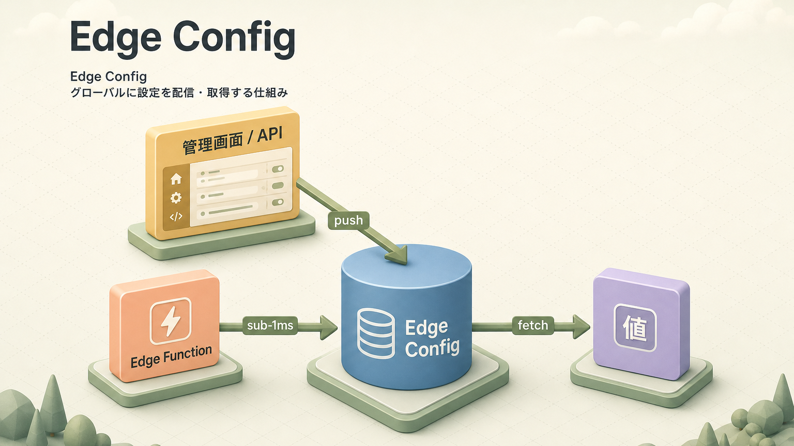

グローバル 1ms 読取（P99 < 10ms）の KV。設定値・フィーチャーフラグの本拠地。

**💳 利用可能プラン**

| Hobby | Pro | Enterprise |
|:-:|:-:|:-:|
| 1 store / 8KB | 拡張 | さらに拡張 |

**🏢 ClassLab. での活用**

- 短期: メンテナンス画面切替フラグ、A-B テスト振り分け表。
- 中長期: マルチテナント別の設定（テーマ / 機能制限）配信。

**🔥 差別化点**

- Cloudflare KV / DynamoDB との違いは「**Vercel リクエストパスに最適化済み**」。リクエスト毎の DB 呼出を **0** にできる。

---

#### 4.3.3 Runtime Cache

**🎯 概要**

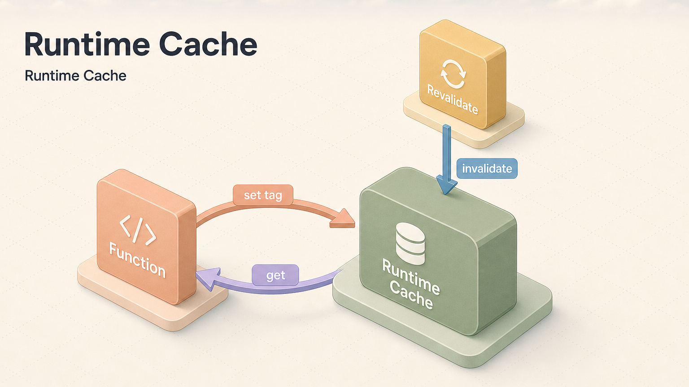

エフェメラルなリージョン別 KV、タグ無効化対応。Next.js Cache Components / `use cache` の裏側でも使われる。

**💳 利用可能プラン**

| Hobby | Pro | Enterprise |
|:-:|:-:|:-:|
| 利用可 | 利用可 | 利用可 |

**🏢 ClassLab. での活用**

- 短期: WP REST API 呼出のキャッシュで wp-engineer の表示高速化。
- 中長期: ライフライン料金表のキャッシュ + タグ無効化。

---

#### 4.3.4 Marketplace DB

**🎯 概要**

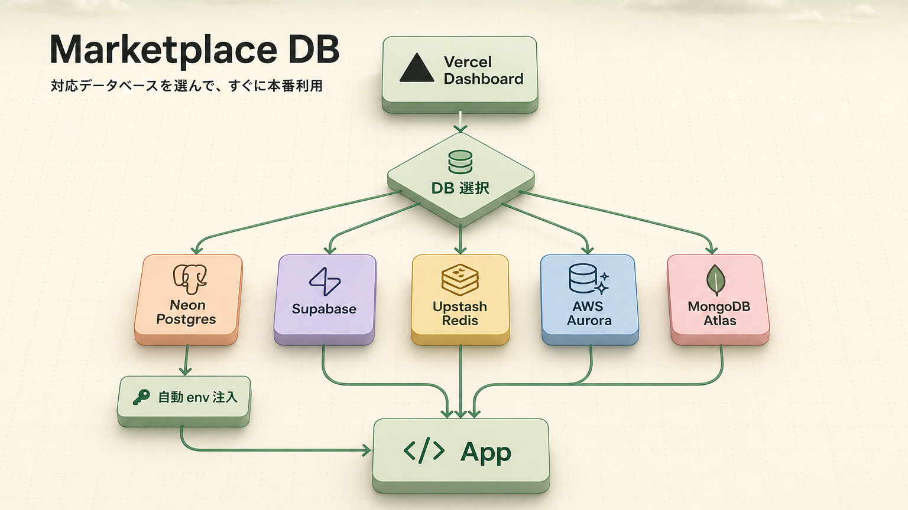

旧 Vercel Postgres / KV の置換。Neon / Supabase / Upstash / AWS Aurora / MongoDB Atlas 等を **Vercel ダッシュボードからプロビジョン**、課金統合。

**💳 利用可能プラン**

| Hobby | Pro | Enterprise |
|:-:|:-:|:-:|
| 各プロバイダ無料枠 | 統合請求 | 統合請求 |

**🏢 ClassLab. での活用**

- 短期: weekly-news の microCMS 補完用 KV、findy-enterprise のキャッシュに Upstash。
- 中長期: 内製プロダクトの Primary DB を Neon（serverless Postgres）に集約。

**🔥 差別化点**

- DBaaS 選定 → 契約 → env 連携 → 課金が **数クリックで完結**、Cloud 側で別途請求書管理が不要。

---

### 4.4 Frontend & Framework

#### 4.4.1 Next.js App Router + Cache Components

**🎯 概要**

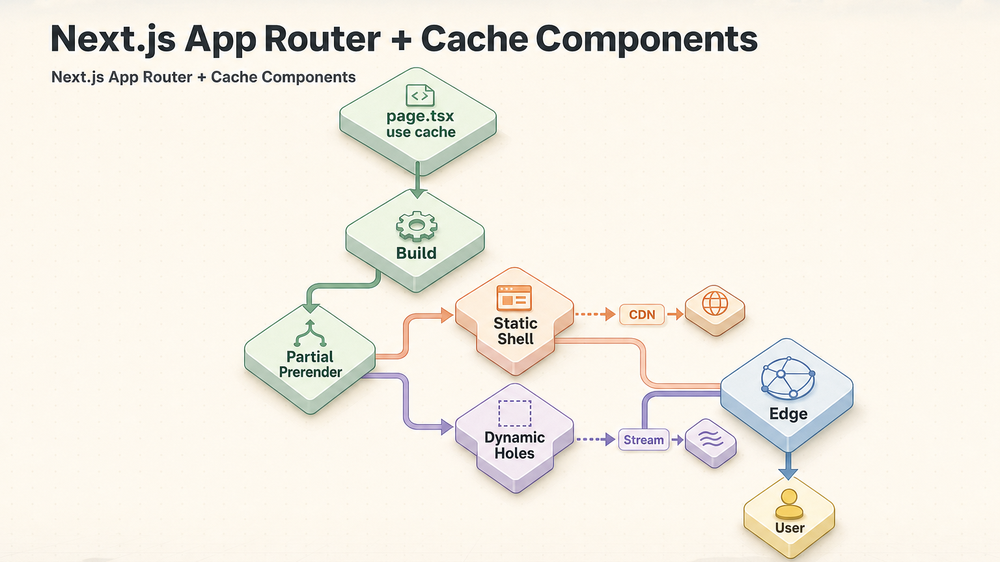

App Router + Cache Components（`use cache` / `cacheLife` / `cacheTag`）。Partial Prerendering で「ほぼ全部静的、一部だけ動的」を実現。

**💳 利用可能プラン**

| Hobby | Pro | Enterprise |
|:-:|:-:|:-:|
| 利用可 | 利用可 | 利用可 |

**🏢 ClassLab. での活用**

- 短期: classlab-weekly-news のページ再描画戦略を `use cache` ベースに刷新、Vercel コスト削減。
- 中長期: 採用サイト・コーポレートサイトのリプレースで Next.js 16+ 構成。

**🔥 差別化点**

- 「**Next.js を作っている本家** = 最初に最適化が来る」。Astro / SvelteKit でも ISR は動くが、PPR は Next.js 専用。

---

#### 4.4.2 Image Optimization

**🎯 概要**

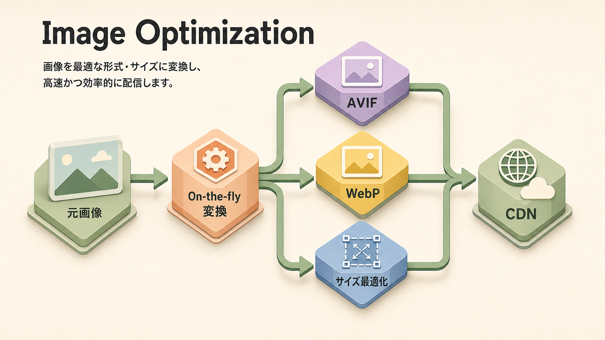

自動 AVIF / WebP 変換、サイズ最適化、`<Image>` コンポーネントとの統合。

**💳 利用可能プラン**

| Hobby | Pro | Enterprise |
|:-:|:-:|:-:|
| 5,000 変換 | 含み + 従量 | 従量課金 |

**🏢 ClassLab. での活用**

- 短期: wp-engineer の OGP 画像最適化。
- 中長期: ライフライン LP のヒーロー画像をモバイル最適化。

---

#### 4.4.3 Turbopack

**🎯 概要**

Next.js 16+ のデフォルトバンドラ。Rust 製、webpack 比 10x ビルド高速化。

**💳 利用可能プラン**

| Hobby | Pro | Enterprise |
|:-:|:-:|:-:|
| OSS | OSS | OSS |

**🔥 差別化点**

- Vite / Rspack と並ぶが、Next.js 内蔵 = 設定ゼロ。

---

#### 4.4.4 shadcn/ui

**🎯 概要**

CLI でコンポーネントをコピー＆貼付するスタイル。npm パッケージではなくソースコード自体を所有。

**💳 利用可能プラン**

| 全プラン | OSS |

**🏢 ClassLab. での活用**

- 短期: 内製管理画面のデザインシステム標準化。
- 中長期: ライフライン申込フォームのコンポーネント基盤。

---

#### 4.4.5 next-forge

**🎯 概要**

production-grade Turborepo monorepo SaaS スターター（Vercel 公式）。

**💳 利用可能プラン**

| 全プラン | OSS |

**🏢 ClassLab. での活用**

- 中長期: 新規 SaaS 立上時の出発点として標準化。

---

#### 4.4.6 35+ フレームワーク対応

**🎯 概要**

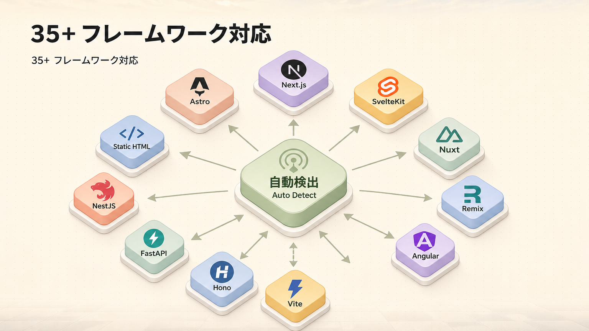

zero-config 自動検出。ISR は Next.js / SvelteKit / Nuxt / Astro で動作。

**🔥 差別化点**

- Netlify / Cloudflare Pages も多くのフレームに対応するが、SvelteKit は **Vercel が Rich Harris と Svelte コアチームを雇用** = 最適化の本拠地。

---

### 4.5 Delivery（CI/CD）

#### 4.5.1 Git Integration / Preview / Rolling Releases / Instant Rollback

**🎯 概要**

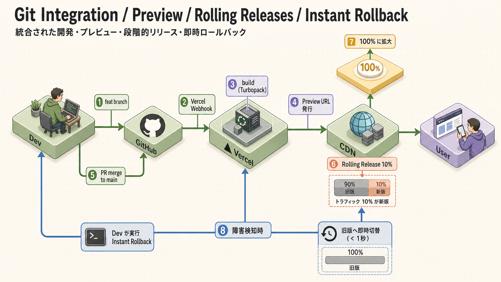

**💳 利用可能プラン**

| 機能 | Hobby | Pro | Enterprise |
|---|:-:|:-:|:-:|
| Git Integration | 利用可 | 利用可 | 利用可 |
| Preview Deployments | 利用可 | 利用可 | 利用可 |
| **Rolling Releases** (GA 2025-06) | 不可 | 利用可 | 利用可 |
| Instant Rollback | 利用可 | 利用可 | 利用可 |
| 同時ビルド並列数 | 1 | 12 | 契約 |

**🏢 ClassLab. での活用**

- 短期: 全雑務リポジトリで PR ごとの Preview URL を活用、Slack 共有でレビュー高速化。
- 中長期: ライフラインなど顧客向けプロダクトで Rolling Release 標準化、リスク低減。

**🔥 差別化点**

- Netlify / Amplify も Preview をもつが、**URL の生成速度・命名規則・Toolbar 連携が最も洗練**。Rolling Releases は Vercel 独自。

---

#### 4.5.2 Domains / DNS / SSL

**🎯 概要**

カスタムドメイン、自動 SSL（Let's Encrypt）、ワイルドカード対応、DNS 管理。

**💳 利用可能プラン**

| Hobby | Pro | Enterprise |
|:-:|:-:|:-:|
| 50 まで | 利用可 | 利用可 |

---

#### 4.5.3 Flat Rate CDN（Limited Beta 2026-05）

**🎯 概要**

CDN 従量課金 → 固定月額。トラフィックバースト時の予算オーバー懸念を解消。

**💳 利用可能プラン**

| Hobby | Pro | Enterprise |
|:-:|:-:|:-:|
| 不可 | Limited Beta | Beta |

**🏢 ClassLab. での活用**

- 中長期: weekly-news の配信量が読めない時期に固定費化を検討。

---

### 4.6 Observability

#### 4.6.1 観測スイート全体像

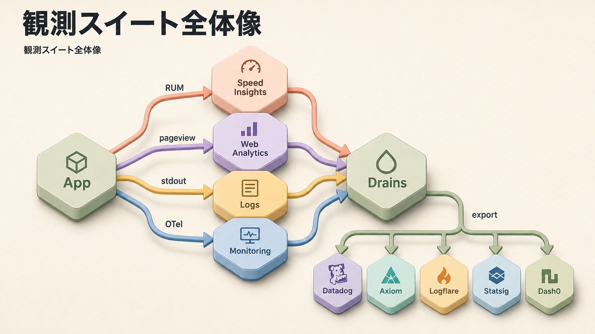

| 機能 | Hobby | Pro | Enterprise |
|---|:-:|:-:|:-:|
| **Speed Insights** (RUM, Web Vitals) | 制限 | 利用可 | 利用可 |
| **Web Analytics** | 2.5k events | 含み + 従量 | 従量課金 |
| **Logs** | 利用可 | 利用可 | 利用可 |
| **Monitoring** (集約可視化) | 不可 | 利用可 | 利用可 |
| **Drains** (OTel 外部転送) | 不可 | $0.50/GB | 従量課金 |

**👨‍💻 エンジニアへの関係**

- Datadog / NewRelic を別途契約せずに本番運用が始められる。本格運用後は Drains で既存 SaaS に転送。

**🏢 ClassLab. での活用**

- 短期: weekly-news のページ別 Web Vitals 計測、雑務アプリの障害ログ確認。
- 中長期: Drains で既存 Datadog / Axiom に統合、SLO 監視。

**🔥 差別化点**

- 競合は別途 Sentry / Datadog 必須が多いが、Vercel は **デプロイと同じダッシュボードに観測が乗っている**。

---

### 4.7 Security

#### 4.7.1 セキュリティ全体像

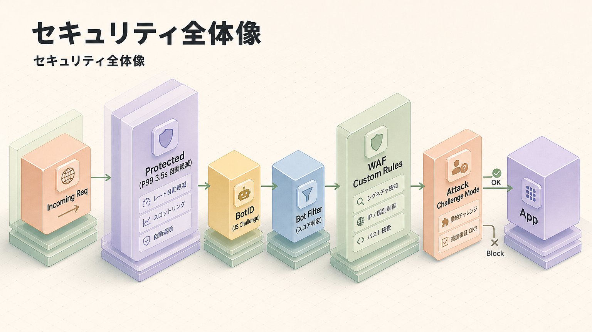

| 機能 | Hobby | Pro | Enterprise |
|---|:-:|:-:|:-:|
| **DDoS Mitigation (Protectd)** | 自動 | 自動 | 自動 |
| **Vercel Firewall** | 標準ルール | カスタム | 高度 |
| **WAF Custom Rules** | 不可 | 利用可 | 利用可 |
| **BotID** (GA 2025-06) | 従量課金 | 従量課金 | 従量課金 |
| **Bot Filter** (Public Beta、全プラン無料) | 利用可 | 利用可 | 利用可 |
| **Attack Challenge Mode** | 制限あり | 利用可 | 利用可 |
| **Sign in with Vercel** (GA 2025-11) | 利用可 | 利用可 | 利用可 |
| **Audit Logs** | 不可 | 不可 | 利用可 |

**🏢 ClassLab. での活用**

- 短期: 全雑務スキルの Vercel デプロイで Bot Filter を有効化、無料で AI 経由のスクレイピング遮断。
- 中長期: ライフライン申込フォームに BotID を入れて自動入札 bot を完全遮断、WAF Custom Rules で日本国外アクセス制御。

**🔥 差別化点**

- 2026 年 2 月以降で **148 億の悪性リクエストを 108M IP からブロック**。Cloudflare WAF と並ぶ品質を、Vercel デプロイと同じダッシュボードで設定可能。
- WAF ルール変更が **300ms でグローバル反映**、ロールバックも即時。

---

### 4.8 Configuration & DX

#### 4.8.1 vercel.ts

**🎯 概要**

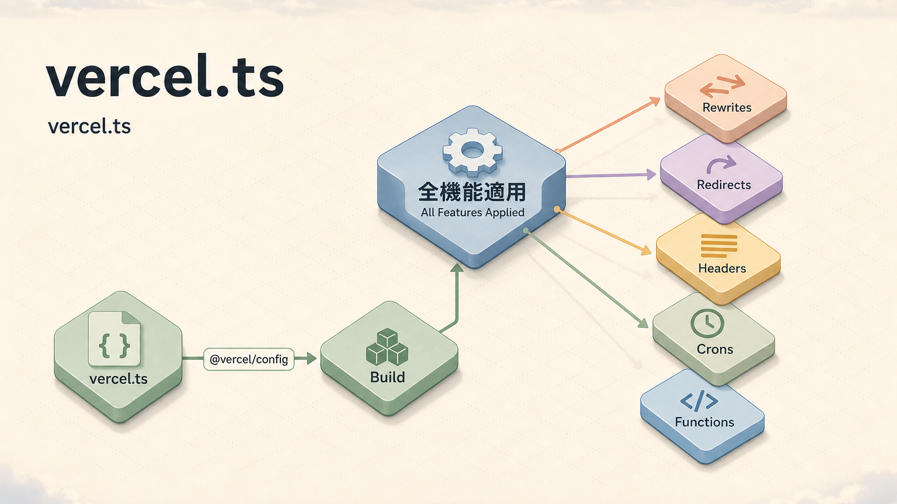

`vercel.json` の TypeScript 版。型安全 + 動的ロジック + env アクセス。

**💳 利用可能プラン**

| 全プラン | 利用可 |

---

#### 4.8.2 Environment Variables / `vercel env`

**🎯 概要**

| スコープ | 用途 |
|---|---|
| Development | ローカル `vercel env pull` |
| Preview | PR ごとの検証 |
| Production | 本番 |

**💳 利用可能プラン**

| 全プラン | 利用可 |

**🏢 ClassLab. での活用**

- 短期: API キー（OpenAI / Salesforce / WP）の集約管理。
- 中長期: 環境分離戦略の標準化。

---

#### 4.8.3 Vercel Flags（GA 2026-04）

**🎯 概要**

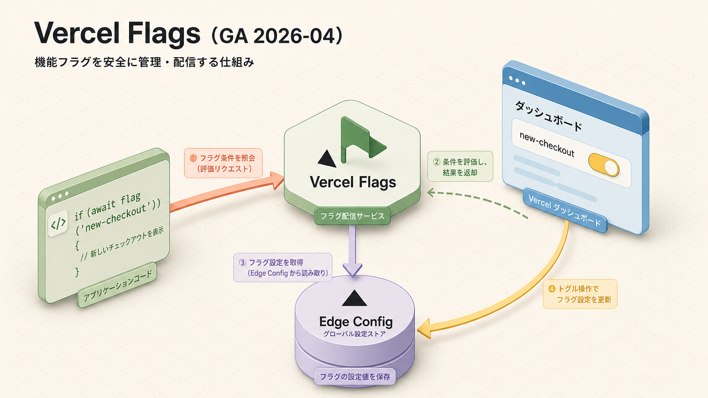

Edge Config 統合の Feature Flag 管理。

**💳 利用可能プラン**

| Hobby | Pro | Enterprise |
|:-:|:-:|:-:|
| 利用可 | 利用可 | 利用可 |

**🏢 ClassLab. での活用**

- 短期: 内製アプリの段階的ロールアウト。
- 中長期: ライフライン顧客タイプ別の機能制御。

**🔥 差別化点**

- LaunchDarkly / Statsig より安価、しかも Edge Config 統合で **読取オーバーヘッドが実質ゼロ**。

---

#### 4.8.4 Vercel CLI / Toolbar

**🎯 概要**

- CLI 最新は v54.x（システムは v51 → 要 update）。`vercel deploy` / `vercel logs` / `vercel link` / `vercel env`。
- Toolbar: ブラウザ内で feature flag 切替 / プレビュー / コメント / a11y inspect / 編集。

**💳 利用可能プラン**

| 全プラン | 利用可 |

---

### 4.9 Collaboration & Platform

| 機能 | Hobby | Pro | Enterprise | 概要 |
|---|:-:|:-:|:-:|---|
| Vercel Marketplace | 利用可 | 利用可 | 利用可 | DB / CMS / 認証 / 解析の統合インストール |
| **Vercel for Platforms** | 不可 | 制限あり | 利用可 | マルチテナント SaaS 向け、テナント毎ドメイン管理 |
| Teams / RBAC | 個人のみ | 利用可 | 利用可 | チームメンバー管理 |
| SCIM | 不可 | 不可 | 利用可 | IdP 自動プロビジョン |
| Audit Logs | 不可 | 不可 | 利用可 | 操作監査 |
| SSO / SAML | 不可 | 制限あり | 利用可 | 認証統合 |

**🏢 ClassLab. での活用**

- 短期: チーム招待・viewer 無制限を活かして PM / デザイナーに preview 共有。
- 中長期: ライフライン顧客毎のホワイトラベル展開なら Vercel for Platforms。Enterprise 要件は SCIM + Audit 込みで契約。

---

## 5. プラン早見表（全機能 × プラン マトリクス）

| カテゴリ | 機能 | Hobby | Pro | Enterprise |
|---|---|:-:|:-:|:-:|
| Compute | Fluid Compute | 利用可 | 利用可 | 利用可 |
| Compute | Functions | 制限 | 従量課金 | 従量課金 |
| Compute | Sandbox | 従量課金 | 従量課金 | 従量課金 |
| Compute | Routing Middleware | 利用可 | 利用可 | 利用可 |
| Compute | Cron Jobs | 1/day | 利用可 | 利用可 |
| Compute | Queues | Beta | Beta | Beta |
| AI | AI Gateway | 従量課金 | 従量課金 | 従量課金 |
| AI | AI SDK | 利用可 | 利用可 | 利用可 |
| AI | v0 | 別契約 | 別契約 | 別契約 |
| AI | Vercel Agent | Beta | Beta | Beta |
| AI | MCP Server | Beta | Beta | Beta |
| AI | Workflow DevKit | 利用可 | 利用可 | 利用可 |
| Storage | Blob | 1GB | 従量課金 | 従量課金 |
| Storage | Edge Config | 1 store | 利用可 | 利用可 |
| Storage | Runtime Cache | 利用可 | 利用可 | 利用可 |
| Storage | Marketplace DB | 各社無料枠 | 統合請求 | 従量課金 |
| Frontend | Next.js App Router | 利用可 | 利用可 | 利用可 |
| Frontend | Cache Components / PPR | 利用可 | 利用可 | 利用可 |
| Frontend | Image Optimization | 5k変換 | 従量課金 | 従量課金 |
| Frontend | Turbopack | 利用可 | 利用可 | 利用可 |
| Frontend | shadcn / next-forge | 利用可 | 利用可 | 利用可 |
| Delivery | Git Integration | 利用可 | 利用可 | 利用可 |
| Delivery | Preview Deployments | 利用可 | 利用可 | 利用可 |
| Delivery | Rolling Releases | 不可 | 利用可 | 利用可 |
| Delivery | Instant Rollback | 利用可 | 利用可 | 利用可 |
| Delivery | Custom Domains | 50 | 利用可 | 利用可 |
| Delivery | Flat Rate CDN | 不可 | Beta | 制限あり |
| Observability | Speed Insights | 制限あり | 利用可 | 利用可 |
| Observability | Web Analytics | 2.5k | 従量課金 | 従量課金 |
| Observability | Logs | 利用可 | 利用可 | 利用可 |
| Observability | Monitoring | 不可 | 利用可 | 利用可 |
| Observability | Drains | 不可 | $0.50/GB | 従量課金 |
| Security | DDoS Mitigation | 利用可 | 利用可 | 利用可 |
| Security | Firewall (基本) | 制限あり | 利用可 | 利用可 |
| Security | WAF Custom Rules | 不可 | 利用可 | 利用可 |
| Security | BotID | 従量課金 | 従量課金 | 従量課金 |
| Security | Bot Filter | 利用可 | 利用可 | 利用可 |
| Security | Attack Challenge Mode | 制限あり | 利用可 | 利用可 |
| Security | Sign in with Vercel | 利用可 | 利用可 | 利用可 |
| Config | vercel.ts | 利用可 | 利用可 | 利用可 |
| Config | env / vercel env | 利用可 | 利用可 | 利用可 |
| Config | Vercel Flags | 利用可 | 利用可 | 利用可 |
| Config | CLI / Toolbar | 利用可 | 利用可 | 利用可 |
| Platform | Marketplace | 利用可 | 利用可 | 利用可 |
| Platform | For Platforms | 不可 | 制限あり | 利用可 |
| Platform | Teams / RBAC | 制限あり | 利用可 | 利用可 |
| Platform | SCIM / Audit Logs | 不可 | 不可 | 利用可 |
| Platform | SSO / SAML | 不可 | 制限あり | 利用可 |

---

## 6. 料金体系の詳細

### 6.1 Hobby — 無料 / 停止挙動に注意

| 項目 | 含まれる枠 |
|---|---|
| Fast Data Transfer | 100 GB / 月 |
| Edge Requests | 1M / 月 |
| Function Invocations | 1M / 月 |
| Active CPU | 4 時間 / 月 |
| Provisioned Memory | 360 GB-h / 月 |
| Blob Storage | 1 GB |
| Image Transformations | 5,000 / 月 |

> 商用利用不可（Fair Use Guidelines）。**枠超過時はオーバージ不可で停止**。

### 6.2 Pro — $20/開発者/月 + 従量

| 項目 | 含まれる枠 | 超過料金 |
|---|---|---|
| 月額 | $20 利用クレジット込み | — |
| Fast Data Transfer | 1 TB / 月 | $0.15 / GB |
| Edge Requests | 10M / 月 | 従量 |
| Active CPU | 含み | $0.128 / h |
| Provisioned Memory | 含み | $0.0106 / GB-h |
| Function Invocations | 含み | $0.60 / M |
| Blob Storage | 含み | 従量 |
| Drains | — | $0.50 / GB |

**Viewer シート無制限** = デザイナー / PdM はコストゼロで招待可能。

### 6.3 Enterprise — $25k〜/年

- 99.99% SLA
- SCIM / SAML / Audit Logs
- 専用インフラ / 専用サポート
- カスタム契約

### 6.4 料金最適化の勘所

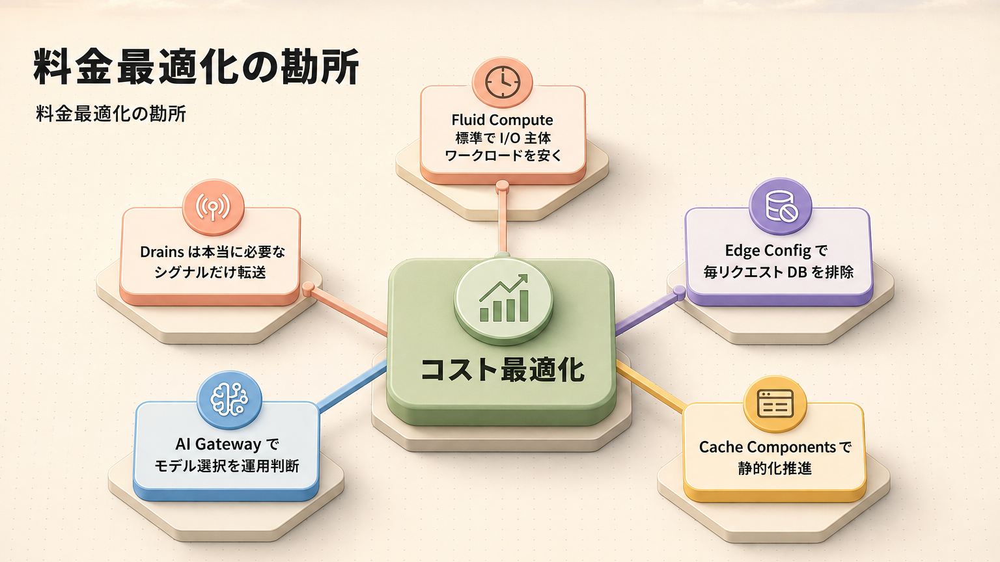

---

## 7. ClassLab. での Vercel 活用ロードマップ（汎用例）

> ※ ここで挙げるのは「ClassLab. の業務領域に当てはまる汎用ユースケース」。具体的施策化は別途案件単位で議論。

### 7.1 短期（〜3 ヶ月）

| テーマ | 機能 | 想定効果 |
|---|---|---|
| 雑務スキル基盤の標準化 | Fluid Functions + Vercel Cron | 個別 cron 環境（手動 sh + Mac）の自動化 |
| LLM コスト可視化 | AI Gateway 経由化 | プロバイダ別コスト可視化、運用判断材料 |
| Web Vitals 把握 | Speed Insights | 既存 Next.js サイトの体感速度を定量化 |
| プレビュー文化定着 | Preview Deployments + Toolbar | PdM/デザイナー巻込んだレビューループ短縮 |
| Bot 防御 | Bot Filter（無料） | 申込フォーム・採用サイトへの bot アクセス遮断 |

### 7.2 中長期（3〜12 ヶ月）

| テーマ | 機能 | 想定効果 |
|---|---|---|
| 長時間ワークフロー durable 化 | Workflow DevKit | 申込フローや AI Agent パイプラインの信頼性向上 |
| AI エージェント実行基盤 | Sandbox + Agent + MCP | 教育・社内自動化での安全なコード実行 |
| マルチテナント展開 | Vercel for Platforms | 顧客別ホワイトラベル提供 |
| 観測 SaaS 統合 | Drains → Datadog / Axiom | 既存運用ツールへの一元集約 |
| 高度な攻撃対策 | WAF Custom Rules + BotID | LLM 経由スクレイピング・自動入札 bot 対策 |
| 旧 LP の刷新 | Next.js 16 + PPR + shadcn | 体感速度と保守性の同時改善 |
| 大規模 SaaS 新規 | next-forge + Marketplace DB (Neon) | 立上速度と本番品質の両立 |

### 7.3 棚卸し対象（既存資産）

| プロジェクト / スキル | 現状 | Vercel 機能適用候補 |
|---|---|---|
| classlab-weekly-news | Next.js + Vercel | Cache Components / Speed Insights / Flags |
| 雑務スキル群 (content-post, weekly-news, hn-trends 等) | ローカル実行中心 | Functions + Cron + Gateway へ移行 |
| ライフライン Web 申込 | 別環境 | BotID / WAF / Flags / WDK 候補 |
| エンジニア採用サイト | WordPress | 段階的 Headless 化 + Vercel 配信 |
| Findy Enterprise 管理 | 個人スクリプト | Functions + Cron + Marketplace KV 化 |

---

## 8. 採用判断フロー

### 8.1 新規プロジェクトでの選択フロー

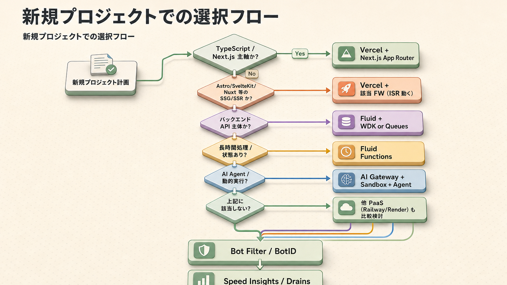

### 8.2 採用適性 Quadrant

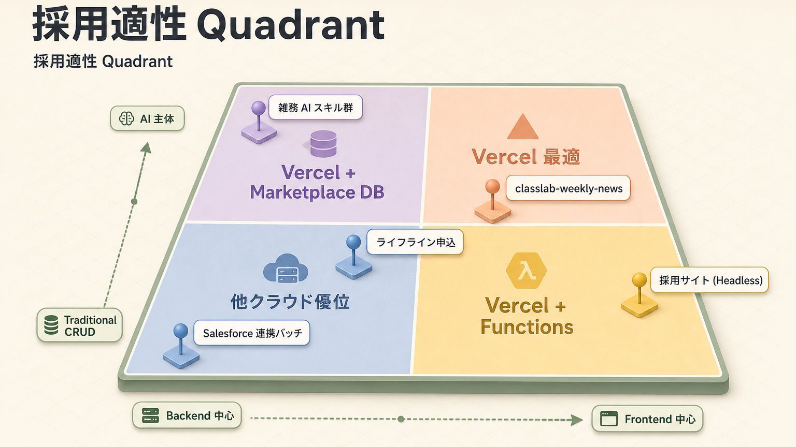

> 右上に近いほど Vercel が最適。左下は他クラウド（AWS / Salesforce 直接連携）と比較検討の余地大。

---

## 9. 公式リファレンス & Sources

### 公式ドキュメント

- 全体: https://vercel.com/docs
- 変更履歴: https://vercel.com/changelog
- 料金: https://vercel.com/pricing
- AI Gateway: https://vercel.com/docs/ai-gateway
- AI SDK: https://sdk.vercel.ai/docs
- Fluid Compute / Functions: https://vercel.com/docs/functions
- Sandbox: https://vercel.com/docs/vercel-sandbox
- Workflow DevKit: https://vercel.com/docs/workflows
- Storage: https://vercel.com/docs/storage
- Edge Config: https://vercel.com/docs/edge-config
- Marketplace: https://vercel.com/docs/marketplace-storage
- Observability: https://vercel.com/products/observability
- Drains: https://vercel.com/docs/drains
- Security: https://vercel.com/security
- Firewall: https://vercel.com/docs/vercel-firewall
- `vercel.ts`: https://vercel.com/docs/project-configuration/vercel-ts

### Web Sources

- [Vercel Documentation](https://vercel.com/docs)
- [Vercel Changelog](https://vercel.com/changelog)
- [Vercel Pricing](https://vercel.com/pricing)
- [Introducing Active CPU pricing for Fluid compute](https://vercel.com/blog/introducing-active-cpu-pricing-for-fluid-compute)
- [The AI Cloud: A unified platform for AI workloads](https://vercel.com/blog/the-ai-cloud-a-unified-platform-for-ai-workloads)
- [Introducing Vercel Drains](https://vercel.com/blog/introducing-vercel-drains)
- [Built-in durability: Introducing Workflow Development Kit](https://vercel.com/blog/introducing-workflow)
- [Introducing Vercel MCP](https://vercel.com/blog/introducing-vercel-mcp-connect-vercel-to-your-ai-tools)
- [Vercel security roundup: improved bot defenses, DoS mitigations](https://vercel.com/blog/vercel-security-roundup-improved-bot-defenses-dos-mitigations-and-insights)
- [How Vercel found extreme PMF by focusing on simplification (First Round)](https://review.firstround.com/podcast/how-vercel-found-extreme-product-market-fit-by-focusing-on-simplification-guillermo-rauch-vercels-ceo/)
- [Vercel's Guillermo Rauch on Building the Generative Web (Sequoia)](https://sequoiacap.com/podcast/training-data-guillermo-rauch/)
- [How Developer Experience Powered Vercel's $200M+ Growth](https://www.reo.dev/blog/how-developer-experience-powered-vercels-200m-growth)
- [Frameworks on Vercel](https://vercel.com/docs/frameworks)
