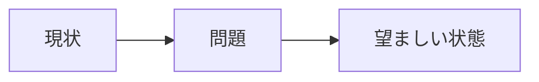

<!--
task-21 W2.4 frontmatter (機械可読、draft-flow-guard.sh / harness-audit が読む):
approval_required: true            # 承認必須 (default true、Loop モードでも user 承認スキップ不可)
approved_at:                       # 承認日 (空 = 未承認、user 承認後に YYYY-MM-DD)
approved_by:                       # 承認者 (空 = 未承認、承認後に "user" 等)
retroactive: false                 # 遡及作成か (true = 既存実装の事後 draft 化、recall_poc/docs/draft/0[1-3] のような事案)
-->

# <設計タイトル>

**ステータス:** 🔲 **draft（YYYY-MM-DD 起案、user 承認待ち）**
**起点:** <ユーザー報告 / 監査結果 / 障害ポストモーテム / etc>
**前提:**
- <前提となる完了済タスクや前提環境>

**関連 fixture / rule:**
- `<.claude/rules/...>`
- `<tests/fixtures/...>`

---

## 1. 真因サマリ / 課題サマリ

<1-2 段落で「なぜこの設計が必要か」を端的に。>



**真因:** <技術的根本原因>

**副次:** <派生する小さな課題>

---

## 2. 解決アプローチ比較

| 案 | 内容 | 工数 | メリット | デメリット |
|:---:|:---|---:|:---|:---|
| **A** | … | 0.5 | … | … |
| **B** | … | 2.0 | … | … |
| **C ハイブリッド** | A + B 段階 | 1.2 | … | … |

→ **<選択案>** を推奨。理由: …

---

## 3. 採用案の詳細設計

### Task 計画 (採用 6 条準拠、Phase 中間階層廃止)

> **採用 6 条 (2026-05-25)**: Task = Phase = N Step、Phase 中間階層廃止。1 draft = 1 Task (= 1 deliverable)、複数 deliverable なら複数 draft に分割。

#### Step 計画

| Step | Status | 作業概要 | 工数 | 依存 |
|:---:|:---:|:---|---:|:---|
| 1 | 🔲 | <作業 1> | 0.3h | — |
| 2 | 🔲 | <作業 2> | 0.5h | Step 1 |
| 3 | 🔲 | (テスト設計レビュー) 5+ reviewer 動的選定 | 0.5h | Step 2 |
| 4 | 🔲 | (テスト合格) unit/integration/E2E test | 0.3h | Step 3 |
| 5 | 🔲 | (リファクタリング) 3 観点判定 or skip | 0.2h | Step 4 |

合計: <X> 工数

### Step 1 詳細

#### スコープ
- 対象ファイル: `<path>`
- 対象モジュール: `<module>`

#### 変更内容
```ts
// before
…
// after
…
```

#### テスト
- `tests/foo.test.ts`: <観点>

### Step 2 詳細

…

### Step 3-5 詳細 (Task 最終 3 Steps、固定)

- **Step 3 (テスト設計レビュー)**: 5+ reviewer 動的選定 (tdd-guide / test-automator / qa-expert / pr-test-analyzer + domain-specific)、収束まで反復 (上限 5 回、bypass `ECC_TEST_DESIGN_REVIEW_OFF=1`)
- **Step 4 (テスト合格)**: UI 含む Task は E2E 必須、それ以外は unit/integration test、既存 smoke regression 0
- **Step 5 (リファクタリング)**: 3 観点 (持続可能性 / 汎用性 / 非冗長化) で判定、不要なら `skip: <reason>` 明示

---

## 4. リスクと緩和

| リスク | 確率 | 影響 | 緩和 |
|---|:---:|:---:|---|
| <破壊的変更> | M | H | <段階適用 / feature flag> |
| <パフォーマンス劣化> | L | M | <ベンチで検証> |

---

## 5. 移行計画

- [ ] feature flag 投入
- [ ] 内部テストデータで検証
- [ ] dry-run で本番影響予測
- [ ] 段階ロールアウト
- [ ] 監視（メトリクス・エラーログ）
- [ ] flag 削除 + cleanup

---

## 6. 完了条件（DoD）

- [ ] <観測可能な振る舞い>
- [ ] テスト追加 + 全 PASS
- [ ] docs 反映（rules / runbook 含む）
- [ ] 本番 smoke
- [ ] パフォーマンス劣化なし

---

## 7. 工数見積

<合計時間と内訳>

---

## 8. レビューサイクル (workflow.md §「収束条件」準拠、2026-05-26 追加)

> draft レビューは **reviewer 最低 3 体以上 並列起動** + **CRITICAL/HIGH/MEDIUM = 0 まで反復** (LOW 許容、上限 5 回)。
> 各 iter の reviewer 名 + 件数 + 修正 commit を以下 table に append する。詳細: `.claude/rules/workflow.md` §「収束条件」+ `.claude/commands/design-review.md`。

| iter | 日付 | reviewer (起動数) | CRITICAL | HIGH | MEDIUM | LOW | 修正 commit | 状態 |
|:---:|---|---|:---:|:---:|:---:|:---:|---|---|
| 1 | YYYY-MM-DD | architect, security-reviewer, code-architect, ... (5) | 0 | 2 | 5 | 3 | `<sha1>` | 修正待ち |
| 2 | YYYY-MM-DD | (同上、5) | 0 | 0 | 1 | 2 | `<sha2>` | 修正待ち |
| 3 | YYYY-MM-DD | (同上、5) | 0 | 0 | 0 | 1 | — | **収束 (承認待ちへ)** |

**収束判定**: CRITICAL = 0 ∧ HIGH = 0 ∧ MEDIUM = 0 (LOW は許容、cosmetic finding として記録のみ)

**上限超過時 (iter 5 でも未収束)**: user escalation → `ECC_DESIGN_REVIEW_OFF=1` で bypass + `.claude/.workflow-state/bypass.log` 記録 + bypass 理由を §9 承認履歴末尾に追記

---

## 9. 承認履歴

| 日付 | 承認者 | 結果 |
|---|---|---|
| YYYY-MM-DD | user | 承認 → `docs/tasks/task-<ID>-<slug>.md` 作成 |

---

## 10. 関連

- 既存設計: [<file>](../<file>.md)
- 監査: [<audit>](<url>)
- 関連タスク: <#N>
