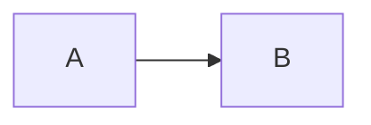

# Task #<ID>: <タスク名>

> Status: **draft (要承認)** | **🔲 未着手** | **🔄 進行中** | **✅ 完了**
> 起案: YYYY-MM-DD
> 関連: <#N, #M> / Phase <X>
> 設計起源: [<draft または PDCA リンク>](../draft/<file>.md)

## 背景・目的

<なぜこのタスクが必要か。1〜3 段落で。>

## 仕様（要決定 → 決定済）

### Q1: <決定すべき事項>

| 案 | 内容 | 評価 |
|---|---|---|
| **A** | … | … |
| B | … | … |

→ <選択結果と理由>

### Q2: …

## 設計

<採用案に基づく具体設計。図・コード・schema を含めて良い。>

## TDD 戦略

### RED（先に追加するテスト）

- `tests/foo.test.ts`
  - <観点1>
  - <観点2>

### GREEN（最小実装）

- `src/lib/foo.ts` を新設し <X> を実装
- 既存 N tests + 新規 M tests を全 PASS

### REFACTOR

- <抽出・命名整理・重複排除の余地>

## Wave 構成

### Wave 計画前の事前確認 (必須)

別 repo 作業 / 既存 gap-review report 起点の Wave 計画では、各 finding に対し以下を**着手前に**実施:

1. `git log --all --grep <finding-id-or-keyword> --oneline` で既存 commit を確認 (別 repo は `git -C <abs path> log --all --grep ...`)
2. 該当 file を Read で現状確認
3. 解消済 finding は Wave list から除外し、本テンプレに「[no-op、commit <sha> で解消済]」と記録
4. 未解消 finding のみ subagent dispatch 対象に残す

省略時: 重複 subagent 起動 / no-op 発覚での Wave 再計画コスト

| Wave | 内容 | 工数 | 依存 |
|:---:|:---|---:|:---|
| W1 | … | 0.5h | — |
| W2 | … | 1.0h | W1 |

合計工数: <X> h

## 完了条件

- [ ] <条件1: 機能仕様>
- [ ] <条件2: テスト追加 + 全 PASS>
- [ ] <条件3: docs 反映>
- [ ] <条件4: 既存 N tests 維持>
- [ ] <条件5: 本番動作確認 / smoke>

## 工数見積

<例: 2-3 時間（実装 60 分 + TDD テスト 60 分 + 検証 30 分）>

## 影響範囲

| 範囲 | 詳細 |
|---|---|
| ファイル | `src/...`, `tests/...`, `docs/...` |
| migration | <あり/なし> |
| 環境変数 | <追加・変更> |
| 互換性 | <破壊的変更の有無> |

## 再発防止

<このタスクから派生する rule / skill / 監査項目があれば。>

## ステータスログ

| 日付 | 状態 | 備考 |
|---|---|---|
| YYYY-MM-DD | 起案 | 設計 draft 起こし |
| YYYY-MM-DD | 承認 | user 承認、`list.md` に追加 |
| YYYY-MM-DD | 着手 | branch `feature/issue-<ID>-<slug>` |
| YYYY-MM-DD | 完了 | commit `<sha>`、+<N> tests |

## 派生 task / 次アクション候補

このタスクの実装中・レビュー中・完了時に「これは別 task として管理すべき」と判断した副産物 (byproduct) を箇条書きで記入する。

### 義務 (development-process.md §「副産物発生時の即時 draft 起こし義務」準拠)

- 副産物発見の瞬間に **必ず本セクションに記入** (memory / 会話履歴に流すだけは禁止)
- task 完了 (`/finish-task`) 時、本セクションのすべての entry が以下のいずれかに処理済であること:
  - (a) `docs/draft/<slug>.md` に draft 起こし済 (緊急度 🔴 / 🟡)
  - (b) `docs/tasks/next-actions.md` に entry 追加済 (緊急度 🟢 + 後日判断)
  - (c) 無視 (理由を明記、commit message に記録)
- 未処理 entry が残ったまま `/finish-task` は `workflow-guard.sh` が BLOCK する (将来 W4 拡張)

### 記入例

- [ ] (🔴) PR 作成 — `feat/loop-mode` → `main` の merge → [draft 起こし済](../draft/create-pr-feat-loop-mode.md) → task #2
- [ ] (🟡) context-budget hook 実発火検証 — → [draft 起こし済](../draft/context-budget-hook-verification.md) → task #3
- [ ] (🟢) 別リポ調査 (後日) — [next-actions.md](next-actions.md) entry #N で記録
- [x] (🟢→無視) 旧 API のリファクタ案 — 工数過大 + 互換性破壊リスクで不採用、本 commit message に理由記載

### 関連

- [`next-actions.md`](next-actions.md) — 本セクションと連動する registry
- [`.claude/rules/development-process.md`](../../.claude/rules/development-process.md) §「副産物発生時の即時 draft 起こし義務」

## 関連

- Draft: [<draft file>](../draft/<file>.md)
- 依存タスク: <#N>
- 派生タスク: <#M>
