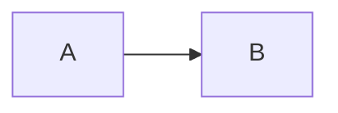

# Task #<ID>: <タスク名>

> Status: **draft (要承認)** | **🔲 未着手** | **🔄 進行中** | **✅ 完了**
> 起案: YYYY-MM-DD
> 関連: <#N, #M> / Phase <X>
> 設計起源: [<draft または PDCA リンク>](../draft/<file>.md)

## 背景・目的

<なぜこのタスクが必要か。1〜3 段落で。>

## 仕様（要決定 → 決定済）

### Q1: <決定すべき事項>

| 案 | 内容 | 評価 |
|---|---|---|
| **A** | … | … |
| B | … | … |

→ <選択結果と理由>

### Q2: …

## 設計

<採用案に基づく具体設計。図・コード・schema を含めて良い。>

## TDD 戦略

### RED（先に追加するテスト）

- `tests/foo.test.ts`
  - <観点1>
  - <観点2>

### GREEN（最小実装）

- `src/lib/foo.ts` を新設し <X> を実装
- 既存 N tests + 新規 M tests を全 PASS

### REFACTOR

- <抽出・命名整理・重複排除の余地>

## Wave 構成

| Wave | 内容 | 工数 | 依存 |
|:---:|:---|---:|:---|
| W1 | … | 0.5h | — |
| W2 | … | 1.0h | W1 |

合計工数: <X> h

## 完了条件

- [ ] <条件1: 機能仕様>
- [ ] <条件2: テスト追加 + 全 PASS>
- [ ] <条件3: docs 反映>
- [ ] <条件4: 既存 N tests 維持>
- [ ] <条件5: 本番動作確認 / smoke>

## 工数見積

<例: 2-3 時間（実装 60 分 + TDD テスト 60 分 + 検証 30 分）>

## 影響範囲

| 範囲 | 詳細 |
|---|---|
| ファイル | `src/...`, `tests/...`, `docs/...` |
| migration | <あり/なし> |
| 環境変数 | <追加・変更> |
| 互換性 | <破壊的変更の有無> |

## 再発防止

<このタスクから派生する rule / skill / 監査項目があれば。>

## ステータスログ

| 日付 | 状態 | 備考 |
|---|---|---|
| YYYY-MM-DD | 起案 | 設計 draft 起こし |
| YYYY-MM-DD | 承認 | user 承認、`list.md` に追加 |
| YYYY-MM-DD | 着手 | branch `feature/issue-<ID>-<slug>` |
| YYYY-MM-DD | 完了 | commit `<sha>`、+<N> tests |

## 関連

- Draft: [<draft file>](../draft/<file>.md)
- 依存タスク: <#N>
- 派生タスク: <#M>
