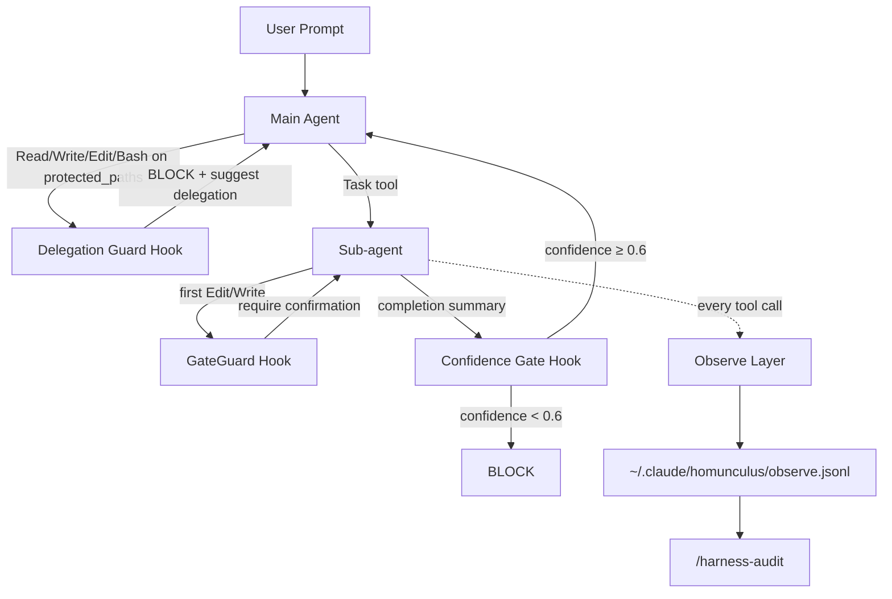

# 平井メソッド (hirai-method)

> **Defense-first Claude Code harness** — forced delegation, fact gates, 100% observation, F1-F3 self-improvement loop.

[](LICENSE)

## なぜ「平井メソッド」か

LLM コーディングエージェントは、放っておくと **fabrication（事実の捏造）** と **盲目リトライ** に流れる。
このハーネスはその 2 つを「**事前に成立を不可能にする**」設計を取る。事後に検出するのではなく、hook で実行を block する。具体的には:

1. **委譲強制（Delegation Guard）** — メインエージェントは保護パス配下の Read/Write/Edit/Bash を一切できない。すべてサブエージェント経由を hook で強制。メインの記憶と直接書き込みを切り離し、ハルシネーションが本番コードに到達する経路を物理的に遮断する。
2. **事実検証ゲート（GateGuard / TaskGuard / ConfidenceGate）** — 初回 Edit/Write、破壊的 Bash、サブエージェント完了宣言の各タイミングで「事前条件」「自己評価信頼度」をチェックし、未達なら block する。
3. **100% 観測（Observation Layer）** — すべての tool call を JSONL で外部 root（`~/.claude/homunculus/`）に記録し、`/harness-audit` で実測指標（適用率・block 回数・失敗ループ件数）を出力する。監査可能性が常に担保される。

「平井メソッド」は、これら 3 つを **個人 PoC レベルで成立させた最小完備セット**である。

## Features

| 層 | 名前 | 役割 |
|---|---|---|
| F1 | **GateGuard** | 初回 Edit/Write/破壊的 Bash 前の事実検証ゲート |
| F2 | **TaskRule / Verification** | タスク規律 + PR 直前 6-phase 検証ループ |
| F3 | **Confidence Gate** | サブエージェント完了時の self-confidence 閾値 (≥0.6) |
| L1 | **eval-harness** | pass@k メトリクスによる eval-driven development |
| L2 | **gan-harness** | adversarial 反復 build/design |
| L3 | **verification-loop** | 多段検証（lint / test / build / type / coverage / security）|
| L4 | **continuous-learning-v2** | hook ベースの instinct 学習・promote / global 共有 |
| L5 | **agent-introspection-debugging** | サブエージェント失敗の自己診断ループ |

加えて:

- **Hook 強制委譲ガード** (`delegation-guard.sh`) — `protected_paths` 配下のメイン直接操作を block
- **Bash whitelist SSoT** (`bash-whitelist.txt`) — 1 行追記で許可、申請テンプレ付き
- **Mermaid 構文検証** — `.md` / `.mdx` 保存時に mermaid@11 で自動 parse
- **失敗ループ検出** (`failure-loop-detect.sh`) — 同種エラー 3 連続で `/agent-introspect` 提案
- **SWE-bench Lite 評価機構** — patch 生成変種（unified-diff / whole-file / hybrid）の適用率を実測
- **repo-map skill** — Aider 風シンボル抽出による context 圧縮

## Architecture



## Installation

```bash
# 1. Clone into your project
git clone https://github.com/<your-account>/hirai-method.git .claude-harness

# 2. Copy the harness layer
cp -R .claude-harness/.claude .
cp .claude-harness/CLAUDE.md ./CLAUDE.md.template   # use as template

# 3. Edit harness-config to fit your repo
$EDITOR .claude/harness-config.yml
#   - protected_paths: [src, tests, scripts]   # ← match your codebase
#   - task_dir / draft_dir
#   - bash_whitelist_path
```

詳細手順は [`docs/PORTABILITY.md`](docs/PORTABILITY.md) を参照。1 つの YAML を編集するだけで全 hook と全 rule の挙動が連動する設計。

## Self-improvement layers (F1-F3 + L1-L5)

詳細は [`docs/SELF_IMPROVEMENT.md`](docs/SELF_IMPROVEMENT.md) と [`docs/CONFIDENCE-GATE.md`](docs/CONFIDENCE-GATE.md) を参照。

## Benchmarks

`.claude/skills/eval-harness/swe-bench/` に SWE-bench Lite ベースの dry-run 評価機構が同梱されている。

| version | patch 適用方式 | 適用率 (sample size) | 累計 cost |
|---|---|---:|---:|
| C-1 | unified-diff | 40% (2/5) | $1.078 |
| C-1.5 | whole-file | 60% (3/5) | $0.853 |
| C-1.6 | hybrid | TBD | TBD |

C-1.5 の whole-file 方式は適用率を 1.5× にしつつコストを下げる結果になった。C-1.6 hybrid は両方式の自動切替を試行中。

評価実行: `python3 .claude/skills/eval-harness/swe-bench/runner.py --tasks tasks/lite-50.json --variant hybrid`

## Comparison to other harnesses

| harness | 委譲強制 | 事実検証 | 100% 観測 | self-confidence | OSS / 商用 |
|---|:---:|:---:|:---:|:---:|---|
| **hirai-method** | ✅ hook block | ✅ F1/F2/F3 | ✅ JSONL | ✅ ≥0.6 | OSS |
| SuperClaude | — | partial | — | ✅ 0.6 | OSS |
| BMAD | — | — | — | — | OSS |
| claude-flow | — | — | partial | — | OSS |
| OpenHands | partial | — | partial | — | OSS |
| SWE-agent | — | — | partial | — | OSS |
| Aider | — | — | — | — | OSS |

「委譲強制を hook block で物理的に成立させる」点が hirai-method の差別化要素。

## Repository layout

```
.
├── .claude/
│   ├── agents/             # subagent definitions
│   ├── commands/           # slash commands (/commit /reviewpr /verify ...)
│   ├── hooks/              # PreToolUse / PostToolUse / SubagentStop ...
│   ├── rules/              # paths-scoped rules
│   ├── scripts/            # python helpers (audit / stocktake)
│   ├── skills/             # eval-harness / continuous-learning-v2 ...
│   ├── templates/          # docs/tasks docs/draft template
│   ├── bash-whitelist.txt  # delegation-guard SSoT
│   ├── harness-config.yml  # single source of truth for paths
│   └── settings.json       # hooks + permissions wiring
├── docs/
│   ├── INVENTORY.md
│   ├── INVENTORY-stocktake-2026-05-04.md
│   ├── PORTABILITY.md
│   ├── SELF_IMPROVEMENT.md
│   └── CONFIDENCE-GATE.md
├── CLAUDE.md               # template for downstream projects
├── CONTRIBUTING.md
├── LICENSE                 # MIT
└── README.md
```

## License

MIT — see [`LICENSE`](LICENSE).

## Contributing

[`CONTRIBUTING.md`](CONTRIBUTING.md) を参照。
