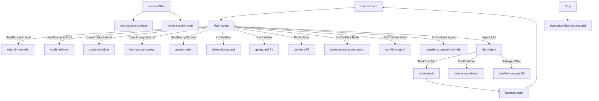
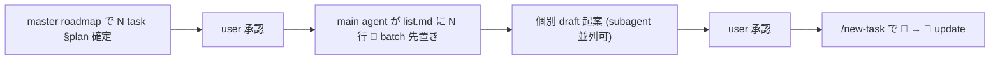
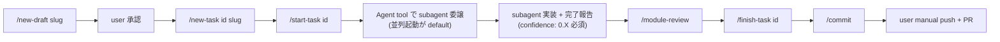

# 平井メソッド (hirai-method)

> **Defense-first Claude Code harness** — 委譲強制 / 事実検証ゲート / 100% 観測 / 5 + 3 層自己改善 / Workflow 強制 / 副産物 discharge / Session 永続化

[](LICENSE)


---

## TL;DR (3 軸先出し)

| 軸 | 内容 |
|---|---|
| **🎯 なんのため** | AI エージェントの fabrication (捏造) / scope creep (範囲逸脱) / silent failure (隠れた失敗) を **hook によるコード強制レベル** で抑止し、Claude Code を「設計通り動かす」ためのハーネス |
| **⚡ 何ができる** | (1) 委譲ガード + 事実検証ゲート (F1-F3) (2) 5 層自己改善 (L1-L5) (3) Workflow 強制 (W1-W4) (4) 副産物 discharge registry (5) Session 永続化 + PM Orchestration (6) 100 active agents + 43 skills + agent-router |
| **🚀 どう使う** | `bash install.sh /path/to/project` → `.claude/harness-config.yml` 編集 → Claude Code 起動 → `/init-tasks` → `/mode loop` → `/new-draft` → `/new-task` → 自律実装 |

---

## 1. なんのためにあるか (Why)

### 1.1 解決する課題

通常の Claude Code 利用で頻発する問題:

| 問題 | 症状 | 平井メソッドの対策 |
|---|---|---|
| 委譲スキップ | メインが本来 subagent 委譲すべき作業を直接実行、責務逸脱 | `delegation-guard.sh` で `src/` `tests/` `scripts/` への直接 Edit/Write/Bash を block |
| 投機的編集 | 事実確認なしに大規模変更を加え後戻り不能 | `gateguard.sh` (F1) で初回 Edit/Write 前に importers / callers / data 構造 / user 逐語引用の 4 事実を要求 |
| 完了報告の乖離 | subagent が「完了しました」と虚偽報告、実態は test fail | `confidence-gate.sh` (F3) で `confidence: 0.X` (0.0-1.0) を強制、閾値 0.6 未満で block |
| 設計なき着手 | draft なしで実装着手、scope creep / 仕様変更が随所で起きる | `task-rule-guard.sh` (F2) で `docs/draft/<slug>.md` 承認なしの `docs/tasks/` Write を block |
| 破壊的操作の暴発 | `git push --force` / `reset --hard` / main push 等の事故 | `delegation-guard.sh` 内 git destructive deny + protected branch push deny + `autonomous-action-guard.sh` (Loop モード自律実行禁止 11 カテゴリ) |
| 副産物の蒸発 | 「あとで対応」の付箋が memory / 会話に流れて消失 | `next-actions.md` registry + SessionStart hook で未処理 entry を毎セッション surface |
| Session 状態の喪失 | context 上限到達で会話が分断、復元手段なし | `/save-state` / `/resume-state` で Serena MCP memory に snapshot 永続化 |

### 1.2 設計思想 (defense-first)

- **「ルールに書いて守らせる」ではなく「hook で BLOCK して守らせる」**: 違反検出 → 副産物 entry → draft 起こし → 機械強制 hook 実装の閉ループ
- **可観測性 = 信頼性**: 100% tool call 観測 (`observe.sh` で全 PostToolUse JSONL 記録) + `/harness-audit` で集計可能
- **bypass は痕跡を残す**: `ECC_*_OVERRIDE` 等 bypass env は `.claude/.workflow-state/bypass.log` に append、`/harness-audit` で集計
- **`.claude/` 単独で portable**: 別 repo に `cp -r .claude` で即動作、project 固有値は `harness-config.yml` env override で吸収

---

## 2. 何ができるか (What)

### 2.1 強制機構 (5 + 3 層)

| 層 | 名前 | 改善対象 | 発火 event | 永続化先 |
|---|---|---|---|---|
| **F1** | GateGuard | Edit/Write/Bash の事実性 | PreToolUse | `.claude/.gateguard-state/` |
| **F2** | TaskRule + Verification | タスク規律 + PR 直前 6-phase 検証 | PreToolUse + 任意 | `.claude/.taskguard-state/` + `/verify` レポート |
| **F3** | ConfidenceGate | subagent 完了報告の self-confidence | SubagentStop | `.claude/.confidence-gate-state/` |
| **L1** | eval-harness | 1 機能の正しさ (pass@k) | コミット単位 | `.claude/evals/` |
| **L2** | gan-harness | 1 タスクの品質 (adversarial 反復) | 1 反復 | `feedback-NNN.md` |
| **L3** | verification-loop | 多段検証 (lint / test / build / type / coverage / security) | PR 直前 | レポート |
| **L4** | continuous-learning-v2 | エージェントの行動 (instinct 学習) | 全 tool call | `~/.claude/homunculus/` |
| **L5** | agent-introspection-debugging | 失敗パターン自己診断 | 失敗 3 連続 | introspection report |

### 2.2 Workflow 強制 (W1-W4)

| W | command | 役割 |
|---|---|---|
| **W1** | `/test-design <slug>` | MECE 20 カテゴリのテストカタログ生成 + user スコープ承認強制 |
| **W2** | `/design-review <slug>` | `reviewer-registry` の design + security 全 agent を並列起動して fan-out レビュー |
| **W3** | `/module-review` / `/system-review` | TDD 完了直後と全体統合後の 3 観点 (持続可能性 / 汎用性 / 非冗長化) リファクタリング強制 |
| **W4** | `/new-feature` (14-stage) / `/modify-feature` (10-stage) | workflow orchestrator + `workflow-guard.sh` で `/finish-task` 段 BLOCK 判定 |

### 2.3 副産物 discharge (next-actions registry)

タスク実装中・レビュー中に発生した「副産物」を **物理的に消えない設計** で管理:

| 層 | 機構 | 動作 |
|---|---|---|
| 1 | `docs/tasks/next-actions.md` registry | informal な「TODO / 次アクション候補」の公式 location |
| 2 | `_TASK_TEMPLATE.md` 派生 task section | 発生源 task に副産物を明示記録 |
| 3 | `next-actions-surface.sh` (SessionStart) | 未処理 entry を `<system-reminder>` で stderr 強制提示 |
| 4 | `byproduct-discharge-guard.sh` (Stop) | 🔴 未処理 entry 残存で session 終了を `exit 2` BLOCK |
| 5 | `/discharge-byproduct <entry>` | entry → draft / parking-lot / 無視 の移行 helper |

### 2.4 Session 永続化 + PM Orchestration (Serena MCP 必須)

`/sc:save` `/sc:load` `/sc:pm` (SuperClaude plugin) を `.claude/` 単独 portable な自前実装に置換:

| command | 役割 |
|---|---|
| `/save-state` | session 状態を Serena memory に snapshot 保存 (`session/context` + `session/last` + `session/checkpoint`) |
| `/resume-state` | 前 session 状態を memory から復元、未完 task を TaskList 再同期 |
| `/pm-start` | PM Agent orchestration + PDCA cycle 永続化 (Session Start Protocol 内包) |

memory key schema: `session/*` (snapshot) / `plan/<feature>/*` (Plan) / `execution/<feature>/*` (Do) / `evaluation/<feature>/*` (Check) / `learning/{patterns,solutions,mistakes}/*` (Act) / `project/*` (project 全体理解)。

### 2.5 Action Space

- **100 active agents** (10 カテゴリ別、44 件は `docs/archive/agents/` 履歴保持)
- **43 skills** (eval-harness / continuous-learning-v2 / verification-loop / agent-router / repo-map ほか)
- **agent-router**: prompt → named agent 自動推薦 (300+ keywords、84.1% dispatch rate、Phase 2 Hybrid mode で低信頼 prompt に LLM selector)
- **repo-map**: Aider 風シンボル抽出による context 圧縮

### 2.6 アーキテクチャ



---

## 3. どう使うか (How)

### 3.1 前提条件

| 種別 | 要件 |
|---|---|
| 必須 | Claude Code CLI (claude.ai)、Bash 4+、Python 3.9+、jq、git、**rsync** (install.sh) |
| 推奨 | Node.js 22+ / npx (Mermaid hook 用、ローカル install 推奨) |
| 任意 | Docker (SWE-bench 評価機構を使う場合) |
| **MCP 必須** (`/save-state` `/resume-state` `/pm-start` 利用時) | Serena MCP — `.mcp.json` に `serena` entry 登録 (`uvx --from git+https://github.com/oraios/serena serena start-mcp-server --context ide-assistant`) |

### 3.2 Quick Start (install.sh)

新規 project への install / 既存 project への update / dry-run を 1 script で完結:

```bash
# 1. ハーネス本体を clone
git clone https://github.com/thirai-classlab/hirai-method.git ~/hirai-method

# 2. 対象 project に install (新規)
cd ~/hirai-method
bash install.sh /path/to/your-project

# 3. project root で次を実施 (install.sh が案内する)
cd /path/to/your-project
$EDITOR .claude/harness-config.yml         # protected_paths / task_dir / ...
$EDITOR .claude/bash-whitelist.txt         # 使う CLI (pnpm/poetry/cargo/...) を追記
mv CLAUDE.md.template CLAUDE.md && $EDITOR CLAUDE.md   # <...> placeholders を埋める
git init                                   # observe.sh の project hash 検出を有効化
# Claude Code session 起動 → /init-tasks → /mode loop
```

install.sh は **冪等** で、既存 `.claude/` は `.claude.bak.<timestamp>` に退避してから新規 install (data loss なし)。

#### install.sh モード

| flag | 用途 |
|---|---|
| (default) | 新規 install。既存 `.claude` / `CLAUDE.md` は `.bak.<timestamp>` 退避、CLAUDE.md は `.template` として配置 |
| `--update` | 既存 `.claude/` を rsync 増分上書き。state dir + `settings.local.json` 保持、CLAUDE.md / .mcp.json / .gitignore は不変 |
| `--force` | 既存 `.claude` / `CLAUDE.md` を **backup なしで** 上書き (危険) |
| `--dry-run` | 実行内容を表示のみ (rsync -n + 各 cp / mkdir を echo) |
| `--no-mcp` | `.mcp.json` を配置しない (Serena MCP 不要な project) |
| `--no-docs` | `docs/tasks/` `docs/draft/` の templates 配置を skip |

state dir 除外: `.gateguard-state/` `.taskguard-state/` `.confidence-gate-state/` `.failure-window/` `.agent-markers/` `.context-budget-state/` `.improvement-proposal-state/` `.workflow-state/` `settings.local.json` `bash-whitelist-requests/` `worktrees/`

#### Update 運用 (複数 project)

```bash
cd ~/hirai-method && git pull
bash install.sh --update /path/to/project-a
bash install.sh --update /path/to/project-b
```

> ⚠️ **cross-repo write は Claude Code sandbox + delegation-guard 二重制約で agent 実行不能**。`bash install.sh --update <target>` は **user manual 実行のみ可能**、agent task として subagent / main から呼び出すと sandbox deny される (詳細: memory `feedback_cross_repo_write_sandbox_block.md` / `.claude/rules/development-process.md` §「cross-repo write 例外」)。

> ⚠️ **`--update` は project 固有 file を上書きする**: `.claude/harness-config.yml` / `bash-whitelist.txt` / `settings.json` / `rules/*.md` / `agents/*` / `skills/**` / `commands/*` は exclude されない。事前 `git stash` or `cp <file>.bak` で backup 推奨。

### 3.3 動作モード (Normal / Loop)

| モード | 用途 | 動作 |
|---|---|---|
| **Normal** (既定) | 探索的作業、user 確認分岐重視 | 重要分岐で user 確認を求める / SessionStart で Loop 切替を 1 度提案 |
| **Loop** | 設計承認済 task の自律進行 | 戦術判断は AI 推奨を即採用 / 中間確認禁止 / Why × 5 表示は維持 / 適切な粒度で commit 必須 |

切替: `/mode loop` / `/mode normal` (`.claude/mode.yml` に永続化、`HC_MODE=loop` env でも一時切替可)。

**Loop モードでも user 確認必須の例外** (`modes.md` 遵守事項 2):
- 設計文書の新規追加 (`docs/draft/<slug>.md` 起こし + 承認)
- 仕様変更 / scope 拡張
- 戦略的判断 (architecture 選択 / 技術スタック変更)
- 自律実行禁止 11 カテゴリ (main/stg* push / `gh pr merge` / 本番 deploy / DB migration / secrets / 等)

### 3.4 タスク管理フロー (採用 6 条準拠、2026-05-25)

**Task = Phase = N Step、Phase 中間階層廃止** の 2 階層構造を強制。

| 項目 | 規約 |
|---|---|
| Task 必須項目 | ゴール (1 文、観察可能) / 作業概要 (3-5 件) / 完了条件 (DoD) / 概要欄 (list.md 用、3 要素: 何のため × 何をやる × 何ができる) |
| Step 必須項目 | 作業概要 (1-2 文) / 完了条件 (定量 or 観察可能事実) / Step status (📝/🔲/🔄/✅/⏸️) / 概要欄 (作業概要のみ) |
| Task 最終 3 Steps (固定) | テスト設計レビュー (5+ reviewer 動的選定) → テスト合格 (UI 含むなら E2E 必須) → リファクタリング (3 観点判定 or skip) |
| 小タスク許容 | hot fix / typo / config 1 行追加は「1 Task + 1 Step」OK |
| 既存 task 移行 | 2026-05-25 以前作成 task は次回着手時に honor system で新構造へ再構造化推奨 |

### 3.5 plan-first 経路 B (batch planning)

**3 件以上の task を一括計画する場合**は経路 B を選択:



機械強制 hook:
- **SessionStart**: `docs/draft/*.md` ≥ 3 件 ∧ `list.md` task 行 == 0 で `<system-reminder>` 注入 (経路 B 適用検討促進)
- **PreToolUse(Write `docs/draft/*.md`)**: 新規 draft Write 時 list.md に対応 slug の 📝 行不在なら warn 注入 (block しない、honor system)

### 3.6 基本コマンド

| カテゴリ | コマンド |
|---|---|
| **タスク** | `/init-tasks` `/new-draft` `/new-task` `/start-task` `/finish-task` `/task-bypass` `/discharge-byproduct` |
| **Session** | `/save-state` `/resume-state` `/pm-start` |
| **Git / レビュー** | `/commit` `/reviewpr` |
| **自己改善 L1 (Eval)** | `/eval define\|check\|report` |
| **自己改善 L2 (GAN)** | `/gan-design` `/gan-build` |
| **自己改善 L4 (Learning)** | `/instinct-status` `/projects` `/learn` `/evolve` `/promote` `/instinct-export` `/instinct-import` |
| **自己改善 L5 (Introspect)** | `/agent-introspect` |
| **事実検証 F1 (GateGuard)** | `/gate-status` `/gate-clear` `/gate-bypass` |
| **事実検証 F2 (Verify)** | `/verify` |
| **Workflow 強制 (W1-W4)** | `/test-design` `/design-review` `/module-review` `/system-review` `/new-feature` `/modify-feature` |
| **動作モード** | `/mode normal\|loop` |
| **監査** | `/harness-audit` (`--swe-bench` / `--router` flag) |

### 3.7 典型開発フロー



### 3.8 サブエージェント運用 (3 必須要件)

| 要件 | 規範 |
|---|---|
| **背景起動** | Agent tool は `run_in_background: true` 必須 (30s 以内 smoke のみ例外)、メインを user 対話に常時開放 |
| **並列化義務** | file 領域独立な sub-task 2 件以上は並列起動 default、1 subagent 統合委譲は明示的理由 (race risk / 共有 file 衝突 / context budget / sequential 依存) が必要 |
| **agent type 選定** | `general-purpose` は specialized agent 不在時のみ、`test-automator` / `refactoring-specialist` / `*-build-resolver` / `code-reviewer` / `security-reviewer` 等を default 採用 |

機械強制 hook:
- `agent-marker-set.sh` (foreground 起動 warning)
- `parallel-subagent-reminder.sh` (単独起動 + 並列化対象 keyword 検出で warning)
- agent type mismatch 検出 (`general-purpose` + 専門 type 適合 keyword で推奨 type 注入)

### 3.9 設定 (`.claude/harness-config.yml`)

```yaml
# 保護パス (メインからの直接 Edit/Write を block)
protected_paths: [src, tests, scripts]
protected_paths_code: [.claude/hooks, .claude/skills, .claude/scripts]
code_file_extensions: [.sh, .py, .mjs, .ts, .js]

# タスク管理
task_dir: docs/tasks
draft_dir: docs/draft

# Bash 許可リスト (SSoT)
bash_whitelist_path: .claude/bash-whitelist.txt

# Confidence Gate (F3)
confidence_threshold: 0.6
confidence_required: true
confidence_state_dir: .claude/.confidence-gate-state

# Context budget
context_budget_threshold: 0.66

# 観測
homunculus_root: ~/.claude/homunculus
```

env 上書き例: `HC_PROTECTED_PATHS="src tests"` / `HC_TASK_DIR=tasks` 等で project 別調整可。詳細は [`docs/PORTABILITY.md`](docs/PORTABILITY.md)。

### 3.10 動作確認

```bash
cd /path/to/your-project
bash .claude/hooks/lib/config-loader.sh && echo "config-loader OK"
# Claude Code session 起動後:
#   - 任意の Read で hook 発火、observe.sh が ~/.claude/homunculus/projects/<hash>/ に記録
#   - 保護パス配下の Edit が delegation-guard.sh で BLOCK されること
#   - /harness-audit で hook 発火率 / GateGuard 状況を確認
```

### 3.11 2 つの install モード (project-level / user-level)

| モード | settings.json | hook path | 対象 project 解決 | 用途 |
|---|---|---|---|---|
| **project-level** (既定、install.sh の対象) | `<project>/.claude/settings.json` | `bash .claude/hooks/X.sh` | cwd = project root 前提 | 1 project 専用、`.claude/` を repo に commit |
| **user-level** | `~/.claude/settings.json` (templates から copy) | `bash ${HOME}/.claude/hooks/X.sh` | 4 段 fallback (`HC_PROJECT_ROOT` env → `git rev-parse` → `CLAUDE_PROJECT_DIR` env → `pwd`) | 複数 project で hooks 共有 |

user-level setup:

```bash
mkdir -p ~/.claude
cp -R ~/hirai-method/.claude/{hooks,skills,rules,commands} ~/.claude/
cp ~/hirai-method/.claude/templates/settings.user-level.json.template ~/.claude/settings.json
# git 外で動かす場合のみ:
export HC_PROJECT_ROOT=/path/to/your-project
```

---

## 4. 重要規律 (Critical Lessons)

本 harness 運用で繰り返し発生した事故 → 機械強制化した教訓 (詳細は [`CLAUDE.md`](CLAUDE.md) §「Critical Operational Lessons」):

| # | 教訓 | 重要度 | 機械強制 hook |
|---:|---|:---:|---|
| 1 | 並列 subagent に同一 branch で `git commit` させる際は `git add <specific files>` 限定 + `git reset` 禁止 | HIGH | (prompt 規約、honor system) |
| 2 | `.claude/hooks/lib/*.sh` の file-top に `set -euo pipefail` を書かない (caller leak → SIGPIPE → exit 141 silent) | HIGH | (regression review、honor system) |
| 3 | Loop モード中、subagent 起動後にメインが受動待ち停止しない | HIGH | `loop-auto-progress-reminder.sh` |
| 4 | Loop モードの「中間確認禁止」を盾に `git push origin main\|stg*` / `gh pr merge` / 本番 deploy を自律実行しない | HIGH | `autonomous-action-guard.sh` + `delegation-guard.sh` (protected branch push deny) |
| 5 | メインが `.claude/hooks/*.sh` `.claude/skills/**/*.{sh,py,mjs}` `.claude/scripts/**/*` を直接 Edit/Write しない (subagent + staging 戦略必須) | HIGH | `delegation-guard.sh` (`HC_PROTECTED_PATHS_CODE` + `HC_CODE_FILE_EXTENSIONS`) |
| 6 | メインが `docs/` 直下に新規設計文書を直接 Write しない (`docs/draft/` 起こし → 承認 → `docs/tasks/` 反映の 3 step 必須) | HIGH | `draft-flow-guard.sh` |
| 7 | Loop モードでも「設計→承認→タスク追加」フローは免除されない | HIGH | (規範、`modes.md` 遵守事項 2 例外条項) |
| 8 | task 構造は採用 6 条 (Task=Phase=N Step、Phase 中間階層廃止) を採用 | HIGH | (規範、`task-management.md` §タスク構造規範) |
| 9 | list.md plan-first 不在 → SessionStart hook + Write warn 2 段検出 | HIGH | `list-md-plan-first-reminder.sh` (SessionStart) + `task-rule-guard.sh` (PreToolUse Write) |

---

## 5. Hook 仕様

| Event | Hook | 役割 |
|---|---|---|
| **PreToolUse** | `delegation-guard.sh` | メインの保護パス到達 block + Bash 3 layers (whitelist / git destructive deny / protected branch push deny) |
| | `gateguard.sh` (F1) | 事実材料未提示時の Edit/Write/破壊的 Bash を block |
| | `task-rule-guard.sh` (F2) | draft なきタスク作成を block + draft path warn 注入 (list.md 📝 行不在検出) |
| | `draft-flow-guard.sh` | `docs/` 直下深さ 1 新規 .md/.mdx を block (draft 経路強制) |
| **PreToolUse(Bash)** | `autonomous-action-guard.sh` | Loop モード自律実行禁止 11 カテゴリ (`git push origin main\|stg*` / `gh pr merge` / `vercel --prod` / `terraform apply` 等) を BLOCK、Normal モードでは warning |
| | `workflow-guard.sh` | `/finish-task <slug>` 直前に state JSON 検証、未完 stage / pending findings 残存で BLOCK |
| **PreToolUse(Agent)** | `agent-marker-set.sh` | foreground 起動 warning |
| | `parallel-subagent-reminder.sh` | 単独起動 + 並列化対象 keyword 検出で warning + agent type 推奨注入 |
| **PostToolUse** | `observe.sh` | 全 tool call を JSONL 記録 (`~/.claude/homunculus/`) |
| | `failure-loop-detect.sh` | 同種エラー 3 連続で `/agent-introspect` 提案 |
| | `check-md-mermaid.sh` | `.md` / `.mdx` 内 mermaid block を mermaid@11 で構文検証 |
| **SubagentStop** | `confidence-gate.sh` (F3) | 完了報告 confidence (≥0.6) 検証 (major subagent only) |
| **UserPromptSubmit** | `why-x5-reminder.sh` | 「<何のため> のため、<何をやる> を行う」1 行 format を毎ターン強制 (v10、2026-05-23) |
| | `mode-enforce.sh` | Loop モード稼働中、毎ターン遵守事項 5/7/8 再注入 |
| | `context-budget.sh` | Context 使用率 60% / 80% / 95% tier 突破で `/save-state` 実行 + 再開提案を強制 |
| | `loop-auto-progress-reminder.sh` | Loop モード subagent 待ち中の停止検出で独立作業強制を注入 |
| | `agent-router-suggest.sh` | named agent 推薦 hint 注入 (300+ keywords、84.1% dispatch rate) |
| **SessionStart** | `init-tasks.sh` | タスク状態復元 (`list.md` / `parking-lot.md` / template 自動生成) |
| | `mode-session-start.sh` | 現モード表示 + Normal モード時 Loop 切替提案 + Serena memory 存在時 `/resume-state` 自動提案 |
| | `next-actions-surface.sh` | 未処理 next-actions entry を `<system-reminder>` で stderr 提示 (緊急度 🔴 強調) |
| | `list-md-plan-first-reminder.sh` | `docs/draft/*.md` ≥ 3 件 ∧ `list.md` task 行 == 0 で 経路 B 適用検討促進 |
| **Stop** | `byproduct-discharge-guard.sh` | next-actions 🔴 未処理 entry 残存時に session 終了を `exit 2` BLOCK |
| | `stop.sh` | macOS 通知音 (Glass.aiff) |
| **Notification** | `notify.sh` | macOS 通知音 (Hero.aiff) |

bypass: `/gate-bypass <gate-name> <理由>` で 1 回限り skip 可能、`.claude/.workflow-state/bypass.log` に append + `/harness-audit` 集計。

---

## 6. エージェント / スキル

### 6.1 エージェント (active 100 件、10 カテゴリ)

| カテゴリ | active 数 | 代表例 |
|---|---:|---|
| 01-core-development | 11 | api-designer, backend-developer, frontend-developer |
| 02-language-specialists | 8 | typescript-pro, python-pro, golang-pro, react-specialist |
| 03-infrastructure | 11 | docker-expert, kubernetes-specialist, terraform-engineer |
| 04-quality-security | 13 | code-reviewer, security-auditor, debugger |
| 05-data-ai | 11 | ml-engineer, prompt-engineer, postgres-pro |
| 06-developer-experience | 12 | git-workflow-manager, refactoring-specialist |
| 07-specialized-domains | 4 | seo-specialist, payment-integration |
| 08-business-product | 12 | product-manager, technical-writer |
| 09-meta-orchestration | 11 | workflow-orchestrator, agent-organizer |
| 10-research-analysis | 7 | research-analyst, market-researcher |

archive 44 件は `docs/archive/agents/` に履歴保持 (restore 可)。詳細: [`docs/INVENTORY.md`](docs/INVENTORY.md)。

agent-router 確認: `python3 .claude/skills/agent-router/router.py --explain "<prompt>"`

### 6.2 スキル (43 件、代表)

- `eval-harness` — pass@k 評価フレーム (L1)
- `gan-style-harness` — adversarial 反復 (L2)
- `continuous-learning-v2` — instinct 学習 (L4)
- `verification-loop` — 多段検証 (L3)
- `agent-introspection-debugging` — 失敗自己診断 (L5)
- `agent-router` — subagent_type 推薦
- `repo-map` — Aider 風シンボル抽出 (context 圧縮)
- `gateguard` — F1 ゲートのスキル化レイヤー
- `check-md-mermaid` — Markdown mermaid 構文検証
- `mcp-builder` — MCP server 雛形生成
- `karpathy-guidelines` — LLM コーディング行動規約 (Think Before Coding / Simplicity First / Surgical Changes / Verifiable Success Criteria)
- ほか 32 件

全件確認: `find .claude/skills -maxdepth 1 -type d`

---

## 7. ベンチマーク

### 7.1 SWE-bench Lite (dry-run 実測)

| version | 改善内容 | 適用率 (sample) | 累計 cost |
|---|---|---:|---:|
| C-1 | unified-diff prompt | 40% (2/5) | $1.078 |
| C-1.5 | 全文出力 + difflib | 60% (3/5) | $0.853 |
| C-1.6 | whole-file timeout → unified-diff fallback (hybrid) | N/A (中断) | — |

C-1.5 は適用率 1.5× にしつつコスト低下。本番 200 task (50 × F1/F2 on/off) は約 $45-60 / 3.5h (parallel=4) 見込み。

評価実行:

```bash
python3 .claude/skills/eval-harness/swe-bench/runner.py \
    --tasks tasks/lite-50.json --variant hybrid
```

### 7.2 agent-router dispatch rate

| 指標 | 値 | 備考 |
|---|---|---|
| Phase 1 (keyword only) — 90 日サンプル | 84.1% (991/1,178 prompts) | 目標 70% 超過 |
| Phase 1 — 20 representative prompts | 100% (20/20) | tests/test_router.py fixture |
| Phase 2 (Hybrid mock) — 15 low-/subtle-signal | 100% (15/15) | mock selector wiring 検証 |
| Phase 2 LLM selector per-call cap | $0.05 / call | `--llm-budget-usd` で調整可 |

実運用 dispatch は `~/.claude/homunculus/projects/<hash>/dispatch.jsonl` に永続化 (2026-05-05 開始)、`/harness-audit --router` で経時集計可能。

---

## 8. ハーネス比較

平井メソッドを他 OSS と比較:

| OSS | Dispatch 方式 | SSoT | LLM 利用 | star |
|---|---|---|---|---:|
| **平井メソッド** | Phase 1: keyword 一段 / Phase 2: Hybrid (keyword → LLM selector for conf < 0.5) | dispatch-table.yml + .claude/agents/*.md | Phase 2 で Hybrid 化 ($0.05/call cap) | (本リポ) |
| Claude Code 公式 sub-agents | 親 LLM が description を読み Agent tool で起動 | Markdown frontmatter | Yes | 純正 |
| AutoGen SelectorGroupChat | LLM が selector で次話者選定 | Python class | Yes | 54k |
| LangGraph supervisor | handoff tool 呼出で routing | create_supervisor | Yes | 24.8k+ |
| CrewAI hierarchical | manager_llm が役割で動的割当 | Agent class | Yes | 49.9k |
| BMAD-METHOD | "BMad Master" が persona 切替 | .bmad-core | Yes | 43k+ |
| SuperClaude | keyword + 拡張子 + flag | CLAUDE.md / AGENTS.md | No | 6k |
| OpenHands | AgentDelegateAction で明示呼出 | register_agent | Yes | 72.3k |

### 哲学的位置付け

- **平井メソッド**: defense-first (fabrication 抑止 / 委譲強制 / 監査可能性)。LLM-based dispatch を排し、coverage を犠牲にしてでも決定論性を取る
- **SuperClaude / OpenHands**: 親 LLM の判断に丸投げ、設計はミニマル
- **CrewAI / AutoGen / LangGraph**: 多 agent collaboration が価値、dispatch 精度はトレードオフ

詳細: [`docs/AGENT-ROUTER.md`](docs/AGENT-ROUTER.md#改善-backlog)

---

## 9. トラブルシューティング

| 症状 | 原因 | 対処 |
|---|---|---|
| `delegation-guard.sh: BLOCKED` | メインから保護パス (`src/` `tests/` `scripts/` or `.claude/hooks/` 等) への直接 Edit | Agent tool で subagent 委譲 (`run_in_background: true` 必須) |
| `gateguard.sh: BLOCKED — 事実材料が不足` | 初回 Edit/Write 前の事実材料 (importers / callers / data 構造 / user 逐語引用) 未提示 | 4 事実を提示するか `/gate-bypass gateguard <理由>` |
| `confidence-gate.sh: BLOCKED` | subagent 完了 summary に `confidence: 0.X` 不在 or < 0.6 | `confidence: 0.X` 記載 + 必要なら検証追加で 0.6 以上に、bypass `/gate-bypass confidence <理由>` |
| `git destructive guard: BLOCKED` | `push --force` / `reset --hard` / `branch -D` / `clean -f` / `checkout --` / `stash drop\|clear` / `tag -d\|-f` / `reflog expire` / `gc --prune=now` 等 | 非破壊代替 (`git revert` / `git stash pop`) 優先、必要時 `export ECC_ALLOW_DESTRUCTIVE_GIT=1` |
| `protected branch push deny: BLOCKED` | `git push origin main` / `stg*` / `release/stg-prod` 等 | feature branch + PR 経由を推奨、必要時 `export ECC_ALLOW_PROTECTED_BRANCH_PUSH=1` |
| `autonomous-action-guard: BLOCKED` (Loop モード) | 自律実行禁止 11 カテゴリ (`git push origin main\|stg*` / `gh pr merge` / 本番 deploy 等) | user 明示承認を取る、必要時 `export ECC_AUTONOMOUS_ACTION_OVERRIDE=1` |
| `task-rule-guard: BLOCKED — draft 不在` | `docs/draft/<slug>.md` なしで `docs/tasks/task-<id>-<slug>.md` Write 試行 | `/new-draft <slug>` で draft 起こし → 承認 → `/new-task` |
| `draft-flow-guard: BLOCKED` | `docs/` 直下 (深さ 1) に新規 .md/.mdx を直接 Write | `docs/draft/<slug>.md` 起こし → 承認 → `docs/tasks/` 反映 |
| `agent-router suggestion` が出ない | confidence < 0.5 で hint 抑制、または fallback=true | `python3 .claude/skills/agent-router/router.py --explain "<prompt>"` で手動確認 |
| `git push` が permission deny される | Claude Code permission system が一律 deny (subagent / bypass env 回避不可、既知事象) | **user manual terminal 必須**、`git push -u origin <branch>` を直接実行 |
| `parallel-subagent-reminder` warning | 単独 Agent 起動 + 並列化対象 keyword 検出 | 並列起動を default に、意図的なら無視 OK (`HC_PARALLEL_SUBAGENT_REMINDER_ENABLED=false` で off) |
| Mermaid hook 遅い / オフライン | `check-md-mermaid.sh` が npx で都度 install (30MB / 10-20s) | `npm install -g mermaid@11.13.0 jsdom` で事前 install、または project-local install |

---

## 10. ドキュメント

| File | 内容 |
|---|---|
| [`CLAUDE.md`](CLAUDE.md) | プロジェクト固有設定 (templates 付き) + Critical Operational Lessons |
| [`docs/INVENTORY.md`](docs/INVENTORY.md) | 全構成要素の Path 表 |
| [`docs/INVENTORY-stocktake-2026-05-04.md`](docs/INVENTORY-stocktake-2026-05-04.md) | agent 棚卸しレポート |
| [`docs/PORTABILITY.md`](docs/PORTABILITY.md) | 別リポへの移植手順 + 4 段 PROJECT_ROOT 解決仕様 |
| [`docs/SELF_IMPROVEMENT.md`](docs/SELF_IMPROVEMENT.md) | F1-F3 + L1-L5 詳細 + 監査 |
| [`docs/CONFIDENCE-GATE.md`](docs/CONFIDENCE-GATE.md) | Confidence Gate (F3) 仕様 |
| [`docs/AGENT-ROUTER.md`](docs/AGENT-ROUTER.md) | agent-router 設計詳細 |
| [`.claude/rules/development-process.md`](.claude/rules/development-process.md) | TDD / 委譲 / Bash deny 反射 / 並列化義務 / agent type 選定 |
| [`.claude/rules/workflow.md`](.claude/rules/workflow.md) | Workflow 強制 (W1-W4) + 副産物 discharge + Session 永続化 |
| [`.claude/rules/task-management.md`](.claude/rules/task-management.md) | タスク構造規範 (採用 6 条) + plan-first 経路 A/B + Parking Lot |
| [`.claude/rules/modes.md`](.claude/rules/modes.md) | Normal / Loop モード仕様 + 遵守事項 8 + 自律実行禁止 11 カテゴリ |
| [`.claude/rules/why-x5-output.md`](.claude/rules/why-x5-output.md) | 「<何のため> のため、<何をやる> を行う」1 行 format (v10、2026-05-23) |
| [`.claude/rules/self-improvement.md`](.claude/rules/self-improvement.md) | L1-L5 + F1/F2 事実検証の使い分け規約 |
| [`.claude/rules/git-workflow.md`](.claude/rules/git-workflow.md) | branch 命名規約 (`<type>/<short-kebab-description>`) |

---

## 11. ライセンス / 寄稿

- MIT — see [`LICENSE`](LICENSE)
- Issue / PR welcome — see [`CONTRIBUTING.md`](CONTRIBUTING.md)
