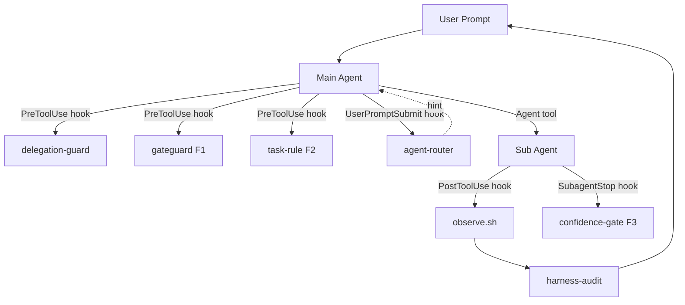

# 平井メソッド (hirai-method)

> Defense-first Claude Code harness — 委譲強制 / 事実検証ゲート / 100% 観測 / F1-F3 自己改善ループ

[](LICENSE)


## 概要

平井メソッド（Claude Code Harness）は、Anthropic の Claude Code に対して **「設計通り動かす」ための強制機構** を提供する OSS ハーネスです。AI エージェントが陥りがちな fabrication（捏造）、scope creep（範囲逸脱）、silent failure（隠れた失敗）を、**hook によるコード強制レベル**で抑制します。

### なぜ必要か

通常の Claude Code 利用では:

- メインエージェントが本来サブエージェントに委譲すべき作業を直接実行してしまう
- 確認なしに大規模な変更を加える
- 完了報告が事実と乖離する

平井メソッドは hook を介して以下を強制します:

- **委譲ガード**: 保護パス (`src/` `tests/` `scripts/` 等) への直接書き込みを block、Agent tool 経由を強制
- **事実検証ゲート (F1)**: Edit/Write 直前に importers / callers / data 構造 / 逐語引用の事実材料を要求
- **タスク規律 (F2)**: `docs/draft/` 起案 → user 承認 → `docs/tasks/` 反映のフローを強制
- **Confidence Gate (F3)**: サブエージェント完了報告に self-confidence (0.0-1.0) を要求、閾値未満で block
- **100% tool call 観測**: 全 tool 呼び出しを JSONL に記録、`/harness-audit` で集計

## 特徴

### 5 + 3 層自己改善

| 層 | 名前 | 役割 |
|---|---|---|
| F1 | GateGuard | 事実検証ゲート（Edit/Write 前置）|
| F2 | TaskRule / Verification | タスク規律 + PR 直前 6-phase 検証 |
| F3 | ConfidenceGate | self-confidence 閾値 (≥0.6, SubagentStop 後置) |
| L1 | eval-harness | pass@k メトリクスによる eval-driven development |
| L2 | gan-harness | adversarial 反復 build / design |
| L3 | verification-loop | 多段検証（lint / test / build / type / coverage / security）|
| L4 | continuous-learning-v2 | hook ベースの instinct 学習・promote / global 共有 |
| L5 | agent-introspection-debugging | サブエージェント失敗の自己診断ループ |

### Action Space

- **100 active agents**（10 カテゴリ別、44 件は `docs/archive/agents/` に履歴保持して archive 済）
- **43 skills**（eval-harness / continuous-learning-v2 / verification-loop / agent-router / repo-map ほか）
- **agent-router**: prompt → named agent 自動推薦（300+ keywords、84.1% dispatch rate、Phase 2 Hybrid mode で低信頼 prompt に LLM selector）
- **repo-map**: Aider 風シンボル抽出による context 圧縮

### 評価機構

- **SWE-bench Lite 接続**: Docker sandbox + 公式 swebench harness 統合（opt-in）
- **dry-run 実測**: C-1 (unified-diff) 40% → C-1.5 (whole-file) 60% → C-1.6 (hybrid) 中断
- `/harness-audit --swe-bench` で leaderboard 表示

### 移植性

`.claude/harness-config.yml` 1 ファイルを編集するだけで、別リポへ全 hook と全 rule の挙動が連動して移植可能。`protected_paths` `task_dir` `draft_dir` `bash_whitelist_path` 等を YAML で SSoT 管理し、3 つの guard hook + audit + init 全てから共通参照される設計。Hook の PROJECT_ROOT 解決は 4 段 fallback (`HC_PROJECT_ROOT` env / `git rev-parse --show-toplevel` / `CLAUDE_PROJECT_DIR` env / `pwd`) で submodule 内 / git 管理外 / Claude Code session 外 のいずれでも信頼性確保 (詳細 [`docs/PORTABILITY.md`](docs/PORTABILITY.md))。

## アーキテクチャ



## インストール

### 前提条件

- Claude Code CLI (claude.ai)
- Bash 4+, Python 3.9+, jq, git, **rsync** (install.sh 必須)
- Node.js 22+ / npx（Mermaid hook 用、ローカル install 推奨）
- (任意) Docker（SWE-bench 評価機構を使う場合）
- **(`/save-state` `/resume-state` `/pm-start` 利用時に必須)** Serena MCP — `.mcp.json` に `serena` entry 登録 (`uvx --from git+https://github.com/oraios/serena serena start-mcp-server --context ide-assistant`)。Session 永続化 + PM Orchestration の memory backend として動作

### Quick Start (install.sh)

新規 project への install / 既存 project への update / dry-run を 1 script で完結:

```bash
# 1. ハーネス本体を clone
git clone https://github.com/thirai-classlab/hirai-method.git ~/hirai-method

# 2. 対象 project に install (新規)
cd ~/hirai-method
bash install.sh /path/to/your-project

# 3. project root で次を実施 (install.sh が案内する)
cd /path/to/your-project
$EDITOR .claude/harness-config.yml         # protected_paths / task_dir / ...
$EDITOR .claude/bash-whitelist.txt         # 使う CLI (pnpm/poetry/cargo/...) を追記
mv CLAUDE.md.template CLAUDE.md && $EDITOR CLAUDE.md   # <...> placeholders を埋める
git init                                   # observe.sh の project hash 検出を有効化
# Claude Code session 起動 → /init-tasks → /mode loop
```

install.sh は **冪等** で、既存 `.claude/` は `.claude.bak.<timestamp>` に退避してから新規 install する (data loss なし)。

### install.sh モード

| flag | 用途 |
|---|---|
| (default) | 新規 install。既存 `.claude` / `CLAUDE.md` は `.bak.<timestamp>` 退避、CLAUDE.md は `.template` として配置 |
| `--update` | 既存 `.claude/` を rsync 増分上書き。state dir (`.gateguard-state/` `.workflow-state/` 等) と `settings.local.json` を保持、CLAUDE.md / .mcp.json / .gitignore は不変 |
| `--force` | 既存 `.claude` / `CLAUDE.md` を **backup なしで** 上書き (危険、新規 install 用) |
| `--dry-run` | 実行内容を表示のみ (rsync -n + 各 cp / mkdir を echo) |
| `--no-mcp` | `.mcp.json` を配置しない (Serena MCP 不要な project) |
| `--no-docs` | `docs/tasks/` `docs/draft/` の templates 配置を skip |

state dir 除外: `.gateguard-state/` `.taskguard-state/` `.confidence-gate-state/` `.failure-window/` `.agent-markers/` `.context-budget-state/` `.improvement-proposal-state/` `.workflow-state/` `settings.local.json` `bash-whitelist-requests/` `worktrees/`

### Update 運用 (複数 project)

ハーネス本体に修正が入ったら、各 target で update を回す:

```bash
cd ~/hirai-method && git pull
bash install.sh --update /path/to/project-a
bash install.sh --update /path/to/project-b
bash install.sh --update /path/to/project-c
```

> ⚠️  **cross-repo write は Claude Code sandbox + delegation-guard 二重制約で agent 実行不能**。`bash install.sh --update <target>` は **user manual 実行のみ可能** で、agent task として subagent / main から呼び出すと sandbox deny される (詳細 memory `feedback_cross_repo_write_sandbox_block.md`)。3 リポ反映系 task は user manual を default 経路とする。

### 2 つの install モード (project-level / user-level)

ハーネスは **project-level install** (`<project>/.claude/`) と **user-level install** (`~/.claude/`) の両方をサポート。hook の PROJECT_ROOT 解決は `.claude/hooks/lib/project-root.sh` が `HC_PROJECT_ROOT` env → `git rev-parse --show-toplevel` → `CLAUDE_PROJECT_DIR` env → `pwd` の **4 段 fallback** で行う (2026-05-18 `CLAUDE_PROJECT_DIR` を 3 段目に追加、`.claude/tests/project-root-smoke.sh` 5/5 PASS)。

| モード | settings.json | hook path | 対象 project 解決 | 用途 |
|---|---|---|---|---|
| **project-level** (既定、install.sh の対象) | `<project>/.claude/settings.json` | `bash .claude/hooks/X.sh` (cwd-relative) | cwd = project root 前提 | 1 project 専用、`.claude/` を repo に commit |
| **user-level** | `~/.claude/settings.json` (templates から copy) | `bash ${HOME}/.claude/hooks/X.sh` | 4 段 fallback | 複数 project で hooks 共有 |

**user-level install** は install.sh ではなく手動 setup:

```bash
mkdir -p ~/.claude
cp -R ~/hirai-method/.claude/{hooks,skills,rules,commands} ~/.claude/
cp ~/hirai-method/.claude/templates/settings.user-level.json.template ~/.claude/settings.json
# git 外で動かす場合のみ:
export HC_PROJECT_ROOT=/path/to/your-project
```

詳細は [`docs/PORTABILITY.md`](docs/PORTABILITY.md) 参照。

### 動作確認

install 完了後、以下で動作を確認:

```bash
cd /path/to/your-project
bash .claude/hooks/lib/config-loader.sh && echo "config-loader OK"   # env 読み込み確認
# Claude Code session 起動後:
#   - 任意の Read で hook 発火、observe.sh が ~/.claude/homunculus/projects/<hash>/ に記録
#   - 保護パス配下の Edit が delegation-guard.sh で BLOCK されること
#   - /harness-audit で hook 発火率 / GateGuard 状況を確認
```

## 使い方

### 基本コマンド

| コマンド | 役割 |
|---|---|
| `/init-tasks` | `docs/tasks/list.md` 台帳を初期化 |
| `/new-draft <slug>` | 設計 draft を `docs/draft/` に起こす |
| `/new-task <id> <slug>` | draft を承認後、タスクとして list.md に追加 |
| `/start-task <id>` | タスク取得 + ブランチ作成 + status `in_progress` |
| `/finish-task <id>` | 完了 3 点検証 + done 化 + commit 提案 |
| `/discharge-byproduct <entry>` | next-actions registry の副産物を draft / parking-lot / 無視 に処理 |
| `/commit` | git diff から conventional commit メッセージを自動生成 |
| `/reviewpr` | GitHub PR を 8 ルール + Critical Lessons + CI 状況と照合 |
| `/verify` | PR 直前 6-phase 検証ループ（F2）|
| `/harness-audit` | hook 発火率 / GateGuard 状況 / failure-window / agent-router dispatch を集計 |
| `/harness-audit --swe-bench` | SWE-bench leaderboard 出力 |
| `/agent-introspect` | サブエージェント失敗時の自己診断（L5）|
| `/eval` | eval-harness 起動（L1）|
| `/gan-design` `/gan-build` | adversarial 反復（L2）|
| `/instinct-status` `/learn` `/promote` | continuous-learning-v2 操作（L4）|
| `/gate-status` `/gate-clear` `/gate-bypass` | F1 GateGuard 状態管理 |
| `/mode <normal\|loop>` | 動作モード切替 (Loop モードは自律進行、Normal モードは user 確認分岐) |
| `/save-state` `/resume-state` `/pm-start` | **Session 永続化 + PM Orchestration** (Serena MCP 必須、SuperClaude `/sc:save\|load\|pm` 後継、`.claude/` 単独 portable) |
| `/test-design` `/design-review` `/module-review` `/system-review` | Workflow 強制 — MECE 20 カテゴリテスト設計 / reviewer-registry fan-out / 3 観点モジュール review / システム統合 review |
| `/new-feature <slug>` `/modify-feature <slug>` | 14-stage / 10-stage workflow orchestrator (`workflow-guard.sh` で `/finish-task` BLOCK 判定) |

### 典型的な開発フロー

```
1. /new-draft <slug>          # 設計 draft 起案（docs/draft/ に作成）
2. user レビュー → 承認
3. /new-task <id> <slug>       # docs/tasks/ に反映、list.md 更新
4. /start-task <id>            # ブランチ作成、status in_progress
5. main は Agent tool でサブエージェントに委譲
   → agent-router が UserPromptSubmit hook で named agent を推薦
   → サブエージェントが実装、テスト
   → 完了報告に confidence: 0.X 必須（F3 が block）
6. /finish-task <id>           # 完了 3 点検証 + done 化
7. /commit                     # commit メッセージ生成 → push
```

### サブエージェント呼び出し例

```
# メインから Agent tool を起動するとき
- 推奨: subagent_type="security-auditor"（agent-router の推薦に従う）
- 不明時: subagent_type="general-purpose"（fallback、hint のみ表示）

# 手動で router 確認
python3 .claude/skills/agent-router/router.py --explain "review the auth module for SQL injection"
# → {"agent": "security-auditor", "confidence": 0.71, "reason": "matched: security, auth, injection, review"}
```

## 設定

`.claude/harness-config.yml` の主要キー:

```yaml
# 保護パス（メインからの直接 Edit/Write を block）
protected_paths: [src, tests, scripts]

# タスク管理
task_dir: docs/tasks
draft_dir: docs/draft

# Bash 許可リスト（SSoT）
bash_whitelist_path: .claude/bash-whitelist.txt

# Confidence Gate (F3)
confidence_threshold: 0.6
confidence_required: true
confidence_state_dir: .claude/.confidence-gate-state

# 観測
homunculus_root: ~/.claude/homunculus
```

詳細は [`docs/PORTABILITY.md`](docs/PORTABILITY.md) および `.claude/harness-config.yml` のコメント参照。

## Hook 仕様

| Event | Hook | 役割 |
|---|---|---|
| PreToolUse | `delegation-guard.sh` | メインの保護パス到達 block、Agent tool 委譲を強制 (quote-aware segment splitter、heredoc / quoted string 内特殊文字保護)。Bash branch は **3 layers を統合**: (a) **bash-whitelist** (`.claude/bash-whitelist.txt`、main 用 git 非破壊全許可 `^git( \|$)`)、(b) **git destructive deny** (push --force / push -f / reset --hard / branch -D / clean -f / checkout -- / restore --worktree\|--source / stash drop\|clear / tag -d\|-f / reflog expire / gc --prune=now、bypass `ECC_ALLOW_DESTRUCTIVE_GIT=1`、`.claude/tests/git-destructive-deny-smoke.sh` 32/32 PASS)、(c) **protected branch push deny** (main 完全一致 / stg 部分一致、明示 refspec + refspec 省略時の current branch fallback の 2 段 check、bypass `ECC_ALLOW_PROTECTED_BRANCH_PUSH=1`) |
| PreToolUse | `gateguard.sh` (F1) | 事実材料未提示時の Edit/Write/破壊的 Bash を block |
| PreToolUse | `task-rule-guard.sh` (F2) | draft なきタスク作成を block |
| PreToolUse(Bash) | `autonomous-action-guard.sh` | Loop モード自律実行禁止 11 カテゴリ (`git push` / `gh pr create` / `vercel --prod` / `terraform apply` 等) を `decision:"block"` で BLOCK、Normal モードでは context warning のみ。bypass: `ECC_AUTONOMOUS_ACTION_OVERRIDE=1` or `/mode normal` 一時切替 |
| PreToolUse(Bash) | `workflow-guard.sh` | `/finish-task <slug>` 直前に state JSON 検証、未完 stage / pending findings 残存で BLOCK |
| PostToolUse | `observe.sh` | 全 tool call を JSONL 記録（`~/.claude/homunculus/`）|
| PostToolUse | `failure-loop-detect.sh` | 同種エラー 3 連続で `/agent-introspect` 提案 |
| PostToolUse | `check-md-mermaid.sh` | `.md` / `.mdx` 内 mermaid ブロックを mermaid@11 で構文検証 |
| SubagentStop | `confidence-gate.sh` (F3) | 完了報告 confidence (≥0.6) 検証 |
| UserPromptSubmit | `why-x5-reminder.sh` | 各作業ステップに Why × 5 階層 + 現在行動 + 代替案理由 の 3 点出力を強制 |
| UserPromptSubmit | `mode-enforce.sh` | Loop モード稼働中、毎ターン遵守事項 5 (粒度 commit) / 7 (subagent 並走中独立作業) / 8 (自律実行禁止リスト) を再注入 |
| UserPromptSubmit | `context-budget.sh` | Context 使用率を監視、60% / 80% / 95% tier 突破で `/save-state` 実行 + 再開提案を強制 |
| UserPromptSubmit | `loop-auto-progress-reminder.sh` | Loop モード subagent 待ち中の停止検出 (「完了通知待ち」keyword) で独立作業強制を `<system-reminder>` 注入 |
| UserPromptSubmit | `agent-router-suggest.sh` | named agent 推薦 hint 注入 |
| SessionStart | `init-tasks.sh` | タスク状態復元 (`list.md` / `parking-lot.md` / template 自動生成) |
| SessionStart | `mode-session-start.sh` | 現モード表示 + Normal モード時の Loop 切替提案 + **Serena memory 存在時 `/resume-state` 自動提案** (task #7 W2) |
| SessionStart | `next-actions-surface.sh` | 未処理 next-actions entry を `<system-reminder>` で stderr 提示 (緊急度 🔴 強調、副産物 discharge 規律) |
| Stop | `byproduct-discharge-guard.sh` | next-actions 🔴 未処理 entry 残存時に session 終了を `exit 2` BLOCK (副産物 discharge 完遂強制) |
| Stop | `stop.sh` | macOS 通知音 (Glass.aiff) |
| Notification | `notify.sh` | macOS 通知音 (Hero.aiff) |

bypass: `/gate-bypass <gate-name> <理由>` で 1 回限りスキップ可能、ログに記録。

## エージェント一覧（active 100 件）

カテゴリ別件数:

| カテゴリ | active 数 | 代表例 |
|---|---:|---|
| 01-core-development | 11 | api-designer, backend-developer, frontend-developer |
| 02-language-specialists | 8 | typescript-pro, python-pro, golang-pro, react-specialist |
| 03-infrastructure | 11 | docker-expert, kubernetes-specialist, terraform-engineer |
| 04-quality-security | 13 | code-reviewer, security-auditor, debugger |
| 05-data-ai | 11 | ml-engineer, prompt-engineer, postgres-pro |
| 06-developer-experience | 12 | git-workflow-manager, refactoring-specialist |
| 07-specialized-domains | 4 | seo-specialist, payment-integration |
| 08-business-product | 12 | product-manager, technical-writer |
| 09-meta-orchestration | 11 | workflow-orchestrator, agent-organizer |
| 10-research-analysis | 7 | research-analyst, market-researcher |

archive 44 件は `docs/archive/agents/` に履歴保持（restore 可）。詳細は [`docs/INVENTORY.md`](docs/INVENTORY.md)。

agent-router (300+ keywords) が prompt から最適 agent を推薦。`python3 .claude/skills/agent-router/router.py --explain "<prompt>"` で確認可。

## Skill 一覧（43 件）

代表的なもの:

- `eval-harness` — pass@k 評価フレーム
- `gan-style-harness` — adversarial 反復
- `continuous-learning-v2` — instinct 学習
- `verification-loop` — 多段検証
- `agent-introspection-debugging` — 失敗自己診断
- `agent-router` — subagent_type 推薦
- `repo-map` — Aider 風シンボル抽出
- `gateguard` — F1 ゲートのスキル化レイヤー
- `check-md-mermaid` — Markdown mermaid 構文検証
- `mcp-builder` — MCP server 雛形生成
- ほか 33 件

各 skill の `SKILL.md` frontmatter で起動条件 (`description`) を定義しており、該当する prompt が来たとき自動発火する。全件確認: `find .claude/skills -maxdepth 1 -type d`。

## ベンチマーク

### SWE-bench Lite（dry-run 実測）

| version | 改善内容 | 適用率 (sample) | 累計 cost |
|---|---|---:|---:|
| C-1 | unified-diff prompt | 40% (2/5) | $1.078 |
| C-1.5 | 全文出力 + difflib | 60% (3/5) | $0.853 |
| C-1.6 | whole-file timeout → unified-diff fallback (hybrid) | N/A (中断) | — |

C-1.5 の whole-file 方式は適用率を 1.5× にしつつコストを下げる結果に。C-1.6 hybrid は user 都合で中断、後続セッションで再開予定。

### agent-router dispatch rate

| 指標 | 値 | 備考 |
|---|---|---|
| Phase 1 (keyword only) — 90 日サンプル | 84.1% (991/1,178 prompts) | 目標 70% を超過、ただし dormant 指標と同様に再測定推奨 |
| Phase 1 (keyword only) — 20 representative prompts | 100% (20/20) | tests/test_router.py 内 fixture |
| Phase 2 (Hybrid mock) — 15 low-/subtle-signal prompts | 100% (15/15) | mock selector で wiring 検証。live 計測は `AGENT_ROUTER_LLM_FALLBACK=on` を有効化後 |
| Phase 2 — LLM selector per-call cap | $0.05 / call (default) | `--llm-budget-usd` で調整可、cumulative cost は `llm_cost_usd` に出力 |

> 上記の dispatch rate は静的 fixture の集計です。Phase 6 から実運用 dispatch を `~/.claude/homunculus/projects/<hash>/dispatch.jsonl` に永続化（**開始 2026-05-05**）し、`/harness-audit --router` で経時集計可能。30/90 日後に live 計測値で再評価予定。

公式 `swebench` harness 統合済 (opt-in)。`apply_only=false` モードで FAIL_TO_PASS pytest 実行可。本番 200 task (50 × F1/F2 on/off) は約 $45-60 / 3.5h（parallel=4）見込み。

評価実行:

```bash
python3 .claude/skills/eval-harness/swe-bench/runner.py \
    --tasks tasks/lite-50.json --variant hybrid
```

詳細: `.claude/skills/eval-harness/swe-bench/results/dry-run-comparison-2026-05-04.md`

## ハーネス比較

平井メソッド (claude-code-harness) を、有名な agent harness / multi-agent framework と比較します。

### Dispatch 方式の比較

| OSS | Dispatch 方式 | SSoT | LLM 利用 | Fallback | star数 |
|---|---|---|---|---|---:|
| **平井メソッド** | Phase 1: keyword 一段 / Phase 2: Hybrid (keyword → LLM selector for conf < 0.5) + UserPromptSubmit hint | dispatch-table.yml + .claude/agents/*.md | Phase 2 で Hybrid 化（claude-haiku-4-5 selector、$0.05/call cap） | keyword fallback → general-purpose / cycle detection | (本リポ) |
| Claude Code 公式 sub-agents | 親 LLM が description を読み Agent tool で起動 | Markdown frontmatter | Yes（親 LLM） | general-purpose | Anthropic 純正 |
| AutoGen SelectorGroupChat | LLM が selector で次話者選定 | Python class + description | Yes | 3 回 retry → previous → first | 54k |
| LangGraph supervisor | handoff tool 呼出で routing | create_supervisor([agents]) | Yes | END node | 24.8k+ |
| CrewAI hierarchical | manager_llm が役割で動的割当 | Agent class (role/goal) | Yes | 不明確（バグ多発） | 49.9k |
| BMAD-METHOD | "BMad Master" が persona 切替 | .bmad-core (YAML/MD) | Yes | 明文化なし | 43k+ |
| SuperClaude | keyword + ファイル拡張子 + flag | CLAUDE.md / AGENTS.md / ORCHESTRATOR.md | No（pattern matching） | flag override | 6k |
| claude-flow / Ruflo | 手動指定 + Hooks 補助 | TypeScript registry | 部分的 | 不明 | 大規模 |
| OpenHands | AgentDelegateAction で明示呼出 | register_agent(name, factory, desc) | Yes | parent へ報告 | 72.3k |

### 推奨アーキテクチャ（参考）

純粋 LLM-based selection（CrewAI / AutoGen 型）は柔軟だが、1 dispatch ごとに +1 LLM call で **token を 4-15 倍消費** する報告があります（[Multi-Agent Trap](https://towardsdatascience.com/the-multi-agent-trap/)）。
逆に純粋 keyword 方式（SuperClaude 型）は決定論的だが、表現揺れに弱い。

平井メソッドは現状 **keyword 一段（A）**ですが、将来的に **Hybrid (C)** への進化を想定:

| 方式 | pros | cons |
|---|---|---|
| **A. Keyword-only**(現状) | 0 cost / 決定論的 / 可観測性高 | 表現揺れに弱い、新 agent で table 肥大化 |
| **B. LLM-only** | 自然言語理解で柔軟 | +1 LLM call / hallucination リスク |
| **C. Hybrid（将来）** | keyword 高信頼時 cost 0、低信頼時のみ LLM 確認 | 実装複雑度 +1 |

詳細は [docs/AGENT-ROUTER.md](docs/AGENT-ROUTER.md#改善-backlog) 参照。

### 学んだアンチパターン（自リポでの回避策）

| アンチパターン | 出典 | 平井メソッドでの対策 |
|---|---|---|
| Agent ループ／循環 handoff | Multi-Agent Trap 記事 | failure-loop-detect.sh が同種エラー 3 連続で /agent-introspect 提案 |
| Manager に worker tools 渡す | CrewAI hierarchical バグ群 | dispatcher (router) は dispatch 専用、tool 持たせない |
| Selector 毎回呼び出し | LangGraph supervisor 等 | UserPromptSubmit hook の hint-only モード（confidence ≥ 0.5 のみ提案）|
| agent name matching の脆弱性 | CrewAI #1823 | dispatch-table.yml で正規化、underscore↔space 対応（backlog）|
| fallback の沈黙 | OpenHands 等 | general-purpose は明示 fallback、observe.sh で全 dispatch 記録 |

### 哲学的位置付け

- **平井メソッド**: defensive design（fabrication 抑止 / 委譲強制 / 監査可能性）が最大の特色。LLM-based dispatch を排し、coverage を犠牲にしてでも決定論性を取る
- **SuperClaude / OpenHands**: 親 LLM の判断に丸投げ、設計はミニマル
- **CrewAI / AutoGen / LangGraph**: 多 agent の collaboration 自体が価値、dispatch 精度はトレードオフ
- **claude-flow**: 100+ agents の swarm が売り、dispatch は手動寄り

選択は **対象 agent が定型化された workflow 内か、open-ended な research 系か** で判断すべきです。

## トラブルシューティング

### "delegation-guard.sh: BLOCKED" が出る

→ メインから `src/` `tests/` `scripts/`（or `protected_paths`）への直接 Edit を試みた。**Agent tool 経由でサブエージェントに委譲**してください。

### "gateguard.sh: BLOCKED — 事実材料が不足" が出る

→ Edit/Write 直前の summary に importers / callers / data 構造 / user 逐語引用などの事実材料が不足。事実材料を提示するか、`/gate-bypass gateguard <理由>` で 1 回限り bypass。

### "confidence-gate.sh: BLOCKED" が出る

→ サブエージェント完了 summary に `confidence: 0.X` (0.0-1.0) を含めてください。閾値 0.6 未満は block。bypass: `/gate-bypass confidence <理由>`。

### "git destructive guard: BLOCKED" が出る

→ メインの Bash で破壊的 git 操作 (`push --force` / `push -f` / `reset --hard` / `branch -D` / `clean -f` / `checkout -- <file>` / `restore --worktree|--source` / `stash drop|clear` / `tag -d|-f` / `reflog expire` / `gc --prune=now`) を試みた。data loss / history rewrite 不可逆のため `delegation-guard.sh` が常時 block (Normal/Loop 両モード共通)。本当に必要なら `export ECC_ALLOW_DESTRUCTIVE_GIT=1` で 1 セッション bypass。代替の非破壊操作 (`git revert <sha>` / `git stash pop` 等) を優先検討。

### "protected branch push deny: BLOCKED" が出る

→ メインの Bash で `git push origin main` / `git push origin stg-v1` / `git push origin release/stg-prod` 等、main 完全一致または `stg` を含む branch への push を試みた (明示 refspec + refspec 省略時の `git rev-parse --abbrev-ref HEAD` による current branch fallback の 2 段 check)。production / staging への暴発防止のため `delegation-guard.sh` が常時 block。本当に必要なら `export ECC_ALLOW_PROTECTED_BRANCH_PUSH=1` で 1 セッション bypass、または feature branch へ push 後 PR 経由で merge を推奨。

### "agent-router suggestion" が出ない

→ confidence < 0.5 で hint 抑制、または fallback=true（general-purpose 推奨）。`python3 .claude/skills/agent-router/router.py --explain "<prompt>"` で手動確認可。

### Mermaid hook が遅い / オフラインで動かない

`check-md-mermaid.sh` は `.md` / `.mdx` 内の `mermaid` block を mermaid@11 で構文検証する hook。Library の解決は 3 段 fallback (task-25 A1):

1. **project-local**: `./node_modules/{mermaid,jsdom}` を最優先
2. **global install**: `$(npm root -g)/{mermaid,jsdom}` を fallback
3. **npx fallback**: 上記いずれもなければ `npx --yes --package=mermaid@11.13.0 --package=jsdom node ...` で network 取得 (初回 30MB ダウンロードで 10〜20 秒)

オフライン環境 / レート制限環境 / cold start 高速化のため、**事前 install を推奨**:

```bash
# 推奨 1: global install (複数 project で共有)
npm install -g mermaid@11.13.0 jsdom

# 推奨 2: project-local install
npm install --save-dev mermaid@11.13.0 jsdom
```

`node` と `jq` が見つからない / 全 fallback 失敗時は hook は `fail-open` (session を止めず stderr に install hint を表示するのみ、検証 skip)。手動検証は `.claude/skills/check-md-mermaid/SKILL.md` 参照。

## ドキュメント

- [`docs/INVENTORY.md`](docs/INVENTORY.md) — 全構成要素の Path 表
- [`docs/INVENTORY-stocktake-2026-05-04.md`](docs/INVENTORY-stocktake-2026-05-04.md) — agent 棚卸しレポート
- [`docs/PORTABILITY.md`](docs/PORTABILITY.md) — 別リポへの移植手順
- [`docs/SELF_IMPROVEMENT.md`](docs/SELF_IMPROVEMENT.md) — F1-F3 + L1-L5 詳細
- [`docs/CONFIDENCE-GATE.md`](docs/CONFIDENCE-GATE.md) — Confidence Gate 仕様
- [`docs/AGENT-ROUTER.md`](docs/AGENT-ROUTER.md) — agent-router 設計詳細
- [`.claude/rules/development-process.md`](.claude/rules/development-process.md) — TDD / 委譲 / タスク管理ルール
- [`.claude/rules/workflow.md`](.claude/rules/workflow.md) — Workflow 強制 (test-design / design-review / module-review / system-review / new-feature / modify-feature) + 副産物 discharge + Loop モード自律規律 + **Session 永続化 + PM Orchestration** (Serena MCP 必須、`/save-state` `/resume-state` `/pm-start` 仕様) |
- [`.claude/rules/modes.md`](.claude/rules/modes.md) — Normal / Loop モード仕様 + 遵守事項 5 (粒度 commit) / 7 (subagent 並走中独立作業) / 8 (自律実行禁止 11 カテゴリ) + bypass 経路

## ライセンス

MIT — see [`LICENSE`](LICENSE).

## 寄稿

[`CONTRIBUTING.md`](CONTRIBUTING.md) 参照。Issue / PR welcome。
