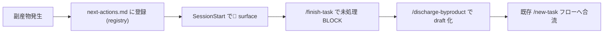

# 副産物 Discharge 機械強制機構

**ステータス:** 🔲 **draft（2026-05-12 起案、user 暗黙承認済）**
**起点:** ユーザー強い指摘「設計→タスクリスト→進行の流れが守られていない、絶対に再発防止してください」
**前提:**
- `docs/tasks/next-actions.md` に副産物 registry を導入済（本 draft 起草以前の応急処置）
- `.claude/rules/development-process.md` に「設計→承認→タスク追加」フロー記述あり
- 本 draft は registry を **第 1 段**、本実装は **第 2-4 段** と位置づける

**関連 fixture / rule:**
- `.claude/rules/development-process.md`
- `.claude/hooks/workflow-guard.sh`
- `.claude/templates/docs/tasks/_TASK_TEMPLATE.md`
- `.claude/commands/finish-task.md`
- `docs/tasks/next-actions.md`

---

## 1. 真因サマリ / 課題サマリ

`next-actions.md` に副産物を informal 登録したが、(1) session 開始時に自動で目に入らない、(2) `/finish-task` で未処理 entry を強制 surface しない、(3) `_TASK_TEMPLATE.md` に「派生タスク」セクションがなく実装中の発見が拾われない、(4) entry を draft に昇格させる UI が無い。人間の規律に依存しており、ユーザ指摘の再発防止には不十分。



**真因:** registry のみでは「想起」されない。Hook/Command/Template/Rule の 4 層連携で機械的に強制しないと、人間の規律に戻る。

**副次:** `_TASK_TEMPLATE.md` に派生 task セクションが無いと、TDD 実装中に発見した副産物が registry にも上がらず lost。

---

## 2. 解決アプローチ比較

| 案 | 内容 | 工数 | メリット | デメリット |
|:---:|:---|---:|:---|:---|
| **A** | SessionStart hook で 🔴 surface のみ | 0.3 | 軽量・即日効果 | finish-task で漏れる |
| **B** | SessionStart hook + `/finish-task` 拡張 + `_TASK_TEMPLATE.md` 派生セクション + `/discharge-byproduct` command | 1.5 | 4 層強制で再発不可 | 工数大 |
| **C** | 完全自動化 (副産物検出 → 自動 draft 起草) | 3.0+ | 人間負荷ゼロ | 検出精度が低く誤検知頻発 |

→ **B** を推奨。理由: A は薄い、C は誤検知で逆効果。B は 4 層連携で機械強制を実現しつつ、最後の "draft 起草の判断" は人間に残す（誤検知ゼロ）。

---

## 3. 採用案の詳細設計

### Wave / Sub-task 分割

| Wave | 内容 | 工数 | 効果 |
|:---:|:---|---:|:---|
| W1 | `.claude/hooks/next-actions-surface.sh` 新設 (SessionStart で 🔴 entry 強制表示) | 0.3 | 想起強制 |
| W2 | `_TASK_TEMPLATE.md` に「派生 task セクション」追加 | 0.2 | TDD 中の発見を拾う |
| W3 | `workflow-guard.sh` 拡張 (`/finish-task` 時に next-actions.md 未処理 🔴 entry を BLOCK) | 0.3 | finish 漏れゼロ |
| W4 | `.claude/commands/discharge-byproduct.md` 新設 (entry → draft 移行 helper) | 0.3 | 昇格 UI 提供 |
| W5 | `.claude/rules/workflow.md` (新規 or 既存に) 「副産物 discharge」セクション追加 | 0.2 | rule SSoT 化 |
| W6 | smoke test (4 component 統合確認) | 0.2 | 動作保証 |

合計: 1.5 工数

### W1 詳細

#### スコープ
- 対象: `.claude/hooks/next-actions-surface.sh` (新規)
- トリガ: SessionStart
- 動作: `docs/tasks/next-actions.md` を grep し、未処理 🔴 entry があれば `<system-reminder>` で件数 + 行を注入

#### 変更内容
```bash
#!/usr/bin/env bash
# SessionStart hook: surface unresolved 🔴 entries from next-actions.md
set -u  # NOT -e (other hooks share env)
NEXT_ACTIONS="${CLAUDE_PROJECT_DIR:-.}/docs/tasks/next-actions.md"
[[ -f "$NEXT_ACTIONS" ]] || exit 0
unresolved=$(grep -c '^- 🔴' "$NEXT_ACTIONS" 2>/dev/null || echo 0)
[[ "$unresolved" -gt 0 ]] || exit 0
cat <<EOF
<system-reminder>
docs/tasks/next-actions.md に未処理副産物が ${unresolved} 件あります。
/discharge-byproduct で draft 起草、または完了済なら ✅ に更新してください。
</system-reminder>
EOF
```

#### テスト
- `tests/hooks/next-actions-surface.smoke.sh`: registry ありで surface、なしで no-op、空 file で no-op

### W2 詳細

#### スコープ
- 対象: `.claude/templates/docs/tasks/_TASK_TEMPLATE.md`
- 追加セクション: `## 派生タスク / 副産物` (TDD 中に発見した別タスクをここに列挙、`/finish-task` で next-actions.md へ自動 ingest)

### W3 詳細

#### スコープ
- 対象: `.claude/hooks/workflow-guard.sh` (拡張)
- 動作: `/finish-task` 実行時 (UserPromptSubmit で検出) に未処理 🔴 entry があれば BLOCK + 解消手順提示

### W4 詳細

#### スコープ
- 対象: `.claude/commands/discharge-byproduct.md` (新規 command)
- 動作: 引数で entry index または slug を受け、`docs/draft/<slug>.md` 雛形を生成し、entry status を `⏳ draft 化中` に更新

### W5 詳細

- 対象: `.claude/rules/workflow.md` (既存 or 新規) に「副産物 discharge ライフサイクル」セクション追加
- 内容: 検出 → registry → 🔴 surface → discharge → draft → /new-task → list.md の 6 段フローを正規化

### W6 詳細

- 4 component 統合 smoke (registry に test entry → SessionStart で surface → discharge で draft 生成 → finish-task BLOCK 解除)

---

## 4. リスクと緩和

| リスク | 確率 | 影響 | 緩和 |
|---|:---:|:---:|---|
| `workflow-guard.sh` 拡張で `/finish-task` が常時 BLOCK | M | H | smoke + bypass フラグ (`HC_BYPRODUCT_GUARD=0`) を用意 |
| SessionStart hook が起動時間を増やす | L | L | grep 1 回のみ、< 50ms |
| discharge command が draft template と乖離 | L | M | 雛形は `_DRAFT_TEMPLATE.md` から生成 |
| 既存 entry の format 差 | M | M | regex を緩めに、parser 失敗時は raw 表示 |

---

## 5. 移行計画

- [ ] feature flag `HC_BYPRODUCT_DISCHARGE_ENABLED=1` で段階導入
- [ ] W1 → W2 → W3 → W4 → W5 順次 (W3 は W4 完了後 enable)
- [ ] 各 Wave で smoke 単独実行
- [ ] W6 統合 smoke
- [ ] 1 週間 dogfooding 後 flag 削除

---

## 6. 完了条件（DoD）

- [ ] 4 component (hook / template / guard / command) + rule 統合
- [ ] smoke 全 PASS (各 component + 統合 = 5+ tests)
- [ ] 次セッションで未処理 entry が自動 surface 確認
- [ ] `/finish-task` で未処理ありなら BLOCK 確認
- [ ] `/discharge-byproduct` で draft 生成確認
- [ ] `.claude/rules/workflow.md` に SSoT 反映

---

## 7. 工数見積

合計 1.5 工数 (W1: 0.3 / W2: 0.2 / W3: 0.3 / W4: 0.3 / W5: 0.2 / W6: 0.2)

---

## 8. 承認履歴

| 日付 | 承認者 | 結果 |
|---|---|---|
| 2026-05-12 | user | 暗黙承認 (発言: 「絶対に再発防止してください」) → 本 draft 起案 |

---

## 9. 関連

- 関連 rule: `.claude/rules/development-process.md` (設計→承認→タスク追加)
- 関連 hook: `.claude/hooks/workflow-guard.sh`
- 関連 template: `.claude/templates/docs/tasks/_TASK_TEMPLATE.md`
- 関連 registry: `docs/tasks/next-actions.md`
- 関連タスク: 本 draft が `next-actions.md` discharge 機構の正規実装 (第 2-4 段)
