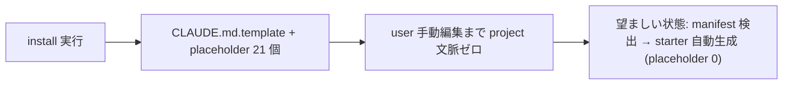

<!--
task-21 W2.4 frontmatter (機械可読、draft-flow-guard.sh / harness-audit が読む):
approval_required: true
approved_at:
approved_by:
retroactive: false
-->

# CLAUDE.md auto-fill (project 検出 + 言語別 starter、placeholder 0 化)

**ステータス:** 📝 **draft（2026-07-05 起案、user 承認待ち）**
**起点:** master roadmap [`install-immediately-usable-redesign-20260618.md`](install-immediately-usable-redesign-20260618.md) §4.3 (R3) 対策 A/C + §5 P1-5 (task #89)。subscbase-api 2026-06-18 事案で「旧 CLAUDE.md が `.bak` 退避 + template 別配置のまま放置され、user が明示依頼するまでマージされなかった」。
**前提:**
- HOTFIX-1/2 済 (PR #68 main merge 済): install.sh §6.4 が consuming repo に `harness-config.local.yml` を create-if-absent 生成 (team-default + 8 toggle true)、hc-config.sh --get/--summary は local.yml tier 対応済。**本 draft の scope 外** (前提事実)
- task-85 (P1-1 preset 自動切替) が依存先 (list.md #89 行)。ただし本 task の実装領域 (install.sh §2 + templates) は P1-1 (§6.4 周辺) と file 内独立で並行可能

**関連 fixture / rule:**
- `install.sh` L8-9 (header: 「CLAUDE.md は CLAUDE.md.template として配置（user が `<...>` placeholder を埋める）」) / L324-342 (§2 CLAUDE.md 配置 block) / L777 (Next steps 4 「mv CLAUDE.md.template CLAUDE.md && $EDITOR」)
- `CLAUDE.md` (本 repo root、生成物の見本): backtick 付き `<...>` placeholder 21 箇所、`@.claude/CommonRules.md` 参照は L9
- `.claude/templates/` 現況: `settings.user-level.json.template` + `docs/{tasks,draft}/` のみ。**`CLAUDE.md.example.*` は現存しない** (本 task で新設)
- `package.json` `files`: `[".claude/", "install.sh", "CLAUDE.md", ...]` — templates は `.claude/` 配下配置なら npx 配布物に自動同梱 (bin/cli.js L22-24 が同梱 install.sh を実行)
- 既存 install smoke: `.claude/tests/install-{local-yml,sh-overwrite-all,sh-regen-settings,sh-sync-drift}-smoke.sh` (命名規約 + regression 対象)

---

## 1. 真因サマリ / 課題サマリ

install.sh 既定 install は CLAUDE.md を **`CLAUDE.md.template` として配置し user が `<...>` placeholder 21 箇所を手動で埋める前提** (install.sh L339-341)。「インストール直後すぐ使える」と矛盾し、subscbase-api では template のまま放置 → session が project 文脈 (Tech Stack / Commands) を一切持たず始動した (roadmap §4.3 R3)。さらに既存 CLAUDE.md がある場合は **`.bak` 退避 + template 別配置** (L334-336) するため、既存の project 固有記述が session から消える。

**真因:** install.sh が target project の manifest (`package.json` 等) を一切読まず、汎用 template を verbatim copy するだけの設計。

**副次:** (a) 既存 CLAUDE.md の `.bak` 退避が「上書きしない」保護のつもりで実質は退避 = session から不可視化 (b) 既存 CLAUDE.md に `@.claude/CommonRules.md` 参照行が無いと harness 共通規範が load されないが、検出機構が無い。

---

## 2. 解決アプローチ比較

| 案 | 内容 | 工数 | メリット | デメリット |
|:---:|:---|---:|:---|:---|
| **A (対策 A+C 統合)** | install.sh 内 bash で manifest 検出 → `.claude/templates/CLAUDE.md.example.<lang>.md` (7 種) を token render して CLAUDE.md 直接生成。抽出不能 field は `<!-- TODO -->` comment 化 | 1.0 day | 決定論 / offline / 外部依存ゼロ (grep/sed のみ、node は fallback 前段)。npx 経路も自動対応 (`files` に `.claude/` 同梱済)。placeholder 0 の DoD を機械充足 | template 7 file の保守コスト。manifest parse は簡易 grep (完全 parser でない) |
| **B (対策 B、AI 起案)** | install.sh が `claude` CLI 経由で auto-fill draft 生成 | 1.5 day | repo 実態に即した richest な記述 | **却下**: ① `ANTHROPIC_API_KEY` / `claude` CLI 存在依存 (install.sh は現状 rsync + bash のみで完結、L133-136 の依存 check にも反する新規重量依存) ② 非決定的 output で smoke 検証不能 (DoD「placeholder 0」を機械保証できない) ③ offline install 不能 ④ 実行時間 / cost が install に混入。roadmap §4.3 でも `--no-claude` opt-out 前提の補助案止まり |
| **C (対策 C 単独)** | 静的 `CLAUDE.md.example.<lang>.md` を検出言語に応じ verbatim cp するのみ (auto-fill 無し) | 0.5 day | 実装最小 | **却下**: project 名 / Commands が埋まらず「例: ...」定型のまま = Tech Stack が target 実態と乖離。placeholder を TODO に変えただけで R3 (project 文脈ゼロ) が実質未解消 |
| **D (現状維持 + docs 強化)** | README に「install 後まず CLAUDE.md を埋めよ」を強調 | 0.1 day | 変更ゼロ | **却下**: honor system 追加のみ。subscbase-api 事案 (docs はあったが放置) の再発を防げない |

→ **案 A** を推奨。理由: roadmap §4.3 対策 A (project 検出 + auto-fill) と対策 C (言語別 example 配布) は排他でなく合成可能で、決定論 + offline + npx 互換の全制約を満たすのは A のみ。B は将来 opt-in 拡張 (Phase 4 以降) として本 scope から明示除外する。

---

## 3. 採用案の詳細設計

### 3.1 project 検出 (detect_project_lang)

TARGET root **直下のみ** (depth 1、monorepo sub dir は見ない = 決定論・高速) を下表 priority 順に検査、**first-win**。複数 hit 時は検出一覧を echo で可視化し、`--lang=<id>` flag で override 可能にする。

| 優先 | manifest | lang id | name 抽出 | runtime 抽出 | Commands 抽出 |
|:---:|:---|:---:|:---|:---|:---|
| 1 | `package.json` | `ts` | `.name` (node argv 経由 → grep/sed fallback、install.sh L629-634 の §6.6 既存 chain を関数抽出して再利用) | `engines.node` | `scripts.{dev,build,test,lint}` 存在 key のみ `npm run <key>` 化 |
| 2 | `pyproject.toml` | `py` | `[project] name =` (無ければ `[tool.poetry] name =`) | `requires-python` | 固定 (`pytest` / `ruff check .`) + TODO |
| 3 | `go.mod` | `go` | `module` 行 | `go` directive | 固定 (`go build ./...` / `go test ./...`) |
| 4 | `Cargo.toml` | `rust` | `[package] name =` | `edition` | 固定 (`cargo build` / `cargo test` / `cargo clippy`) |
| 5 | `composer.json` | `php` | `.name` | `require.php` | 固定 (`composer install` / `vendor/bin/phpunit`) + TODO |
| 6 | `Package.swift` | `swift` | `name: "..."` | `// swift-tools-version` 行 | 固定 (`swift build` / `swift test`) |
| 7 | (該当なし) | `generic` | `basename "$TARGET"` | — (TODO) | — (TODO) |

- 抽出は grep/sed のみ (jq / node を必須依存にしない。node は package.json/composer.json の前段 fallback chain としてのみ利用、§6.6 前例踏襲)
- **抽出失敗は fail-open**: 該当 field を `<!-- TODO(auto-fill): <field> を記入 -->` comment で埋める (die しない)
- framework 検出 (v1 最小 whitelist): `package.json` deps に `next|react|vue|express` / `pyproject.toml` に `django|fastapi|flask` があれば Tech Stack 行に併記、それ以外は TODO comment。深追いしない (YAGNI)

### 3.2 言語別 starter template (対策 C、7 件新設)

`.claude/templates/CLAUDE.md.example.{ts,py,go,rust,php,swift,generic}.md`。本 repo root `CLAUDE.md` の § 構成 (Overview / User Context / Tech Stack / Architecture / Implementation Status / Commands / Related Repositories / Domain Knowledge) を踏襲しつつ:

- 冒頭に `@.claude/CommonRules.md` 参照行を固定で含む (root CLAUDE.md L9 と同一)
- 置換 token は `{{PROJECT_NAME}}` / `{{RUNTIME_LINE}}` / `{{FRAMEWORK_LINE}}` / `{{COMMANDS_BLOCK}}` の 4 種のみ (`<...>` は不使用 → DoD grep が誤検知しない)。`{{COMMANDS_BLOCK}}` は単独行 token とし `sed -e "/^{{COMMANDS_BLOCK}}$/r $tmp" -e "//d"` 方式で複数行差込
- 「このテンプレートの使い方」節 (root CLAUDE.md 末尾) は含めない (生成物は完成品)
- 埋められない §へは `<!-- TODO(auto-fill): ... -->` を事前埋込 (User Context / Domain Knowledge 等、manifest から原理的に抽出不能な field)
- rsync で consuming repo にも配布される (`.claude/` 配下) → user が後日 `--lang=py` 等で手動再生成する材料にもなる。npm `files` は `.claude/` 同梱済のため **npx 経路の追加作業ゼロ** (実在確認済)

### 3.3 mode × 既存 CLAUDE.md の挙動 matrix (install.sh §2 L324-342 差し替え)

| mode | 既存 CLAUDE.md なし | 既存 CLAUDE.md あり |
|:---|:---|:---|
| install (default) | **auto-fill 生成 → `CLAUDE.md` 直接配置** (CLAUDE.md.template 経由を廃止) | **不可侵** (現行の `.bak` 退避 + template 配置 L334-336 を**廃止**)。`grep -q '@.claude/CommonRules.md' CLAUDE.md` を check → 不在なら「先頭に `@.claude/CommonRules.md` の 1 行を追加してください」HINT echo **のみ** (自動編集しない = subscbase-api 再発防止) |
| update | 生成しない (現行維持 L326-327) + 既存あれば check/HINT のみ (read-only) | 不可侵 + check/HINT |
| force / overwrite-all | auto-fill 生成 | 現行どおり WARN + 上書き (L330-332)、ただし上書き内容は verbatim copy でなく auto-fill 生成物 |

- **dry-run**: 検出 (read-only) は実行し `[dry-run] generate CLAUDE.md (lang=ts, manifest=package.json)` を echo、file write 0 (`run()` helper L196-204 準拠)
- **--no-docs**: 無関係 (現行 §2 も `WITH_DOCS` 非依存、L398 の §5 とは独立)。auto-fill は --no-docs 下でも動作することを明記 + smoke 化
- **fail-open fallback**: template file 不在 / render 失敗時は旧挙動 (`cp CLAUDE.md → CLAUDE.md.template`) に fallback + WARN (§6.4 HOTFIX-1 と同じ fail-open 契約。mktemp は X 末尾 + `|| true` ガード必須)
- 付随更新: install.sh header L8-9 / summary Next steps 4 (L777、「mv CLAUDE.md.template ...」→「CLAUDE.md 内の TODO comment を補完」) / README・docs/PORTABILITY.md の該当記述。**header 行数変更時は `-h` の `sed -n '2,48p'` 範囲 (`install.sh:90`) を同 commit で更新する** (task-79 前例。install.sh 同時改修 4 task (85/87/89/90) の競合下では行番号でなく § marker / pattern anchor で位置特定、2026-07-05 review 反映)

### 3.4 scope 外 (明示)

- **対策 B (claude CLI AI 起案)**: §2 案 B のとおり却下、Phase 4 以降の opt-in 拡張候補として parking
- HOTFIX-1/2 済領域 (local.yml bootstrap / hc-config local tier): 前提事実、本 task で触らない
- `pom.xml` / `Gemfile` / `build.gradle` 等の追加言語: generic fallback で吸収、需要顕在化時に template 1 file 追加のみで拡張可能な構造にする (open question 2)

### Task 計画 (採用 6 条準拠、Phase 中間階層廃止)

**ゴール**: 新規 dummy repo への `bash install.sh <target>` 直後に、manifest 由来で auto-fill された CLAUDE.md (`<...>` placeholder 0 + CommonRules 参照行あり) が配置され、既存 CLAUDE.md を持つ repo では byte 不変が保証される。

#### Step 計画

| Step | Status | 作業概要 | 工数 | 依存 |
|:---:|:---:|:---|---:|:---|
| 1 | 🔲 | 言語別 starter template 7 件新設 (`.claude/templates/CLAUDE.md.example.{ts,py,go,rust,php,swift,generic}.md`、`{{TOKEN}}` 4 種形式) | 1.5h | — |
| 2 | 🔲 | install.sh に `detect_project_lang()` / `extract_manifest_fields()` / `render_claude_md()` 追加 + `--lang=<id>` arg parse (L68-106) + §2 block (L324-342) 差し替え | 2.5h | Step 1 |
| 3 | 🔲 | 既存 CLAUDE.md 不可侵化 (`.bak` 退避廃止) + CommonRules 参照行 check/HINT (default/update mode) + header L8-9・summary L777・README/PORTABILITY 文言更新 | 1.0h | Step 2 |
| 4 | 🔲 | smoke 新設 `.claude/tests/install-claude-md-autofill-smoke.sh` (≥ 12 case: 6 言語検出 / generic / 複数 manifest 優先 / --lang override / 既存不可侵 md5 / HINT 有無 / dry-run 非生成 / template 不在 fallback / update mode) | 1.5h | Step 3 |
| 5 | 🔲 | (テスト設計レビュー) reviewer を `review_min_count_test`〜`review_max_count_test` 範囲で動的選定 (`bash .claude/scripts/hc-config.sh --get review_max_count_test` で上限確認)、収束まで反復 (上限 `review_iteration_max`) | 0.5h | Step 4 |
| 6 | 🔲 | (テスト合格) 新 smoke 全 case PASS + 既存 install 系 smoke 4 本 (`install-{local-yml,sh-overwrite-all,sh-regen-settings,sh-sync-drift}-smoke.sh`) regression 0 | 0.5h | Step 5 |
| 7 | 🔲 | (リファクタリング) 3 観点 (持続可能性 / 汎用性 / 非冗長化: §6.6 version 抽出 chain との関数共通化を含む) 判定、不要なら `skip: <reason>` 明示 | 0.5h | Step 6 |

合計: 8.0h (≒ roadmap P1-5 見積 1 day と整合)

---

## 4. リスクと緩和

| リスク | 確率 | 影響 | 緩和 |
|---|:---:|:---:|---|
| 既定 mode 挙動変更 (`.bak` 退避 + template 配置の廃止) が既存運用 docs / 他 repo 手順と乖離 | M | M | fail-open fallback で旧挙動を温存 + README / PORTABILITY / header comment を同 commit で更新 + open question 1 で user 事前承認 |
| grep/sed 簡易 parse が exotic manifest (JSON5 / 複数行 name 等) で誤抽出 | M | L | 抽出値の sanity check (空 / 改行含みは棄却) → TODO comment fallback。誤っても comment 補完で復旧可能 (die しない) |
| monorepo で root manifest が実態と不一致 (例: root package.json は workspace 管理のみ) | M | L | 検出結果 + `--lang` override 案内を必ず echo で可視化。depth 1 限定で「どの file を読んだか」が自明 |
| template 7 file と root CLAUDE.md の構造 drift (将来 CLAUDE.md § 改訂時に追従漏れ) | M | M | smoke に「全 template が `@.claude/CommonRules.md` 行 + 必須 § heading を含む」構造 check case を含める |
| 生成 CLAUDE.md が placeholder 0 でも中身が薄く「埋めた気」になる | L | M | 抽出不能 field は削除でなく `<!-- TODO(auto-fill) -->` で残置 = session 内で AI が TODO を認識し user に補完提案できる |

---

## 5. 移行計画

- [ ] Step 1-4 実装 (feature branch、`--lang` opt-in と fail-open fallback で後方互換確保)
- [ ] tmp dummy repo 6 言語 × 実 install で生成物を目視検証
- [ ] dry-run で本番影響予測 (file write 0 確認)
- [ ] 本 repo への self-install は対象外 (install.sh L128-131 の source==target reject で従来どおり保護)
- [ ] consuming repo への展開は通常の `--update` 経路 (update mode は CLAUDE.md 不可侵のため既存 repo に副作用なし、templates のみ配布される)

---

## 6. 完了条件（DoD）

- [ ] **placeholder 0**: `T=$(mktemp -d); cd "$T"; echo '{"name":"dummy","scripts":{"test":"jest"}}' > package.json; bash <hirai-method>/install.sh "$T"; [ "$(grep -c '\`<' "$T/CLAUDE.md")" -eq 0 ]` が PASS
- [ ] **CommonRules 参照**: 同上 repo で `grep -q '@.claude/CommonRules.md' "$T/CLAUDE.md"` が PASS
- [ ] **auto-fill 実質**: 同上 repo で `grep -q 'dummy' "$T/CLAUDE.md" && grep -q 'npm run test\|jest' "$T/CLAUDE.md"` が PASS (manifest 由来値が実際に埋まる)
- [ ] **既存不可侵**: 既存 CLAUDE.md ありの tmp repo で default install 前後の `md5 -q CLAUDE.md` が一致 + `.bak` file 非生成 + HINT 行が stdout に出る (CommonRules 行不在時)
- [ ] **dry-run 非生成**: `--dry-run` 後に `[ ! -f "$T/CLAUDE.md" ]` PASS
- [ ] **smoke**: `bash .claude/tests/install-claude-md-autofill-smoke.sh` 全 case (≥ 12) PASS
- [ ] **regression 0**: `for s in install-local-yml install-sh-overwrite-all install-sh-regen-settings install-sh-sync-drift; do bash .claude/tests/$s-smoke.sh; done` 全 PASS
- [ ] docs 反映 (install.sh header / summary / README / docs/PORTABILITY.md)

---

## 7. 工数見積

合計 8.0h (Step 計画 table 参照)。内訳最大は Step 2 (install.sh 関数 3 本 + arg parse + §2 差し替え、2.5h)。

---

## 8. レビューサイクル (workflow.md §「収束条件」準拠)

> draft レビューは reviewer 3 体以上並列起動 + CRITICAL/HIGH/MEDIUM = 0 まで反復 (LOW 許容、上限 `review_iteration_max`)。

| iter | 日付 | reviewer (起動数) | CRITICAL | HIGH | MEDIUM | LOW | 修正 commit | 状態 |
|:---:|---|---|:---:|:---:|:---:|:---:|---|---|
| — | — | (未実施) | — | — | — | — | — | 起案直後 |

---

## 9. 承認履歴

| 日付 | 承認者 | 結果 |
|---|---|---|
| (未承認) | user | — |

> 承認記入は先頭 HTML comment frontmatter の承認日 field (file 内 1 箇所) のみに行う (7 draft frontmatter 統一、2026-07-05 review 反映)。

### user 判断が必要な未決事項 (open questions)

1. **`.bak` 退避廃止の可否**: 既存 CLAUDE.md あり + default mode の現行挙動 (L334-336: `.bak` 退避 + template 配置) を「不可侵 + HINT のみ」へ変更する。roadmap §4.3 は「絶対上書きしない」方向だが退避廃止までは明記していないため、この挙動変更の承認が必要
2. **対応言語 6 種 + generic で十分か**: `Gemfile` (ruby) / `pom.xml`・`build.gradle` (java/kotlin) は generic fallback。追加要否
3. **CLAUDE.md.template 経路の位置づけ**: 正常系では廃止 (fallback 時のみ生成)。README 等の既存手順記述を書き換えることの承認
4. **framework 検出 whitelist の深さ**: v1 は最小 (next/react/vue/express/django/fastapi/flask)。拡充要否

---

## 10. 関連

- master roadmap: [install-immediately-usable-redesign-20260618.md](install-immediately-usable-redesign-20260618.md) §4.3 / §5 P1-5 / §7.2 DAG
- 依存先 task: task-85 (P1-1、list.md #89 行の依存先。実装 file 領域は独立で並行可)
- 実装対象: `install.sh` (L8-9 / L68-106 / L324-342 / L777) / `.claude/templates/CLAUDE.md.example.<lang>.md` (新設 7 件) / `.claude/tests/install-claude-md-autofill-smoke.sh` (新設)
- npx 経路: `package.json` `files` (`.claude/` / `install.sh` / `CLAUDE.md` 同梱済) + `bin/cli.js` L22-24 (同梱 install.sh 実行) — 追加作業不要の根拠
