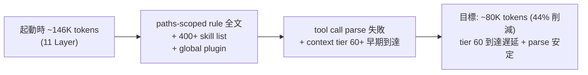

<!--
approval_required: true
approved_at: 2026-05-28
approved_by: user
retroactive: false
-->

# Context Bloat Reduction (task-51)

**ステータス:** ✅ **draft 承認済 (2026-05-28 起案 + 承認、task-51 進行中、2026-05-28 A 案 redesign で Layer B 物理配置を `.claude/rules-details/` に訂正)**

> **重要 (2026-05-28 A 案 redesign addendum)**: 本 draft §3 Step 3 が想定した「`.claude/rules/<rule>.details.md` + frontmatter `paths: []` で非注入」は Claude Code 仕様上**そもそも成立しない** ことが Step 5 token 実測 (after 153,780 tok、目標 ~80K 未達) + claude-code-guide subagent + 公式 doc ([code.claude.com/docs/en/memory.md](https://code.claude.com/docs/en/memory.md), conf 0.95) で確定。`.claude/rules/*.md` は再帰 discover + startup load される native 機構で、`paths:` は path match 時の**追加適用** (除外機構ではない)。frontmatter に negation/exclude pattern 不在。
>
> **訂正設計 (user 承認 2026-05-28)**: Layer B 6 file を `.claude/rules-details/` (`.claude/rules/` の外、Claude Code discover 対象外) へ物理移動。Layer A→B link は `../rules-details/<rule>.details.md`、Layer B→A back-link は `../rules/<rule>.md` (相対参照、深さ同じ sibling dir)。本 draft 内の `<rule>.details.md` path 表記は当時の想定であり、実装は `.claude/rules-details/<rule>.details.md` が SSoT。`install.sh` の `rsync -a .claude/` で `.claude/rules-details/` も自動同期、4 リポへの配布も同経路で完了する。詳細経緯: `docs/tasks/task-51-context-bloat-reduction.md` §「2026-05-28 A 案 redesign 経緯」。
**起点:** 35th save-state (2026-05-28) で「context 肥大、tool call parse 失敗頻発」と報告。本 session の網羅調査 (37th save-state 復元後) で起動時 ~146K tokens / 11 Layer の構成を実測。
**前提:**
- task-50 / 53 / 54 / 55 / 56 / 58 / 59 完了 (harness 健全性 7 task ✅)
- PR #24 merge 完了 (本 session A 完了)
- 4 リポへ `bash install.sh --update <target>` 配布 完了 (本 session A 完了)

**関連 fixture / rule:**
- `.claude/rules/{self-improvement,task-management,modes,why-x5-output,git-workflow,development-process,workflow}.md`
- `.claude/CommonRules.md`
- `~/.claude/rules/{common,web,zh,README}.md` 系
- `~/.claude/projects/-Users-t-hirai-work-hirai-method/memory/*.md`
- `.claude/settings.json` (35 hook 配線)
- `.mcp.json` (6 MCP server)
- `.claude/harness-config.yml` (feature toggle SSoT)
- 既存分析: `docs/draft/harness-health-7items-analysis.md` §10 / `docs/draft/harness-health-improvements.md`

---

## 1. 真因サマリ / 課題サマリ

本 session 起動時の context は **11 Layer / ~146K tokens** で構成され、turn 毎にさらに ~3K tokens の `<system-reminder>` が積層する。実測内訳の上位 5:

1. **project rules (Layer 4)**: ~50K tokens (常時参照 4 + paths-scoped 3)
2. **skills list (Layer 8)**: ~25K tokens (400+ skill name、SuperClaude / Vercel / Figma / 知識系混在)
3. **memory (Layer 6)**: ~18K tokens (MEMORY.md + 22 feedback、SUPERSEDED 7 件含)
4. **user-level rules (Layer 5)**: ~16K tokens (common + web + zh + README、本 repo 非依存 zh / web 含)
5. **CLAUDE.md + CommonRules (Layer 3)**: ~9K tokens
6. **Vercel Plugin (Layer 10)**: ~5K tokens (本 repo Vercel 非依存だが毎 session 注入)

35th save-state で「tool call parse 失敗頻発」が報告された原因は autoCompactEnabled:false + 上記 Layer 4/5/8/10 の冗長注入による prompt window 圧迫。



**真因:** rule / skill / memory / plugin が **冗長 / 重複 / 本 repo 非依存** で混入。paths-scoped rule の `paths: **` 指定で「常時参照」が意図せず増殖。global plugin の SessionStart 注入が repo 適合性を判定しない。

**副次:**
- SUPERSEDED memory (v7/v8/v9 履歴) が削除されず累積
- zh (中国語版規範) が日本語 project でも展開
- Vercel Knowledge Updates が Vercel 非依存 repo でも毎 session 注入
- task-25 A2 で SessionStart wrapper 並列化済だが、注入内容そのものは未圧縮

---

## 2. 解決アプローチ比較

| 案 | 内容 | 工数 | メリット | デメリット |
|:---:|:---|---:|:---|:---|
| **A** | 規範要約化のみ (`.claude/rules/*.md` 各 file の subsection を 1-2 段落要約に置換) | 2.0d | 規範 SSoT 集中、機械強制と疎結合 | skill / plugin / memory 残存、削減 -30K に留まる |
| **B** | 全 paths-scoped rule 削除 + 機械強制 hook のみ残存 | 3.0d | 最大削減 -60K | 規範 visibility 喪失、AI 行動劣化リスク高 |
| **C ハイブリッド** | (a) global plugin 棚卸し [user 操作] + (b) zh / web 不要分削除 [user 操作] + (c) memory SUPERSEDED 整理 [agent] + (d) project rules 段階要約化 [agent + reviewer 反復] + (e) CommonRules 旧 Critical Lessons 削除 [agent] | **1.5-2.0d** | quick win (a/b) で即時 -25-30K、(c/d/e) は段階反復で安全 | (a/b) は user 手動操作必要 |

→ **C ハイブリッド** を推奨。理由: quick win (a/b) で session-start から即時効果を得つつ、(c/d/e) で **規範 SSoT を維持しながら段階圧縮**、最終目標 -65K (44% 削減) を 1.5-2.0d で達成。

---

## 3. 採用案の詳細設計

### Task 計画 (採用 6 条準拠、Phase 中間階層廃止)

> 1 draft = 1 Task = 1 deliverable (= context 起動時 token 削減 -65K)、6 Step 構成

#### Step 計画

| Step | Status | 作業概要 | 工数 | 依存 |
|:---:|:---:|:---|---:|:---|
| 1 | ✅ | (a/b) global plugin 棚卸し + user-level rule (zh / web 不要分) 整理 [user 手動 + agent 確認] **完了 2026-05-28** (user 報告「step1のプラグインweb zhの削除は実行済み」、Vercel/sc/Figma plugin 除外 + `~/.claude/rules/zh/` `~/.claude/rules/web/` rename 想定、削減効果は次 session 起動時に実測) | 0.5h | — |
| 2 | 🔲 | (c/e) memory SUPERSEDED 削除 + CommonRules 旧 Critical Lessons 削除 [agent] | 1.5h | Step 1 |
| 3 | 🔲 | (d) project rules **2 層構造化** (7 file × Layer A/B、Layer B `.details.md` 新規作成 + link reference + Read trigger 4 条件) [agent + reviewer 反復] | 8-11h | Step 2 |
| 4 | 🔲 | (テスト設計レビュー) 5+ reviewer 動的選定 (tdd-guide / test-automator / qa-expert / pr-test-analyzer + harness-optimizer + architect-reviewer + technical-writer) + **Read trigger 4 条件 AI 判断 test scenario 4 件** | 1.5-2h | Step 3 |
| 5 | 🔲 | (テスト合格) 起動時 token 実測 (before/after) + 既存 smoke regression 0 + 機械強制 hook 動作確認 + **新規 smoke `layer-b-context-isolation-smoke.sh` 7+ cases PASS** | 1.5h | Step 4 |
| 6 | 🔲 | (リファクタリング) 規範間 link reference 整合性確認、削除した entry の参照箇所 update、**Layer A ↔ Layer B back-link 両方向確認** | 0.5-1h | Step 5 |

合計: **~11-13h (1.5-2.0d)**

### Step 1 詳細 (user 手動操作 + agent 確認)

#### スコープ
- `~/.claude/settings.json` の `enabledPlugins` から `vercel-plugin@vercel` / `vercel@claude-plugins-official` / `sc:*` (SuperClaude 旧 plugin、本 repo 不使用) / `figma:*` (Figma 不使用 repo) を除外
- `~/.claude/rules/zh/` を rename (`zh.bak/`) or 削除 (中国語応答 project が他に無いことを user 確認)
- `~/.claude/rules/web/` を rename (本 repo は harness、Web 開発 project が他に無いことを user 確認)

#### 変更内容
```bash
# user 手動 (settings.json 編集)
# enabledPlugins から Vercel / SuperClaude / Figma 系を除外

# user 手動 (ディレクトリ整理)
mv ~/.claude/rules/zh ~/.claude/rules/zh.bak
mv ~/.claude/rules/web ~/.claude/rules/web.bak
```

#### テスト
- 次 session 起動時の <system-reminder> から Vercel Plugin Session Context / Vercel Knowledge Updates が消えていることを確認
- `available skills` 一覧から sc:* / vercel:* / figma:* が消えていることを確認
- claudeMd 注入で zh/* / web/* が消えていることを確認

**削減見込: -25-30K tokens (Vercel 5K + sc 2K + figma 0.5K + zh 5K + web 5K + global skill 棚卸し ~15K)**

### Step 2 詳細 (agent 自律実行)

#### スコープ
- memory: `feedback_why_x5_v7_labeled_sections.md` / `feedback_why_x5_v8_top_purpose_bottom_work.md` / `feedback_why_x5_v9_four_sections.md` / `feedback_why_x5_v7_link_to_system_purpose.md` / `feedback_why_x5_depth_and_requirement_link.md` の 5 SUPERSEDED 削除 (v10 経緯は `why-x5-output.md` §「v1→v10 経緯」table で集約済)
- `feedback_cross_repo_write_sandbox_block.md` は task-42 Step 9 で SUPERSEDED 済 → 削除候補 (MEMORY.md に既に SUPERSEDED 記載)
- CommonRules.md §「Critical Operational Lessons」: 「hook で完全 BLOCK 強制済の旧教訓 (本表から委譲、2026-05-26 user 指示)」section を削除候補 (hook BLOCK で機械防止済、honor system 教訓のみ本表で残存維持)

#### 変更内容
```bash
# memory 削除 (subagent staging 戦略で実施)
rm ~/.claude/projects/.../memory/feedback_why_x5_v7_*.md
rm ~/.claude/projects/.../memory/feedback_why_x5_v8_*.md
rm ~/.claude/projects/.../memory/feedback_why_x5_v9_*.md
rm ~/.claude/projects/.../memory/feedback_why_x5_depth_and_requirement_link.md
rm ~/.claude/projects/.../memory/feedback_cross_repo_write_sandbox_block.md

# MEMORY.md index から該当 entry 削除
# CommonRules.md §「hook で完全 BLOCK 強制済の旧教訓」section 削除
```

#### テスト
- MEMORY.md index の entry 数 -6 確認
- CommonRules.md grep `hook で完全 BLOCK 強制済の旧教訓` で hit 0 確認
- 既存 smoke 全 PASS

**削減見込: -4-5K tokens (memory 4K + CommonRules 1K)**

### Step 3 詳細 (project rules **2 層構造化** + 必要時参照経路)

> **設計原則 (user 指摘 2026-05-28 反映)**: 「規範を削るのではなく、要約版を context にロードしつつ、必要時に詳細版を参照する **2 層構造** で AI 行動劣化を防ぐ」。単純圧縮 (subsection 削除) は規範 visibility 喪失リスクが高いため不採用。

#### スコープ (7 file × 2 層、優先度順)

| 優先 | rule file | 現サイズ | Layer A (要約、context 注入) | Layer B (詳細、Read 参照) | 削減 |
|:---:|---|---:|---:|---:|---:|
| 1 | `development-process.md` (paths-scoped) | ~15K | ~5K | `development-process.details.md` ~10K | -10K |
| 2 | `task-management.md` (常時参照) | ~10K | ~4K | `task-management.details.md` ~6K | -6K |
| 3 | `workflow.md` (paths-scoped) | ~10K | ~4K | `workflow.details.md` ~6K | -6K |
| 4 | `modes.md` (常時参照) | ~8K | ~3K | `modes.details.md` ~5K | -5K |
| 5 | `self-improvement.md` (paths-scoped) | ~3K | ~1.5K | `self-improvement.details.md` ~1.5K | -1.5K |
| 6 | `why-x5-output.md` (常時参照) | ~3K | ~1K | `why-x5-output.details.md` ~2K | -2K |
| 7 | `git-workflow.md` (常時参照) | ~1K | ~1K | (詳細退避不要、小規模) | 0 |

#### 2 層構造の物理配置

```
.claude/rules/
├── <rule>.md          # Layer A: 要約版 (1-2 段落 / 圧縮 table / link reference)
├── <rule>.details.md  # Layer B: 詳細版 (現状全文相当、frontmatter `paths: []` で context 非注入)
```

**採用配置**: 同階層 `.details.md` suffix (理由: rule file 単位の紐付けが明確、search 時に同 prefix で集約可能、`install.sh --update` の同期対象 path pattern 維持)

#### Layer A (要約版) の必須要素

- **採用 N 条 / 遵守事項 N / 規約 table**: 完全保持 (条文は圧縮対象外、AI 行動の SSoT)
- **bypass env 一覧**: 1-2 行 table で keep (即時参照頻度高)
- **重要 keyword 見出し**: H2/H3 構造維持 (検索 anchor として機能)
- **Layer B への link**: 各 subsection 末尾に `> 詳細: [<rule>.details.md §<section>](./<rule>.details.md#<anchor>)` 1 行追加
- **機械強制 hook 名 + 配線**: hook 名は keep (AI が「どの hook が機械強制するか」を即判断可)
- **起源 1 行**: `起源: <date> <slug> (詳細: details.md §起源)` 形式で 1 行に圧縮

#### Layer B (詳細版) に退避する要素

- OK/NG 例 / 違反例 詳細 (1-2 件超の追加例、history 例)
- history (v1→vN 経緯) / SUPERSEDED 履歴
- bypass env の詳細仕様 (痕跡 log path / log format / 復元手順)
- 起源の詳細 (commit hash / 事故事例 / Post-Mortem 抜粋)
- 規範変更時の retroactive logic / 例外 path 詳細
- 関連 artifact 完全 list (Layer A は代表 3-5 件、Layer B は全件)
- 5 層強制機構の各 layer 詳細 (table のみ Layer A、解説 Layer B)

#### AI が Layer B を Read する判断指針 (必須明示)

Layer B の **Read trigger** は以下 4 条件 (Layer A の冒頭に明記、AI が判断可能):

| trigger | 例 | Layer B Read 経路 |
|---|---|---|
| **(1) 違反検出時** | hook BLOCK 受領 / warn 注入受領 / regex 不一致 (例: confidence-gate `regex_no_match`) | 該当 hook 名から rule file 推定 → `<rule>.details.md` Read |
| **(2) 規範変更時** | `.claude/rules/<rule>.md` 編集 / draft 起案 / 採用 N 条改定 | 編集対象 rule file の **両方** (Layer A + Layer B) を Read |
| **(3) 新規事案** | 初遭遇 keyword (例: 「retroactive draft 起案」) / 例外パターン疑い / 起源不明な制約検出 | grep `keyword` → Layer A で見つからなければ Layer B Read |
| **(4) 学習 / dogfood** | task 着手前の依存先必読 (task-management.md §開発開始時の必読義務) / harness audit / 副産物 entry 整理 | task 起源 / 依存先 task の Layer B も Read |

**通常運用 (上記 4 trigger 非該当)**: Layer A のみで判断、Layer B Read skip (token 節約)

#### 詳細参照の **link reference 規約** (Layer A 内、緩和: 2 要素 hard match)

Layer A 内の Layer B link は以下 **2 要素 (必須 + 形式自由)** を満たせば spec compliant:

1. **必須**: `details.md` を path に含む markdown link (`[...](.../<rule>.details.md...)` の形)
2. **必須**: section anchor (`#<anchor>`) を付与する (Layer B 内の特定 section 参照、broken link 防止)

以下は推奨 form 例 (3 形式は推奨であり hard rule ではない、新規追加 link は任意の form で可):

```markdown
> **詳細**: [<rule>.details.md §<section>](./<rule>.details.md#<anchor>)
> **例詳細**: [<rule>.details.md §例](./<rule>.details.md#例)
> **起源詳細**: [<rule>.details.md §起源](./<rule>.details.md#起源)
```

**規約緩和の経緯 (iter 1 review H-2 + iter 2 fix Step H、2026-05-28)**: 当初は 3 形式 hard rule を採用したが、iter 1 reviewer (qa-expert + architect-reviewer + pr-test-analyzer) が「Layer A 27 link 中 3 形式準拠は 2 件のみ、実装と spec の乖離」を HIGH として指摘。spec 側を緩和して既存 link を全て spec compliant にすることで、新規 link 追加時の柔軟性確保 + smoke 検証は 2 要素 hard match (`details.md` link 存在 + anchor 付与) のみに簡素化する。grep `details.md` で「詳細参照経路の全件 list 化」は引き続き可能。

#### Layer B 機械的 context 非注入の担保

claudeMd / paths-scoped 注入から Layer B を確実に除外するため、以下 3 層で防御:

1. **frontmatter `paths: []`** — paths-scoped 注入の SSoT、空配列で明示 OFF
2. **`.claudeignore` に `*.details.md` 追加** (採用可なら、Claude Code 側 ignore 仕様確認要) — claudeMd 自動展開対象外
3. **smoke test `layer-b-context-isolation-smoke.sh`** — 次 session 起動時の system-reminder に `details.md` が含まれないことを `grep -L details.md` で実測検証

#### 変更内容 (例: modes.md → modes.md + modes.details.md)

```diff
- # HIRAI メソッド 動作モード
- (中略 ~8K tokens 全文)
+ # HIRAI メソッド 動作モード (Layer A、要約版)
+
+ Normal / Loop の 2 mode、Loop モード時は user 確認質問禁止 (例外: 設計新規 / 仕様変更 / 戦略判断 / 規範変更)。
+ 9 遵守事項 + 自律実行禁止 11 カテゴリは hook (autonomous-action-guard / loop-auto-progress-reminder / loop-confirmation-detector) で機械強制。
+
+ ## 9 遵守事項 (条文 keep)
+ | # | 内容 | hook |
+ | 1 | AI 推奨即採用 | (規律) |
+ | 2 | 中間確認停止 (例外条項 4 件) | loop-confirmation-detector |
+ | ... | ... | ... |
+
+ ## 自律実行禁止 11 カテゴリ
+ | カテゴリ | 例 | hook |
+ | ... | ... | autonomous-action-guard |
+
+ ## bypass env (1 行 table)
+ | env | scope | log |
+ | ECC_AUTONOMOUS_ACTION_OVERRIDE | 1 session | bypass.log |
+ | ... | ... | ... |
+
+ > **詳細**: [modes.details.md §遵守事項各条解説](./modes.details.md#遵守事項各条解説)
+ > **5 層強制機構詳細**: [modes.details.md §5-layer-enforcement](./modes.details.md#5-layer-enforcement)
+ > **起源 (各遵守事項の事故事例)**: [modes.details.md §起源](./modes.details.md#起源)
+
+ (Layer A 圧縮後 ~3K tokens)
```

そして新規 `modes.details.md` に退避:
```markdown
<!-- frontmatter (context 非注入) -->
---
paths: []   # 明示的に空、claudeMd 自動展開対象外
related: modes.md
---

# HIRAI メソッド 動作モード — 詳細版 (Layer B)

> Layer A: [`modes.md`](./modes.md) | 本 file は **明示 Read のみ** (context 自動注入 OFF)

## 遵守事項各条解説
(各遵守事項の violation 例 / 採用経緯 / 関連事故 / SUPERSEDED 履歴を full 記載)

## 5-layer-enforcement
(5 層強制機構の各 layer 詳細、smoke list 完全版、設定経路)

## 起源
(各遵守事項の commit hash / 事故 Post-Mortem / regression 経緯)
```

#### テスト

- **Layer A grep**: `modes.md` / `task-management.md` 等の grep で重要 keyword (例: "採用 6 条" "遵守事項 2 例外" "plan-first" "依存先タスク" "Loop モード" "5 層強制") が **Layer A に依然存在** することを確認
- **Layer A → Layer B link**: 各 Layer A 末尾に `> 詳細: [<rule>.details.md` link が 1 件以上存在 (grep)
- **Layer B context 非注入**: 次 session 起動時の system-reminder claudeMd 展開に `details.md` が **含まれていない** ことを実測 (Layer B 物理 size は ~25K、context 非注入で初めて削減効果)
- **Layer B 明示 Read**: AI が Read tool で `.details.md` を path 指定すれば取得可能 (frontmatter `paths: []` は claudeMd 自動展開 OFF、明示 Read は許可)
- **Read trigger 4 条件 AI 判断テスト**: 各 trigger で 1 件ずつ test scenario を reviewer iter で検証 (例: hook BLOCK 受領 → AI が Layer B Read 経路に到達するか)
- 既存 smoke (workflow-guard / task-rule-guard / autonomous-action-guard / loop-confirmation-detector 等) regression 0
- AI 行動劣化を check するため iter cycle で reviewer 5+ 並列起動 (CRITICAL+HIGH+MEDIUM = 0 まで反復)

**削減見込: -30K tokens (project rules Layer A 50K → 20K)、Layer B ~25K は context 非注入で物理保持 (Read 経路維持)**

### Step 4-6 詳細 (Task 最終 3 Steps、固定)

- **Step 4 (テスト設計レビュー)**: 5+ reviewer 動的選定 (常時 base: tdd-guide / test-automator / qa-expert / pr-test-analyzer、domain-specific: harness-optimizer + architect-reviewer + technical-writer)、収束まで反復 (上限 5 回、bypass `ECC_TEST_DESIGN_REVIEW_OFF=1`)
- **Step 5 (テスト合格)**: UI 含まないため E2E 不要、unit/integration test + 起動時 token 実測 (before/after diff、context-budget.sh で観測)、既存 smoke regression 0
- **Step 6 (リファクタリング)**: 3 観点 (持続可能性 / 汎用性 / 非冗長化) で判定、規範間 link reference 整合性 (削除した entry の参照箇所 update)

---

## 4. リスクと緩和

| リスク | 確率 | 影響 | 緩和 |
|---|:---:|:---:|---|
| 規範要約しすぎで AI 行動劣化 | M → **L (2 層構造で低減)** | H | **Layer B に詳細退避 + Read trigger 4 条件で必要時取得**、reviewer 5+ iter cycle で収束まで反復、context-budget 観測で段階測定、bypass env で旧 rule 復元可能 |
| **AI が Layer B Read trigger を見落とし Layer A のみで判断** | M | M | Layer A 冒頭に Read trigger 4 条件 table 必須記載、reviewer iter で「AI が Layer B Read に到達するか」test scenario 4 件検証 |
| **Layer B が誤って context 注入される (frontmatter `paths:[]` 失念 / `.claudeignore` 不備)** | M | M | smoke `layer-b-context-isolation-smoke.sh` で次 session 起動時 system-reminder に `details.md` が 0 件確認、frontmatter + ignore の 3 層防御 |
| **`install.sh --update` で Layer B が同期対象から漏れて 4 リポで Layer A だけ更新 → link broken** | M | M | install.sh の rule 同期 path pattern に `*.details.md` 追加 (DoD 項目)、4 リポ反映時に grep `details.md` で同期確認 |
| 削除 memory が依然有用 (false SUPERSEDED 判定) | L | M | rename (`.bak` suffix) で 1 session 暫定 → 観察期間後に物理削除 |
| zh / web 削除で別 project 影響 | L | L | rename 戦略で復元可能、user に他 project 確認 |
| paths-scoped rule の paths: フィールド変更で意図せず注入 path 変化 | M | M | rule 要約は内容のみ、paths: 維持 (Step 3 で paths: 変更しない) |
| CommonRules 削除 entry が新 entry の論理前提だった | L | M | Step 6 で grep + 参照整合性確認 |

---

## 5. 移行計画

- [ ] Step 1 (a/b) user 手動: global plugin + zh/web 棚卸し
- [ ] Step 2 (c/e) agent: memory SUPERSEDED + CommonRules 旧 lessons 削除
- [ ] 観察期間: 次 session 起動で token 実測 + AI 行動観察 (1-2 session)
- [ ] Step 3 (d) agent + reviewer 反復: project rules 段階要約
- [ ] Step 4 reviewer iter cycle (収束まで)
- [ ] Step 5 token 実測 + smoke regression 確認
- [ ] Step 6 link reference 整合性
- [ ] 完了後 4 リポに `bash install.sh --update <target>` 配布 (user manual)

---

## 6. 完了条件 (DoD)

### Token 削減目標
- [ ] 起動時 context tokens: ~146K → **~80K (44% 削減)** (実測 before/after)
- [ ] **Layer A サイズ実測**: 7 rule の Layer A 合計 ~20K tokens (Step 3 table 目標値)
- [ ] **Layer B context 非注入実測**: 次 session 起動時の system-reminder に `details.md` が 0 件 (`grep -L details.md system-reminder.log`)

### Regression
- [ ] 既存 smoke regression 0 (35 hook + ~100 smoke case)
- [ ] 機械強制 hook (delegation-guard / autonomous-action-guard / workflow-guard / loop-confirmation-detector / task-rule-guard / draft-flow-guard / context-budget / 等) 動作確認 (各 1 case PASS)
- [ ] AI 行動 regression なし: reviewer 5+ iter cycle で CRITICAL+HIGH+MEDIUM = 0

### 2 層構造の link 健全性 (本 draft 起源、user 指摘反映)
- [ ] **Layer A → Layer B link 全件存在**: 各 Layer A の subsection 末尾に `> 詳細: [<rule>.details.md` が 1 件以上 (grep 検証)
- [ ] **Layer B → Layer A back-link 全件存在**: 各 Layer B 冒頭に `> Layer A: [<rule>.md`
- [ ] **Read trigger 4 条件 AI 判断 PASS**: 違反検出時 / 規範変更時 / 新規事案 / 学習 の 4 trigger 各 1 件で AI が Layer B Read に到達 (test scenario 4 件 reviewer 検証)
- [ ] **新規 smoke `layer-b-context-isolation-smoke.sh` 7+ cases PASS** (Layer A grep / link 規約 / paths:[] 検証 / Read 経路維持 / etc)

### 既存 reference 整合性
- [ ] 規範間 link reference 整合性 (削除 entry の参照箇所 0)
- [ ] memory MEMORY.md index 一貫性 (削除 entry 6 件分の link 0)
- [ ] 4 リポへ install.sh --update 配布完了 (user manual)
- [ ] **`install.sh` の rule 同期対象に `*.details.md` 追加** (Layer B も同期対象、片肺同期で 4 リポ regression を防ぐ)

---

## 7. 工数見積

**合計: 2.0-2.5d (14-18h、2 層構造化で +3-5h)**

| Step | 内訳 | 工数 |
|:---:|---|---:|
| 1 | user 手動 (plugin/zh/web 整理) + agent 確認 | 0.5h |
| 2 | memory + CommonRules 削除 | 1.5h |
| 3 | 7 rule file **2 層構造化** (Layer A 要約 + Layer B 詳細退避 + `.details.md` 新規作成 + link reference 追加) | 8-11h (旧 6-8h + 2 層化追加 +2-3h) |
| 4 | reviewer 5+ iter cycle (収束まで、**Read trigger 4 条件 test scenario 4 件 追加**) | 1.5-2h |
| 5 | token 実測 + smoke 検証 (**Layer B context 非注入 smoke 7+ case 追加**) | 1.5h (旧 1.0h + Layer B smoke 検証 +0.5h) |
| 6 | link reference 整合性 (**Layer A ↔ Layer B back-link 両方向確認**) | 0.5-1h |

---

## 8. レビューサイクル (workflow.md §「収束条件」準拠)

> reviewer 最低 3 体以上 並列起動 + CRITICAL/HIGH/MEDIUM = 0 まで反復 (LOW 許容、上限 5 回)

| iter | 日付 | reviewer (起動数) | CRITICAL | HIGH | MEDIUM | LOW | 修正 commit | 状態 |
|:---:|---|---|:---:|:---:|:---:|:---:|---|---|
| (未着手) | — | — | — | — | — | — | — | draft 起案中 |

---

## 9. 承認履歴

| 日付 | 承認者 | 結果 |
|---|---|---|
| 2026-05-28 | (起案) | draft 起案 (37th save-state 復元後、本 session B-1 自律採用) |
| 2026-05-28 | (起案 follow-up) | user 指摘「Rule の要約 + 必要応じて詳細参照」反映 → §3 Step 3 を **2 層構造化** (Layer A 要約 + Layer B 詳細、Read trigger 4 条件) に書き換え |
| **2026-05-28** | **user** | **✅ 承認** → `docs/tasks/task-51-context-bloat-reduction.md` 詳細化 + list.md task-51 行更新 (本 session 自律進行可、modes.md 遵守事項 2 例外解除) + Step 1 ✅ (user 報告「step1のプラグインweb zhの削除は実行済み」) |

---

## 10. 関連

- 既存分析: [harness-health-7items-analysis.md §10](harness-health-7items-analysis.md) (本 draft の上位施策列挙起源)
- 関連 draft: [harness-health-improvements.md](harness-health-improvements.md) (健全性 9 task umbrella)
- 関連タスク: list.md task-51 🔲 (本 draft が承認されたら task-51 詳細を本 draft で update)
- 関連教訓: 35th save-state session/checkpoint「context 肥大、tool call parse 失敗頻発」
- 関連規範: `.claude/rules/modes.md` 遵守事項 2 例外条項 (本 draft は規範変更を含む、user 承認必須項目)
- 関連 commit: 本 session で list.md task-51 🔲 → 📝 update (本 draft 起案完了時)

### 2 層構造設計の起源 (user 指摘 2026-05-28)

- user 質問「Ruleの要約+必要用応じて詳細参照は盛り込まれていますか?」(本 draft 起案直後)
- 当初 draft は「圧縮戦略 (subsection 削除) + 詳細退避先 (hook source / git log / harness-config.yml)」のみ記載で、AI が **どう詳細参照に到達するか** の経路が不明確だった
- 反映: §3 Step 3 を **Layer A (要約、context 注入) + Layer B (詳細、`paths:[]` で context 非注入、明示 Read のみ)** の 2 層構造に書き換え、Read trigger 4 条件 (違反検出 / 規範変更 / 新規事案 / 学習) で AI 判断指針を明文化
- 設計類例: Vercel Plugin の `vercel.md` (full graph) + topic-sized chunks (runtime hook が必要時 load) と同方針 (本 session system-reminder Layer 10 由来)
