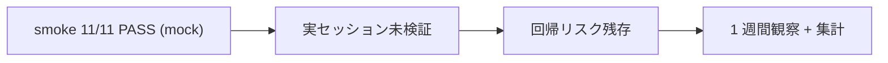

# Context Budget Hook 実セッション発火観察

**ステータス:** 🔲 **draft（2026-05-12 起案、user 暗黙承認済）**
**起点:** CB-verify (commit `5846925`) で context-budget hook を修正、smoke test 11/11 PASS したが実セッション発火は未検証
**前提:**
- `5846925` で `.claude/hooks/context-budget.sh` を修正済
- mock 環境での smoke test は完了 (`/tmp/context-budget-smoke/` で 11/11 PASS)
- 閾値は 60% / 80% / 95%、tier 状態は `.claude/.context-budget-state/<tier>` で管理

**関連 fixture / rule:**
- `.claude/hooks/context-budget.sh`
- `.claude/rules/modes.md` (Loop モードの context 監視条文)
- `.claude/harness-config.yml` (`context_budget_threshold` 設定)

---

## 1. 真因サマリ / 課題サマリ

CB-verify 修正は smoke (mock 入力) では 11/11 PASS したが、実セッションで `<system-reminder>` 注入が正しく行われるかは未確認。mock と production の入力フォーマット差や、Loop モード 専用フラグが効いていない可能性が残る。観察ゼロのまま「修正済」と扱うと回帰検出が遅れる。



**真因:** mock smoke と production runtime の同型性は保証されない。`.context-budget-state/` の実 file 生成有無を実セッションで確認する必要。

**副次:** 観察ゼロの場合 (= 1 週間でどのセッションも 60% 未満)、テスト用の "強制発火 fixture" がないと永久に検証できない。

---

## 2. 解決アプローチ比較

| 案 | 内容 | 工数 | メリット | デメリット |
|:---:|:---|---:|:---|:---|
| **A** | 受動観察 (1 週間自然な使用を待つだけ) | 0.1 | 副作用ゼロ | 観察ゼロの可能性 |
| **B** | 能動検証 (大規模 Edit/Read で context 60% を強制超過) | 0.3 | 確実に発火 | テスト用 fixture が必要 |
| **C** | 1 週間監視期間設定 + `.context-budget-state/` 集計 + 観察ゼロ時に再発火タスク起票 | 0.4 | 受動観察と fallback の両立 | 観察期間中に発火しないと結論先送り |

→ **C** を推奨。理由: A 単独だと永久未検証、B 単独だと現実セッション保証なし。C は受動観察を基本とし、観察ゼロ時に再修正タスクへ自動エスカレーション。

---

## 3. 採用案の詳細設計

### Wave / Sub-task 分割

| Wave | 内容 | 工数 | 効果 |
|:---:|:---|---:|:---|
| W1 | 観察開始日記録 + `.context-budget-state/` 初期状態スナップ | 0.1 | baseline 確定 |
| W2 | 1 週間後 (2026-05-19) に状態 file 集計 + 履歴抽出 | 0.2 | 発火実績計測 |
| W3 | report 作成 + 観察ゼロなら再修正 draft 起票 | 0.1 | 結論固定 |

合計: 0.4 工数

### W1 詳細

#### スコープ
- 観察対象: `.claude/.context-budget-state/` 配下の tier file (60/80/95)
- 観察期間: 2026-05-12 〜 2026-05-19 (7 日)

#### 変更内容
```bash
# baseline 記録
ls -la /Users/t.hirai/work/hirai-method/.claude/.context-budget-state/ \
  > docs/draft/cb-verify-baseline-20260512.txt 2>&1 || true
```

### W2 詳細

#### スコープ
- `.context-budget-state/` 配下の発火履歴を集計
- 各セッション (memory `feedback_*.md`) から `<system-reminder>` を grep

#### 変更内容
- `/harness-audit` 出力の `gateguard / continuous-learning` セクション内に context-budget 発火カウントを追加（可能なら）

### W3 詳細

- 発火 1 回以上: DoD クリア → タスククローズ
- 発火ゼロ: `docs/draft/context-budget-hook-rework.md` を起票（再修正 draft）

---

## 4. リスクと緩和

| リスク | 確率 | 影響 | 緩和 |
|---|:---:|:---:|---|
| 観察期間中に 60% 到達しない | M | M | C 案 W3 fallback 起票で吸収 |
| 状態 file が手動削除される | L | M | baseline 記録で前後比較 |
| ハーネス自体の context 利用が低すぎる | M | L | 受動観察のみで OK と判断 |

---

## 5. 移行計画

- [ ] W1 baseline 記録 (2026-05-12)
- [ ] 1 週間 normal 運用 (特別な fixture 投入なし)
- [ ] W2 集計 (2026-05-19)
- [ ] W3 結論記入 + 必要なら再修正起票

---

## 6. 完了条件（DoD）

- [ ] 1 週間で 60% 以上の発火を 1 回以上観測 **または**
- [ ] 観測ゼロの場合 `context-budget-hook-rework.md` 再修正 draft 起票
- [ ] `.claude/.context-budget-state/` の状態が baseline と diff 取得可能

---

## 7. 工数見積

合計 0.4 工数 (W1: 0.1 + W2: 0.2 + W3: 0.1)、観察期間 7 日

---

## 8. 承認履歴

| 日付 | 承認者 | 結果 |
|---|---|---|
| 2026-05-12 | user | 暗黙承認 (発言: 「絶対に再発防止してください」) → 本 draft 起案 |

---

## 9. 関連

- 関連 commit: `5846925` CB-verify 修正
- 関連 hook: `.claude/hooks/context-budget.sh`
- 関連 memory: `feedback_context_budget_*.md` (本セッションで作成済の learnings)
