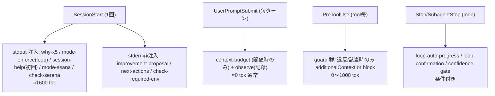

<!--
approval_required: true
approved_at: 2026-06-01
approved_by: takuma.hirai1@gmail.com
retroactive: false
-->

# hook context 注入インベントリ + サイズ縮小設計

**ステータス:** ✅ **承認済（2026-06-01 起案・同日 user 承認、案A 採用）**
**起点:** user 依頼 (tool-call parse 失敗の頻発調査 → hook 注入の網羅 + 縮小案)。task-51 (context-bloat-reduction) の follow-up。
**前提:** task-51 で起動時 context ~146K→100K 達成済。本 draft は **hook 由来の動的注入** に焦点 (task-51 は claudeMd/rules/memory の静的層が対象)。
**優先度 (user 指定、2026-06-01):**
1. **ハーネスの目的・ルールが守られること (最優先)** — enforcement/BLOCK 機能は不変
2. **注入が過剰でないこと (次点)** — 常時注入の advisory/重複のみ削減

**関連 source:** `.claude/settings.json` (hook 配線 SSoT) / `.claude/hooks/session-start-wrapper.sh` (SessionStart orchestrator)

---

## 1. 課題サマリ

hook が会話 context に注入するテキスト量と頻度を網羅把握し、enforcement を保ったまま過剰注入を削減する。調査の結論として、**毎ターン無条件の注入は実質ゼロ**であり、負荷は (a) SessionStart 1 回の advisory reminder 群 と (b) ツール使用毎の条件付き guard 注入 に集中する。

### 調査方法と精度注記 (重要)

- **権威ソース = `.claude/settings.json` の hook 配線**。hook script 内の自己記述コメント (例 "UserPromptSubmit hook") は task-21 の移設後に stale 化しており信用しない。
- 検証 subagent 2 回がいずれも「why-x5-reminder / mode-enforce は毎ターン UserPromptSubmit」と誤報告したが、settings.json の `UserPromptSubmit` 配線は **`context-budget.sh` + `observe.sh` の 2 つのみ**。why-x5-reminder / mode-enforce は `session-start-wrapper.sh` の `DEFAULT_HOOKS` (L39-50) にのみ存在 = **SessionStart 1 回**。本 draft は settings.json 直読で timing を確定。
- 本会話の実観察でも why-x5 reminder は session 開始時 1 度のみ出現、毎ターン再注入なしを確認。

---

## 2. 現行注入インベントリ (全件)

> **注入チャネル凡例**: `stdout注入` = model context に入る / `stderr非注入` = terminal 表示のみ context 非搭載 / `JSON-block` = `{"decision":"block","reason"}` の reason が次ターン注入 / `JSON-addCtx` = `hookSpecificOutput.additionalContext` で注入 / `記録のみ` = state file append。

### 2.1 SessionStart (session 1 回)

| hook | 目的 | チャネル | 条件 | token(概算) | 無効化 |
|---|---|---|---|---:|---|
| mode-session-start | resume 提案 / mode 表示 | stdout注入 | 常時 | ~150-300 | feature toggle |
| **mode-enforce** | Loop 遵守事項 再注入 | stdout注入 | mode=loop | ~300 | `feature_loop_mode_enforcement_enabled=false` |
| **why-x5-reminder** | Why×5 v10 format 注入 | stdout注入 | 常時 | ~275 | `HC_WHY_X5_DISABLE=1` |
| session-help-surface | 主要 command + onboarding | stdout注入(+stderr) | 初回 session のみ | ~500 | `HC_SESSION_HELP_ENABLED=false` |
| mode-asana-prompt | Asana 連携ヒアリング | stdout注入 | asana_enabled=unset | ~150 | (mode.yml 設定で回避) |
| check-serena-mcp | Serena MCP 不在警告 | stdout注入 | serena 不在 | ~225 | `HC_CHECK_SERENA_ENABLED=false` |
| improvement-proposal | 自己改善提案 | **stderr非注入** | 提案≥1 | (0) | `HC_IMPROVEMENT_PROPOSAL_ENABLED=false` |
| next-actions-surface | 未処理 🔴 entry 警告 | **stderr非注入** | 🔴≥1 | (0) | `feature_byproduct_discharge_enabled=false` |
| check-required-env | 必須 env 確認 | **stderr非注入** | 不足時 | (0) | — |
| init-tasks-on-start | task 台帳初期化 | (要確認) | 常時 | TBD | — |
| stale-harness-detect | 旧 harness 警告 | stderr非注入(推定) | stale 時 | (0) | `HC_FEATURE_STALE_HARNESS_DETECT_ENABLED=false` |
| list-md-plan-first-reminder | plan-first 警告 | stderr非注入(推定) | draft≥3∧task=0 | (0) | `HC_LIST_PLAN_FIRST_REMINDER_ENABLED=false` |

**SessionStart 実注入 合計 (最大、loop + 初回)**: 約 **1600-1750 tok** (stdout 系のみ。stderr 系は context 非搭載)。

### 2.2 UserPromptSubmit (毎ターン)

| hook | 目的 | チャネル | 条件 | token | 無効化 |
|---|---|---|---|---:|---|
| context-budget | context 使用率 tier 警告 | stdout注入 | mode=loop ∧ ratio≥閾値 (tier 毎 1 回) | ~200 (該当時) | `HC_CONTEXT_BUDGET_ENABLED=false` |
| observe | 観察記録 | 記録のみ | 常時 | 0 | — |

**毎ターン無条件注入 = 0 tok** (context-budget は閾値跨ぎ時のみ)。

### 2.3 PreToolUse (tool 毎、条件付き)

| hook | matcher | 目的 (enforcement か advisory か) | チャネル | token(該当時) | 無効化 |
|---|---|---|---|---:|---|
| **delegation-guard** | Edit/Write/Read/Grep/Glob/Bash | **enforcement** (保護パス/whitelist/branch BLOCK) | JSON-block | ~300 | `feature_delegation_guard_enabled=false` |
| **gateguard** | Edit/Write/Bash | **enforcement** (F1 事実 gate / 破壊 cmd) | JSON-block/warn | ~375 | — |
| **autonomous-action-guard** | Bash | **enforcement** (loop 自律禁止 11 カテゴリ) | JSON-addCtx | ~250 | `feature_autonomous_action_guard_enabled=false` |
| **workflow-guard** | Bash | **enforcement** (finish-task 完了条件) | JSON-warn | ~175 | — |
| task-rule-guard | Edit/Write | enforcement(task.md BLOCK) + **advisory(docs/tasks 編集 note)** | JSON-addCtx | ~250 | — |
| draft-flow-guard | Edit/Write | **enforcement** (docs/ 直下 draft 経由 BLOCK) | JSON-block/addCtx | ~200 | — |
| parallel-subagent-reminder | Agent/Task | advisory (並列起動 hint) | JSON-addCtx | ~375 | `HC_PARALLEL_SUBAGENT_REMINDER_ENABLED=false` |
| reviewer-count-guard | Agent/Task | enforcement (reviewer 上限 warn) | JSON-addCtx | ~200 | `HC_REVIEWER_COUNT_GUARD_ENABLED=false` |
| agent-marker-set | Agent/Task | marker | 記録のみ | 0 | — |
| observe | * | 記録 | 記録のみ | 0 | — |

### 2.4 PostToolUse (tool 毎、条件付き)

| hook | 目的 | チャネル | token(該当時) |
|---|---|---|---:|
| failure-loop-detect | 連続失敗 3+ 検出 warn | JSON-addCtx | ~250 |
| why-x5-violation-detect | why-x5 違反検出 | **stderr非注入** | (0) |
| check-md-mermaid | mermaid 構文 error | **stderr非注入** | (0) |
| agent-marker-clear / observe | marker削除 / 記録 | 記録のみ | 0 |

### 2.5 Stop / SubagentStop (条件付き、主に loop)

| hook | event | 目的 | チャネル | token(該当時) | 無効化 |
|---|---|---|---|---:|---|
| loop-auto-progress-reminder | Stop/SubagentStop | loop 自律継続 hint | stdout注入 | ~375 | `HC_LOOP_AUTO_PROGRESS_ENABLED=false` |
| loop-confirmation-detector | Stop | 確認質問検出→次ターン警告 | JSON-block | ~300 | `ECC_LOOP_CONFIRMATION_OFF=1` |
| **confidence-gate** | SubagentStop | **enforcement** (conf<0.6 BLOCK) | JSON-block | ~250 | `HC_CONFIDENCE_REQUIRED=false` |
| byproduct-discharge-guard | Stop | **enforcement** (🔴 未処理 BLOCK) | JSON-block(推定) | TBD | `ECC_BYPASS_DISCHARGE_GUARD=1` |
| stop.sh / observe | Stop | 通知 / 記録 | 記録のみ | 0 | `feature_notify_enabled=false` |

---

## 3. enforcement ↔ advisory 分類 (縮小判断の軸)

優先度 1 (ルール保持) を守るため、注入を 2 軸で分類:

| 区分 | hook | 縮小可否 |
|---|---|---|
| **enforcement (保持必須)** | delegation-guard / gateguard / autonomous-action-guard / workflow-guard / draft-flow-guard / confidence-gate / byproduct-discharge-guard / reviewer-count-guard / task-rule-guard の BLOCK 部 | **不変** (優先度 1)。大半は違反時のみ条件付き注入で baseline 0 |
| **advisory 常時 (削減候補)** | SessionStart stdout 群 (why-x5 / mode-enforce / session-help / mode-asana / check-serena) | trim/統合/opt-in 化対象 (優先度 2) |
| **advisory 条件付き (低優先削減)** | parallel-subagent-reminder / loop-auto-progress-reminder / task-rule-guard の docs/tasks 編集 note / context-budget | 重複時のみ抑制検討 |

**重要観察**: enforcement 系は「違反時のみ注入」のため通常運用での baseline はほぼ 0。**過剰注入の主因は SessionStart の advisory reminder (~1600 tok) と、本 session のような task 管理で頻発する task-rule-guard の docs/tasks 編集 note (毎 Edit ~250 tok)**。いずれも enforcement ではないため優先度 1 を侵さず削減可能。

---

## 4. 解決アプローチ比較

| 案 | 内容 | 削減 | 優先度1 (ルール保持) | リスク |
|:---:|---|---:|---|---|
| **A (推奨)** | (1) SessionStart advisory reminder を **短縮 pointer 化** (why-x5/mode-enforce の full 再掲 → rules 既出を指す 2-3 行 pointer、salience 維持しつつ verbose 削減)。(2) task-rule-guard の docs/tasks 「既存編集 note」を **status-sync 編集では抑制** (task.md 新規作成 BLOCK は不変)。(3) session-help を opt-in (`/help` 時のみ)。**enforcement 系は全て不変** | SessionStart ~800-1000 tok + 反復 note 削減 | **完全保持** (BLOCK 不変、reminder は pointer で salience 維持) | 低 (salience 低下の可能性 → 最重要 1-2 行は残す) |
| B | advisory reminder を **完全 OFF** (feature toggle で why-x5/mode-enforce/help を無効化) | SessionStart ~1300 tok | 規範文書は context 残存だが **salience 喪失リスク** (Loop 逸脱/why-x5 忘れ増の懸念) | 中 (優先度1 と緊張) |
| C | task-51 の Layer A/B を更に進め、CLAUDE.md/CommonRules 自体を縮小 + reminder は rules pointer に一本化 (静的+動的の統合再設計) | 最大 (静的層含む) | SSoT 劣化リスク (優先度1 と強く緊張) | 高 (別 task 規模、task-51 後継) |

→ **案 A 推奨**。優先度 1 (enforcement 完全保持) と優先度 2 (advisory 重複削減) を両立。salience は「最重要 1-2 行 + rules への pointer」で維持し、verbose な full 再掲のみ削る。

---

## 5. 採用案 A の詳細設計

### 5.1 SessionStart advisory reminder の pointer 化
- **why-x5-reminder.sh**: full format 説明 (~275 tok) → 「Why×5 v10 (1 行 format)。詳細は `.claude/rules/why-x5-output.md`」+ format 1 行例 のみ (~80 tok)。规范本体は rules に既出 (context 内) のため salience pointer で十分。
- **mode-enforce.sh**: Loop 遵守事項 full (~300 tok) → 「Loop モード稼働中: 確認質問禁止 / AI 推奨即採用 / 自律継続。詳細 `modes.md`」(~100 tok)。
- **session-help-surface.sh**: 初回注入 (~500 tok) → opt-in (`/help` or `HC_SESSION_HELP_FORCE=1` 時のみ)、default silent。

### 5.2 task-rule-guard の docs/tasks 編集 note 抑制
- 現状: docs/tasks 配下の **全 Edit/Write** で「[タスクルール] ... 既存タスクのステータス同期は OK」を additionalContext 注入 (本 session で多数発生)。
- 変更: **task-*.md / phase-*.md の新規作成 BLOCK は不変**。既存 task の status-sync 編集 (list.md / 既存 task.md の status 列更新) では note を **session 1 回のみ** に抑制 (state marker)。
- enforcement (draft 不在 task 作成 BLOCK) は完全保持。

### 5.3 不変 (優先度 1)
- delegation-guard / gateguard / autonomous-action-guard / workflow-guard / draft-flow-guard / confidence-gate / byproduct-discharge-guard / reviewer-count-guard の BLOCK ロジック: **一切変更しない**。
- これらは違反時のみ注入で baseline 0、削減対象外。

### 5.4 Step 計画 (採用 6 条)

| Step | Status | 作業概要 | 工数 |
|:---:|:---:|:---|---:|
| 1 | 🔲 | why-x5-reminder.sh / mode-enforce.sh の出力を pointer 短縮 (rules link + 最重要 1-2 行)、bypass 不変 | 0.5h |
| 2 | 🔲 | session-help-surface.sh を default silent + opt-in 化 (既存 `HC_SESSION_HELP_ENABLED` + force flag 活用) | 0.3h |
| 3 | 🔲 | task-rule-guard.sh の docs/tasks status-sync note を session 1 回抑制 (marker)、task.md 作成 BLOCK 不変 | 0.5h |
| 4 | 🔲 | smoke 更新 (各 hook の pointer 出力 + enforcement 不変を検証、why-x5/mode/help/task-rule-guard smoke regression) | 0.5h |
| 5 | 🔲 | (テスト設計レビュー) 5+ reviewer 動的選定 (上限 `review_max_count_*` 確認)、enforcement 不変の cross-check 重点 | 0.5h |
| 6 | 🔲 | (テスト合格) 全 hook smoke regression 0 + 起動時 token 再実測 (before/after diff) | 0.5h |
| 7 | 🔲 | (リファクタリング) 3 観点 + 4 リポ install user manual 案内 | 0.3h |

合計: **3.1h**

---

## 6. リスクと緩和

| リスク | 確率 | 影響 | 緩和 |
|---|:---:|:---:|---|
| reminder pointer 化で salience 低下 (Loop 逸脱 / why-x5 忘れ増) | M | M | 最重要 1-2 行は残す + rules pointer。Step 5 reviewer で salience 評価、dogfood 1-2 session 観察 |
| enforcement 誤削除 | L | **H** | 優先度 1 として BLOCK ロジック完全凍結、Step 5 で enforcement smoke 全 PASS を gate |
| task-rule-guard note 抑制で draft 不在 task 作成を見逃す | L | M | **BLOCK 部は不変** (note 抑制のみ)、作成 BLOCK smoke 維持 |

---

## 7. 完了条件 (DoD)

- [ ] SessionStart advisory reminder (why-x5/mode-enforce/help) が pointer 短縮 or opt-in 化され、起動時 token が実測で削減 (before/after diff)
- [ ] enforcement 系 hook (delegation/gateguard/autonomous/workflow/draft-flow/confidence/byproduct/reviewer-count) の BLOCK 動作 smoke 全 PASS (不変確認)
- [ ] task-rule-guard の task.md 作成 BLOCK 不変 + status-sync note 抑制 smoke PASS
- [ ] 全 hook smoke regression 0
- [ ] 起動時 token 実測削減 (目標 SessionStart -800〜1000 tok)
- [ ] 4 リポ install (user manual)
- [ ] commit (push feature branch 自律可)

---

## 8. 工数見積

合計 **3.1h** (hook 出力短縮 + opt-in + note 抑制 + smoke + reviewer + 実測)。

---

## 9. 承認履歴

| 日付 | 承認者 | 結果 |
|---|---|---|
| 2026-06-01 | (起案) | user 依頼で注入網羅 + 縮小案起草、優先度 (1 ルール保持 > 2 削減) 指定受領 |
| 2026-06-01 | takuma.hirai1@gmail.com | **承認** (案A 採用、enforcement 凍結 + advisory pointer 化、SessionStart -800〜1000 tok 目標) → `/new-task` で task-66 化 |

---

## 10. 関連

- 親施策: [context-bloat-reduction.md](context-bloat-reduction.md) (task-51、静的層 ~146K→100K)
- 配線 SSoT: `.claude/settings.json` / `.claude/hooks/session-start-wrapper.sh`
- 関連規範: `.claude/rules/why-x5-output.md` / `modes.md` (pointer 化の参照先)
- 注記: 検証 subagent 2 回が why-x5/mode-enforce の timing を誤認 (stale hook 自己コメント起因)、本 draft は settings.json 直読で確定
