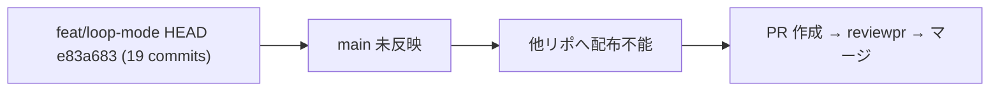

# feat/loop-mode → main マージ PR 作成・レビュー・マージ

**ステータス:** 🔲 **draft（2026-05-12 起案、user 暗黙承認済）**
**起点:** ユーザー指摘「設計→タスクリスト→進行のフローを守ってください、絶対に再発防止してください」（本セッション内）
**前提:**
- 本セッションで `feat/loop-mode` ブランチ上に 19 commits が積まれている (HEAD `e83a683`)
- workflow-enforcement W1〜W3 (`/test-design` `/design-review` `/module-review` `/system-review`)、loop モード、asana モード等が完了
- 本ブランチは hirai-method ハーネス本体のリポであり、他リポへの配布元

**関連 fixture / rule:**
- `.claude/rules/git-workflow.md` (ブランチ命名規約)
- `.claude/commands/reviewpr.md` (PR 全 8 ルールチェック)
- `.claude/rules/modes.md` (Loop モード稼働中 — 自律進行可)

---

## 1. 真因サマリ / 課題サマリ

本セッションで workflow-enforcement (W1〜W3) と loop/asana モードを完成させたが、すべて `feat/loop-mode` ブランチに閉じている。main に未反映のままだと、他リポからこのハーネスをテンプレートとして引用した際に新機能が見えない。配布前提が崩れる。



**真因:** ブランチ完成と main 反映が分離している。Loop モードでも「PR 作成 → マージ」は workflow 上明示的に挟む必要がある（main への直 push は破壊リスクを伴うため）。

**副次:** PR description で 19 commit 分の意図を要約しないと reviewer (CI 含む) が把握不能。

---

## 2. 解決アプローチ比較

| 案 | 内容 | 工数 | メリット | デメリット |
|:---:|:---|---:|:---|:---|
| **A** | `gh pr create` 直 → 即マージ | 0.2 | 最速 | レビュー機械が走らない・8 ルール未検証 |
| **B** | PR 作成 → `/reviewpr` 全 8 ルールチェック → 修正 → user 承認 → マージ | 0.8 | 全規約検証 + 痕跡 | 工数増 |
| **C** | squash merge vs merge commit の選択 | — | — | A/B の派生（merge commit で 19 commit を保つほうが履歴価値高） |

→ **B + merge commit** を推奨。理由: ハーネス本体は履歴自体が運用 manual であり、commit を squash で潰すと W1/W2/W3 の段階が読めなくなる。

---

## 3. 採用案の詳細設計

### Wave / Sub-task 分割

| Wave | 内容 | 工数 | 効果 |
|:---:|:---|---:|:---|
| W1 | `gh pr create` で PR 草稿 (title + body + Test plan) | 0.2 | レビュー可能化 |
| W2 | `/reviewpr <N>` 実行 (全 8 ルール + Critical Lessons + CI) | 0.3 | 規約全検証 |
| W3 | 指摘 (CRITICAL/HIGH) があれば修正 commit を feat/loop-mode に push | 0.2 | 品質確保 |
| W4 | merge commit でマージ + feat/loop-mode 削除 | 0.1 | main 反映 |

合計: 0.8 工数

### W1 詳細

#### スコープ
- 対象: GitHub PR (新規作成)
- ブランチ: `feat/loop-mode` → `main`

#### 変更内容
```bash
gh pr create --base main --head feat/loop-mode \
  --title "feat(workflow): workflow-enforcement W1-W3 + loop/asana modes" \
  --body "$(cat <<'EOF'
## Summary
- W1: /test-design (MECE 20 categories) + asana mode requirement
- W2: /design-review with reviewer-registry
- W3: /module-review, /system-review for refactoring enforcement
- Loop/Asana modes with SessionStart hooks
- Context budget hook fix (CB-verify)

## Test plan
- [ ] 全 hook smoke (11/11 PASS confirmed locally)
- [ ] 各新 command (/test-design, /design-review, /module-review, /system-review) を main で動作確認
- [ ] context-budget hook が実セッションで 60/80/95% 発火するか観察 (1 週間)
EOF
)"
```

### W2-W4 詳細

W2: `/reviewpr <PR番号>` を実行 (CRITICAL/HIGH 検出 → W3 へ、なし → W4 へ)
W3: 修正 commit を `feat/loop-mode` に push
W4: `gh pr merge <N> --merge --delete-branch`

---

## 4. リスクと緩和

| リスク | 確率 | 影響 | 緩和 |
|---|:---:|:---:|---|
| reviewpr が CRITICAL 検出 | M | H | W3 で修正 → 再 reviewpr |
| CI 失敗 | L | H | reviewpr 内で CI 状況も読む |
| 19 commit が squash で潰される | L | M | merge commit を明示指定 |

---

## 5. 移行計画

- [ ] feat/loop-mode 最新 commit 確認
- [ ] PR 作成
- [ ] reviewpr 実行
- [ ] 修正 (あれば)
- [ ] merge commit でマージ
- [ ] feat/loop-mode 削除
- [ ] main から smoke (新 command 1 つ起動)

---

## 6. 完了条件（DoD）

- [ ] main HEAD に本セッション 19 commit 反映
- [ ] feat/loop-mode 削除
- [ ] main から `/test-design` `/design-review` `/module-review` `/system-review` `/mode` 等が動作
- [ ] PR description に Test plan 反映
- [ ] reviewpr 規約違反ゼロ

---

## 7. 工数見積

合計 0.8 工数 (W1: 0.2 + W2: 0.3 + W3: 0.2 + W4: 0.1)

---

## 8. 承認履歴

| 日付 | 承認者 | 結果 |
|---|---|---|
| 2026-05-12 | user | 暗黙承認 (発言: 「絶対に再発防止してください」) → 本 draft 起案 |

---

## 9. 関連

- 既存設計: [workflow-enforcement.md](./workflow-enforcement.md)
- 関連タスク: docs/tasks/list.md `#11` (本 draft 起草) → 完了後 `#12` として list 化予定
- 関連 commit: feat/loop-mode の 19 commits (range `21f1d78..e83a683`)
