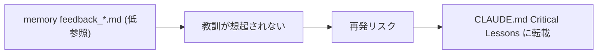

# Critical Operational Lessons 転載 (memory → CLAUDE.md)

**ステータス:** 🔲 **draft（2026-05-12 起案、user 暗黙承認済）**
**起点:** 本セッションで 2 つの重要教訓を memory `feedback_*.md` に記録したが、CLAUDE.md `Critical Operational Lessons` テーブルへの転載が抜けている
**前提:**
- memory に `feedback_parallel_subagent_git_conflict_*.md` 系と `feedback_set_e_leak_*.md` 系の learnings あり
- CLAUDE.md は session 起動時の必読 SSoT (system prompt に注入される)

**関連 fixture / rule:**
- `CLAUDE.md` (`Critical Operational Lessons` セクション)
- `~/.claude/memory/feedback_*.md`

---

## 1. 真因サマリ / 課題サマリ

memory の `feedback_*.md` は session 開始時に自動ロードされない（参照頻度が低い）。一方 CLAUDE.md は system prompt に必ず注入されるため、ハイ優先度教訓はそこに固定すべき。本セッションで発見した「並列 subagent の git 競合」「set -e leak」は再現性高く、HIGH 重要度。



**真因:** memory と CLAUDE.md の役割分離が不明瞭。HIGH 教訓の SSoT は CLAUDE.md だが、memory にしか書かれていない learnings がある。

**副次:** 教訓を 1 箇所に集約しないと、新規 contributor が "なぜこの workaround?" を遡れない。

---

## 2. 解決アプローチ比較

| 案 | 内容 | 工数 | メリット | デメリット |
|:---:|:---|---:|:---|:---|
| **A** | CLAUDE.md 直記 (`Critical Operational Lessons` テーブルに HIGH 2 行追加) | 0.2 | SSoT 集約・session 起動時必読 | CLAUDE.md が長くなる |
| **B** | 別 file `docs/CRITICAL-LESSONS.md` 作成 + CLAUDE.md から link | 0.4 | CLAUDE.md 肥大化を避ける | 1 段リンク経由 = 読まれないリスク |
| **C** | `.claude/rules/critical-lessons.md` 新設 (paths スコープで常時参照) | 0.5 | rule loader 経由で必読化 | rule 数増加 |

→ **A** を推奨。理由: 教訓 2 つで CLAUDE.md は肥大化しない。SSoT 性 (1 ファイルで session 起動時に必ず読まれる) が最大の価値。

---

## 3. 採用案の詳細設計

### Wave / Sub-task 分割

| Wave | 内容 | 工数 | 効果 |
|:---:|:---|---:|:---|
| W1 | 「並列 subagent git 競合」教訓を CLAUDE.md に追加 | 0.1 | 同種事故再発防止 |
| W2 | 「set -e leak」教訓を CLAUDE.md に追加 | 0.1 | hook debug 再発防止 |
| W3 | 1 commit にまとめて push | 0.1 | 履歴明確化 |

合計: 0.3 工数

### W1 詳細

#### スコープ
- 対象ファイル: `CLAUDE.md` の `Critical Operational Lessons` テーブル
- 既存テーブルに 1 行追加

#### 変更内容
```markdown
| 並列 subagent を同一ファイルへ commit させると git index lock 競合で消える、必ず逐次 or rebase chain で commit | HIGH |
```

#### テスト
- CLAUDE.md を Read して table が valid Markdown のまま、行が表示されることを確認

### W2 詳細

#### スコープ
- 対象ファイル: `CLAUDE.md` の `Critical Operational Lessons` テーブル

#### 変更内容
```markdown
| Hook で `set -e` を使うと、別の hook が source した側にも leak する。各 hook は `set -e` 直前/直後に局所 trap か subshell で isolate | HIGH |
```

### W3 詳細

- W1+W2 を 1 commit に: `docs(claude-md): transfer 2 HIGH lessons from memory feedback`

---

## 4. リスクと緩和

| リスク | 確率 | 影響 | 緩和 |
|---|:---:|:---:|---|
| 教訓表現が memory と乖離 | L | L | memory ファイル参照 link を行末に併記 (将来検討) |
| CLAUDE.md 肥大化 | L | M | HIGH のみ転載・MEDIUM 以下は memory のまま |

---

## 5. 移行計画

- [ ] memory の該当 feedback file を 2 つ確定 (W1 前に file 名特定)
- [ ] CLAUDE.md edit (W1 + W2)
- [ ] commit + push
- [ ] 新セッションで CLAUDE.md が system prompt に含まれること確認

---

## 6. 完了条件（DoD）

- [ ] CLAUDE.md `Critical Operational Lessons` テーブルに HIGH 2 行追加
- [ ] 各行は実際の事故・観測に基づく (推測禁止 — CLAUDE.md ルール準拠)
- [ ] commit + push 済
- [ ] 新 session 開始時に CLAUDE.md 経由で教訓が想起されることを user に報告

---

## 7. 工数見積

合計 0.3 工数 (W1: 0.1 + W2: 0.1 + W3: 0.1)

---

## 8. 承認履歴

| 日付 | 承認者 | 結果 |
|---|---|---|
| 2026-05-12 | user | 暗黙承認 (発言: 「絶対に再発防止してください」) → 本 draft 起案 |

---

## 9. 関連

- 関連 memory: `~/.claude/memory/feedback_parallel_subagent_git_conflict_*.md`
- 関連 memory: `~/.claude/memory/feedback_set_e_leak_*.md`
- 関連 file: `CLAUDE.md` (`Critical Operational Lessons` セクション)
