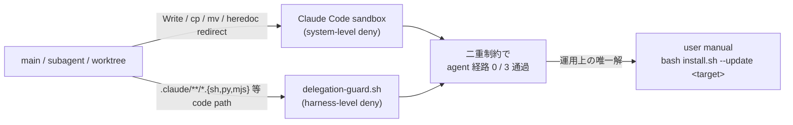

<!--
task-21 W2.4 frontmatter (機械可読、draft-flow-guard.sh / harness-audit が読む):
approval_required: true
approved_at: 2026-05-23
approved_by: user
retroactive: false
-->

# cross-repo write の user manual normative pattern 規範化

**ステータス:** 🔲 **draft（2026-05-23 起案、user 承認待ち）**
**起点:** `docs/tasks/next-actions.md` entry #17 (2026-05-23、🟡)、task-24 W1 subagent 調査 (confidence 0.85)、task-26 W6 / task-21 W3.3 で同 blocker を再確認
**前提:**
- task-24 W1 完了 (cross-repo write が agent 経路で完全 denied と実証)
- task-26 W6 完了 (user manual `bash install.sh --update` 3 リポ反映の運用実績、commit `c5d00cf`)
- task-25 B2 完了 (README install セクションに cross-repo manual normative pattern 警告追加、commit `24049f2`)

**関連 fixture / rule:**
- `.claude/rules/development-process.md` §「サブエージェント委譲」/「サブエージェント `.claude/` 編集の staging 戦略」
- `.claude/templates/docs/tasks/_TASK_TEMPLATE.md`
- `install.sh` 冒頭コメント (現状 `--update` mode の Usage は記載済、agent 実行不可の明示は未)
- memory: `feedback_cross_repo_write_sandbox_block.md`
- 関連 commit: `c5d00cf` (3 リポ反映、task-26 W6 / task-21 / task-24 status sync) / `24049f2` (README rewrite、task-25 B2) / `89013c5` (entry #17 起票、本 draft の直接の起源)

---

## 1. 真因サマリ / 課題サマリ

cross-repo write (本 repo `/Users/t.hirai/work/hirai-method` → 外部 repo `/Users/t.hirai/タスクマネジメント/taskManageSystem` / `/Users/t.hirai/recall_poc` / `/Users/t.hirai/work/classlab-weekly-news` 等) を実行する task は **agent context (main / subagent / `isolation: "worktree"` を含む全経路) で完全 denied** と確定している (2026-05-23 task-24 W1 subagent a174bcef696b54860 confidence 0.85)。`bash install.sh --update <target>` 系 cross-repo sync は **user manual 実行のみ可能**。



**真因 (技術的根本原因):**
- **system-level**: Claude Code sandbox が cross-repo Write / cp / mv / heredoc redirect を一律 deny。`dangerouslyDisableSandbox: true` 付き Bash も block (task-24 W1 実証)
- **harness-level**: `delegation-guard.sh` が main からの `.claude/hooks/*.sh` 等 code 配下 Write を block するため、外部 repo の同種 path への Write も同様に block 経路にかかる (二重制約)
- subagent foreground / background / `isolation: "worktree"` いずれも同 permission policy 下、回避経路なし
- `ECC_*_OVERRIDE` / `HC_*_ENABLED=false` 等 bypass env は **system-level 制約には効かない** (harness-level のみ無効化可)

**副次 (運用課題):**
- 副産物 task の Wave 計画段で agent 経由実行を試み、subagent block で時間を浪費するケースが反復 (task-21 W3.3 / task-24 W1 / task-26 W6 で同様)
- 「user manual normative pattern」が memory (`feedback_cross_repo_write_sandbox_block.md`) と一部 commit message にしか記録されておらず、規範文書 / template / installer script の 3 箇所に明文化されていない
- 新規 task 起票時に「cross-repo は user manual」を明示しないと、subagent が「sandbox deny で進められず loop 停止」と誤判断するリスク (development-process.md §5 Bash deny 反射と類似の構造)

---

## 2. 解決アプローチ比較

| 案 | 内容 | 工数 | メリット | デメリット |
|:---:|:---|---:|:---|:---|
| **A** | 規範化のみ (3 箇所明文化: `development-process.md` セクション追加 + `_TASK_TEMPLATE.md` Wave 計画段テンプレ + `install.sh` 冒頭コメント) + 既存 task back-port | 0.5 | 最小工数、honor system で運用 / 即日改善、副産物発生時の判断速度向上 / 既存 memory と整合 | 機械強制なし (honor system)、規範遵守は task 起票者依存 |
| **B** | 自動代替策探索 (subprocess による cross-repo cmd 起動 / `child_process.spawn` 経路 / 外部 helper script 経由 等) | 2.0 | 仮に動けば agent 経路で完結、user manual 不要 | system-level 制約は subprocess も同 sandbox 内のため **ほぼ実現不可** (task-24 W1 で `dangerouslyDisableSandbox: true` Bash も block 確認済)、調査時間が大きく ROI 低い |
| **C ハイブリッド** | A (規範化) + 限定的代替策の検討窓口を残す (将来 Claude Code sandbox の cross-repo Write 緩和が来たら revisit、`docs/tasks/parking-lot.md` に🔍 entry 化) | 0.7 | 規範化即時 + 将来の sandbox 仕様変化に追随可能 / parking-lot 運用と整合 | A より +0.2 工数 (parking-lot 起票分)、現時点で B の実現性ほぼなし |

→ **案 C ハイブリッド** を推奨。理由:
- 案 A の即日効果 (3 箇所明文化 + 既存 task back-port) を即取りつつ、案 B の代替策検討を parking-lot.md に🔍 entry として残すことで、将来の sandbox 仕様変化 (例: Claude Code が cross-repo Write を opt-in で許可する future feature) に対応可能
- 工数 +0.2 は parking-lot.md への 7 必須項目記載のみ、コストは最小
- honor system のリスクは `harness-audit.py` の `bypass_log_summary` で副次的に検知 (cross-repo agent 試行が block された痕跡は `.claude/.workflow-state/bypass.log` に記録される設計、entry 起票忘れの再発検出に活用)

---

## 3. 採用案の詳細設計

### Phase / Step 分割 (task-29 Phase→Step 強制準拠)

| Phase | ゴール | 作業概要 |
|:---:|:---|:---|
| Phase 1 | `.claude/rules/development-process.md` に「cross-repo write 例外」セクション新設、agent 経路 deny の根因 + user manual 経路を明文化 | development-process.md §「サブエージェント `.claude/` 編集の staging 戦略」直後に新セクション追加 / memory 引用 / smoke regression 0 |
| Phase 2 | `_TASK_TEMPLATE.md` Wave 計画段に cross-repo 明示テンプレを追加 | template 内 「Wave / Phase 計画」section に「cross-repo を含む Wave は user manual 注意書きを必ず明記」hint 追加 |
| Phase 3 | `install.sh` 冒頭コメントに agent 実行不可 / user manual 専用を明記 | usage section に WARNING block 追加、`--update` mode 説明に「user manual 実行のみ可能」明記 |
| Phase 4 | 既存 task-21 W3.3 / task-24 W1 / task-26 W6 の cross-repo 関連箇所に user manual 注意書きを back-port | 3 task ファイルの該当 Wave に注意書きセクション追加 (履歴改変ではなく追記) |
| Phase 5 | `docs/tasks/parking-lot.md` に🔍 entry「cross-repo sandbox 緩和の future Claude Code 仕様変化追随」起票 | 必須 7 項目 (起案日 / 保留日 / 保留理由 / 設計書 / 実装状態 / 再検討トリガー / 代替現状) を埋める |

合計: 0.7 工数 (各 Phase 0.1-0.2)

### Phase 1 詳細

#### スコープ
- 対象ファイル: `.claude/rules/development-process.md`
- 対象セクション: 「サブエージェント `.claude/` 編集の staging 戦略」直後に新セクション挿入

#### Step 1.1
- **内容**: development-process.md に新セクション「cross-repo write 例外 (agent 経路 deny / user manual 専用)」を追加。memory `feedback_cross_repo_write_sandbox_block.md` の 4 段 (Why / How to apply / 例外 / 起源) を rule 文書化形式に整形して埋め込み
- **完了条件**: `grep -q "cross-repo write 例外" .claude/rules/development-process.md` exit 0、新セクション内に「Claude Code sandbox」「delegation-guard」「user manual」「`bash install.sh --update`」4 keyword 全て登場

#### Step 1.2 (テスト設計レビュー → テスト合格 → リファクタリング 3 段)
- **テスト設計レビュー**: 5+ reviewer 動的選定 (固定 registry 不採用、case-by-case)。常時 base 4 候補 (tdd-guide / test-automator / qa-expert / pr-test-analyzer) + domain-specific 1+ (規範文書系のため架空変更検出に強い `architect-reviewer` or `code-architect` を追加)。修正収束まで反復 (上限 5 回、bypass `ECC_TEST_DESIGN_REVIEW_OFF=1`)
- **テスト合格**: 規範文書のみのため UI 変更なし → unit/integration test 不要、`grep -q` ベースの完了条件検証 + 既存 smoke (delegation-guard / workflow-guard / next-actions-hooks 等) regression 0
- **リファクタリング**: 規範文書追加のため refactor 余地は限定的 → `skip: 既存セクション順序を維持、新セクション挿入のみで重複なし、refactor 不要` と明示記録

### Phase 2 詳細

#### スコープ
- 対象ファイル: `.claude/templates/docs/tasks/_TASK_TEMPLATE.md`
- 対象セクション: Phase / Step 計画 section の冒頭 hint block

#### Step 2.1
- **内容**: template の Phase / Step 計画段に「cross-repo write を含む Phase は user manual 注意書きを必ず明記」hint コメントを追加。具体例文: `「W cross-repo: user manual \`bash install.sh --update <target>\` 案内」`
- **完了条件**: `grep -q "cross-repo write" .claude/templates/docs/tasks/_TASK_TEMPLATE.md` exit 0、hint コメントが Phase 計画 section 内に配置されている

#### Step 2.2 (3 段)
- **テスト設計レビュー**: 5+ reviewer 動的選定 (常時 base 4 + template 変更系のため `code-architect` / `harness-optimizer` を加味)
- **テスト合格**: template 変更のため、新 task 起票 dry-run (`/new-task --dry-run` 相当) で template 内 hint が表示されること、regression 0
- **リファクタリング**: `skip: template 1 行追加のみ、既存構造との重複なし`

### Phase 3 詳細

#### スコープ
- 対象ファイル: `install.sh` (冒頭コメント section、L1-22 周辺)
- 対象セクション: Usage / Modes コメント

#### Step 3.1
- **内容**: `install.sh` 冒頭の Usage コメントに WARNING block を追加:
  ```bash
  # WARNING: cross-repo execution restriction
  #   本 script の `--update` mode は別 repo (本 repo 外) を対象とするため、
  #   Claude Code agent context (main / subagent / worktree) で実行すると
  #   sandbox により Write / cp / mv が一律 denied される。
  #   **user manual (terminal) 実行のみ可能**。
  #   詳細: .claude/rules/development-process.md §「cross-repo write 例外」
  ```
- **完了条件**: `grep -q "user manual (terminal) 実行のみ可能" install.sh` exit 0、`install.sh` 冒頭 30 行以内に WARNING block 配置

#### Step 3.2 (3 段)
- **テスト設計レビュー**: 5+ reviewer 動的選定 (常時 base 4 + installer 系のため `code-reviewer` / `security-reviewer` を加味、`security-reviewer` は WARNING の誤解釈リスクを評価)
- **テスト合格**: `bash install.sh --dry-run` 相当の WARNING 表示確認 + 既存 install smoke regression 0
- **リファクタリング**: `skip: コメント追加のみ、既存 logic 変更なし`

### Phase 4 詳細

#### スコープ
- 対象ファイル: `docs/tasks/task-21-system-reminder-attention-fix.md` / `docs/tasks/task-24-taskmanagesystem-recovery.md` / `docs/tasks/task-26-delegation-code-enforcement.md`
- 対象セクション: 各 task の cross-repo 関連 Wave (task-21 W3.3 / task-24 W1 / task-26 W6) に注意書きセクション追加

#### Step 4.1
- **内容**: 3 task ファイルの該当 Wave description に注意書き追加 (履歴改変ではなく追記):
  ```
  > **cross-repo 注意**: 本 Wave は cross-repo write を含むため、agent 経路では sandbox により完全 denied。
  > user manual (terminal) で `bash install.sh --update <target>` 実行が必要。
  > 詳細: `.claude/rules/development-process.md` §「cross-repo write 例外」
  ```
- **完了条件**: 3 task ファイル全てで `grep -q "cross-repo 注意" docs/tasks/task-{21,24,26}-*.md` exit 0、注意書きが該当 Wave 直後に配置

#### Step 4.2 (3 段)
- **テスト設計レビュー**: 5+ reviewer 動的選定 (常時 base 4 + task 履歴系のため `architect-reviewer` を加味)
- **テスト合格**: 3 task ファイル grep 検証 + 既存 task-rule-guard smoke regression 0 (11/11 PASS)
- **リファクタリング**: `skip: 注意書き追加のみ、task 履歴の意味的変更なし`

### Phase 5 詳細

#### スコープ
- 対象ファイル: `docs/tasks/parking-lot.md`
- 対象セクション: 🔍 (再検討予定) entry section

#### Step 5.1
- **内容**: parking-lot.md に新 entry「cross-repo sandbox 緩和の future Claude Code 仕様変化追随」追加。必須 7 項目を埋める:
  - 起案日: 2026-05-23
  - 保留日: 2026-05-23
  - 保留理由: Claude Code sandbox の cross-repo Write deny は system-level 制約、現時点で agent 経路代替策なし
  - 設計書: 本 draft (`docs/draft/cross-repo-write-user-manual-normative.md`) §2 案 B
  - 実装状態: 未着手
  - 再検討トリガー: Claude Code が cross-repo Write を opt-in で許可する future feature リリース、または sandbox bypass の正規 API 提供
  - 代替現状: user manual `bash install.sh --update <target>` (本 draft §3 で規範化)
- **完了条件**: `grep -q "cross-repo sandbox 緩和" docs/tasks/parking-lot.md` exit 0、🔍 status マーク付与

#### Step 5.2 (3 段)
- **テスト設計レビュー**: 5+ reviewer 動的選定 (常時 base 4 + parking-lot 運用系のため `harness-optimizer` を加味)
- **テスト合格**: parking-lot.md 7 必須項目 grep 検証 + 既存 task-rule-guard smoke regression 0
- **リファクタリング**: `skip: 新 entry 追加のみ、parking-lot 構造との重複なし`

---

## 4. リスクと緩和

| リスク | 確率 | 影響 | 緩和 |
|---|:---:|:---:|---|
| user manual 操作見落とし (規範を読んでも実行忘れ) | M | M | 各 task の該当 Wave で完了条件に「user manual 実行ログ提示」を含める、`/finish-task` で workflow-guard.sh が cross-repo Wave 完了 status を audit (将来 hook 化) |
| user 操作ミス (target dir 誤指定) | L | H | `install.sh --dry-run` mode を default 推奨に明記、本番実行前に `--dry-run` 一回必須を規範化 |
| 規範遵守の honor system 化リスク (3 箇所明文化しても遵守されない) | M | M | `.claude/.workflow-state/bypass.log` に cross-repo agent 試行 block 痕跡が記録される設計を活用、`harness-audit.py` の `bypass_log_summary` で再発検知 |
| 既存 task back-port の意味的変更リスク | L | L | 履歴改変ではなく追記方式、既存 commit hash / status 表記は touch しない |
| sandbox 仕様変化への追随漏れ (将来 Claude Code が cross-repo Write 許可した場合) | L | L | parking-lot.md 🔍 entry で四半期 review、Claude Code release notes 監視を user manual で実施 |

---

## 5. 移行計画

- [ ] Phase 1: development-process.md 新セクション追加 → smoke regression 0 確認
- [ ] Phase 2: _TASK_TEMPLATE.md hint コメント追加 → 新 task 起票 dry-run 確認
- [ ] Phase 3: install.sh 冒頭 WARNING block 追加 → `bash install.sh --dry-run` 動作確認
- [ ] Phase 4: 既存 task-21 / task-24 / task-26 注意書き back-port → 3 task ファイル grep 検証
- [ ] Phase 5: parking-lot.md 🔍 entry 起票 → 7 必須項目記載確認
- [ ] 全 Phase 完了後: cross-repo task 新規発生時に user manual 経路が default となること、entry #17 を next-actions.md で「→ `docs/draft/cross-repo-write-user-manual-normative.md` → task #N」処理結果列に移行

---

## 6. 完了条件（DoD）

- [ ] `.claude/rules/development-process.md` に「cross-repo write 例外」セクション存在、4 keyword (sandbox / delegation-guard / user manual / `bash install.sh --update`) 全登場
- [ ] `.claude/templates/docs/tasks/_TASK_TEMPLATE.md` に cross-repo hint コメント存在
- [ ] `install.sh` 冒頭 30 行以内に WARNING block 存在、`user manual (terminal) 実行のみ可能` keyword 登場
- [ ] `docs/tasks/task-21-*.md` / `task-24-*.md` / `task-26-*.md` 3 file 全てに `cross-repo 注意` 注意書き存在
- [ ] `docs/tasks/parking-lot.md` に 🔍「cross-repo sandbox 緩和」entry 存在、7 必須項目埋め
- [ ] 既存 smoke 全 PASS regression 0 (delegation-guard / task-rule-guard / workflow-guard / next-actions-hooks / observe-jq-parse / observe-rotate 各最新版)
- [ ] `docs/tasks/next-actions.md` entry #17 の処理結果列に移行先記入完了
- [ ] cross-repo 反映時の user manual 動作確認手順が `.claude/rules/development-process.md` 新セクションに明記され、user が pasta-able な one-liner として提示可能

---

## 7. 工数見積

合計 0.7 工数 (各 Phase 0.1-0.2)。

内訳:
- Phase 1 (development-process.md 新セクション): 0.2
- Phase 2 (_TASK_TEMPLATE.md hint): 0.1
- Phase 3 (install.sh WARNING): 0.1
- Phase 4 (既存 3 task back-port): 0.2
- Phase 5 (parking-lot.md entry): 0.1

工数前提: 規範文書追加のみ (実装コード変更なし)、subagent 委譲不要 (main から `.claude/rules/` `.claude/templates/` `docs/tasks/` 直接編集可)、Phase 1-5 並行起動可 (file 競合なし)。

---

## 8. 承認履歴

| 日付 | 承認者 | 結果 |
|---|---|---|
| YYYY-MM-DD | user | 承認 → `docs/tasks/task-<ID>-cross-repo-write-user-manual-normative.md` 作成 |

---

## 9. 関連

- 既存設計 / 規範:
  - [`.claude/rules/development-process.md`](../../.claude/rules/development-process.md) §「サブエージェント `.claude/` 編集の staging 戦略」(task #12 起源、本 draft の隣接セクション)
  - [`.claude/rules/task-management.md`](../../.claude/rules/task-management.md) §「タスク構造規範 (Phase→Step 強制)」(task-29 起源、本 draft の Phase / Step 構造の根拠)
- 関連タスク:
  - task-21 W3.3 (system-reminder-attention-fix、cross-repo 反映必要)
  - task-24 W1 (taskManageSystem-recovery、cross-repo deny の実証元)
  - task-26 W6 (delegation-code-enforcement、user manual 3 リポ反映実績)
  - task-25 B2 (harness-foundation-improvements、README rewrite で cross-repo manual normative pattern 警告追加、commit `24049f2`)
- 関連 commit:
  - `89013c5` — entry #17 起票 (本 draft 直接の起源、副産物登録)
  - `c5d00cf` — task-26 完了 (W6 user manual 3 リポ反映) + task-21/24 sync
  - `24049f2` — README rewrite (task-25 B2、cross-repo manual normative pattern note 追加)
  - `b302b13` — task-24 W2+W4 (taskManageSystem .envrc + COEXISTENCE.md、HC_PROJECT_ROOT 固定)
- 副産物 entry: [`docs/tasks/next-actions.md`](../tasks/next-actions.md) entry #17 (2026-05-23、🟡)
- memory: `feedback_cross_repo_write_sandbox_block.md` (2026-05-23、本 draft の事実根拠)
- 関連 audit: `.claude/.workflow-state/bypass.log` (cross-repo agent 試行 block 痕跡)、`harness-audit.py` `bypass_log_summary` (再発検知)

---

confidence: 0.85
